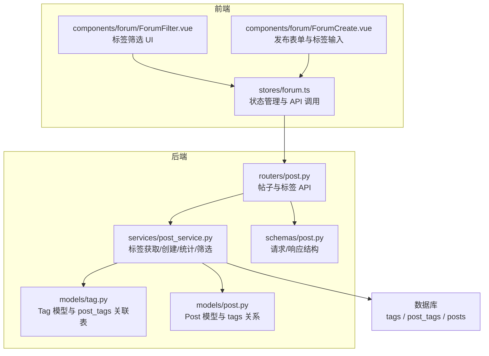
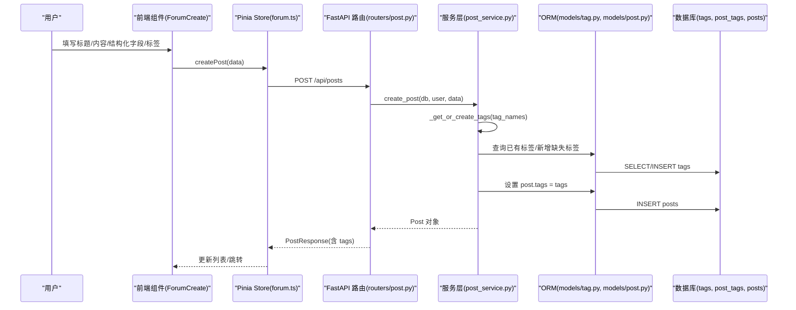
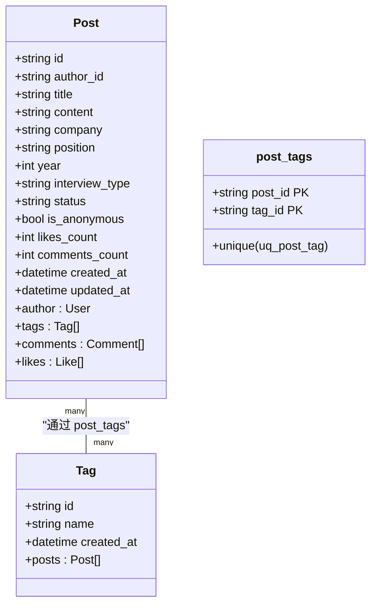
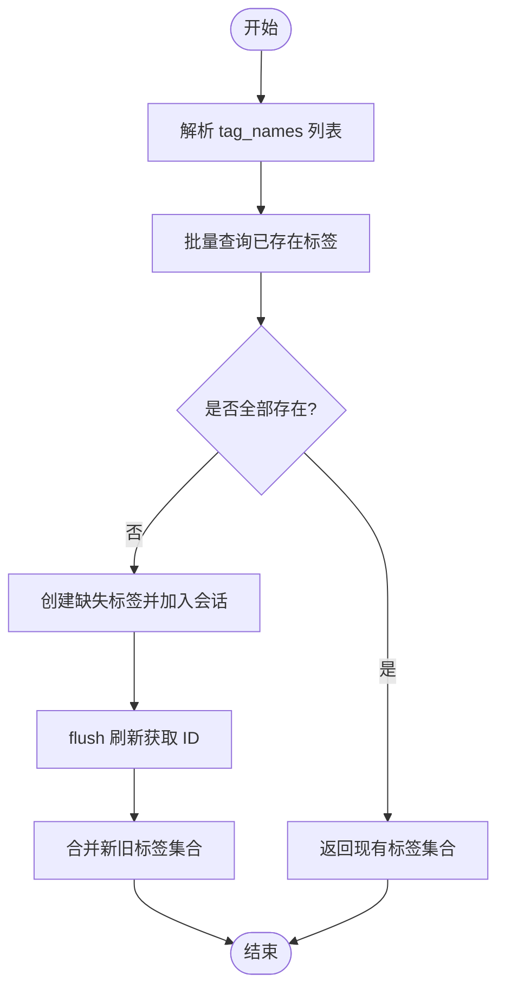
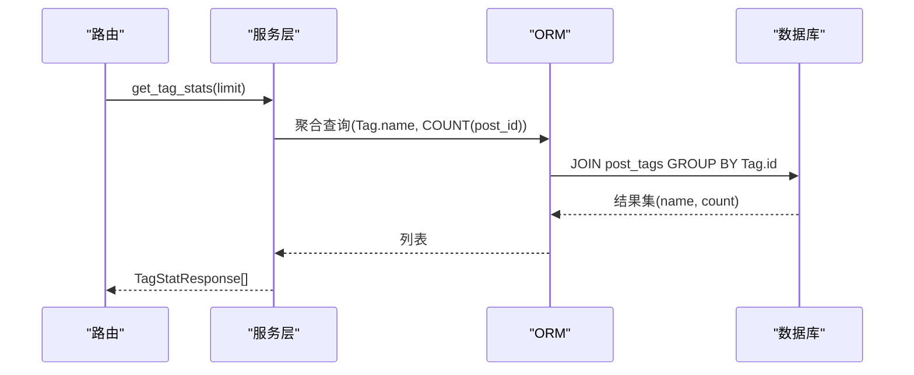
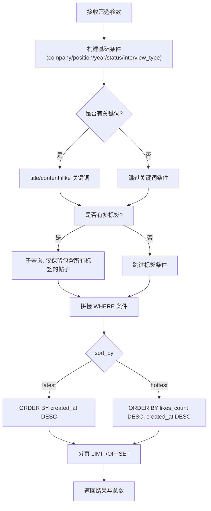
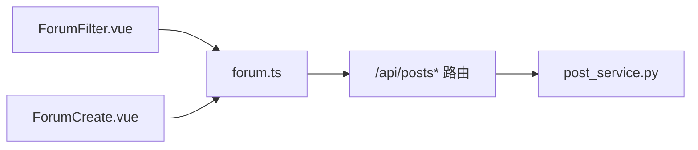
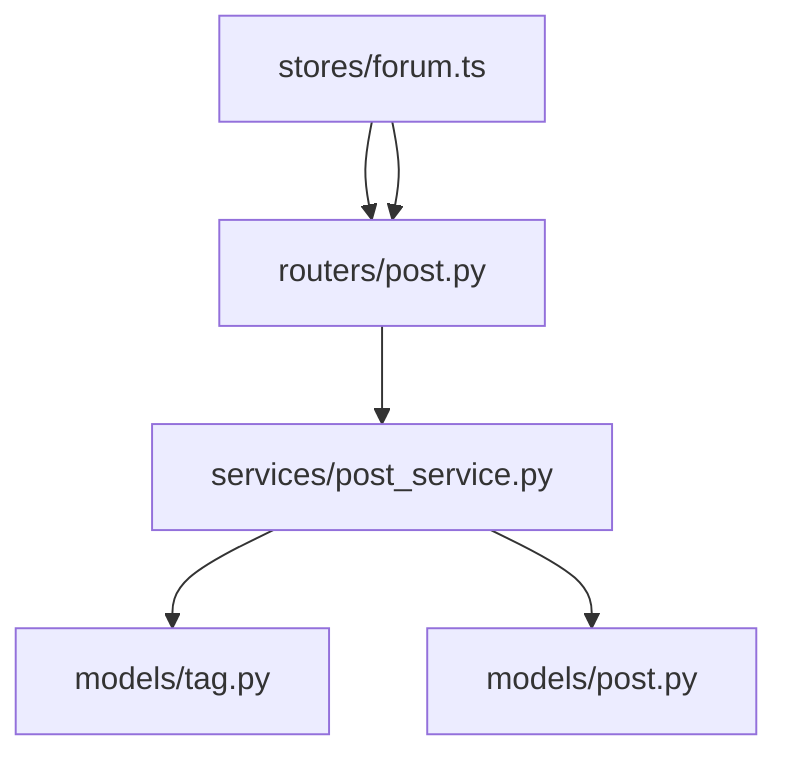

# 标签分类系统

<cite>
**本文引用的文件**
- [tag.py](file://backEnd/app/models/tag.py)
- [post.py](file://backEnd/app/models/post.py)
- [post_service.py](file://backEnd/app/services/post_service.py)
- [post.py](file://backEnd/app/routers/post.py)
- [post.py](file://backEnd/app/schemas/post.py)
- [ForumFilter.vue](file://frontEnd/src/components/forum/ForumFilter.vue)
- [ForumCreate.vue](file://frontEnd/src/components/forum/ForumCreate.vue)
- [forum.ts](file://frontEnd/src/stores/forum.ts)
- [hr_interview.sql](file://hr_interview.sql)
</cite>

## 目录
1. [简介](#简介)
2. [项目结构](#项目结构)
3. [核心组件](#核心组件)
4. [架构总览](#架构总览)
5. [详细组件分析](#详细组件分析)
6. [依赖关系分析](#依赖关系分析)
7. [性能考虑](#性能考虑)
8. [故障排查指南](#故障排查指南)
9. [结论](#结论)
10. [附录](#附录)

## 简介
本技术文档围绕 HR XF 项目的“标签分类系统”，聚焦于 Tag 数据模型与 post_tags 关联表的设计、多对多关系的实现与优化策略，以及标签的创建、管理、删除、去重、自动补全、批量操作等能力。同时文档化标签与帖子的关联机制（分配、自动分类、标签云生成）、筛选与搜索（多标签组合查询、权重计算、排序）、前端标签组件（选择器、过滤器 UI、响应式），并提供标签统计与分析、SEO 与 URL 生成的最佳实践建议。

## 项目结构
后端采用 FastAPI + SQLAlchemy 异步 ORM，标签相关的数据模型、服务层与路由分别位于 models、services、routers；前端使用 Vue 3 + Pinia，标签筛选与发布表单在 components 与 stores 中实现。

图表来源
- [tag.py:18-46](file://backEnd/app/models/tag.py#L18-L46)
- [post.py:18-65](file://backEnd/app/models/post.py#L18-L65)
- [post_service.py:14-249](file://backEnd/app/services/post_service.py#L14-L249)
- [post.py](file://backEnd/app/routers/post.py)
- [post.py](file://backEnd/app/schemas/post.py)
- [ForumFilter.vue](file://frontEnd/src/components/forum/ForumFilter.vue)
- [ForumCreate.vue](file://frontEnd/src/components/forum/ForumCreate.vue)
- [forum.ts](file://frontEnd/src/stores/forum.ts)

章节来源
- [tag.py:18-46](file://backEnd/app/models/tag.py#L18-L46)
- [post.py:18-65](file://backEnd/app/models/post.py#L18-L65)
- [post_service.py:14-249](file://backEnd/app/services/post_service.py#L14-L249)
- [post.py](file://backEnd/app/routers/post.py)
- [post.py](file://backEnd/app/schemas/post.py)
- [ForumFilter.vue](file://frontEnd/src/components/forum/ForumFilter.vue)
- [ForumCreate.vue](file://frontEnd/src/components/forum/ForumCreate.vue)
- [forum.ts](file://frontEnd/src/stores/forum.ts)

## 核心组件
- 数据模型
  - Tag：包含唯一名称、创建时间，提供与 Post 的多对多关系。
  - Post：通过 secondary="post_tags" 与 Tag 建立多对多关系。
- 关联表
  - post_tags：复合主键 (post_id, tag_id)，并含唯一约束避免重复关联。
- 服务层
  - 标签获取或创建：按名称批量去重后返回或新建。
  - 帖子列表筛选：支持公司、岗位、年份、状态、面试类型、关键词与多标签组合筛选。
  - 热门标签统计：按标签计数降序返回，用于标签云。
- 路由层
  - 帖子 CRUD、点赞、评论、分享、筛选选项与标签统计接口。
- 前端
  - 筛选面板：展示热门标签及计数，支持多选过滤。
  - 发布表单：支持手动添加、建议标签、去重校验。
  - Store：构建查询参数、发起 API 请求、维护本地状态。

章节来源
- [tag.py:18-46](file://backEnd/app/models/tag.py#L18-L46)
- [post.py:18-65](file://backEnd/app/models/post.py#L18-L65)
- [post_service.py:14-249](file://backEnd/app/services/post_service.py#L14-L249)
- [post.py](file://backEnd/app/routers/post.py)
- [ForumFilter.vue](file://frontEnd/src/components/forum/ForumFilter.vue)
- [ForumCreate.vue](file://frontEnd/src/components/forum/ForumCreate.vue)
- [forum.ts](file://frontEnd/src/stores/forum.ts)

## 架构总览
以下序列图展示了“发布面经并分配标签”的端到端流程，包括标签去重与自动创建、多对多关联写入、响应组装与前端渲染。

图表来源
- [post.py](file://backEnd/app/routers/post.py)
- [post_service.py:70-93](file://backEnd/app/services/post_service.py#L70-L93)
- [post_service.py:14-34](file://backEnd/app/services/post_service.py#L14-L34)
- [tag.py:18-46](file://backEnd/app/models/tag.py#L18-L46)
- [post.py:18-65](file://backEnd/app/models/post.py#L18-L65)

## 详细组件分析

### 数据模型与多对多关系
- Tag 模型
  - id：UUID 主键
  - name：唯一索引，保证标签名全局唯一
  - created_at：默认当前时间
  - posts：通过 secondary=post_tags 与 Post 建立多对多关系
- Post 模型
  - tags：secondary="post_tags"，lazy="selectin" 提升 N+1 查询性能
- post_tags 关联表
  - 复合主键 (post_id, tag_id)
  - 唯一约束 uq_post_tag 防止重复关联
  - ondelete=CASCADE 级联删除，确保数据一致性

图表来源
- [tag.py:18-46](file://backEnd/app/models/tag.py#L18-L46)
- [post.py:18-65](file://backEnd/app/models/post.py#L18-L65)

章节来源
- [tag.py:18-46](file://backEnd/app/models/tag.py#L18-L46)
- [post.py:18-65](file://backEnd/app/models/post.py#L18-L65)

### 标签创建与管理（去重、自动补全、批量）
- 标签去重与自动创建
  - 服务层根据传入的 tag_names 批量查询已存在标签，未存在的则插入新标签，最后 flush 刷新以获取持久化 ID。
- 自动补全与建议
  - 前端发布表单内置常用标签建议集，用户可一键添加；输入框回车添加，重复时前端去重。
- 批量操作
  - 发布时一次性提交多个标签名，后端统一处理，减少往返次数。

图表来源
- [post_service.py:14-34](file://backEnd/app/services/post_service.py#L14-L34)
- [ForumCreate.vue](file://frontEnd/src/components/forum/ForumCreate.vue)

章节来源
- [post_service.py:14-34](file://backEnd/app/services/post_service.py#L14-L34)
- [ForumCreate.vue](file://frontEnd/src/components/forum/ForumCreate.vue)

### 标签与帖子的关联机制（分配、自动分类、标签云）
- 标签分配
  - 创建帖子时，若提供 tag_names，则调用 _get_or_create_tags 获取或创建标签，并将 post.tags 设置为该集合。
- 自动分类（建议）
  - 可在服务层扩展基于关键词或内容的规则引擎，将匹配到的标签自动附加到帖子（当前代码未实现，可作为增强点）。
- 标签云生成
  - 通过 get_tag_stats 聚合每个标签的帖子数量，按 count 降序返回，前端渲染为标签云。

图表来源
- [post_service.py:226-236](file://backEnd/app/services/post_service.py#L226-L236)
- [post.py](file://backEnd/app/routers/post.py)

章节来源
- [post_service.py:70-93](file://backEnd/app/services/post_service.py#L70-L93)
- [post_service.py:226-236](file://backEnd/app/services/post_service.py#L226-L236)

### 标签筛选与搜索（多标签组合、权重、排序）
- 多标签组合查询
  - 通过子查询 join Tag 并按 tag_names 分组，having(count == len(tag_names)) 实现“必须包含所有指定标签”的交集筛选。
- 关键词搜索
  - 对标题与正文进行不区分大小写的模糊匹配（ilike）。
- 排序
  - latest：按创建时间倒序
  - hottest：按点赞数倒序，再按创建时间倒序
- 权重计算（建议）
  - 当前未实现复杂权重，可按 likes_count、created_at、标签热度等加权评分，作为排序依据。

图表来源
- [post_service.py:96-166](file://backEnd/app/services/post_service.py#L96-L166)

章节来源
- [post_service.py:96-166](file://backEnd/app/services/post_service.py#L96-L166)

### 前端标签组件（选择器、过滤器 UI、响应式设计）
- 筛选面板（ForumFilter.vue）
  - 展示热门标签及其计数，支持多选切换；提供关键词、公司、岗位、年份、状态、面试类型、排序等筛选项。
  - 响应式布局：弹性区域吸收剩余空间，滚动条承载大量标签。
- 发布表单（ForumCreate.vue）
  - 支持手动输入标签、回车添加、建议标签一键添加、重复校验。
- Store（forum.ts）
  - buildQueryString 将 filters 转为 URL 参数，包括 tags 逗号分隔。
  - fetchPosts/fetchTagStats/fetchFilterOptions 负责数据加载与错误处理。

图表来源
- [ForumFilter.vue](file://frontEnd/src/components/forum/ForumFilter.vue)
- [ForumCreate.vue](file://frontEnd/src/components/forum/ForumCreate.vue)
- [forum.ts](file://frontEnd/src/stores/forum.ts)
- [post.py](file://backEnd/app/routers/post.py)
- [post_service.py](file://backEnd/app/services/post_service.py)

章节来源
- [ForumFilter.vue](file://frontEnd/src/components/forum/ForumFilter.vue)
- [ForumCreate.vue](file://frontEnd/src/components/forum/ForumCreate.vue)
- [forum.ts](file://frontEnd/src/stores/forum.ts)

### 标签统计与分析（热门标签、趋势、偏好识别）
- 热门标签
  - 后端提供 /api/posts/tags/stats，返回标签名与计数，供前端渲染标签云。
- 趋势分析（建议）
  - 可扩展按时间窗口统计标签增长量，结合 likes_count 变化率，形成趋势指标。
- 用户偏好识别（建议）
  - 记录用户对标签的选择与浏览行为，计算个人偏好向量，用于推荐排序。

章节来源
- [post.py](file://backEnd/app/routers/post.py)
- [post_service.py:226-236](file://backEnd/app/services/post_service.py#L226-L236)
- [forum.ts](file://frontEnd/src/stores/forum.ts)

### SEO 与 URL 生成最佳实践（建议）
- 静态化与缓存
  - 对热门帖子与标签页生成静态 HTML，配合 CDN 缓存提升首屏速度。
- URL 设计
  - 使用语义化路径，如 /forum/tag/{tag_name}、/forum/company/{company}/position/{position}，便于搜索引擎抓取。
- 元信息
  - 页面 meta 描述包含公司、岗位、年份、标签等关键词，提高相关性。
- 结构化数据
  - 使用 JSON-LD 标注文章、作者、发布时间、标签等信息，利于富摘要展示。

[本节为通用指导，不涉及具体文件]

## 依赖关系分析
- 模块耦合
  - routers/post.py 依赖 services/post_service.py；services 依赖 models/tag.py、models/post.py；前端 store 依赖路由 API。
- 外部依赖
  - FastAPI、SQLAlchemy 异步 ORM、Pydantic 模型校验。
- 潜在循环依赖
  - 当前未发现循环导入；Tag 与 Post 通过 secondary 表解耦。

图表来源
- [post.py](file://backEnd/app/routers/post.py)
- [post_service.py](file://backEnd/app/services/post_service.py)
- [tag.py](file://backEnd/app/models/tag.py)
- [post.py](file://backEnd/app/models/post.py)
- [forum.ts](file://frontEnd/src/stores/forum.ts)

章节来源
- [post.py](file://backEnd/app/routers/post.py)
- [post_service.py](file://backEnd/app/services/post_service.py)
- [tag.py](file://backEnd/app/models/tag.py)
- [post.py](file://backEnd/app/models/post.py)
- [forum.ts](file://frontEnd/src/stores/forum.ts)

## 性能考虑
- 查询优化
  - 多标签筛选使用子查询与 having 聚合，避免多次 JOIN 导致笛卡尔积膨胀。
  - Post.tags 使用 lazy="selectin" 减少 N+1 查询。
- 索引与约束
  - tags.name 唯一索引；post_tags 复合主键与唯一约束保障写入效率与一致性。
- 分页与限制
  - 列表接口支持 page/size 分页；标签统计支持 limit 控制返回规模。
- 前端优化
  - 构建查询字符串集中发送，减少网络往返；标签云按需加载。

章节来源
- [post_service.py:96-166](file://backEnd/app/services/post_service.py#L96-L166)
- [post.py:18-65](file://backEnd/app/models/post.py#L18-L65)
- [tag.py:18-46](file://backEnd/app/models/tag.py#L18-L46)
- [forum.ts](file://frontEnd/src/stores/forum.ts)

## 故障排查指南
- 标签重复
  - 检查 tags.name 唯一约束冲突；确认 _get_or_create_tags 的去重逻辑与 flush 时机。
- 多标签筛选无结果
  - 验证 tag_names 是否为空数组；确认子查询 having(count == len(tag_names)) 的条件是否正确。
- 标签云为空
  - 检查 /api/posts/tags/stats 接口是否被调用；确认 post_tags 是否存在有效记录。
- 前端标签未生效
  - 查看 buildQueryString 是否正确拼接 tags 参数；确认 ForumFilter 的 toggleTag 事件是否触发。

章节来源
- [post_service.py:14-34](file://backEnd/app/services/post_service.py#L14-L34)
- [post_service.py:96-166](file://backEnd/app/services/post_service.py#L96-L166)
- [post_service.py:226-236](file://backEnd/app/services/post_service.py#L226-L236)
- [forum.ts](file://frontEnd/src/stores/forum.ts)
- [ForumFilter.vue](file://frontEnd/src/components/forum/ForumFilter.vue)

## 结论
本系统的标签分类方案以轻量、清晰的多对多关系为核心，通过服务层去重与批量处理、路由层聚合统计与筛选、前端交互友好地实现了标签的创建、管理与使用。后续可在自动分类、权重排序、趋势分析与 SEO 方面持续增强，以提升用户体验与平台价值。

## 附录
- 数据库结构参考
  - tags 表：id、name、created_at，name 唯一索引
  - post_tags 表：post_id、tag_id 复合主键，唯一约束
  - posts 表：与 tags 通过 post_tags 关联

章节来源
- [hr_interview.sql:552-572](file://hr_interview.sql#L552-L572)