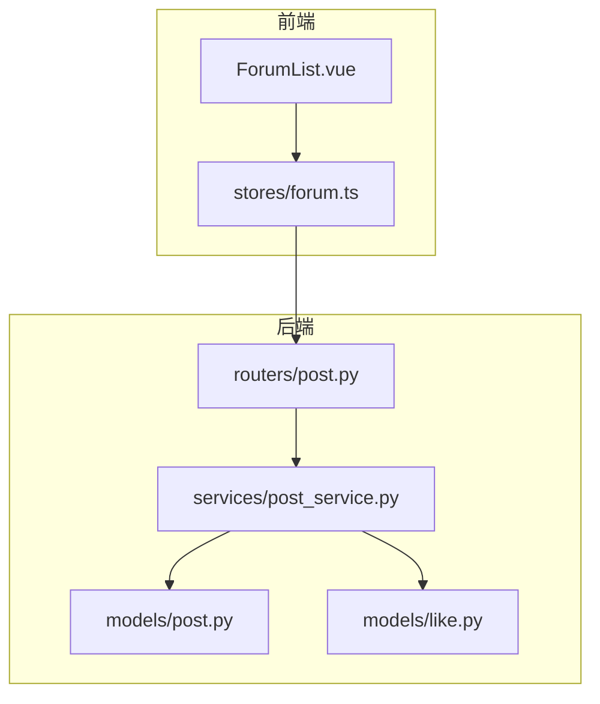
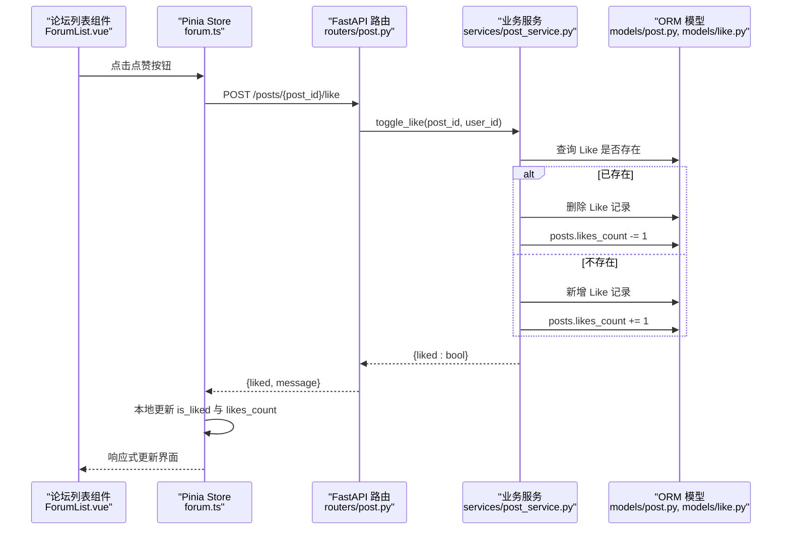
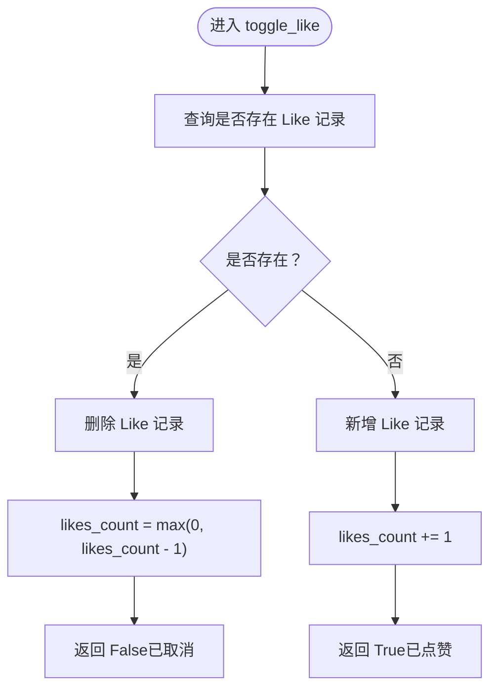
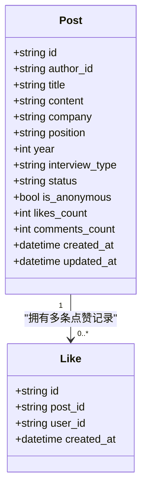
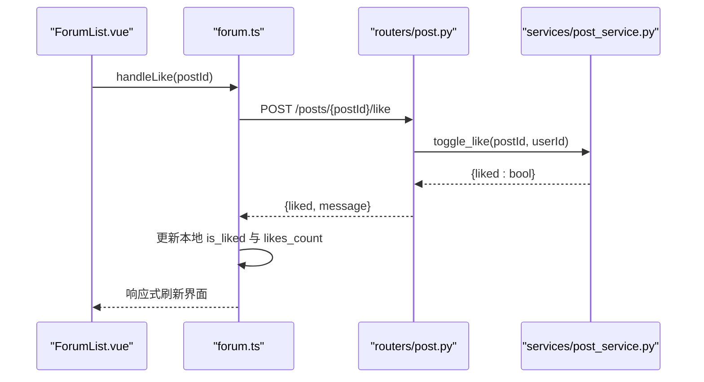
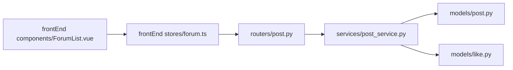

# 社交功能

<cite>
**本文引用的文件**   
- [like.py](file://backEnd/app/models/like.py)
- [post.py](file://backEnd/app/models/post.py)
- [post_service.py](file://backEnd/app/services/post_service.py)
- [post.py](file://backEnd/app/routers/post.py)
- [post.py](file://backEnd/app/schemas/post.py)
- [forum.ts](file://frontEnd/src/stores/forum.ts)
- [ForumList.vue](file://frontEnd/src/components/forum/ForumList.vue)
</cite>

## 目录
1. [简介](#简介)
2. [项目结构](#项目结构)
3. [核心组件](#核心组件)
4. [架构总览](#架构总览)
5. [详细组件分析](#详细组件分析)
6. [依赖关系分析](#依赖关系分析)
7. [性能与一致性](#性能与一致性)
8. [故障排查指南](#故障排查指南)
9. [结论](#结论)
10. [附录](#附录)

## 简介
本技术文档聚焦 HR XF 的社交功能，围绕“点赞”机制展开，覆盖数据模型设计、业务逻辑实现、前后端交互流程、计数更新策略、排序与统计等。当前仓库已实现点赞与取消点赞、列表批量判断是否已赞、热门排序（按点赞数）、标签统计等能力；收藏/收藏夹、通知系统、社交图谱分析与推荐算法在现有代码中未找到直接实现，将在相应章节说明现状并提供扩展建议。

## 项目结构
后端采用 FastAPI + SQLAlchemy 异步 ORM，前端使用 Vue 3 + Pinia。社交相关的关键路径如下：
- 数据模型：帖子 Post、点赞 Like
- 路由层：帖子 CRUD、点赞切换、评论、分享
- 服务层：帖子查询、点赞切换、用户点赞状态批量检查、标签统计
- 前端 Store：帖子列表加载、点赞切换、评论操作、筛选与分页

图表来源
- [post.py:1-249](file://backEnd/app/routers/post.py#L1-L249)
- [post_service.py:1-249](file://backEnd/app/services/post_service.py#L1-L249)
- [post.py:1-65](file://backEnd/app/models/post.py#L1-L65)
- [like.py:1-47](file://backEnd/app/models/like.py#L1-L47)
- [forum.ts:1-315](file://frontEnd/src/stores/forum.ts#L1-L315)
- [ForumList.vue:1-244](file://frontEnd/src/components/forum/ForumList.vue#L1-L244)

章节来源
- [post.py:1-249](file://backEnd/app/routers/post.py#L1-L249)
- [post_service.py:1-249](file://backEnd/app/services/post_service.py#L1-L249)
- [post.py:1-65](file://backEnd/app/models/post.py#L1-L65)
- [like.py:1-47](file://backEnd/app/models/like.py#L1-L47)
- [forum.ts:1-315](file://frontEnd/src/stores/forum.ts#L1-L315)
- [ForumList.vue:1-244](file://frontEnd/src/components/forum/ForumList.vue#L1-L244)

## 核心组件
- 数据模型
  - 帖子 Post：包含作者、标题、内容、结构化字段（公司、岗位、年份、面试类型、状态）、匿名标记、点赞数、评论数、时间戳等。
  - 点赞 Like：记录用户对某帖子的点赞，通过唯一约束保证同一用户对同一帖子仅能点赞一次。
- 路由接口
  - 帖子列表与详情：支持多条件筛选、关键词搜索、排序（最新/最热）、分页；返回时附带 is_liked 标识。
  - 点赞切换：POST /api/posts/{post_id}/like，返回 liked 布尔值与消息。
- 服务逻辑
  - toggle_like：根据是否存在该用户的点赞记录进行插入或删除，并同步更新 posts.likes_count。
  - check_user_likes：批量检查当前用户对一组帖子的点赞状态，用于列表渲染。
  - get_posts：组合筛选、标签过滤、热门排序（按 likes_count 降序）。
- 前端交互
  - stores/forum.ts：封装 API 请求，维护帖子列表与当前帖子状态，本地乐观更新点赞状态与计数。
  - ForumList.vue：触发点赞、展示点赞数与是否已赞、评论数、分享按钮等。

章节来源
- [post.py:1-65](file://backEnd/app/models/post.py#L1-L65)
- [like.py:1-47](file://backEnd/app/models/like.py#L1-L47)
- [post.py:162-177](file://backEnd/app/routers/post.py#L162-L177)
- [post_service.py:189-224](file://backEnd/app/services/post_service.py#L189-L224)
- [forum.ts:188-208](file://frontEnd/src/stores/forum.ts#L188-L208)
- [ForumList.vue:102-118](file://frontEnd/src/components/forum/ForumList.vue#L102-L118)

## 架构总览
点赞功能的端到端调用链如下：

图表来源
- [post.py:162-177](file://backEnd/app/routers/post.py#L162-L177)
- [post_service.py:189-209](file://backEnd/app/services/post_service.py#L189-L209)
- [post.py:46-65](file://backEnd/app/models/post.py#L46-L65)
- [like.py:16-47](file://backEnd/app/models/like.py#L16-L47)
- [forum.ts:188-208](file://frontEnd/src/stores/forum.ts#L188-L208)
- [ForumList.vue:102-118](file://frontEnd/src/components/forum/ForumList.vue#L102-L118)

## 详细组件分析

### 数据模型设计与去重逻辑
- 点赞表 likes
  - 主键 id：UUID 字符串
  - post_id、user_id：外键分别关联 posts.id 与 users.id，均建索引
  - created_at：创建时间
  - 唯一约束 uq_like_post_user：(post_id, user_id)，确保同一用户对同一帖子仅能点赞一次
- 帖子表 posts
  - likes_count：整数，默认 0，用于快速展示点赞总数
  - comments_count：整数，默认 0
  - 其他字段包括作者、标题、内容、结构化字段、匿名标记、时间戳等

去重保障
- 数据库层面通过唯一约束防止重复点赞
- 服务层在切换点赞前先查询是否存在对应记录，再决定插入或删除

复杂度与影响
- 单条点赞操作的查询与写入均为 O(1)
- 列表批量判断是否已赞使用 in 子句，时间复杂度与 post_ids 数量线性相关

章节来源
- [like.py:16-47](file://backEnd/app/models/like.py#L16-L47)
- [post.py:46-65](file://backEnd/app/models/post.py#L46-L65)
- [post_service.py:189-224](file://backEnd/app/services/post_service.py#L189-L224)

### 点赞/取消点赞业务流程
- 路由层
  - POST /api/posts/{post_id}/like：需要认证用户，调用服务层切换点赞
  - 返回 {liked: boolean, message: string}
- 服务层
  - toggle_like：
    - 查询是否存在 (post_id, user_id) 的 Like 记录
    - 若存在则删除并递减 likes_count
    - 若不存在则新增并递增 likes_count
    - 若帖子不存在抛出异常
- 前端
  - stores/forum.ts 的 toggleLike：
    - 发起请求后，根据服务端返回的 liked 更新本地 is_liked 与 likes_count
    - 同时更新当前帖子视图的状态，保持列表与详情页一致

图表来源
- [post_service.py:189-209](file://backEnd/app/services/post_service.py#L189-L209)

章节来源
- [post.py:162-177](file://backEnd/app/routers/post.py#L162-L177)
- [post_service.py:189-209](file://backEnd/app/services/post_service.py#L189-L209)
- [forum.ts:188-208](file://frontEnd/src/stores/forum.ts#L188-L208)

### 列表批量判断与热门排序
- 批量判断是否已赞
  - check_user_likes：对传入的 post_ids 与当前 user_id 执行批量查询，返回已点赞的 post_id 集合
  - 列表接口在返回前调用此方法，并在构建响应时填充 is_liked 字段
- 热门排序
  - sort_by=hottest：按 likes_count 降序，其次按 created_at 降序
  - 列表接口支持 latest/hottest 两种排序

图表来源
- [post.py:18-65](file://backEnd/app/models/post.py#L18-L65)
- [like.py:16-47](file://backEnd/app/models/like.py#L16-L47)

章节来源
- [post.py:63-105](file://backEnd/app/routers/post.py#L63-L105)
- [post_service.py:96-166](file://backEnd/app/services/post_service.py#L96-L166)
- [post_service.py:212-224](file://backEnd/app/services/post_service.py#L212-L224)

### 前端交互与状态同步
- ForumList.vue
  - 展示点赞图标与计数，根据 is_liked 切换样式
  - 点击触发 handleLike -> forumStore.toggleLike
- stores/forum.ts
  - toggleLike 成功后，立即更新本地 posts 与 currentPost 的 is_liked 与 likes_count
  - 错误处理：捕获异常并返回 false，不改变本地状态

图表来源
- [ForumList.vue:102-118](file://frontEnd/src/components/forum/ForumList.vue#L102-L118)
- [forum.ts:188-208](file://frontEnd/src/stores/forum.ts#L188-L208)
- [post.py:162-177](file://backEnd/app/routers/post.py#L162-L177)
- [post_service.py:189-209](file://backEnd/app/services/post_service.py#L189-L209)

章节来源
- [ForumList.vue:102-118](file://frontEnd/src/components/forum/ForumList.vue#L102-L118)
- [forum.ts:188-208](file://frontEnd/src/stores/forum.ts#L188-L208)

### 收藏/收藏夹功能现状与建议
- 现状
  - 在当前代码库中未发现收藏/收藏夹相关的模型、路由或服务实现
- 建议扩展方向
  - 新增 Bookmark 模型：记录用户与帖子的收藏关系，可加 unique(user_id, post_id)
  - 新增路由：获取收藏列表、添加/移除收藏、清空收藏
  - 前端新增收藏页面与状态管理，支持收藏列表组织（如文件夹/标签）
  - 与点赞类似，提供批量判断是否已收藏、计数更新与排序（收藏数）

[本节为概念性扩展建议，不涉及具体源码]

### 通知系统集成现状与建议
- 现状
  - 当前代码库未实现针对点赞或评论的通知推送机制
- 建议扩展方向
  - 新增 Notification 模型：记录通知类型（点赞、评论、系统消息）、目标用户、关联对象、已读状态、创建时间
  - 在点赞/评论服务中插入通知记录，并通过 WebSocket/SSE 推送至前端
  - 前端增加通知中心与角标提示，支持已读/未读切换与历史查看

[本节为概念性扩展建议，不涉及具体源码]

### 社交图谱分析与推荐算法现状与建议
- 现状
  - 当前代码库未实现社交图谱分析、兴趣匹配或推荐算法
- 建议扩展方向
  - 基于点赞/评论行为构建用户-帖子二部图，计算相似度与社区发现
  - 引入标签共现矩阵与 TF-IDF/Embedding 进行兴趣匹配
  - 结合协同过滤与内容推荐，生成个性化帖子推荐列表
  - 提供后台任务定期更新推荐结果，前端按需拉取

[本节为概念性扩展建议，不涉及具体源码]

## 依赖关系分析
- 路由层依赖服务层，服务层依赖模型层
- 列表接口在服务层完成筛选、排序与计数聚合，路由层负责参数校验与响应组装
- 前端 Store 封装统一请求与错误处理，组件仅负责触发与展示

图表来源
- [post.py:1-249](file://backEnd/app/routers/post.py#L1-L249)
- [post_service.py:1-249](file://backEnd/app/services/post_service.py#L1-L249)
- [post.py:1-65](file://backEnd/app/models/post.py#L1-L65)
- [like.py:1-47](file://backEnd/app/models/like.py#L1-L47)
- [forum.ts:1-315](file://frontEnd/src/stores/forum.ts#L1-L315)
- [ForumList.vue:1-244](file://frontEnd/src/components/forum/ForumList.vue#L1-L244)

章节来源
- [post.py:1-249](file://backEnd/app/routers/post.py#L1-L249)
- [post_service.py:1-249](file://backEnd/app/services/post_service.py#L1-L249)
- [post.py:1-65](file://backEnd/app/models/post.py#L1-L65)
- [like.py:1-47](file://backEnd/app/models/like.py#L1-L47)
- [forum.ts:1-315](file://frontEnd/src/stores/forum.ts#L1-L315)
- [ForumList.vue:1-244](file://frontEnd/src/components/forum/ForumList.vue#L1-L244)

## 性能与一致性
- 计数更新策略
  - 直接在 posts.likes_count 上增减，避免每次统计都聚合点赞表，提升列表与详情读取性能
  - 注意并发场景下的竞态问题，建议在高频点赞场景下引入 Redis 计数器或原子自增
- 去重与幂等
  - 数据库唯一约束保证幂等性，服务层先查后写，减少无效写入
- 批量判断优化
  - 列表接口一次性查询用户已点赞的 post_id 集合，避免 N+1 查询
- 排序与索引
  - 热门排序依赖 likes_count 与 created_at，建议为这两个字段建立复合索引以优化排序性能
- 事务与一致性
  - 当前服务层在同一会话内完成删除/插入与计数更新，但未见显式事务包裹；在高并发下可能出现短暂不一致
  - 建议将关键写入操作放入事务，或使用数据库级原子操作（如增量更新）

[本节为通用性能建议，不涉及具体源码片段]

## 故障排查指南
- 常见错误
  - 帖子不存在：toggle_like 会抛出异常，路由层转换为 404
  - 权限不足：删除帖子/评论时非作者访问会返回 403
- 前端错误处理
  - stores/forum.ts 的 apiRequest 统一处理非 2xx 响应，抛出错误信息供组件显示
  - toggleLike 捕获异常并返回 false，避免本地状态被错误更新
- 调试建议
  - 检查路由参数与认证头是否正确传递
  - 确认数据库唯一约束未被破坏，避免重复点赞导致计数异常
  - 观察列表接口返回的 is_liked 是否与预期一致

章节来源
- [post.py:147-160](file://backEnd/app/routers/post.py#L147-L160)
- [post_service.py:176-186](file://backEnd/app/services/post_service.py#L176-L186)
- [forum.ts:81-100](file://frontEnd/src/stores/forum.ts#L81-L100)
- [forum.ts:188-208](file://frontEnd/src/stores/forum.ts#L188-L208)

## 结论
HR XF 的社交功能当前实现了完善的点赞机制：数据模型具备去重约束，服务层提供幂等的切换逻辑，列表接口支持批量判断与热门排序，前端实现乐观更新与错误处理。收藏/收藏夹、通知系统与社交图谱推荐尚未实现，可按建议逐步扩展。在性能与一致性方面，建议引入原子计数与事务控制，进一步优化高并发场景下的体验。

## 附录
- 接口定义参考
  - 帖子列表：GET /api/posts?company=&position=&year=&status=&interview_type=&tags=&keyword=&sort_by=&page=&size=
  - 帖子详情：GET /api/posts/{post_id}
  - 点赞切换：POST /api/posts/{post_id}/like
  - 标签统计：GET /api/posts/tags/stats
  - 筛选选项：GET /api/posts/filters/options

章节来源
- [post.py:52-128](file://backEnd/app/routers/post.py#L52-L128)
- [post.py:131-145](file://backEnd/app/routers/post.py#L131-L145)
- [post.py:162-177](file://backEnd/app/routers/post.py#L162-L177)
- [post.py:108-114](file://backEnd/app/routers/post.py#L108-L114)
- [post.py:117-128](file://backEnd/app/routers/post.py#L117-L128)