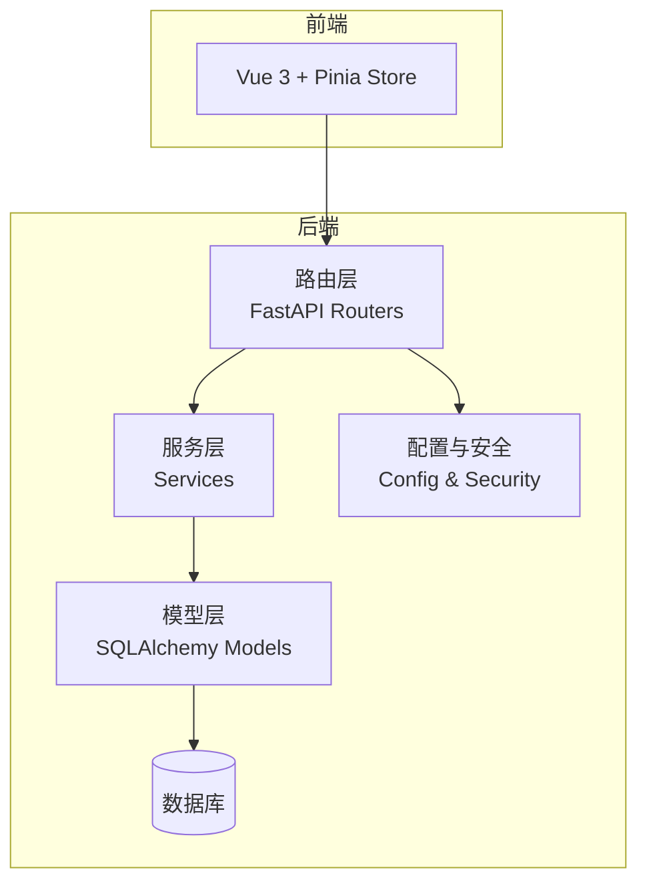
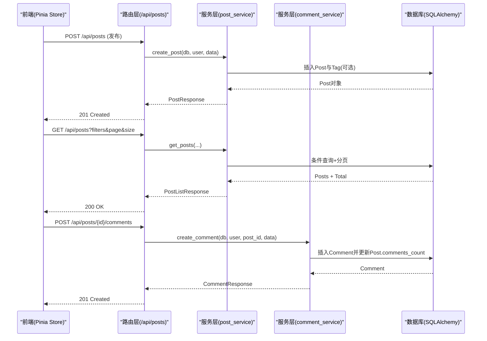
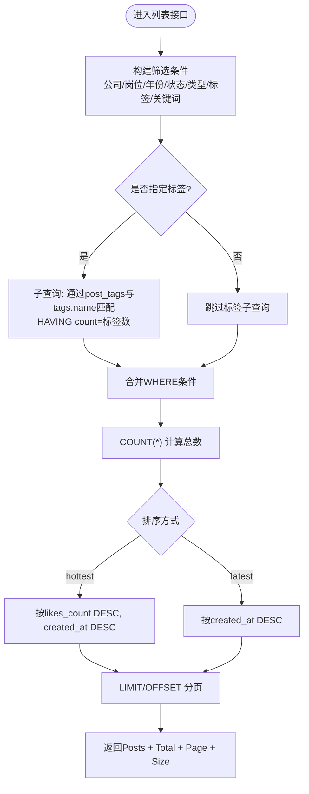
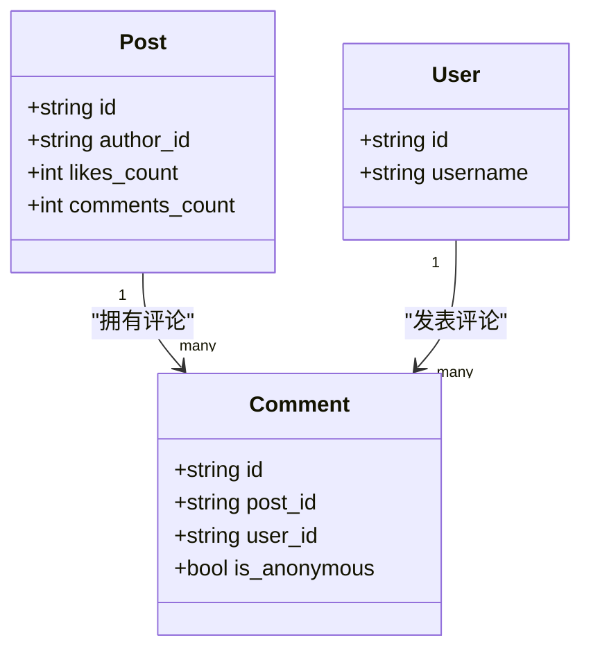
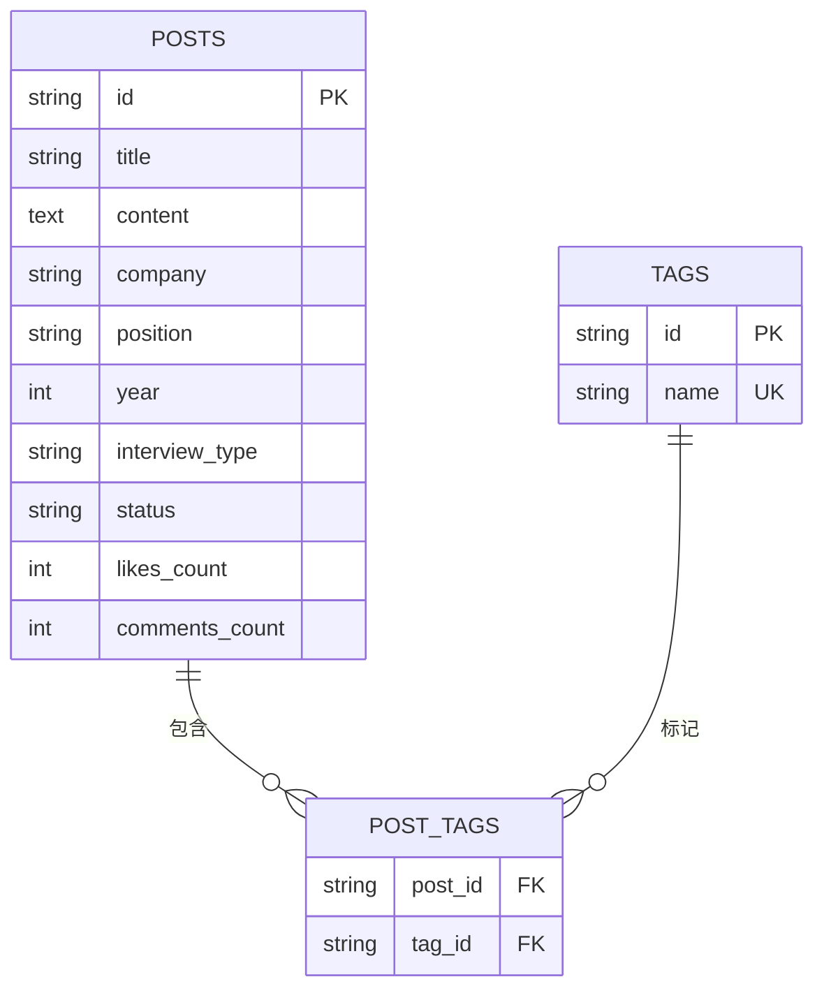
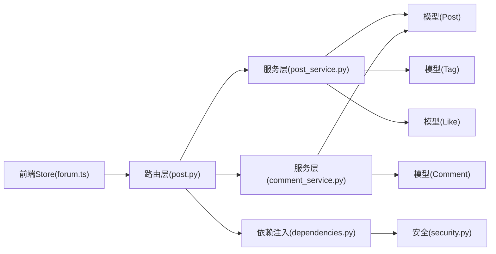

# 社区论坛系统

<cite>
**本文引用的文件**   
- [main.py](file://backEnd/app/main.py)
- [post.py](file://backEnd/app/models/post.py)
- [comment.py](file://backEnd/app/models/comment.py)
- [tag.py](file://backEnd/app/models/tag.py)
- [like.py](file://backEnd/app/models/like.py)
- [user.py](file://backEnd/app/models/user.py)
- [post_service.py](file://backEnd/app/services/post_service.py)
- [comment_service.py](file://backEnd/app/services/comment_service.py)
- [post.py](file://backEnd/app/routers/post.py)
- [admin.py](file://backEnd/app/routers/admin.py)
- [dependencies.py](file://backEnd/app/dependencies.py)
- [security.py](file://backEnd/app/utils/security.py)
- [post.py](file://backEnd/app/schemas/post.py)
- [forum.ts](file://frontEnd/src/stores/forum.ts)
</cite>

## 目录
1. [简介](#简介)
2. [项目结构](#项目结构)
3. [核心组件](#核心组件)
4. [架构总览](#架构总览)
5. [详细组件分析](#详细组件分析)
6. [依赖关系分析](#依赖关系分析)
7. [性能与缓存优化](#性能与缓存优化)
8. [故障排查指南](#故障排查指南)
9. [结论](#结论)
10. [附录：扩展与运营工具开发指引](#附录扩展与运营工具开发指引)

## 简介
本技术文档面向HR XF社区论坛系统的开发者与运维人员，聚焦以下能力的设计与实现：帖子管理（发布、编辑、删除、搜索）、评论互动（嵌套评论、实时通知、审核）、标签分类（管理、自动分类、关联查询）、社交功能（点赞收藏、关注、消息通知）、内容安全（审核与敏感词过滤）、高性能查询与缓存策略、权限控制与安全管理，以及扩展与运营工具的开发指导。

## 项目结构
后端采用 FastAPI + SQLAlchemy 异步 ORM，分层清晰：路由层负责HTTP接口与鉴权，服务层封装业务逻辑与数据库操作，模型层定义数据表结构与关系，Schema层定义请求/响应校验。前端使用 Vue 3 + Pinia 进行状态管理与API调用。

图表来源
- [main.py:1-90](file://backEnd/app/main.py#L1-L90)
- [post.py](file://backEnd/app/routers/post.py)
- [post_service.py](file://backEnd/app/services/post_service.py)
- [post.py](file://backEnd/app/models/post.py)

章节来源
- [main.py:1-90](file://backEnd/app/main.py#L1-L90)

## 核心组件
- 帖子模型：包含作者、标题、正文、结构化字段（公司、岗位、年份、面试类型、状态）、匿名开关、计数统计、时间戳及与标签、评论、点赞的关系。
- 评论模型：支持匿名评论，记录创建/更新时间，并关联帖子与用户。
- 标签模型与多对多关系：通过中间表 post_tags 建立帖子与标签的关联，支持唯一约束避免重复。
- 点赞模型：保证用户对同一帖子的点赞唯一性，维护点赞计数。
- 用户模型：基础账户信息与个人资料字段。
- 路由与服务：提供帖子CRUD、筛选、分页、标签统计、评论CRUD、点赞切换等接口；服务层实现复杂查询、事务与一致性更新。
- 鉴权与安全：基于Bearer Token的依赖注入，JWT编解码与密码哈希验证。

章节来源
- [post.py:18-65](file://backEnd/app/models/post.py#L18-L65)
- [comment.py:17-53](file://backEnd/app/models/comment.py#L17-L53)
- [tag.py:18-46](file://backEnd/app/models/tag.py#L18-L46)
- [like.py:16-47](file://backEnd/app/models/like.py#L16-L47)
- [user.py:10-45](file://backEnd/app/models/user.py#L10-L45)
- [post.py:1-249](file://backEnd/app/routers/post.py#L1-L249)
- [post_service.py:1-249](file://backEnd/app/services/post_service.py#L1-L249)
- [comment_service.py:1-105](file://backEnd/app/services/comment_service.py#L1-L105)
- [dependencies.py:1-41](file://backEnd/app/dependencies.py#L1-L41)
- [security.py:1-48](file://backEnd/app/utils/security.py#L1-L48)

## 架构总览
系统以REST API为核心，前后端分离。前端通过Pinia Store发起请求，后端路由层解析参数、执行鉴权，调用服务层完成业务处理，并通过ORM访问数据库。静态资源（上传文件）通过挂载目录提供服务。

图表来源
- [post.py:52-105](file://backEnd/app/routers/post.py#L52-L105)
- [post_service.py:70-166](file://backEnd/app/services/post_service.py#L70-L166)
- [comment_service.py:28-79](file://backEnd/app/services/comment_service.py#L28-L79)

## 详细组件分析

### 帖子管理系统
- 发布：路由接收PostCreate，服务层创建Post并关联标签（若提供），返回PostResponse。
- 列表与搜索：支持公司、岗位、年份、状态、面试类型、标签组合筛选与关键词模糊匹配；支持按最新或热度排序；分页返回总数与页码信息。
- 详情：根据ID获取单条帖子，结合当前用户是否已点赞填充is_liked。
- 删除：仅作者可删，非作者抛出权限错误。
- 点赞：切换点赞状态，原子更新likes_count，确保幂等。
- 分享：生成分享链接（前端URL拼接）。

图表来源
- [post_service.py:96-166](file://backEnd/app/services/post_service.py#L96-L166)

章节来源
- [post.py:52-105](file://backEnd/app/routers/post.py#L52-L105)
- [post_service.py:70-166](file://backEnd/app/services/post_service.py#L70-L166)
- [schemas.post.PostCreate:11-27](file://backEnd/app/schemas/post.py#L11-L27)
- [schemas.post.PostResponse:29-49](file://backEnd/app/schemas/post.py#L29-L49)

### 评论互动系统
- 评论创建：校验帖子存在后插入Comment，并递增Post.comments_count。
- 评论列表：按时间升序分页返回。
- 评论删除：仅作者可删，删除时递减Post.comments_count。
- 嵌套评论：当前模型未实现parent_id自引用，暂不支持嵌套；可在Comment模型增加parent_id与children关系以实现树形结构。
- 实时通知：当前未实现WebSocket/SSE推送；可在评论创建后触发事件队列，由后台任务广播至在线用户。
- 评论审核：可在Comment模型增加status字段与审核流程，在创建时默认待审，管理员审核后显示。

图表来源
- [post.py:18-65](file://backEnd/app/models/post.py#L18-L65)
- [comment.py:17-53](file://backEnd/app/models/comment.py#L17-L53)
- [user.py:10-45](file://backEnd/app/models/user.py#L10-L45)

章节来源
- [comment_service.py:28-105](file://backEnd/app/services/comment_service.py#L28-L105)
- [post.py:182-231](file://backEnd/app/routers/post.py#L182-L231)

### 标签分类系统
- 标签管理：支持创建/获取标签统计；标签名唯一，避免重复。
- 自动分类：发布时可传入tag_names列表，服务层自动去重并关联到帖子。
- 关联查询：通过post_tags中间表进行多对多查询，支持精确匹配多个标签的组合筛选。

图表来源
- [tag.py:18-46](file://backEnd/app/models/tag.py#L18-L46)
- [post.py:60-65](file://backEnd/app/models/post.py#L60-L65)

章节来源
- [post_service.py:14-34](file://backEnd/app/services/post_service.py#L14-L34)
- [post.py:108-128](file://backEnd/app/routers/post.py#L108-L128)

### 社交功能（点赞、收藏、关注、消息）
- 点赞：提供toggle_like接口，确保用户对同一帖子的点赞唯一性，并同步更新likes_count。
- 收藏：当前未实现收藏模型与接口；可扩展Like模型为收藏关系，新增收藏计数与独立接口。
- 关注：当前未实现用户关注关系；可新增Follows表（follower_id, followee_id）与相关接口。
- 消息通知：当前未实现站内信或推送；可引入消息表与事件总线，在点赞/评论/关注时生成通知。

章节来源
- [like.py:16-47](file://backEnd/app/models/like.py#L16-L47)
- [post_service.py:189-224](file://backEnd/app/services/post_service.py#L189-L224)
- [post.py:165-177](file://backEnd/app/routers/post.py#L165-L177)

### 内容审核与敏感词过滤
- 现状：当前未内置敏感词过滤与审核流程。
- 建议方案：
  - 在Post/Comment模型增加status字段（草稿/待审/通过/拒绝）与reviewer_id、reviewed_at。
  - 在创建时默认“待审”，后台定时任务或人工审核通过后展示。
  - 敏感词过滤可在服务层插入正则或词典匹配，命中则标记为“拒绝”并记录原因。
  - 审计日志：记录敏感词命中与审核操作，便于追溯。

[本节为概念性设计，不直接分析具体文件]

### 用户权限控制与内容安全管理
- 认证：基于Bearer Token的依赖注入，解析JWT载荷并校验用户有效性。
- 授权：帖子/评论删除需作者身份；管理后台通过用户名/邮箱关键字段简易判定管理员。
- 安全：密码哈希使用bcrypt，JWT过期时间可配置；自定义验证异常处理器避免二进制输入导致的编码错误。

章节来源
- [dependencies.py:13-41](file://backEnd/app/dependencies.py#L13-L41)
- [security.py:18-48](file://backEnd/app/utils/security.py#L18-L48)
- [admin.py:26-34](file://backEnd/app/routers/admin.py#L26-L34)
- [main.py:76-84](file://backEnd/app/main.py#L76-L84)

## 依赖关系分析
- 路由层依赖服务层与依赖注入（数据库会话、当前用户）。
- 服务层依赖模型层与Pydantic Schema。
- 安全模块提供JWT编解码与密码哈希。
- 前端Store封装API请求，统一添加Authorization头。

图表来源
- [forum.ts:77-100](file://frontEnd/src/stores/forum.ts#L77-L100)
- [post.py:1-249](file://backEnd/app/routers/post.py#L1-L249)
- [post_service.py:1-249](file://backEnd/app/services/post_service.py#L1-L249)
- [comment_service.py:1-105](file://backEnd/app/services/comment_service.py#L1-L105)
- [dependencies.py:1-41](file://backEnd/app/dependencies.py#L1-L41)
- [security.py:1-48](file://backEnd/app/utils/security.py#L1-L48)

章节来源
- [forum.ts:115-315](file://frontEnd/src/stores/forum.ts#L115-L315)
- [post.py:1-249](file://backEnd/app/routers/post.py#L1-L249)

## 性能与缓存优化
- 索引优化：
  - 帖子：author_id、company、position、year、status、interview_type均建索引，提升筛选与聚合效率。
  - 评论：post_id、user_id建索引，加速按帖子与用户的查询。
  - 标签：name唯一索引，避免重复与加速匹配。
  - 点赞：post_id、user_id联合唯一约束与索引，保障幂等与快速查找。
- 查询优化：
  - 列表查询使用子查询与having精确匹配多标签组合，减少N+1问题。
  - 分页使用LIMIT/OFFSET，避免全量加载。
  - 批量检查用户点赞状态，一次查询集合，减少往返。
- 缓存策略（建议）：
  - 热点数据缓存：热门标签统计、筛选选项、帖子列表首屏结果可缓存至Redis，设置合理TTL。
  - 计数缓存：likes_count/comments_count可考虑写回延迟与异步更新，降低热点写入压力。
  - 全文检索：关键词搜索可引入Elasticsearch或数据库全文索引，替代ILIKE以提升性能。
  - 静态资源：uploads目录已通过StaticFiles挂载，生产环境建议使用CDN或对象存储。

[本节为通用优化建议，不直接分析具体文件]

## 故障排查指南
- 认证失败：
  - 检查Token是否携带且有效，依赖注入会返回401并提示无效凭据或用户被禁用。
- 权限错误：
  - 删除帖子/评论时若非作者将抛出权限错误，确认当前用户与资源归属。
- 验证异常：
  - 自定义异常处理器会移除input字段以避免二进制内容导致编码错误，查看detail中的安全错误信息。
- 数据库连接：
  - 启动生命周期中自动创建表并初始化种子数据，若连接失败请检查数据库配置与引擎状态。

章节来源
- [dependencies.py:13-41](file://backEnd/app/dependencies.py#L13-L41)
- [post_service.py:176-186](file://backEnd/app/services/post_service.py#L176-L186)
- [comment_service.py:82-105](file://backEnd/app/services/comment_service.py#L82-L105)
- [main.py:76-84](file://backEnd/app/main.py#L76-L84)

## 结论
该系统在后端实现了清晰的帖子与评论管理能力，配合标签系统与点赞机制，满足社区论坛的基础需求。鉴权与安全措施完善，具备可扩展性。建议在后续迭代中补充嵌套评论、审核与敏感词过滤、收藏与关注、实时通知与缓存优化，以提升用户体验与系统性能。

[本节为总结性内容，不直接分析具体文件]

## 附录：扩展与运营工具开发指引
- 扩展点
  - 模型扩展：在Comment增加parent_id实现嵌套评论；新增Follows、Favorites、Notifications等模型。
  - 服务层扩展：在post_service与comment_service中增加审核、收藏、关注、通知等业务逻辑。
  - 路由扩展：新增对应API端点，复用依赖注入与鉴权机制。
- 运营工具
  - 管理后台：现有admin路由提供用户与题目管理，可扩展帖子审核、敏感词管理、数据统计报表。
  - 任务队列：引入Celery或类似框架，处理异步任务（如通知发送、敏感词扫描、统计聚合）。
  - 监控与日志：接入APM与集中日志，追踪慢查询与异常路径。
- 最佳实践
  - 严格遵循Schema校验与错误处理规范。
  - 使用事务保证数据一致性（如点赞计数与点赞记录同步更新）。
  - 对外暴露稳定的API契约，前后端协同演进。

[本节为通用指导，不直接分析具体文件]