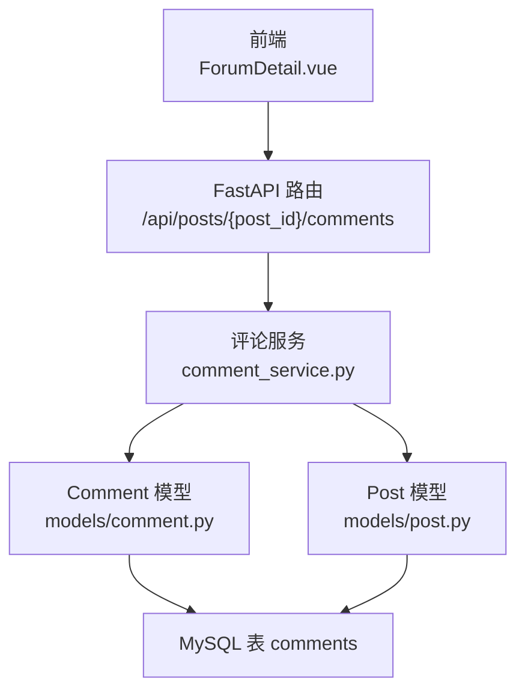
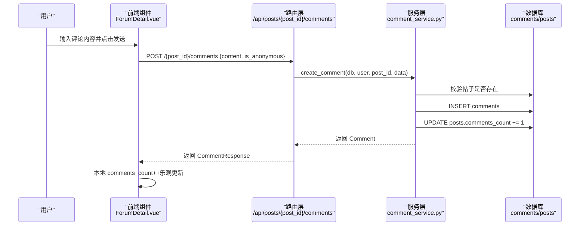
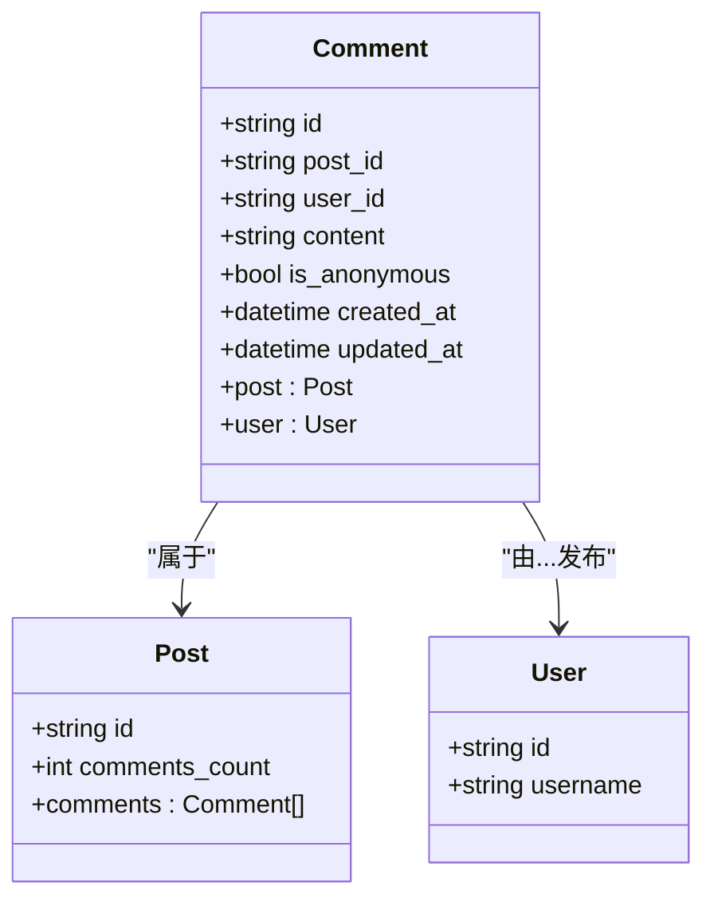
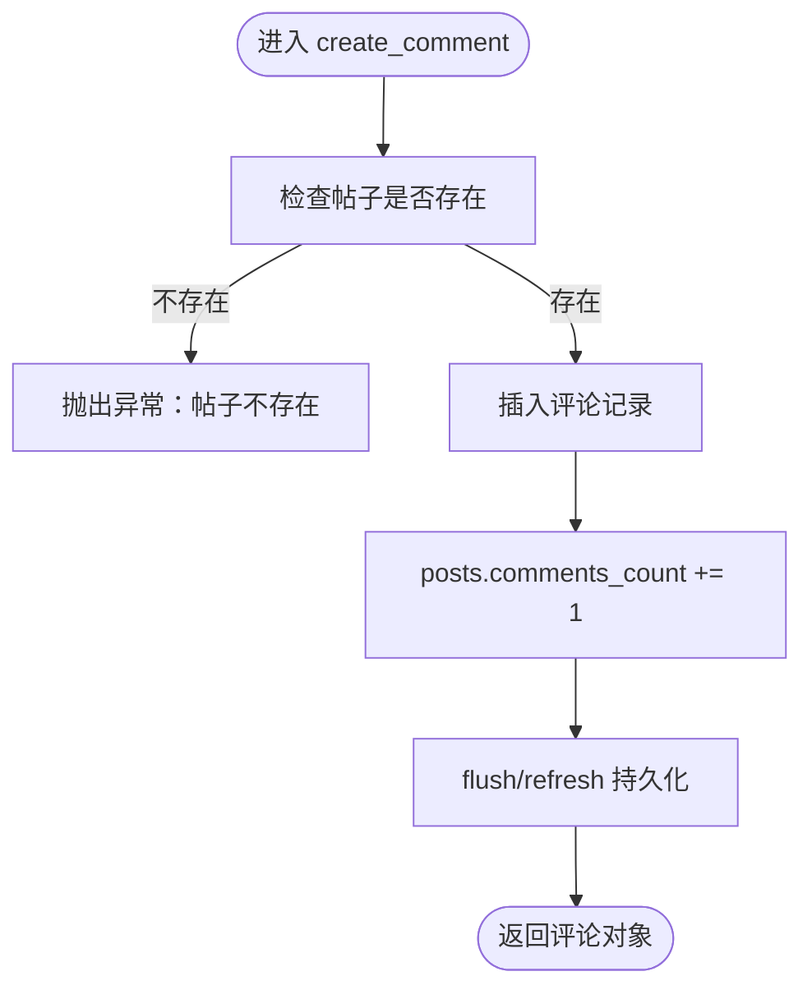
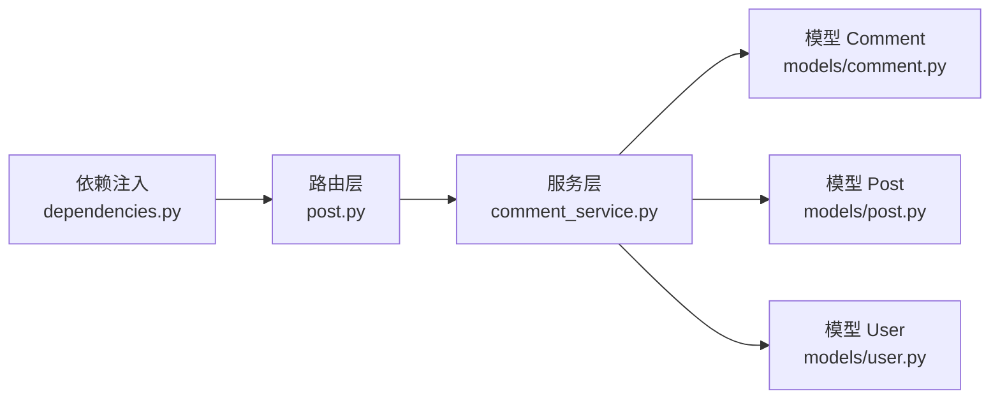

# 评论互动功能

<cite>
**本文引用的文件**
- [backEnd/app/models/comment.py](file://backEnd/app/models/comment.py)
- [backEnd/app/services/comment_service.py](file://backEnd/app/services/comment_service.py)
- [backEnd/app/schemas/post.py](file://backEnd/app/schemas/post.py)
- [backEnd/app/routers/post.py](file://backEnd/app/routers/post.py)
- [backEnd/app/models/user.py](file://backEnd/app/models/user.py)
- [backEnd/app/models/post.py](file://backEnd/app/models/post.py)
- [backEnd/app/dependencies.py](file://backEnd/app/dependencies.py)
- [hr_interview.sql](file://hr_interview.sql)
- [frontEnd/src/components/forum/ForumDetail.vue](file://frontEnd/src/components/forum/ForumDetail.vue)
</cite>

## 目录
1. [简介](#简介)
2. [项目结构](#项目结构)
3. [核心组件](#核心组件)
4. [架构总览](#架构总览)
5. [详细组件分析](#详细组件分析)
6. [依赖关系分析](#依赖关系分析)
7. [性能考虑](#性能考虑)
8. [故障排查指南](#故障排查指南)
9. [结论](#结论)
10. [附录](#附录)

## 简介
本技术文档围绕 HR XF 的“评论互动”能力，系统化梳理 Comment 数据模型、CRUD 流程、权限控制与前端交互。当前实现为“扁平评论列表”，未提供嵌套回复字段；同时实现了评论计数与帖子计数的联动更新、作者删除权限校验、匿名评论支持等关键特性。文档还给出可扩展方向（如多级回复、置顶、审核、搜索过滤、防刷与敏感词过滤）的实现建议与优化策略。

## 项目结构
后端采用 FastAPI + SQLAlchemy 异步 ORM，分层清晰：
- 路由层：定义 REST API，处理认证与参数校验
- 服务层：封装业务逻辑（创建/查询/删除评论，计数更新）
- 模型层：ORM 实体映射数据库表
- Schema 层：Pydantic 请求/响应模型
- 依赖注入：统一鉴权与用户解析

图表来源
- [backEnd/app/routers/post.py](file://backEnd/app/routers/post.py)
- [backEnd/app/services/comment_service.py](file://backEnd/app/services/comment_service.py)
- [backEnd/app/models/comment.py](file://backEnd/app/models/comment.py)
- [backEnd/app/models/post.py](file://backEnd/app/models/post.py)
- [hr_interview.sql](file://hr_interview.sql)

章节来源
- [backEnd/app/routers/post.py](file://backEnd/app/routers/post.py)
- [backEnd/app/services/comment_service.py](file://backEnd/app/services/comment_service.py)
- [backEnd/app/models/comment.py](file://backEnd/app/models/comment.py)
- [backEnd/app/models/post.py](file://backEnd/app/models/post.py)
- [hr_interview.sql](file://hr_interview.sql)

## 核心组件
- 数据模型
  - Comment：评论主键、所属帖子、作者、内容、匿名标记、时间戳、关联 Post/User
  - Post：包含 comments_count 冗余计数，用于快速展示
  - User：用户基础信息，用于显示作者名
- 服务层
  - create_comment：校验帖子存在、写入评论、原子递增 comments_count
  - get_comments：按帖子分页获取评论列表（按创建时间升序）
  - delete_comment：仅作者可删，删除后递减 comments_count
- 路由层
  - POST /{post_id}/comments：发表评论
  - GET /{post_id}/comments：分页获取评论
  - DELETE /comments/{comment_id}：删除评论（需登录且为作者）
- 前端
  - ForumDetail.vue：提交评论、切换匿名、展示评论列表、乐观更新评论数

章节来源
- [backEnd/app/models/comment.py](file://backEnd/app/models/comment.py)
- [backEnd/app/models/post.py](file://backEnd/app/models/post.py)
- [backEnd/app/models/user.py](file://backEnd/app/models/user.py)
- [backEnd/app/services/comment_service.py](file://backEnd/app/services/comment_service.py)
- [backEnd/app/routers/post.py](file://backEnd/app/routers/post.py)
- [frontEnd/src/components/forum/ForumDetail.vue](file://frontEnd/src/components/forum/ForumDetail.vue)

## 架构总览
评论相关的关键调用链如下：

图表来源
- [backEnd/app/routers/post.py](file://backEnd/app/routers/post.py)
- [backEnd/app/services/comment_service.py](file://backEnd/app/services/comment_service.py)
- [backEnd/app/models/post.py](file://backEnd/app/models/post.py)
- [frontEnd/src/components/forum/ForumDetail.vue](file://frontEnd/src/components/forum/ForumDetail.vue)

## 详细组件分析

### 数据模型设计（Comment）
- 字段说明
  - id：UUID 主键
  - post_id：外键指向 posts.id，级联删除
  - user_id：外键指向 users.id，级联删除
  - content：文本内容
  - is_anonymous：是否匿名
  - created_at/updated_at：自动维护的时间戳
- 索引与约束
  - 对 post_id、user_id 建立索引以加速查询
  - 外键约束保证引用完整性
- 关系
  - 与 Post 双向关系（back_populates）
  - 与 User 单向加载（selectin）

图表来源
- [backEnd/app/models/comment.py](file://backEnd/app/models/comment.py)
- [backEnd/app/models/post.py](file://backEnd/app/models/post.py)
- [backEnd/app/models/user.py](file://backEnd/app/models/user.py)

章节来源
- [backEnd/app/models/comment.py](file://backEnd/app/models/comment.py)
- [backEnd/app/models/post.py](file://backEnd/app/models/post.py)
- [backEnd/app/models/user.py](file://backEnd/app/models/user.py)
- [hr_interview.sql](file://hr_interview.sql)

### 评论增删改查（CRUD）
- 创建评论
  - 校验帖子存在
  - 插入评论记录
  - 原子递增 posts.comments_count
  - 返回 CommentResponse（含 author_name）
- 查询评论
  - 按 post_id 过滤
  - 按 created_at 升序排序
  - 分页：offset/limit
- 删除评论
  - 仅作者可删（user_id 校验）
  - 删除后 posts.comments_count 减一（不低于 0）
- 编辑评论
  - 当前未提供编辑接口；可在现有基础上扩展 PUT/PATCH 端点并在服务层增加权限校验与审计字段更新

图表来源
- [backEnd/app/services/comment_service.py](file://backEnd/app/services/comment_service.py)

章节来源
- [backEnd/app/services/comment_service.py](file://backEnd/app/services/comment_service.py)
- [backEnd/app/routers/post.py](file://backEnd/app/routers/post.py)

### 评论计数实时更新机制
- 当前方案
  - 在事务内直接更新 posts.comments_count，确保一致性
  - 前端收到成功响应后本地 comments_count++，提升体验
- 可选增强
  - 乐观锁：在 Post 表引入 version 字段，更新时比较版本号，避免并发覆盖
  - 异步更新：将计数变更放入消息队列，后台任务聚合更新，降低热点写放大
  - 缓存同步：Redis 中维护 post:comments_count，定时或事件驱动回源到数据库

章节来源
- [backEnd/app/services/comment_service.py](file://backEnd/app/services/comment_service.py)
- [backEnd/app/models/post.py](file://backEnd/app/models/post.py)
- [frontEnd/src/components/forum/ForumDetail.vue](file://frontEnd/src/components/forum/ForumDetail.vue)

### 嵌套评论系统（多级回复）
- 现状
  - 当前 Comment 表无 parent_id 字段，不支持嵌套回复
- 扩展建议
  - 新增 parent_id 自引用外键，构建评论树
  - 查询时根据 parent_id 组装层级结构，或使用递归 CTE 生成树
  - 限制最大深度与每层数量，避免过深渲染导致性能问题
  - 前端按需懒加载子评论，减少首屏负载

[本节为概念性扩展建议，不直接分析具体代码文件]

### 评论权限控制
- 作者权限
  - 删除接口要求登录，且仅允许评论作者本人删除
- 管理员权限
  - 当前未实现管理员强制删除/隐藏评论；可在路由层增加 admin 依赖，在服务层增加管理员操作分支
- 评论审核流程
  - 当前未实现审核状态；可新增 status 字段（待审/通过/拒绝），在创建时默认“待审”，管理员审核后改为“通过”再对外可见

章节来源
- [backEnd/app/routers/post.py](file://backEnd/app/routers/post.py)
- [backEnd/app/dependencies.py](file://backEnd/app/dependencies.py)

### 评论搜索与过滤
- 现状
  - 评论列表仅提供分页与按帖子过滤，未提供关键词搜索与多条件筛选
- 扩展建议
  - 全文检索：使用 MySQL 全文索引或外部搜索引擎（如 Elasticsearch）
  - 过滤维度：按时间范围、匿名/公开、作者等组合筛选
  - 排序策略：最新、最热（结合点赞/回复数）、最佳（评分/举报率）

[本节为概念性扩展建议，不直接分析具体代码文件]

### 安全措施（防刷、敏感词、举报）
- 防刷限流
  - 建议在网关或中间件层基于 IP/用户 ID 做速率限制（例如每分钟最多 N 条）
- 敏感词过滤
  - 在创建评论前进行内容清洗与敏感词匹配，命中则拒绝或转人工审核
- 举报处理
  - 新增举报记录表，支持用户举报与管理员处置（隐藏/删除/警告）

[本节为概念性扩展建议，不直接分析具体代码文件]

## 依赖关系分析
- 路由依赖
  - 使用 HTTPBearer 进行 Bearer Token 鉴权
  - 可选用户解析（_optional_user）用于非登录态场景
- 服务依赖
  - 依赖 AsyncSession 进行数据库访问
  - 依赖 Post/User 模型进行数据校验与展示
- 前端依赖
  - 调用后端评论接口，管理本地评论状态与计数

图表来源
- [backEnd/app/dependencies.py](file://backEnd/app/dependencies.py)
- [backEnd/app/routers/post.py](file://backEnd/app/routers/post.py)
- [backEnd/app/services/comment_service.py](file://backEnd/app/services/comment_service.py)
- [backEnd/app/models/comment.py](file://backEnd/app/models/comment.py)
- [backEnd/app/models/post.py](file://backEnd/app/models/post.py)
- [backEnd/app/models/user.py](file://backEnd/app/models/user.py)

章节来源
- [backEnd/app/dependencies.py](file://backEnd/app/dependencies.py)
- [backEnd/app/routers/post.py](file://backEnd/app/routers/post.py)
- [backEnd/app/services/comment_service.py](file://backEnd/app/services/comment_service.py)
- [backEnd/app/models/comment.py](file://backEnd/app/models/comment.py)
- [backEnd/app/models/post.py](file://backEnd/app/models/post.py)
- [backEnd/app/models/user.py](file://backEnd/app/models/user.py)

## 性能考虑
- 数据库层面
  - 利用已有索引（post_id、user_id）提升查询效率
  - 对 comments_count 的更新尽量在事务内完成，避免额外锁竞争
- 应用层面
  - 分页查询限制 size 上限，防止大结果集拖慢响应
  - 按需加载用户信息（selectin），避免 N+1 查询
- 前端层面
  - 乐观更新评论数，减少二次请求
  - 图片导出与渲染注意性能，必要时延迟加载

[本节为通用性能建议，不直接分析具体代码文件]

## 故障排查指南
- 常见问题
  - 401 未授权：Token 无效或过期，检查依赖注入中的鉴权流程
  - 403 权限不足：尝试删除他人评论，确认 user_id 校验逻辑
  - 404 资源不存在：评论或帖子 ID 不正确，检查路由参数与服务层查询
- 定位步骤
  - 查看路由层抛出的 HTTPException 与状态码
  - 检查服务层异常类型（ValueError/PermissionError）
  - 核对数据库外键约束与索引情况

章节来源
- [backEnd/app/routers/post.py](file://backEnd/app/routers/post.py)
- [backEnd/app/services/comment_service.py](file://backEnd/app/services/comment_service.py)
- [backEnd/app/dependencies.py](file://backEnd/app/dependencies.py)

## 结论
当前评论系统已具备基础的发布、分页浏览与作者删除能力，并通过冗余计数与前端乐观更新提升了用户体验。后续可按需扩展嵌套回复、审核流程、搜索过滤与安全策略，以满足更复杂的社区互动需求。

## 附录

### API 定义（评论相关）
- 发表评论
  - 方法：POST
  - 路径：/api/posts/{post_id}/comments
  - 请求体：{ content, is_anonymous }
  - 响应：CommentResponse
  - 状态码：201 Created / 404 Not Found / 401 Unauthorized
- 获取评论列表
  - 方法：GET
  - 路径：/api/posts/{post_id}/comments?page=1&size=20
  - 响应：CommentListResponse
  - 状态码：200 OK
- 删除评论
  - 方法：DELETE
  - 路径：/api/posts/comments/{comment_id}
  - 响应：204 No Content
  - 状态码：204 / 404 / 403

章节来源
- [backEnd/app/routers/post.py](file://backEnd/app/routers/post.py)
- [backEnd/app/schemas/post.py](file://backEnd/app/schemas/post.py)