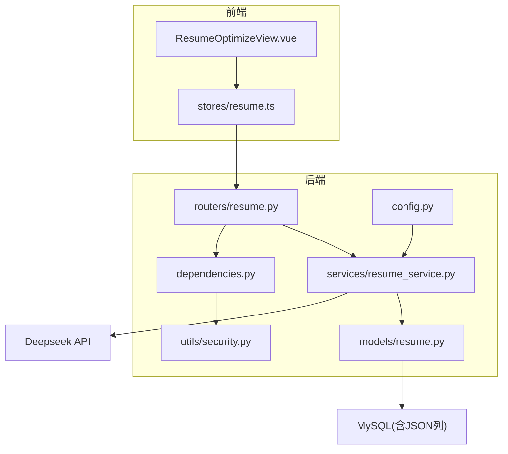
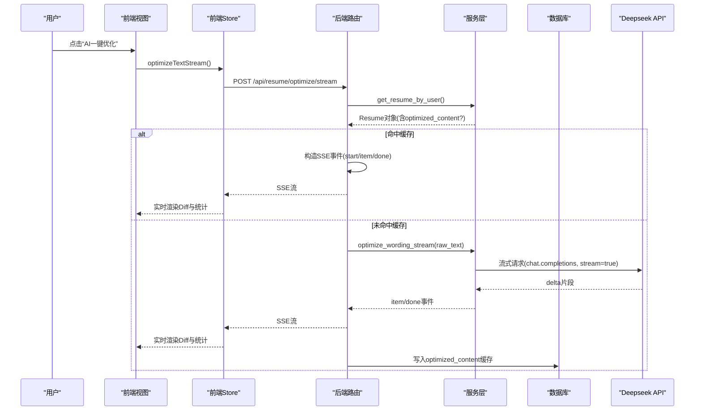
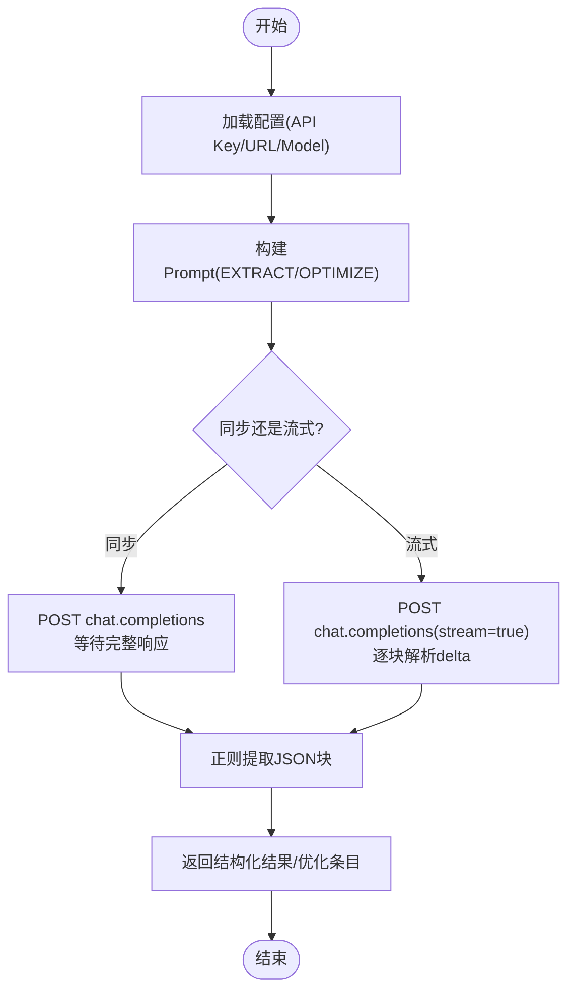
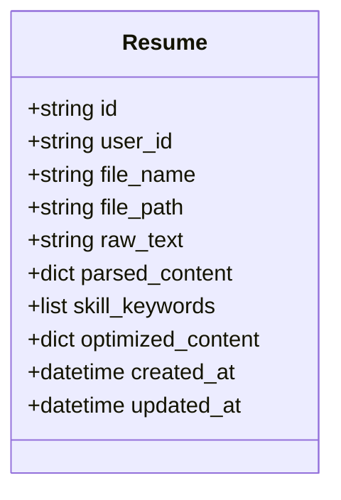
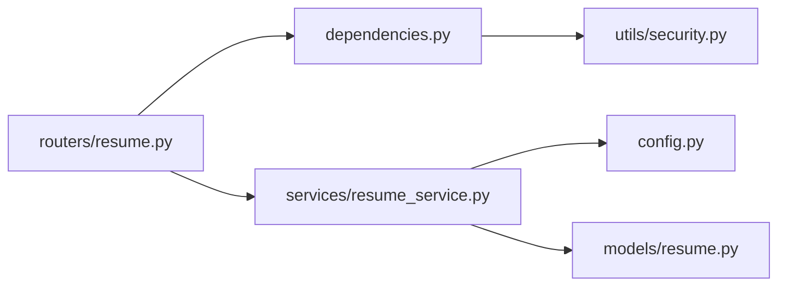

# AI优化建议

<cite>
**本文引用的文件**   
- [backEnd/app/routers/resume.py](file://backEnd/app/routers/resume.py)
- [backEnd/app/services/resume_service.py](file://backEnd/app/services/resume_service.py)
- [backEnd/app/models/resume.py](file://backEnd/app/models/resume.py)
- [backEnd/app/schemas/resume.py](file://backEnd/app/schemas/resume.py)
- [backEnd/app/config.py](file://backEnd/app/config.py)
- [backEnd/app/dependencies.py](file://backEnd/app/dependencies.py)
- [backEnd/app/utils/security.py](file://backEnd/app/utils/security.py)
- [frontEnd/src/views/ResumeOptimizeView.vue](file://frontEnd/src/views/ResumeOptimizeView.vue)
- [frontEnd/src/stores/resume.ts](file://frontEnd/src/stores/resume.ts)
- [hr_interview.sql](file://hr_interview.sql)
</cite>

## 目录
1. [简介](#简介)
2. [项目结构](#项目结构)
3. [核心组件](#核心组件)
4. [架构总览](#架构总览)
5. [详细组件分析](#详细组件分析)
6. [依赖关系分析](#依赖关系分析)
7. [性能与缓存](#性能与缓存)
8. [隐私与安全](#隐私与安全)
9. [故障排查指南](#故障排查指南)
10. [结论](#结论)

## 简介
本系统提供“简历AI优化建议”能力，覆盖以下关键目标：
- 内容质量评估：语言规范性检查、结构完整性分析、关键词密度统计（通过结构化提取与评分建议实现）
- 措辞优化机制：同义替换、句式重构、专业术语标准化（由Prompt工程驱动）
- 岗位匹配度分析：JD关键词匹配、技能缺口识别、经验相关性评估（基于结构化提取结果扩展）
- 个性化建议生成：行业趋势分析、竞争对比、改进优先级排序（在Prompt中注入策略）
- AI模型集成与Prompt工程：Deepseek API调用、流式输出、容错解析
- 优化结果缓存与版本对比：数据库持久化缓存、前端Diff展示
- 隐私保护与数据安全：认证鉴权、最小化传输、敏感字段落库控制

## 项目结构
后端采用FastAPI分层架构：路由层负责HTTP接口与参数校验；服务层封装业务逻辑与外部AI调用；数据模型使用SQLAlchemy ORM；配置集中管理。前端使用Vue+Pinia，提供上传、分析、优化与流式渲染界面。

图表来源
- [backEnd/app/routers/resume.py:1-215](file://backEnd/app/routers/resume.py#L1-L215)
- [backEnd/app/services/resume_service.py:1-285](file://backEnd/app/services/resume_service.py#L1-L285)
- [backEnd/app/models/resume.py:1-67](file://backEnd/app/models/resume.py#L1-L67)
- [backEnd/app/config.py:1-71](file://backEnd/app/config.py#L1-L71)
- [backEnd/app/dependencies.py:1-41](file://backEnd/app/dependencies.py#L1-L41)
- [backEnd/app/utils/security.py:1-48](file://backEnd/app/utils/security.py#L1-L48)
- [frontEnd/src/views/ResumeOptimizeView.vue:1-277](file://frontEnd/src/views/ResumeOptimizeView.vue#L1-L277)
- [frontEnd/src/stores/resume.ts:1-244](file://frontEnd/src/stores/resume.ts#L1-L244)

章节来源
- [backEnd/app/routers/resume.py:1-215](file://backEnd/app/routers/resume.py#L1-L215)
- [backEnd/app/services/resume_service.py:1-285](file://backEnd/app/services/resume_service.py#L1-L285)
- [backEnd/app/models/resume.py:1-67](file://backEnd/app/models/resume.py#L1-L67)
- [backEnd/app/config.py:1-71](file://backEnd/app/config.py#L1-L71)
- [backEnd/app/dependencies.py:1-41](file://backEnd/app/dependencies.py#L1-L41)
- [backEnd/app/utils/security.py:1-48](file://backEnd/app/utils/security.py#L1-L48)
- [frontEnd/src/views/ResumeOptimizeView.vue:1-277](file://frontEnd/src/views/ResumeOptimizeView.vue#L1-L277)
- [frontEnd/src/stores/resume.ts:1-244](file://frontEnd/src/stores/resume.ts#L1-L244)

## 核心组件
- 路由层
  - 获取配置、上传简历、触发结构化分析、同步/流式优化、PDF文本提取等接口
- 服务层
  - 简历CRUD、Deepseek API调用、结构化提取、措辞优化（同步与流式）、结果持久化
- 数据模型
  - 简历实体：原始文本、结构化结果、技能关键词、优化结果缓存、时间戳
- 前端视图与状态
  - 上传与解析、结构化报告展示、优化Diff对比、SSE流式渲染

章节来源
- [backEnd/app/routers/resume.py:1-215](file://backEnd/app/routers/resume.py#L1-L215)
- [backEnd/app/services/resume_service.py:1-285](file://backEnd/app/services/resume_service.py#L1-L285)
- [backEnd/app/models/resume.py:1-67](file://backEnd/app/models/resume.py#L1-L67)
- [frontEnd/src/views/ResumeOptimizeView.vue:1-277](file://frontEnd/src/views/ResumeOptimizeView.vue#L1-L277)
- [frontEnd/src/stores/resume.ts:1-244](file://frontEnd/src/stores/resume.ts#L1-L244)

## 架构总览
整体流程：前端上传或选择简历后，后端保存原始文本并可选进行结构化提取；用户点击“AI一键优化”，后端优先返回缓存，否则调用Deepseek进行措辞优化，支持流式推送；前端以Diff形式展示原文与优化后文本，并汇总统计指标。

图表来源
- [backEnd/app/routers/resume.py:100-192](file://backEnd/app/routers/resume.py#L100-L192)
- [backEnd/app/services/resume_service.py:186-285](file://backEnd/app/services/resume_service.py#L186-L285)
- [frontEnd/src/stores/resume.ts:161-207](file://frontEnd/src/stores/resume.ts#L161-L207)
- [frontEnd/src/views/ResumeOptimizeView.vue:215-260](file://frontEnd/src/views/ResumeOptimizeView.vue#L215-L260)

## 详细组件分析

### 内容质量评估算法
- 语言规范性检查：通过Prompt要求AI对表达进行规范化处理，提升动词专业性、量化成果、避免口语化表述
- 结构完整性分析：结构化提取包含工作经历、教育背景、技能关键词、总结与建议，便于后续分析与可视化
- 关键词密度统计：从结构化结果中提取skills列表，前端按出现顺序与权重生成词云；同时可结合skill_categories的percent字段进行分布统计

章节来源
- [backEnd/app/services/resume_service.py:88-113](file://backEnd/app/services/resume_service.py#L88-L113)
- [backEnd/app/services/resume_service.py:174-178](file://backEnd/app/services/resume_service.py#L174-L178)
- [frontEnd/src/views/ResumeView.vue:374-407](file://frontEnd/src/views/ResumeView.vue#L374-L407)

### 措辞优化机制
- 同义词替换与句式重构：Prompt明确要求增加量化指标、使用更专业的动词和表述、突出成果而非职责
- 专业术语标准化：通过system prompt统一角色设定，约束输出为JSON格式，确保一致性
- 输出结构：items数组包含original与optimized成对条目，stats包含优化条数、专业度提升、新增量化指标、综合评级

章节来源
- [backEnd/app/services/resume_service.py:115-138](file://backEnd/app/services/resume_service.py#L115-L138)
- [backEnd/app/services/resume_service.py:180-184](file://backEnd/app/services/resume_service.py#L180-L184)
- [backEnd/app/schemas/resume.py:31-35](file://backEnd/app/schemas/resume.py#L31-L35)

### 岗位匹配度分析（可扩展）
当前代码已具备结构化提取与技能关键词能力，可在Prompt中扩展以下维度：
- JD关键词匹配：在OPTIMIZE_PROMPT或EXTRACT_PROMPT中加入JD输入，让AI比对JD关键词并在suggestions中给出匹配度与建议
- 技能缺口识别：根据skills与JD关键词集合计算缺失项，形成改进建议
- 经验相关性评估：依据experiences中的role、company、period与JD要求进行相关性打分与建议

说明：该部分为概念性扩展，尚未在当前仓库中直接实现，但数据结构与API设计已预留空间。

[本节为概念性扩展说明，不直接分析具体文件]

### 个性化建议生成逻辑
- 行业趋势分析：在Prompt中注入行业关键词与趋势描述，引导AI给出针对性建议
- 竞争对比：结合候选人的技能分布与常见岗位要求，提示AI给出相对优势与短板
- 改进优先级排序：在suggestions中按type分类（warning/success/info），前端据此渲染不同颜色与图标，体现优先级

章节来源
- [backEnd/app/services/resume_service.py:88-113](file://backEnd/app/services/resume_service.py#L88-L113)
- [frontEnd/src/views/ResumeView.vue:397-407](file://frontEnd/src/views/ResumeView.vue#L397-L407)

### AI模型集成与Prompt工程
- 模型与端点：通过配置读取deepseek_api_url、deepseek_model、deepseek_api_key，拼接chat.completions端点
- 调用方式：同步调用call_deepseek与流式optimize_wording_stream两种模式
- Prompt模板：EXTRACT_PROMPT用于结构化提取，OPTIMIZE_PROMPT用于措辞优化
- 容错解析：兼容markdown code block包裹的JSON，流式模式下按大括号深度计数提取完整对象

图表来源
- [backEnd/app/services/resume_service.py:141-172](file://backEnd/app/services/resume_service.py#L141-L172)
- [backEnd/app/services/resume_service.py:186-285](file://backEnd/app/services/resume_service.py#L186-L285)
- [backEnd/app/config.py:34-38](file://backEnd/app/config.py#L34-L38)

章节来源
- [backEnd/app/services/resume_service.py:141-172](file://backEnd/app/services/resume_service.py#L141-L172)
- [backEnd/app/services/resume_service.py:186-285](file://backEnd/app/services/resume_service.py#L186-L285)
- [backEnd/app/config.py:34-38](file://backEnd/app/config.py#L34-L38)

### 优化结果缓存与版本对比
- 缓存策略：当resume.optimized_content存在时，直接返回缓存；否则调用AI并将结果写入数据库
- 失效条件：上传新简历会清空parsed_content、skill_keywords与optimized_content，保证结果与最新简历一致
- 前端对比：将original与optimized分别渲染为删除与新增行，底部显示统计信息（优化条数、专业度提升、新增量化指标、综合评级）

图表来源
- [backEnd/app/models/resume.py:11-67](file://backEnd/app/models/resume.py#L11-L67)
- [hr_interview.sql:445-456](file://hr_interview.sql#L445-L456)

章节来源
- [backEnd/app/routers/resume.py:100-137](file://backEnd/app/routers/resume.py#L100-L137)
- [backEnd/app/services/resume_service.py:40-69](file://backEnd/app/services/resume_service.py#L40-L69)
- [frontEnd/src/views/ResumeOptimizeView.vue:123-141](file://frontEnd/src/views/ResumeOptimizeView.vue#L123-L141)

### 前端交互与流式渲染
- 流式接收：前端通过Fetch读取SSE流，按data:行解析消息类型start/item/done
- 实时渲染：收到item即追加到左右两栏，done后更新统计面板
- 用户体验：首条item到达时关闭Loading弹窗，start事件更新提示文案

章节来源
- [frontEnd/src/stores/resume.ts:161-207](file://frontEnd/src/stores/resume.ts#L161-L207)
- [frontEnd/src/views/ResumeOptimizeView.vue:215-260](file://frontEnd/src/views/ResumeOptimizeView.vue#L215-L260)

## 依赖关系分析
- 路由依赖认证：所有简历相关接口均通过get_current_user进行Bearer Token校验
- 安全工具：JWT解码与密码哈希在security模块中实现
- 配置注入：服务层通过get_settings读取Deepseek相关配置

图表来源
- [backEnd/app/routers/resume.py:1-20](file://backEnd/app/routers/resume.py#L1-L20)
- [backEnd/app/dependencies.py:1-41](file://backEnd/app/dependencies.py#L1-L41)
- [backEnd/app/utils/security.py:1-48](file://backEnd/app/utils/security.py#L1-L48)
- [backEnd/app/services/resume_service.py:1-20](file://backEnd/app/services/resume_service.py#L1-L20)
- [backEnd/app/models/resume.py:1-10](file://backEnd/app/models/resume.py#L1-L10)
- [backEnd/app/config.py:1-20](file://backEnd/app/config.py#L1-L20)

章节来源
- [backEnd/app/routers/resume.py:1-20](file://backEnd/app/routers/resume.py#L1-L20)
- [backEnd/app/dependencies.py:1-41](file://backEnd/app/dependencies.py#L1-L41)
- [backEnd/app/utils/security.py:1-48](file://backEnd/app/utils/security.py#L1-L48)
- [backEnd/app/services/resume_service.py:1-20](file://backEnd/app/services/resume_service.py#L1-L20)
- [backEnd/app/models/resume.py:1-10](file://backEnd/app/models/resume.py#L1-L10)
- [backEnd/app/config.py:1-20](file://backEnd/app/config.py#L1-L20)

## 性能与缓存
- 缓存命中：若optimized_content存在，直接返回，避免重复AI调用
- 流式输出：SSE边生成边推送，降低首屏等待时间
- 失败不影响主流程：结构化提取失败不会阻断简历保存
- 超时设置：同步调用60秒，流式调用120秒，保障长任务稳定性

章节来源
- [backEnd/app/routers/resume.py:100-137](file://backEnd/app/routers/resume.py#L100-L137)
- [backEnd/app/services/resume_service.py:161-163](file://backEnd/app/services/resume_service.py#L161-L163)
- [backEnd/app/services/resume_service.py:207-209](file://backEnd/app/services/resume_service.py#L207-L209)

## 隐私与安全
- 认证鉴权：所有接口需携带有效Bearer Token，依赖get_current_user校验
- 令牌安全：JWT使用HS256算法与可配置过期时间，secret_key来自配置
- 最小化传输：仅传输必要字段，优化结果以JSON存储于数据库
- 文件存储：原始文件保存在uploads/resumes目录，路径记录于数据库，前端通过静态路径访问

章节来源
- [backEnd/app/dependencies.py:13-41](file://backEnd/app/dependencies.py#L13-L41)
- [backEnd/app/utils/security.py:26-48](file://backEnd/app/utils/security.py#L26-L48)
- [backEnd/app/config.py:20-24](file://backEnd/app/config.py#L20-L24)
- [backEnd/app/routers/resume.py:21-22](file://backEnd/app/routers/resume.py#L21-L22)

## 故障排查指南
- 未配置API Key：前端显示警告，后端接口返回400错误，需在.env中设置DEEPSEEK_API_KEY
- PDF文本提取失败：服务端抛出异常并返回500，检查文件格式与PyMuPDF环境
- AI分析失败：结构化提取或优化失败时返回500，查看日志与网络连通性
- 流式中断：SSE连接断开时前端应重试或回退至同步优化

章节来源
- [backEnd/app/routers/resume.py:89-97](file://backEnd/app/routers/resume.py#L89-L97)
- [backEnd/app/routers/resume.py:106-107](file://backEnd/app/routers/resume.py#L106-L107)
- [backEnd/app/routers/resume.py:195-214](file://backEnd/app/routers/resume.py#L195-L214)

## 结论
本系统实现了简历AI优化建议的核心闭环：上传与解析、结构化提取、措辞优化（同步与流式）、结果缓存与前端Diff展示。通过Prompt工程与Deepseek API集成，提供了语言规范、结构完整、关键词统计与优化建议的能力。未来可在Prompt中进一步注入JD与行业趋势，完善岗位匹配度分析与个性化建议生成。同时，系统已具备基础的安全与隐私保护措施，适合在生产环境中部署与扩展。