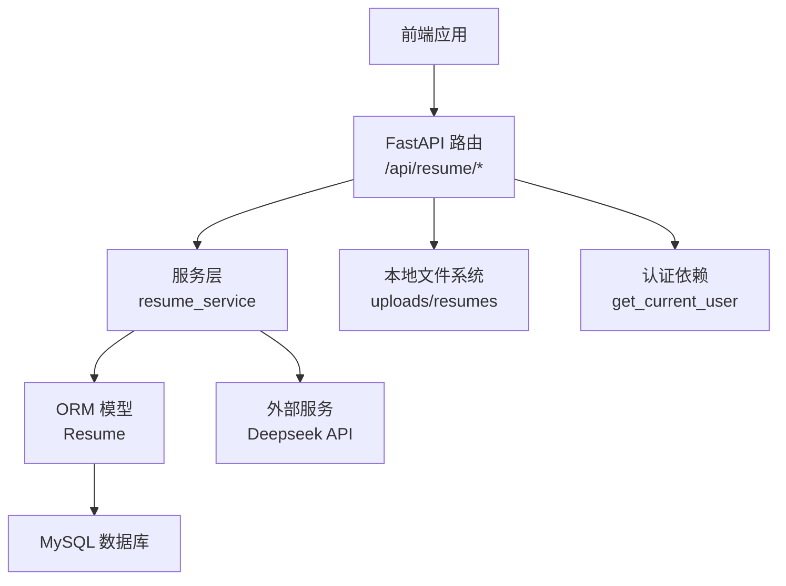
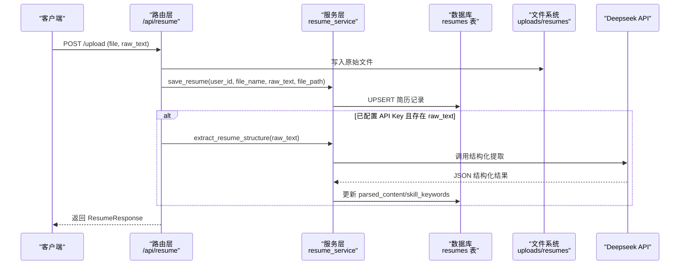
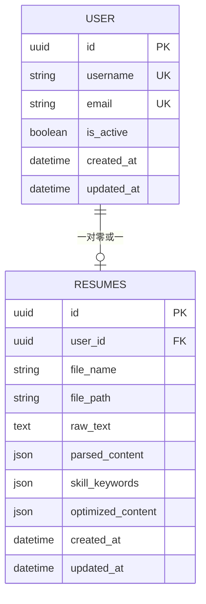
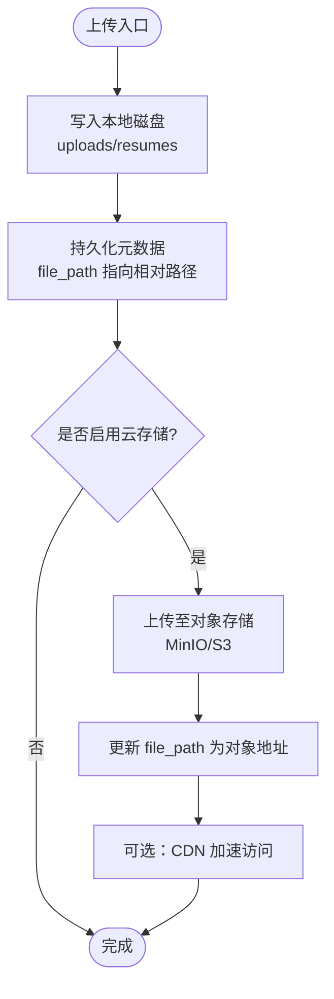
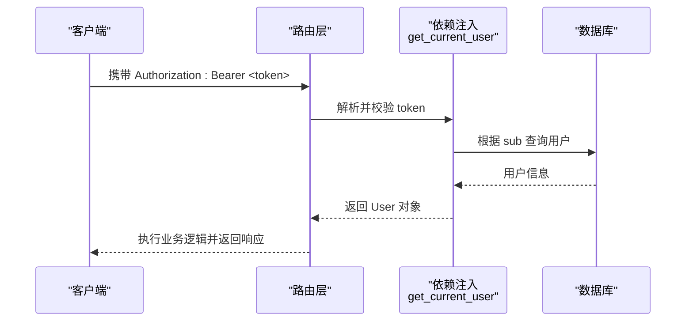
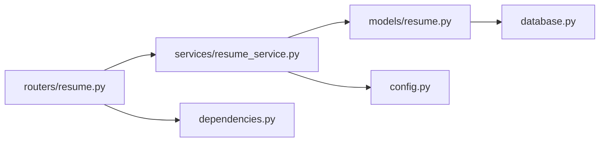
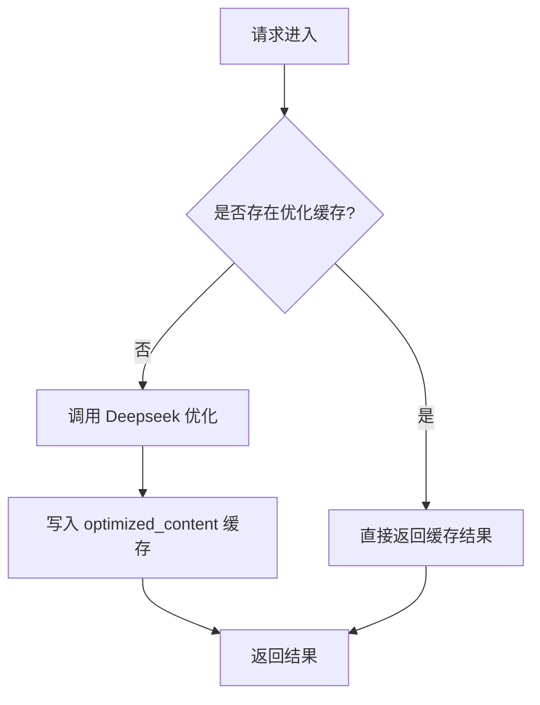

# 数据存储管理

<cite>
**本文引用的文件**
- [backEnd/app/models/resume.py](file://backEnd/app/models/resume.py)
- [backEnd/app/routers/resume.py](file://backEnd/app/routers/resume.py)
- [backEnd/app/schemas/resume.py](file://backEnd/app/schemas/resume.py)
- [backEnd/app/services/resume_service.py](file://backEnd/app/services/resume_service.py)
- [backEnd/app/config.py](file://backEnd/app/config.py)
- [backEnd/app/database.py](file://backEnd/app/database.py)
- [backEnd/app/dependencies.py](file://backEnd/app/dependencies.py)
- [backEnd/app/models/user.py](file://backEnd/app/models/user.py)
- [hr_interview.sql](file://hr_interview.sql)
</cite>

## 目录
1. [引言](#引言)
2. [项目结构](#项目结构)
3. [核心组件](#核心组件)
4. [架构总览](#架构总览)
5. [详细组件分析](#详细组件分析)
6. [依赖关系分析](#依赖关系分析)
7. [性能与缓存策略](#性能与缓存策略)
8. [版本控制与变更追踪](#版本控制与变更追踪)
9. [备份与恢复策略](#备份与恢复策略)
10. [数据迁移与升级方案](#数据迁移与升级方案)
11. [权限控制与访问审计](#权限控制与访问审计)
12. [最佳实践](#最佳实践)
13. [故障排查指南](#故障排查指南)
14. [结论](#结论)

## 引言
本文件围绕“简历数据存储管理”目标，系统化梳理 Resume 数据模型、文件存储架构、版本控制机制、备份恢复策略、数据迁移与升级、权限控制与访问审计、性能优化与缓存策略，并提供面向开发者的最佳实践指导。文档内容严格基于仓库现有实现进行归纳与扩展建议，确保可落地与可追溯。

## 项目结构
后端采用 FastAPI + SQLAlchemy（异步）+ MySQL 的架构，简历模块包含以下关键层次：
- 路由层：定义 RESTful API，处理上传、解析、优化等请求
- 服务层：封装业务逻辑，包括数据库 CRUD 与外部 AI 调用
- 模型层：ORM 映射到数据库表
- 配置层：集中管理数据库、MinIO、CORS、Deepseek 等配置
- 依赖注入：统一鉴权与数据库会话获取

图表来源
- [backEnd/app/routers/resume.py:1-215](file://backEnd/app/routers/resume.py#L1-L215)
- [backEnd/app/services/resume_service.py:1-285](file://backEnd/app/services/resume_service.py#L1-L285)
- [backEnd/app/models/resume.py:1-67](file://backEnd/app/models/resume.py#L1-L67)
- [backEnd/app/config.py:1-71](file://backEnd/app/config.py#L1-L71)
- [backEnd/app/dependencies.py:1-41](file://backEnd/app/dependencies.py#L1-L41)

章节来源
- [backEnd/app/routers/resume.py:1-215](file://backEnd/app/routers/resume.py#L1-L215)
- [backEnd/app/services/resume_service.py:1-285](file://backEnd/app/services/resume_service.py#L1-L285)
- [backEnd/app/models/resume.py:1-67](file://backEnd/app/models/resume.py#L1-L67)
- [backEnd/app/config.py:1-71](file://backEnd/app/config.py#L1-L71)
- [backEnd/app/dependencies.py:1-41](file://backEnd/app/dependencies.py#L1-L41)

## 核心组件
- 数据模型：Resume 表承载用户简历主记录，字段覆盖原始文本、结构化结果、优化缓存、时间戳等
- 路由接口：提供获取、上传、分析、优化（同步/流式）、PDF 文本提取等能力
- 服务层：封装 UPSERT 逻辑、AI 结构化提取与措辞优化、流式 SSE 输出
- 配置与连接：数据库连接池、MinIO 预留配置、Deepseek 参数
- 鉴权依赖：基于 Bearer Token 的用户校验

章节来源
- [backEnd/app/models/resume.py:1-67](file://backEnd/app/models/resume.py#L1-L67)
- [backEnd/app/routers/resume.py:1-215](file://backEnd/app/routers/resume.py#L1-L215)
- [backEnd/app/services/resume_service.py:1-285](file://backEnd/app/services/resume_service.py#L1-L285)
- [backEnd/app/config.py:1-71](file://backEnd/app/config.py#L1-L71)
- [backEnd/app/dependencies.py:1-41](file://backEnd/app/dependencies.py#L1-L41)

## 架构总览
从请求到落库的整体流程如下：

图表来源
- [backEnd/app/routers/resume.py:47-77](file://backEnd/app/routers/resume.py#L47-L77)
- [backEnd/app/services/resume_service.py:40-83](file://backEnd/app/services/resume_service.py#L40-L83)
- [backEnd/app/services/resume_service.py:174-177](file://backEnd/app/services/resume_service.py#L174-L177)

## 详细组件分析

### 数据模型设计（Resume）
- 主键：id（UUID），唯一标识每条简历
- 用户关联：user_id（外键，唯一索引，级联删除），保证每用户仅一条简历
- 文件信息：file_name、file_path（相对路径）
- 文本与结构化：raw_text（全文）、parsed_content（JSON）、skill_keywords（JSON 列表）
- 优化缓存：optimized_content（JSON，含 original/optimized/stats）
- 时间戳：created_at、updated_at（自动维护）

图表来源
- [backEnd/app/models/resume.py:11-67](file://backEnd/app/models/resume.py#L11-L67)
- [backEnd/app/models/user.py:10-45](file://backEnd/app/models/user.py#L10-L45)
- [hr_interview.sql:445-456](file://hr_interview.sql#L445-L456)

章节来源
- [backEnd/app/models/resume.py:11-67](file://backEnd/app/models/resume.py#L11-L67)
- [backEnd/app/models/user.py:10-45](file://backEnd/app/models/user.py#L10-L45)
- [hr_interview.sql:445-456](file://hr_interview.sql#L445-L456)

### 文件存储架构
- 本地存储：上传文件以“用户ID_随机前缀.扩展名”命名，保存在 uploads/resumes 目录；数据库仅保存相对路径
- 云存储集成（预留）：配置项包含 MinIO 端点、密钥、桶名，当前未启用，可按需接入
- CDN 加速（建议）：将静态资源托管至对象存储并开启 CDN，通过反向代理或域名直出，降低带宽与延迟

图表来源
- [backEnd/app/routers/resume.py:56-67](file://backEnd/app/routers/resume.py#L56-L67)
- [backEnd/app/config.py:25-30](file://backEnd/app/config.py#L25-L30)

章节来源
- [backEnd/app/routers/resume.py:56-67](file://backEnd/app/routers/resume.py#L56-L67)
- [backEnd/app/config.py:25-30](file://backEnd/app/config.py#L25-L30)

### 版本控制机制（历史版本、变更追踪、回滚）
现状说明：
- 当前实现为“每用户仅一条简历”，上传即覆盖，无独立的历史版本表
- 变更追踪：updated_at 字段反映最后更新时间
- 回滚：当前未提供按版本回滚能力

建议方案（概念性）：
- 引入版本表 resume_versions，保留每次变更快照（raw_text/parsed_content/optimized_content/file_path）
- 在保存时插入新版本，同时可选择归档旧版文件
- 提供按版本号查询与回滚接口，结合事务保证一致性

[本节为概念性建议，不直接分析具体代码文件]

### 数据备份与恢复策略
- 定期备份：对 MySQL 执行全量备份（如 mysqldump），并结合 binlog 增量备份
- 对象存储备份：若启用云存储，对 buckets 做跨地域复制
- 灾难恢复：制定 RTO/RPO 目标，演练恢复流程，验证备份有效性

[本节为通用运维建议，不直接分析具体代码文件]

### 数据迁移与升级方案
- 使用 Alembic 管理数据库迁移脚本，新增字段或索引时生成迁移
- 升级步骤：拉取新代码 → 运行 alembic upgrade head → 重启服务
- 兼容策略：新增字段默认值、允许空值，避免破坏既有数据

章节来源
- [backEnd/app/models/resume.py:11-67](file://backEnd/app/models/resume.py#L11-L67)
- [hr_interview.sql:445-456](file://hr_interview.sql#L445-L456)

### 权限控制与访问审计
- 权限控制：所有简历接口均依赖 get_current_user，基于 Bearer Token 校验用户身份与活跃状态
- 访问审计（建议）：在路由层增加日志记录（操作人、动作、时间、IP），并持久化到审计表

图表来源
- [backEnd/app/dependencies.py:13-41](file://backEnd/app/dependencies.py#L13-L41)
- [backEnd/app/routers/resume.py:35-44](file://backEnd/app/routers/resume.py#L35-L44)

章节来源
- [backEnd/app/dependencies.py:13-41](file://backEnd/app/dependencies.py#L13-L41)
- [backEnd/app/routers/resume.py:35-44](file://backEnd/app/routers/resume.py#L35-L44)

## 依赖关系分析
- 路由层依赖服务层与依赖注入（鉴权、数据库会话）
- 服务层依赖配置（Deepseek 参数）与 ORM 模型
- 模型层依赖数据库引擎与会话工厂

图表来源
- [backEnd/app/routers/resume.py:1-215](file://backEnd/app/routers/resume.py#L1-L215)
- [backEnd/app/services/resume_service.py:1-285](file://backEnd/app/services/resume_service.py#L1-L285)
- [backEnd/app/models/resume.py:1-67](file://backEnd/app/models/resume.py#L1-L67)
- [backEnd/app/config.py:1-71](file://backEnd/app/config.py#L1-L71)
- [backEnd/app/database.py:1-58](file://backEnd/app/database.py#L1-L58)

章节来源
- [backEnd/app/routers/resume.py:1-215](file://backEnd/app/routers/resume.py#L1-L215)
- [backEnd/app/services/resume_service.py:1-285](file://backEnd/app/services/resume_service.py#L1-L285)
- [backEnd/app/models/resume.py:1-67](file://backEnd/app/models/resume.py#L1-L67)
- [backEnd/app/config.py:1-71](file://backEnd/app/config.py#L1-L71)
- [backEnd/app/database.py:1-58](file://backEnd/app/database.py#L1-L58)

## 性能与缓存策略
- 数据库连接池：使用 async engine 配置 pool_size 与 max_overflow，提升并发能力
- 预取与刷新：flush/refresh 减少额外查询开销
- 结果缓存：optimized_content 缓存优化结果，命中则直接返回，避免重复 AI 调用
- 流式输出：optimize/stream 使用 SSE 边生成边推送，改善用户体验
- 外部调用超时：httpx 设置合理 timeout，防止阻塞

图表来源
- [backEnd/app/routers/resume.py:100-137](file://backEnd/app/routers/resume.py#L100-L137)
- [backEnd/app/services/resume_service.py:180-183](file://backEnd/app/services/resume_service.py#L180-L183)
- [backEnd/app/database.py:31-43](file://backEnd/app/database.py#L31-L43)

章节来源
- [backEnd/app/routers/resume.py:100-137](file://backEnd/app/routers/resume.py#L100-L137)
- [backEnd/app/services/resume_service.py:180-183](file://backEnd/app/services/resume_service.py#L180-L183)
- [backEnd/app/database.py:31-43](file://backEnd/app/database.py#L31-L43)

## 版本控制与变更追踪
- 现状：单条记录覆盖式更新，无历史版本表
- 改进方向：
  - 新增 resume_versions 表，记录每次变更快照
  - 在保存时插入新版本，支持按 user_id + version 查询
  - 提供回滚接口，将指定版本恢复到当前记录
  - 文件归档：旧版文件移至归档目录，避免污染主目录

[本节为概念性建议，不直接分析具体代码文件]

## 备份与恢复策略
- 数据库：
  - 全量：定时 mysqldump 导出
  - 增量：开启 binlog，按时间点恢复
- 对象存储：
  - 多副本与跨区域复制
  - 生命周期策略与版本化
- 恢复演练：
  - 定期演练恢复流程，验证 RTO/RPO

[本节为通用运维建议，不直接分析具体代码文件]

## 数据迁移与升级方案
- 使用 Alembic 管理迁移脚本，新增字段或索引时生成迁移
- 升级步骤：拉取新代码 → 运行 alembic upgrade head → 重启服务
- 兼容性：新增字段设置默认值或允许空值，避免破坏既有数据

章节来源
- [backEnd/app/models/resume.py:11-67](file://backEnd/app/models/resume.py#L11-L67)
- [hr_interview.sql:445-456](file://hr_interview.sql#L445-L456)

## 权限控制与访问审计
- 鉴权：所有简历接口均需有效 Bearer Token，依赖 get_current_user 校验用户身份与活跃状态
- 审计（建议）：在路由层记录操作日志（用户、动作、时间、IP），并持久化到审计表

章节来源
- [backEnd/app/dependencies.py:13-41](file://backEnd/app/dependencies.py#L13-L41)
- [backEnd/app/routers/resume.py:35-44](file://backEnd/app/routers/resume.py#L35-L44)

## 最佳实践
- 上传与解析
  - 优先服务端 PDF 文本提取，提高稳定性
  - 上传后触发结构化提取，失败不影响保存
- 优化与缓存
  - 优先返回 optimized_content 缓存，减少 AI 调用
  - 文本变化时失效相关缓存（parsed_content、skill_keywords、optimized_content）
- 流式体验
  - 使用 SSE 流式输出优化结果，提升交互体验
- 安全与合规
  - 严格校验 Token，拒绝无效或禁用用户
  - 限制上传文件类型与大小，避免恶意负载
- 可扩展性
  - 预留 MinIO 配置，便于切换至对象存储
  - 为未来版本控制与审计预留扩展点

章节来源
- [backEnd/app/routers/resume.py:195-215](file://backEnd/app/routers/resume.py#L195-L215)
- [backEnd/app/services/resume_service.py:40-83](file://backEnd/app/services/resume_service.py#L40-L83)
- [backEnd/app/routers/resume.py:100-137](file://backEnd/app/routers/resume.py#L100-L137)
- [backEnd/app/dependencies.py:13-41](file://backEnd/app/dependencies.py#L13-L41)

## 故障排查指南
- 上传失败
  - 检查本地目录权限与空间
  - 确认文件名与扩展名合法
- AI 分析/优化失败
  - 检查 .env 中 DEEPSEEK_API_KEY 与 URL 配置
  - 查看网络连通性与超时设置
- 鉴权错误
  - 确认 Token 有效且用户处于活跃状态
- 数据库连接问题
  - 检查连接池配置与数据库可用性
  - 关注 aiomysql ping 兼容性补丁

章节来源
- [backEnd/app/routers/resume.py:80-97](file://backEnd/app/routers/resume.py#L80-L97)
- [backEnd/app/services/resume_service.py:141-171](file://backEnd/app/services/resume_service.py#L141-L171)
- [backEnd/app/dependencies.py:13-41](file://backEnd/app/dependencies.py#L13-L41)
- [backEnd/app/database.py:10-24](file://backEnd/app/database.py#L10-L24)

## 结论
当前简历模块实现了稳定的上传、结构化提取与措辞优化能力，具备基础的性能优化与缓存策略。建议在后续迭代中完善版本控制、访问审计与云存储集成，以提升系统可观测性、可维护性与扩展性。