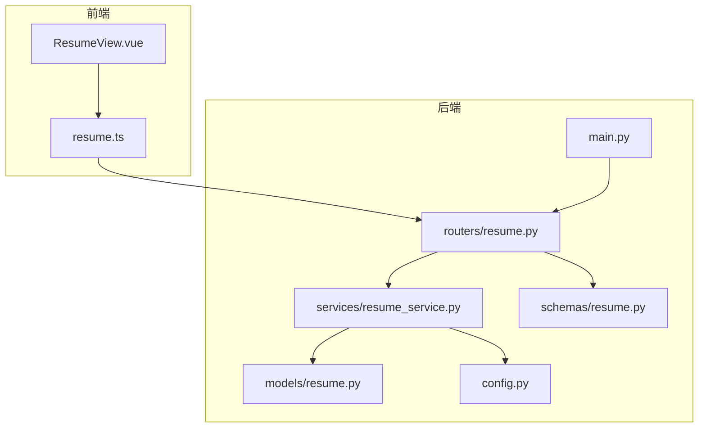
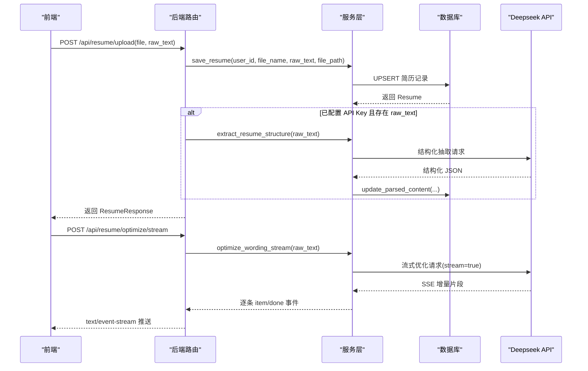
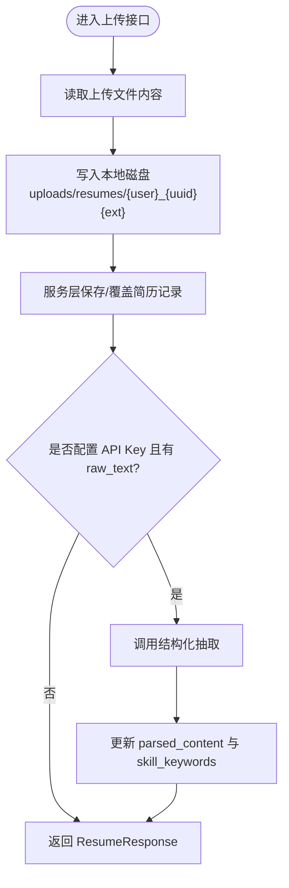
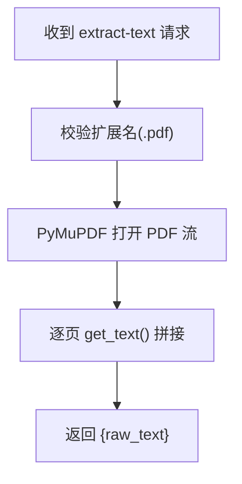
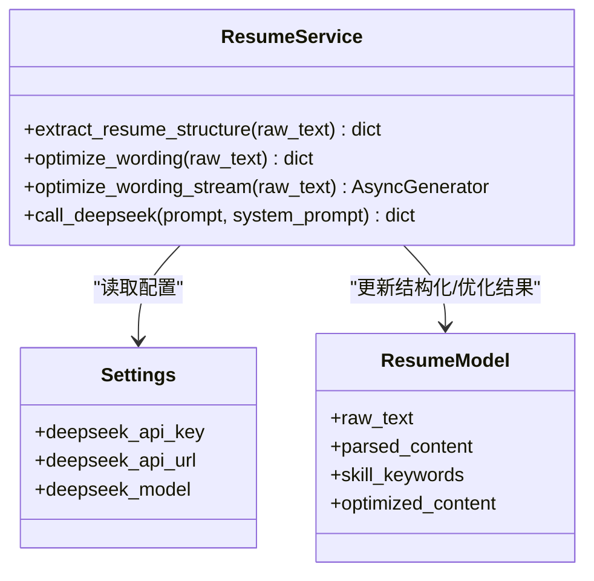
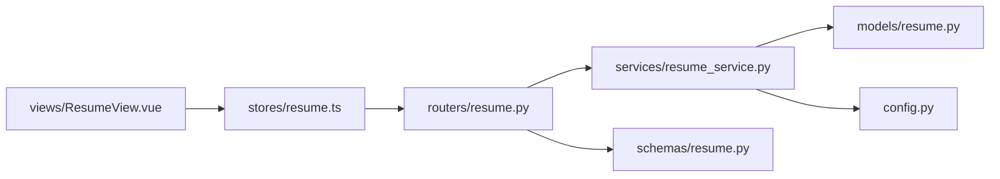

# 文件解析引擎

<cite>
**本文引用的文件**
- [backEnd/app/routers/resume.py](file://backEnd/app/routers/resume.py)
- [backEnd/app/services/resume_service.py](file://backEnd/app/services/resume_service.py)
- [backEnd/app/models/resume.py](file://backEnd/app/models/resume.py)
- [backEnd/app/schemas/resume.py](file://backEnd/app/schemas/resume.py)
- [backEnd/app/config.py](file://backEnd/app/config.py)
- [backEnd/app/main.py](file://backEnd/app/main.py)
- [frontEnd/src/stores/resume.ts](file://frontEnd/src/stores/resume.ts)
- [frontEnd/src/views/ResumeView.vue](file://frontEnd/src/views/ResumeView.vue)
- [backEnd/requirements.txt](file://backEnd/requirements.txt)
</cite>

## 目录
1. [简介](#简介)
2. [项目结构](#项目结构)
3. [核心组件](#核心组件)
4. [架构总览](#架构总览)
5. [详细组件分析](#详细组件分析)
6. [依赖关系分析](#依赖关系分析)
7. [性能与批量处理](#性能与批量处理)
8. [故障排查指南](#故障排查指南)
9. [结论](#结论)
10. [附录：扩展新格式支持](#附录扩展新格式支持)

## 简介
本文件为“简历文件解析引擎”的技术文档，聚焦于后端服务对简历文件的上传、文本提取、结构化解析与措辞优化能力。当前实现以 PDF 为主，通过服务端 PyMuPDF 进行文本提取；Word 与 TXT 的解析由前端在浏览器端完成（使用 pdf.js 与 mammoth），再将纯文本提交至后端进行结构化分析与优化。系统同时提供流式优化输出、结果缓存、以及基于 Deepseek API 的结构化抽取与措辞优化功能。

## 项目结构
后端采用 FastAPI + SQLAlchemy 异步 ORM，路由层负责接收请求与响应，服务层封装业务逻辑与外部 API 调用，模型与 Schema 定义数据契约。前端通过 Vue 3 + Pinia 管理状态，并调用后端接口完成上传、解析、优化等流程。

图表来源
- [backEnd/app/main.py:60-68](file://backEnd/app/main.py#L60-L68)
- [backEnd/app/routers/resume.py:1-215](file://backEnd/app/routers/resume.py#L1-L215)
- [backEnd/app/services/resume_service.py:1-285](file://backEnd/app/services/resume_service.py#L1-L285)
- [backEnd/app/models/resume.py:1-67](file://backEnd/app/models/resume.py#L1-L67)
- [backEnd/app/schemas/resume.py:1-35](file://backEnd/app/schemas/resume.py#L1-L35)
- [backEnd/app/config.py:1-71](file://backEnd/app/config.py#L1-L71)
- [frontEnd/src/stores/resume.ts:1-244](file://frontEnd/src/stores/resume.ts#L1-L244)
- [frontEnd/src/views/ResumeView.vue:1-200](file://frontEnd/src/views/ResumeView.vue#L1-L200)

章节来源
- [backEnd/app/main.py:60-73](file://backEnd/app/main.py#L60-L73)
- [backEnd/app/routers/resume.py:1-215](file://backEnd/app/routers/resume.py#L1-L215)
- [backEnd/app/services/resume_service.py:1-285](file://backEnd/app/services/resume_service.py#L1-L285)
- [backEnd/app/models/resume.py:1-67](file://backEnd/app/models/resume.py#L1-L67)
- [backEnd/app/schemas/resume.py:1-35](file://backEnd/app/schemas/resume.py#L1-L35)
- [backEnd/app/config.py:1-71](file://backEnd/app/config.py#L1-L71)
- [frontEnd/src/stores/resume.ts:1-244](file://frontEnd/src/stores/resume.ts#L1-L244)
- [frontEnd/src/views/ResumeView.vue:1-200](file://frontEnd/src/views/ResumeView.vue#L1-L200)

## 核心组件
- 路由层（FastAPI）
  - 提供简历上传、获取、AI 分析、措辞优化（同步与流式）、PDF 文本提取等接口。
- 服务层（业务逻辑）
  - 封装数据库 CRUD、Deepseek API 调用（结构化抽取与措辞优化）、流式解析与 JSON 对象边界识别。
- 数据模型与 Schema
  - 定义简历实体字段（原始文本、结构化内容、技能关键词、优化缓存等）及前后端交互的数据契约。
- 配置中心
  - 集中管理数据库、CORS、Deepseek API 等环境变量。
- 前端状态与视图
  - 管理上传、解析、优化流程，处理 SSE 流式消息，展示结构化结果与优化对比。

章节来源
- [backEnd/app/routers/resume.py:1-215](file://backEnd/app/routers/resume.py#L1-L215)
- [backEnd/app/services/resume_service.py:1-285](file://backEnd/app/services/resume_service.py#L1-L285)
- [backEnd/app/models/resume.py:1-67](file://backEnd/app/models/resume.py#L1-L67)
- [backEnd/app/schemas/resume.py:1-35](file://backEnd/app/schemas/resume.py#L1-L35)
- [backEnd/app/config.py:1-71](file://backEnd/app/config.py#L1-L71)
- [frontEnd/src/stores/resume.ts:1-244](file://frontEnd/src/stores/resume.ts#L1-L244)
- [frontEnd/src/views/ResumeView.vue:1-200](file://frontEnd/src/views/ResumeView.vue#L1-L200)

## 架构总览
整体流程：前端选择或拖拽上传 PDF/DOCX，必要时在前端进行文本提取（PDF 可选服务端提取），将文件名与纯文本提交到后端；后端持久化原始文本与文件路径，若已配置 Deepseek API Key，则自动触发结构化抽取；用户可手动触发分析或措辞优化，优化结果支持缓存与流式推送。

图表来源
- [backEnd/app/routers/resume.py:47-77](file://backEnd/app/routers/resume.py#L47-L77)
- [backEnd/app/services/resume_service.py:174-177](file://backEnd/app/services/resume_service.py#L174-L177)
- [backEnd/app/services/resume_service.py:186-285](file://backEnd/app/services/resume_service.py#L186-L285)
- [backEnd/app/models/resume.py:11-67](file://backEnd/app/models/resume.py#L11-L67)
- [backEnd/app/schemas/resume.py:18-35](file://backEnd/app/schemas/resume.py#L18-L35)

## 详细组件分析

### 上传与保存流程
- 路由接收 multipart/form-data，包含文件与可选 raw_text。
- 生成唯一文件名并写入本地磁盘 uploads/resumes，记录相对路径。
- 调用服务层保存/覆盖简历记录（UPSERT），清空结构化与分析缓存以便重新计算。
- 若已配置 API Key 且存在 raw_text，则自动执行结构化抽取并更新 parsed_content 与 skill_keywords。

图表来源
- [backEnd/app/routers/resume.py:47-77](file://backEnd/app/routers/resume.py#L47-L77)
- [backEnd/app/services/resume_service.py:40-83](file://backEnd/app/services/resume_service.py#L40-L83)

章节来源
- [backEnd/app/routers/resume.py:47-77](file://backEnd/app/routers/resume.py#L47-L77)
- [backEnd/app/services/resume_service.py:40-83](file://backEnd/app/services/resume_service.py#L40-L83)

### 文本提取算法
- PDF 文本提取（服务端）
  - 使用 PyMuPDF（fitz）打开 PDF 流，逐页提取文本并拼接。
  - 仅允许 .pdf 后缀，其他格式直接拒绝。
- Word 文本提取（前端）
  - 使用 mammoth 从 DOCX 中提取原始文本，再提交给后端。
- TXT 文本提取（前端）
  - 直接读取文本内容并提交给后端。
- OCR 与图片文字提取
  - 当前代码未集成 OCR 或图片文字识别能力。

图表来源
- [backEnd/app/routers/resume.py:195-214](file://backEnd/app/routers/resume.py#L195-L214)
- [backEnd/requirements.txt:22-23](file://backEnd/requirements.txt#L22-L23)

章节来源
- [backEnd/app/routers/resume.py:195-214](file://backEnd/app/routers/resume.py#L195-L214)
- [backEnd/requirements.txt:22-23](file://backEnd/requirements.txt#L22-L23)

### 结构化抽取与措辞优化
- 结构化抽取
  - 构造提示词模板，调用 Deepseek 聊天补全接口，返回包含技能、经历、教育、评分与建议的 JSON。
- 措辞优化（同步）
  - 构造优化提示词，调用 Deepseek 接口，返回若干条原文与优化后的对照项及统计信息。
- 措辞优化（流式）
  - 启用 stream=true，按 SSE 增量接收内容；后端维护 buffer，使用大括号深度计数与字符串转义处理，识别完整 JSON 对象，提取 item 与 stats，逐条推送。
- 缓存策略
  - 优化结果持久化到 optimized_content 字段，后续请求优先命中缓存。

图表来源
- [backEnd/app/services/resume_service.py:141-177](file://backEnd/app/services/resume_service.py#L141-L177)
- [backEnd/app/services/resume_service.py:186-285](file://backEnd/app/services/resume_service.py#L186-L285)
- [backEnd/app/models/resume.py:11-67](file://backEnd/app/models/resume.py#L11-L67)
- [backEnd/app/config.py:34-37](file://backEnd/app/config.py#L34-L37)

章节来源
- [backEnd/app/services/resume_service.py:141-177](file://backEnd/app/services/resume_service.py#L141-L177)
- [backEnd/app/services/resume_service.py:186-285](file://backEnd/app/services/resume_service.py#L186-L285)
- [backEnd/app/models/resume.py:11-67](file://backEnd/app/models/resume.py#L11-L67)
- [backEnd/app/config.py:34-37](file://backEnd/app/config.py#L34-L37)

### 存储策略与临时文件管理
- 存储位置
  - 本地磁盘目录：uploads/resumes，作为静态资源挂载到 /api/uploads。
- 命名规则
  - 文件名格式：{user_id}_{随机短标识}{原扩展名}，避免冲突。
- 访问方式
  - 通过 StaticFiles 挂载，可直接通过 URL 访问上传文件。
- 临时文件管理
  - 当前实现不删除历史版本，覆盖时保留旧文件；未实现定时清理机制。

章节来源
- [backEnd/app/main.py:70-73](file://backEnd/app/main.py#L70-L73)
- [backEnd/app/routers/resume.py:21-22](file://backEnd/app/routers/resume.py#L21-L22)
- [backEnd/app/routers/resume.py:57-63](file://backEnd/app/routers/resume.py#L57-L63)

### 错误处理与重试机制
- 验证错误统一处理
  - 自定义 RequestValidationError 处理器，过滤二进制 input 字段，避免 UnicodeDecodeError。
- 上传与解析异常
  - PDF 提取失败返回 500 并附带错误详情；AI 分析失败不影响保存，仅跳过结构化步骤。
- 重试机制
  - 当前未实现显式重试逻辑；HTTP 客户端超时设置用于防止长时间阻塞。

章节来源
- [backEnd/app/main.py:76-84](file://backEnd/app/main.py#L76-L84)
- [backEnd/app/routers/resume.py:70-76](file://backEnd/app/routers/resume.py#L70-L76)
- [backEnd/app/routers/resume.py:205-214](file://backEnd/app/routers/resume.py#L205-L214)
- [backEnd/app/services/resume_service.py:161-162](file://backEnd/app/services/resume_service.py#L161-L162)
- [backEnd/app/services/resume_service.py:207-208](file://backEnd/app/services/resume_service.py#L207-L208)

### 前端交互与流式优化
- 上传与解析
  - 支持拖拽上传，限制最大 10MB，接受 .pdf/.docx。
  - 可选择服务端 PDF 文本提取或直接提交 raw_text。
- 流式优化
  - 前端按 SSE 协议解析 data: 行，分派 start/item/done 事件，实时更新 UI。
  - 优化完成后将结果缓存至后端，后续请求直接返回缓存。

章节来源
- [frontEnd/src/views/ResumeView.vue:70-85](file://frontEnd/src/views/ResumeView.vue#L70-L85)
- [frontEnd/src/stores/resume.ts:161-207](file://frontEnd/src/stores/resume.ts#L161-L207)
- [frontEnd/src/stores/resume.ts:209-225](file://frontEnd/src/stores/resume.ts#L209-L225)

## 依赖关系分析
- 后端依赖
  - FastAPI、uvicorn、SQLAlchemy 异步、aiomysql/pymysql、httpx、PyMuPDF、pydantic-settings。
- 前端依赖
  - Vue 3、Pinia、TypeScript、mammoth（类型声明）、pdfjs-dist（类型声明）。

图表来源
- [backEnd/app/routers/resume.py:1-215](file://backEnd/app/routers/resume.py#L1-L215)
- [backEnd/app/services/resume_service.py:1-285](file://backEnd/app/services/resume_service.py#L1-L285)
- [backEnd/app/models/resume.py:1-67](file://backEnd/app/models/resume.py#L1-L67)
- [backEnd/app/schemas/resume.py:1-35](file://backEnd/app/schemas/resume.py#L1-L35)
- [backEnd/app/config.py:1-71](file://backEnd/app/config.py#L1-L71)
- [frontEnd/src/stores/resume.ts:1-244](file://frontEnd/src/stores/resume.ts#L1-L244)
- [frontEnd/src/views/ResumeView.vue:1-200](file://frontEnd/src/views/ResumeView.vue#L1-L200)

章节来源
- [backEnd/requirements.txt:1-27](file://backEnd/requirements.txt#L1-L27)

## 性能与批量处理
- 性能要点
  - 流式优化减少首屏等待时间，提升用户体验。
  - 优化结果缓存避免重复调用外部 API。
  - PyMuPDF 在服务端解析 PDF，比前端更稳定高效。
- 批量处理建议
  - 当前未实现批量上传与解析接口。可扩展为异步任务队列（如 Celery/RQ），将结构化抽取与优化放入后台任务，避免长连接阻塞。
  - 引入限流与并发控制，保护外部 API 与数据库连接池。
  - 针对大文件，考虑分块上传与断点续传。

[本节为通用指导，不涉及具体文件分析]

## 故障排查指南
- 常见错误
  - 未配置 Deepseek API Key：前端会提示并在后端返回 400 错误。
  - PDF 提取失败：检查文件格式与内容，确认 PyMuPDF 可用。
  - 验证错误导致 UnicodeDecodeError：已由全局异常处理器过滤二进制输入。
- 定位方法
  - 查看后端日志中的上传与 API 调用打印。
  - 检查 uploads/resumes 目录是否存在对应文件。
  - 确认 .env 中 DEEPSEEK_API_KEY、URL、模型名称是否正确。

章节来源
- [backEnd/app/routers/resume.py:89-97](file://backEnd/app/routers/resume.py#L89-L97)
- [backEnd/app/routers/resume.py:205-214](file://backEnd/app/routers/resume.py#L205-L214)
- [backEnd/app/main.py:76-84](file://backEnd/app/main.py#L76-L84)
- [backEnd/app/config.py:34-37](file://backEnd/app/config.py#L34-L37)

## 结论
该解析引擎在当前阶段实现了 PDF 的服务端文本提取、Word/TXT 的前端文本提取、结构化抽取与措辞优化（含流式与缓存）。存储策略简单可靠，错误处理基本完备。未来可在安全扫描、OCR、表格解析、批量处理与重试机制方面进一步增强。

[本节为总结性内容，不涉及具体文件分析]

## 附录：扩展新格式支持
- 新增后端解析器
  - 在路由层增加新的解析接口（例如 /api/resume/parse-docx），复用上传保存流程，调用相应解析库（如 python-docx）提取文本。
  - 在 requirements.txt 中添加依赖，确保运行环境安装成功。
- 新增前端解析器
  - 在前端 stores 中新增解析函数，调用后端新接口或在前端使用第三方库（如 mammoth）解析后提交 raw_text。
- 结构化与优化
  - 保持现有结构化抽取与优化流程不变，无需修改服务层逻辑。
- 测试与回滚
  - 为新格式编写单元测试与端到端用例，确保兼容性。
  - 通过特性开关或配置项控制新格式的启用与回滚。

章节来源
- [backEnd/app/routers/resume.py:47-77](file://backEnd/app/routers/resume.py#L47-L77)
- [backEnd/requirements.txt:1-27](file://backEnd/requirements.txt#L1-L27)
- [frontEnd/src/stores/resume.ts:209-225](file://frontEnd/src/stores/resume.ts#L209-L225)