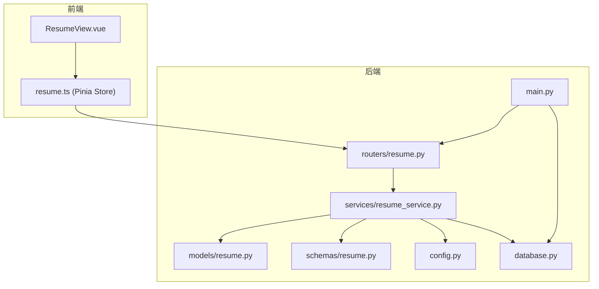
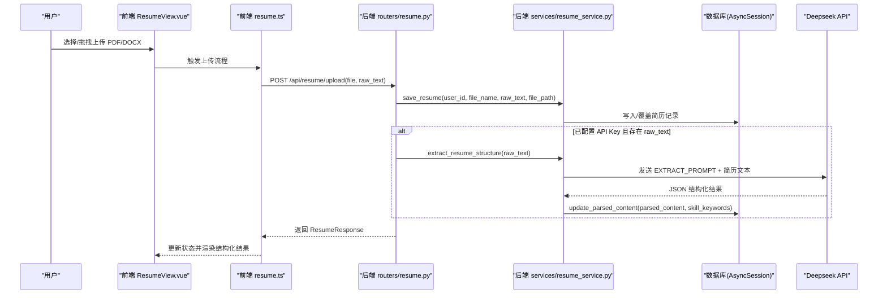
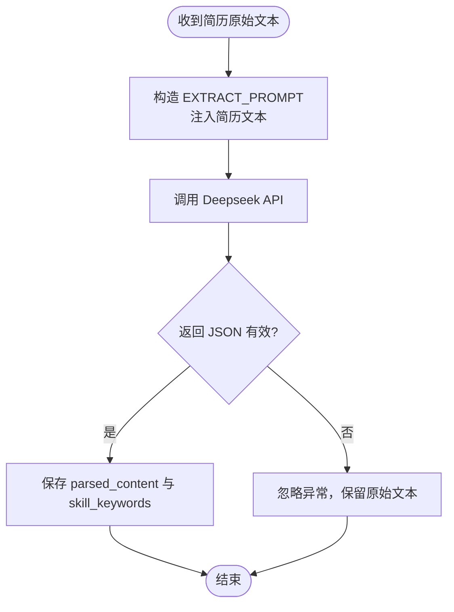
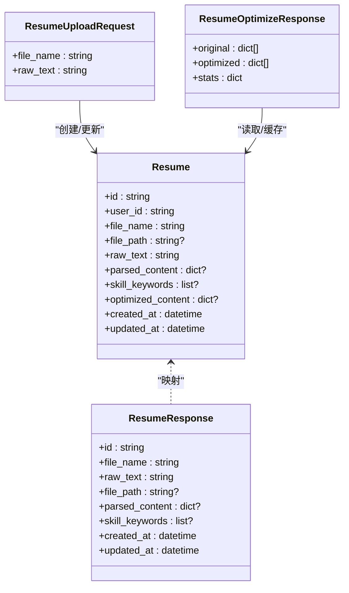

# 智能内容提取

<cite>
**本文引用的文件**   
- [backEnd/app/models/resume.py](file://backEnd/app/models/resume.py)
- [backEnd/app/schemas/resume.py](file://backEnd/app/schemas/resume.py)
- [backEnd/app/services/resume_service.py](file://backEnd/app/services/resume_service.py)
- [backEnd/app/routers/resume.py](file://backEnd/app/routers/resume.py)
- [backEnd/app/config.py](file://backEnd/app/config.py)
- [backEnd/app/database.py](file://backEnd/app/database.py)
- [backEnd/app/main.py](file://backEnd/app/main.py)
- [frontEnd/src/stores/resume.ts](file://frontEnd/src/stores/resume.ts)
- [frontEnd/src/views/ResumeView.vue](file://frontEnd/src/views/ResumeView.vue)
</cite>

## 目录
1. [简介](#简介)
2. [项目结构](#项目结构)
3. [核心组件](#核心组件)
4. [架构总览](#架构总览)
5. [详细组件分析](#详细组件分析)
6. [依赖关系分析](#依赖关系分析)
7. [性能与可扩展性](#性能与可扩展性)
8. [故障排查指南](#故障排查指南)
9. [结论](#结论)
10. [附录：配置与自定义规则](#附录配置与自定义规则)

## 简介
本系统面向简历智能内容提取，提供从上传、文本解析到结构化信息抽取、措辞优化与报告展示的一体化能力。其核心由后端 FastAPI 服务与前端 Vue/Pinia 应用组成，通过调用外部大模型（Deepseek）完成 AI 驱动的内容理解与质量评估。系统支持 PDF/DOCX 上传、服务端 PDF 文本提取、结构化字段（技能、工作经历、教育背景等）的标准化输出，以及流式优化的用户体验。

## 项目结构
- 后端采用分层设计：路由层（routers）、服务层（services）、数据模型（models）、请求/响应模式（schemas）、配置与数据库连接（config、database），主入口注册中间件与路由。
- 前端使用 Pinia 管理状态，Vue 视图负责交互与渲染，包含上传、解析、AI 分析与优化流程。

图表来源
- [backEnd/app/main.py:44-73](file://backEnd/app/main.py#L44-L73)
- [backEnd/app/routers/resume.py:19-22](file://backEnd/app/routers/resume.py#L19-L22)
- [backEnd/app/services/resume_service.py:10-13](file://backEnd/app/services/resume_service.py#L10-L13)
- [backEnd/app/models/resume.py:11-12](file://backEnd/app/models/resume.py#L11-L12)
- [backEnd/app/schemas/resume.py:11-14](file://backEnd/app/schemas/resume.py#L11-L14)
- [backEnd/app/config.py:7-11](file://backEnd/app/config.py#L7-L11)
- [backEnd/app/database.py:31-43](file://backEnd/app/database.py#L31-L43)

章节来源
- [backEnd/app/main.py:44-73](file://backEnd/app/main.py#L44-L73)
- [backEnd/app/routers/resume.py:19-22](file://backEnd/app/routers/resume.py#L19-L22)
- [backEnd/app/services/resume_service.py:10-13](file://backEnd/app/services/resume_service.py#L10-L13)
- [backEnd/app/models/resume.py:11-12](file://backEnd/app/models/resume.py#L11-L12)
- [backEnd/app/schemas/resume.py:11-14](file://backEnd/app/schemas/resume.py#L11-L14)
- [backEnd/app/config.py:7-11](file://backEnd/app/config.py#L7-L11)
- [backEnd/app/database.py:31-43](file://backEnd/app/database.py#L31-L43)

## 核心组件
- 数据模型：存储用户简历原始文本、结构化解析结果、技能关键词、优化缓存等。
- 服务层：封装 CRUD、Deepseek API 调用、结构化提取、措辞优化（同步与流式）。
- 路由层：暴露上传、分析、优化、PDF 文本提取等接口，处理鉴权与错误。
- 前端 Store：封装 API 调用、SSE 流式解析、状态管理与 UI 交互。
- 配置与数据库：集中读取 .env 环境变量，建立异步数据库连接与会话。

章节来源
- [backEnd/app/models/resume.py:11-67](file://backEnd/app/models/resume.py#L11-L67)
- [backEnd/app/schemas/resume.py:11-35](file://backEnd/app/schemas/resume.py#L11-L35)
- [backEnd/app/services/resume_service.py:32-84](file://backEnd/app/services/resume_service.py#L32-L84)
- [backEnd/app/routers/resume.py:47-77](file://backEnd/app/routers/resume.py#L47-L77)
- [frontEnd/src/stores/resume.ts:82-112](file://frontEnd/src/stores/resume.ts#L82-L112)
- [backEnd/app/config.py:34-38](file://backEnd/app/config.py#L34-L38)
- [backEnd/app/database.py:31-43](file://backEnd/app/database.py#L31-L43)

## 架构总览
系统以“上传 → 文本提取 → AI 结构化提取 → 结果持久化 → 前端展示”为主线，辅以“措辞优化（同步/流式）”增强体验。

图表来源
- [backEnd/app/routers/resume.py:47-77](file://backEnd/app/routers/resume.py#L47-L77)
- [backEnd/app/services/resume_service.py:40-84](file://backEnd/app/services/resume_service.py#L40-L84)
- [backEnd/app/services/resume_service.py:174-177](file://backEnd/app/services/resume_service.py#L174-L177)
- [frontEnd/src/stores/resume.ts:114-135](file://frontEnd/src/stores/resume.ts#L114-L135)
- [frontEnd/src/views/ResumeView.vue:448-458](file://frontEnd/src/views/ResumeView.vue#L448-L458)

## 详细组件分析

### 个人信息识别算法（姓名、联系方式、邮箱等）
- 当前实现未内置正则或规则引擎进行个人信息识别；个人信息识别由 Deepseek 在结构化提示词中承担。
- 提示词要求返回 skills、experiences、education、summary、score、suggestions、skill_categories 等字段，未显式定义个人身份信息字段。
- 若需增加个人信息识别，可在提示词中扩展目标字段（如 name、phone、email），并在服务层对返回 JSON 做校验与清洗后落库。

章节来源
- [backEnd/app/services/resume_service.py:88-113](file://backEnd/app/services/resume_service.py#L88-L113)
- [backEnd/app/models/resume.py:41-55](file://backEnd/app/models/resume.py#L41-L55)

### 工作经历解析逻辑（公司、职位、时间跨度、职责描述）
- 结构化提示词明确期望 experiences 数组，包含 role、company、period、duration、description 等字段。
- 服务层将 AI 返回的结构化结果直接持久化为 parsed_content，同时提取 skills 列表作为 skill_keywords。
- 前端按 experiences 字段渲染公司名称、职位、时间段与时长等信息。

图表来源
- [backEnd/app/services/resume_service.py:88-113](file://backEnd/app/services/resume_service.py#L88-L113)
- [backEnd/app/services/resume_service.py:174-177](file://backEnd/app/services/resume_service.py#L174-L177)
- [backEnd/app/routers/resume.py:69-77](file://backEnd/app/routers/resume.py#L69-L77)

章节来源
- [backEnd/app/services/resume_service.py:88-113](file://backEnd/app/services/resume_service.py#L88-L113)
- [backEnd/app/routers/resume.py:69-77](file://backEnd/app/routers/resume.py#L69-L77)
- [frontEnd/src/views/ResumeView.vue:152-167](file://frontEnd/src/views/ResumeView.vue#L152-L167)

### 教育背景提取机制（学校、专业、学历、毕业时间）
- 结构化提示词要求 education 数组，包含 school、degree、period 字段。
- 前端按该结构渲染学校名称、学历专业与时间段。
- 如需更细粒度（如 start_year、end_year、major），可在提示词与前端类型中扩展。

章节来源
- [backEnd/app/services/resume_service.py:88-113](file://backEnd/app/services/resume_service.py#L88-L113)
- [frontEnd/src/views/ResumeView.vue:169-181](file://frontEnd/src/views/ResumeView.vue#L169-L181)

### 技能关键词匹配与分类（技术栈、软技能、证书认证）
- 结构化提示词返回 skills 列表与 skill_categories 数组（name、keywords、percent）。
- 服务层将 skills 作为 skill_keywords 单独存储，便于快速检索与展示。
- 前端以标签形式展示技能关键词，并可基于 skill_categories 进行可视化统计。

章节来源
- [backEnd/app/services/resume_service.py:88-113](file://backEnd/app/services/resume_service.py#L88-L113)
- [backEnd/app/models/resume.py:46-50](file://backEnd/app/models/resume.py#L46-L50)
- [frontEnd/src/views/ResumeView.vue:136-149](file://frontEnd/src/views/ResumeView.vue#L136-L149)

### AI 驱动的内容理解与质量评估
- 内容理解：通过 EXTRACT_PROMPT 指导模型抽取结构化信息。
- 质量评估：提示词中包含 score、suggestions、skill_categories.percent 等指标，用于综合评分与建议。
- 措辞优化：OPTIMIZE_PROMPT 指导模型挑选重要条目进行专业化改写，并返回 stats 统计信息。

章节来源
- [backEnd/app/services/resume_service.py:88-113](file://backEnd/app/services/resume_service.py#L88-L113)
- [backEnd/app/services/resume_service.py:115-138](file://backEnd/app/services/resume_service.py#L115-L138)

### 自定义提取规则的配置方法
- 通过修改 EXTRACT_PROMPT 与 OPTIMIZE_PROMPT 可调整 AI 的输出结构与行为。
- 可通过配置项 deepseek_api_key、deepseek_api_url、deepseek_model 切换模型与端点。
- 建议在前端类型与后端 schema 中同步扩展字段，确保端到端一致性。

章节来源
- [backEnd/app/services/resume_service.py:88-138](file://backEnd/app/services/resume_service.py#L88-L138)
- [backEnd/app/config.py:34-38](file://backEnd/app/config.py#L34-L38)
- [backEnd/app/schemas/resume.py:18-35](file://backEnd/app/schemas/resume.py#L18-L35)

### 数据清洗与标准化的实现细节
- PDF 文本提取：后端使用 PyMuPDF 逐页提取文本，拼接为完整字符串。
- DOCX 文本提取：前端使用 mammoth 提取纯文本。
- JSON 容错：服务层在解析 Deepseek 返回时兼容 markdown code block，并尝试提取 JSON。
- 失败回退：AI 提取失败不影响简历保存，仅跳过结构化更新。

章节来源
- [backEnd/app/routers/resume.py:195-214](file://backEnd/app/routers/resume.py#L195-L214)
- [frontEnd/src/views/ResumeView.vue:416-427](file://frontEnd/src/views/ResumeView.vue#L416-L427)
- [backEnd/app/services/resume_service.py:166-171](file://backEnd/app/services/resume_service.py#L166-L171)
- [backEnd/app/routers/resume.py:69-77](file://backEnd/app/routers/resume.py#L69-L77)

## 依赖关系分析

图表来源
- [backEnd/app/models/resume.py:11-67](file://backEnd/app/models/resume.py#L11-L67)
- [backEnd/app/schemas/resume.py:11-35](file://backEnd/app/schemas/resume.py#L11-L35)

章节来源
- [backEnd/app/models/resume.py:11-67](file://backEnd/app/models/resume.py#L11-L67)
- [backEnd/app/schemas/resume.py:11-35](file://backEnd/app/schemas/resume.py#L11-L35)

## 性能与可扩展性
- 异步 I/O：数据库会话与 HTTP 客户端均使用异步，提升并发处理能力。
- 流式优化：optimize_wording_stream 使用 SSE 推送，降低首屏等待时间，提升用户体验。
- 缓存策略：优化结果持久化至 optimized_content，命中缓存直接返回，减少重复计算。
- 可扩展点：
  - 替换或并行调用多个 LLM 提供商，统一适配层。
  - 引入本地规则引擎与 NER 模型，提高个人信息与实体识别准确率。
  - 增加批量分析与任务队列，避免高峰期阻塞。

[本节为通用建议，不直接分析具体文件]

## 故障排查指南
- 未配置 API Key：
  - 现象：前端提示“Deepseek API 尚未配置”，后端返回 400 错误。
  - 解决：在后端 .env 设置 DEEPSEEK_API_KEY，并重启服务。
- PDF 文本提取失败：
  - 现象：后端返回 500 错误，消息包含“PDF 文本提取失败”。
  - 排查：确认文件是否为 PDF，检查 PyMuPDF 安装与环境变量。
- AI 分析失败：
  - 现象：后端返回 500 错误，消息包含“AI 分析失败”。
  - 排查：检查网络连通性与 API Key 有效性，查看日志中的异常堆栈。
- 流式优化无输出：
  - 现象：前端长时间无 item/done 事件。
  - 排查：确认后端 optimize_wording_stream 是否成功进入流式分支，检查 SSE 格式与超时设置。

章节来源
- [backEnd/app/routers/resume.py:89-97](file://backEnd/app/routers/resume.py#L89-L97)
- [backEnd/app/routers/resume.py:195-214](file://backEnd/app/routers/resume.py#L195-L214)
- [backEnd/app/services/resume_service.py:186-284](file://backEnd/app/services/resume_service.py#L186-L284)

## 结论
该系统以“上传—解析—AI 结构化—展示/优化”为核心链路，借助 Deepseek 完成简历内容的理解与评估。通过清晰的模块划分与异步架构，系统在易用性与可扩展性方面具备良好基础。后续可在个人信息识别、规则引擎与多模型适配等方面进一步增强。

[本节为总结，不直接分析具体文件]

## 附录：配置与自定义规则

### 环境变量与配置项
- Deepseek API：
  - deepseek_api_key：API 密钥
  - deepseek_api_url：API 地址
  - deepseek_model：模型名称
- 数据库：
  - db_host、db_port、db_user、db_password、db_name
- CORS：
  - cors_origins：允许的前端域名列表

章节来源
- [backEnd/app/config.py:34-38](file://backEnd/app/config.py#L34-L38)
- [backEnd/app/config.py:14-18](file://backEnd/app/config.py#L14-L18)
- [backEnd/app/config.py:31-33](file://backEnd/app/config.py#L31-L33)

### 提示词定制要点
- EXTRACT_PROMPT：定义结构化字段与评分规则，可按需新增字段（如 personal_info）。
- OPTIMIZE_PROMPT：定义优化范围与输出格式，控制条数与统计指标。
- 建议在前后端类型中同步扩展，保证端到端一致。

章节来源
- [backEnd/app/services/resume_service.py:88-138](file://backEnd/app/services/resume_service.py#L88-L138)
- [frontEnd/src/stores/resume.ts:17-57](file://frontEnd/src/stores/resume.ts#L17-L57)

### 数据模型与接口契约
- 数据模型：Resume 表字段涵盖原始文本、结构化结果、技能关键词与优化缓存。
- 接口契约：
  - 上传：POST /api/resume/upload
  - 分析：POST /api/resume/analyze
  - 优化：POST /api/resume/optimize
  - 流式优化：POST /api/resume/optimize/stream
  - PDF 文本提取：POST /api/resume/extract-text

章节来源
- [backEnd/app/models/resume.py:11-67](file://backEnd/app/models/resume.py#L11-L67)
- [backEnd/app/routers/resume.py:47-214](file://backEnd/app/routers/resume.py#L47-L214)