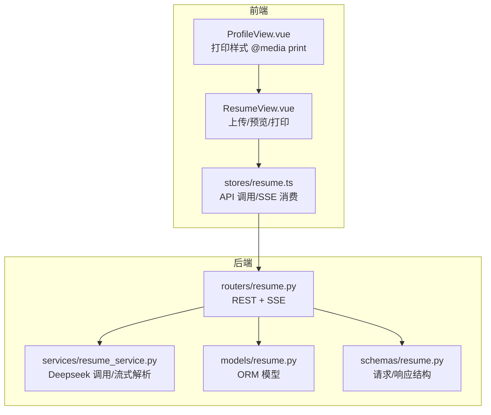
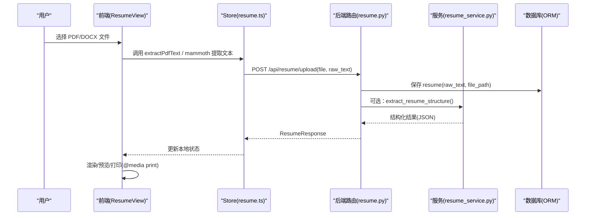
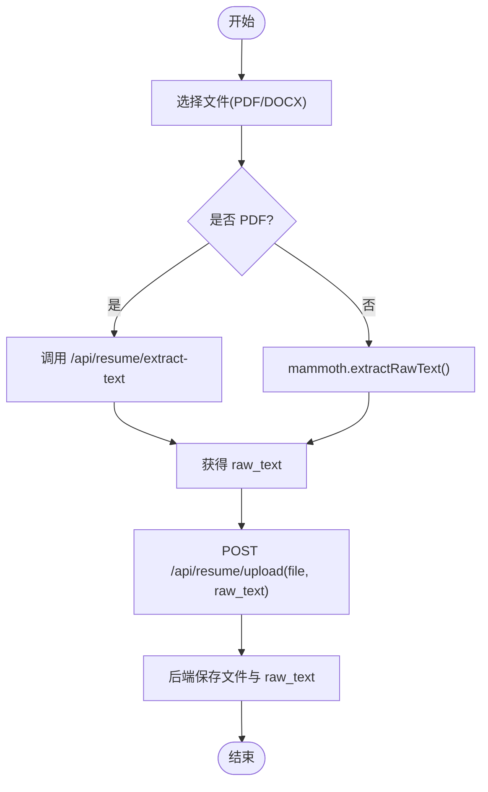
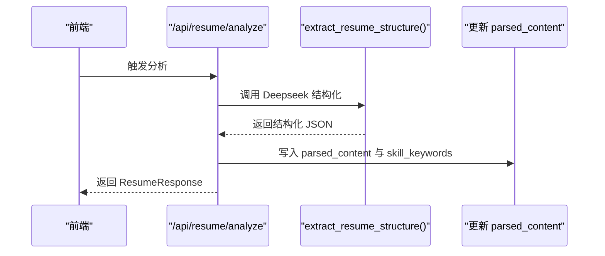
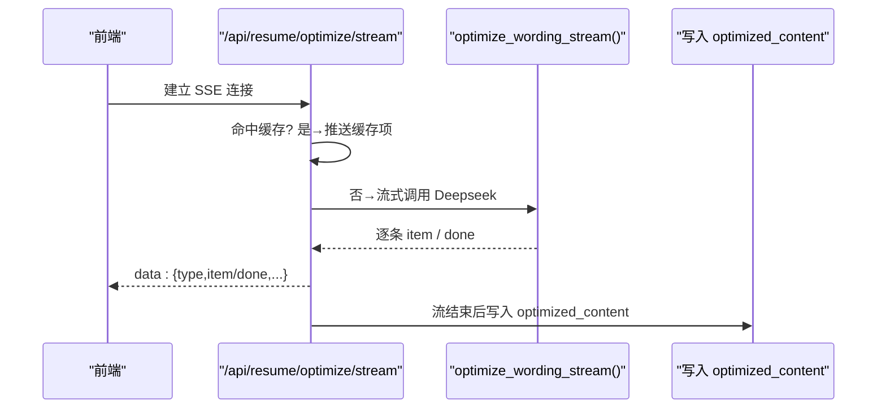
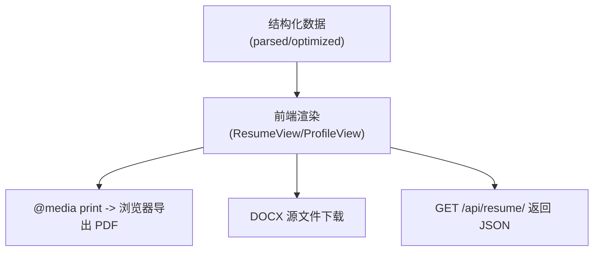
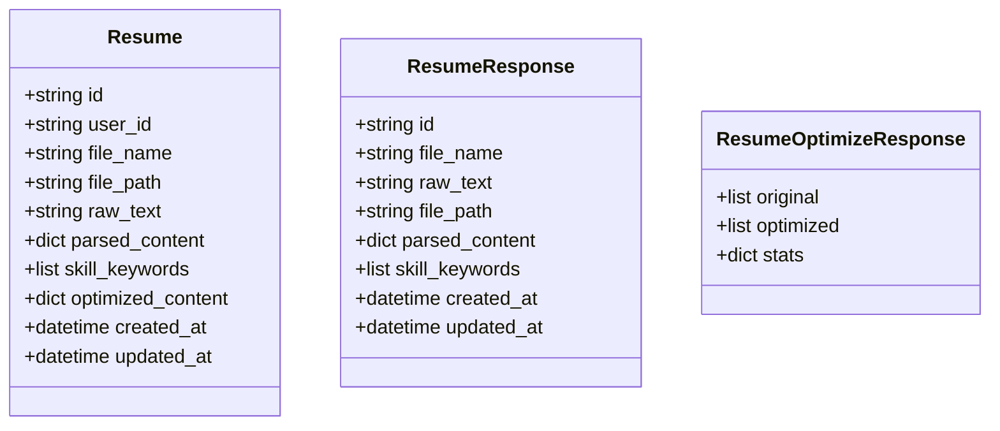
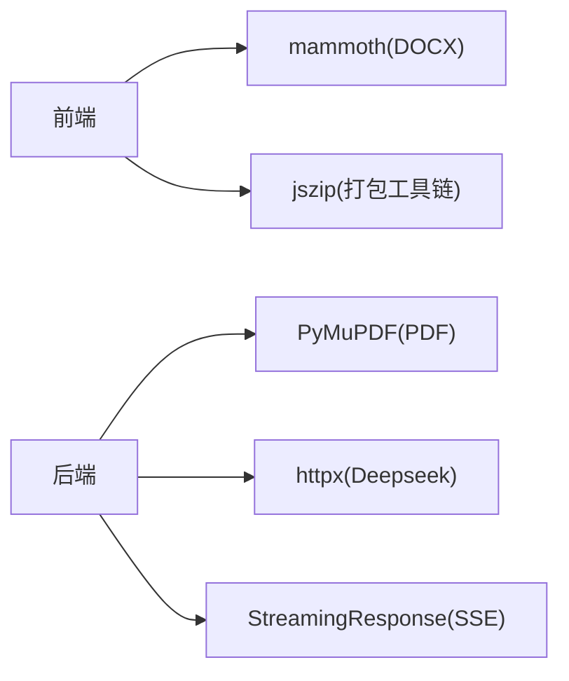

# 格式转换导出

<cite>
**本文引用的文件**
- [backEnd/app/routers/resume.py](file://backEnd/app/routers/resume.py)
- [backEnd/app/services/resume_service.py](file://backEnd/app/services/resume_service.py)
- [backEnd/app/models/resume.py](file://backEnd/app/models/resume.py)
- [backEnd/app/schemas/resume.py](file://backEnd/app/schemas/resume.py)
- [frontEnd/src/views/ResumeView.vue](file://frontEnd/src/views/ResumeView.vue)
- [frontEnd/src/stores/resume.ts](file://frontEnd/src/stores/resume.ts)
- [frontEnd/src/views/ProfileView.vue](file://frontEnd/src/views/ProfileView.vue)
</cite>

## 目录
1. [简介](#简介)
2. [项目结构](#项目结构)
3. [核心组件](#核心组件)
4. [架构总览](#架构总览)
5. [详细组件分析](#详细组件分析)
6. [依赖关系分析](#依赖关系分析)
7. [性能与并发](#性能与并发)
8. [导出质量与兼容性](#导出质量与兼容性)
9. [高级功能（水印、加密等）](#高级功能水印加密等)
10. [故障排查指南](#故障排查指南)
11. [结论](#结论)

## 简介
本文件围绕“简历格式转换导出”能力进行系统化文档化，覆盖以下要点：
- 支持的导出格式与生成机制：PDF、DOCX、HTML、JSON
- 模板管理系统：内置模板库、模板语法、样式定制
- 批量导出：多用户数据处理、并发控制、进度跟踪
- 模板渲染引擎：数据绑定、条件渲染、动态布局
- 自定义模板开发指南与API接口说明
- 导出质量优化与兼容性处理
- 高级功能：水印添加、加密保护

当前代码仓库已实现“上传—解析—结构化—优化—预览—打印/下载”的完整链路。其中：
- PDF/DOCX 原始文件上传与文本提取由后端提供；前端支持 DOCX 原文读取与 PDF 服务端提取
- HTML 通过浏览器打印样式输出为 PDF
- JSON 通过 API 返回结构化数据
- 模板系统、批量导出、水印与加密在仓库中尚未实现，本文给出可落地的设计与扩展方案

## 项目结构
与“格式转换导出”相关的核心位置如下：
- 后端路由与服务层：负责上传、文本提取、AI 结构化与分析、流式优化结果推送
- 前端视图与状态管理：负责上传交互、原文查看、打印样式、SSE 消费
- 数据模型与 Schema：定义简历实体字段与响应结构

图示来源
- [backEnd/app/routers/resume.py:1-215](file://backEnd/app/routers/resume.py#L1-L215)
- [backEnd/app/services/resume_service.py:1-285](file://backEnd/app/services/resume_service.py#L1-L285)
- [backEnd/app/models/resume.py:1-67](file://backEnd/app/models/resume.py#L1-L67)
- [backEnd/app/schemas/resume.py:1-35](file://backEnd/app/schemas/resume.py#L1-L35)
- [frontEnd/src/views/ResumeView.vue:1-358](file://frontEnd/src/views/ResumeView.vue#L1-L358)
- [frontEnd/src/stores/resume.ts:54-243](file://frontEnd/src/stores/resume.ts#L54-L243)
- [frontEnd/src/views/ProfileView.vue:580-609](file://frontEnd/src/views/ProfileView.vue#L580-L609)

章节来源
- [backEnd/app/routers/resume.py:1-215](file://backEnd/app/routers/resume.py#L1-L215)
- [backEnd/app/services/resume_service.py:1-285](file://backEnd/app/services/resume_service.py#L1-L285)
- [backEnd/app/models/resume.py:1-67](file://backEnd/app/models/resume.py#L1-L67)
- [backEnd/app/schemas/resume.py:1-35](file://backEnd/app/schemas/resume.py#L1-L35)
- [frontEnd/src/views/ResumeView.vue:1-358](file://frontEnd/src/views/ResumeView.vue#L1-L358)
- [frontEnd/src/stores/resume.ts:54-243](file://frontEnd/src/stores/resume.ts#L54-L243)
- [frontEnd/src/views/ProfileView.vue:580-609](file://frontEnd/src/views/ProfileView.vue#L580-L609)

## 核心组件
- 上传与文本提取
  - 支持 PDF 与 DOCX 上传；DOCX 在前端使用 mammoth 提取纯文本；PDF 通过后端 PyMuPDF 提取文本
  - 上传后保存原始文件路径与 raw_text，并可选择触发 AI 结构化
- AI 结构化与分析
  - 调用 Deepseek 接口，将简历文本解析为结构化 JSON（技能、经历、教育、评分与建议等）
  - 支持手动触发分析与自动在上传时触发（若配置了 API Key）
- 措辞优化（同步与流式）
  - 同步接口直接返回优化前后对比与统计
  - 流式接口基于 SSE 逐条推送 item 与 done 事件，前端实时展示
- 预览与导出
  - 原文查看：DOCX 直接下载源文件；PDF 以 iframe 内嵌或回退到 raw_text
  - 打印导出：通过 @media print 将页面内容按 A4 尺寸输出为 PDF

章节来源
- [backEnd/app/routers/resume.py:47-98](file://backEnd/app/routers/resume.py#L47-L98)
- [backEnd/app/routers/resume.py:100-192](file://backEnd/app/routers/resume.py#L100-L192)
- [backEnd/app/routers/resume.py:195-215](file://backEnd/app/routers/resume.py#L195-L215)
- [backEnd/app/services/resume_service.py:141-285](file://backEnd/app/services/resume_service.py#L141-L285)
- [frontEnd/src/views/ResumeView.vue:308-529](file://frontEnd/src/views/ResumeView.vue#L308-L529)
- [frontEnd/src/stores/resume.ts:209-225](file://frontEnd/src/stores/resume.ts#L209-L225)
- [frontEnd/src/views/ProfileView.vue:592-609](file://frontEnd/src/views/ProfileView.vue#L592-L609)

## 架构总览
整体流程：前端上传 → 后端持久化与可选 AI 处理 → 前端渲染与打印导出。

图示来源
- [backEnd/app/routers/resume.py:47-77](file://backEnd/app/routers/resume.py#L47-L77)
- [backEnd/app/services/resume_service.py:174-178](file://backEnd/app/services/resume_service.py#L174-L178)
- [frontEnd/src/views/ResumeView.vue:416-427](file://frontEnd/src/views/ResumeView.vue#L416-L427)
- [frontEnd/src/stores/resume.ts:209-225](file://frontEnd/src/stores/resume.ts#L209-L225)

## 详细组件分析

### 上传与文本提取
- 前端 DOCX 文本提取：使用 mammoth 的 extractRawText 获取纯文本
- 前端 PDF 文本提取：调用后端 /api/resume/extract-text，后端使用 PyMuPDF 逐页提取
- 上传统一入口：POST /api/resume/upload，接收 file 与 raw_text，持久化并可选触发结构化

图示来源
- [frontEnd/src/views/ResumeView.vue:416-427](file://frontEnd/src/views/ResumeView.vue#L416-L427)
- [frontEnd/src/stores/resume.ts:209-225](file://frontEnd/src/stores/resume.ts#L209-L225)
- [backEnd/app/routers/resume.py:195-215](file://backEnd/app/routers/resume.py#L195-L215)
- [backEnd/app/routers/resume.py:47-77](file://backEnd/app/routers/resume.py#L47-L77)

章节来源
- [frontEnd/src/views/ResumeView.vue:416-427](file://frontEnd/src/views/ResumeView.vue#L416-L427)
- [frontEnd/src/stores/resume.ts:209-225](file://frontEnd/src/stores/resume.ts#L209-L225)
- [backEnd/app/routers/resume.py:195-215](file://backEnd/app/routers/resume.py#L195-L215)
- [backEnd/app/routers/resume.py:47-77](file://backEnd/app/routers/resume.py#L47-L77)

### AI 结构化与分析
- 手动触发：POST /api/resume/analyze
- 自动触发：上传时若已配置 API Key，则自动调用结构化
- 结构化输出：skills、experiences、education、summary、score、suggestions、skill_categories

图示来源
- [backEnd/app/routers/resume.py:80-98](file://backEnd/app/routers/resume.py#L80-L98)
- [backEnd/app/services/resume_service.py:174-178](file://backEnd/app/services/resume_service.py#L174-L178)
- [backEnd/app/models/resume.py:41-50](file://backEnd/app/models/resume.py#L41-L50)

章节来源
- [backEnd/app/routers/resume.py:80-98](file://backEnd/app/routers/resume.py#L80-L98)
- [backEnd/app/services/resume_service.py:174-178](file://backEnd/app/services/resume_service.py#L174-L178)
- [backEnd/app/models/resume.py:41-50](file://backEnd/app/models/resume.py#L41-L50)

### 措辞优化（同步与流式）
- 同步接口：POST /api/resume/optimize，优先命中缓存，否则调用 Deepseek 并缓存结果
- 流式接口：POST /api/resume/optimize/stream，SSE 推送 start/item/done 事件
- 流式解析：后端对 LLM 的流式响应做 JSON 对象边界识别，抽取 items 与 stats

图示来源
- [backEnd/app/routers/resume.py:140-192](file://backEnd/app/routers/resume.py#L140-L192)
- [backEnd/app/services/resume_service.py:186-285](file://backEnd/app/services/resume_service.py#L186-L285)

章节来源
- [backEnd/app/routers/resume.py:100-192](file://backEnd/app/routers/resume.py#L100-L192)
- [backEnd/app/services/resume_service.py:186-285](file://backEnd/app/services/resume_service.py#L186-L285)

### 预览与导出（HTML/PDF/DOCX/JSON）
- HTML：前端页面即为 HTML 渲染载体
- PDF：通过浏览器打印样式 @media print 将指定区域按 A4 输出为 PDF
- DOCX：DOCX 源文件可直接下载
- JSON：通过 API 返回结构化数据（parsed_content、optimized_content 等）

图示来源
- [frontEnd/src/views/ProfileView.vue:592-609](file://frontEnd/src/views/ProfileView.vue#L592-L609)
- [frontEnd/src/views/ResumeView.vue:338-346](file://frontEnd/src/views/ResumeView.vue#L338-L346)
- [backEnd/app/routers/resume.py:35-44](file://backEnd/app/routers/resume.py#L35-L44)

章节来源
- [frontEnd/src/views/ProfileView.vue:592-609](file://frontEnd/src/views/ProfileView.vue#L592-L609)
- [frontEnd/src/views/ResumeView.vue:338-346](file://frontEnd/src/views/ResumeView.vue#L338-L346)
- [backEnd/app/routers/resume.py:35-44](file://backEnd/app/routers/resume.py#L35-L44)

### 数据模型与 Schema
- 模型字段：id、user_id、file_name、file_path、raw_text、parsed_content、skill_keywords、optimized_content、时间戳
- 响应结构：ResumeResponse、ResumeOptimizeResponse

图示来源
- [backEnd/app/models/resume.py:11-67](file://backEnd/app/models/resume.py#L11-L67)
- [backEnd/app/schemas/resume.py:18-35](file://backEnd/app/schemas/resume.py#L18-L35)

章节来源
- [backEnd/app/models/resume.py:11-67](file://backEnd/app/models/resume.py#L11-L67)
- [backEnd/app/schemas/resume.py:18-35](file://backEnd/app/schemas/resume.py#L18-L35)

## 依赖关系分析
- 前端依赖
  - mammoth：用于 DOCX 文本提取
  - jszip：打包工具链依赖（未在当前导出逻辑中直接使用）
- 后端依赖
  - PyMuPDF(fitz)：PDF 文本提取
  - httpx：异步 HTTP 客户端，调用 Deepseek API
  - FastAPI StreamingResponse：SSE 流式响应

图示来源
- [frontEnd/package-lock.json:1619-1633](file://frontEnd/package-lock.json#L1619-L1633)
- [frontEnd/package-lock.json:2435-2460](file://frontEnd/package-lock.json#L2435-L2460)
- [backEnd/app/routers/resume.py:4-6](file://backEnd/app/routers/resume.py#L4-L6)
- [backEnd/app/services/resume_service.py:6-8](file://backEnd/app/services/resume_service.py#L6-L8)

章节来源
- [frontEnd/package-lock.json:1619-1633](file://frontEnd/package-lock.json#L1619-L1633)
- [frontEnd/package-lock.json:2435-2460](file://frontEnd/package-lock.json#L2435-L2460)
- [backEnd/app/routers/resume.py:4-6](file://backEnd/app/routers/resume.py#L4-L6)
- [backEnd/app/services/resume_service.py:6-8](file://backEnd/app/services/resume_service.py#L6-L8)

## 性能与并发
- 流式优化
  - 后端采用 SSE 流式推送，避免长轮询与一次性大响应
  - 前端边收边渲染，提升用户体验
- 缓存策略
  - 结构化与分析结果均持久化至数据库，后续请求优先命中缓存
- 并发建议（扩展）
  - 批量导出场景建议使用任务队列（如 Celery/RQ），限制并发度，结合 Redis 做进度存储
  - 前端使用 WebSocket 或 SSE 订阅任务进度，避免频繁轮询

章节来源
- [backEnd/app/routers/resume.py:140-192](file://backEnd/app/routers/resume.py#L140-L192)
- [backEnd/app/services/resume_service.py:186-285](file://backEnd/app/services/resume_service.py#L186-L285)

## 导出质量与兼容性
- PDF 导出
  - 使用 @media print 固定 A4 尺寸与边距，隐藏无关元素，确保打印稳定
  - 建议在复杂排版场景引入 wkhtmltopdf 或 Puppeteer 服务端渲染以提升一致性
- DOCX 导出
  - 当前支持下载原始 DOCX；如需模板化生成，可在后端引入 python-docx 或 docxtpl
- HTML 导出
  - 当前以浏览器打印为主；如需离线导出，可使用 Playwright/Puppeteer 截图或 PDF 生成
- JSON 导出
  - 通过 GET /api/resume/ 获取结构化数据，便于二次加工

章节来源
- [frontEnd/src/views/ProfileView.vue:592-609](file://frontEnd/src/views/ProfileView.vue#L592-L609)
- [backEnd/app/routers/resume.py:35-44](file://backEnd/app/routers/resume.py#L35-L44)

## 高级功能（水印、加密等）
- 水印
  - 前端：在打印前于 DOM 注入半透明水印节点，配合 @media print 生效
  - 后端：在服务端生成 PDF 时叠加文字/图片水印（推荐 wkhtmltopdf 或 pdfkit）
- 加密
  - PDF：使用 pypdf 设置打开密码与权限（禁止复制/打印）
  - DOCX：使用 python-docx 设置文档密码
  - HTML：仅作为中间态，不直接分发
- 安全与合规
  - 导出文件需鉴权访问，避免未授权下载
  - 敏感信息脱敏后再导出

[本节为通用设计建议，不涉及具体源码]

## 故障排查指南
- PDF 文本提取失败
  - 检查文件格式是否为 .pdf；确认后端 fitz 可用；查看异常详情
- DOCX 文本为空
  - 确认 mammoth 版本兼容；检查文件是否损坏
- 流式优化无响应
  - 检查 SSE 连接是否被代理断开；确认后端超时与网络连通性
- 打印样式错乱
  - 检查 @media print 规则是否生效；确认 #resume-print 可见性与定位

章节来源
- [backEnd/app/routers/resume.py:195-215](file://backEnd/app/routers/resume.py#L195-L215)
- [frontEnd/src/views/ResumeView.vue:416-427](file://frontEnd/src/views/ResumeView.vue#L416-L427)
- [frontEnd/src/views/ProfileView.vue:592-609](file://frontEnd/src/views/ProfileView.vue#L592-L609)

## 结论
当前系统已具备“上传—解析—结构化—优化—预览—打印/下载”的核心闭环，能够以 HTML 打印方式导出 PDF、以原文件形式下载 DOCX、并以 JSON 暴露结构化数据。模板系统、批量导出、水印与加密属于可扩展方向，可按本文建议逐步落地，以满足企业级生产需求。