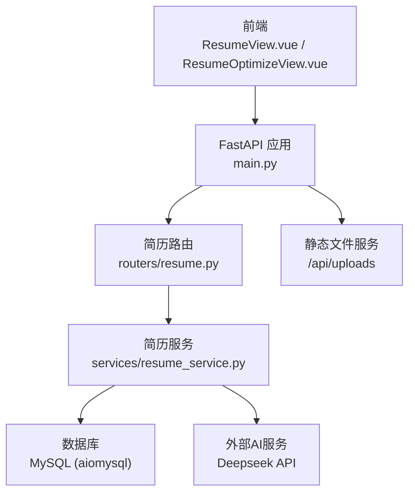
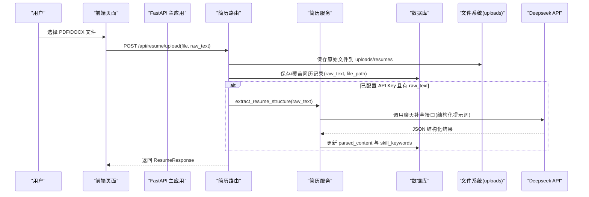
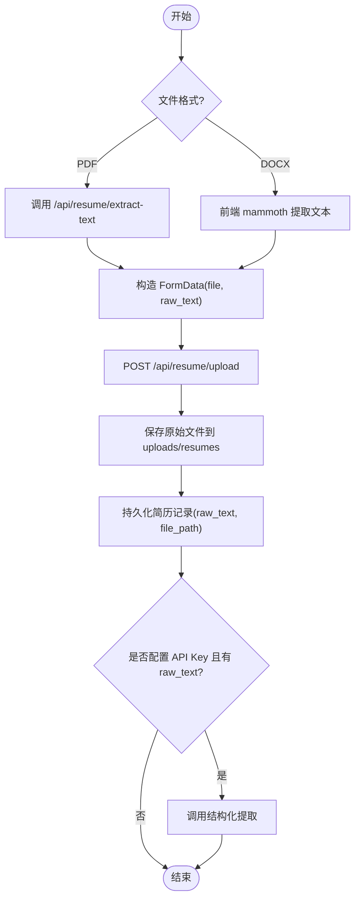
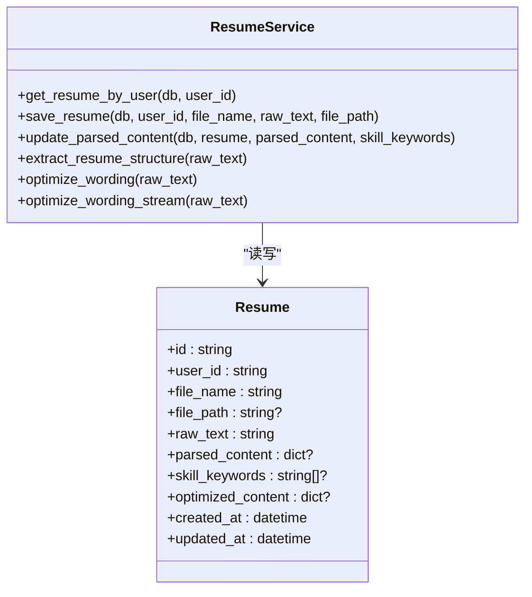
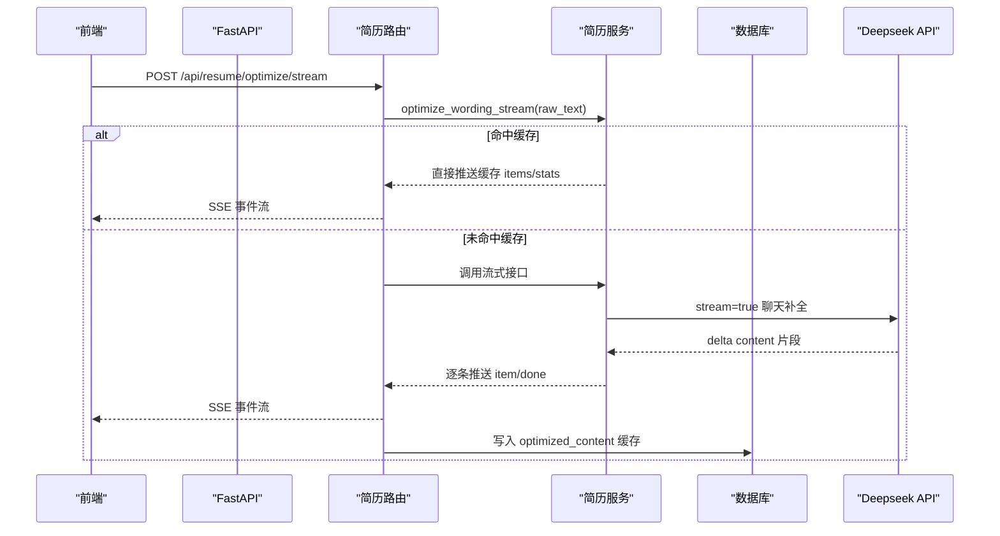
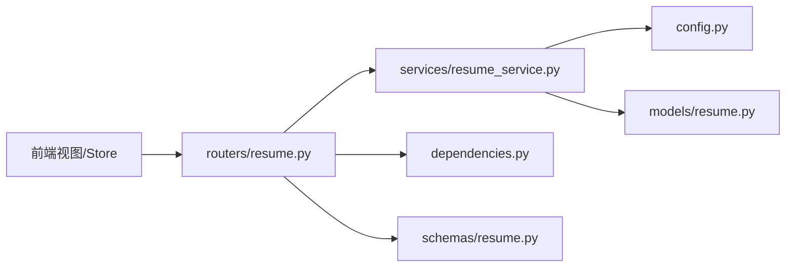

# 简历优化服务

<cite>
**本文引用的文件**   
- [main.py](file://backEnd/app/main.py)
- [resume.py](file://backEnd/app/routers/resume.py)
- [resume_service.py](file://backEnd/app/services/resume_service.py)
- [resume.py](file://backEnd/app/models/resume.py)
- [resume.py](file://backEnd/app/schemas/resume.py)
- [config.py](file://backEnd/app/config.py)
- [dependencies.py](file://backEnd/app/dependencies.py)
- [hr_interview.sql](file://hr_interview.sql)
- [ResumeView.vue](file://frontEnd/src/views/ResumeView.vue)
- [ResumeOptimizeView.vue](file://frontEnd/src/views/ResumeOptimizeView.vue)
- [resume.ts](file://frontEnd/src/stores/resume.ts)
</cite>

## 目录
1. [简介](#简介)
2. [项目结构](#项目结构)
3. [核心组件](#核心组件)
4. [架构总览](#架构总览)
5. [详细组件分析](#详细组件分析)
6. [依赖关系分析](#依赖关系分析)
7. [性能与可扩展性](#性能与可扩展性)
8. [故障排查指南](#故障排查指南)
9. [结论](#结论)
10. [附录：扩展与定制指南](#附录扩展与定制指南)

## 简介
本文件为“HR XF 简历优化服务”的技术文档，聚焦以下能力：
- 文件上传与解析引擎（PDF、Word）
- 智能内容提取算法（个人信息识别、工作经历提取、技能关键词匹配）
- 格式转换与导出（模板管理、样式定制、批量导出）
- AI 驱动的优化建议生成（质量评估、规范检查、关键词优化）
- 文件存储管理与版本控制策略
- 简历数据分析与个人画像构建
- 隐私保护与数据安全
- 新功能扩展与模板定制指导

## 项目结构
后端采用 FastAPI + SQLAlchemy 异步 ORM，前端使用 Vue 3 + Pinia。简历模块的核心路径如下：
- API 路由：/api/resume/*
- 模型与数据表：resumes
- 服务层：Deepseek API 调用、结构化提取、措辞优化
- 静态资源：uploads 目录挂载为静态文件服务

图表来源
- [main.py:44-73](file://backEnd/app/main.py#L44-L73)
- [resume.py:1-215](file://backEnd/app/routers/resume.py#L1-L215)
- [resume_service.py:1-285](file://backEnd/app/services/resume_service.py#L1-L285)
- [hr_interview.sql:445-456](file://hr_interview.sql#L445-L456)

章节来源
- [main.py:44-73](file://backEnd/app/main.py#L44-L73)
- [resume.py:1-215](file://backEnd/app/routers/resume.py#L1-L215)
- [resume_service.py:1-285](file://backEnd/app/services/resume_service.py#L1-L285)
- [hr_interview.sql:445-456](file://hr_interview.sql#L445-L456)

## 核心组件
- 路由层：提供上传、获取、分析、优化、流式优化、PDF文本提取等接口
- 服务层：封装数据库操作与 Deepseek API 调用，实现结构化提取与措辞优化
- 模型层：定义 resumes 表的字段与约束
- 配置层：读取 .env 中的数据库、CORS、Deepseek 配置
- 认证依赖：基于 Bearer Token 的当前用户解析
- 前端 Store：封装 API 请求、状态管理、SSE 流处理
- 前端视图：上传交互、结果展示、优化对比界面

章节来源
- [resume.py:1-215](file://backEnd/app/routers/resume.py#L1-L215)
- [resume_service.py:1-285](file://backEnd/app/services/resume_service.py#L1-L285)
- [resume.py:1-67](file://backEnd/app/models/resume.py#L1-L67)
- [config.py:1-71](file://backEnd/app/config.py#L1-L71)
- [dependencies.py:1-41](file://backEnd/app/dependencies.py#L1-L41)
- [resume.ts:1-243](file://frontEnd/src/stores/resume.ts#L1-L243)
- [ResumeView.vue:1-497](file://frontEnd/src/views/ResumeView.vue#L1-L497)
- [ResumeOptimizeView.vue:1-277](file://frontEnd/src/views/ResumeOptimizeView.vue#L1-L277)

## 架构总览
系统分层清晰：前端通过 REST/SSE 与后端交互；后端路由将请求委派给服务层；服务层负责持久化与外部 AI 调用；静态文件通过统一前缀暴露。

图表来源
- [resume.py:47-77](file://backEnd/app/routers/resume.py#L47-L77)
- [resume_service.py:174-178](file://backEnd/app/services/resume_service.py#L174-L178)
- [main.py:70-73](file://backEnd/app/main.py#L70-L73)

## 详细组件分析

### 文件上传与解析引擎
- 支持格式
  - PDF：前端可选择调用服务端 PyMuPDF 提取文本，或在前端使用 mammoth/pdf.js 方案；后端提供专用接口用于可靠提取
  - Word(.docx)：前端使用 mammoth 提取纯文本后上传
- 上传流程
  - 前端构造 FormData，包含 file 与 raw_text
  - 后端写入磁盘并持久化元信息（文件名、相对路径、raw_text）
  - 若已配置 Deepseek API Key 且存在 raw_text，自动触发结构化提取
- 关键接口
  - GET /api/resume/：获取当前用户简历
  - POST /api/resume/upload：上传/覆盖简历
  - POST /api/resume/extract-text：服务端 PDF 文本提取

图表来源
- [resume.py:47-77](file://backEnd/app/routers/resume.py#L47-L77)
- [resume.py:195-215](file://backEnd/app/routers/resume.py#L195-L215)
- [ResumeView.vue:416-427](file://frontEnd/src/views/ResumeView.vue#L416-L427)
- [resume.ts:209-225](file://frontEnd/src/stores/resume.ts#L209-L225)

章节来源
- [resume.py:47-77](file://backEnd/app/routers/resume.py#L47-L77)
- [resume.py:195-215](file://backEnd/app/routers/resume.py#L195-L215)
- [ResumeView.vue:416-427](file://frontEnd/src/views/ResumeView.vue#L416-L427)
- [resume.ts:209-225](file://frontEnd/src/stores/resume.ts#L209-L225)

### 智能内容提取算法
- 目标
  - 从简历文本中提取结构化信息：技能列表、工作经历、教育背景、总结、评分、建议、技能分类
- 实现方式
  - 通过 Deepseek 聊天补全接口，使用预置提示词要求返回 JSON
  - 服务层对返回内容进行正则抽取，兼容 markdown code block
- 数据结构
  - skills: 字符串数组
  - experiences: 角色、公司、时间段、时长、描述
  - education: 学校、学历专业、时间段
  - summary、score、suggestions、skill_categories

图表来源
- [resume.py:11-67](file://backEnd/app/models/resume.py#L11-L67)
- [resume_service.py:34-83](file://backEnd/app/services/resume_service.py#L34-L83)
- [resume_service.py:174-178](file://backEnd/app/services/resume_service.py#L174-L178)

章节来源
- [resume_service.py:88-113](file://backEnd/app/services/resume_service.py#L88-L113)
- [resume_service.py:174-178](file://backEnd/app/services/resume_service.py#L174-L178)
- [resume.py:41-50](file://backEnd/app/models/resume.py#L41-L50)

### 格式转换与导出
- 现状
  - 当前未实现服务端模板管理与批量导出功能
  - 前端可下载 Word 源文件（由浏览器直接访问静态文件），但无模板渲染与样式定制
- 建议扩展
  - 引入模板引擎（如 Jinja2 + python-docx）在服务端生成 docx
  - 增加模板管理接口（CRUD 模板、预览、变量映射）
  - 支持批量导出（按用户维度或筛选条件）
  - 样式定制（主题、配色、布局参数）

[本节为概念性说明，不直接分析具体文件]

### AI 驱动的优化建议生成机制
- 功能
  - 同步优化：/api/resume/optimize
  - 流式优化：/api/resume/optimize/stream（SSE）
- 机制
  - 优先返回缓存（optimized_content），否则调用 Deepseek 进行措辞优化
  - 流式模式下，边生成边推送 item 与 stats，最终落库缓存
- 输出
  - original/optimized 分段对比
  - stats：优化条数、专业度提升、量化指标新增、综合评级

图表来源
- [resume.py:100-192](file://backEnd/app/routers/resume.py#L100-L192)
- [resume_service.py:186-285](file://backEnd/app/services/resume_service.py#L186-L285)

章节来源
- [resume.py:100-192](file://backEnd/app/routers/resume.py#L100-L192)
- [resume_service.py:186-285](file://backEnd/app/services/resume_service.py#L186-L285)

### 文件存储管理与版本控制策略
- 存储位置
  - 本地磁盘：uploads/resumes
  - 静态挂载：/api/uploads 前缀
- 命名策略
  - 文件名：{user_id}_{随机短ID}.{ext}
- 版本控制
  - 当前每用户仅一条简历记录（user_id 唯一）
  - 覆盖上传会清空结构化与优化缓存，便于重新分析
- 建议增强
  - 引入对象存储（MinIO，已在配置中预留）
  - 增加版本字段与历史归档，支持回滚与审计

章节来源
- [main.py:70-73](file://backEnd/app/main.py#L70-L73)
- [resume.py:21-22](file://backEnd/app/routers/resume.py#L21-L22)
- [resume.py:57-67](file://backEnd/app/routers/resume.py#L57-L67)
- [resume.py:19-25](file://backEnd/app/models/resume.py#L19-L25)
- [config.py:25-30](file://backEnd/app/config.py#L25-L30)

### 简历数据分析与个人画像构建
- 数据来源
  - parsed_content：结构化提取结果
  - skill_keywords：技能关键词列表
- 前端展示
  - 技能词云、经验卡片、教育背景、评分与建议
- 建议扩展
  - 增加画像标签体系（行业、岗位、技术栈、软技能）
  - 趋势分析（多次优化后的变化统计）
  - 与职位需求匹配度计算

章节来源
- [resume.py:41-50](file://backEnd/app/models/resume.py#L41-L50)
- [ResumeView.vue:165-195](file://frontEnd/src/views/ResumeView.vue#L165-L195)

### 隐私保护与数据安全
- 传输安全
  - 所有接口需携带 Authorization: Bearer <token>
  - 自定义验证错误处理器避免二进制内容导致解码异常
- 认证与授权
  - get_current_user 校验 JWT 载荷与用户状态
- 建议增强
  - 启用 HTTPS
  - 对敏感字段加密存储（如联系方式）
  - 限制上传大小与类型白名单
  - 日志脱敏（避免记录 token 与文件内容）

章节来源
- [dependencies.py:13-41](file://backEnd/app/dependencies.py#L13-L41)
- [main.py:76-84](file://backEnd/app/main.py#L76-L84)

## 依赖关系分析
- 路由依赖
  - 依赖数据库会话（AsyncSession）
  - 依赖当前用户（Bearer Token 解析）
- 服务依赖
  - 依赖配置（Deepseek API Key/URL/Model）
  - 依赖 httpx 异步客户端调用外部 LLM
- 前端依赖
  - Pinia 状态管理
  - Fetch API 与 SSE 事件流

图表来源
- [resume.py:1-215](file://backEnd/app/routers/resume.py#L1-L215)
- [resume_service.py:1-285](file://backEnd/app/services/resume_service.py#L1-L285)
- [dependencies.py:1-41](file://backEnd/app/dependencies.py#L1-L41)
- [config.py:1-71](file://backEnd/app/config.py#L1-L71)
- [resume.py:1-67](file://backEnd/app/models/resume.py#L1-L67)
- [resume.py:1-35](file://backEnd/app/schemas/resume.py#L1-L35)

章节来源
- [resume.py:1-215](file://backEnd/app/routers/resume.py#L1-L215)
- [resume_service.py:1-285](file://backEnd/app/services/resume_service.py#L1-L285)
- [dependencies.py:1-41](file://backEnd/app/dependencies.py#L1-L41)
- [config.py:1-71](file://backEnd/app/config.py#L1-L71)
- [resume.py:1-67](file://backEnd/app/models/resume.py#L1-L67)
- [resume.py:1-35](file://backEnd/app/schemas/resume.py#L1-L35)

## 性能与可扩展性
- 流式优化
  - 使用 SSE 降低首屏等待时间，提升用户体验
- 缓存策略
  - 优化结果持久化，重复请求直接返回
- 并发与超时
  - httpx 异步客户端设置合理超时，避免阻塞
- 可扩展点
  - 替换 LLM 提供商（抽象 call_deepseek）
  - 增加异步任务队列（Celery/RQ）处理耗时任务
  - 引入对象存储与 CDN 加速静态文件访问

[本节为通用建议，不直接分析具体文件]

## 故障排查指南
- 常见错误
  - 未配置 API Key：路由层返回 400 错误
  - 无简历记录：路由层返回 404
  - AI 分析失败：路由层返回 500 并附带错误详情
- 定位方法
  - 查看路由层异常处理与日志打印
  - 检查 .env 配置是否正确加载
  - 确认 uploads 目录权限与空间
- 前端错误
  - 网络请求失败时显示 detail 消息
  - SSE 连接中断时提示重试

章节来源
- [resume.py:80-98](file://backEnd/app/routers/resume.py#L80-L98)
- [resume.py:100-137](file://backEnd/app/routers/resume.py#L100-L137)
- [resume.py:140-192](file://backEnd/app/routers/resume.py#L140-L192)
- [main.py:76-84](file://backEnd/app/main.py#L76-L84)

## 结论
该简历优化服务实现了从上传解析、结构化提取到 AI 优化的完整链路，具备流式响应与缓存机制，满足基本业务需求。后续可在模板导出、版本控制、隐私安全与性能优化方面进一步增强。

[本节为总结性内容，不直接分析具体文件]

## 附录：扩展与定制指南
- 新增模板导出
  - 在后端新增模板管理路由与服务
  - 集成 python-docx 与 Jinja2 渲染模板
  - 前端增加模板选择与批量导出入口
- 接入新 LLM
  - 在 service 层抽象对外部模型的调用接口
  - 调整提示词与返回结构适配新模型
- 增强数据画像
  - 增加画像标签与匹配度计算逻辑
  - 前端可视化展示画像与趋势

[本节为概念性指导，不直接分析具体文件]