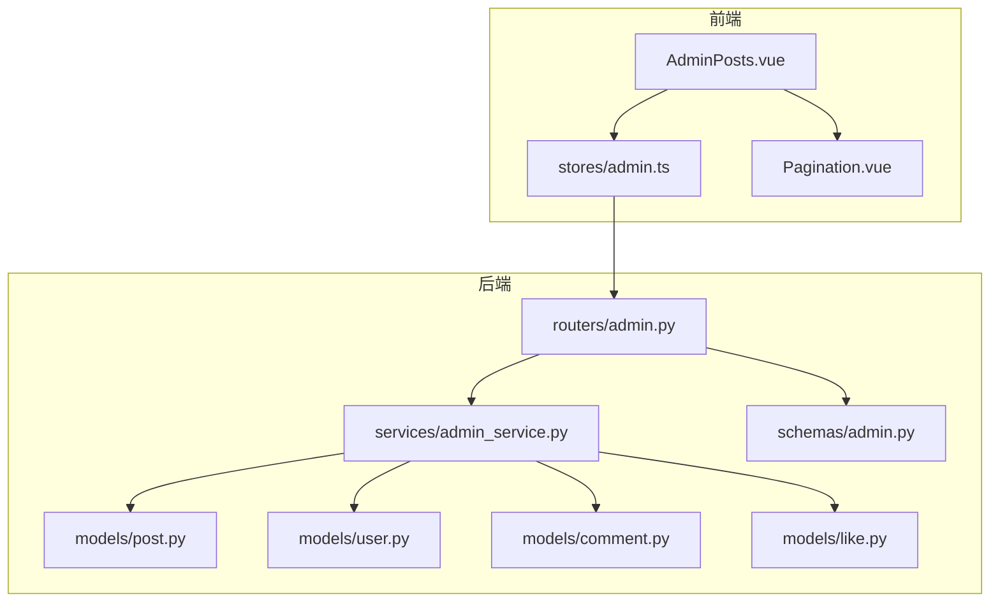
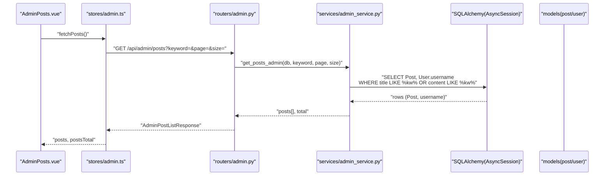
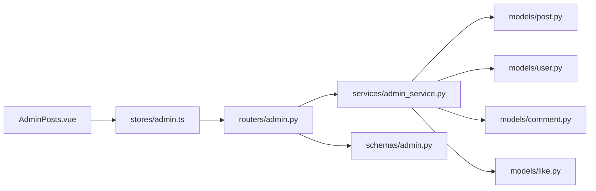

# 帖子管理

<cite>
**本文引用的文件**
- [post.py](file://backEnd/app/models/post.py)
- [user.py](file://backEnd/app/models/user.py)
- [comment.py](file://backEnd/app/models/comment.py)
- [like.py](file://backEnd/app/models/like.py)
- [admin.py](file://backEnd/app/routers/admin.py)
- [admin_service.py](file://backEnd/app/services/admin_service.py)
- [admin.py](file://backEnd/app/schemas/admin.py)
- [AdminPosts.vue](file://frontEnd/src/views/admin/AdminPosts.vue)
- [admin.ts](file://frontEnd/src/stores/admin.ts)
- [Pagination.vue](file://frontEnd/src/views/admin/Pagination.vue)
</cite>

## 目录
1. [简介](#简介)
2. [项目结构](#项目结构)
3. [核心组件](#核心组件)
4. [架构总览](#架构总览)
5. [详细组件分析](#详细组件分析)
6. [依赖关系分析](#依赖关系分析)
7. [性能考虑](#性能考虑)
8. [故障排查指南](#故障排查指南)
9. [结论](#结论)
10. [附录](#附录)

## 简介
本文件聚焦 HR XF 社区“帖子管理”功能，覆盖管理端对帖子的查询与删除操作。文档将详细说明：
- 帖子列表的分页查询与关键词搜索（支持标题与内容）
- AdminPostItem 数据模型结构与字段定义
- 帖子删除的业务逻辑与数据清理机制
- 帖子内容与用户的关联关系及引用完整性
- 帖子审核与违规处理方案建议
- 管理界面交互设计与反馈
- 备份恢复与误删恢复的数据保护机制建议

## 项目结构
后端采用 FastAPI + SQLAlchemy 异步 ORM；前端使用 Vue 3 + Pinia。帖子管理相关的关键路径如下：
- 路由层：/api/admin/posts（GET 列表、DELETE 删除）
- 服务层：get_posts_admin、delete_post
- 模型层：Post、User、Comment、Like
- 模式层：AdminPostItem、AdminPostListResponse
- 前端视图：AdminPosts.vue、stores/admin.ts、Pagination.vue

图表来源
- [admin.py:1-198](file://backEnd/app/routers/admin.py#L1-L198)
- [admin_service.py:1-224](file://backEnd/app/services/admin_service.py#L1-L224)
- [admin.py:1-123](file://backEnd/app/schemas/admin.py#L1-L123)
- [post.py:1-65](file://backEnd/app/models/post.py#L1-L65)
- [user.py:1-45](file://backEnd/app/models/user.py#L1-L45)
- [comment.py:1-53](file://backEnd/app/models/comment.py#L1-L53)
- [like.py:1-47](file://backEnd/app/models/like.py#L1-L47)
- [AdminPosts.vue:1-151](file://frontEnd/src/views/admin/AdminPosts.vue#L1-L151)
- [admin.ts:1-250](file://frontEnd/src/stores/admin.ts#L1-L250)
- [Pagination.vue:1-60](file://frontEnd/src/views/admin/Pagination.vue#L1-L60)

章节来源
- [admin.py:165-198](file://backEnd/app/routers/admin.py#L165-L198)
- [admin_service.py:173-224](file://backEnd/app/services/admin_service.py#L173-L224)
- [admin.py:100-123](file://backEnd/app/schemas/admin.py#L100-L123)
- [post.py:18-65](file://backEnd/app/models/post.py#L18-L65)
- [user.py:10-45](file://backEnd/app/models/user.py#L10-L45)
- [comment.py:17-53](file://backEnd/app/models/comment.py#L17-L53)
- [like.py:16-47](file://backEnd/app/models/like.py#L16-L47)
- [AdminPosts.vue:1-151](file://frontEnd/src/views/admin/AdminPosts.vue#L1-L151)
- [admin.ts:193-221](file://frontEnd/src/stores/admin.ts#L193-L221)
- [Pagination.vue:1-60](file://frontEnd/src/views/admin/Pagination.vue#L1-L60)

## 核心组件
- 路由层
  - GET /api/admin/posts：分页+关键词搜索（标题/内容），返回 AdminPostListResponse
  - DELETE /api/admin/posts/{post_id}：删除指定帖子
- 服务层
  - get_posts_admin：按 keyword 过滤（title/content）、分页、聚合作者名
  - delete_post：根据 post_id 删除帖子
- 模式层
  - AdminPostItem：包含 id、title、author_id、author_name、company、position、likes_count、comments_count、status、created_at
  - AdminPostListResponse：posts 列表 + total/page/size
- 模型层
  - Post：帖子主表，含 author_id 外键、结构化字段（公司/岗位/年份/面试类型/状态等）
  - User：用户表，提供 author_name
  - Comment/Like：评论/点赞表，均通过外键级联删除到 Post
- 前端
  - AdminPosts.vue：展示帖子表格、搜索框、删除按钮、分页
  - stores/admin.ts：封装 API 请求、维护 posts 状态、调用 fetchPosts/deletePost
  - Pagination.vue：通用分页组件

章节来源
- [admin.py:167-198](file://backEnd/app/routers/admin.py#L167-L198)
- [admin_service.py:175-224](file://backEnd/app/services/admin_service.py#L175-L224)
- [admin.py:100-123](file://backEnd/app/schemas/admin.py#L100-L123)
- [post.py:18-65](file://backEnd/app/models/post.py#L18-L65)
- [user.py:10-45](file://backEnd/app/models/user.py#L10-L45)
- [comment.py:17-53](file://backEnd/app/models/comment.py#L17-L53)
- [like.py:16-47](file://backEnd/app/models/like.py#L16-L47)
- [AdminPosts.vue:1-151](file://frontEnd/src/views/admin/AdminPosts.vue#L1-L151)
- [admin.ts:193-221](file://frontEnd/src/stores/admin.ts#L193-L221)
- [Pagination.vue:1-60](file://frontEnd/src/views/admin/Pagination.vue#L1-L60)

## 架构总览
以下序列图展示了“获取帖子列表”的端到端流程，包括分页与关键词搜索。

图表来源
- [admin.py:167-184](file://backEnd/app/routers/admin.py#L167-L184)
- [admin_service.py:175-213](file://backEnd/app/services/admin_service.py#L175-L213)
- [post.py:18-65](file://backEnd/app/models/post.py#L18-L65)
- [user.py:10-45](file://backEnd/app/models/user.py#L10-L45)
- [AdminPosts.vue:124-132](file://frontEnd/src/views/admin/AdminPosts.vue#L124-L132)
- [admin.ts:195-215](file://frontEnd/src/stores/admin.ts#L195-L215)

## 详细组件分析

### 帖子列表查询（分页+关键词搜索）
- 接口契约
  - 方法：GET
  - 路径：/api/admin/posts
  - 查询参数：
    - keyword：可选，用于匹配标题或内容
    - page：起始为 1
    - size：默认 20，范围 1~100
  - 响应体：AdminPostListResponse，包含 posts 数组与 total/page/size
- 实现要点
  - 路由层接收参数并调用服务层
  - 服务层执行 JOIN 查询 Post 与 User.username，按 keyword 模糊匹配 title/content，计算总数后分页
  - 返回字典列表，由路由层直接构造 AdminPostListResponse
- 复杂度
  - 时间：O(N) 扫描满足条件的行，COUNT 子查询一次
  - 空间：O(K) 返回一页结果
- 边界情况
  - keyword 为空时不过滤
  - 作者被删除时，username 可能为 NULL，服务层以“未知用户”兜底

章节来源
- [admin.py:167-184](file://backEnd/app/routers/admin.py#L167-L184)
- [admin_service.py:175-213](file://backEnd/app/services/admin_service.py#L175-L213)
- [admin.py:118-123](file://backEnd/app/schemas/admin.py#L118-L123)

### 帖子删除
- 接口契约
  - 方法：DELETE
  - 路径：/api/admin/posts/{post_id}
  - 响应：成功返回消息体，不存在则 404
- 业务逻辑
  - 路由层校验管理员权限后调用服务层
  - 服务层根据 post_id 查找并删除记录，flush 提交事务
- 数据清理机制
  - 数据库外键 ondelete=CASCADE：删除帖子会级联删除其评论与点赞记录
  - 注意：当前未显式清理与帖子相关的计数缓存或附件（如有）
- 错误处理
  - 找不到帖子返回 404

章节来源
- [admin.py:187-198](file://backEnd/app/routers/admin.py#L187-L198)
- [admin_service.py:216-224](file://backEnd/app/services/admin_service.py#L216-L224)
- [comment.py:25-30](file://backEnd/app/models/comment.py#L25-L30)
- [like.py:27-32](file://backEnd/app/models/like.py#L27-L32)

### AdminPostItem 数据模型
- 字段说明
  - id：帖子唯一标识
  - title：标题
  - author_id：作者用户 ID
  - author_name：作者用户名（来自 User.username）
  - company：公司
  - position：岗位
  - likes_count：点赞数
  - comments_count：评论数
  - status：状态（如 approved/pending/rejected/in_progress）
  - created_at：创建时间
- 数据来源
  - 由服务层从 Post 与 User 联合查询拼装得到

章节来源
- [admin.py:102-116](file://backEnd/app/schemas/admin.py#L102-L116)
- [admin_service.py:198-213](file://backEnd/app/services/admin_service.py#L198-L213)

### 帖子与用户的关系与引用完整性
- 关系
  - Post.author_id -> User.id（外键）
  - Comment.post_id -> Post.id（外键，ondelete=CASCADE）
  - Like.post_id -> Post.id（外键，ondelete=CASCADE）
- 引用完整性
  - 删除用户时，其帖子仍保留（Post.author_id 无 ondelete 动作）
  - 删除帖子时，其评论与点赞自动级联删除
- 潜在问题与建议
  - 若需软删除用户且保留历史帖子，可引入 is_active 标记而非物理删除
  - 若需要审计追踪，可增加 deleted_at 或独立审计表

章节来源
- [post.py:26-31](file://backEnd/app/models/post.py#L26-L31)
- [comment.py:25-30](file://backEnd/app/models/comment.py#L25-L30)
- [like.py:27-32](file://backEnd/app/models/like.py#L27-L32)

### 帖子内容审核与违规处理方案（建议）
- 现状
  - 现有代码未发现内置的内容审核/违规处理逻辑
- 建议方案
  - 在 Post 模型中增加审核相关字段（如 review_status、review_reason、reviewed_by、reviewed_at）
  - 在服务层新增审核接口（批准/拒绝/标记待审），并在列表查询中支持按状态筛选
  - 结合外部内容安全服务进行敏感词/图片/链接检测，自动打标
  - 对违规内容执行限流、隐藏或下架策略，并提供人工复核入口
  - 记录审核日志，便于追溯

[本节为概念性建议，不直接分析具体文件]

### 管理界面交互设计与反馈
- 页面布局
  - 顶部标题与统计信息
  - 搜索栏：输入关键词，回车或点击按钮触发搜索
  - 表格列：帖子、作者、公司/岗位、互动（点赞/评论）、状态、发布时间、操作
  - 分页组件：显示总条数与页码导航
- 交互流程
  - 进入页面时加载第一页数据
  - 修改关键词或翻页时重置为第 1 页并重新拉取
  - 删除前弹出确认框，成功后移除本地行并更新总数
- 错误反馈
  - 网络异常或后端报错时，弹窗提示错误信息

章节来源
- [AdminPosts.vue:1-151](file://frontEnd/src/views/admin/AdminPosts.vue#L1-L151)
- [admin.ts:195-221](file://frontEnd/src/stores/admin.ts#L195-L221)
- [Pagination.vue:1-60](file://frontEnd/src/views/admin/Pagination.vue#L1-L60)

### 备份恢复与误删恢复（建议）
- 现状
  - 当前未实现专门的备份/恢复或软删除机制
- 建议方案
  - 数据库层面：定期全量/增量备份；开启 binlog/WAL 以便时间点恢复
  - 应用层面：引入软删除（deleted_at）与回收站功能，支持批量恢复
  - 审计层面：记录关键操作的审计日志（操作人、时间、变更前后快照）
  - 数据一致性：删除操作尽量放在事务中，确保级联删除的一致性

[本节为概念性建议，不直接分析具体文件]

## 依赖关系分析
- 模块耦合
  - 路由层依赖服务层与模式层
  - 服务层依赖模型层（Post/User/Comment/Like）
  - 前端 store 依赖路由层 REST API
- 外部依赖
  - FastAPI、SQLAlchemy 异步会话
  - Pydantic 模式校验
- 循环依赖
  - 未发现循环导入

图表来源
- [admin.py:1-198](file://backEnd/app/routers/admin.py#L1-L198)
- [admin_service.py:1-224](file://backEnd/app/services/admin_service.py#L1-L224)
- [post.py:1-65](file://backEnd/app/models/post.py#L1-L65)
- [user.py:1-45](file://backEnd/app/models/user.py#L1-L45)
- [comment.py:1-53](file://backEnd/app/models/comment.py#L1-L53)
- [like.py:1-47](file://backEnd/app/models/like.py#L1-L47)
- [admin.py:1-123](file://backEnd/app/schemas/admin.py#L1-L123)
- [AdminPosts.vue:1-151](file://frontEnd/src/views/admin/AdminPosts.vue#L1-L151)
- [admin.ts:1-250](file://frontEnd/src/stores/admin.ts#L1-L250)

## 性能考虑
- 查询优化
  - 关键词搜索使用 LIKE %kw%，建议在 title/content 上建立全文索引或使用搜索引擎（如 Elasticsearch）提升性能
  - 分页使用 offset/limit，当数据量大时可考虑基于游标的分页
- 连接与会话
  - 使用异步会话减少阻塞，避免长事务
- 响应体积
  - 仅返回必要字段，避免 N+1 查询（当前已使用 selectin/noload 控制关系加载）

[本节提供一般性指导，不直接分析具体文件]

## 故障排查指南
- 常见问题
  - 403 无管理员权限：检查当前登录用户是否满足管理员条件
  - 404 帖子不存在：确认 post_id 有效且未被提前删除
  - 搜索无结果：确认 keyword 是否为空或大小写/编码问题
- 定位步骤
  - 查看浏览器 Network 面板的请求与响应
  - 检查后端日志中的 SQL 语句与异常堆栈
  - 验证数据库中是否存在对应记录以及外键约束是否生效

章节来源
- [admin.py:26-34](file://backEnd/app/routers/admin.py#L26-L34)
- [admin.py:187-198](file://backEnd/app/routers/admin.py#L187-L198)

## 结论
HR XF 的帖子管理功能在后端提供了清晰的分页查询与删除能力，并通过外键级联保证了评论与点赞的数据一致性。前端实现了直观的搜索、分页与删除交互。针对内容审核、备份恢复与误删恢复，建议引入软删除、审核工作流与完善的备份策略，以提升系统的安全性与可运维性。

## 附录

### API 参考（管理端）
- 获取帖子列表
  - 方法：GET
  - 路径：/api/admin/posts
  - 查询参数：keyword、page、size
  - 响应：AdminPostListResponse
- 删除帖子
  - 方法：DELETE
  - 路径：/api/admin/posts/{post_id}
  - 响应：成功消息或 404

章节来源
- [admin.py:167-198](file://backEnd/app/routers/admin.py#L167-L198)
- [admin.py:118-123](file://backEnd/app/schemas/admin.py#L118-L123)