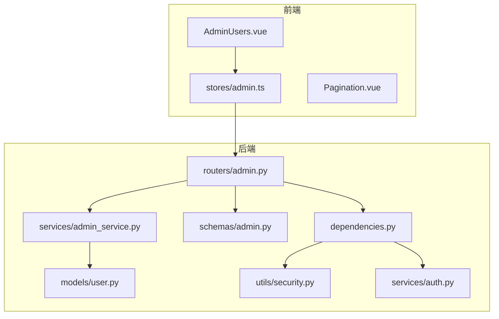
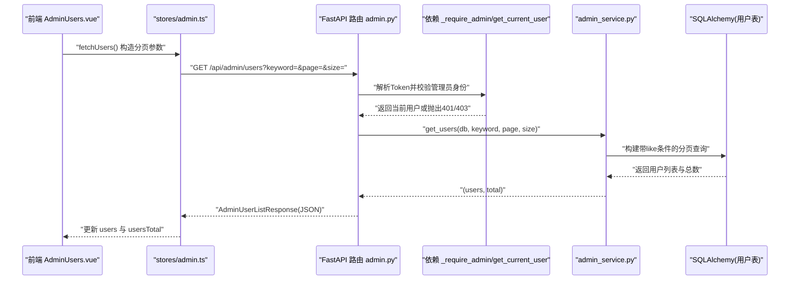
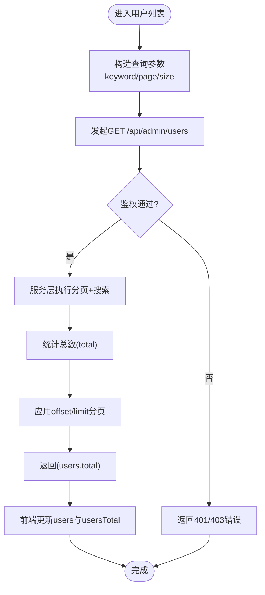
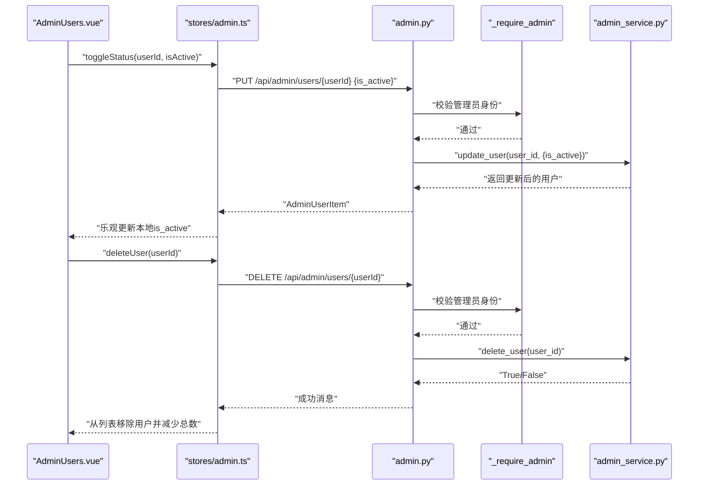
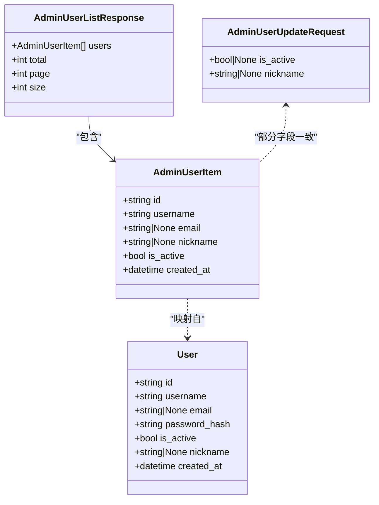
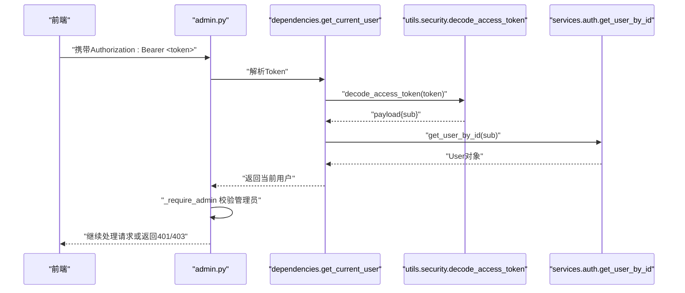
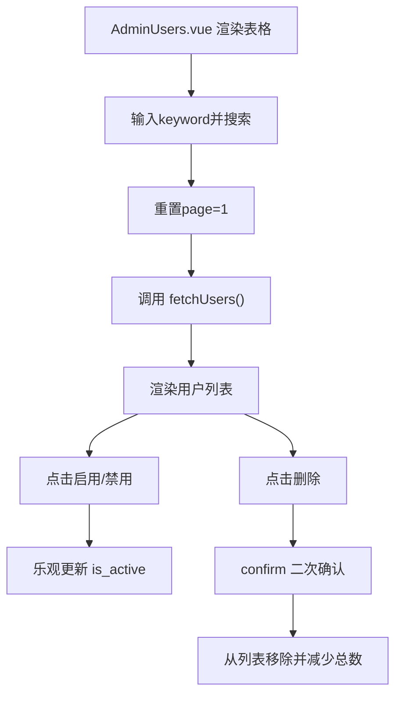
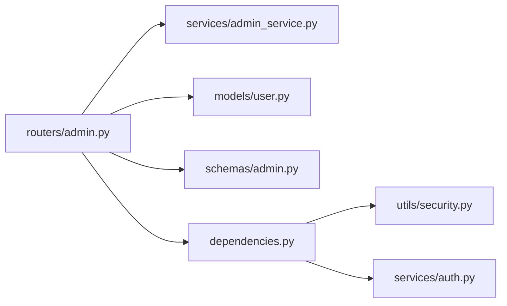

# 用户管理

<cite>
**本文引用的文件**   
- [backEnd/app/routers/admin.py](file://backEnd/app/routers/admin.py)
- [backEnd/app/schemas/admin.py](file://backEnd/app/schemas/admin.py)
- [backEnd/app/models/user.py](file://backEnd/app/models/user.py)
- [backEnd/app/services/admin_service.py](file://backEnd/app/services/admin_service.py)
- [backEnd/app/dependencies.py](file://backEnd/app/dependencies.py)
- [backEnd/app/utils/security.py](file://backEnd/app/utils/security.py)
- [backEnd/app/services/auth.py](file://backEnd/app/services/auth.py)
- [frontEnd/src/views/admin/AdminUsers.vue](file://frontEnd/src/views/admin/AdminUsers.vue)
- [frontEnd/src/stores/admin.ts](file://frontEnd/src/stores/admin.ts)
- [frontEnd/src/views/admin/Pagination.vue](file://frontEnd/src/views/admin/Pagination.vue)
</cite>

## 目录
1. [简介](#简介)
2. [项目结构](#项目结构)
3. [核心组件](#核心组件)
4. [架构总览](#架构总览)
5. [详细组件分析](#详细组件分析)
6. [依赖关系分析](#依赖关系分析)
7. [性能考虑](#性能考虑)
8. [故障排查指南](#故障排查指南)
9. [结论](#结论)
10. [附录](#附录)

## 简介
本文件面向HR XF项目的“用户管理”功能，覆盖后端接口、数据模型、权限校验与前端交互。重点包括：
- 用户列表的获取与分页查询（支持用户名/邮箱/昵称关键词搜索）
- 用户信息的CRUD操作（启用/禁用、删除的安全限制）
- AdminUserItem 与 AdminUserUpdateRequest 数据模型定义与使用
- 管理员权限验证与访问控制机制
- 前端展示与管理界面交互
- 批量用户操作与用户体验优化建议

## 项目结构
围绕用户管理的关键代码分布在以下位置：
- 路由层：admin 路由提供 /api/admin/users 相关接口
- 服务层：admin_service 实现用户列表查询、更新、删除等逻辑
- 数据模型：user 模型定义用户实体字段
- 模式定义：schemas/admin 定义前后端交互的数据结构
- 依赖注入：dependencies 提供当前用户解析与鉴权
- 安全工具：utils/security 提供JWT解码与密码处理
- 认证服务：services/auth 提供用户查询与状态检查
- 前端页面：AdminUsers.vue 负责用户列表、搜索、分页、启停与删除
- 前端Store：stores/admin.ts 封装API调用与状态管理
- 分页组件：Pagination.vue 提供通用分页UI

图表来源
- [backEnd/app/routers/admin.py:50-100](file://backEnd/app/routers/admin.py#L50-L100)
- [backEnd/app/services/admin_service.py:47-101](file://backEnd/app/services/admin_service.py#L47-L101)
- [backEnd/app/models/user.py:10-45](file://backEnd/app/models/user.py#L10-L45)
- [backEnd/app/schemas/admin.py:21-43](file://backEnd/app/schemas/admin.py#L21-L43)
- [backEnd/app/dependencies.py:13-41](file://backEnd/app/dependencies.py#L13-L41)
- [backEnd/app/utils/security.py:39-48](file://backEnd/app/utils/security.py#L39-L48)
- [backEnd/app/services/auth.py:23-35](file://backEnd/app/services/auth.py#L23-L35)
- [frontEnd/src/views/admin/AdminUsers.vue:123-165](file://frontEnd/src/views/admin/AdminUsers.vue#L123-L165)
- [frontEnd/src/stores/admin.ts:107-142](file://frontEnd/src/stores/admin.ts#L107-L142)
- [frontEnd/src/views/admin/Pagination.vue:41-59](file://frontEnd/src/views/admin/Pagination.vue#L41-L59)

章节来源
- [backEnd/app/routers/admin.py:50-100](file://backEnd/app/routers/admin.py#L50-L100)
- [backEnd/app/services/admin_service.py:47-101](file://backEnd/app/services/admin_service.py#L47-L101)
- [backEnd/app/models/user.py:10-45](file://backEnd/app/models/user.py#L10-L45)
- [backEnd/app/schemas/admin.py:21-43](file://backEnd/app/schemas/admin.py#L21-L43)
- [backEnd/app/dependencies.py:13-41](file://backEnd/app/dependencies.py#L13-L41)
- [backEnd/app/utils/security.py:39-48](file://backEnd/app/utils/security.py#L39-L48)
- [backEnd/app/services/auth.py:23-35](file://backEnd/app/services/auth.py#L23-L35)
- [frontEnd/src/views/admin/AdminUsers.vue:123-165](file://frontEnd/src/views/admin/AdminUsers.vue#L123-L165)
- [frontEnd/src/stores/admin.ts:107-142](file://frontEnd/src/stores/admin.ts#L107-L142)
- [frontEnd/src/views/admin/Pagination.vue:41-59](file://frontEnd/src/views/admin/Pagination.vue#L41-L59)

## 核心组件
- 路由层
  - GET /api/admin/users：返回分页用户列表，支持 keyword 搜索（用户名/邮箱/昵称），page/size 分页参数
  - PUT /api/admin/users/{user_id}：更新用户（如 is_active、nickname）
  - DELETE /api/admin/users/{user_id}：删除用户，包含“禁止删除自己”的安全限制
- 服务层
  - get_users：构建带可选关键词过滤的分页查询，返回 (users, total)
  - update_user：按字段动态更新用户记录
  - delete_user：根据ID删除用户
- 数据模型与模式
  - User：数据库用户实体，包含 username、email、nickname、is_active、created_at 等
  - AdminUserItem：用户项响应结构
  - AdminUserListResponse：分页列表响应结构
  - AdminUserUpdateRequest：更新请求体结构
- 权限与鉴权
  - _require_admin：基于当前用户的 email/username 是否包含“admin”进行简易管理员校验
  - get_current_user：从Bearer Token解析用户并校验用户存在且未被禁用
  - decode_access_token：JWT解码
  - get_user_by_id：通过ID获取用户
- 前端
  - AdminUsers.vue：搜索、分页、切换状态、删除确认
  - stores/admin.ts：统一API请求封装、状态管理、分页参数构造
  - Pagination.vue：通用分页控件

章节来源
- [backEnd/app/routers/admin.py:50-100](file://backEnd/app/routers/admin.py#L50-L100)
- [backEnd/app/services/admin_service.py:47-101](file://backEnd/app/services/admin_service.py#L47-L101)
- [backEnd/app/models/user.py:10-45](file://backEnd/app/models/user.py#L10-L45)
- [backEnd/app/schemas/admin.py:21-43](file://backEnd/app/schemas/admin.py#L21-L43)
- [backEnd/app/dependencies.py:13-41](file://backEnd/app/dependencies.py#L13-L41)
- [backEnd/app/utils/security.py:39-48](file://backEnd/app/utils/security.py#L39-L48)
- [backEnd/app/services/auth.py:23-35](file://backEnd/app/services/auth.py#L23-L35)
- [frontEnd/src/views/admin/AdminUsers.vue:123-165](file://frontEnd/src/views/admin/AdminUsers.vue#L123-L165)
- [frontEnd/src/stores/admin.ts:107-142](file://frontEnd/src/stores/admin.ts#L107-L142)
- [frontEnd/src/views/admin/Pagination.vue:41-59](file://frontEnd/src/views/admin/Pagination.vue#L41-L59)

## 架构总览
下图展示了从前端到后端的完整调用链路，包括鉴权、权限校验、业务逻辑与数据持久化。

图表来源
- [backEnd/app/routers/admin.py:50-67](file://backEnd/app/routers/admin.py#L50-L67)
- [backEnd/app/dependencies.py:13-41](file://backEnd/app/dependencies.py#L13-L41)
- [backEnd/app/services/admin_service.py:47-72](file://backEnd/app/services/admin_service.py#L47-L72)
- [frontEnd/src/stores/admin.ts:107-127](file://frontEnd/src/stores/admin.ts#L107-L127)
- [frontEnd/src/views/admin/AdminUsers.vue:130-138](file://frontEnd/src/views/admin/AdminUsers.vue#L130-L138)

## 详细组件分析

### 用户列表与分页查询
- 接口定义
  - GET /api/admin/users
  - 查询参数
    - keyword：可选，用于模糊匹配用户名/邮箱/昵称
    - page：起始页码，默认1，最小值1
    - size：每页条数，默认20，范围1~100
- 后端实现要点
  - 路由层接收参数并调用服务层
  - 服务层使用 like 条件组合 or_ 实现三字段模糊搜索
  - 先统计总数再分页，避免全表扫描
  - 结果按 created_at 倒序排列
- 前端实现要点
  - stores/admin.ts 将 userFilters.keyword/page/size 拼接为URL参数
  - AdminUsers.vue 在搜索时重置页码为1并重新拉取数据
  - Pagination.vue 计算总页数并渲染页码按钮

图表来源
- [backEnd/app/routers/admin.py:50-67](file://backEnd/app/routers/admin.py#L50-L67)
- [backEnd/app/services/admin_service.py:47-72](file://backEnd/app/services/admin_service.py#L47-L72)
- [frontEnd/src/stores/admin.ts:107-127](file://frontEnd/src/stores/admin.ts#L107-L127)
- [frontEnd/src/views/admin/AdminUsers.vue:130-138](file://frontEnd/src/views/admin/AdminUsers.vue#L130-L138)

章节来源
- [backEnd/app/routers/admin.py:50-67](file://backEnd/app/routers/admin.py#L50-L67)
- [backEnd/app/services/admin_service.py:47-72](file://backEnd/app/services/admin_service.py#L47-L72)
- [frontEnd/src/stores/admin.ts:107-127](file://frontEnd/src/stores/admin.ts#L107-L127)
- [frontEnd/src/views/admin/AdminUsers.vue:130-138](file://frontEnd/src/views/admin/AdminUsers.vue#L130-L138)
- [frontEnd/src/views/admin/Pagination.vue:41-59](file://frontEnd/src/views/admin/Pagination.vue#L41-L59)

### 用户信息CRUD与状态管理
- 更新用户
  - PUT /api/admin/users/{user_id}
  - 请求体：AdminUserUpdateRequest（可更新 is_active、nickname）
  - 行为：仅更新非空字段；不存在则返回404
- 删除用户
  - DELETE /api/admin/users/{user_id}
  - 安全限制：禁止管理员删除自己（比较当前用户ID与目标ID）
  - 行为：不存在则返回404
- 前端交互
  - 切换状态：toggleStatus 调用PUT接口并乐观更新本地状态
  - 删除：handleDelete 弹出确认框，确认后调用DELETE接口并从本地列表移除

图表来源
- [backEnd/app/routers/admin.py:70-99](file://backEnd/app/routers/admin.py#L70-L99)
- [backEnd/app/services/admin_service.py:75-101](file://backEnd/app/services/admin_service.py#L75-L101)
- [frontEnd/src/views/admin/AdminUsers.vue:140-155](file://frontEnd/src/views/admin/AdminUsers.vue#L140-L155)
- [frontEnd/src/stores/admin.ts:129-142](file://frontEnd/src/stores/admin.ts#L129-L142)

章节来源
- [backEnd/app/routers/admin.py:70-99](file://backEnd/app/routers/admin.py#L70-L99)
- [backEnd/app/services/admin_service.py:75-101](file://backEnd/app/services/admin_service.py#L75-L101)
- [frontEnd/src/views/admin/AdminUsers.vue:140-155](file://frontEnd/src/views/admin/AdminUsers.vue#L140-L155)
- [frontEnd/src/stores/admin.ts:129-142](file://frontEnd/src/stores/admin.ts#L129-L142)

### 数据模型定义与使用
- AdminUserItem
  - 字段：id、username、email、nickname、is_active、created_at
  - 用途：用户列表项与更新后的用户详情响应
- AdminUserListResponse
  - 字段：users、total、page、size
  - 用途：用户列表分页响应
- AdminUserUpdateRequest
  - 字段：is_active（可选）、nickname（可选）
  - 用途：更新用户状态的请求体
- User（数据库模型）
  - 关键字段：username、email、nickname、is_active、created_at
  - 说明：服务层查询与更新均基于该模型

图表来源
- [backEnd/app/schemas/admin.py:21-43](file://backEnd/app/schemas/admin.py#L21-L43)
- [backEnd/app/models/user.py:10-45](file://backEnd/app/models/user.py#L10-L45)

章节来源
- [backEnd/app/schemas/admin.py:21-43](file://backEnd/app/schemas/admin.py#L21-L43)
- [backEnd/app/models/user.py:10-45](file://backEnd/app/models/user.py#L10-L45)

### 权限验证与访问控制
- 管理员校验
  - _require_admin：判断当前用户的 email 或 username 是否包含“admin”，否则返回403
- 用户鉴权
  - get_current_user：从Authorization头解析Bearer Token，解码后获取sub（用户ID），再查库确认用户存在且未被禁用
  - decode_access_token：使用JWT密钥与算法解码令牌
  - get_user_by_id：通过ID查询用户
- 前端鉴权
  - stores/admin.ts 在每次请求自动附加Authorization头（Bearer token）

图表来源
- [backEnd/app/routers/admin.py:26-34](file://backEnd/app/routers/admin.py#L26-L34)
- [backEnd/app/dependencies.py:13-41](file://backEnd/app/dependencies.py#L13-L41)
- [backEnd/app/utils/security.py:39-48](file://backEnd/app/utils/security.py#L39-L48)
- [backEnd/app/services/auth.py:23-35](file://backEnd/app/services/auth.py#L23-L35)
- [frontEnd/src/stores/admin.ts:52-65](file://frontEnd/src/stores/admin.ts#L52-65)

章节来源
- [backEnd/app/routers/admin.py:26-34](file://backEnd/app/routers/admin.py#L26-L34)
- [backEnd/app/dependencies.py:13-41](file://backEnd/app/dependencies.py#L13-L41)
- [backEnd/app/utils/security.py:39-48](file://backEnd/app/utils/security.py#L39-L48)
- [backEnd/app/services/auth.py:23-35](file://backEnd/app/services/auth.py#L23-L35)
- [frontEnd/src/stores/admin.ts:52-65](file://frontEnd/src/stores/admin.ts#L52-65)

### 前端展示与管理界面交互
- 用户列表展示
  - 表格列：用户头像首字、用户名/昵称、邮箱、注册时间、状态、操作
  - 状态标签：正常/禁用，颜色区分
- 搜索与分页
  - 输入框绑定 keyword，回车或点击搜索触发 fetchUsers
  - 分页组件显示“第X/Y页，共Z条”，支持跳转与上下页
- 操作交互
  - 启用/禁用：点击按钮调用 toggleStatus，成功后立即更新本地状态
  - 删除：confirm 二次确认，成功后从列表移除并减少总数

图表来源
- [frontEnd/src/views/admin/AdminUsers.vue:1-121](file://frontEnd/src/views/admin/AdminUsers.vue#L1-L121)
- [frontEnd/src/views/admin/AdminUsers.vue:130-155](file://frontEnd/src/views/admin/AdminUsers.vue#L130-L155)
- [frontEnd/src/stores/admin.ts:107-142](file://frontEnd/src/stores/admin.ts#L107-L142)
- [frontEnd/src/views/admin/Pagination.vue:1-38](file://frontEnd/src/views/admin/Pagination.vue#L1-L38)

章节来源
- [frontEnd/src/views/admin/AdminUsers.vue:1-121](file://frontEnd/src/views/admin/AdminUsers.vue#L1-L121)
- [frontEnd/src/views/admin/AdminUsers.vue:130-155](file://frontEnd/src/views/admin/AdminUsers.vue#L130-L155)
- [frontEnd/src/stores/admin.ts:107-142](file://frontEnd/src/stores/admin.ts#L107-L142)
- [frontEnd/src/views/admin/Pagination.vue:1-38](file://frontEnd/src/views/admin/Pagination.vue#L1-L38)

### 批量用户操作与用户体验优化
- 批量操作现状
  - 当前未实现批量启用/禁用或删除接口
- 建议方案
  - 后端新增批量接口
    - PUT /api/admin/users/batch/update：请求体 {ids:[], is_active:boolean}
    - DELETE /api/admin/users/batch：请求体 {ids:[]}
  - 前端增强
    - 列表增加复选框，支持全选/反选
    - 顶部工具栏提供“批量启用/禁用/删除”按钮
    - 操作前显示汇总信息与二次确认
    - 失败重试与局部错误提示（例如某用户不存在）
  - 体验优化
    - 防抖搜索：减少频繁请求
    - 加载态：全局loading与行级骨架屏
    - 缓存策略：对不常变动的列表做短期缓存
    - 错误边界：捕获网络与服务端异常并友好提示

[本节为概念性建议，无需源码引用]

## 依赖关系分析
- 模块耦合
  - 路由层依赖服务层与模式定义，保持职责清晰
  - 服务层直接操作数据库模型，无跨模块副作用
  - 鉴权依赖安全工具与认证服务，形成独立的安全链
- 外部依赖
  - JWT解码与密码哈希由 utils/security 提供
  - 用户查询由 services/auth 提供
- 潜在风险
  - 管理员判定规则较简单（字符串包含“admin”），建议后续引入角色/权限表
  - 删除操作未软删除，若关联数据较多需考虑级联清理或软删除策略

图表来源
- [backEnd/app/routers/admin.py:1-20](file://backEnd/app/routers/admin.py#L1-L20)
- [backEnd/app/services/admin_service.py:1-10](file://backEnd/app/services/admin_service.py#L1-L10)
- [backEnd/app/models/user.py:1-10](file://backEnd/app/models/user.py#L1-L10)
- [backEnd/app/schemas/admin.py:1-10](file://backEnd/app/schemas/admin.py#L1-L10)
- [backEnd/app/dependencies.py:1-10](file://backEnd/app/dependencies.py#L1-L10)
- [backEnd/app/utils/security.py:1-10](file://backEnd/app/utils/security.py#L1-L10)
- [backEnd/app/services/auth.py:1-10](file://backEnd/app/services/auth.py#L1-L10)

章节来源
- [backEnd/app/routers/admin.py:1-20](file://backEnd/app/routers/admin.py#L1-L20)
- [backEnd/app/services/admin_service.py:1-10](file://backEnd/app/services/admin_service.py#L1-L10)
- [backEnd/app/models/user.py:1-10](file://backEnd/app/models/user.py#L1-L10)
- [backEnd/app/schemas/admin.py:1-10](file://backEnd/app/schemas/admin.py#L1-L10)
- [backEnd/app/dependencies.py:1-10](file://backEnd/app/dependencies.py#L1-L10)
- [backEnd/app/utils/security.py:1-10](file://backEnd/app/utils/security.py#L1-L10)
- [backEnd/app/services/auth.py:1-10](file://backEnd/app/services/auth.py#L1-L10)

## 性能考虑
- 查询优化
  - 使用子查询统计总数，避免重复扫描
  - 对 username、email、nickname 建立索引以提升 like 查询性能
  - 合理设置 size 上限（已限制最大100）
- 前端优化
  - 分页与懒加载结合，避免一次性渲染大量DOM
  - 搜索防抖与节流，降低请求频率
  - 列表项虚拟化（大数据量场景）

[本节为通用指导，无需源码引用]

## 故障排查指南
- 常见错误
  - 401 未授权：Token无效或过期，或用户被禁用
  - 403 无管理员权限：当前用户不符合管理员规则
  - 404 资源不存在：用户ID不存在
  - 400 操作失败：尝试删除自己
- 定位步骤
  - 检查浏览器Network面板中Authorization头是否正确
  - 查看后端日志中的HTTPException detail
  - 确认数据库中用户 is_active 状态
  - 核对前端请求参数（keyword/page/size）是否符合约束

章节来源
- [backEnd/app/routers/admin.py:26-34](file://backEnd/app/routers/admin.py#L26-L34)
- [backEnd/app/routers/admin.py:86-99](file://backEnd/app/routers/admin.py#L86-L99)
- [backEnd/app/dependencies.py:13-41](file://backEnd/app/dependencies.py#L13-L41)
- [frontEnd/src/stores/admin.ts:52-65](file://frontEnd/src/stores/admin.ts#L52-65)

## 结论
HR XF的用户管理功能在后端采用清晰的三层架构（路由-服务-模型），配合Pydantic模式进行严格的请求/响应校验；在前端通过Pinia store集中管理状态与API调用，并提供友好的管理界面。权限控制以简单的管理员标识为基础，具备可扩展性。建议在后续迭代中完善批量操作、软删除与更细粒度的权限体系，同时加强搜索与分页的性能优化。

[本节为总结，无需源码引用]

## 附录
- 关键接口一览
  - GET /api/admin/users：分页+搜索
  - PUT /api/admin/users/{user_id}：更新用户
  - DELETE /api/admin/users/{user_id}：删除用户（含自我删除保护）
- 关键数据模型
  - AdminUserItem、AdminUserListResponse、AdminUserUpdateRequest
  - User（数据库模型）

[本节为概览，无需源码引用]