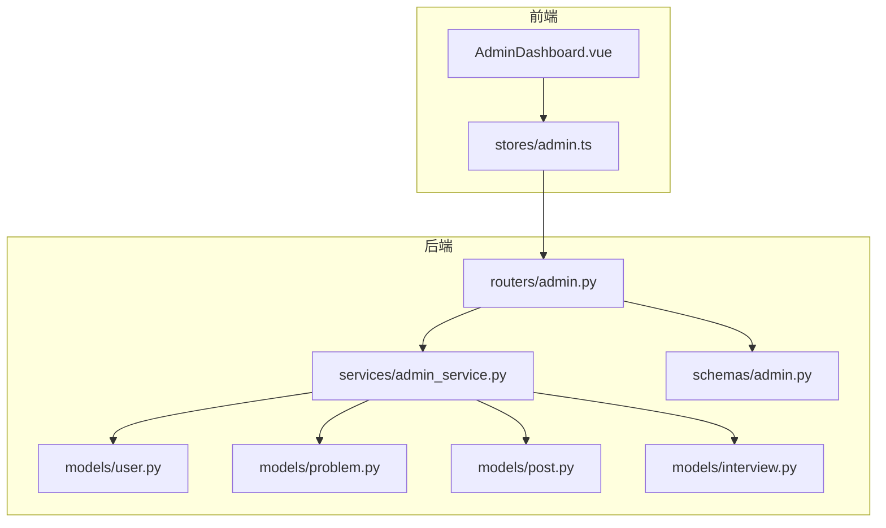
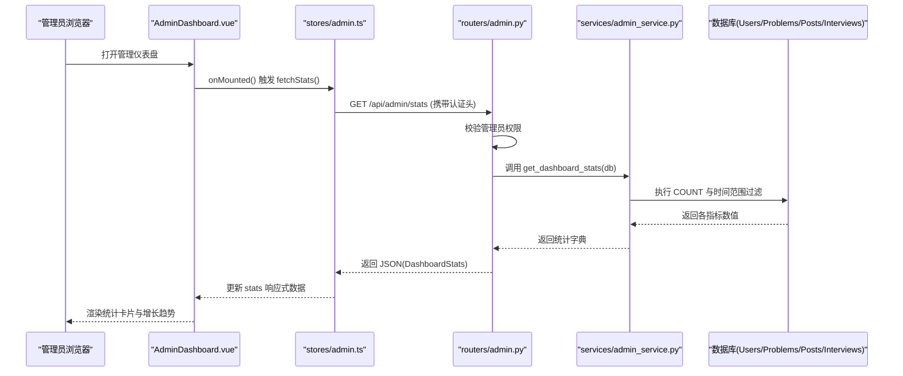
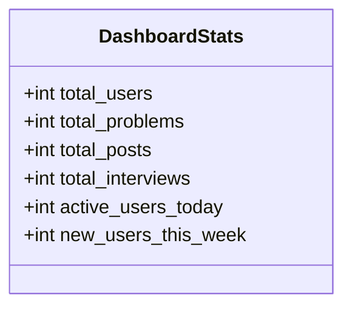
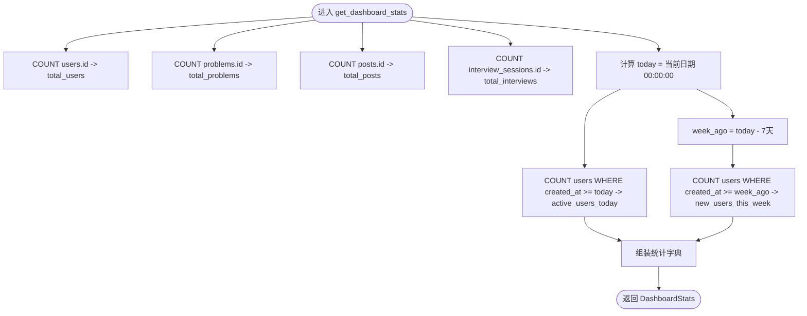
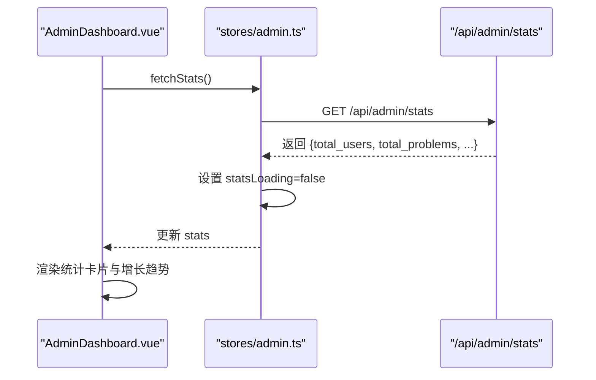
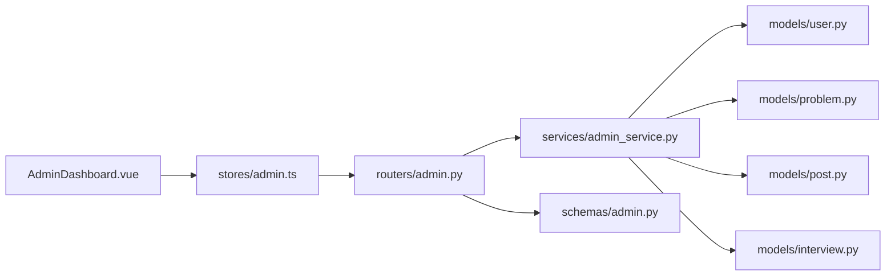

# 管理仪表盘

<cite>
**本文引用的文件**   
- [backEnd/app/routers/admin.py](file://backEnd/app/routers/admin.py)
- [backEnd/app/schemas/admin.py](file://backEnd/app/schemas/admin.py)
- [backEnd/app/services/admin_service.py](file://backEnd/app/services/admin_service.py)
- [backEnd/app/models/user.py](file://backEnd/app/models/user.py)
- [backEnd/app/models/problem.py](file://backEnd/app/models/problem.py)
- [backEnd/app/models/post.py](file://backEnd/app/models/post.py)
- [backEnd/app/models/interview.py](file://backEnd/app/models/interview.py)
- [frontEnd/src/views/admin/AdminDashboard.vue](file://frontEnd/src/views/admin/AdminDashboard.vue)
- [frontEnd/src/stores/admin.ts](file://frontEnd/src/stores/admin.ts)
</cite>

## 目录
1. [简介](#简介)
2. [项目结构](#项目结构)
3. [核心组件](#核心组件)
4. [架构总览](#架构总览)
5. [详细组件分析](#详细组件分析)
6. [依赖关系分析](#依赖关系分析)
7. [性能考虑](#性能考虑)
8. [故障排查指南](#故障排查指南)
9. [结论](#结论)

## 简介
本文件面向 HR XF 系统的“管理仪表盘”功能，聚焦于后台统计数据的获取与展示。内容涵盖：
- 关键指标：用户总数、活跃用户数（以当日新增为代理）、帖子数量、题目数量、面试会话总量、本周新增用户等
- DashboardStats 数据模型结构与字段含义
- 后端统计数据查询的业务逻辑与性能优化策略
- 前端仪表盘的可视化组件实现与数据刷新机制
- 管理员查看系统运行状态和用户行为分析的方法
- 异常数据处理与错误提示的实现细节

## 项目结构
管理仪表盘涉及前后端协作：
- 后端通过 FastAPI 路由暴露 /api/admin/stats 接口，服务层执行聚合查询，返回结构化统计结果
- 前端在管理页面加载时调用该接口，将结果渲染到卡片和区块中

图表来源
- [backEnd/app/routers/admin.py:39-46](file://backEnd/app/routers/admin.py#L39-L46)
- [backEnd/app/services/admin_service.py:14-42](file://backEnd/app/services/admin_service.py#L14-L42)
- [backEnd/app/schemas/admin.py:7-16](file://backEnd/app/schemas/admin.py#L7-L16)
- [frontEnd/src/views/admin/AdminDashboard.vue:100-135](file://frontEnd/src/views/admin/AdminDashboard.vue#L100-L135)
- [frontEnd/src/stores/admin.ts:94-103](file://frontEnd/src/stores/admin.ts#L94-L103)

章节来源
- [backEnd/app/routers/admin.py:39-46](file://backEnd/app/routers/admin.py#L39-L46)
- [backEnd/app/services/admin_service.py:14-42](file://backEnd/app/services/admin_service.py#L14-L42)
- [backEnd/app/schemas/admin.py:7-16](file://backEnd/app/schemas/admin.py#L7-L16)
- [frontEnd/src/views/admin/AdminDashboard.vue:100-135](file://frontEnd/src/views/admin/AdminDashboard.vue#L100-L135)
- [frontEnd/src/stores/admin.ts:94-103](file://frontEnd/src/stores/admin.ts#L94-L103)

## 核心组件
- 后端路由：提供 /api/admin/stats 接口，受管理员权限保护，返回 DashboardStats
- 服务层：执行多表计数与时间窗口过滤，组装统计字典
- 数据模型：User、Problem、Post、InterviewSession 的计数与时间字段
- 前端视图：AdminDashboard.vue 渲染统计卡片与增长趋势区
- 前端 Store：admin.ts 负责发起请求、缓存数据、错误处理与加载态

章节来源
- [backEnd/app/routers/admin.py:39-46](file://backEnd/app/routers/admin.py#L39-L46)
- [backEnd/app/services/admin_service.py:14-42](file://backEnd/app/services/admin_service.py#L14-L42)
- [backEnd/app/models/user.py:36-38](file://backEnd/app/models/user.py#L36-L38)
- [backEnd/app/models/problem.py:44-46](file://backEnd/app/models/problem.py#L44-L46)
- [backEnd/app/models/post.py:50-52](file://backEnd/app/models/post.py#L50-L52)
- [backEnd/app/models/interview.py:51-54](file://backEnd/app/models/interview.py#L51-L54)
- [frontEnd/src/views/admin/AdminDashboard.vue:100-135](file://frontEnd/src/views/admin/AdminDashboard.vue#L100-L135)
- [frontEnd/src/stores/admin.ts:94-103](file://frontEnd/src/stores/admin.ts#L94-L103)

## 架构总览
从请求到响应的完整链路如下：

图表来源
- [backEnd/app/routers/admin.py:39-46](file://backEnd/app/routers/admin.py#L39-L46)
- [backEnd/app/services/admin_service.py:14-42](file://backEnd/app/services/admin_service.py#L14-L42)
- [frontEnd/src/views/admin/AdminDashboard.vue:132-134](file://frontEnd/src/views/admin/AdminDashboard.vue#L132-L134)
- [frontEnd/src/stores/admin.ts:94-103](file://frontEnd/src/stores/admin.ts#L94-L103)

## 详细组件分析

### DashboardStats 数据模型与字段说明
- total_users: 平台用户总数
- total_problems: 题库题目总数
- total_posts: 面经帖子总数
- total_interviews: 面试会话总数
- active_users_today: 今日活跃用户数（当前实现以“今日新增用户”作为代理）
- new_users_this_week: 本周新增用户数

图表来源
- [backEnd/app/schemas/admin.py:7-16](file://backEnd/app/schemas/admin.py#L7-L16)

章节来源
- [backEnd/app/schemas/admin.py:7-16](file://backEnd/app/schemas/admin.py#L7-L16)

### 后端统计查询业务逻辑
- 使用 SQLAlchemy 异步会话对四张表分别执行 COUNT 查询
- 针对用户活跃度，基于 created_at 字段进行“今日”和“本周”的时间窗口过滤
- 返回统一字典，由 Pydantic 模型序列化输出

图表来源
- [backEnd/app/services/admin_service.py:14-42](file://backEnd/app/services/admin_service.py#L14-L42)
- [backEnd/app/models/user.py:36-38](file://backEnd/app/models/user.py#L36-L38)

章节来源
- [backEnd/app/services/admin_service.py:14-42](file://backEnd/app/services/admin_service.py#L14-L42)
- [backEnd/app/models/user.py:36-38](file://backEnd/app/models/user.py#L36-L38)

### 前端仪表盘可视化与刷新机制
- AdminDashboard.vue 在 onMounted 生命周期中调用 store 的 fetchStats
- stores/admin.ts 封装 apiRequest，自动附加 Authorization 头并处理非 2xx 响应
- 成功时将 stats 写入响应式变量，视图通过 computed 映射到卡片与增长趋势区域
- 失败时记录错误日志，保持 loading 状态复位

图表来源
- [frontEnd/src/views/admin/AdminDashboard.vue:132-134](file://frontEnd/src/views/admin/AdminDashboard.vue#L132-L134)
- [frontEnd/src/stores/admin.ts:94-103](file://frontEnd/src/stores/admin.ts#L94-L103)

章节来源
- [frontEnd/src/views/admin/AdminDashboard.vue:100-135](file://frontEnd/src/views/admin/AdminDashboard.vue#L100-L135)
- [frontEnd/src/stores/admin.ts:94-103](file://frontEnd/src/stores/admin.ts#L94-L103)

### 管理员查看系统运行状态与用户行为分析
- 系统运行状态：通过 DashboardStats 中的总量指标快速掌握平台规模与健康度
- 用户行为分析：
  - active_users_today 反映当日新增用户规模（当前实现以注册时间为代理）
  - new_users_this_week 观察一周内用户增长趋势
- 结合其他管理页面（用户列表、题目管理、帖子审核）可进一步定位问题与运营策略

章节来源
- [backEnd/app/services/admin_service.py:23-42](file://backEnd/app/services/admin_service.py#L23-L42)
- [frontEnd/src/views/admin/AdminDashboard.vue:32-49](file://frontEnd/src/views/admin/AdminDashboard.vue#L32-L49)

### 异常数据处理与错误提示
- 后端：
  - 未授权访问：管理员校验失败返回 403
  - 资源不存在：删除等操作返回 404
- 前端：
  - apiRequest 对非 2xx 响应抛出错误，包含 detail 信息
  - 各 fetch* 方法捕获异常并打印日志，同时重置 loading 状态
  - 视图使用可选链与默认值避免空指针渲染

章节来源
- [backEnd/app/routers/admin.py:26-34](file://backEnd/app/routers/admin.py#L26-34)
- [backEnd/app/routers/admin.py:86-99](file://backEnd/app/routers/admin.py#L86-99)
- [backEnd/app/routers/admin.py:152-162](file://backEnd/app/routers/admin.py#L152-162)
- [frontEnd/src/stores/admin.ts:52-65](file://frontEnd/src/stores/admin.ts#L52-65)
- [frontEnd/src/stores/admin.ts:94-103](file://frontEnd/src/stores/admin.ts#L94-L103)

## 依赖关系分析
- 路由层依赖服务层与 Pydantic 模型
- 服务层依赖 ORM 模型与数据库会话
- 前端依赖 Pinia Store 与 Vue 组件

图表来源
- [backEnd/app/routers/admin.py:39-46](file://backEnd/app/routers/admin.py#L39-L46)
- [backEnd/app/services/admin_service.py:14-42](file://backEnd/app/services/admin_service.py#L14-L42)
- [backEnd/app/schemas/admin.py:7-16](file://backEnd/app/schemas/admin.py#L7-L16)
- [frontEnd/src/views/admin/AdminDashboard.vue:100-135](file://frontEnd/src/views/admin/AdminDashboard.vue#L100-L135)
- [frontEnd/src/stores/admin.ts:94-103](file://frontEnd/src/stores/admin.ts#L94-L103)

章节来源
- [backEnd/app/routers/admin.py:39-46](file://backEnd/app/routers/admin.py#L39-L46)
- [backEnd/app/services/admin_service.py:14-42](file://backEnd/app/services/admin_service.py#L14-L42)
- [backEnd/app/schemas/admin.py:7-16](file://backEnd/app/schemas/admin.py#L7-L16)
- [frontEnd/src/views/admin/AdminDashboard.vue:100-135](file://frontEnd/src/views/admin/AdminDashboard.vue#L100-L135)
- [frontEnd/src/stores/admin.ts:94-103](file://frontEnd/src/stores/admin.ts#L94-L103)

## 性能考虑
- 查询复杂度
  - 当前实现采用多次 COUNT 查询，时间复杂度近似 O(N) 每张表，空间复杂度 O(1)
  - 对于大表场景，建议：
    - 为 created_at 建立索引以加速时间窗口过滤
    - 引入物化视图或定时任务预聚合指标，降低实时压力
    - 增加缓存层（如 Redis），按固定周期刷新统计
- 网络与渲染
  - 前端仅在页面挂载时拉取一次数据；如需实时性，可增加轮询或 WebSocket 推送
  - 对大体积响应可使用分页或按需字段返回（当前已为轻量指标，影响较小）

[本节为通用指导，不直接分析具体文件]

## 故障排查指南
- 403 无管理员权限
  - 检查登录令牌是否有效且当前用户满足管理员条件
  - 参考后端管理员校验逻辑
- 404 资源不存在
  - 删除操作时确认 ID 正确且记录未被提前删除
- 前端请求失败
  - 检查 Authorization 头是否正确注入
  - 查看控制台错误日志，确认后端返回的 detail 信息
- 数据为空或为 0
  - 确认数据库中存在对应记录
  - 核对时间窗口计算逻辑（服务器时区与系统时间一致性）

章节来源
- [backEnd/app/routers/admin.py:26-34](file://backEnd/app/routers/admin.py#L26-34)
- [backEnd/app/routers/admin.py:86-99](file://backEnd/app/routers/admin.py#L86-99)
- [backEnd/app/routers/admin.py:152-162](file://backEnd/app/routers/admin.py#L152-162)
- [frontEnd/src/stores/admin.ts:52-65](file://frontEnd/src/stores/admin.ts#L52-65)
- [frontEnd/src/stores/admin.ts:94-103](file://frontEnd/src/stores/admin.ts#L94-L103)

## 结论
管理仪表盘通过简洁的后端聚合查询与清晰的前端渲染，提供了平台规模与用户增长的直观概览。当前实现以用户创建时间为活跃度代理，便于快速落地。后续可在数据准确性与性能方面进一步优化，例如引入更精细的活跃定义、缓存与预聚合，以及前端的增量刷新机制，以提升用户体验与系统可扩展性。