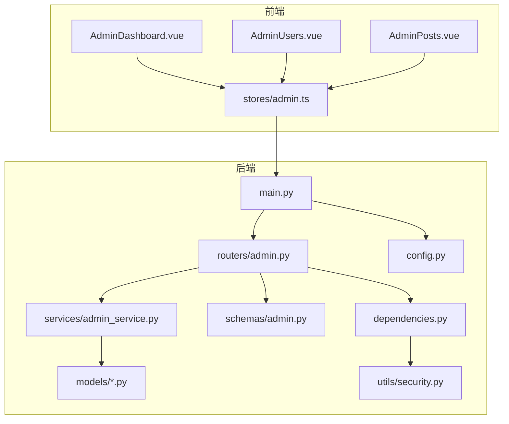
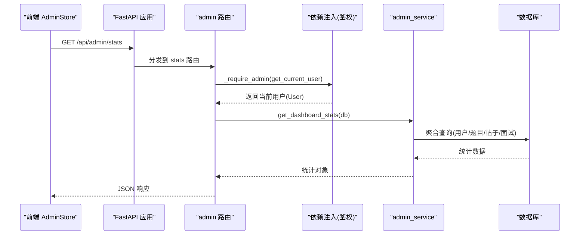
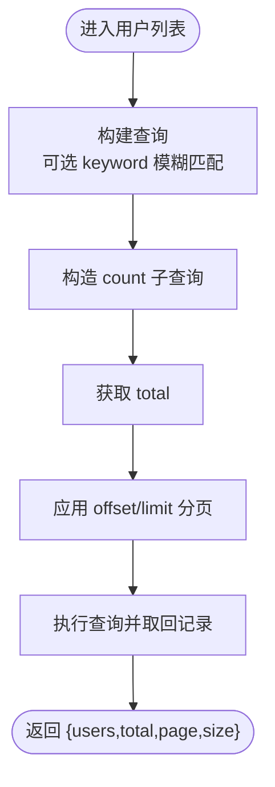
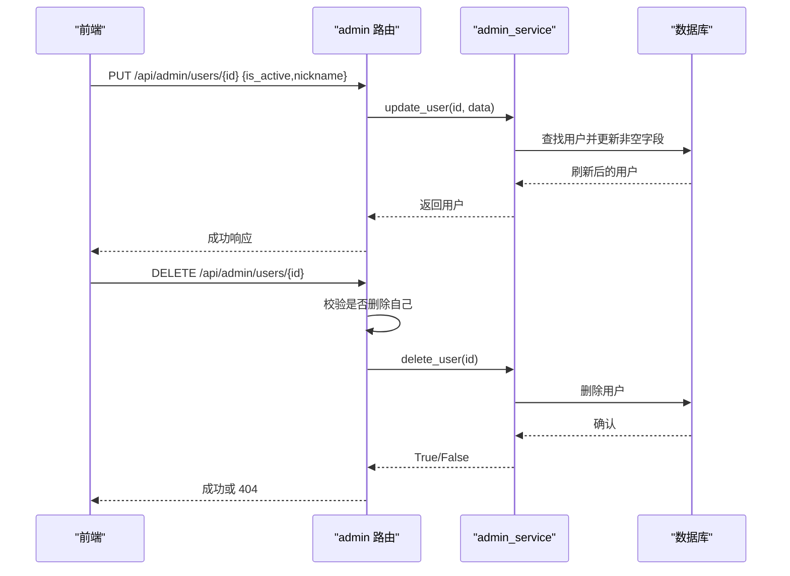
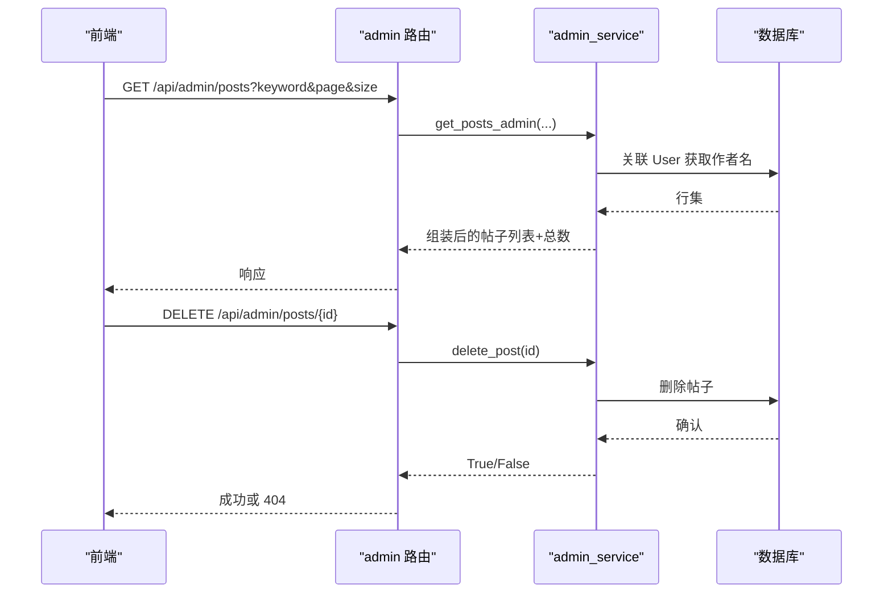
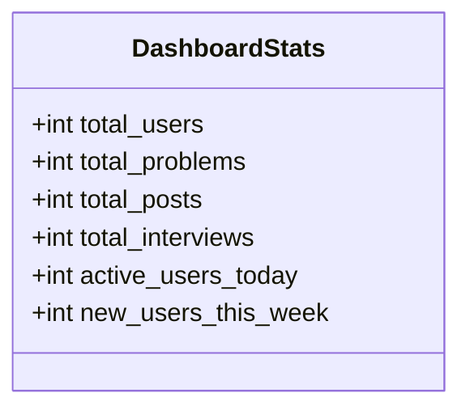
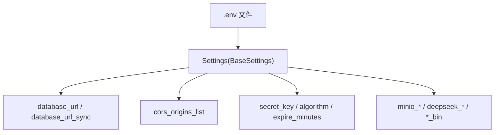
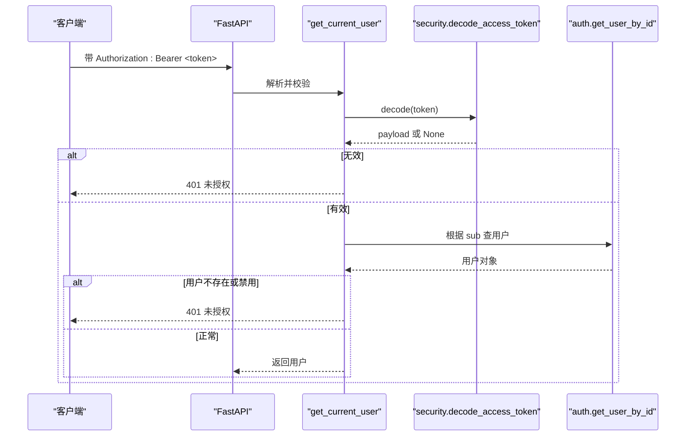
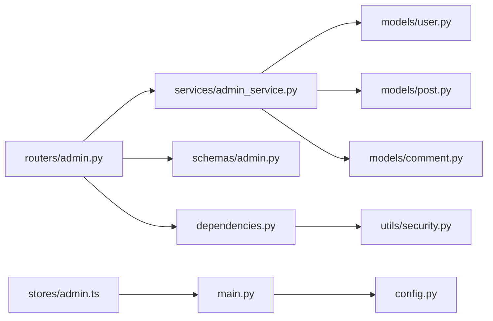

# 管理员后台系统

<cite>
**本文引用的文件**
- [backEnd/app/main.py](file://backEnd/app/main.py)
- [backEnd/app/routers/admin.py](file://backEnd/app/routers/admin.py)
- [backEnd/app/services/admin_service.py](file://backEnd/app/services/admin_service.py)
- [backEnd/app/schemas/admin.py](file://backEnd/app/schemas/admin.py)
- [backEnd/app/models/user.py](file://backEnd/app/models/user.py)
- [backEnd/app/models/post.py](file://backEnd/app/models/post.py)
- [backEnd/app/models/comment.py](file://backEnd/app/models/comment.py)
- [backEnd/app/services/auth.py](file://backEnd/app/services/auth.py)
- [backEnd/app/dependencies.py](file://backEnd/app/dependencies.py)
- [backEnd/app/config.py](file://backEnd/app/config.py)
- [backEnd/app/utils/security.py](file://backEnd/app/utils/security.py)
- [frontEnd/src/views/admin/AdminDashboard.vue](file://frontEnd/src/views/admin/AdminDashboard.vue)
- [frontEnd/src/views/admin/AdminUsers.vue](file://frontEnd/src/views/admin/AdminUsers.vue)
- [frontEnd/src/views/admin/AdminPosts.vue](file://frontEnd/src/views/admin/AdminPosts.vue)
- [frontEnd/src/stores/admin.ts](file://frontEnd/src/stores/admin.ts)
</cite>

## 目录
1. [简介](#简介)
2. [项目结构](#项目结构)
3. [核心组件](#核心组件)
4. [架构总览](#架构总览)
5. [详细组件分析](#详细组件分析)
6. [依赖关系分析](#依赖关系分析)
7. [性能考虑](#性能考虑)
8. [故障排查指南](#故障排查指南)
9. [结论](#结论)
10. [附录](#附录)

## 简介
本文件为 HR XF 管理员后台系统的权威技术文档，面向平台管理员与运维人员。内容覆盖：
- 用户管理：查看、启用/禁用、删除、搜索与分页
- 内容审核：帖子列表、删除；评论模型存在但当前未提供管理端接口
- 数据统计：仪表盘指标（用户、题目、帖子、面试会话）
- 安全访问控制：JWT 鉴权、管理员校验、CORS 配置
- 配置管理：数据库、JWT、CORS、外部服务参数
- 操作日志与审计追踪：当前未实现持久化日志模块
- 数据备份恢复与系统监控：健康检查与健康探针；备份需结合数据库策略
- 安全与防攻击：密码哈希、令牌校验、输入验证、CORS 白名单

## 项目结构
后端采用 FastAPI + SQLAlchemy 异步 ORM，前端使用 Vue 3 + Pinia。管理员相关能力集中在 /api/admin 路由下，通过依赖注入完成鉴权与数据库会话管理。

图表来源
- [backEnd/app/main.py:44-73](file://backEnd/app/main.py#L44-L73)
- [backEnd/app/routers/admin.py:21-21](file://backEnd/app/routers/admin.py#L21-L21)
- [backEnd/app/services/admin_service.py:14-42](file://backEnd/app/services/admin_service.py#L14-L42)
- [backEnd/app/schemas/admin.py:7-16](file://backEnd/app/schemas/admin.py#L7-L16)
- [backEnd/app/dependencies.py:13-40](file://backEnd/app/dependencies.py#L13-L40)
- [backEnd/app/config.py:7-71](file://backEnd/app/config.py#L7-L71)
- [backEnd/app/utils/security.py:26-47](file://backEnd/app/utils/security.py#L26-L47)
- [frontEnd/src/views/admin/AdminDashboard.vue:100-135](file://frontEnd/src/views/admin/AdminDashboard.vue#L100-L135)
- [frontEnd/src/stores/admin.ts:69-103](file://frontEnd/src/stores/admin.ts#L69-L103)

章节来源
- [backEnd/app/main.py:44-73](file://backEnd/app/main.py#L44-L73)
- [backEnd/app/routers/admin.py:21-21](file://backEnd/app/routers/admin.py#L21-L21)
- [frontEnd/src/stores/admin.ts:50-65](file://frontEnd/src/stores/admin.ts#L50-L65)

## 核心组件
- 路由层：/api/admin 下的统计、用户、题目、帖子管理接口
- 服务层：聚合查询、分页、计数、更新与删除等事务性逻辑
- 模式定义：Pydantic 请求/响应模型，统一数据结构
- 数据模型：User、Post、Comment 等实体映射
- 鉴权依赖：Bearer Token 解析、用户状态校验、管理员权限判定
- 配置中心：数据库、JWT、CORS、外部 API 等环境变量加载
- 安全工具：bcrypt 密码哈希、JWT 编解码

章节来源
- [backEnd/app/routers/admin.py:24-34](file://backEnd/app/routers/admin.py#L24-L34)
- [backEnd/app/services/admin_service.py:47-101](file://backEnd/app/services/admin_service.py#L47-L101)
- [backEnd/app/schemas/admin.py:21-43](file://backEnd/app/schemas/admin.py#L21-L43)
- [backEnd/app/models/user.py:10-44](file://backEnd/app/models/user.py#L10-L44)
- [backEnd/app/dependencies.py:13-40](file://backEnd/app/dependencies.py#L13-L40)
- [backEnd/app/config.py:7-71](file://backEnd/app/config.py#L7-L71)
- [backEnd/app/utils/security.py:18-47](file://backEnd/app/utils/security.py#L18-L47)

## 架构总览
管理员后台的端到端调用链如下：前端 Store 发起 HTTP 请求，FastAPI 路由接收并执行管理员权限校验，随后调用服务层进行数据库操作，返回 Pydantic 序列化结果给前端。

图表来源
- [backEnd/app/main.py:60-68](file://backEnd/app/main.py#L60-L68)
- [backEnd/app/routers/admin.py:39-45](file://backEnd/app/routers/admin.py#L39-L45)
- [backEnd/app/dependencies.py:13-40](file://backEnd/app/dependencies.py#L13-L40)
- [backEnd/app/services/admin_service.py:14-42](file://backEnd/app/services/admin_service.py#L14-L42)

## 详细组件分析

### 用户管理
功能范围
- 用户列表：支持关键词搜索（用户名/邮箱/昵称）、分页
- 用户更新：启用/禁用、修改昵称
- 用户删除：禁止删除自身，不存在则 404

关键流程
- 列表查询：按创建时间倒序，子查询计数，offset/limit 分页
- 更新字段：仅更新非空字段，flush/refresh 后返回
- 删除保护：若 user_id 等于当前登录用户 id，拒绝删除

图表来源
- [backEnd/app/services/admin_service.py:47-72](file://backEnd/app/services/admin_service.py#L47-L72)
- [backEnd/app/routers/admin.py:50-67](file://backEnd/app/routers/admin.py#L50-L67)

更新与删除

图表来源
- [backEnd/app/routers/admin.py:70-99](file://backEnd/app/routers/admin.py#L70-L99)
- [backEnd/app/services/admin_service.py:75-101](file://backEnd/app/services/admin_service.py#L75-L101)

前端交互
- 列表页支持搜索、分页、切换状态、删除确认
- Store 负责拼装查询参数、携带 Bearer Token、错误提示

章节来源
- [backEnd/app/routers/admin.py:50-99](file://backEnd/app/routers/admin.py#L50-L99)
- [backEnd/app/services/admin_service.py:47-101](file://backEnd/app/services/admin_service.py#L47-L101)
- [backEnd/app/schemas/admin.py:21-43](file://backEnd/app/schemas/admin.py#L21-L43)
- [frontEnd/src/views/admin/AdminUsers.vue:123-164](file://frontEnd/src/views/admin/AdminUsers.vue#L123-L164)
- [frontEnd/src/stores/admin.ts:107-142](file://frontEnd/src/stores/admin.ts#L107-L142)

### 内容审核机制
现状说明
- 帖子管理：提供列表（含作者名、互动数、状态）与删除接口
- 评论管理：数据模型 Comment 已存在，但未暴露管理端接口
- 违规处理：当前无自动审核或标记机制，仅提供删除手段

帖子管理流程

图表来源
- [backEnd/app/routers/admin.py:167-197](file://backEnd/app/routers/admin.py#L167-L197)
- [backEnd/app/services/admin_service.py:175-223](file://backEnd/app/services/admin_service.py#L175-L223)

前端交互
- 帖子列表支持搜索、分页、删除确认
- 显示点赞/评论数与状态标签

章节来源
- [backEnd/app/routers/admin.py:167-197](file://backEnd/app/routers/admin.py#L167-L197)
- [backEnd/app/services/admin_service.py:175-223](file://backEnd/app/services/admin_service.py#L175-L223)
- [backEnd/app/models/post.py:18-64](file://backEnd/app/models/post.py#L18-L64)
- [backEnd/app/models/comment.py:17-52](file://backEnd/app/models/comment.py#L17-L52)
- [frontEnd/src/views/admin/AdminPosts.vue:117-150](file://frontEnd/src/views/admin/AdminPosts.vue#L117-L150)
- [frontEnd/src/stores/admin.ts:195-221](file://frontEnd/src/stores/admin.ts#L195-L221)

### 数据统计分析
能力范围
- 仪表盘指标：总用户、总题目、总帖子、总面试会话、今日新增用户、本周新增用户
- 数据来源：基于各实体的 COUNT 与时间窗口过滤

图表来源
- [backEnd/app/schemas/admin.py:7-16](file://backEnd/app/schemas/admin.py#L7-L16)
- [backEnd/app/services/admin_service.py:14-42](file://backEnd/app/services/admin_service.py#L14-L42)

前端展示
- 概览卡片、增长趋势、快捷入口均从同一统计接口拉取

章节来源
- [backEnd/app/routers/admin.py:39-45](file://backEnd/app/routers/admin.py#L39-L45)
- [backEnd/app/services/admin_service.py:14-42](file://backEnd/app/services/admin_service.py#L14-L42)
- [frontEnd/src/views/admin/AdminDashboard.vue:100-135](file://frontEnd/src/views/admin/AdminDashboard.vue#L100-L135)
- [frontEnd/src/stores/admin.ts:94-103](file://frontEnd/src/stores/admin.ts#L94-L103)

### 系统配置管理
可配置项
- 数据库连接：host/port/user/password/name，自动生成 async/sync URL
- JWT：密钥、算法、过期时间
- CORS：允许的来源列表
- 外部服务：MinIO、Deepseek API、编译器路径（可选）

图表来源
- [backEnd/app/config.py:7-71](file://backEnd/app/config.py#L7-L71)

章节来源
- [backEnd/app/config.py:7-71](file://backEnd/app/config.py#L7-L71)
- [backEnd/app/main.py:52-58](file://backEnd/app/main.py#L52-L58)

### 安全访问控制与防攻击措施
- 认证：Bearer Token，JWT 载荷包含用户 ID，过期由配置控制
- 授权：get_current_user 校验用户存在且 is_active；_require_admin 基于用户名/邮箱关键字判断管理员
- 密码：bcrypt 哈希，最长 72 字节截断兼容
- 输入校验：Pydantic 模型对必填字段、长度、枚举值等进行约束
- CORS：仅允许配置的域名访问
- 健康检查：/api/health 用于存活探测

图表来源
- [backEnd/app/dependencies.py:13-40](file://backEnd/app/dependencies.py#L13-L40)
- [backEnd/app/utils/security.py:39-47](file://backEnd/app/utils/security.py#L39-L47)
- [backEnd/app/services/auth.py:85-96](file://backEnd/app/services/auth.py#L85-L96)
- [backEnd/app/routers/admin.py:26-34](file://backEnd/app/routers/admin.py#L26-L34)

章节来源
- [backEnd/app/dependencies.py:13-40](file://backEnd/app/dependencies.py#L13-L40)
- [backEnd/app/utils/security.py:18-47](file://backEnd/app/utils/security.py#L18-L47)
- [backEnd/app/services/auth.py:85-96](file://backEnd/app/services/auth.py#L85-L96)
- [backEnd/app/routers/admin.py:26-34](file://backEnd/app/routers/admin.py#L26-L34)
- [backEnd/app/main.py:76-84](file://backEnd/app/main.py#L76-L84)

### 操作日志与审计追踪
- 现状：代码库中未发现统一的日志记录或审计表结构
- 建议：在关键写操作（用户状态变更、帖子删除、题目增删改）处增加结构化日志写入数据库或外部日志系统，并保留操作人、时间、IP、变更前后快照

[本节为通用建议，不直接分析具体文件]

### 数据备份恢复与系统监控
- 监控：提供 /api/health 健康检查，可用于负载均衡器或容器编排的健康探针
- 备份：建议基于 MySQL 定时导出（如 mysqldump 或云厂商备份），并结合 .env 中的数据库凭据
- 恢复：将备份导入目标库，确保字符集 utf8mb4 一致

章节来源
- [backEnd/app/main.py:87-89](file://backEnd/app/main.py#L87-L89)
- [backEnd/app/config.py:48-61](file://backEnd/app/config.py#L48-L61)

## 依赖关系分析
- 路由依赖：admin 路由依赖 dependencies.get_current_user 与 services.admin_service
- 服务依赖：admin_service 依赖 models（User、Post、Problem、InterviewSession）
- 配置依赖：security 与 main 依赖 config.Settings
- 前端依赖：stores/admin.ts 封装所有 /api/admin 请求，页面组件消费 store 状态

图表来源
- [backEnd/app/routers/admin.py:1-20](file://backEnd/app/routers/admin.py#L1-L20)
- [backEnd/app/services/admin_service.py:1-10](file://backEnd/app/services/admin_service.py#L1-L10)
- [backEnd/app/models/user.py:1-10](file://backEnd/app/models/user.py#L1-L10)
- [backEnd/app/models/post.py:1-16](file://backEnd/app/models/post.py#L1-L16)
- [backEnd/app/models/comment.py:1-14](file://backEnd/app/models/comment.py#L1-L14)
- [backEnd/app/schemas/admin.py:1-16](file://backEnd/app/schemas/admin.py#L1-L16)
- [backEnd/app/dependencies.py:1-10](file://backEnd/app/dependencies.py#L1-L10)
- [backEnd/app/utils/security.py:1-8](file://backEnd/app/utils/security.py#L1-L8)
- [backEnd/app/config.py:1-11](file://backEnd/app/config.py#L1-L11)
- [frontEnd/src/stores/admin.ts:50-65](file://frontEnd/src/stores/admin.ts#L50-L65)

章节来源
- [backEnd/app/routers/admin.py:1-20](file://backEnd/app/routers/admin.py#L1-L20)
- [backEnd/app/services/admin_service.py:1-10](file://backEnd/app/services/admin_service.py#L1-L10)
- [backEnd/app/dependencies.py:1-10](file://backEnd/app/dependencies.py#L1-L10)
- [backEnd/app/config.py:1-11](file://backEnd/app/config.py#L1-L11)
- [frontEnd/src/stores/admin.ts:50-65](file://frontEnd/src/stores/admin.ts#L50-L65)

## 性能考虑
- 分页与计数分离：使用子查询计数避免全表扫描导致的 N+1 问题
- 索引利用：User.username/email、Post.company/position/year/status、Comment.post_id/user_id 均有索引，利于检索
- 懒加载关系：部分 relationship 使用 selectin/noload，减少不必要 JOIN
- 建议
  - 对高频搜索条件建立复合索引（如 posts.title/content 全文检索可用数据库全文索引或搜索引擎）
  - 大表分页时优先使用游标式分页替代 offset/limit
  - 统计接口可引入缓存层（Redis）降低热点查询压力

[本节为通用建议，不直接分析具体文件]

## 故障排查指南
常见问题与定位步骤
- 401 未授权
  - 检查前端是否携带正确的 Authorization: Bearer token
  - 确认用户未被禁用（is_active）
  - 核对 secret_key 与算法配置一致性
- 403 无管理员权限
  - 确认当前用户的 username/email 是否包含“admin”关键字
- 404 资源不存在
  - 检查传入的 id 是否正确，是否存在级联删除导致的数据缺失
- 422 请求体校验失败
  - 参考 Pydantic 模型约束，补齐必填字段与格式
- 健康检查
  - 访问 /api/health 确认服务存活

章节来源
- [backEnd/app/dependencies.py:13-40](file://backEnd/app/dependencies.py#L13-L40)
- [backEnd/app/routers/admin.py:26-34](file://backEnd/app/routers/admin.py#L26-L34)
- [backEnd/app/main.py:76-84](file://backEnd/app/main.py#L76-L84)
- [backEnd/app/main.py:87-89](file://backEnd/app/main.py#L87-L89)

## 结论
HR XF 管理员后台以清晰的分层架构实现了用户管理、帖子管理与基础统计能力，并通过 JWT 与管理员校验保障访问安全。当前尚未实现评论管理、操作日志与高级审核策略，建议在后续迭代中补充审计追踪、评论管理、更细粒度的权限体系与缓存优化，以提升可观测性与扩展性。

## 附录
- 常用接口清单（示例）
  - 统计：GET /api/admin/stats
  - 用户列表：GET /api/admin/users?page&size&keyword
  - 更新用户：PUT /api/admin/users/{user_id}
  - 删除用户：DELETE /api/admin/users/{user_id}
  - 帖子列表：GET /api/admin/posts?page&size&keyword
  - 删除帖子：DELETE /api/admin/posts/{post_id}
  - 健康检查：GET /api/health

[本节为汇总信息，不直接分析具体文件]