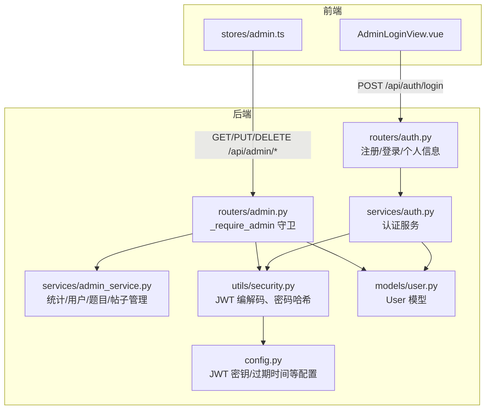
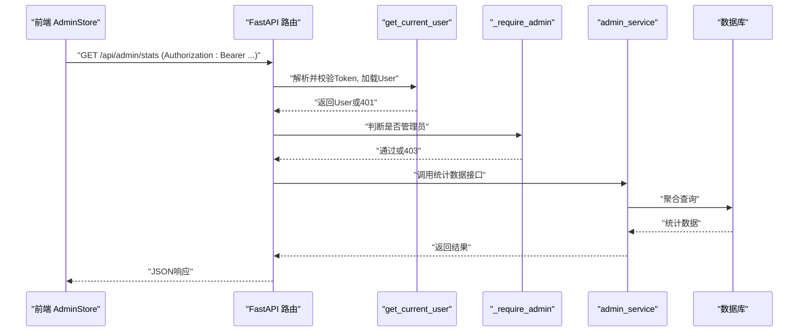
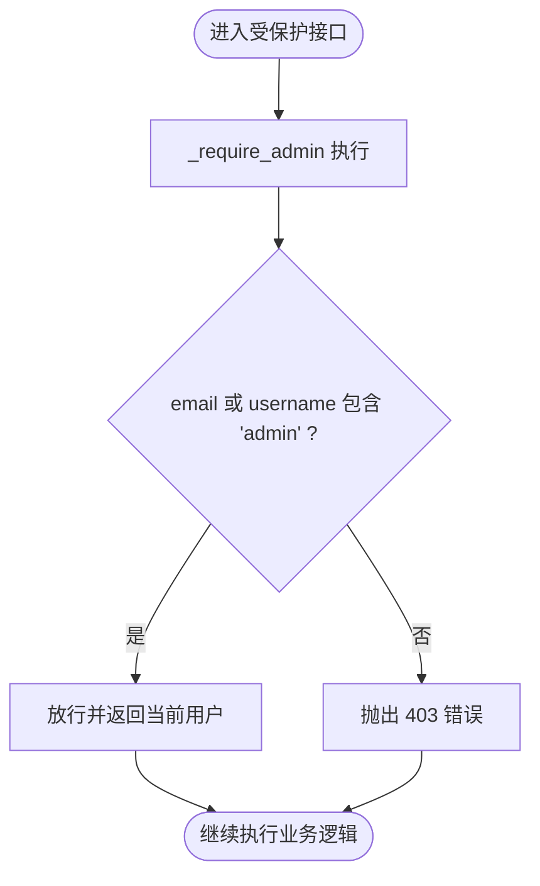
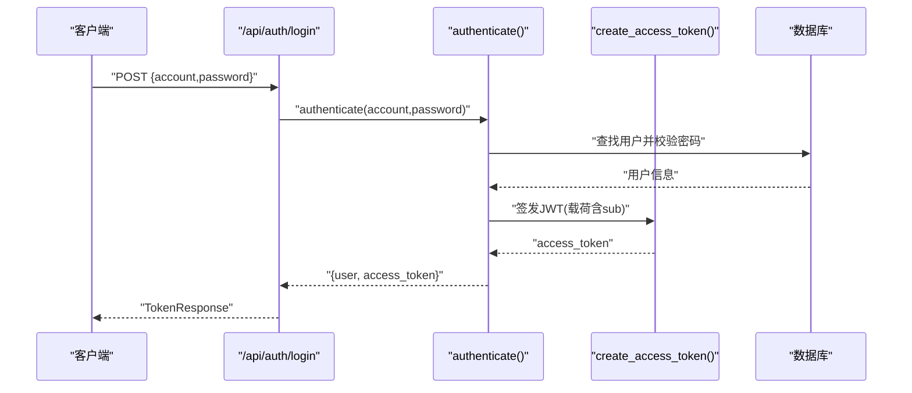
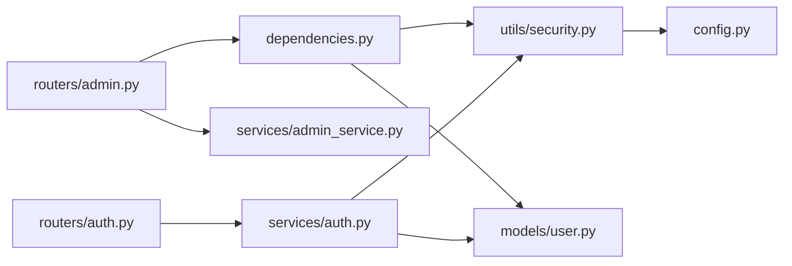

# 管理员认证

<cite>
**本文引用的文件**   
- [dependencies.py](file://backEnd/app/dependencies.py)
- [admin.py](file://backEnd/app/routers/admin.py)
- [admin_service.py](file://backEnd/app/services/admin_service.py)
- [security.py](file://backEnd/app/utils/security.py)
- [auth.py](file://backEnd/app/routers/auth.py)
- [auth_service.py](file://backEnd/app/services/auth.py)
- [user.py](file://backEnd/app/models/user.py)
- [config.py](file://backEnd/app/config.py)
- [AdminLoginView.vue](file://frontEnd/src/views/admin/AdminLoginView.vue)
- [admin.ts](file://frontEnd/src/stores/admin.ts)
</cite>

## 目录
1. [简介](#简介)
2. [项目结构](#项目结构)
3. [核心组件](#核心组件)
4. [架构总览](#架构总览)
5. [详细组件分析](#详细组件分析)
6. [依赖关系分析](#依赖关系分析)
7. [性能与安全考虑](#性能与安全考虑)
8. [故障排查指南](#故障排查指南)
9. [结论](#结论)
10. [附录](#附录)

## 简介
本文件面向HR XF项目的管理员认证与权限控制，重点说明以下内容：
- _require_admin 依赖注入函数的实现原理与权限验证逻辑
- 管理员身份识别机制（基于 email 或 username 包含“admin”关键字）
- 普通用户访问管理接口时的 403 错误处理
- 管理员登录流程与 JWT 令牌的权限声明
- 管理员账户创建与安全配置最佳实践
- 权限扩展与角色管理的架构设计建议
- 管理员操作日志记录与审计追踪的实现方案

## 项目结构
后端采用 FastAPI + SQLAlchemy 异步模式，认证与安全工具集中在 utils.security；路由层按功能划分，管理员相关路由位于 routers/admin.py；服务层在 services/admin_service.py 中提供数据访问与业务逻辑；模型定义在 models/user.py 等文件中；前端通过 Vue 页面与 Pinia Store 调用 /api/admin/* 接口。

图表来源
- [admin.py:24-34](file://backEnd/app/routers/admin.py#L24-L34)
- [admin_service.py:14-42](file://backEnd/app/services/admin_service.py#L14-L42)
- [security.py:26-47](file://backEnd/app/utils/security.py#L26-L47)
- [auth.py:69-80](file://backEnd/app/routers/auth.py#L69-L80)
- [auth_service.py:85-96](file://backEnd/app/services/auth.py#L85-L96)
- [user.py:10-45](file://backEnd/app/models/user.py#L10-L45)
- [config.py:20-23](file://backEnd/app/config.py#L20-L23)

章节来源
- [admin.py:1-198](file://backEnd/app/routers/admin.py#L1-L198)
- [admin_service.py:1-224](file://backEnd/app/services/admin_service.py#L1-L224)
- [security.py:1-48](file://backEnd/app/utils/security.py#L1-L48)
- [auth.py:1-217](file://backEnd/app/routers/auth.py#L1-L217)
- [auth_service.py:1-174](file://backEnd/app/services/auth.py#L1-L174)
- [user.py:1-45](file://backEnd/app/models/user.py#L1-L45)
- [config.py:1-71](file://backEnd/app/config.py#L1-L71)

## 核心组件
- 依赖注入与当前用户解析
  - get_current_user 从请求头提取 Bearer Token，解码后根据 sub 获取用户并校验活跃状态。
- 管理员守卫
  - _require_admin 依赖函数在 get_current_user 基础上进行管理员判定，若失败返回 403。
- 认证与令牌
  - 登录成功后签发 JWT，载荷仅包含 sub（用户ID），未包含显式角色字段。
- 管理员能力
  - 仪表盘统计、用户管理、题目管理、帖子管理等受 _require_admin 保护。

章节来源
- [dependencies.py:13-40](file://backEnd/app/dependencies.py#L13-L40)
- [admin.py:24-34](file://backEnd/app/routers/admin.py#L24-L34)
- [security.py:26-47](file://backEnd/app/utils/security.py#L26-L47)
- [auth.py:69-80](file://backEnd/app/routers/auth.py#L69-L80)
- [auth_service.py:85-96](file://backEnd/app/services/auth.py#L85-L96)

## 架构总览
下图展示了管理员访问的端到端流程：前端携带 Bearer Token 访问管理接口，FastAPI 先通过 get_current_user 完成鉴权，再由 _require_admin 执行管理员权限检查，通过后进入具体业务服务。

图表来源
- [dependencies.py:13-40](file://backEnd/app/dependencies.py#L13-L40)
- [admin.py:24-34](file://backEnd/app/routers/admin.py#L24-L34)
- [admin_service.py:14-42](file://backEnd/app/services/admin_service.py#L14-L42)

## 详细组件分析

### _require_admin 依赖注入函数与权限验证逻辑
- 作用：作为 FastAPI 的 Depends 守卫，确保调用者具备管理员权限。
- 实现要点：
  - 前置条件：已通过 get_current_user 成功解析出当前用户对象。
  - 判定规则：email 或 username 中包含小写“admin”即视为管理员。
  - 失败处理：抛出 HTTPException(403)，提示“无管理员权限”。
- 使用方式：在各管理接口参数中使用 Depends(_require_admin)。

图表来源
- [admin.py:24-34](file://backEnd/app/routers/admin.py#L24-L34)

章节来源
- [admin.py:24-34](file://backEnd/app/routers/admin.py#L24-L34)

### 管理员身份识别机制
- 规则：email 或 username 任一包含“admin”（不区分大小写）即被认定为管理员。
- 影响范围：所有标记为 Depends(_require_admin) 的管理接口均受此规则约束。
- 风险点：该规则属于“基于名称的启发式判断”，不具备强语义和可审计性，存在误判与绕过风险。

章节来源
- [admin.py:24-34](file://backEnd/app/routers/admin.py#L24-L34)

### 普通用户访问管理接口的 403 错误处理
- 触发路径：
  - 非管理员用户携带有效 Token 访问 /api/admin/* 时，_require_admin 将拒绝并返回 403。
  - 未携带或无效 Token 时，get_current_user 会返回 401。
- 前端行为：
  - admin.ts 在请求失败时统一抛错，上层可根据状态码提示用户。
  - 管理员登录页 AdminLoginView.vue 目前仅做本地标记，未与服务端交互，需结合后端登录流程完善。

章节来源
- [admin.py:24-34](file://backEnd/app/routers/admin.py#L24-L34)
- [dependencies.py:13-40](file://backEnd/app/dependencies.py#L13-L40)
- [admin.ts:52-65](file://frontEnd/src/stores/admin.ts#L52-L65)
- [AdminLoginView.vue:105-115](file://frontEnd/src/views/admin/AdminLoginView.vue#L105-L115)

### 管理员登录流程与 JWT 令牌的权限声明
- 登录入口：/api/auth/login
- 流程：
  - 客户端提交账号与密码。
  - 服务端校验账号与密码，生成仅含 sub 的 JWT 并返回。
  - 后续请求在 Authorization 头携带该 Token。
- 权限声明：
  - 当前 JWT 载荷不包含角色或权限信息，管理员判定在服务端依据用户名/邮箱规则进行。
- 安全建议：
  - 可在 JWT 中增加 role 或 permissions 声明，便于集中化授权与审计。

图表来源
- [auth.py:69-80](file://backEnd/app/routers/auth.py#L69-L80)
- [auth_service.py:85-96](file://backEnd/app/services/auth.py#L85-L96)
- [security.py:26-36](file://backEnd/app/utils/security.py#L26-L36)

章节来源
- [auth.py:69-80](file://backEnd/app/routers/auth.py#L69-L80)
- [auth_service.py:85-96](file://backEnd/app/services/auth.py#L85-L96)
- [security.py:26-36](file://backEnd/app/utils/security.py#L26-L36)

### 管理员权限控制的实现方式与安全考虑
- 实现方式：
  - 统一通过 _require_admin 守卫对管理接口进行权限拦截。
  - 部分接口还包含额外校验（如删除自己）。
- 安全考虑：
  - 基于名称的规则易被绕过（例如构造包含“admin”的用户名/邮箱）。
  - 缺少细粒度权限控制（如按资源/动作维度）。
  - 建议引入显式角色/权限字段，并在 JWT 或服务端会话中持久化。

章节来源
- [admin.py:86-99](file://backEnd/app/routers/admin.py#L86-L99)
- [admin.py:24-34](file://backEnd/app/routers/admin.py#L24-L34)

### 管理员账户创建与安全配置最佳实践
- 账户创建：
  - 可通过注册接口创建用户，但不应依赖“admin”关键字自动赋予管理员权限。
  - 建议提供独立的管理员初始化脚本或后台任务，显式设置角色/权限。
- 安全配置：
  - 生产环境必须更换 secret_key，合理设置 access_token_expire_minutes。
  - 启用 HTTPS，限制 CORS 源，避免泄露敏感信息。
  - 对密码强度与长度进行严格校验，防止弱口令。

章节来源
- [config.py:20-23](file://backEnd/app/config.py#L20-L23)
- [auth.py:41-66](file://backEnd/app/routers/auth.py#L41-L66)
- [auth_service.py:38-82](file://backEnd/app/services/auth.py#L38-L82)

### 权限扩展与角色管理的架构设计建议
- 推荐方向：
  - 在 User 模型中新增 role 或 roles 字段，支持多角色。
  - 在 JWT 中增加 role/permissions 声明，减少服务端二次查询。
  - 引入 RBAC（基于角色的访问控制）或 ABAC（基于属性的访问控制）策略。
  - 将 _require_admin 升级为通用权限中间件/依赖，支持按资源/动作匹配。
- 演进步骤：
  - 短期：在现有规则基础上增加显式 is_admin 布尔字段，逐步迁移到角色系统。
  - 中期：引入权限表与资源映射，支持细粒度控制。
  - 长期：接入外部鉴权服务或网关级鉴权，统一策略下发。

[本节为概念性建议，不直接分析具体文件]

### 管理员操作日志记录与审计追踪的实现方案
- 目标：记录关键管理操作的主体、动作、资源、结果与时间戳，满足合规与排障需求。
- 建议方案：
  - 在 _require_admin 之后插入日志装饰器或中间件，统一捕获管理接口入参与出参。
  - 存储至独立审计表或外部日志系统（如 ELK），并对敏感字段脱敏。
  - 对高风险操作（删除用户/题目/帖子）强制记录完整上下文。
  - 定期归档与告警异常批量操作。

[本节为概念性方案，不直接分析具体文件]

## 依赖关系分析
- 模块耦合：
  - 路由层依赖依赖注入与守卫，再调用服务层。
  - 服务层依赖模型与数据库会话。
  - 安全工具依赖配置中心。
- 潜在风险：
  - 管理员判定规则硬编码于路由层，不利于复用与扩展。
  - JWT 未携带角色信息，导致每次鉴权均需查库或重复计算。

图表来源
- [admin.py:1-34](file://backEnd/app/routers/admin.py#L1-L34)
- [dependencies.py:1-40](file://backEnd/app/dependencies.py#L1-L40)
- [admin_service.py:1-42](file://backEnd/app/services/admin_service.py#L1-L42)
- [security.py:1-48](file://backEnd/app/utils/security.py#L1-L48)
- [auth.py:1-80](file://backEnd/app/routers/auth.py#L1-L80)
- [auth_service.py:1-96](file://backEnd/app/services/auth.py#L1-L96)
- [user.py:1-45](file://backEnd/app/models/user.py#L1-L45)
- [config.py:1-71](file://backEnd/app/config.py#L1-L71)

章节来源
- [admin.py:1-198](file://backEnd/app/routers/admin.py#L1-L198)
- [dependencies.py:1-40](file://backEnd/app/dependencies.py#L1-L40)
- [admin_service.py:1-224](file://backEnd/app/services/admin_service.py#L1-L224)
- [security.py:1-48](file://backEnd/app/utils/security.py#L1-L48)
- [auth.py:1-217](file://backEnd/app/routers/auth.py#L1-L217)
- [auth_service.py:1-174](file://backEnd/app/services/auth.py#L1-L174)
- [user.py:1-45](file://backEnd/app/models/user.py#L1-L45)
- [config.py:1-71](file://backEnd/app/config.py#L1-L71)

## 性能与安全考虑
- 性能
  - 管理员判定规则简单，开销极低。
  - 统计接口涉及多表计数，注意分页与索引优化。
- 安全
  - 生产环境务必替换默认 secret_key，缩短 token 有效期。
  - 建议启用 HTTPS，限制 CORS，避免跨站攻击。
  - 对输入进行严格校验，防止注入与越权。

[本节为通用指导，不直接分析具体文件]

## 故障排查指南
- 401 未授权
  - 现象：访问管理接口返回 401。
  - 原因：Token 缺失、过期或无效。
  - 排查：确认 Authorization 头是否正确携带 Bearer Token；检查 JWT 密钥与算法配置。
- 403 无管理员权限
  - 现象：访问管理接口返回 403。
  - 原因：当前用户 email 或 username 不包含“admin”。
  - 排查：修改用户信息使其包含“admin”，或升级权限模型。
- 登录失败
  - 现象：/api/auth/login 返回 401。
  - 原因：账号或密码错误，或账号被禁用。
  - 排查：核对凭据；检查用户 is_active 状态。

章节来源
- [dependencies.py:13-40](file://backEnd/app/dependencies.py#L13-L40)
- [admin.py:24-34](file://backEnd/app/routers/admin.py#L24-L34)
- [auth.py:69-80](file://backEnd/app/routers/auth.py#L69-L80)
- [auth_service.py:85-96](file://backEnd/app/services/auth.py#L85-L96)

## 结论
当前管理员认证采用“基于名称的启发式规则”配合 JWT 的轻量鉴权，实现简洁但可扩展性不足。建议尽快引入显式角色/权限体系，并将管理员判定从路由层下沉为统一的权限中间件，同时完善审计日志与生产安全配置，以满足企业级安全与合规要求。

## 附录
- 前端管理员登录页现状：AdminLoginView.vue 仅做本地标记与跳转，未与后端 /api/auth/login 对接，需补充真实登录流程与错误处理。
- 前端管理 Store：admin.ts 已封装对 /api/admin/* 的请求，统一处理错误与分页参数，可直接复用。

章节来源
- [AdminLoginView.vue:105-115](file://frontEnd/src/views/admin/AdminLoginView.vue#L105-L115)
- [admin.ts:52-65](file://frontEnd/src/stores/admin.ts#L52-L65)