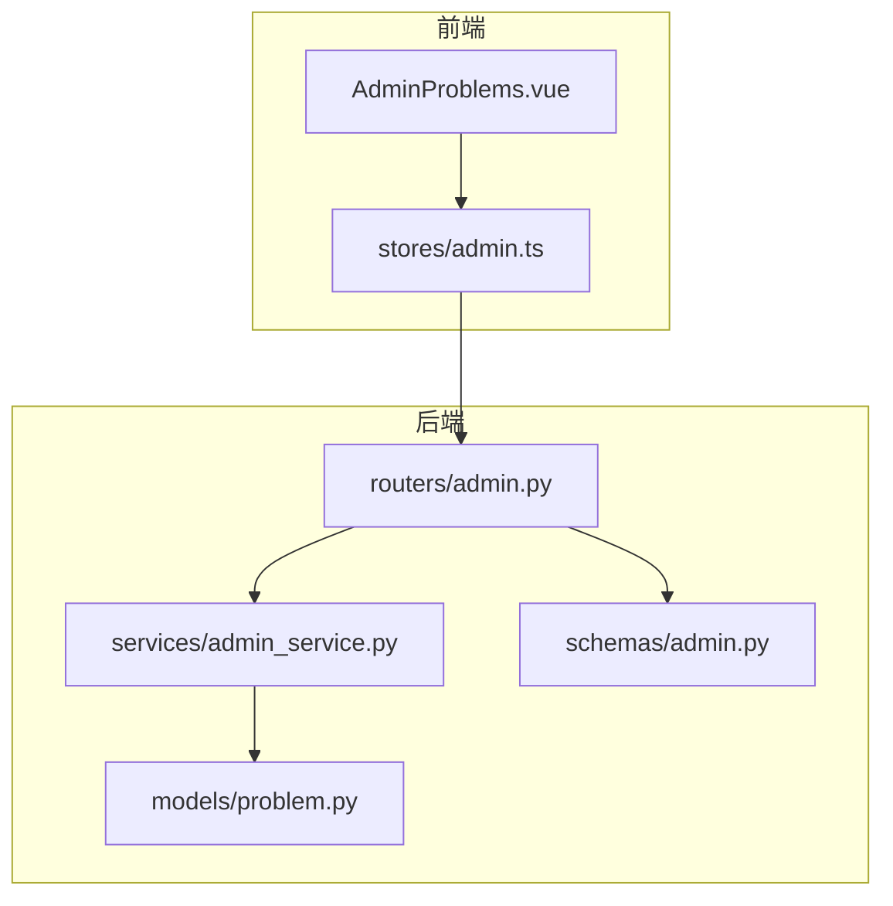
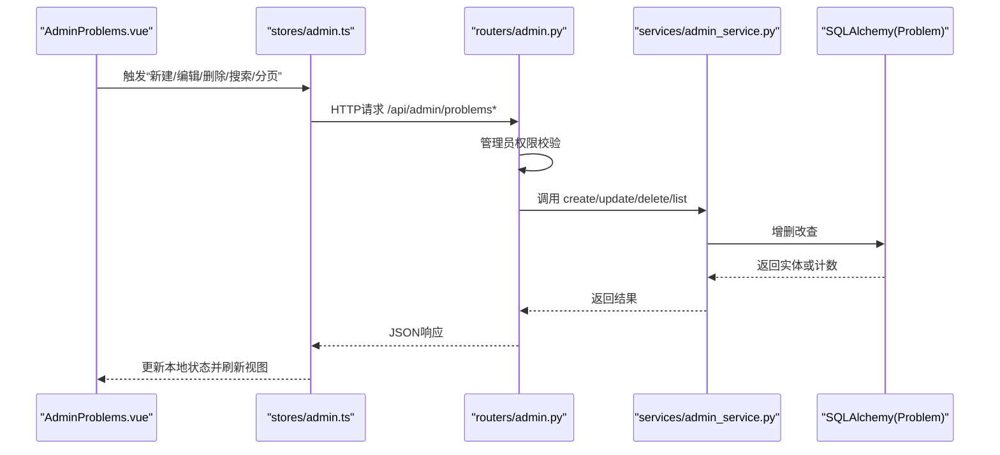
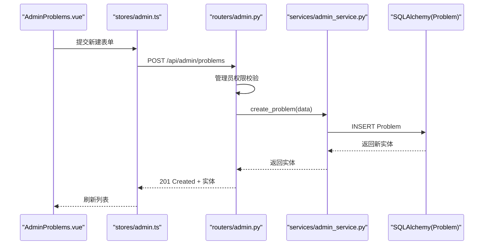
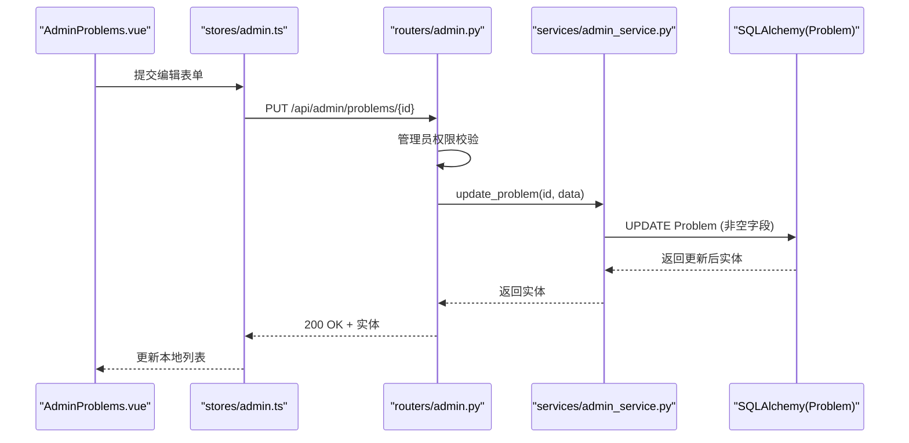
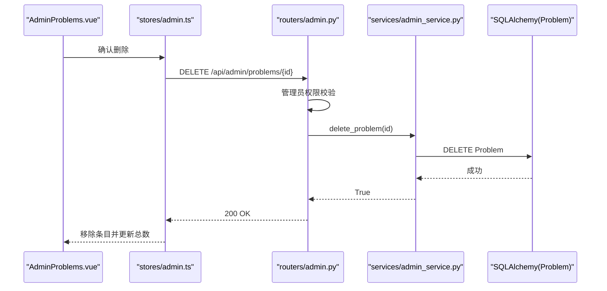
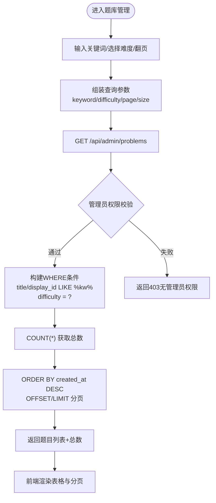
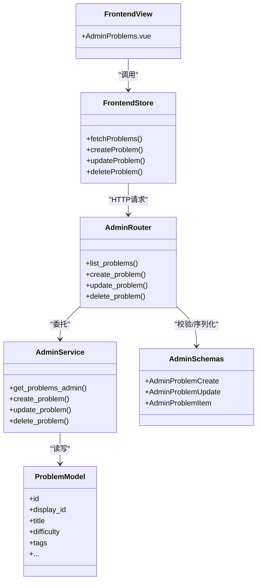

# 题目管理

<cite>
**本文引用的文件**
- [problem.py](file://backEnd/app/models/problem.py)
- [problem.py](file://backEnd/app/schemas/problem.py)
- [admin.py](file://backEnd/app/routers/admin.py)
- [problem.py](file://backEnd/app/routers/problem.py)
- [admin_service.py](file://backEnd/app/services/admin_service.py)
- [problem_service.py](file://backEnd/app/services/problem_service.py)
- [AdminProblems.vue](file://frontEnd/src/views/admin/AdminProblems.vue)
- [admin.ts](file://frontEnd/src/stores/admin.ts)
</cite>

## 目录
1. [简介](#简介)
2. [项目结构](#项目结构)
3. [核心组件](#核心组件)
4. [架构总览](#架构总览)
5. [详细组件分析](#详细组件分析)
6. [依赖关系分析](#依赖关系分析)
7. [性能考虑](#性能考虑)
8. [故障排查指南](#故障排查指南)
9. [结论](#结论)
10. [附录](#附录)

## 简介
本文件面向HR XF系统的“题目管理”功能，覆盖以下目标：
- 题目的CRUD操作实现（创建、更新、删除）完整流程
- 管理端题目列表查询能力：关键词搜索、难度筛选（easy/medium/hard）、分页显示
- AdminProblemCreate、AdminProblemUpdate、AdminProblemItem等数据模型定义与业务规则
- 题目难度标签的管理与验证机制
- 题目与测试用例的关联关系及数据完整性保证
- 题目导入导出与批量操作的实现方案建议
- 题目审核流程与发布状态管理的业务逻辑建议

## 项目结构
后端采用FastAPI + SQLAlchemy异步ORM分层架构：路由层负责HTTP接口与鉴权，服务层封装业务逻辑与数据库访问，模型与Schema分别描述持久化结构与请求/响应契约。前端使用Vue3 + Pinia进行状态管理与页面交互。

图表来源
- [AdminProblems.vue:1-340](file://frontEnd/src/views/admin/AdminProblems.vue#L1-L340)
- [admin.ts:1-250](file://frontEnd/src/stores/admin.ts#L1-L250)
- [admin.py:102-163](file://backEnd/app/routers/admin.py#L102-L163)
- [admin_service.py:104-171](file://backEnd/app/services/admin_service.py#L104-L171)
- [problem.py](file://backEnd/app/models/problem.py)
- [admin.py](file://backEnd/app/schemas/admin.py)

章节来源
- [AdminProblems.vue:1-340](file://frontEnd/src/views/admin/AdminProblems.vue#L1-L340)
- [admin.ts:1-250](file://frontEnd/src/stores/admin.ts#L1-L250)
- [admin.py:102-163](file://backEnd/app/routers/admin.py#L102-L163)
- [admin_service.py:104-171](file://backEnd/app/services/admin_service.py#L104-L171)
- [problem.py](file://backEnd/app/models/problem.py)
- [admin.py](file://backEnd/app/schemas/admin.py)

## 核心组件
- 数据模型
  - Problem：题目主表，包含展示ID、标题、描述、输入输出格式、约束、样例、提示、时间/内存限制、难度、标签、提交统计与时间戳等字段。
  - Submission：用户提交记录，关联用户与题目，记录代码、语言、判题结果、执行时间与内存等。
- 管理端Schema
  - AdminProblemCreate：创建题目的入参校验，含必填字段与难度正则校验。
  - AdminProblemUpdate：更新题目的可选字段集合。
  - AdminProblemItem：管理端返回的题目摘要项。
- 路由与服务
  - 管理端路由提供题目列表、创建、更新、删除接口，并内置管理员权限校验。
  - 管理服务实现题目CRUD与分页查询，支持关键词与难度过滤。
- 前端界面
  - 管理端题目列表页提供搜索、难度筛选、分页、新建/编辑弹窗、删除确认等操作。
  - Store封装了与后端接口的调用与本地状态维护。

章节来源
- [problem.py](file://backEnd/app/models/problem.py)
- [admin.py](file://backEnd/app/schemas/admin.py)
- [admin.py](file://backEnd/app/routers/admin.py)
- [admin_service.py:104-171](file://backEnd/app/services/admin_service.py#L104-L171)
- [AdminProblems.vue:1-340](file://frontEnd/src/views/admin/AdminProblems.vue#L1-L340)
- [admin.ts:144-191](file://frontEnd/src/stores/admin.ts#L144-L191)

## 架构总览
管理端题目管理的数据流从前端发起，经Pinia Store调用后端管理接口，路由层进行管理员鉴权后交由服务层完成数据库操作，最终返回结构化响应给前端渲染。

图表来源
- [AdminProblems.vue:227-339](file://frontEnd/src/views/admin/AdminProblems.vue#L227-L339)
- [admin.ts:144-191](file://frontEnd/src/stores/admin.ts#L144-L191)
- [admin.py:102-163](file://backEnd/app/routers/admin.py#L102-L163)
- [admin_service.py:104-171](file://backEnd/app/services/admin_service.py#L104-L171)
- [problem.py](file://backEnd/app/models/problem.py)

## 详细组件分析

### 数据模型与业务规则
- 题目模型（Problem）
  - 关键字段：display_id（唯一展示ID）、title、description、input_format、output_format、constraints、sample_input、sample_output、hint、time_limit、memory_limit、difficulty、tags、total_submissions、accepted_submissions、created_at、updated_at。
  - 难度字段为字符串枚举值（easy/medium/hard），在创建/更新时由Schema进行正则校验。
  - 标签字段以逗号分隔的字符串存储，便于快速检索与展示。
  - 提交统计字段用于计算通过率与展示。
- 提交模型（Submission）
  - 通过外键关联用户与题目，记录判题结果与资源消耗。
  - 级联删除确保题目删除时清理相关提交记录。

章节来源
- [problem.py](file://backEnd/app/models/problem.py)

### 管理端数据模型（Schemas）
- AdminProblemCreate
  - 必填字段：display_id、title、description、input_format、output_format、constraints、sample_input、sample_output、difficulty。
  - 可选字段：hint、time_limit、memory_limit、tags。
  - 难度字段使用正则表达式严格限定为 easy/medium/hard。
- AdminProblemUpdate
  - 所有字段均为可选，仅更新传入的非空字段。
- AdminProblemItem
  - 返回题目摘要信息，包括id、display_id、title、difficulty、tags、提交统计与创建时间。

章节来源
- [admin.py](file://backEnd/app/schemas/admin.py)

### 管理端CRUD流程

#### 创建题目
- 前端：用户在弹窗填写表单，点击“创建题目”，Store调用POST /api/admin/problems。
- 路由：接收请求体，进行管理员权限校验，调用服务层创建。
- 服务：构造Problem对象并写入数据库，刷新后返回实体。
- 前端：收到响应后刷新列表。

图表来源
- [AdminProblems.vue:293-313](file://frontEnd/src/views/admin/AdminProblems.vue#L293-L313)
- [admin.ts:169-175](file://frontEnd/src/stores/admin.ts#L169-L175)
- [admin.py:125-133](file://backEnd/app/routers/admin.py#L125-L133)
- [admin_service.py:135-141](file://backEnd/app/services/admin_service.py#L135-L141)
- [problem.py](file://backEnd/app/models/problem.py)

章节来源
- [AdminProblems.vue:293-313](file://frontEnd/src/views/admin/AdminProblems.vue#L293-L313)
- [admin.ts:169-175](file://frontEnd/src/stores/admin.ts#L169-L175)
- [admin.py:125-133](file://backEnd/app/routers/admin.py#L125-L133)
- [admin_service.py:135-141](file://backEnd/app/services/admin_service.py#L135-L141)

#### 更新题目
- 前端：点击“编辑”，填充表单，保存后调用PUT /api/admin/problems/{problem_id}。
- 路由：校验管理员权限，调用服务层更新。
- 服务：按非空字段增量更新Problem，刷新后返回实体。
- 前端：更新本地列表对应条目。

图表来源
- [AdminProblems.vue:274-313](file://frontEnd/src/views/admin/AdminProblems.vue#L274-L313)
- [admin.ts:177-185](file://frontEnd/src/stores/admin.ts#L177-L185)
- [admin.py:136-149](file://backEnd/app/routers/admin.py#L136-L149)
- [admin_service.py:144-160](file://backEnd/app/services/admin_service.py#L144-L160)
- [problem.py](file://backEnd/app/models/problem.py)

章节来源
- [AdminProblems.vue:274-313](file://frontEnd/src/views/admin/AdminProblems.vue#L274-L313)
- [admin.ts:177-185](file://frontEnd/src/stores/admin.ts#L177-L185)
- [admin.py:136-149](file://backEnd/app/routers/admin.py#L136-L149)
- [admin_service.py:144-160](file://backEnd/app/services/admin_service.py#L144-L160)

#### 删除题目
- 前端：点击删除按钮，二次确认后调用DELETE /api/admin/problems/{problem_id}。
- 路由：校验管理员权限，调用服务层删除。
- 服务：根据ID查找并删除Problem，返回布尔结果。
- 前端：移除本地列表条目并减少总数。

图表来源
- [AdminProblems.vue:315-322](file://frontEnd/src/views/admin/AdminProblems.vue#L315-L322)
- [admin.ts:187-191](file://frontEnd/src/stores/admin.ts#L187-L191)
- [admin.py:152-162](file://backEnd/app/routers/admin.py#L152-L162)
- [admin_service.py:163-170](file://backEnd/app/services/admin_service.py#L163-L170)
- [problem.py](file://backEnd/app/models/problem.py)

章节来源
- [AdminProblems.vue:315-322](file://frontEnd/src/views/admin/AdminProblems.vue#L315-L322)
- [admin.ts:187-191](file://frontEnd/src/stores/admin.ts#L187-L191)
- [admin.py:152-162](file://backEnd/app/routers/admin.py#L152-L162)
- [admin_service.py:163-170](file://backEnd/app/services/admin_service.py#L163-L170)

#### 管理端题目列表查询（关键词、难度、分页）
- 前端：输入关键词、选择难度、切换页码，Store拼接参数调用GET /api/admin/problems。
- 路由：校验管理员权限，调用服务层查询。
- 服务：构建条件（标题/展示ID模糊匹配、难度精确匹配），计算总数并分页返回。
- 前端：渲染表格与分页控件。

图表来源
- [AdminProblems.vue:21-44](file://frontEnd/src/views/admin/AdminProblems.vue#L21-L44)
- [admin.ts:146-167](file://frontEnd/src/stores/admin.ts#L146-L167)
- [admin.py:104-122](file://backEnd/app/routers/admin.py#L104-L122)
- [admin_service.py:106-132](file://backEnd/app/services/admin_service.py#L106-L132)

章节来源
- [AdminProblems.vue:21-44](file://frontEnd/src/views/admin/AdminProblems.vue#L21-L44)
- [admin.ts:146-167](file://frontEnd/src/stores/admin.ts#L146-L167)
- [admin.py:104-122](file://backEnd/app/routers/admin.py#L104-L122)
- [admin_service.py:106-132](file://backEnd/app/services/admin_service.py#L106-L132)

### 题目难度标签的管理与验证机制
- 难度验证
  - 管理端创建/更新时，难度字段必须为 easy/medium/hard之一，由Pydantic正则校验保障。
- 标签管理
  - 标签以逗号分隔字符串存储，前端允许输入多个标签；后端未做规范化清洗，建议在入库前对标签进行去重与标准化处理。
  - 若需更严格的标签治理，可引入独立的Tag模型并进行规范化入库与关联。

章节来源
- [admin.py](file://backEnd/app/schemas/admin.py)
- [problem.py](file://backEnd/app/models/problem.py)

### 题目与测试用例的关联关系和数据完整性保证
- 当前实现中，题目包含样例输入/输出字段（JSON数组字符串），判题服务会解析这些样例并逐组执行代码比对输出。
- 提交记录（Submission）与题目存在外键关联，删除题目时会级联删除相关提交，保证数据一致性。
- 建议：
  - 将样例拆分为独立表（如TestCase），与题目建立一对多关系，提升可维护性与扩展性。
  - 增加版本控制与审计字段，便于回溯变更历史。

章节来源
- [problem.py](file://backEnd/app/models/problem.py)
- [problem_service.py:95-179](file://backEnd/app/services/problem_service.py#L95-L179)

### 题目导入导出与批量操作实现方案
- 导入
  - 建议提供CSV/Excel模板下载，前端上传后后端解析并批量插入题目，同时校验必填字段与难度枚举。
  - 对重复display_id进行冲突检测与报告。
- 导出
  - 提供按筛选条件导出题目清单（含标题、难度、标签、通过率等）。
- 批量操作
  - 支持批量启用/禁用（如需引入发布状态）、批量修改难度或标签、批量删除（带二次确认与事务回滚）。

[本节为通用方案建议，不直接分析具体文件]

### 题目审核流程与发布状态管理业务逻辑
- 现状
  - 当前题目模型未包含发布状态字段，所有题目默认可见。
- 建议
  - 新增status字段（draft/published/archived），并在管理端提供状态切换接口。
  - 对外公开接口在查询时过滤published状态，避免草稿或归档题目暴露给用户。
  - 结合审计日志记录状态变更与操作人。

[本节为通用方案建议，不直接分析具体文件]

## 依赖关系分析
- 路由层依赖管理员鉴权与数据库会话，调用服务层完成业务逻辑。
- 服务层依赖SQLAlchemy模型进行数据访问，并对请求/响应进行转换。
- 前端Store封装HTTP请求，统一错误处理与状态同步。

图表来源
- [admin.py](file://backEnd/app/routers/admin.py)
- [admin_service.py:104-171](file://backEnd/app/services/admin_service.py#L104-L171)
- [problem.py](file://backEnd/app/models/problem.py)
- [admin.py](file://backEnd/app/schemas/admin.py)
- [admin.ts:144-191](file://frontEnd/src/stores/admin.ts#L144-L191)
- [AdminProblems.vue:1-340](file://frontEnd/src/views/admin/AdminProblems.vue#L1-L340)

章节来源
- [admin.py](file://backEnd/app/routers/admin.py)
- [admin_service.py:104-171](file://backEnd/app/services/admin_service.py#L104-L171)
- [problem.py](file://backEnd/app/models/problem.py)
- [admin.py](file://backEnd/app/schemas/admin.py)
- [admin.ts:144-191](file://frontEnd/src/stores/admin.ts#L144-L191)
- [AdminProblems.vue:1-340](file://frontEnd/src/views/admin/AdminProblems.vue#L1-L340)

## 性能考虑
- 列表查询
  - 使用索引字段（display_id、difficulty）加速过滤与排序。
  - 分页查询避免一次性加载大量数据。
- 标签检索
  - 当前使用LIKE模糊匹配，数据量大时可考虑全文索引或倒排索引。
- 提交统计
  - 频繁更新total_submissions/accepted_submissions可能产生写放大，可考虑异步聚合或缓存。

[本节提供一般性指导，不直接分析具体文件]

## 故障排查指南
- 权限问题
  - 管理端接口需要管理员权限，若返回403，检查登录用户是否满足管理员条件。
- 参数校验失败
  - 难度字段不符合枚举或必填字段缺失会导致422错误，检查请求体是否符合Schema。
- 数据不存在
  - 更新或删除返回404，说明目标题目不存在，检查ID是否正确。
- 前端错误提示
  - Store统一捕获HTTP错误并抛出消息，可在浏览器控制台查看详细信息。

章节来源
- [admin.py:24-34](file://backEnd/app/routers/admin.py#L24-L34)
- [admin.py:136-149](file://backEnd/app/routers/admin.py#L136-L149)
- [admin.py:152-162](file://backEnd/app/routers/admin.py#L152-L162)
- [admin.ts:52-65](file://frontEnd/src/stores/admin.ts#L52-L65)

## 结论
本题库实现了基于FastAPI与SQLAlchemy的题目管理基础能力，涵盖管理端的CRUD与列表查询，并通过Pydantic进行严格的入参校验。前端提供了直观的操作界面与状态管理。后续可围绕标签规范化、样例拆分、发布状态与审核流程、导入导出与批量操作等方面进行增强，以提升系统可维护性与用户体验。

[本节为总结性内容，不直接分析具体文件]

## 附录

### API参考（管理端）
- GET /api/admin/problems
  - 查询题目列表，支持keyword、difficulty、page、size
- POST /api/admin/problems
  - 创建题目，请求体遵循AdminProblemCreate
- PUT /api/admin/problems/{problem_id}
  - 更新题目，请求体遵循AdminProblemUpdate
- DELETE /api/admin/problems/{problem_id}
  - 删除题目

章节来源
- [admin.py:104-162](file://backEnd/app/routers/admin.py#L104-L162)
- [admin.py](file://backEnd/app/schemas/admin.py)