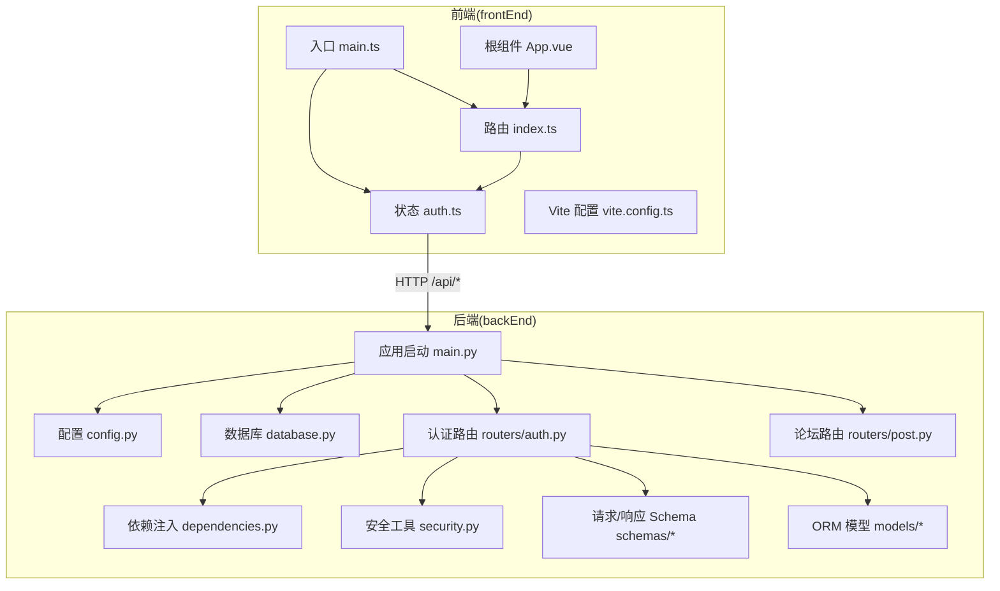
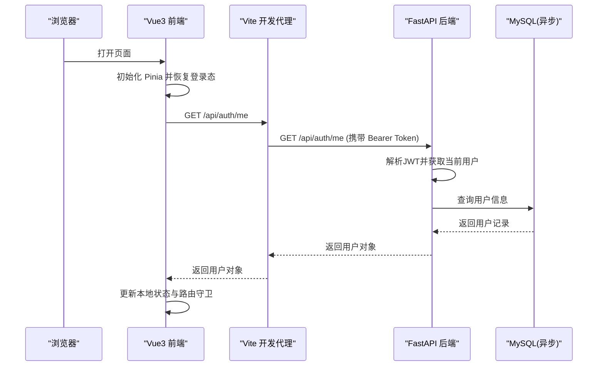
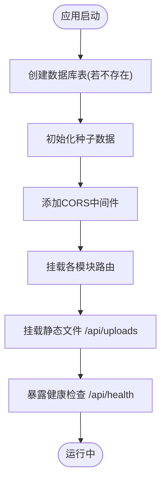
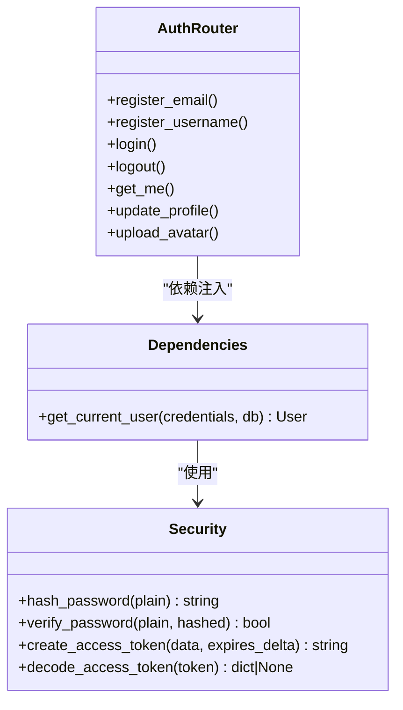
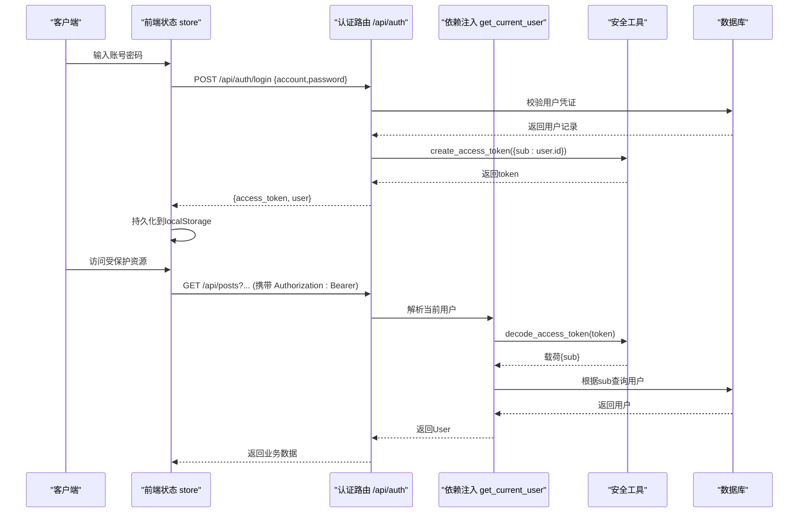
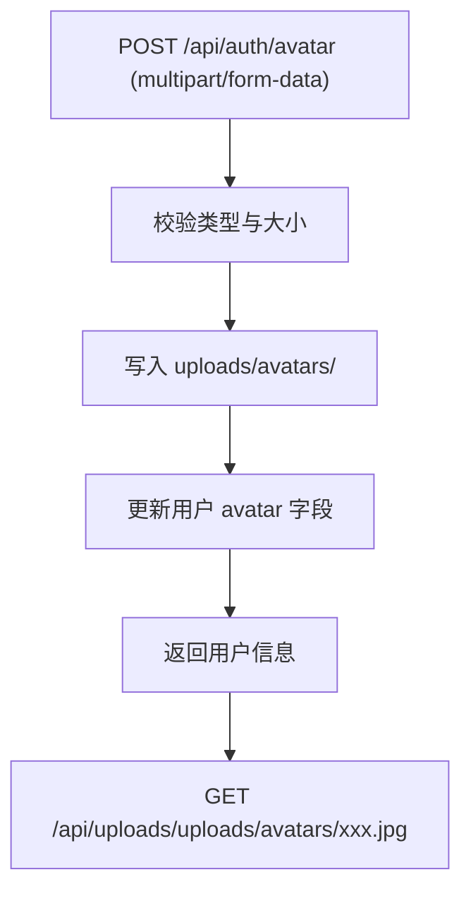
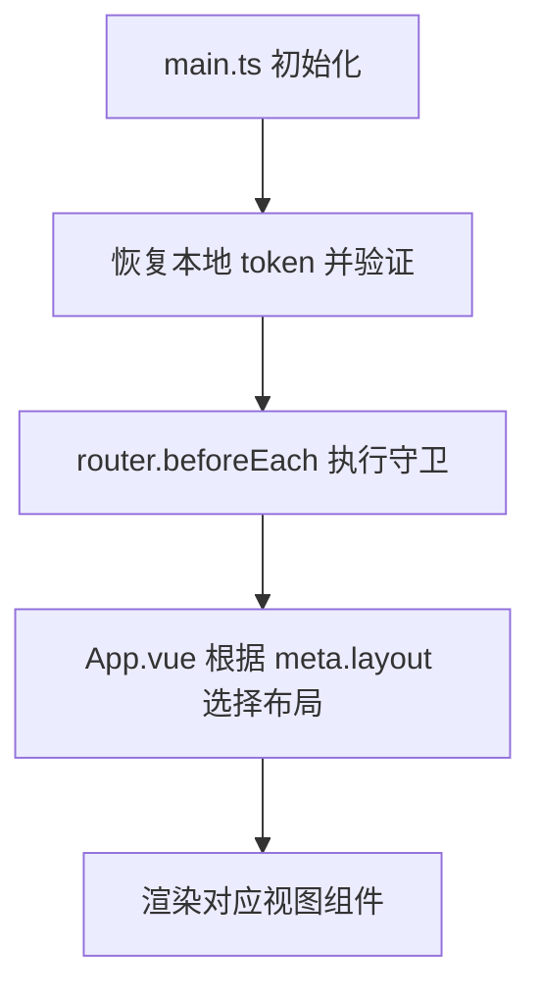
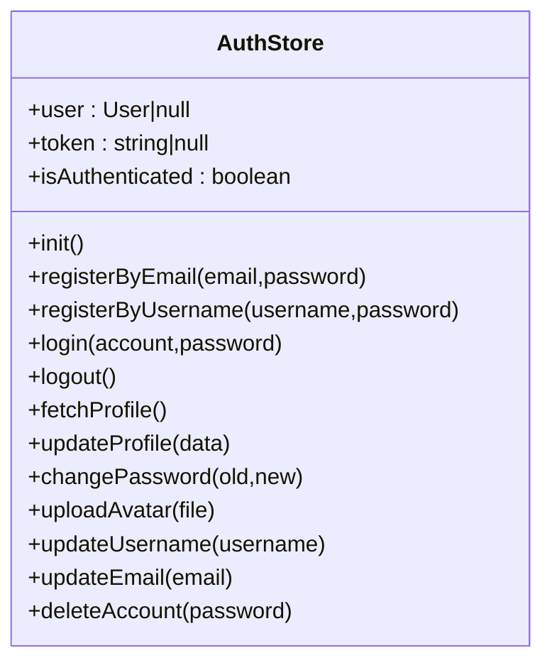
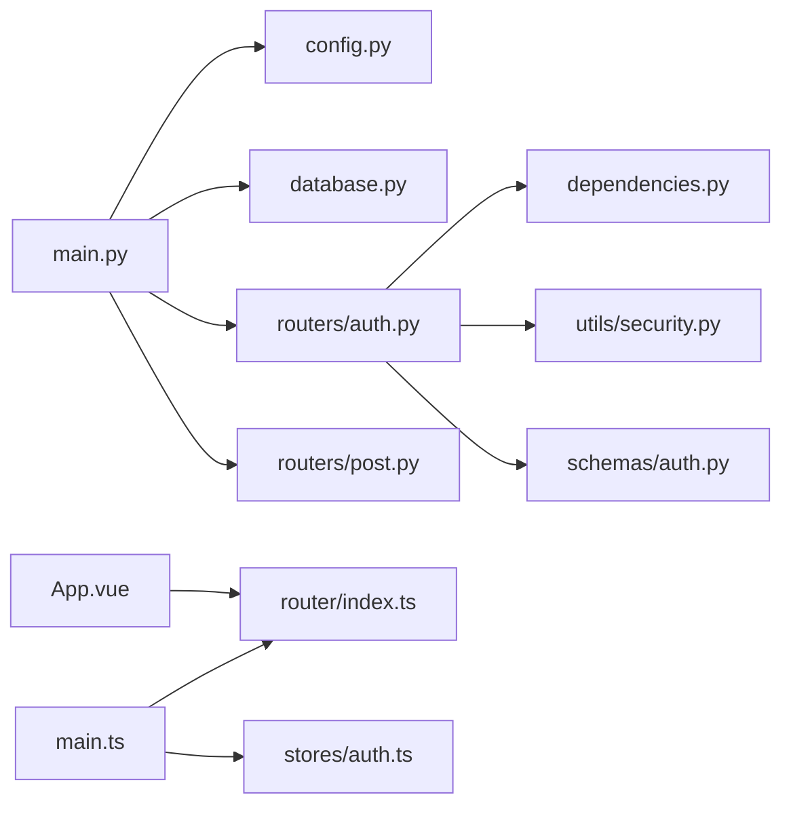
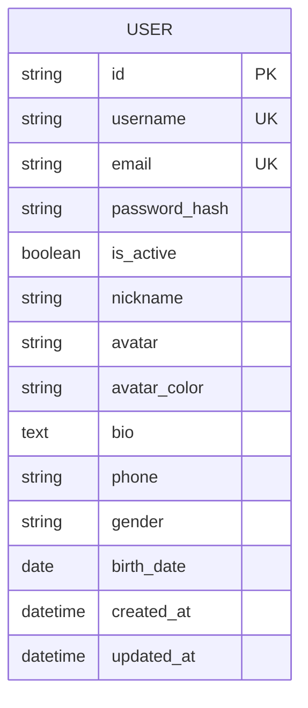

# 前后端分离设计

<cite>
**本文引用的文件**   
- [backEnd/app/main.py](file://backEnd/app/main.py)
- [backEnd/app/config.py](file://backEnd/app/config.py)
- [backEnd/app/database.py](file://backEnd/app/database.py)
- [backEnd/app/dependencies.py](file://backEnd/app/dependencies.py)
- [backEnd/app/utils/security.py](file://backEnd/app/utils/security.py)
- [backEnd/app/routers/auth.py](file://backEnd/app/routers/auth.py)
- [backEnd/app/routers/post.py](file://backEnd/app/routers/post.py)
- [backEnd/app/schemas/auth.py](file://backEnd/app/schemas/auth.py)
- [backEnd/app/models/user.py](file://backEnd/app/models/user.py)
- [frontEnd/src/main.ts](file://frontEnd/src/main.ts)
- [frontEnd/src/router/index.ts](file://frontEnd/src/router/index.ts)
- [frontEnd/src/stores/auth.ts](file://frontEnd/src/stores/auth.ts)
- [frontEnd/src/App.vue](file://frontEnd/src/App.vue)
- [frontEnd/vite.config.ts](file://frontEnd/vite.config.ts)
- [frontEnd/package.json](file://frontEnd/package.json)
</cite>

## 目录
1. [引言](#引言)
2. [项目结构](#项目结构)
3. [核心组件](#核心组件)
4. [架构总览](#架构总览)
5. [详细组件分析](#详细组件分析)
6. [依赖关系分析](#依赖关系分析)
7. [性能考量](#性能考量)
8. [故障排查指南](#故障排查指南)
9. [结论](#结论)
10. [附录](#附录)

## 引言
本文件面向HR XF系统的前后端分离设计与实现，系统性阐述以下要点：
- 前后端分离的架构模式与职责边界
- API接口设计规范、数据交换格式与错误处理机制
- 跨域策略（CORS）与开发期代理方案
- 前端Vue3应用结构、路由配置与状态管理（Pinia）
- 后端FastAPI应用组织、中间件、依赖注入与路由注册
- 认证授权流程（JWT）、静态文件服务与文件上传下载
- 前后端通信协议与最佳实践

## 项目结构
仓库采用典型的前后端分离目录划分：
- backEnd：基于FastAPI的后端服务，包含模型、路由、Schema、服务层、工具与配置
- frontEnd：基于Vue3 + Vite的前端应用，包含视图、组件、路由、状态管理与构建配置

图示来源
- [frontEnd/src/main.ts:1-19](file://frontEnd/src/main.ts#L1-L19)
- [frontEnd/src/router/index.ts:1-167](file://frontEnd/src/router/index.ts#L1-L167)
- [frontEnd/src/stores/auth.ts:1-314](file://frontEnd/src/stores/auth.ts#L1-L314)
- [frontEnd/src/App.vue:1-21](file://frontEnd/src/App.vue#L1-L21)
- [frontEnd/vite.config.ts:1-22](file://frontEnd/vite.config.ts#L1-L22)
- [backEnd/app/main.py:1-90](file://backEnd/app/main.py#L1-L90)
- [backEnd/app/config.py:1-71](file://backEnd/app/config.py#L1-L71)
- [backEnd/app/database.py:1-58](file://backEnd/app/database.py#L1-L58)
- [backEnd/app/dependencies.py:1-41](file://backEnd/app/dependencies.py#L1-L41)
- [backEnd/app/utils/security.py:1-48](file://backEnd/app/utils/security.py#L1-L48)
- [backEnd/app/routers/auth.py:1-217](file://backEnd/app/routers/auth.py#L1-L217)
- [backEnd/app/routers/post.py:1-249](file://backEnd/app/routers/post.py#L1-L249)
- [backEnd/app/schemas/auth.py:1-119](file://backEnd/app/schemas/auth.py#L1-L119)
- [backEnd/app/models/user.py:1-45](file://backEnd/app/models/user.py#L1-L45)

章节来源
- [frontEnd/src/main.ts:1-19](file://frontEnd/src/main.ts#L1-L19)
- [frontEnd/src/router/index.ts:1-167](file://frontEnd/src/router/index.ts#L1-L167)
- [frontEnd/src/stores/auth.ts:1-314](file://frontEnd/src/stores/auth.ts#L1-L314)
- [frontEnd/src/App.vue:1-21](file://frontEnd/src/App.vue#L1-L21)
- [frontEnd/vite.config.ts:1-22](file://frontEnd/vite.config.ts#L1-L22)
- [backEnd/app/main.py:1-90](file://backEnd/app/main.py#L1-L90)
- [backEnd/app/config.py:1-71](file://backEnd/app/config.py#L1-L71)
- [backEnd/app/database.py:1-58](file://backEnd/app/database.py#L1-L58)
- [backEnd/app/dependencies.py:1-41](file://backEnd/app/dependencies.py#L1-L41)
- [backEnd/app/utils/security.py:1-48](file://backEnd/app/utils/security.py#L1-L48)
- [backEnd/app/routers/auth.py:1-217](file://backEnd/app/routers/auth.py#L1-L217)
- [backEnd/app/routers/post.py:1-249](file://backEnd/app/routers/post.py#L1-L249)
- [backEnd/app/schemas/auth.py:1-119](file://backEnd/app/schemas/auth.py#L1-L119)
- [backEnd/app/models/user.py:1-45](file://backEnd/app/models/user.py#L1-L45)

## 核心组件
- 后端应用启动与中间件
  - FastAPI应用初始化、生命周期钩子、CORS中间件、路由挂载、静态文件挂载、全局异常处理器与健康检查
- 配置中心
  - 使用pydantic-settings加载环境变量，提供数据库URL、JWT参数、CORS白名单等
- 数据库连接与会话
  - 异步引擎与会话工厂，统一依赖注入get_db
- 认证与安全
  - JWT签发与校验、密码哈希与验证、当前用户解析依赖
- 路由与业务分层
  - 按领域拆分routers，通过schemas定义请求/响应结构，调用services执行业务逻辑
- 前端应用
  - Vue3入口、Pinia状态管理、Vue Router路由守卫、Vite代理与构建配置

章节来源
- [backEnd/app/main.py:1-90](file://backEnd/app/main.py#L1-L90)
- [backEnd/app/config.py:1-71](file://backEnd/app/config.py#L1-L71)
- [backEnd/app/database.py:1-58](file://backEnd/app/database.py#L1-L58)
- [backEnd/app/dependencies.py:1-41](file://backEnd/app/dependencies.py#L1-L41)
- [backEnd/app/utils/security.py:1-48](file://backEnd/app/utils/security.py#L1-L48)
- [backEnd/app/routers/auth.py:1-217](file://backEnd/app/routers/auth.py#L1-L217)
- [backEnd/app/routers/post.py:1-249](file://backEnd/app/routers/post.py#L1-L249)
- [backEnd/app/schemas/auth.py:1-119](file://backEnd/app/schemas/auth.py#L1-L119)
- [frontEnd/src/main.ts:1-19](file://frontEnd/src/main.ts#L1-L19)
- [frontEnd/src/router/index.ts:1-167](file://frontEnd/src/router/index.ts#L1-L167)
- [frontEnd/src/stores/auth.ts:1-314](file://frontEnd/src/stores/auth.ts#L1-L314)
- [frontEnd/vite.config.ts:1-22](file://frontEnd/vite.config.ts#L1-L22)

## 架构总览
前后端通过RESTful HTTP进行通信，前端在开发环境通过Vite代理将/api转发至后端；生产环境通常由反向代理或Nginx统一转发。后端以FastAPI为核心，结合Pydantic做数据校验，SQLAlchemy异步访问MySQL，JWT无状态鉴权。

图示来源
- [frontEnd/src/main.ts:14-18](file://frontEnd/src/main.ts#L14-L18)
- [frontEnd/src/stores/auth.ts:72-83](file://frontEnd/src/stores/auth.ts#L72-L83)
- [frontEnd/vite.config.ts:13-20](file://frontEnd/vite.config.ts#L13-L20)
- [backEnd/app/main.py:51-68](file://backEnd/app/main.py#L51-L68)
- [backEnd/app/dependencies.py:13-41](file://backEnd/app/dependencies.py#L13-L41)
- [backEnd/app/routers/auth.py:89-91](file://backEnd/app/routers/auth.py#L89-L91)
- [backEnd/app/database.py:50-58](file://backEnd/app/database.py#L50-L58)

## 详细组件分析

### 后端应用启动与中间件
- 应用初始化
  - 设置标题、描述、版本，并通过lifespan在启动时创建表与初始化种子数据，关闭时释放引擎
- CORS中间件
  - 允许指定来源、携带凭据、方法与头，来源于配置项
- 路由注册
  - 集中挂载各功能模块路由
- 静态文件服务
  - 将uploads目录挂载为/api/uploads，便于头像与简历等文件访问
- 全局异常处理
  - 自定义验证错误处理器，避免二进制内容导致解码异常

图示来源
- [backEnd/app/main.py:27-49](file://backEnd/app/main.py#L27-L49)
- [backEnd/app/main.py:51-73](file://backEnd/app/main.py#L51-L73)
- [backEnd/app/main.py:76-89](file://backEnd/app/main.py#L76-L89)

章节来源
- [backEnd/app/main.py:1-90](file://backEnd/app/main.py#L1-L90)

### 配置与环境
- 配置项
  - 数据库连接、JWT密钥与过期时间、MinIO预留、CORS白名单、外部AI与编译器路径
- 派生属性
  - 生成异步/同步数据库URL、解析CORS列表
- 缓存
  - get_settings使用lru_cache保证单例

章节来源
- [backEnd/app/config.py:1-71](file://backEnd/app/config.py#L1-L71)

### 数据库与会话
- 异步引擎与会话工厂
  - 配置池大小与预检查，兼容aiomysql ping签名差异
- 依赖注入
  - get_db提供AsyncSession并在提交/回滚后自动清理

章节来源
- [backEnd/app/database.py:1-58](file://backEnd/app/database.py#L1-L58)

### 认证与安全
- 密码处理
  - bcrypt哈希与校验，对超长密码进行安全截断
- JWT
  - 签发带exp的access_token，解码校验失败返回None
- 当前用户解析
  - 从Authorization头提取Bearer token，校验载荷并查询用户，未激活或不存在则拒绝

图示来源
- [backEnd/app/utils/security.py:1-48](file://backEnd/app/utils/security.py#L1-L48)
- [backEnd/app/dependencies.py:1-41](file://backEnd/app/dependencies.py#L1-L41)
- [backEnd/app/routers/auth.py:1-217](file://backEnd/app/routers/auth.py#L1-L217)

章节来源
- [backEnd/app/utils/security.py:1-48](file://backEnd/app/utils/security.py#L1-L48)
- [backEnd/app/dependencies.py:1-41](file://backEnd/app/dependencies.py#L1-L41)
- [backEnd/app/routers/auth.py:1-217](file://backEnd/app/routers/auth.py#L1-L217)

### 认证授权流程（登录与受保护资源）

图示来源
- [frontEnd/src/stores/auth.ts:119-134](file://frontEnd/src/stores/auth.ts#L119-L134)
- [backEnd/app/routers/auth.py:69-80](file://backEnd/app/routers/auth.py#L69-L80)
- [backEnd/app/dependencies.py:13-41](file://backEnd/app/dependencies.py#L13-L41)
- [backEnd/app/utils/security.py:26-47](file://backEnd/app/utils/security.py#L26-L47)
- [backEnd/app/routers/post.py:63-105](file://backEnd/app/routers/post.py#L63-L105)

章节来源
- [frontEnd/src/stores/auth.ts:119-134](file://frontEnd/src/stores/auth.ts#L119-L134)
- [backEnd/app/routers/auth.py:69-80](file://backEnd/app/routers/auth.py#L69-L80)
- [backEnd/app/dependencies.py:13-41](file://backEnd/app/dependencies.py#L13-L41)
- [backEnd/app/utils/security.py:26-47](file://backEnd/app/utils/security.py#L26-L47)
- [backEnd/app/routers/post.py:63-105](file://backEnd/app/routers/post.py#L63-L105)

### 文件上传与静态文件服务
- 头像上传
  - 限制类型与大小，保存至uploads/avatars/{user_id}_{uuid}{ext}，更新用户avatar字段，删除旧文件
- 静态文件
  - 将uploads目录挂载为/api/uploads，前端可直接拼接相对路径访问

图示来源
- [backEnd/app/routers/auth.py:182-216](file://backEnd/app/routers/auth.py#L182-L216)
- [backEnd/app/main.py:70-73](file://backEnd/app/main.py#L70-L73)

章节来源
- [backEnd/app/routers/auth.py:182-216](file://backEnd/app/routers/auth.py#L182-L216)
- [backEnd/app/main.py:70-73](file://backEnd/app/main.py#L70-L73)

### 前端应用结构与路由
- 入口与初始化
  - 创建Vue应用与Pinia，注册路由，启动时恢复登录态并挂载应用
- 路由配置
  - 使用createWebHistory，定义多模块路由，meta标记布局与权限要求
  - 全局前置守卫：管理员与普通用户分别校验，未登录跳转登录页，已登录访问登录页重定向
- 根组件布局选择
  - 根据route.meta.layout动态渲染AdminLayout/DefaultLayout或直接渲染

图示来源
- [frontEnd/src/main.ts:1-19](file://frontEnd/src/main.ts#L1-L19)
- [frontEnd/src/router/index.ts:122-166](file://frontEnd/src/router/index.ts#L122-L166)
- [frontEnd/src/App.vue:1-21](file://frontEnd/src/App.vue#L1-L21)

章节来源
- [frontEnd/src/main.ts:1-19](file://frontEnd/src/main.ts#L1-L19)
- [frontEnd/src/router/index.ts:1-167](file://frontEnd/src/router/index.ts#L1-L167)
- [frontEnd/src/App.vue:1-21](file://frontEnd/src/App.vue#L1-L21)

### 前端状态管理（Pinia）
- 统一API请求封装
  - 自动附加Authorization头，统一错误处理，抛出detail或状态码信息
- 认证状态
  - 维护user与token，计算isAuthenticated，提供注册、登录、登出、资料更新、头像上传等方法
- 本地持久化
  - 将token与用户信息存入localStorage，应用启动时恢复

图示来源
- [frontEnd/src/stores/auth.ts:1-314](file://frontEnd/src/stores/auth.ts#L1-L314)

章节来源
- [frontEnd/src/stores/auth.ts:1-314](file://frontEnd/src/stores/auth.ts#L1-L314)

### 跨域处理与开发代理
- 后端CORS
  - 通过CORSMiddleware允许指定来源、凭据、方法与头
- 前端开发代理
  - Vite server.proxy将/api转发至后端地址，解决开发期跨域问题

章节来源
- [backEnd/app/main.py:51-58](file://backEnd/app/main.py#L51-L58)
- [backEnd/app/config.py:31-33](file://backEnd/app/config.py#L31-33)
- [frontEnd/vite.config.ts:13-20](file://frontEnd/vite.config.ts#L13-L20)

### 数据交换格式与校验
- 请求/响应Schema
  - 使用Pydantic定义严格的输入输出结构，包括邮箱、用户名、密码强度、性别枚举等校验
- 前端类型
  - TypeScript接口与Pinia Store中的类型定义与后端Schema保持一致

章节来源
- [backEnd/app/schemas/auth.py:1-119](file://backEnd/app/schemas/auth.py#L1-L119)
- [frontEnd/src/stores/auth.ts:4-31](file://frontEnd/src/stores/auth.ts#L4-L31)

### 错误处理机制
- 后端
  - 自定义RequestValidationError处理器，过滤可能包含二进制的input字段，返回结构化错误
  - 业务异常通过HTTPException抛出具体状态码与detail
- 前端
  - apiRequest统一捕获非ok响应，解析JSON detail并抛出错误，供上层store处理

章节来源
- [backEnd/app/main.py:76-84](file://backEnd/app/main.py#L76-L84)
- [backEnd/app/routers/auth.py:46-80](file://backEnd/app/routers/auth.py#L46-L80)
- [frontEnd/src/stores/auth.ts:37-61](file://frontEnd/src/stores/auth.ts#L37-L61)

## 依赖关系分析
- 后端模块耦合
  - main.py聚合配置、数据库、路由与中间件
  - routers/auth.py依赖dependencies.py与utils/security.py完成鉴权
  - schemas/auth.py为路由层提供强类型约束
- 前端模块耦合
  - main.ts装配Pinia与Router，App.vue根据路由元信息选择布局
  - stores/auth.ts作为API客户端与状态管理中心

图示来源
- [backEnd/app/main.py:1-90](file://backEnd/app/main.py#L1-L90)
- [backEnd/app/config.py:1-71](file://backEnd/app/config.py#L1-L71)
- [backEnd/app/database.py:1-58](file://backEnd/app/database.py#L1-L58)
- [backEnd/app/dependencies.py:1-41](file://backEnd/app/dependencies.py#L1-L41)
- [backEnd/app/utils/security.py:1-48](file://backEnd/app/utils/security.py#L1-L48)
- [backEnd/app/routers/auth.py:1-217](file://backEnd/app/routers/auth.py#L1-L217)
- [backEnd/app/routers/post.py:1-249](file://backEnd/app/routers/post.py#L1-L249)
- [backEnd/app/schemas/auth.py:1-119](file://backEnd/app/schemas/auth.py#L1-L119)
- [frontEnd/src/main.ts:1-19](file://frontEnd/src/main.ts#L1-L19)
- [frontEnd/src/router/index.ts:1-167](file://frontEnd/src/router/index.ts#L1-L167)
- [frontEnd/src/stores/auth.ts:1-314](file://frontEnd/src/stores/auth.ts#L1-L314)
- [frontEnd/src/App.vue:1-21](file://frontEnd/src/App.vue#L1-L21)

章节来源
- [backEnd/app/main.py:1-90](file://backEnd/app/main.py#L1-L90)
- [frontEnd/src/main.ts:1-19](file://frontEnd/src/main.ts#L1-L19)

## 性能考量
- 数据库连接池
  - 后端使用异步引擎与连接池，开启pool_pre_ping提升健壮性
- 静态资源
  - 使用静态文件挂载减少重复逻辑，建议生产环境交由Nginx托管
- 前端构建
  - Vite插件与Tailwind按需编译，优化打包体积
- 网络请求
  - 统一封装减少重复代码，合理分页与筛选降低带宽消耗

[本节为通用指导，不直接分析具体文件]

## 故障排查指南
- 跨域问题
  - 确认后端CORS白名单包含前端地址，开发期检查Vite代理是否生效
- 认证失败
  - 检查Authorization头是否正确携带Bearer token，后端依赖注入是否成功解析
- 文件上传失败
  - 检查MIME类型与文件大小限制，确认uploads目录存在且可写
- 数据库连接异常
  - 核对数据库URL与凭据，关注pool_pre_ping兼容性补丁

章节来源
- [backEnd/app/main.py:51-58](file://backEnd/app/main.py#L51-L58)
- [frontEnd/vite.config.ts:13-20](file://frontEnd/vite.config.ts#L13-L20)
- [backEnd/app/dependencies.py:13-41](file://backEnd/app/dependencies.py#L13-L41)
- [backEnd/app/routers/auth.py:182-216](file://backEnd/app/routers/auth.py#L182-L216)
- [backEnd/app/database.py:1-58](file://backEnd/app/database.py#L1-L58)

## 结论
本项目采用清晰的前后端分离架构：前端以Vue3+Pinia+Vue Router构建SPA，后端以FastAPI提供REST API，配合Pydantic严格的数据契约与JWT无状态鉴权。通过CORS与Vite代理解决跨域，静态文件与上传功能完善。整体结构模块化、职责清晰，具备良好的可扩展性与可维护性。

[本节为总结性内容，不直接分析具体文件]

## 附录

### API接口规范（示例）
- 认证相关
  - POST /api/auth/register/email
  - POST /api/auth/register/username
  - POST /api/auth/login
  - POST /api/auth/logout
  - GET /api/auth/me
  - PUT /api/auth/profile
  - PUT /api/auth/username
  - PUT /api/auth/email
  - PUT /api/auth/password
  - DELETE /api/auth/account
  - POST /api/auth/avatar
- 面经论坛
  - POST /api/posts
  - GET /api/posts
  - GET /api/posts/{post_id}
  - DELETE /api/posts/{post_id}
  - POST /api/posts/{post_id}/like
  - POST /api/posts/{post_id}/comments
  - GET /api/posts/{post_id}/comments
  - DELETE /api/posts/comments/{comment_id}
  - POST /api/posts/{post_id}/share
- 健康检查
  - GET /api/health

章节来源
- [backEnd/app/routers/auth.py:25-217](file://backEnd/app/routers/auth.py#L25-L217)
- [backEnd/app/routers/post.py:22-249](file://backEnd/app/routers/post.py#L22-L249)
- [backEnd/app/main.py:87-89](file://backEnd/app/main.py#L87-L89)

### 数据模型（用户）

图示来源
- [backEnd/app/models/user.py:10-45](file://backEnd/app/models/user.py#L10-L45)

章节来源
- [backEnd/app/models/user.py:1-45](file://backEnd/app/models/user.py#L1-L45)

### 前端构建与脚本
- 开发命令
  - npm run dev
- 构建命令
  - npm run build
- 预览命令
  - npm run preview

章节来源
- [frontEnd/package.json:1-35](file://frontEnd/package.json#L1-L35)