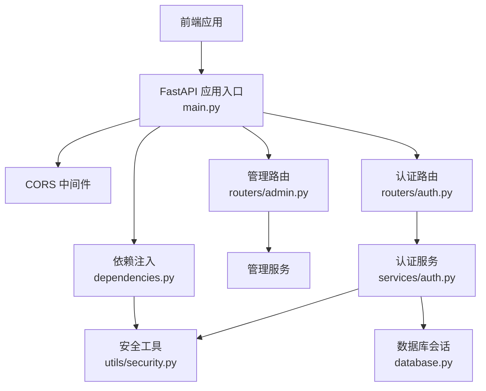
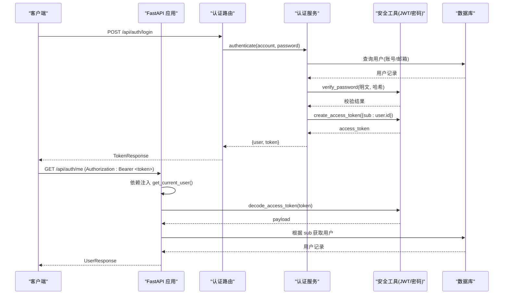
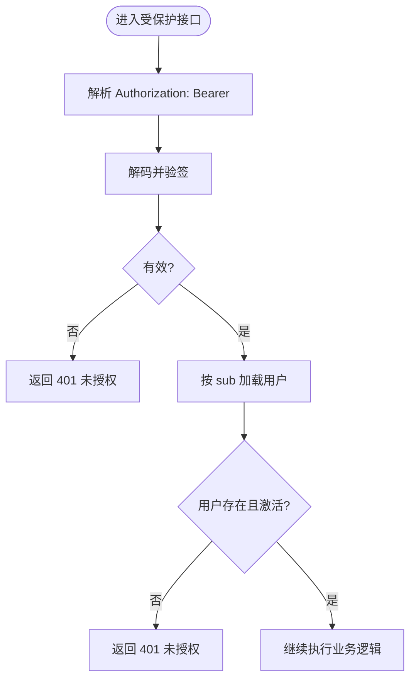
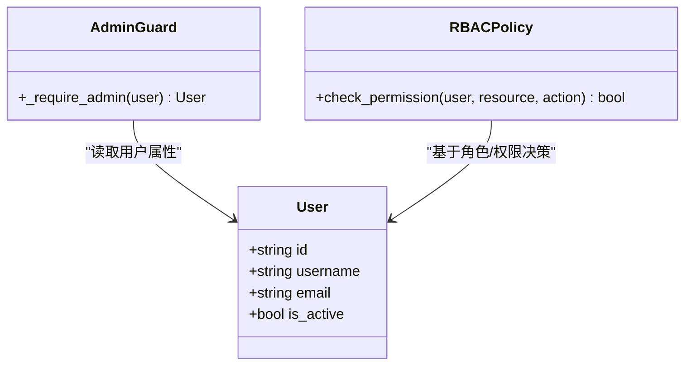
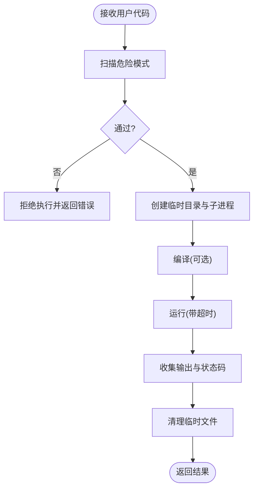
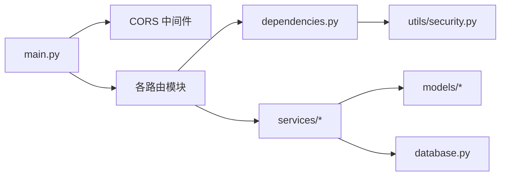

# 安全架构

<cite>
**本文引用的文件**   
- [main.py](file://backEnd/app/main.py)
- [config.py](file://backEnd/app/config.py)
- [dependencies.py](file://backEnd/app/dependencies.py)
- [security.py](file://backEnd/app/utils/security.py)
- [auth.py](file://backEnd/app/routers/auth.py)
- [auth_service.py](file://backEnd/app/services/auth.py)
- [user_model.py](file://backEnd/app/models/user.py)
- [admin_router.py](file://backEnd/app/routers/admin.py)
- [code_executor.py](file://backEnd/app/services/code_executor.py)
</cite>

## 目录
1. [引言](#引言)
2. [项目结构](#项目结构)
3. [核心组件](#核心组件)
4. [架构总览](#架构总览)
5. [详细组件分析](#详细组件分析)
6. [依赖关系分析](#依赖关系分析)
7. [性能与安全权衡](#性能与安全权衡)
8. [故障排查指南](#故障排查指南)
9. [结论](#结论)
10. [附录：最佳实践与加固建议](#附录最佳实践与加固建议)

## 引言
本文件面向HR XF系统的安全架构，系统性阐述身份认证、授权控制、数据安全、网络安全防护等关键设计。重点覆盖JWT令牌签发与验证流程、密码加密存储、敏感信息保护、输入校验与输出编码策略、CORS配置、CSRF/XSS防护思路，以及权限模型（基于角色的访问控制）的实现现状与改进建议。同时提供代码级流程图与时序图，帮助开发者快速理解并落地安全开发规范。

## 项目结构
后端采用FastAPI分层架构：路由层负责HTTP接口定义与参数校验；服务层封装业务逻辑；工具层提供通用安全能力（如JWT、密码哈希）；配置集中管理敏感参数与环境变量。前端通过浏览器发起请求，携带Bearer Token进行鉴权。

图表来源
- [main.py:51-68](file://backEnd/app/main.py#L51-L68)
- [auth.py:25-86](file://backEnd/app/routers/auth.py#L25-L86)
- [admin_router.py:24-34](file://backEnd/app/routers/admin.py#L24-L34)
- [auth_service.py:85-96](file://backEnd/app/services/auth.py#L85-L96)
- [security.py:26-47](file://backEnd/app/utils/security.py#L26-L47)
- [dependencies.py:13-40](file://backEnd/app/dependencies.py#L13-L40)

章节来源
- [main.py:44-73](file://backEnd/app/main.py#L44-L73)
- [config.py:20-36](file://backEnd/app/config.py#L20-L36)

## 核心组件
- 认证与授权
  - JWT无状态访问令牌：使用HS256算法，载荷包含用户标识与过期时间；每次请求由依赖注入解析并校验。
  - 密码安全：bcrypt哈希存储，登录与改密均通过安全工具函数完成。
  - 管理员权限：当前为简易规则（邮箱或用户名包含“admin”），可升级为RBAC。
- 网络安全
  - CORS：允许指定来源列表，启用凭据传递。
  - CSRF：由于采用无状态Bearer Token且默认不发送Cookie，风险较低；若后续引入Cookie会话需补充CSRF防护。
  - XSS：服务端对上传文件名做白名单扩展处理，避免直接拼接；前端渲染应遵循内容安全策略与输出转义。
- 数据与输入安全
  - Pydantic Schema强类型校验与自定义校验器（如用户名正则、密码强度）。
  - 上传头像限制MIME类型与大小，旧文件清理。
  - 代码沙箱执行器：危险关键词黑名单+进程隔离+超时控制。

章节来源
- [security.py:10-23](file://backEnd/app/utils/security.py#L10-L23)
- [auth.py:182-216](file://backEnd/app/routers/auth.py#L182-L216)
- [auth_service.py:38-82](file://backEnd/app/services/auth.py#L38-L82)
- [admin_router.py:24-34](file://backEnd/app/routers/admin.py#L24-L34)
- [code_executor.py:22-149](file://backEnd/app/services/code_executor.py#L22-L149)

## 架构总览
下图展示从客户端到数据库的完整认证与授权路径，包括JWT签发、验证与资源访问控制。

图表来源
- [auth.py:69-80](file://backEnd/app/routers/auth.py#L69-L80)
- [auth_service.py:85-96](file://backEnd/app/services/auth.py#L85-L96)
- [security.py:26-47](file://backEnd/app/utils/security.py#L26-L47)
- [dependencies.py:13-40](file://backEnd/app/dependencies.py#L13-L40)

## 详细组件分析

### 身份认证与JWT令牌机制
- 令牌签发
  - 载荷仅包含最小必要信息（用户ID），附加exp过期时间。
  - 使用配置的对称密钥与算法签名，确保完整性与防篡改。
- 令牌验证
  - 依赖注入统一解析Authorization头，校验签名与过期时间。
  - 解析成功后按sub查询用户并检查账户是否激活。
- 刷新机制
  - 当前实现为无状态JWT，未提供显式刷新端点；可在更新敏感属性后重新签发新令牌，客户端替换旧令牌。

图表来源
- [dependencies.py:13-40](file://backEnd/app/dependencies.py#L13-L40)
- [security.py:39-47](file://backEnd/app/utils/security.py#L39-L47)

章节来源
- [security.py:26-47](file://backEnd/app/utils/security.py#L26-L47)
- [dependencies.py:13-40](file://backEnd/app/dependencies.py#L13-L40)
- [auth.py:83-91](file://backEnd/app/routers/auth.py#L83-L91)

### 密码加密与敏感信息保护
- 密码哈希
  - 使用bcrypt，内置盐值与迭代次数，抵御彩虹表与暴力破解。
  - 对超长密码进行安全截断，兼容算法限制。
- 敏感字段
  - 用户模型中仅存储password_hash，不暴露敏感字段于响应Schema。
  - 配置文件中的密钥与数据库凭据通过环境变量加载，避免硬编码。

章节来源
- [security.py:10-23](file://backEnd/app/utils/security.py#L10-L23)
- [user_model.py:24-25](file://backEnd/app/models/user.py#L24-L25)
- [config.py:20-36](file://backEnd/app/config.py#L20-L36)

### 输入验证与输出编码
- 输入验证
  - Pydantic Schema强制类型与长度约束；自定义校验器实现用户名正则、性别枚举、密码强度等。
  - 全局异常处理器过滤可能包含二进制的input字段，避免错误响应泄露。
- 输出编码
  - 响应模型严格序列化，避免直接透传ORM对象。
  - 静态文件挂载/uploads目录，避免直接暴露源码与敏感目录。

章节来源
- [schemas_auth.py:9-36](file://backEnd/app/schemas/auth.py#L9-L36)
- [main.py:76-84](file://backEnd/app/main.py#L76-L84)
- [main.py:70-73](file://backEnd/app/main.py#L70-L73)

### 网络安全防护（CORS/CSRF/XSS）
- CORS
  - 允许来自前端的特定源，支持凭据传递，方法头白名单按需收紧。
- CSRF
  - 当前采用无状态Bearer Token，默认不随Cookie发送，CSRF风险较低；若未来引入Cookie会话，需增加CSRF Token或SameSite Cookie策略。
- XSS
  - 服务端对上传文件名生成随机后缀，避免恶意扩展名；前端渲染时应遵循CSP与输出转义策略。

章节来源
- [main.py:51-58](file://backEnd/app/main.py#L51-L58)
- [auth.py:182-216](file://backEnd/app/routers/auth.py#L182-L216)

### 权限控制模型与角色管理
- 现状
  - 管理员判定为简单字符串匹配（邮箱或用户名包含“admin”），属于轻量级ACL。
- 建议
  - 引入标准RBAC：用户-角色-权限三元组，持久化至数据库；在依赖注入中统一校验。
  - 对敏感操作（删除、批量修改）增加二次确认与审计日志。

图表来源
- [admin_router.py:24-34](file://backEnd/app/routers/admin.py#L24-L34)
- [user_model.py:10-26](file://backEnd/app/models/user.py#L10-L26)

章节来源
- [admin_router.py:24-34](file://backEnd/app/routers/admin.py#L24-L34)
- [user_model.py:10-26](file://backEnd/app/models/user.py#L10-L26)

### 代码执行沙箱安全
- 策略
  - 危险关键词黑名单（跨语言通用与语言特定模式）。
  - 子进程隔离运行，限制时间与内存，临时目录隔离。
- 风险缓解
  - 禁止网络IO、文件系统写入系统目录、反射与进程控制等高危API。
  - 编译与执行分别设置超时，防止DoS。

图表来源
- [code_executor.py:22-149](file://backEnd/app/services/code_executor.py#L22-L149)

章节来源
- [code_executor.py:22-149](file://backEnd/app/services/code_executor.py#L22-L149)

## 依赖关系分析
- 模块耦合
  - 路由层依赖服务层与依赖注入；服务层依赖安全工具与数据库会话。
  - 安全工具独立，被多处复用，内聚性良好。
- 外部依赖
  - FastAPI中间件（CORS）、Pydantic（校验）、SQLAlchemy（异步会话）、passlib/jose（密码与JWT）。
- 潜在循环依赖
  - 当前未发现循环导入；模型初始化在主入口统一导入，保证元数据注册。

图表来源
- [main.py:51-68](file://backEnd/app/main.py#L51-L68)
- [dependencies.py:1-10](file://backEnd/app/dependencies.py#L1-10)
- [security.py:1-9](file://backEnd/app/utils/security.py#L1-9)

章节来源
- [main.py:44-73](file://backEnd/app/main.py#L44-L73)
- [dependencies.py:1-10](file://backEnd/app/dependencies.py#L1-10)

## 性能与安全权衡
- JWT无状态优势在于水平扩展与低延迟，但无法主动撤销；可通过缩短过期时间与服务端黑名单缓存平衡安全性与可用性。
- bcrypt计算开销较大，建议结合速率限制与登录失败计数，防止暴力破解。
- 沙箱执行需严格控制CPU/内存/时间配额，避免资源耗尽攻击。

[本节为通用指导，无需具体文件引用]

## 故障排查指南
- 401未授权
  - 检查Authorization头格式是否为“Bearer <token>”。
  - 确认secret_key与algorithm一致，且token未过期。
  - 确认用户未被禁用。
- 403无管理员权限
  - 当前管理员判定基于字符串匹配，请确认邮箱或用户名包含“admin”。
- 422参数校验失败
  - 查看detail数组定位字段；注意二进制输入已被过滤，避免Unicode解码错误。
- 上传失败
  - 检查MIME类型是否在允许列表，文件大小不超过上限。

章节来源
- [dependencies.py:13-40](file://backEnd/app/dependencies.py#L13-L40)
- [admin_router.py:24-34](file://backEnd/app/routers/admin.py#L24-L34)
- [main.py:76-84](file://backEnd/app/main.py#L76-L84)
- [auth.py:182-216](file://backEnd/app/routers/auth.py#L182-L216)

## 结论
HR XF后端已具备较完善的基础安全能力：基于JWT的无状态认证、bcrypt密码哈希、严格的输入校验与安全的上传处理、CORS可控、沙箱执行的风险隔离。建议在后续迭代中引入标准RBAC、细粒度权限控制、更完善的审计与监控，并对CORS与令牌生命周期进行生产环境加固。

[本节为总结，无需具体文件引用]

## 附录：最佳实践与加固建议
- 令牌与密钥
  - 生产环境使用高强度随机密钥，定期轮换；考虑引入短期Access Token与长期Refresh Token组合。
  - 对敏感操作（改密、改邮箱）强制重新签发令牌。
- 权限模型
  - 将管理员判定迁移为RBAC，支持多角色与资源级权限；在依赖注入中统一校验。
- 网络安全
  - 收紧CORS白名单，仅允许可信域名；启用HSTS与HTTPS。
  - 若引入Cookie会话，务必启用CSRF Token与SameSite=Strict/Lax。
  - 前端实施CSP与XSS防护，服务端对所有用户输入进行上下文相关输出编码。
- 数据与存储
  - 数据库连接使用最小权限账户；开启SSL传输加密。
  - 对敏感字段（手机号、身份证等）进行脱敏展示与加密存储。
- 审计与监控
  - 记录认证与授权事件、关键数据变更与异常；集中日志与告警。
  - 对登录失败、频繁令牌刷新、异常上传等行为进行风控检测。
- 代码执行沙箱
  - 持续更新危险模式库；限制网络访问与系统调用；对执行结果进行白名单过滤。

[本节为通用指导，无需具体文件引用]