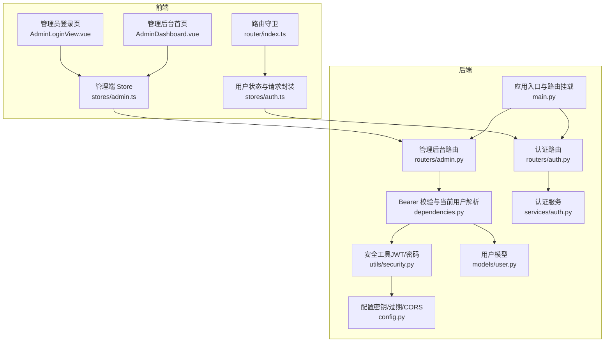
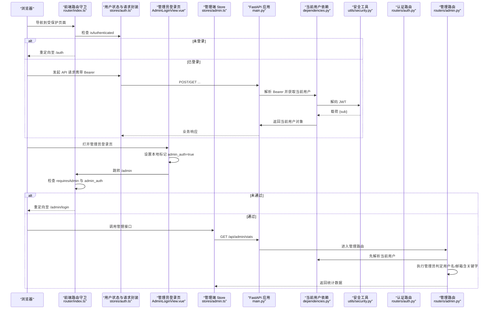
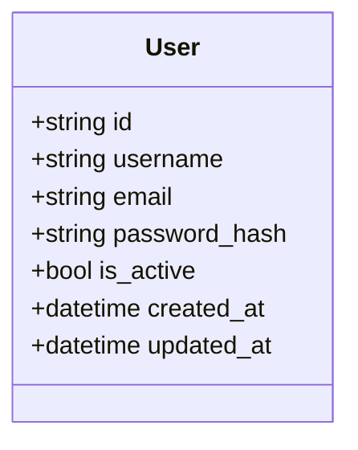
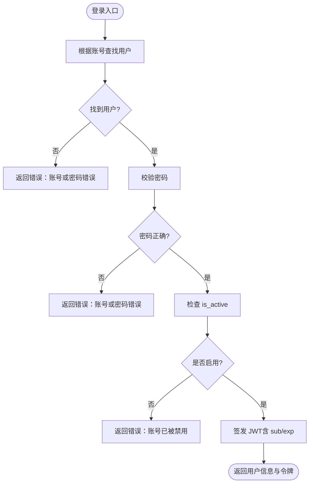
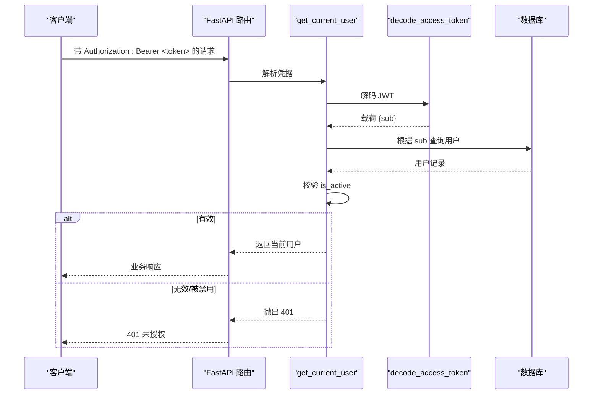
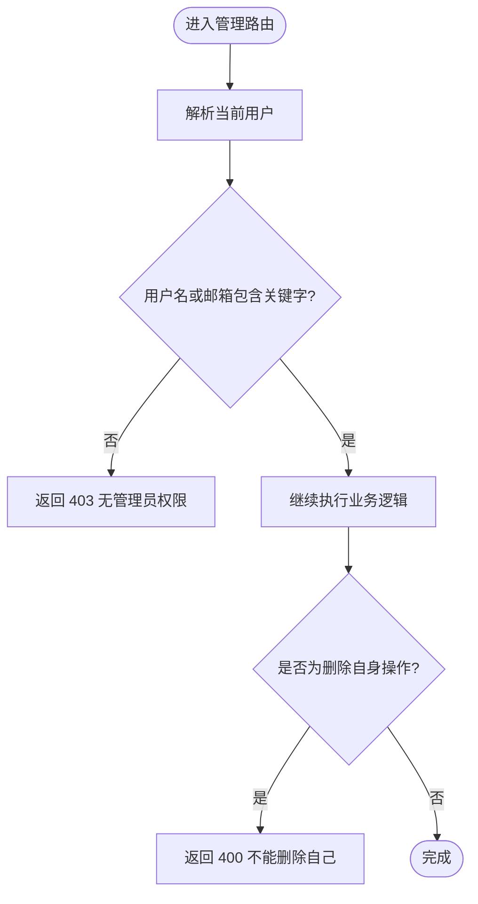
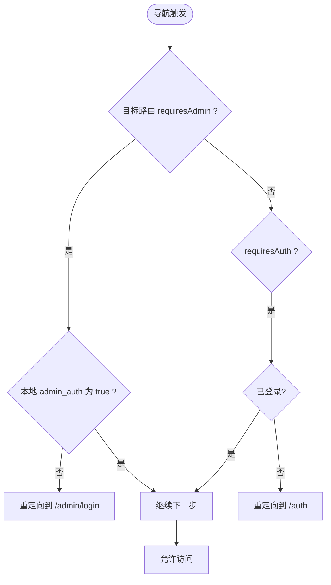
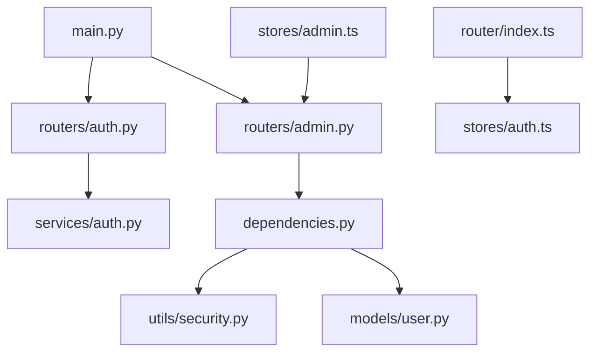

# 授权控制系统

<cite>
**本文引用的文件**   
- [backEnd/app/main.py](file://backEnd/app/main.py)
- [backEnd/app/dependencies.py](file://backEnd/app/dependencies.py)
- [backEnd/app/utils/security.py](file://backEnd/app/utils/security.py)
- [backEnd/app/config.py](file://backEnd/app/config.py)
- [backEnd/app/models/user.py](file://backEnd/app/models/user.py)
- [backEnd/app/routers/auth.py](file://backEnd/app/routers/auth.py)
- [backEnd/app/routers/admin.py](file://backEnd/app/routers/admin.py)
- [backEnd/app/services/auth.py](file://backEnd/app/services/auth.py)
- [frontEnd/src/router/index.ts](file://frontEnd/src/router/index.ts)
- [frontEnd/src/stores/auth.ts](file://frontEnd/src/stores/auth.ts)
- [frontEnd/src/views/admin/AdminLoginView.vue](file://frontEnd/src/views/admin/AdminLoginView.vue)
- [frontEnd/src/views/admin/AdminDashboard.vue](file://frontEnd/src/views/admin/AdminDashboard.vue)
- [frontEnd/src/stores/admin.ts](file://frontEnd/src/stores/admin.ts)
</cite>

## 目录
1. [引言](#引言)
2. [项目结构](#项目结构)
3. [核心组件](#核心组件)
4. [架构总览](#架构总览)
5. [详细组件分析](#详细组件分析)
6. [依赖关系分析](#依赖关系分析)
7. [性能与扩展性](#性能与扩展性)
8. [故障排查指南](#故障排查指南)
9. [结论](#结论)
10. [附录](#附录)

## 引言
本文件面向HR XF系统的授权控制模块，系统性梳理并文档化当前实现的前后端鉴权与访问控制机制。重点覆盖：
- 用户认证流程（JWT）与令牌生命周期
- 管理员权限验证机制（基于用户名/邮箱的简易规则）
- 前端路由守卫（普通用户与管理端）
- API 级别的权限检查中间件设计
- 权限模型现状与可扩展方向（RBAC、动态权限、缓存等）

说明：当前系统未实现完整的基于角色的访问控制（RBAC），而是采用“登录态 + 简单管理员判定”的方式。后续章节将给出向 RBAC 演进的方案建议。

## 项目结构
授权相关的关键代码分布在前后端多处：
- 后端
  - 应用入口与路由挂载：main.py
  - 认证依赖与 Bearer 校验：dependencies.py
  - 安全工具（密码哈希、JWT 编解码）：utils/security.py
  - 配置（密钥、过期时间、CORS 等）：config.py
  - 用户模型：models/user.py
  - 认证路由与服务：routers/auth.py, services/auth.py
  - 管理后台路由与管理员校验：routers/admin.py
- 前端
  - 路由定义与守卫：router/index.ts
  - 用户状态与请求封装：stores/auth.ts
  - 管理端视图与登录页：views/admin/AdminLoginView.vue, views/admin/AdminDashboard.vue
  - 管理端数据存取：stores/admin.ts

图表来源
- [backEnd/app/main.py:44-68](file://backEnd/app/main.py#L44-L68)
- [backEnd/app/dependencies.py:10-40](file://backEnd/app/dependencies.py#L10-L40)
- [backEnd/app/utils/security.py:18-47](file://backEnd/app/utils/security.py#L18-L47)
- [backEnd/app/config.py:20-24](file://backEnd/app/config.py#L20-L24)
- [backEnd/app/models/user.py:10-45](file://backEnd/app/models/user.py#L10-L45)
- [backEnd/app/routers/auth.py:69-81](file://backEnd/app/routers/auth.py#L69-L81)
- [backEnd/app/services/auth.py:85-96](file://backEnd/app/services/auth.py#L85-L96)
- [backEnd/app/routers/admin.py:24-34](file://backEnd/app/routers/admin.py#L24-L34)
- [frontEnd/src/router/index.ts:136-164](file://frontEnd/src/router/index.ts#L136-L164)
- [frontEnd/src/stores/auth.ts:37-61](file://frontEnd/src/stores/auth.ts#L37-L61)
- [frontEnd/src/views/admin/AdminLoginView.vue:105-115](file://frontEnd/src/views/admin/AdminLoginView.vue#L105-L115)
- [frontEnd/src/views/admin/AdminDashboard.vue:100-135](file://frontEnd/src/views/admin/AdminDashboard.vue#L100-L135)
- [frontEnd/src/stores/admin.ts:92-127](file://frontEnd/src/stores/admin.ts#L92-L127)

章节来源
- [backEnd/app/main.py:44-68](file://backEnd/app/main.py#L44-L68)
- [frontEnd/src/router/index.ts:136-164](file://frontEnd/src/router/index.ts#L136-L164)

## 核心组件
- 用户模型与活跃状态
  - 用户表包含唯一标识、账号信息、头像资料、创建/更新时间以及 is_active 字段用于软禁用。
- 认证服务与安全工具
  - 提供注册、登录、密码校验、令牌生成与解码能力；密码使用 bcrypt 哈希，JWT 使用 HS256 算法，过期时间由配置决定。
- 依赖注入与当前用户解析
  - 通过 HTTP Bearer 方案解析 Authorization 头，解码 JWT，查询用户并校验是否启用。
- 管理员权限校验
  - 在管理路由中通过依赖注入进行“简易管理员判定”，依据用户名或邮箱是否包含特定关键字。
- 前端路由守卫
  - 对需要登录的路由进行拦截；对管理端路由使用本地标记判断是否已登录管理端。
- 前端状态与请求封装
  - 统一在请求头携带 Bearer Token；登录后持久化 token 与用户信息；登出时清理本地状态。

章节来源
- [backEnd/app/models/user.py:10-45](file://backEnd/app/models/user.py#L10-L45)
- [backEnd/app/utils/security.py:18-47](file://backEnd/app/utils/security.py#L18-L47)
- [backEnd/app/dependencies.py:10-40](file://backEnd/app/dependencies.py#L10-L40)
- [backEnd/app/routers/admin.py:24-34](file://backEnd/app/routers/admin.py#L24-L34)
- [frontEnd/src/router/index.ts:136-164](file://frontEnd/src/router/index.ts#L136-L164)
- [frontEnd/src/stores/auth.ts:37-61](file://frontEnd/src/stores/auth.ts#L37-L61)

## 架构总览
下图展示从浏览器发起请求到后端鉴权的完整链路，包括管理员路由的特殊校验。

图表来源
- [frontEnd/src/router/index.ts:136-164](file://frontEnd/src/router/index.ts#L136-L164)
- [frontEnd/src/stores/auth.ts:37-61](file://frontEnd/src/stores/auth.ts#L37-L61)
- [frontEnd/src/views/admin/AdminLoginView.vue:105-115](file://frontEnd/src/views/admin/AdminLoginView.vue#L105-L115)
- [frontEnd/src/stores/admin.ts:92-127](file://frontEnd/src/stores/admin.ts#L92-L127)
- [backEnd/app/main.py:44-68](file://backEnd/app/main.py#L44-L68)
- [backEnd/app/dependencies.py:10-40](file://backEnd/app/dependencies.py#L10-L40)
- [backEnd/app/utils/security.py:39-47](file://backEnd/app/utils/security.py#L39-L47)
- [backEnd/app/routers/admin.py:24-34](file://backEnd/app/routers/admin.py#L24-L34)

## 详细组件分析

### 用户模型与活跃状态
- 用户实体包含 id、username、email、password_hash、is_active 等字段，其中 is_active 用于软禁用。
- 认证服务在登录时会校验 is_active，禁用的用户无法登录。

图表来源
- [backEnd/app/models/user.py:10-45](file://backEnd/app/models/user.py#L10-L45)
- [backEnd/app/services/auth.py:85-96](file://backEnd/app/services/auth.py#L85-L96)

章节来源
- [backEnd/app/models/user.py:10-45](file://backEnd/app/models/user.py#L10-L45)
- [backEnd/app/services/auth.py:85-96](file://backEnd/app/services/auth.py#L85-L96)

### 认证服务与安全工具
- 密码处理：bcrypt 哈希与校验，超长密码按字节截断以兼容算法限制。
- JWT：HS256 算法，载荷包含 sub（用户ID）与 exp（过期时间），过期时长来自配置。
- 认证流程：根据账号（邮箱或用户名）查找用户，校验密码与活跃状态，签发 JWT。

图表来源
- [backEnd/app/services/auth.py:85-96](file://backEnd/app/services/auth.py#L85-L96)
- [backEnd/app/utils/security.py:18-47](file://backEnd/app/utils/security.py#L18-L47)
- [backEnd/app/config.py:20-24](file://backEnd/app/config.py#L20-L24)

章节来源
- [backEnd/app/services/auth.py:85-96](file://backEnd/app/services/auth.py#L85-L96)
- [backEnd/app/utils/security.py:18-47](file://backEnd/app/utils/security.py#L18-L47)
- [backEnd/app/config.py:20-24](file://backEnd/app/config.py#L20-L24)

### 依赖注入与当前用户解析（API 级鉴权）
- 使用 HTTP Bearer 方案，从 Authorization 头提取令牌。
- 解码 JWT，提取 sub，查询数据库用户并校验 is_active。
- 失败则返回 401 未授权。

图表来源
- [backEnd/app/dependencies.py:10-40](file://backEnd/app/dependencies.py#L10-L40)
- [backEnd/app/utils/security.py:39-47](file://backEnd/app/utils/security.py#L39-L47)

章节来源
- [backEnd/app/dependencies.py:10-40](file://backEnd/app/dependencies.py#L10-L40)

### 管理员权限验证机制（后端）
- 管理员判定规则：用户名或邮箱中包含特定关键字即视为管理员。
- 所有管理路由均通过依赖注入 _require_admin 进行前置校验，不满足条件返回 403。
- 删除用户时额外禁止删除自身。

图表来源
- [backEnd/app/routers/admin.py:24-34](file://backEnd/app/routers/admin.py#L24-L34)
- [backEnd/app/routers/admin.py:86-99](file://backEnd/app/routers/admin.py#L86-L99)

章节来源
- [backEnd/app/routers/admin.py:24-34](file://backEnd/app/routers/admin.py#L24-L34)
- [backEnd/app/routers/admin.py:86-99](file://backEnd/app/routers/admin.py#L86-L99)

### 前端路由守卫与动态访问控制
- 普通用户路由：若未登录则跳转到 /auth；已登录访问 /auth 则跳转到 /dashboard。
- 管理端路由：若 meta.requiresAdmin 为真且本地标记 admin_auth 不为 true，则跳转到 /admin/login；已登录管理端访问 /admin/login 则直接跳转到 /admin。
- 管理端登录页：提交后设置本地标记并跳转管理后台。

图表来源
- [frontEnd/src/router/index.ts:136-164](file://frontEnd/src/router/index.ts#L136-L164)
- [frontEnd/src/views/admin/AdminLoginView.vue:105-115](file://frontEnd/src/views/admin/AdminLoginView.vue#L105-L115)

章节来源
- [frontEnd/src/router/index.ts:136-164](file://frontEnd/src/router/index.ts#L136-L164)
- [frontEnd/src/views/admin/AdminLoginView.vue:105-115](file://frontEnd/src/views/admin/AdminLoginView.vue#L105-L115)

### 前端状态与请求封装（Bearer 传递）
- 统一在请求头附加 Authorization: Bearer <token>。
- 登录成功后持久化 token 与用户信息；登出时清理本地存储。
- 管理端 Store 在调用管理接口时也遵循相同请求封装。

章节来源
- [frontEnd/src/stores/auth.ts:37-61](file://frontEnd/src/stores/auth.ts#L37-L61)
- [frontEnd/src/stores/admin.ts:52-65](file://frontEnd/src/stores/admin.ts#L52-65)

## 依赖关系分析
- 应用入口 main.py 挂载各路由，包括认证与管理后台路由。
- 认证路由依赖认证服务与安全工具；管理路由依赖当前用户依赖与管理员判定逻辑。
- 前端路由守卫依赖用户状态与本地标记；管理端页面依赖管理端 Store 发起 API 调用。

图表来源
- [backEnd/app/main.py:44-68](file://backEnd/app/main.py#L44-L68)
- [backEnd/app/routers/auth.py:69-81](file://backEnd/app/routers/auth.py#L69-L81)
- [backEnd/app/routers/admin.py:24-34](file://backEnd/app/routers/admin.py#L24-L34)
- [backEnd/app/dependencies.py:10-40](file://backEnd/app/dependencies.py#L10-L40)
- [backEnd/app/utils/security.py:39-47](file://backEnd/app/utils/security.py#L39-L47)
- [backEnd/app/models/user.py:10-45](file://backEnd/app/models/user.py#L10-L45)
- [frontEnd/src/router/index.ts:136-164](file://frontEnd/src/router/index.ts#L136-L164)
- [frontEnd/src/stores/admin.ts:92-127](file://frontEnd/src/stores/admin.ts#L92-L127)

章节来源
- [backEnd/app/main.py:44-68](file://backEnd/app/main.py#L44-L68)
- [frontEnd/src/router/index.ts:136-164](file://frontEnd/src/router/index.ts#L136-L164)

## 性能与扩展性
- 当前实现为无状态 JWT 鉴权，服务端无需会话存储，具备良好水平扩展性。
- 管理员判定为字符串匹配，计算开销极低，但缺乏细粒度与可配置性。
- 建议引入权限缓存（如 Redis）以支持更复杂的权限集合与高频校验场景。
- 建议引入角色与资源权限表，形成标准 RBAC，支持继承与动态配置。

[本节为通用指导，不涉及具体文件分析]

## 故障排查指南
- 401 未授权
  - 检查前端是否在请求头携带正确的 Authorization: Bearer <token>。
  - 确认 JWT 未过期且签名正确；核对后端 secret_key 与算法配置。
  - 确认用户未被禁用（is_active）。
- 403 无管理员权限
  - 确认当前用户的用户名或邮箱是否符合管理员判定规则。
  - 检查管理端本地标记 admin_auth 是否正确设置。
- 400 删除自身
  - 管理端删除用户时，禁止删除当前登录的管理员账户。
- 登录失败
  - 检查账号是否存在、密码是否正确、用户是否启用。

章节来源
- [backEnd/app/dependencies.py:10-40](file://backEnd/app/dependencies.py#L10-L40)
- [backEnd/app/routers/admin.py:86-99](file://backEnd/app/routers/admin.py#L86-L99)
- [backEnd/app/services/auth.py:85-96](file://backEnd/app/services/auth.py#L85-L96)
- [frontEnd/src/stores/auth.ts:37-61](file://frontEnd/src/stores/auth.ts#L37-L61)

## 结论
当前系统实现了基础的认证与访问控制：
- 基于 JWT 的用户认证与活跃状态校验
- 基于用户名/邮箱关键字的简易管理员判定
- 前端路由守卫区分普通用户与管理端访问
- 统一的 Bearer 请求封装确保 API 安全性

为支撑企业级权限需求，建议逐步演进至标准 RBAC：
- 引入角色、资源与权限模型，支持权限继承与动态配置
- 在后端增加权限中间件与装饰器，统一校验
- 在前端增加指令与路由元信息驱动的权限渲染与访问控制
- 引入权限缓存提升性能

[本节为总结，不涉及具体文件分析]

## 附录

### 权限扩展指南（建议）
- 数据模型
  - 新增 Role、Permission、UserRole、Resource 等表，建立多对多关系。
  - 在 User 表中保留 is_active，同时关联角色集合。
- 后端实现
  - 在 get_current_user 之后增加权限加载与缓存（Redis）。
  - 在管理路由处替换字符串匹配为基于权限/角色的校验中间件。
  - 提供权限校验装饰器，按资源与动作进行细粒度控制。
- 前端实现
  - 在路由 meta 中声明所需权限，守卫阶段结合用户权限集合进行放行。
  - 提供 v-permission 指令控制按钮/菜单显示。
  - 在请求拦截器中刷新权限缓存，处理 403 提示。

[本节为概念性内容，不涉及具体文件分析]