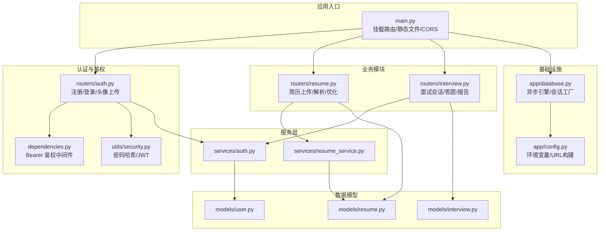
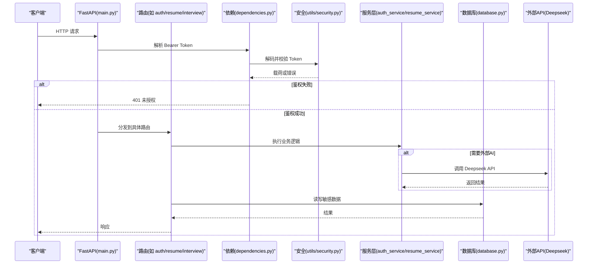
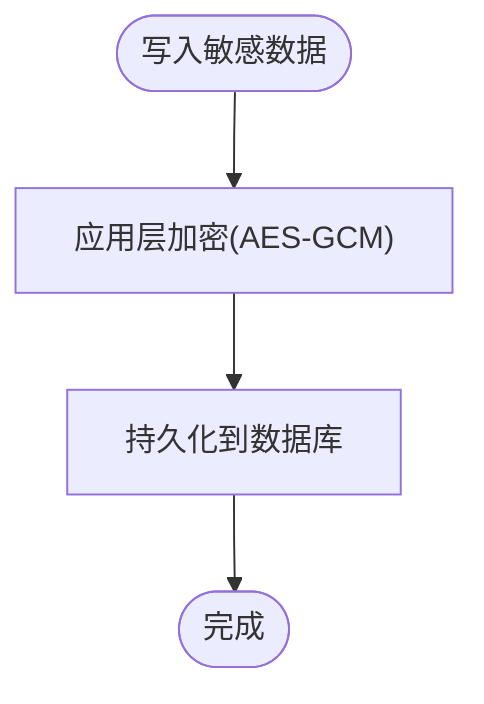
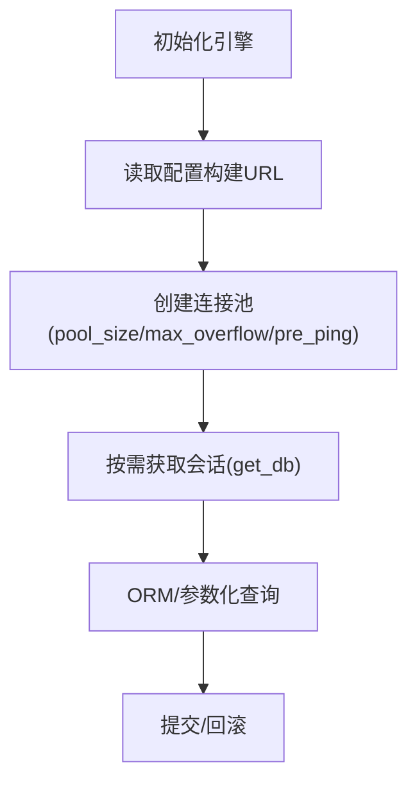
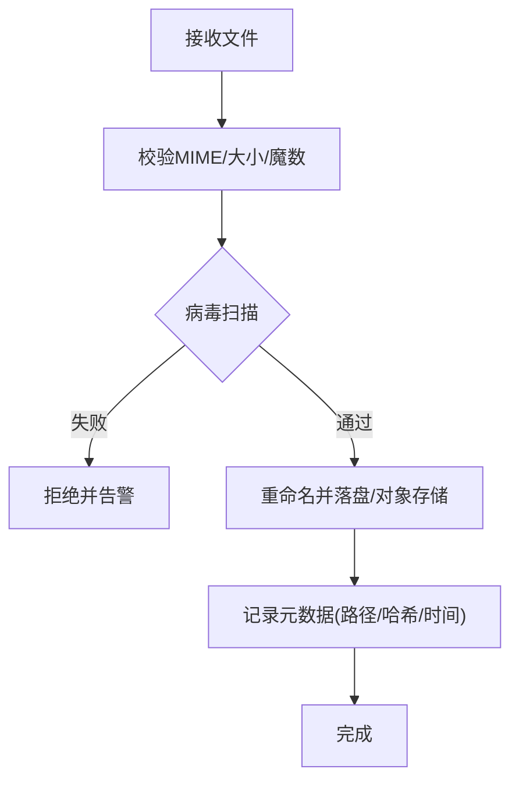
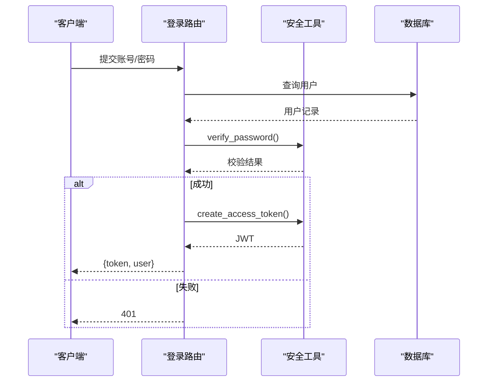
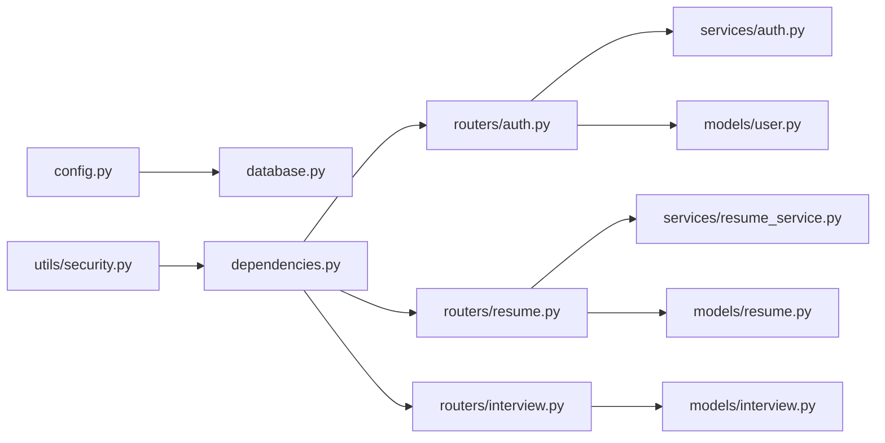

# 数据安全保护

<cite>
**本文引用的文件**   
- [config.py](file://backEnd/app/config.py)
- [database.py](file://backEnd/app/database.py)
- [security.py](file://backEnd/app/utils/security.py)
- [dependencies.py](file://backEnd/app/dependencies.py)
- [main.py](file://backEnd/app/main.py)
- [auth.py](file://backEnd/app/routers/auth.py)
- [resume.py](file://backEnd/app/routers/resume.py)
- [interview.py](file://backEnd/app/routers/interview.py)
- [user.py](file://backEnd/app/models/user.py)
- [resume.py](file://backEnd/app/models/resume.py)
- [interview.py](file://backEnd/app/models/interview.py)
- [auth_service.py](file://backEnd/app/services/auth.py)
- [resume_service.py](file://backEnd/app/services/resume_service.py)
</cite>

## 目录
1. [引言](#引言)
2. [项目结构](#项目结构)
3. [核心组件](#核心组件)
4. [架构总览](#架构总览)
5. [详细组件分析](#详细组件分析)
6. [依赖关系分析](#依赖关系分析)
7. [性能与安全权衡](#性能与安全权衡)
8. [故障排查指南](#故障排查指南)
9. [结论](#结论)
10. [附录：安全配置清单与最佳实践](#附录安全配置清单与最佳实践)

## 引言
本文件面向 HR XF 系统的数据安全保护，聚焦以下方面：
- 敏感数据加密存储方案（用户个人信息、简历文件、面试记录等）
- 数据库连接安全配置（SSL、连接池、SQL注入防护）
- 文件上传下载的安全验证机制（格式检查、大小限制、病毒扫描建议）
- 环境变量与密钥管理（配置加密、部署安全）
- 数据备份恢复、审计日志、数据脱敏等最佳实践

说明：当前代码库已实现部分安全能力（如密码哈希、JWT鉴权、CORS、基础上传校验），但尚未启用数据库 SSL、未实现文件病毒扫描、未实现字段级加密与审计日志。本文在“现状”基础上给出改进建议与落地路径。

## 项目结构
后端采用 FastAPI + SQLAlchemy 异步驱动，按路由/服务/模型分层组织；敏感数据主要涉及用户信息、简历文本与文件、面试会话与答案。

图示来源
- [main.py:44-73](file://backEnd/app/main.py#L44-L73)
- [auth.py:25-31](file://backEnd/app/routers/auth.py#L25-L31)
- [dependencies.py:10-41](file://backEnd/app/dependencies.py#L10-L41)
- [security.py:10-48](file://backEnd/app/utils/security.py#L10-L48)
- [resume.py:19-22](file://backEnd/app/routers/resume.py#L19-L22)
- [interview.py:26-26](file://backEnd/app/routers/interview.py#L26-L26)
- [auth_service.py:1-10](file://backEnd/app/services/auth.py#L1-L10)
- [resume_service.py:1-13](file://backEnd/app/services/resume_service.py#L1-L13)
- [user.py:10-45](file://backEnd/app/models/user.py#L10-L45)
- [resume.py:11-67](file://backEnd/app/models/resume.py#L11-L67)
- [interview.py:19-114](file://backEnd/app/models/interview.py#L19-L114)
- [config.py:7-71](file://backEnd/app/config.py#L7-L71)
- [database.py:27-43](file://backEnd/app/database.py#L27-L43)

章节来源
- [main.py:44-73](file://backEnd/app/main.py#L44-L73)
- [config.py:7-71](file://backEnd/app/config.py#L7-L71)
- [database.py:27-43](file://backEnd/app/database.py#L27-L43)

## 核心组件
- 配置与环境变量
  - 使用 pydantic-settings 从 .env 加载配置，提供数据库 URL、JWT 密钥、CORS、外部 API Key 等。
  - 注意：默认包含开发用 JWT 密钥与 MinIO 占位值，生产需替换为强随机值并严格隔离。
- 数据库连接与会话
  - 基于 SQLAlchemy 异步引擎创建连接池，设置 pool_pre_ping 保持连接健康。
  - 通过 get_db 依赖注入 AsyncSession，统一提交/回滚。
- 认证与鉴权
  - 密码使用 bcrypt 哈希；JWT 签发/解码由工具函数完成；HTTP Bearer 依赖校验 Token 并获取当前用户。
- 文件上传
  - 头像上传：白名单 MIME 类型、大小限制、旧文件清理。
  - 简历上传：保存原始文件与文本，可选 AI 结构化提取与措辞优化。
- 业务数据
  - 用户表含个人敏感字段（电话、性别、生日等）。
  - 简历表含原始文本、结构化结果、优化缓存等 JSON 字段。
  - 面试会话与答案表含问答内容、评分、反馈等。

章节来源
- [config.py:7-71](file://backEnd/app/config.py#L7-L71)
- [database.py:27-43](file://backEnd/app/database.py#L27-L43)
- [security.py:10-48](file://backEnd/app/utils/security.py#L10-L48)
- [dependencies.py:10-41](file://backEnd/app/dependencies.py#L10-L41)
- [auth.py:27-31](file://backEnd/app/routers/auth.py#L27-L31)
- [resume.py:47-77](file://backEnd/app/routers/resume.py#L47-L77)
- [user.py:10-45](file://backEnd/app/models/user.py#L10-L45)
- [resume.py:11-67](file://backEnd/app/models/resume.py#L11-L67)
- [interview.py:19-114](file://backEnd/app/models/interview.py#L19-L114)

## 架构总览
下图展示请求进入后，鉴权、业务处理、持久化与外部调用的整体流程，以及关键安全控制点。

图示来源
- [main.py:44-73](file://backEnd/app/main.py#L44-L73)
- [dependencies.py:10-41](file://backEnd/app/dependencies.py#L10-L41)
- [security.py:26-48](file://backEnd/app/utils/security.py#L26-L48)
- [auth.py:69-80](file://backEnd/app/routers/auth.py#L69-L80)
- [resume.py:47-77](file://backEnd/app/routers/resume.py#L47-L77)
- [interview.py:36-58](file://backEnd/app/routers/interview.py#L36-L58)
- [auth_service.py:85-96](file://backEnd/app/services/auth.py#L85-L96)
- [resume_service.py:141-171](file://backEnd/app/services/resume_service.py#L141-L171)
- [database.py:27-43](file://backEnd/app/database.py#L27-L43)

## 详细组件分析

### 1) 敏感数据加密存储方案
现状
- 用户密码：使用 bcrypt 哈希存储，避免明文泄露风险。
- 其他敏感字段（电话、性别、生日、简历文本、面试答案等）：当前以明文形式存储在数据库中。
- 文件（头像、简历）：保存在本地磁盘 uploads 目录，仅相对路径存库。

改进建议
- 字段级加密
  - 对高敏感字段（如 phone、bio、raw_text、answer_text、feedback 等）采用应用层加密（如 AES-GCM），并在入库前加密、出库后解密。
  - 密钥管理：使用独立密钥管理服务（KMS/HSM），定期轮换；应用侧只持有短期密钥或信封密钥。
- 文件系统安全
  - 将文件迁移至对象存储（如 MinIO/S3），开启服务端加密（SSE-KMS），并限制访问策略。
  - 若保留本地存储，应限制目录权限、禁用执行权限、禁止直接列出目录。
- 面试记录与简历文本
  - 除字段加密外，可对 JSON 字段进行分片加密或单独列存储，便于细粒度访问控制与脱敏。

章节来源
- [security.py:10-24](file://backEnd/app/utils/security.py#L10-L24)
- [user.py:27-35](file://backEnd/app/models/user.py#L27-L35)
- [resume.py:36-55](file://backEnd/app/models/resume.py#L36-L55)
- [interview.py:104-111](file://backEnd/app/models/interview.py#L104-L111)

### 2) 数据库连接安全配置
现状
- 连接字符串由配置拼接，未启用 SSL/TLS。
- 连接池参数：pool_size=10, max_overflow=20, pool_pre_ping=True。
- SQL 查询使用 SQLAlchemy ORM/Select，天然避免字符串拼接导致的 SQL 注入。

改进建议
- 启用 SSL
  - 在数据库 URL 中附加 ssl_ca、ssl_cert、ssl_key 等参数，强制 TLS 传输加密。
  - 证书管理与轮换纳入运维流程。
- 连接池安全
  - 最小化池大小，结合压测调整；启用连接超时与空闲回收。
  - 使用只读副本用于报表/导出类查询，降低主库压力与泄露面。
- SQL 注入防护
  - 继续使用 ORM/参数化查询，禁止拼接 SQL。
  - 对外部输入做严格白名单校验（如排序字段、分页参数）。

图示来源
- [config.py:47-61](file://backEnd/app/config.py#L47-L61)
- [database.py:31-43](file://backEnd/app/database.py#L31-L43)
- [database.py:50-58](file://backEnd/app/database.py#L50-L58)

章节来源
- [config.py:47-61](file://backEnd/app/config.py#L47-L61)
- [database.py:31-43](file://backEnd/app/database.py#L31-L43)
- [database.py:50-58](file://backEnd/app/database.py#L50-L58)

### 3) 文件上传下载的安全验证机制
现状
- 头像上传：MIME 白名单、大小限制、旧文件覆盖删除。
- 简历上传：保存原始文件与文本，支持 PDF 文本提取；未做文件大小限制与病毒扫描。
- 静态文件：uploads 目录通过 StaticFiles 暴露，存在潜在越权访问风险。

改进建议
- 通用上传校验
  - 增加文件大小上限（如 10MB）、扩展名白名单、MIME 二次校验（魔数检测）。
  - 引入病毒扫描（ClamAV 或云厂商扫描服务），扫描失败拒绝上传。
  - 重命名文件（UUID+时间戳），禁止使用用户可控文件名。
- 访问控制
  - 不在 Web 服务器直接暴露可写目录；改为受控接口下载，校验用户权限与资源归属。
  - 对静态目录设置不可执行、禁止索引。
- 下载安全
  - 校验目标文件路径，防止路径穿越；输出时设置合适的 Content-Type 与 Content-Disposition。

章节来源
- [auth.py:27-31](file://backEnd/app/routers/auth.py#L27-L31)
- [auth.py:182-216](file://backEnd/app/routers/auth.py#L182-L216)
- [resume.py:47-77](file://backEnd/app/routers/resume.py#L47-L77)
- [main.py:70-73](file://backEnd/app/main.py#L70-L73)

### 4) 环境变量与密钥管理
现状
- 使用 .env 文件加载配置，包含数据库凭据、JWT 密钥、外部 API Key 等。
- 默认包含开发用弱密钥与示例值。

改进建议
- 密钥管理
  - 使用 KMS/Secrets Manager 注入运行时密钥，避免 .env 入仓。
  - 对 .env 模板进行脱敏，禁止提交真实密钥。
- 配置加密
  - 对配置文件进行加密存储，启动时解密；或使用容器编排平台的 Secret 机制。
- 部署安全
  - 最小权限原则：应用账户仅拥有必要数据库与对象存储权限。
  - 网络隔离：数据库与对象存储置于私有子网，仅应用可访问。

章节来源
- [config.py:7-38](file://backEnd/app/config.py#L7-L38)

### 5) 认证与鉴权安全
现状
- 密码使用 bcrypt 哈希；JWT 使用 HS256，过期时间可配。
- 依赖注入中校验 Token 并获取当前用户，未激活用户拒绝访问。

改进建议
- 算法与密钥
  - 生产环境使用强随机 secret_key，考虑切换为 RS256/ES256 以支持多实例无状态校验。
- 令牌安全
  - 缩短过期时间，配合刷新令牌机制；记录令牌颁发与撤销日志。
- 访问控制
  - 引入 RBAC/ABAC，细化到资源级（如仅允许访问自己的简历/面试记录）。

图示来源
- [auth.py:69-80](file://backEnd/app/routers/auth.py#L69-L80)
- [auth_service.py:85-96](file://backEnd/app/services/auth.py#L85-L96)
- [security.py:18-48](file://backEnd/app/utils/security.py#L18-L48)

章节来源
- [security.py:18-48](file://backEnd/app/utils/security.py#L18-L48)
- [dependencies.py:13-41](file://backEnd/app/dependencies.py#L13-L41)
- [auth_service.py:85-96](file://backEnd/app/services/auth.py#L85-L96)

### 6) 数据备份恢复、审计日志、数据脱敏
现状
- 未发现自动备份脚本与审计日志实现。
- 未实现数据脱敏（导出/日志/调试场景）。

改进建议
- 备份恢复
  - 定时全量+增量备份，异地容灾；演练恢复流程，确保 RPO/RTO 达标。
- 审计日志
  - 记录关键操作（登录、修改资料、上传/下载、删除账号、管理员操作），包含时间、主体、动作、IP、结果。
  - 日志集中采集与防篡改存储。
- 数据脱敏
  - 对外展示与日志输出时对敏感字段脱敏（掩码/哈希/泛化）。
  - 导出功能增加审批与水印。

[本节为通用最佳实践，不直接分析具体文件]

## 依赖关系分析
- 低耦合分层：路由层仅负责参数绑定与响应构造，业务逻辑下沉至服务层，数据访问通过 ORM。
- 外部依赖：Deepseek API 调用集中在服务层，便于统一限流、重试与监控。
- 潜在风险点：
  - 静态文件直出可能带来越权访问。
  - 未对上传文件进行病毒扫描与深度校验。
  - 未启用数据库 SSL，传输层未加密。

图示来源
- [config.py:7-71](file://backEnd/app/config.py#L7-L71)
- [database.py:27-43](file://backEnd/app/database.py#L27-L43)
- [security.py:10-48](file://backEnd/app/utils/security.py#L10-L48)
- [dependencies.py:10-41](file://backEnd/app/dependencies.py#L10-L41)
- [auth.py:25-31](file://backEnd/app/routers/auth.py#L25-L31)
- [resume.py:19-22](file://backEnd/app/routers/resume.py#L19-L22)
- [interview.py:26-26](file://backEnd/app/routers/interview.py#L26-L26)
- [auth_service.py:1-10](file://backEnd/app/services/auth.py#L1-L10)
- [resume_service.py:1-13](file://backEnd/app/services/resume_service.py#L1-L13)
- [user.py:10-45](file://backEnd/app/models/user.py#L10-L45)
- [resume.py:11-67](file://backEnd/app/models/resume.py#L11-L67)
- [interview.py:19-114](file://backEnd/app/models/interview.py#L19-L114)

章节来源
- [main.py:60-68](file://backEnd/app/main.py#L60-L68)
- [resume_service.py:141-171](file://backEnd/app/services/resume_service.py#L141-L171)

## 性能与安全权衡
- 连接池：增大池大小提升吞吐，但会增加内存占用与数据库负载；建议根据并发与数据库容量评估。
- 预检与扫描：上传前进行轻量校验（MIME/大小/魔数），再触发病毒扫描，平衡用户体验与安全性。
- 加密开销：字段级加密增加 CPU 消耗，可通过硬件加速或批量处理缓解；冷热数据分离可降低热点压力。

[本节为通用指导，不直接分析具体文件]

## 故障排查指南
- 认证失败
  - 检查 JWT 密钥是否一致、Token 是否过期、用户是否被禁用。
- 上传失败
  - 确认 MIME 白名单与大小限制；查看上传目录权限与磁盘空间。
- 数据库连接异常
  - 核对 .env 中的主机、端口、用户名、密码；检查防火墙与 SSL 证书配置。
- 外部 API 调用失败
  - 检查 Deepseek API Key 与网络连通性；关注超时与重试策略。

章节来源
- [dependencies.py:13-41](file://backEnd/app/dependencies.py#L13-L41)
- [auth.py:182-216](file://backEnd/app/routers/auth.py#L182-L216)
- [config.py:47-61](file://backEnd/app/config.py#L47-L61)
- [resume_service.py:141-171](file://backEnd/app/services/resume_service.py#L141-L171)

## 结论
HR XF 已在密码哈希、JWT 鉴权、CORS 与基础上传校验方面具备良好基础。为达到企业级数据安全要求，建议优先补齐：
- 数据库 SSL 与连接池加固
- 字段级加密与对象存储加密
- 上传病毒扫描与下载权限控制
- 密钥与配置安全管理
- 备份恢复、审计日志与数据脱敏

以上措施将显著提升系统在机密性、完整性与可用性方面的安全保障水平。

## 附录：安全配置清单与最佳实践
- 配置项
  - 数据库：host/port/user/password/name、SSL 参数、连接池大小、超时
  - 认证：JWT secret_key、algorithm、过期时间
  - 外部服务：Deepseek API Key/URL/Model、MinIO 端点与凭据
- 部署建议
  - 使用容器编排平台 Secret 注入敏感配置
  - 最小权限原则与网络隔离
  - 定期轮换密钥与证书
- 监控与告警
  - 认证失败率、上传失败率、数据库连接池利用率、外部 API 延迟与错误率

[本节为通用指导，不直接分析具体文件]