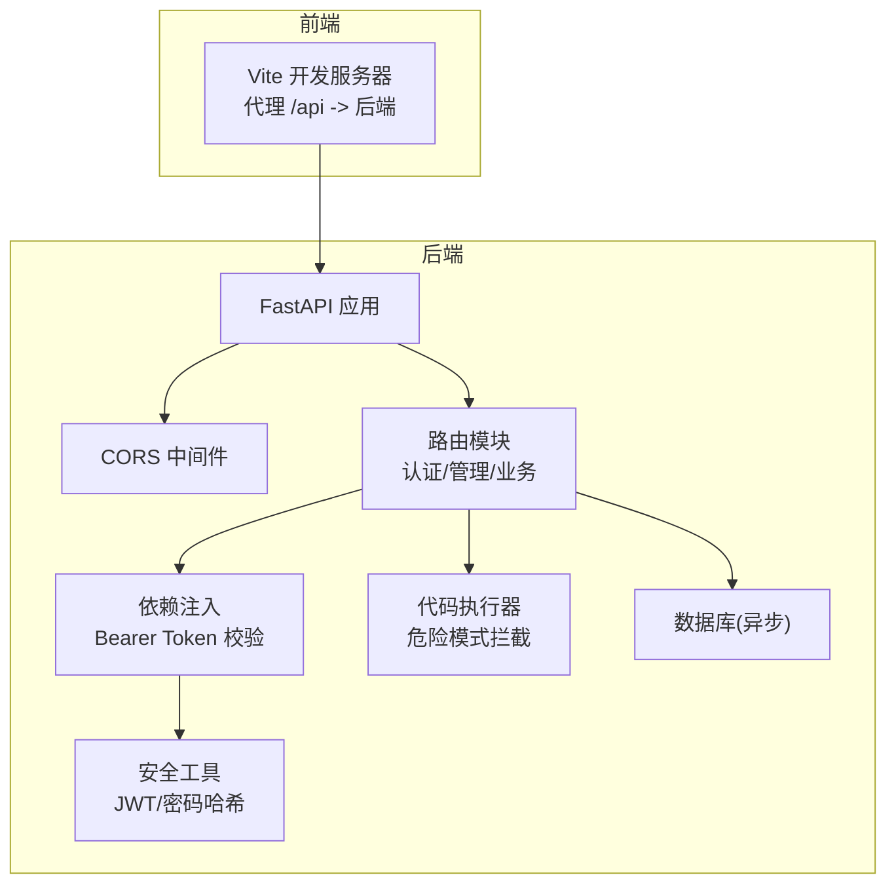
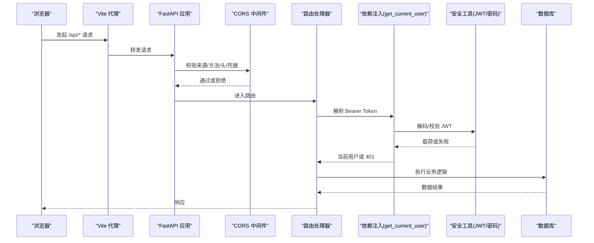
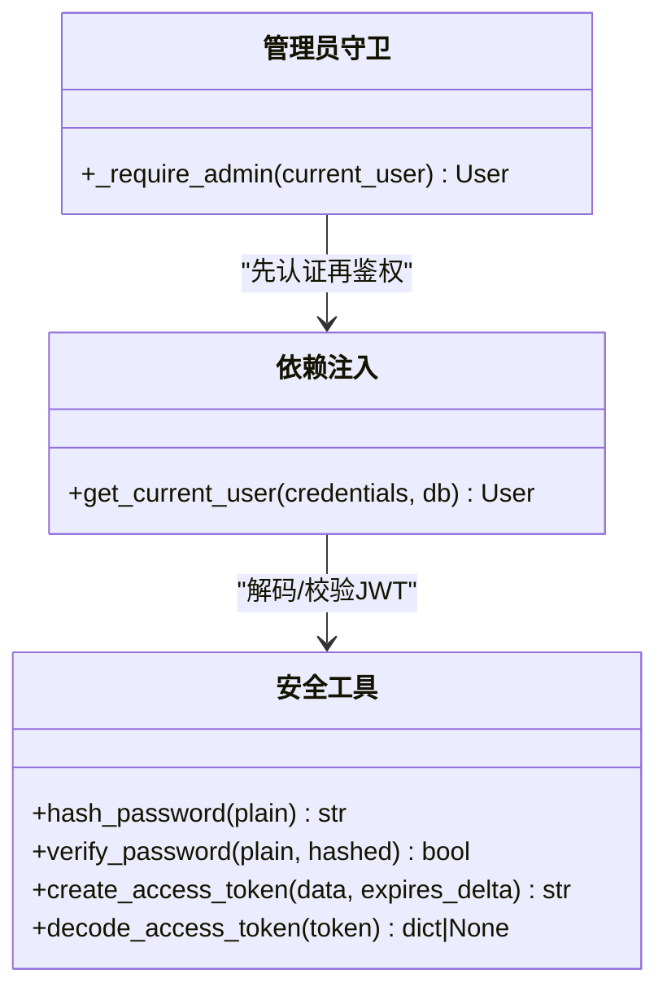
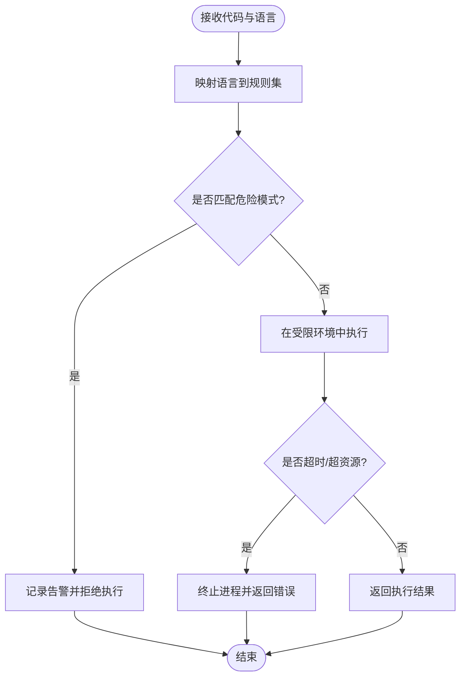
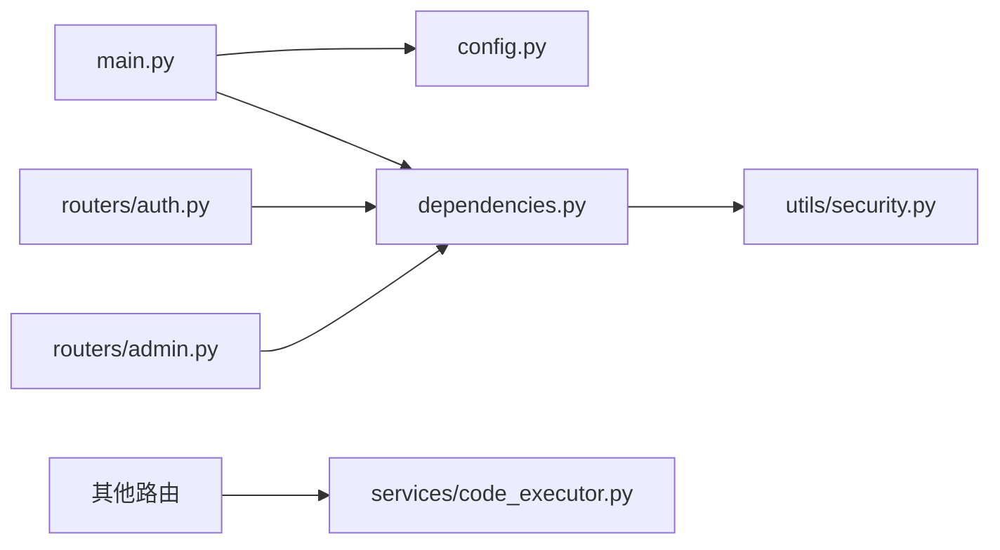

# 网络安全防护

<cite>
**本文引用的文件**   
- [backEnd/app/main.py](file://backEnd/app/main.py)
- [backEnd/app/config.py](file://backEnd/app/config.py)
- [backEnd/app/dependencies.py](file://backEnd/app/dependencies.py)
- [backEnd/app/utils/security.py](file://backEnd/app/utils/security.py)
- [backEnd/app/routers/auth.py](file://backEnd/app/routers/auth.py)
- [backEnd/app/routers/admin.py](file://backEnd/app/routers/admin.py)
- [backEnd/app/services/code_executor.py](file://backEnd/app/services/code_executor.py)
- [frontEnd/vite.config.ts](file://frontEnd/vite.config.ts)
</cite>

## 目录
1. [简介](#简介)
2. [项目结构](#项目结构)
3. [核心组件](#核心组件)
4. [架构总览](#架构总览)
5. [详细组件分析](#详细组件分析)
6. [依赖关系分析](#依赖关系分析)
7. [性能与安全权衡](#性能与安全权衡)
8. [故障排查指南](#故障排查指南)
9. [结论](#结论)
10. [附录](#附录)

## 简介
本文件面向HR XF系统的网络安全防护，聚焦以下方面：
- CORS跨域资源共享配置与安全策略（域名白名单、方法限制、凭证传递）
- CSRF跨站请求伪造防护（令牌验证、同源检查等）
- XSS跨站脚本攻击防护（输入输出编码、CSP建议）
- HTTPS强制跳转与安全头配置
- 请求频率限制与高级安全特性（API限流、IP白名单、恶意请求检测）
- 网络安全监控与威胁检测实施建议

说明：本文基于仓库现有实现进行梳理，并给出可落地的增强建议。对于尚未在代码中实现的措施，以“建议”形式呈现，便于后续演进。

## 项目结构
后端采用FastAPI应用，集中式中间件注册、路由模块化、依赖注入鉴权；前端使用Vite开发服务器代理到后端。

图示来源
- [backEnd/app/main.py:44-58](file://backEnd/app/main.py#L44-L58)
- [backEnd/app/dependencies.py:10-40](file://backEnd/app/dependencies.py#L10-L40)
- [backEnd/app/utils/security.py:18-47](file://backEnd/app/utils/security.py#L18-L47)
- [backEnd/app/services/code_executor.py:144-167](file://backEnd/app/services/code_executor.py#L144-L167)
- [frontEnd/vite.config.ts:13-20](file://frontEnd/vite.config.ts#L13-L20)

章节来源
- [backEnd/app/main.py:44-58](file://backEnd/app/main.py#L44-L58)
- [frontEnd/vite.config.ts:13-20](file://frontEnd/vite.config.ts#L13-L20)

## 核心组件
- CORS 中间件：通过配置项加载允许的来源列表，启用凭据传递，方法/头默认放行。
- 认证依赖：基于HTTP Bearer的Token解析与用户有效性校验。
- 安全工具：JWT创建/解码、密码哈希/校验。
- 管理员守卫：对管理端接口进行简易角色校验。
- 代码执行器：针对多语言代码执行的安全黑名单匹配。
- 前端代理：开发期将/api请求转发至后端，避免本地跨域问题。

章节来源
- [backEnd/app/main.py:51-58](file://backEnd/app/main.py#L51-L58)
- [backEnd/app/config.py:31-32](file://backEnd/app/config.py#L31-L32)
- [backEnd/app/dependencies.py:10-40](file://backEnd/app/dependencies.py#L10-L40)
- [backEnd/app/utils/security.py:18-47](file://backEnd/app/utils/security.py#L18-L47)
- [backEnd/app/routers/admin.py:24-34](file://backEnd/app/routers/admin.py#L24-L34)
- [backEnd/app/services/code_executor.py:144-167](file://backEnd/app/services/code_executor.py#L144-L167)
- [frontEnd/vite.config.ts:13-20](file://frontEnd/vite.config.ts#L13-L20)

## 架构总览
下图展示从浏览器到后端的请求路径与安全控制点：CORS校验、认证依赖、权限守卫、输入校验与错误处理。

图示来源
- [backEnd/app/main.py:51-58](file://backEnd/app/main.py#L51-L58)
- [backEnd/app/dependencies.py:13-40](file://backEnd/app/dependencies.py#L13-L40)
- [backEnd/app/utils/security.py:26-47](file://backEnd/app/utils/security.py#L26-L47)
- [frontEnd/vite.config.ts:13-20](file://frontEnd/vite.config.ts#L13-L20)

## 详细组件分析

### CORS 跨域资源共享
- 现状
  - 来源白名单：从配置读取逗号分隔字符串，转换为列表作为 allow_origins。
  - 凭据：allow_credentials=True，允许携带Cookie/授权头等凭据。
  - 方法与头：allow_methods=["*"], allow_headers=["*"]，未做细粒度限制。
- 风险与建议
  - 建议收紧 allow_methods 为仅需要的HTTP方法集合（如GET,POST,PUT,DELETE）。
  - 建议细化 allow_headers，仅暴露必要头部，减少信息泄露面。
  - 生产环境应严格限定 cors_origins，禁止通配符来源。
  - 若需支持子域名，建议使用精确域名列表而非通配前缀。

章节来源
- [backEnd/app/main.py:51-58](file://backEnd/app/main.py#L51-L58)
- [backEnd/app/config.py:31-32](file://backEnd/app/config.py#L31-L32)
- [backEnd/app/config.py:63-65](file://backEnd/app/config.py#L63-L65)

### 认证与授权（JWT + 依赖注入）
- 现状
  - 使用HTTP Bearer方案，依赖 get_current_user 解析并校验Token，再查询用户状态。
  - 密码采用bcrypt哈希，提供创建/校验能力。
  - 管理端接口通过 _require_admin 进行简易角色判断（邮箱/用户名包含特定关键字）。
- 风险与建议
  - 建议引入CSRF保护（见下节），并对敏感写操作增加二次确认或短期令牌。
  - 建议将管理员判定改为显式角色字段与最小权限原则。
  - 建议对Token设置较短过期时间并结合刷新机制。

图示来源
- [backEnd/app/dependencies.py:13-40](file://backEnd/app/dependencies.py#L13-L40)
- [backEnd/app/utils/security.py:18-47](file://backEnd/app/utils/security.py#L18-L47)
- [backEnd/app/routers/admin.py:24-34](file://backEnd/app/routers/admin.py#L24-L34)

章节来源
- [backEnd/app/dependencies.py:13-40](file://backEnd/app/dependencies.py#L13-L40)
- [backEnd/app/utils/security.py:18-47](file://backEnd/app/utils/security.py#L18-L47)
- [backEnd/app/routers/admin.py:24-34](file://backEnd/app/routers/admin.py#L24-L34)

### CSRF 跨站请求伪造防护
- 现状
  - 未发现显式的CSRF令牌校验或同源检查中间件。
  - 登录/注册接口返回访问令牌，客户端需在后续请求中携带Authorization头。
- 建议方案
  - 双提交Cookie方案：服务端生成随机CSRF令牌写入HttpOnly Cookie，同时要求表单/JS在请求体或自定义头中携带相同值，服务端校验一致。
  - SameSite Cookie：对会话Cookie设置SameSite=Lax或Strict，降低跨站携带风险。
  - 敏感操作二次校验：修改密码、删除账号等需要额外一次性令牌或验证码。
  - 同源检查：结合Origin/Referer校验，拒绝可疑来源。

章节来源
- [backEnd/app/routers/auth.py:69-86](file://backEnd/app/routers/auth.py#L69-L86)

### XSS 跨站脚本攻击防护
- 现状
  - 未发现全局XSS过滤或CSP响应头设置。
  - 上传头像时做了类型与大小校验，但内容是否为恶意脚本未在代码层体现。
- 建议方案
  - 输出编码：对所有用户可控数据进行HTML实体编码后再渲染。
  - CSP策略：设置Content-Security-Policy，限制脚本来源、内联脚本、eval等高风险行为。
  - 输入校验：服务端对富文本内容进行白名单过滤或沙箱渲染。
  - 静态资源与字体：仅允许可信CDN与内嵌资源。

章节来源
- [backEnd/app/routers/auth.py:182-216](file://backEnd/app/routers/auth.py#L182-L216)

### HTTPS 强制跳转与安全头
- 现状
  - 未发现全局HTTPS跳转或安全响应头中间件。
- 建议方案
  - 反向代理层（Nginx/Traefik）统一强制HTTPS，并设置HSTS。
  - 添加安全响应头：X-Content-Type-Options: nosniff、X-Frame-Options: DENY/SAMEORIGIN、Referrer-Policy、Permissions-Policy等。
  - 禁用不安全协议与弱加密套件。

章节来源
- [backEnd/app/main.py:76-84](file://backEnd/app/main.py#L76-84)

### 请求频率限制与高级安全特性
- 现状
  - 未发现全局限流中间件、IP白名单或恶意请求检测。
- 建议方案
  - API限流：按IP/用户维度限制单位时间请求数，超限返回429。
  - IP白名单：对管理端接口限制来源IP段。
  - 恶意请求检测：基于规则+统计识别异常模式（如高频探测、异常UA、畸形参数）。
  - 审计日志：记录关键操作与异常事件，便于溯源。

章节来源
- [backEnd/app/routers/admin.py:24-34](file://backEnd/app/routers/admin.py#L24-L34)

### 代码执行器安全策略
- 现状
  - 针对多语言代码执行，维护了危险关键词与模块黑名单，并在执行前进行正则匹配拦截。
  - 匹配命中时记录警告并返回拒绝原因。
- 风险与建议
  - 建议进一步隔离执行环境（容器/沙箱），限制系统调用、网络访问与文件系统范围。
  - 建议增加超时、内存/CPU配额与资源上限。
  - 建议引入白名单API库，屏蔽危险内置对象与方法。

图示来源
- [backEnd/app/services/code_executor.py:144-167](file://backEnd/app/services/code_executor.py#L144-L167)

章节来源
- [backEnd/app/services/code_executor.py:144-167](file://backEnd/app/services/code_executor.py#L144-L167)

### 前端代理与跨域
- 现状
  - 开发期通过Vite代理将/api转发到后端，避免本地跨域问题。
- 建议
  - 生产环境由反向代理统一处理跨域与安全头，前端不再依赖开发代理。

章节来源
- [frontEnd/vite.config.ts:13-20](file://frontEnd/vite.config.ts#L13-L20)

## 依赖关系分析
- 组件耦合
  - main.py 负责中间件与路由挂载，依赖 config.py 提供的CORS配置。
  - dependencies.py 依赖 utils/security.py 完成JWT解码。
  - routers 依赖 dependencies.py 进行认证与鉴权。
  - code_executor.py 独立于路由，被业务路由按需调用。
- 外部依赖
  - FastAPI CORSMiddleware、Pydantic Settings、JWT库、密码哈希库。

图示来源
- [backEnd/app/main.py:51-68](file://backEnd/app/main.py#L51-L68)
- [backEnd/app/dependencies.py:1-40](file://backEnd/app/dependencies.py#L1-40)
- [backEnd/app/utils/security.py:1-47](file://backEnd/app/utils/security.py#L1-47)
- [backEnd/app/routers/auth.py:1-217](file://backEnd/app/routers/auth.py#L1-217)
- [backEnd/app/routers/admin.py:1-198](file://backEnd/app/routers/admin.py#L1-198)
- [backEnd/app/services/code_executor.py:1-167](file://backEnd/app/services/code_executor.py#L1-167)

章节来源
- [backEnd/app/main.py:51-68](file://backEnd/app/main.py#L51-L68)
- [backEnd/app/dependencies.py:1-40](file://backEnd/app/dependencies.py#L1-40)
- [backEnd/app/utils/security.py:1-47](file://backEnd/app/utils/security.py#L1-47)
- [backEnd/app/routers/auth.py:1-217](file://backEnd/app/routers/auth.py#L1-217)
- [backEnd/app/routers/admin.py:1-198](file://backEnd/app/routers/admin.py#L1-198)
- [backEnd/app/services/code_executor.py:1-167](file://backEnd/app/services/code_executor.py#L1-167)

## 性能与安全权衡
- CORS放宽会提升可用性但扩大攻击面，建议生产环境收敛。
- 严格的CSRF与CSP可能影响第三方集成，需评估兼容性。
- 代码执行器的黑名单匹配开销较低，但沙箱化会带来额外资源成本，需平衡。
- 限流与审计会增加I/O与存储压力，建议分层部署与采样策略。

## 故障排查指南
- 401 未授权
  - 检查Authorization头格式是否正确（Bearer <token>）。
  - 确认JWT密钥与算法配置一致，且Token未过期。
- 403 无管理员权限
  - 确认当前用户是否符合管理员判定条件。
- 422 请求校验失败
  - 查看错误详情，注意二进制字段可能被移除以避免编码错误。
- 代码执行被拒
  - 检查是否命中危险模式，调整代码或更新规则。

章节来源
- [backEnd/app/dependencies.py:17-40](file://backEnd/app/dependencies.py#L17-L40)
- [backEnd/app/routers/admin.py:24-34](file://backEnd/app/routers/admin.py#L24-L34)
- [backEnd/app/main.py:76-84](file://backEnd/app/main.py#L76-84)
- [backEnd/app/services/code_executor.py:154-167](file://backEnd/app/services/code_executor.py#L154-L167)

## 结论
当前系统在CORS、认证与鉴权、代码执行安全等方面已有基础实现，但在CSRF、XSS、HTTPS与安全头、限流与审计等层面仍有较大提升空间。建议优先补齐CSRF与CSP，完善HTTPS与安全头，逐步引入限流与审计，并将管理员权限模型升级为显式角色与最小权限原则。

## 附录
- 配置项参考
  - CORS来源：cors_origins（逗号分隔字符串）
  - JWT：secret_key、algorithm、access_token_expire_minutes
  - 编译器路径：python_bin/gcc_bin/gpp_bin/java_bin/javac_bin/node_bin（可选）

章节来源
- [backEnd/app/config.py:20-45](file://backEnd/app/config.py#L20-L45)
- [backEnd/app/config.py:63-65](file://backEnd/app/config.py#L63-L65)