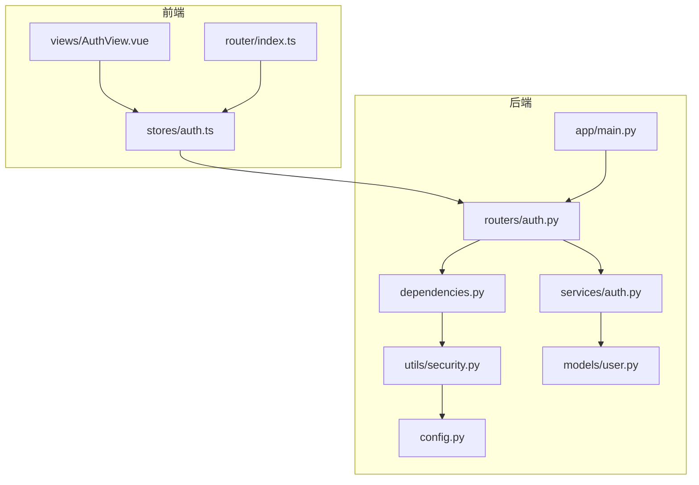
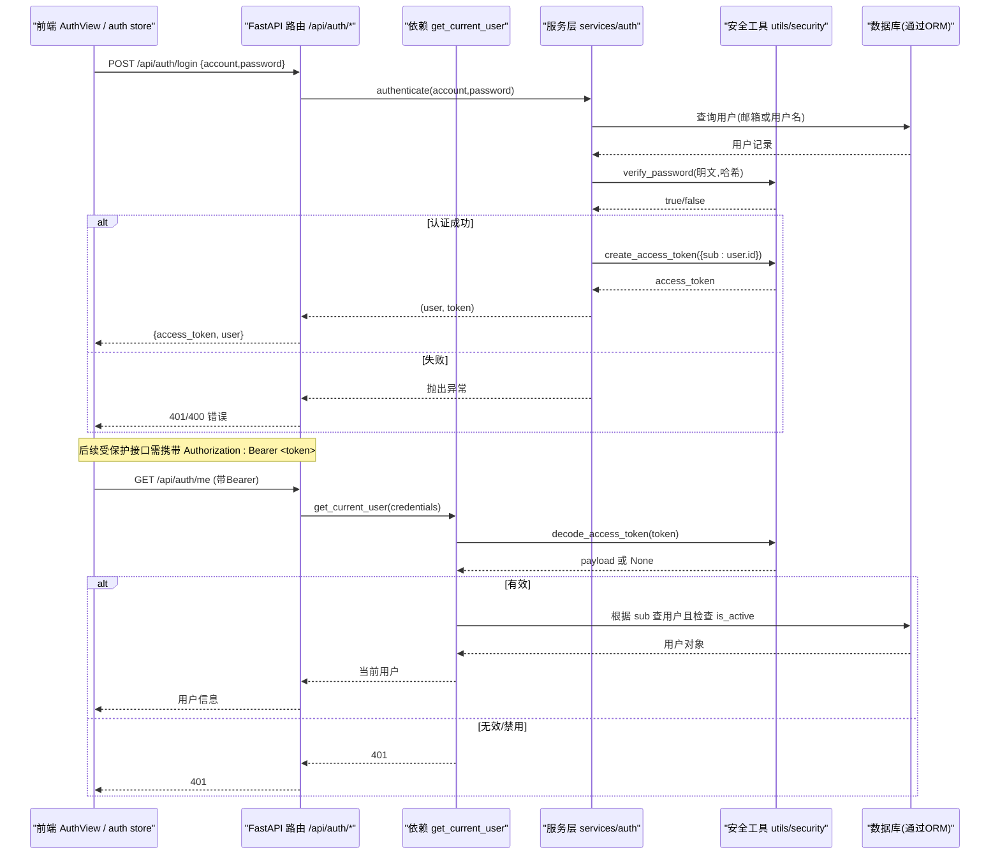
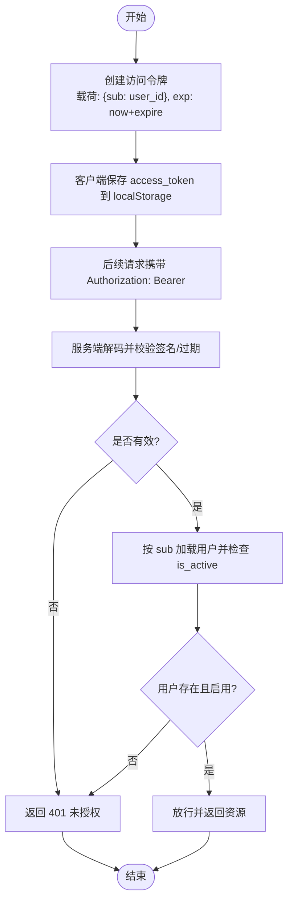
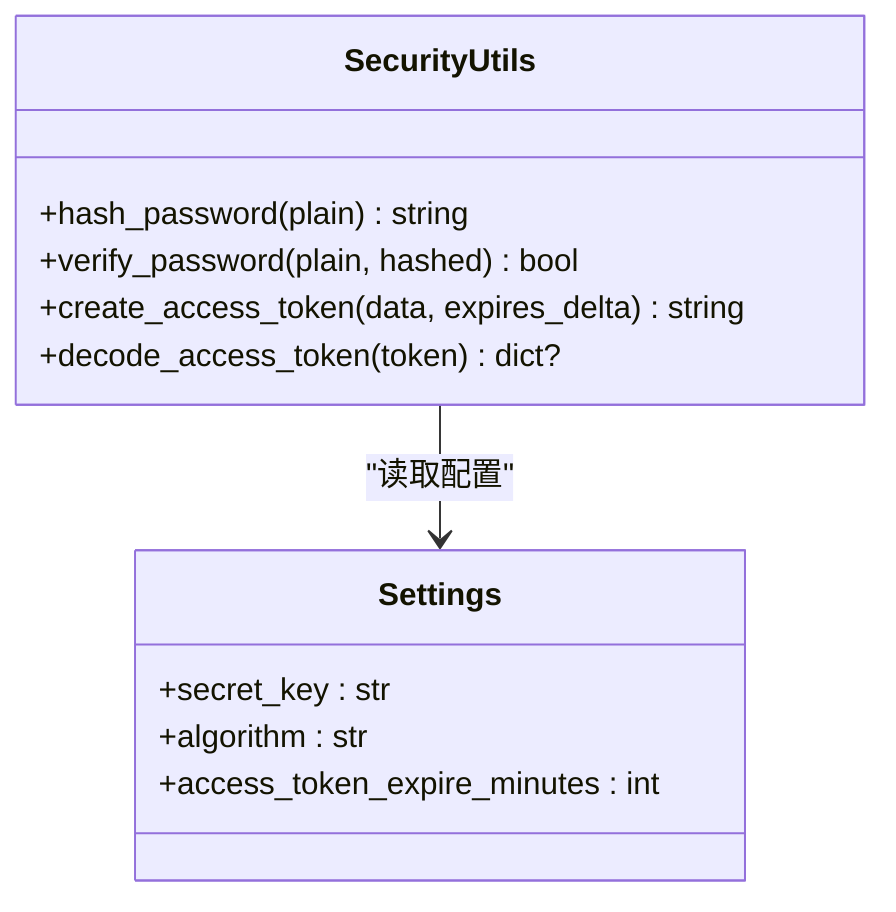
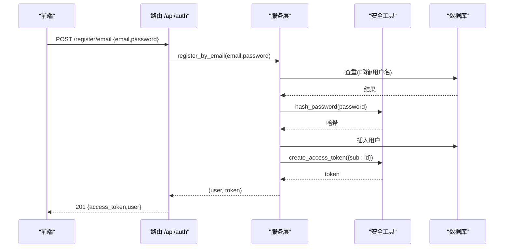
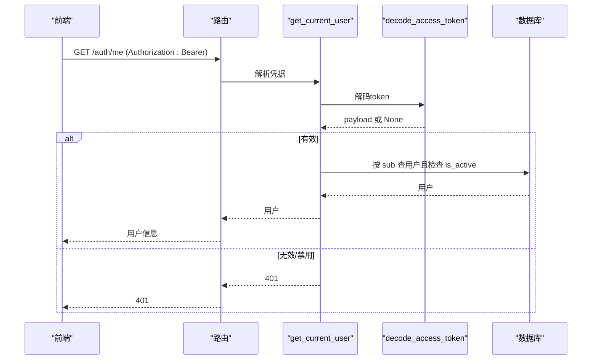
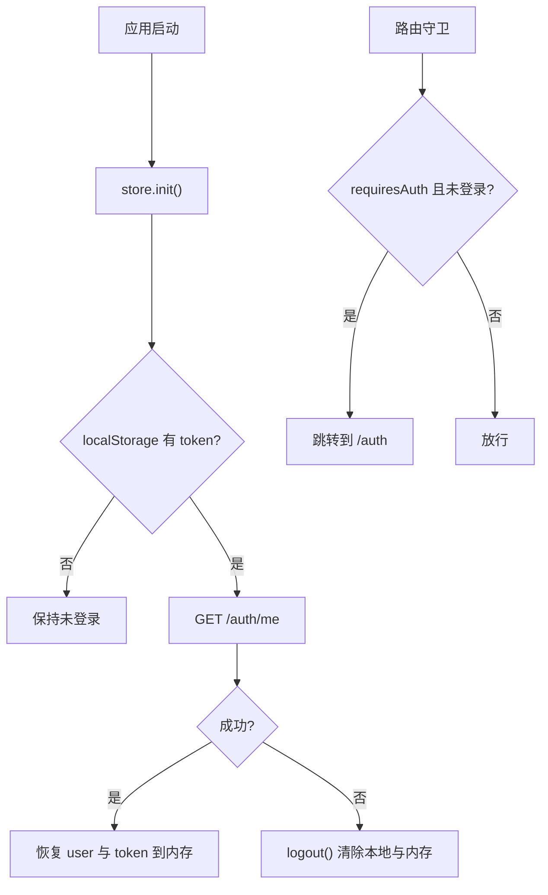
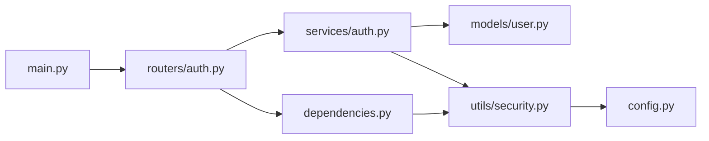

# 身份认证系统

<cite>
**本文引用的文件列表**
- [backEnd/app/routers/auth.py](file://backEnd/app/routers/auth.py)
- [backEnd/app/services/auth.py](file://backEnd/app/services/auth.py)
- [backEnd/app/schemas/auth.py](file://backEnd/app/schemas/auth.py)
- [backEnd/app/utils/security.py](file://backEnd/app/utils/security.py)
- [backEnd/app/dependencies.py](file://backEnd/app/dependencies.py)
- [backEnd/app/models/user.py](file://backEnd/app/models/user.py)
- [backEnd/app/config.py](file://backEnd/app/config.py)
- [backEnd/app/main.py](file://backEnd/app/main.py)
- [frontEnd/src/stores/auth.ts](file://frontEnd/src/stores/auth.ts)
- [frontEnd/src/views/AuthView.vue](file://frontEnd/src/views/AuthView.vue)
- [frontEnd/src/router/index.ts](file://frontEnd/src/router/index.ts)
</cite>

## 目录
1. [简介](#简介)
2. [项目结构](#项目结构)
3. [核心组件](#核心组件)
4. [架构总览](#架构总览)
5. [详细组件分析](#详细组件分析)
6. [依赖关系分析](#依赖关系分析)
7. [性能与安全考量](#性能与安全考量)
8. [故障排查指南](#故障排查指南)
9. [结论](#结论)
10. [附录：接口规范与最佳实践](#附录接口规范与最佳实践)

## 简介
本文件为 HR XF 系统的“身份认证模块”技术文档，聚焦于以下目标：
- JWT 令牌认证机制的实现原理（生成、验证、过期处理）
- 密码加密存储方案（bcrypt 哈希）
- 用户注册、登录、登出等核心认证接口的调用方式与参数规范
- 前端状态管理中的认证状态维护与持久化策略
- 令牌安全存储、自动刷新机制、并发登录控制等高级特性说明与建议
- 常见认证问题的排查方法与最佳实践

## 项目结构
后端采用 FastAPI + SQLAlchemy 异步 ORM，认证相关代码分布在路由层、服务层、工具层与配置层；前端使用 Vue 3 + Pinia 进行状态管理与本地持久化。

图表来源
- [backEnd/app/main.py:44-73](file://backEnd/app/main.py#L44-L73)
- [backEnd/app/routers/auth.py:25-92](file://backEnd/app/routers/auth.py#L25-L92)
- [backEnd/app/services/auth.py:1-96](file://backEnd/app/services/auth.py#L1-L96)
- [backEnd/app/dependencies.py:10-40](file://backEnd/app/dependencies.py#L10-L40)
- [backEnd/app/utils/security.py:1-47](file://backEnd/app/utils/security.py#L1-L47)
- [backEnd/app/models/user.py:10-45](file://backEnd/app/models/user.py#L10-L45)
- [backEnd/app/config.py:20-24](file://backEnd/app/config.py#L20-L24)
- [frontEnd/src/stores/auth.ts:35-83](file://frontEnd/src/stores/auth.ts#L35-L83)
- [frontEnd/src/views/AuthView.vue:247-418](file://frontEnd/src/views/AuthView.vue#L247-L418)
- [frontEnd/src/router/index.ts:136-164](file://frontEnd/src/router/index.ts#L136-L164)

章节来源
- [backEnd/app/main.py:44-73](file://backEnd/app/main.py#L44-L73)
- [backEnd/app/routers/auth.py:25-92](file://backEnd/app/routers/auth.py#L25-L92)
- [backEnd/app/services/auth.py:1-96](file://backEnd/app/services/auth.py#L1-L96)
- [backEnd/app/dependencies.py:10-40](file://backEnd/app/dependencies.py#L10-L40)
- [backEnd/app/utils/security.py:1-47](file://backEnd/app/utils/security.py#L1-L47)
- [backEnd/app/models/user.py:10-45](file://backEnd/app/models/user.py#L10-L45)
- [backEnd/app/config.py:20-24](file://backEnd/app/config.py#L20-L24)
- [frontEnd/src/stores/auth.ts:35-83](file://frontEnd/src/stores/auth.ts#L35-L83)
- [frontEnd/src/views/AuthView.vue:247-418](file://frontEnd/src/views/AuthView.vue#L247-L418)
- [frontEnd/src/router/index.ts:136-164](file://frontEnd/src/router/index.ts#L136-L164)

## 核心组件
- 路由层（FastAPI）：定义认证相关 HTTP 端点，负责请求校验、错误映射与响应封装。
- 服务层（业务逻辑）：实现注册、登录、资料更新、密码修改、账号注销等业务流程。
- 安全工具层：提供 bcrypt 密码哈希/校验、JWT 签发与解码。
- 依赖注入层：统一解析 Bearer Token，校验载荷并获取当前用户。
- 数据模型层：用户实体与字段约束。
- 配置层：JWT 密钥、算法、过期时间等。
- 前端状态管理：Pinia store 封装 API 调用、本地持久化、初始化恢复与会话清理。

章节来源
- [backEnd/app/routers/auth.py:25-92](file://backEnd/app/routers/auth.py#L25-L92)
- [backEnd/app/services/auth.py:38-96](file://backEnd/app/services/auth.py#L38-L96)
- [backEnd/app/utils/security.py:10-47](file://backEnd/app/utils/security.py#L10-L47)
- [backEnd/app/dependencies.py:10-40](file://backEnd/app/dependencies.py#L10-L40)
- [backEnd/app/models/user.py:10-45](file://backEnd/app/models/user.py#L10-L45)
- [backEnd/app/config.py:20-24](file://backEnd/app/config.py#L20-L24)
- [frontEnd/src/stores/auth.ts:65-83](file://frontEnd/src/stores/auth.ts#L65-L83)

## 架构总览
下图展示了从前端发起认证请求到后端鉴权返回的完整链路，包括路由、依赖注入、服务层与安全工具层的交互。

图表来源
- [backEnd/app/routers/auth.py:69-91](file://backEnd/app/routers/auth.py#L69-L91)
- [backEnd/app/services/auth.py:85-96](file://backEnd/app/services/auth.py#L85-L96)
- [backEnd/app/dependencies.py:13-40](file://backEnd/app/dependencies.py#L13-L40)
- [backEnd/app/utils/security.py:26-47](file://backEnd/app/utils/security.py#L26-L47)

## 详细组件分析

### 1) JWT 令牌认证机制
- 令牌生成
  - 入口：服务层在注册成功与登录成功后调用安全工具生成访问令牌。
  - 载荷：包含用户标识（sub），并附加过期时间 exp。
  - 算法与密钥：由配置项指定（默认 HS256，密钥来自环境变量）。
- 令牌验证
  - 依赖注入层统一解析 Authorization: Bearer 头，解码并校验签名与过期时间。
  - 解码成功后，按 sub 查询用户并检查 is_active 状态。
- 过期处理
  - 服务端不主动刷新令牌；客户端应在应用启动时尝试用本地 token 拉取当前用户，若失败则视为失效并清除本地会话。
  - 当前未实现服务端无感刷新（如双令牌机制），如需支持可在后续扩展。

图表来源
- [backEnd/app/utils/security.py:26-47](file://backEnd/app/utils/security.py#L26-L47)
- [backEnd/app/dependencies.py:13-40](file://backEnd/app/dependencies.py#L13-L40)
- [backEnd/app/config.py:20-24](file://backEnd/app/config.py#L20-L24)

章节来源
- [backEnd/app/utils/security.py:26-47](file://backEnd/app/utils/security.py#L26-L47)
- [backEnd/app/dependencies.py:13-40](file://backEnd/app/dependencies.py#L13-L40)
- [backEnd/app/config.py:20-24](file://backEnd/app/config.py#L20-L24)

### 2) 密码加密存储方案（bcrypt）
- 哈希函数
  - 使用 passlib 的 CryptContext，算法为 bcrypt。
  - 对明文做安全截断（最大 72 字节），避免超出 bcrypt 限制。
- 校验流程
  - 登录与改密时，使用相同的安全截断后比对哈希。
- 安全性要点
  - 生产环境应确保 secret_key 与 bcrypt 成本因子合理配置。
  - 不在日志中输出敏感信息。

图表来源
- [backEnd/app/utils/security.py:10-47](file://backEnd/app/utils/security.py#L10-L47)
- [backEnd/app/config.py:20-24](file://backEnd/app/config.py#L20-L24)

章节来源
- [backEnd/app/utils/security.py:10-24](file://backEnd/app/utils/security.py#L10-L24)
- [backEnd/app/config.py:20-24](file://backEnd/app/config.py#L20-L24)

### 3) 用户注册、登录、登出接口
- 注册（邮箱）
  - 路径与方法：POST /api/auth/register/email
  - 请求体：{ email, password }
  - 响应：{ access_token, token_type, user }
- 注册（用户名）
  - 路径与方法：POST /api/auth/register/username
  - 请求体：{ username, password }
  - 响应：同上
- 登录
  - 路径与方法：POST /api/auth/login
  - 请求体：{ account, password }（account 可为邮箱或用户名）
  - 响应：同上
- 登出
  - 路径与方法：POST /api/auth/logout
  - 说明：服务端无状态，无需销毁令牌；客户端应自行清除本地令牌。
  - 响应：{ message }

图表来源
- [backEnd/app/routers/auth.py:41-66](file://backEnd/app/routers/auth.py#L41-L66)
- [backEnd/app/services/auth.py:38-62](file://backEnd/app/services/auth.py#L38-L62)
- [backEnd/app/utils/security.py:18-36](file://backEnd/app/utils/security.py#L18-L36)

章节来源
- [backEnd/app/routers/auth.py:41-86](file://backEnd/app/routers/auth.py#L41-L86)
- [backEnd/app/services/auth.py:38-96](file://backEnd/app/services/auth.py#L38-L96)

### 4) 受保护接口与依赖注入
- 依赖注入 get_current_user
  - 从请求头解析 Bearer Token
  - 解码并校验载荷，提取 sub
  - 根据 sub 查询用户并检查 is_active
  - 失败返回 401，成功返回当前用户对象
- 典型受保护接口
  - GET /api/auth/me
  - GET/PUT /api/auth/profile
  - PUT /api/auth/password
  - DELETE /api/auth/account
  - 其他需要认证的接口均通过该依赖注入保护

图表来源
- [backEnd/app/dependencies.py:13-40](file://backEnd/app/dependencies.py#L13-L40)
- [backEnd/app/routers/auth.py:89-100](file://backEnd/app/routers/auth.py#L89-L100)

章节来源
- [backEnd/app/dependencies.py:13-40](file://backEnd/app/dependencies.py#L13-L40)
- [backEnd/app/routers/auth.py:89-100](file://backEnd/app/routers/auth.py#L89-L100)

### 5) 前端认证状态管理与持久化
- 状态存储
  - 使用 Pinia store 维护 user 与 token 两个响应式变量
  - 计算属性 isAuthenticated 判断是否已登录
- 持久化策略
  - 登录成功后将 access_token 与 user 写入 localStorage（键名：auth_token、auth_user）
  - 应用启动时 init() 尝试从本地恢复 token，并调用 /auth/me 校验有效性；失败则执行 logout()
- 路由守卫
  - 需要认证的页面在未登录时跳转至 /auth
  - 已登录用户访问 /auth 时重定向至 /dashboard
- 头像上传
  - 单独构造 FormData 并手动带上 Authorization 头

图表来源
- [frontEnd/src/stores/auth.ts:72-83](file://frontEnd/src/stores/auth.ts#L72-L83)
- [frontEnd/src/stores/auth.ts:288-293](file://frontEnd/src/stores/auth.ts#L288-L293)
- [frontEnd/src/router/index.ts:136-164](file://frontEnd/src/router/index.ts#L136-L164)

章节来源
- [frontEnd/src/stores/auth.ts:65-83](file://frontEnd/src/stores/auth.ts#L65-L83)
- [frontEnd/src/stores/auth.ts:288-293](file://frontEnd/src/stores/auth.ts#L288-L293)
- [frontEnd/src/router/index.ts:136-164](file://frontEnd/src/router/index.ts#L136-L164)

## 依赖关系分析
- 耦合与内聚
  - 路由层仅负责协议转换与错误映射，业务逻辑集中在服务层，内聚性良好。
  - 安全工具独立于业务，可复用性强。
  - 依赖注入集中处理鉴权，降低各路由重复代码。
- 外部依赖
  - JWT 库 jose、密码哈希 passlib、ORM SQLAlchemy、配置 pydantic-settings。
- 潜在循环依赖
  - 当前未发现循环导入；安全工具仅依赖配置，服务层依赖安全工具与模型，路由依赖服务与依赖注入。

图表来源
- [backEnd/app/routers/auth.py:1-24](file://backEnd/app/routers/auth.py#L1-L24)
- [backEnd/app/services/auth.py:1-11](file://backEnd/app/services/auth.py#L1-L11)
- [backEnd/app/dependencies.py:1-9](file://backEnd/app/dependencies.py#L1-L9)
- [backEnd/app/utils/security.py:1-8](file://backEnd/app/utils/security.py#L1-L8)
- [backEnd/app/config.py:1-11](file://backEnd/app/config.py#L1-L11)
- [backEnd/app/main.py:11-22](file://backEnd/app/main.py#L11-L22)

章节来源
- [backEnd/app/routers/auth.py:1-24](file://backEnd/app/routers/auth.py#L1-L24)
- [backEnd/app/services/auth.py:1-11](file://backEnd/app/services/auth.py#L1-L11)
- [backEnd/app/dependencies.py:1-9](file://backEnd/app/dependencies.py#L1-L9)
- [backEnd/app/utils/security.py:1-8](file://backEnd/app/utils/security.py#L1-L8)
- [backEnd/app/config.py:1-11](file://backEnd/app/config.py#L1-L11)
- [backEnd/app/main.py:11-22](file://backEnd/app/main.py#L11-L22)

## 性能与安全考量
- 性能
  - bcrypt 哈希计算开销较大，建议在高并发场景下评估成本因子与水平扩展能力。
  - 登录/注册接口应避免额外 I/O 阻塞，当前实现直接落库并返回令牌，符合常规做法。
- 安全
  - 生产环境必须设置强 secret_key，并确保 HTTPS 传输。
  - 前端不应在 URL 或日志中暴露 token；当前实现使用 Authorization 头，符合最佳实践。
  - 密码最小长度与复杂度在前端与后端均有校验，建议在后端增加更严格的正则规则以增强鲁棒性。
- 并发登录控制
  - 当前未实现设备级并发登录限制。如需限制，可在依赖注入层引入 Redis 黑名单/白名单或会话表，结合用户 ID 与设备指纹进行控制。

[本节为通用指导，不直接分析具体文件]

## 故障排查指南
- 401 未授权
  - 检查请求是否携带 Authorization: Bearer <token>
  - 确认 token 未被篡改或过期
  - 检查用户是否被禁用（is_active=false）
- 400 参数错误
  - 注册时邮箱/用户名冲突
  - 密码强度不足或格式不符合要求
  - 修改用户名/邮箱时目标值已被占用
- 422 请求体验证失败
  - 检查 JSON 结构与字段类型是否符合 Pydantic 模型定义
- 前端无法恢复会话
  - 检查 localStorage 是否存在 auth_token 与 auth_user
  - 确认 /auth/me 是否可达（CORS、网络、后端健康检查）

章节来源
- [backEnd/app/dependencies.py:13-40](file://backEnd/app/dependencies.py#L13-L40)
- [backEnd/app/routers/auth.py:41-86](file://backEnd/app/routers/auth.py#L41-L86)
- [backEnd/app/schemas/auth.py:9-36](file://backEnd/app/schemas/auth.py#L9-L36)
- [frontEnd/src/stores/auth.ts:72-83](file://frontEnd/src/stores/auth.ts#L72-L83)

## 结论
本认证模块基于 JWT 无状态鉴权与 bcrypt 密码哈希，实现了完整的注册、登录、登出与受保护接口访问控制。前端通过 Pinia 与 localStorage 完成状态持久化与应用启动时的会话恢复。当前版本未实现服务端令牌刷新与并发登录控制，可按需扩展。

[本节为总结，不直接分析具体文件]

## 附录：接口规范与最佳实践

### A. 认证相关接口一览
- 注册（邮箱）
  - POST /api/auth/register/email
  - 请求体：{ email, password }
  - 响应：{ access_token, token_type, user }
- 注册（用户名）
  - POST /api/auth/register/username
  - 请求体：{ username, password }
  - 响应：同上
- 登录
  - POST /api/auth/login
  - 请求体：{ account, password }
  - 响应：同上
- 登出
  - POST /api/auth/logout
  - 响应：{ message }
- 获取当前用户
  - GET /api/auth/me
  - 响应：{ id, username, ... }
- 获取/更新个人资料
  - GET /api/auth/profile
  - PUT /api/auth/profile
- 修改用户名/邮箱
  - PUT /api/auth/username
  - PUT /api/auth/email
- 修改密码
  - PUT /api/auth/password
- 注销账号
  - DELETE /api/auth/account

章节来源
- [backEnd/app/routers/auth.py:41-176](file://backEnd/app/routers/auth.py#L41-L176)
- [backEnd/app/schemas/auth.py:9-119](file://backEnd/app/schemas/auth.py#L9-L119)

### B. 前端状态管理要点
- 登录成功后持久化 access_token 与 user
- 应用启动时尝试恢复会话并校验
- 路由守卫强制认证状态
- 头像上传需手动附带 Authorization 头

章节来源
- [frontEnd/src/stores/auth.ts:72-83](file://frontEnd/src/stores/auth.ts#L72-L83)
- [frontEnd/src/stores/auth.ts:288-293](file://frontEnd/src/stores/auth.ts#L288-L293)
- [frontEnd/src/router/index.ts:136-164](file://frontEnd/src/router/index.ts#L136-L164)

### C. 高级特性建议（可选扩展）
- 令牌刷新
  - 引入 refresh_token 与 access_token 双令牌机制，前端在 access_token 即将过期前调用刷新接口换取新令牌。
- 并发登录控制
  - 在服务端维护用户会话表或 Redis 集合，限制同一用户同时在线的设备数量。
- 安全加固
  - 增加速率限制、验证码、设备指纹绑定、敏感操作二次确认等。

[本节为概念性建议，不直接分析具体文件]