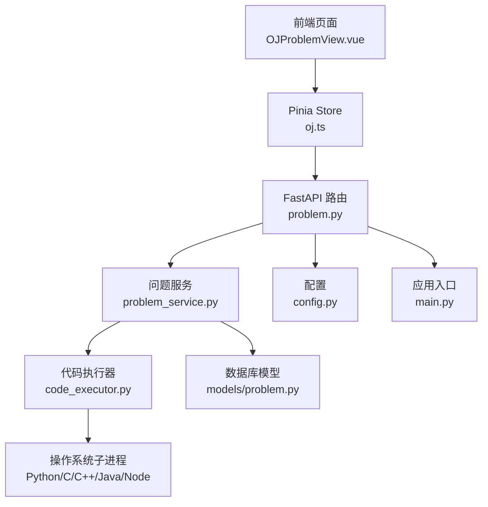
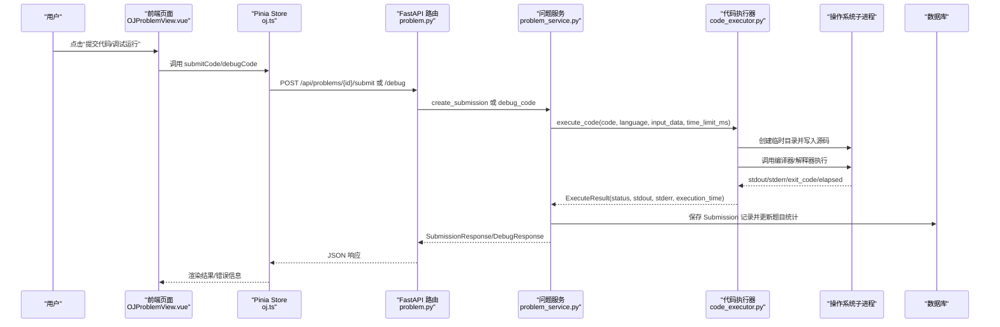
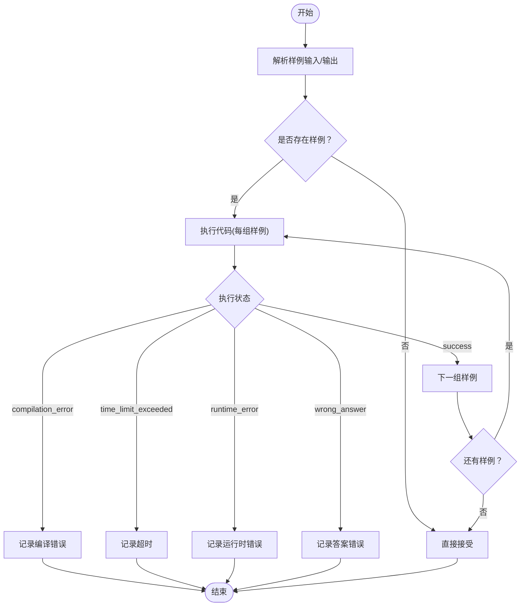
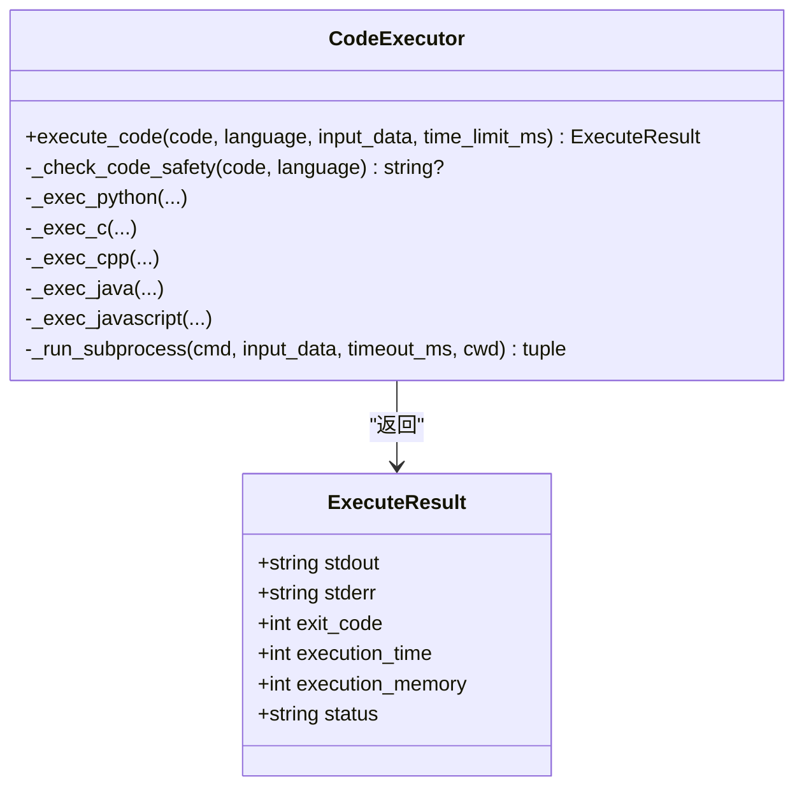
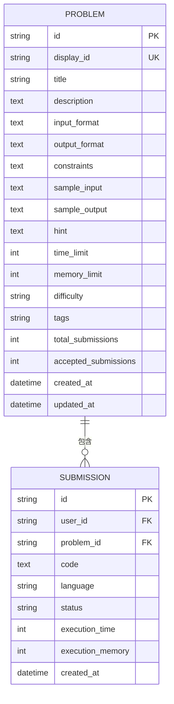
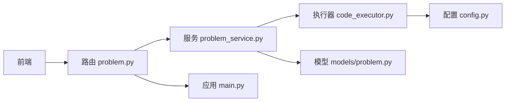

# 代码执行数据流

<cite>
**本文引用的文件**   
- [backEnd/app/services/code_executor.py](file://backEnd/app/services/code_executor.py)
- [backEnd/app/routers/problem.py](file://backEnd/app/routers/problem.py)
- [backEnd/app/services/problem_service.py](file://backEnd/app/services/problem_service.py)
- [backEnd/app/schemas/problem.py](file://backEnd/app/schemas/problem.py)
- [backEnd/app/models/problem.py](file://backEnd/app/models/problem.py)
- [backEnd/app/config.py](file://backEnd/app/config.py)
- [backEnd/app/database.py](file://backEnd/app/database.py)
- [backEnd/app/main.py](file://backEnd/app/main.py)
- [frontEnd/src/views/OJProblemView.vue](file://frontEnd/src/views/OJProblemView.vue)
- [frontEnd/src/stores/oj.ts](file://frontEnd/src/stores/oj.ts)
</cite>

## 目录
1. [简介](#简介)
2. [项目结构](#项目结构)
3. [核心组件](#核心组件)
4. [架构总览](#架构总览)
5. [详细组件分析](#详细组件分析)
6. [依赖关系分析](#依赖关系分析)
7. [性能与资源限制](#性能与资源限制)
8. [故障排查指南](#故障排查指南)
9. [结论](#结论)

## 简介
本文件面向HR XF系统的在线编程平台（OJ）模块，系统化梳理“前端编辑器 → 后端路由 → 业务服务 → 代码执行器 → 子进程沙箱”的完整数据流转链路。重点覆盖：
- 代码提交、编译执行、测试用例运行与结果返回的处理流程
- 多语言支持的数据格式转换与统一判题策略
- 执行环境隔离与安全沙箱机制（关键词黑名单、临时目录隔离、超时控制）
- 状态监控、错误捕获与调试输出的传递路径
- 流程图与架构图帮助开发者快速理解系统核心数据流

## 项目结构
与代码执行数据流直接相关的核心位置如下：
- 前端页面与状态管理：展示题目、编辑代码、发起提交/调试请求、渲染结果
- 后端路由：接收请求、鉴权、参数校验、调用服务层
- 服务层：解析样例、组织判题逻辑、持久化提交记录
- 执行器：安全扫描、按语言生成源码、调用编译器/解释器、收集输出与耗时
- 配置与数据库：编译器路径、CORS、异步会话等基础设施

图表来源
- [backEnd/app/routers/problem.py:121-175](file://backEnd/app/routers/problem.py#L121-L175)
- [backEnd/app/services/problem_service.py:95-202](file://backEnd/app/services/problem_service.py#L95-L202)
- [backEnd/app/services/code_executor.py:270-321](file://backEnd/app/services/code_executor.py#L270-L321)
- [backEnd/app/models/problem.py:57-88](file://backEnd/app/models/problem.py#L57-L88)
- [backEnd/app/config.py:39-46](file://backEnd/app/config.py#L39-L46)
- [backEnd/app/main.py:44-68](file://backEnd/app/main.py#L44-L68)
- [frontEnd/src/views/OJProblemView.vue:378-459](file://frontEnd/src/views/OJProblemView.vue#L378-L459)
- [frontEnd/src/stores/oj.ts:181-218](file://frontEnd/src/stores/oj.ts#L181-L218)

章节来源
- [backEnd/app/routers/problem.py:1-175](file://backEnd/app/routers/problem.py#L1-175)
- [backEnd/app/services/problem_service.py:1-202](file://backEnd/app/services/problem_service.py#L1-L202)
- [backEnd/app/services/code_executor.py:1-444](file://backEnd/app/services/code_executor.py#L1-L444)
- [backEnd/app/models/problem.py:1-88](file://backEnd/app/models/problem.py#L1-L88)
- [backEnd/app/config.py:1-71](file://backEnd/app/config.py#L1-L71)
- [backEnd/app/database.py:1-58](file://backEnd/app/database.py#L1-L58)
- [backEnd/app/main.py:1-90](file://backEnd/app/main.py#L1-L90)
- [frontEnd/src/views/OJProblemView.vue:1-500](file://frontEnd/src/views/OJProblemView.vue#L1-L500)
- [frontEnd/src/stores/oj.ts:1-268](file://frontEnd/src/stores/oj.ts#L1-L268)

## 核心组件
- 前端 OJ 页面：提供题目详情展示、代码编辑、调试运行、提交判题、结果弹窗与最近提交列表
- Pinia Store：封装 HTTP 请求、统一错误处理、提交与调试接口调用
- FastAPI 路由：定义 /problems/{id}/submit 与 /problems/{id}/debug 两个关键端点
- 问题服务：解析样例输入输出、循环判题、比较输出、持久化提交记录、统计更新
- 代码执行器：安全扫描、语言映射、临时目录隔离、调用编译器/解释器、超时控制、结果封装
- 配置与数据库：编译器路径可配置、异步数据库连接池、应用生命周期初始化

章节来源
- [frontEnd/src/views/OJProblemView.vue:378-459](file://frontEnd/src/views/OJProblemView.vue#L378-L459)
- [frontEnd/src/stores/oj.ts:181-218](file://frontEnd/src/stores/oj.ts#L181-L218)
- [backEnd/app/routers/problem.py:121-175](file://backEnd/app/routers/problem.py#L121-L175)
- [backEnd/app/services/problem_service.py:95-202](file://backEnd/app/services/problem_service.py#L95-L202)
- [backEnd/app/services/code_executor.py:270-321](file://backEnd/app/services/code_executor.py#L270-L321)
- [backEnd/app/config.py:39-46](file://backEnd/app/config.py#L39-L46)
- [backEnd/app/database.py:31-43](file://backEnd/app/database.py#L31-L43)

## 架构总览
下图展示了从用户点击“提交代码/调试运行”到最终结果返回的前端到后端的完整调用链。

图表来源
- [frontEnd/src/views/OJProblemView.vue:378-459](file://frontEnd/src/views/OJProblemView.vue#L378-L459)
- [frontEnd/src/stores/oj.ts:181-218](file://frontEnd/src/stores/oj.ts#L181-L218)
- [backEnd/app/routers/problem.py:121-175](file://backEnd/app/routers/problem.py#L121-L175)
- [backEnd/app/services/problem_service.py:95-202](file://backEnd/app/services/problem_service.py#L95-L202)
- [backEnd/app/services/code_executor.py:270-321](file://backEnd/app/services/code_executor.py#L270-L321)
- [backEnd/app/models/problem.py:57-88](file://backEnd/app/models/problem.py#L57-L88)

## 详细组件分析

### 前端交互与数据绑定
- 页面加载时获取题目详情，包含样例输入/输出、时间/内存限制、标签等
- 用户选择语言、编写代码，点击“提交代码”或“调试运行”
- 提交：调用 store.submitCode(problemId, code, language)，成功后显示弹窗与最近提交记录
- 调试：调用 store.debugCode(problemId, code, language, sampleInput)，在调试区显示 stdout/stderr/执行时间/状态

章节来源
- [frontEnd/src/views/OJProblemView.vue:289-459](file://frontEnd/src/views/OJProblemView.vue#L289-L459)
- [frontEnd/src/stores/oj.ts:181-218](file://frontEnd/src/stores/oj.ts#L181-L218)

### 路由层：提交与调试接口
- POST /api/problems/{problem_id}/submit：接收 code 与 language，调用 problem_service.create_submission
- POST /api/problems/{problem_id}/debug：接收 code、language、input_data，调用 problem_service.debug_code
- 可选认证：部分查询接口支持无 token 访问，但提交/调试需要登录态

章节来源
- [backEnd/app/routers/problem.py:121-175](file://backEnd/app/routers/problem.py#L121-L175)

### 服务层：判题主流程
- 解析样例输入/输出（JSON 字符串），逐组执行判题
- 对每组样例调用 execute_code，根据返回状态决定整体结果：
  - compilation_error：立即终止，记录错误详情
  - time_limit_exceeded：立即终止，提示优化算法
  - runtime_error：立即终止，提示运行时异常
  - wrong_answer：输出不匹配，提示检查逻辑
  - accepted：所有样例通过
- 持久化提交记录，更新题目总提交数与通过数

图表来源
- [backEnd/app/services/problem_service.py:95-179](file://backEnd/app/services/problem_service.py#L95-L179)

章节来源
- [backEnd/app/services/problem_service.py:95-179](file://backEnd/app/services/problem_service.py#L95-L179)

### 执行器：安全与多语言执行
- 安全检查：基于正则的跨语言危险关键词黑名单，拦截系统命令、文件系统破坏、网络、动态执行等高危操作
- 语言映射：将前端 key 映射为内部 key（如 python/python3 → python3）
- 临时目录隔离：每次执行创建独立临时目录，执行完成后清理
- 编译器/解释器路径：优先使用 .env 配置，否则自动从 PATH 检测
- 超时控制：通过 subprocess.run(timeout=...) 实现，超时返回特定状态
- 结果封装：统一返回 ExecuteResult（stdout、stderr、exit_code、execution_time、status）

图表来源
- [backEnd/app/services/code_executor.py:210-218](file://backEnd/app/services/code_executor.py#L210-L218)
- [backEnd/app/services/code_executor.py:270-321](file://backEnd/app/services/code_executor.py#L270-L321)

章节来源
- [backEnd/app/services/code_executor.py:154-167](file://backEnd/app/services/code_executor.py#L154-L167)
- [backEnd/app/services/code_executor.py:173-197](file://backEnd/app/services/code_executor.py#L173-L197)
- [backEnd/app/services/code_executor.py:270-321](file://backEnd/app/services/code_executor.py#L270-L321)
- [backEnd/app/services/code_executor.py:323-443](file://backEnd/app/services/code_executor.py#L323-L443)

### 数据模型与持久化
- Problem：题目元数据（描述、输入/输出格式、约束、样例、时间/内存限制、难度、标签、统计）
- Submission：提交记录（用户、题目、代码、语言、状态、执行时间/内存、创建时间）
- 提交后更新题目 total_submissions 与 accepted_submissions

图表来源
- [backEnd/app/models/problem.py:17-88](file://backEnd/app/models/problem.py#L17-L88)

章节来源
- [backEnd/app/models/problem.py:17-88](file://backEnd/app/models/problem.py#L17-L88)

### 配置与环境
- 编译器路径：python_bin/gcc_bin/gpp_bin/java_bin/javac_bin/node_bin 可从 .env 配置，未设置则自动检测
- CORS：允许前端开发地址访问
- 数据库：异步引擎与会话工厂，连接池大小与 ping 兼容补丁

章节来源
- [backEnd/app/config.py:39-46](file://backEnd/app/config.py#L39-L46)
- [backEnd/app/config.py:31-33](file://backEnd/app/config.py#L31-L33)
- [backEnd/app/database.py:31-43](file://backEnd/app/database.py#L31-L43)
- [backEnd/app/database.py:14-24](file://backEnd/app/database.py#L14-L24)

## 依赖关系分析
- 前端依赖后端 API：/problems/{id}/submit 与 /problems/{id}/debug
- 路由依赖服务：problem_service 负责判题主流程
- 服务依赖执行器：code_executor 负责实际执行与结果封装
- 服务依赖数据库：持久化提交记录与更新题目统计
- 执行器依赖配置：编译器路径解析与自动检测
- 应用入口注册路由与中间件，启动时创建表结构与种子数据

图表来源
- [backEnd/app/routers/problem.py:121-175](file://backEnd/app/routers/problem.py#L121-L175)
- [backEnd/app/services/problem_service.py:95-202](file://backEnd/app/services/problem_service.py#L95-L202)
- [backEnd/app/services/code_executor.py:270-321](file://backEnd/app/services/code_executor.py#L270-L321)
- [backEnd/app/models/problem.py:57-88](file://backEnd/app/models/problem.py#L57-L88)
- [backEnd/app/config.py:39-46](file://backEnd/app/config.py#L39-L46)
- [backEnd/app/main.py:44-68](file://backEnd/app/main.py#L44-L68)

章节来源
- [backEnd/app/routers/problem.py:1-175](file://backEnd/app/routers/problem.py#L1-175)
- [backEnd/app/services/problem_service.py:1-202](file://backEnd/app/services/problem_service.py#L1-L202)
- [backEnd/app/services/code_executor.py:1-444](file://backEnd/app/services/code_executor.py#L1-L444)
- [backEnd/app/models/problem.py:1-88](file://backEnd/app/models/problem.py#L1-L88)
- [backEnd/app/config.py:1-71](file://backEnd/app/config.py#L1-L71)
- [backEnd/app/main.py:1-90](file://backEnd/app/main.py#L1-L90)

## 性能与资源限制
- 并发执行：执行器使用线程池（ThreadPoolExecutor）包装子进程调用，避免阻塞事件循环
- 超时控制：subprocess.run(timeout=...) 精确控制单组样例执行时间，防止无限挂起
- 临时目录隔离：每次执行创建独立临时目录，避免污染与冲突
- 编译器路径缓存：get_settings() 使用 lru_cache 减少重复读取
- 输出对比优化：统一换行符、去除首尾空白、逐行比较，提升判题稳定性

[本节为通用性能讨论，无需具体文件引用]

## 故障排查指南
- 编译错误：查看 error_detail 与 stderr，确认语法与头文件/库是否可用
- 运行时错误：检查数组越界、空指针、除零等常见异常；关注 stderr 堆栈
- 超时：优化算法复杂度，降低时间消耗；必要时调整 time_limit
- 答案错误：核对输出格式（空格、换行）、边界条件与样例一致性
- 安全拦截：若出现“代码包含禁止的操作”，需移除危险函数/模块调用
- 调试建议：先使用“调试运行”验证本地样例，再提交正式判题

章节来源
- [backEnd/app/services/problem_service.py:130-156](file://backEnd/app/services/problem_service.py#L130-L156)
- [backEnd/app/services/code_executor.py:154-167](file://backEnd/app/services/code_executor.py#L154-L167)
- [backEnd/app/services/code_executor.py:244-249](file://backEnd/app/services/code_executor.py#L244-L249)

## 结论
HR XF 的 OJ 模块以清晰的分层架构实现了从前端到沙箱执行的完整数据流：前端负责交互与展示，路由负责鉴权与调度，服务层负责判题逻辑与持久化，执行器负责安全扫描与多语言执行。通过关键词黑名单、临时目录隔离与超时控制，系统在安全性与稳定性之间取得平衡。配合统一的输出对比与错误详情返回，开发者可以快速定位问题并优化算法。