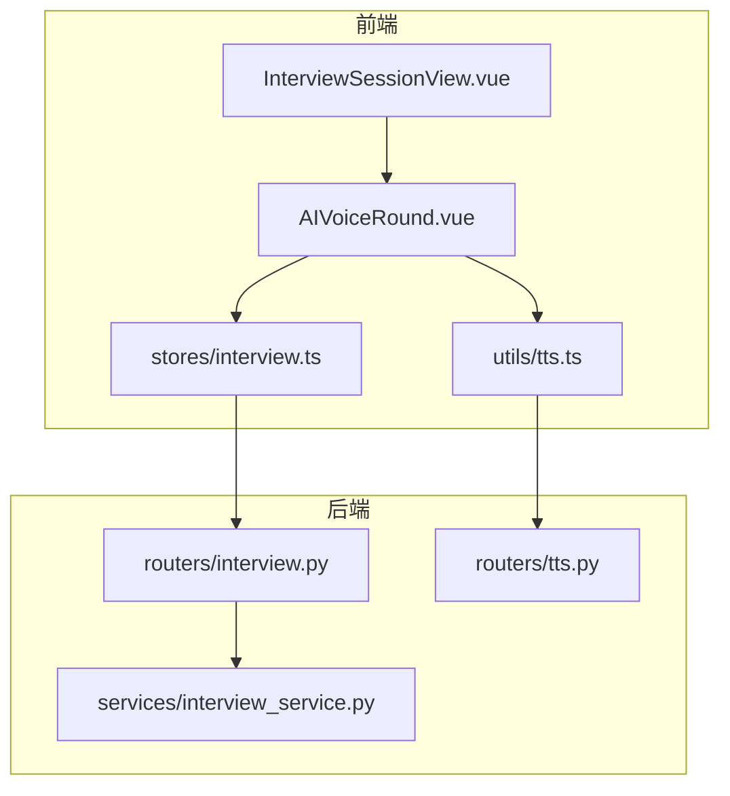
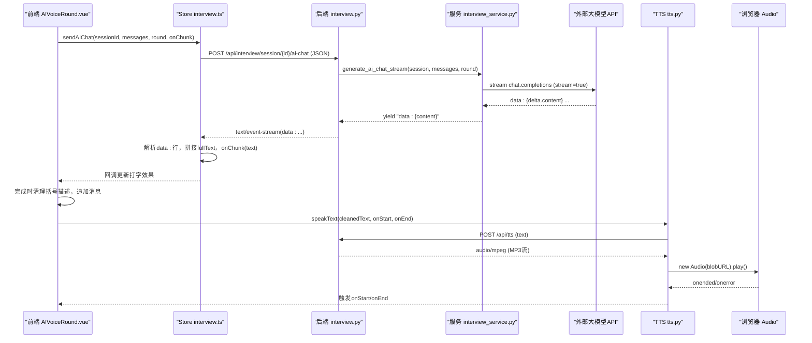
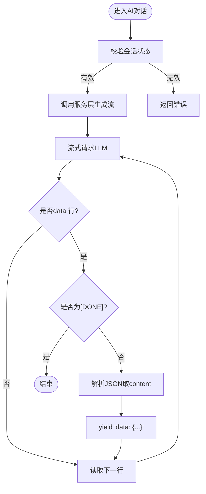
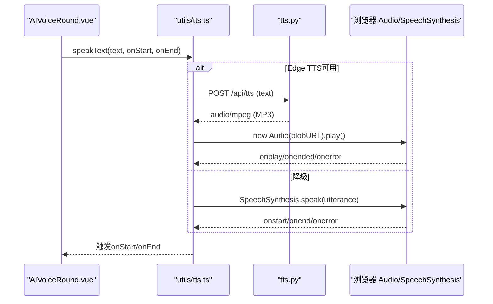
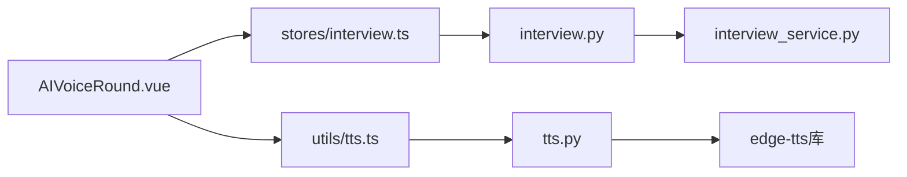

# 实时通信数据流

<cite>
**本文引用的文件**
- [interview.py](file://backEnd/app/routers/interview.py)
- [interview_service.py](file://backEnd/app/services/interview_service.py)
- [tts.py](file://backEnd/app/routers/tts.py)
- [InterviewSessionView.vue](file://frontEnd/src/views/InterviewSessionView.vue)
- [AIVoiceRound.vue](file://frontEnd/src/components/interview/AIVoiceRound.vue)
- [interview.ts](file://frontEnd/src/stores/interview.ts)
- [tts.ts](file://frontEnd/src/utils/tts.ts)
</cite>

## 目录
1. [简介](#简介)
2. [项目结构](#项目结构)
3. [核心组件](#核心组件)
4. [架构总览](#架构总览)
5. [详细组件分析](#详细组件分析)
6. [依赖关系分析](#依赖关系分析)
7. [性能与可扩展性](#性能与可扩展性)
8. [故障排查指南](#故障排查指南)
9. [结论](#结论)
10. [附录：数据帧格式规范](#附录数据帧格式规范)

## 简介
本文件面向HR XF系统的开发者，系统化梳理并文档化“实时通信数据流”的实现机制。重点覆盖：
- SSE（Server-Sent Events）流式响应在AI对话中的应用
- TTS语音合成数据流（文本转音频、音频流传输与播放控制）
- 前端事件监听、状态同步与用户体验优化
- 连接管理与断线重连策略建议
- 架构图与数据帧格式规范，便于扩展与维护

说明：当前代码库采用HTTP长连接SSE进行AI对话流式输出，未实现WebSocket；TTS为请求-响应模式返回MP3流，非逐块流式播放。

## 项目结构
围绕实时通信的关键路径如下：
- 后端路由层：面试会话的SSE接口、TTS接口
- 服务层：调用大模型流式生成、评分报告生成等
- 前端视图与Store：发起SSE请求、解析data:行、驱动UI与TTS播放
- 工具模块：TTS封装（Edge TTS优先，Web Speech API降级）

图表来源
- [interview.py:161-189](file://backEnd/app/routers/interview.py#L161-L189)
- [interview_service.py:797-845](file://backEnd/app/services/interview_service.py#L797-L845)
- [tts.py:27-50](file://backEnd/app/routers/tts.py#L27-L50)
- [InterviewSessionView.vue:278-285](file://frontEnd/src/views/InterviewSessionView.vue#L278-L285)
- [AIVoiceRound.vue:312-358](file://frontEnd/src/components/interview/AIVoiceRound.vue#L312-L358)
- [interview.ts:209-253](file://frontEnd/src/stores/interview.ts#L209-L253)
- [tts.ts:13-56](file://frontEnd/src/utils/tts.ts#L13-L56)

章节来源
- [interview.py:161-189](file://backEnd/app/routers/interview.py#L161-L189)
- [interview_service.py:797-845](file://backEnd/app/services/interview_service.py#L797-L845)
- [tts.py:27-50](file://backEnd/app/routers/tts.py#L27-L50)
- [InterviewSessionView.vue:278-285](file://frontEnd/src/views/InterviewSessionView.vue#L278-L285)
- [AIVoiceRound.vue:312-358](file://frontEnd/src/components/interview/AIVoiceRound.vue#L312-L358)
- [interview.ts:209-253](file://frontEnd/src/stores/interview.ts#L209-L253)
- [tts.ts:13-56](file://frontEnd/src/utils/tts.ts#L13-L56)

## 核心组件
- AI对话SSE流
  - 后端：FastAPI StreamingResponse + 自定义事件生成器，转发LLM的SSE片段
  - 前端：fetch + ReadableStream读取，按行解析data: JSON，拼接完整文本并回调渲染
- TTS语音合成
  - 后端：edge-tts将文本转为MP3字节流，StreamingResponse返回audio/mpeg
  - 前端：Blob -> ObjectURL -> Audio元素播放；失败时降级到浏览器内置SpeechSynthesis
- 面试流程与状态
  - 轮次推进、切屏上报、中止、报告生成等由后端服务层处理，前端通过REST更新状态

章节来源
- [interview.py:161-189](file://backEnd/app/routers/interview.py#L161-L189)
- [interview_service.py:797-845](file://backEnd/app/services/interview_service.py#L797-L845)
- [tts.py:27-50](file://backEnd/app/routers/tts.py#L27-L50)
- [tts.ts:13-56](file://frontEnd/src/utils/tts.ts#L13-L56)
- [interview.ts:209-253](file://frontEnd/src/stores/interview.ts#L209-L253)

## 架构总览
下图展示一次AI对话从前端到后端的端到端时序，以及TTS播放的并行链路。

图表来源
- [interview.py:161-189](file://backEnd/app/routers/interview.py#L161-L189)
- [interview_service.py:797-845](file://backEnd/app/services/interview_service.py#L797-L845)
- [tts.py:27-50](file://backEnd/app/routers/tts.py#L27-L50)
- [AIVoiceRound.vue:312-358](file://frontEnd/src/components/interview/AIVoiceRound.vue#L312-L358)
- [interview.ts:209-253](file://frontEnd/src/stores/interview.ts#L209-L253)
- [tts.ts:13-56](file://frontEnd/src/utils/tts.ts#L13-L56)

## 详细组件分析

### AI对话SSE流式响应
- 后端实现要点
  - 路由接收session_id与消息列表，校验会话状态
  - 使用StreamingResponse返回text/event-stream，设置no-cache、keep-alive、关闭代理缓冲
  - 事件生成器调用服务层，后者以httpx流式调用大模型，过滤并转发data:行
- 前端实现要点
  - fetch获取ReadableStream，TextDecoder解码
  - 按换行分割，匹配data:前缀，跳过[DONE]，解析JSON取content字段
  - 累积fullText并通过onChunk回调驱动UI增量显示
- 错误与边界
  - 网络异常或LLM超时：前端抛出错误，UI提示
  - 非法JSON片段：忽略继续
  - 长时间无响应：后端对LLM请求设置了超时

图表来源
- [interview.py:161-189](file://backEnd/app/routers/interview.py#L161-L189)
- [interview_service.py:797-845](file://backEnd/app/services/interview_service.py#L797-L845)

章节来源
- [interview.py:161-189](file://backEnd/app/routers/interview.py#L161-L189)
- [interview_service.py:797-845](file://backEnd/app/services/interview_service.py#L797-L845)
- [interview.ts:209-253](file://frontEnd/src/stores/interview.ts#L209-L253)
- [AIVoiceRound.vue:312-358](file://frontEnd/src/components/interview/AIVoiceRound.vue#L312-L358)

### TTS语音合成数据流
- 后端实现要点
  - 使用edge-tts将文本转换为MP3字节流，收集后以StreamingResponse返回audio/mpeg
  - 提供列出中文语音的接口
- 前端实现要点
  - 优先调用后端TTS接口，Blob转ObjectURL，创建Audio播放
  - 若失败则降级到浏览器SpeechSynthesis，自动选择优质中文声线
  - 提供统一停止方法，同时停止两种方案
- 播放控制
  - 开始/结束事件用于驱动数字人动画与状态切换
  - 支持“重新朗读”按钮

图表来源
- [tts.py:27-50](file://backEnd/app/routers/tts.py#L27-L50)
- [tts.ts:13-56](file://frontEnd/src/utils/tts.ts#L13-L56)
- [AIVoiceRound.vue:203-219](file://frontEnd/src/components/interview/AIVoiceRound.vue#L203-L219)

章节来源
- [tts.py:27-50](file://backEnd/app/routers/tts.py#L27-L50)
- [tts.ts:13-56](file://frontEnd/src/utils/tts.ts#L13-L56)
- [AIVoiceRound.vue:203-219](file://frontEnd/src/components/interview/AIVoiceRound.vue#L203-L219)

### 前端事件监听与状态同步
- 事件监听
  - visibilitychange、fullscreenchange、keydown、contextmenu、beforeunload等用于防作弊与体验保护
  - 摄像头权限与录制生命周期管理
- 状态同步
  - 轮次变化时自动加载题目
  - 提交答案、进入下一轮、中止面试、获取报告等通过REST更新store
- 用户体验优化
  - 打字效果、光标闪烁、滚动到底部
  - 数字人表情与视线跟随
  - 字体大小调节、弹窗确认、警告横幅

章节来源
- [InterviewSessionView.vue:372-491](file://frontEnd/src/views/InterviewSessionView.vue#L372-L491)
- [InterviewSessionView.vue:501-530](file://frontEnd/src/views/InterviewSessionView.vue#L501-L530)
- [InterviewSessionView.vue:580-676](file://frontEnd/src/views/InterviewSessionView.vue#L580-L676)
- [AIVoiceRound.vue:143-178](file://frontEnd/src/components/interview/AIVoiceRound.vue#L143-L178)

### WebSocket连接管理（现状与建议）
- 现状
  - 当前未实现WebSocket，AI对话与TTS均基于HTTP（SSE与流式响应）
- 建议的重连策略（概念性）
  - 心跳保活：客户端定时发送ping，服务端pong
  - 指数退避重连：首次1s，最大重试次数与上限间隔
  - 幂等恢复：携带last_event_id或cursor，断线后从最近位置续传
  - 优雅降级：网络不可用时缓存本地队列，恢复后批量补发
  - 资源释放：断开时清理定时器、取消订阅、释放媒体流

[本节为通用建议，不直接分析具体文件，故无章节来源]

## 依赖关系分析
- 路由层依赖服务层，服务层依赖数据库与大模型API
- 前端Store负责HTTP/SSE交互，组件消费Store暴露的方法
- TTS工具模块独立于业务组件，提供统一播放能力

图表来源
- [interview.py:161-189](file://backEnd/app/routers/interview.py#L161-L189)
- [interview_service.py:797-845](file://backEnd/app/services/interview_service.py#L797-L845)
- [tts.py:27-50](file://backEnd/app/routers/tts.py#L27-L50)
- [interview.ts:209-253](file://frontEnd/src/stores/interview.ts#L209-L253)
- [AIVoiceRound.vue:312-358](file://frontEnd/src/components/interview/AIVoiceRound.vue#L312-L358)
- [tts.ts:13-56](file://frontEnd/src/utils/tts.ts#L13-L56)

章节来源
- [interview.py:161-189](file://backEnd/app/routers/interview.py#L161-L189)
- [interview_service.py:797-845](file://backEnd/app/services/interview_service.py#L797-L845)
- [tts.py:27-50](file://backEnd/app/routers/tts.py#L27-L50)
- [interview.ts:209-253](file://frontEnd/src/stores/interview.ts#L209-L253)
- [AIVVoiceRound.vue:312-358](file://frontEnd/src/components/interview/AIVoiceRound.vue#L312-L358)
- [tts.ts:13-56](file://frontEnd/src/utils/tts.ts#L13-L56)

## 性能与可扩展性
- SSE流式
  - 优点：低延迟增量渲染，无需全量等待
  - 注意：避免在onChunk中执行昂贵操作；节流UI更新
- TTS
  - 当前为整段文本生成后返回MP3，适合短文本；长文本可考虑分段TTS或流式音频
  - 建议：引入分片播放（如PCM/Opus流），降低首包延迟
- 并发与限流
  - 对LLM调用增加并发限制与熔断
  - 对TTS增加队列与优先级，避免阻塞主线程
- 缓存与复用
  - 对相同文本的TTS结果做短期缓存
  - 对常用语音配置预加载

[本节为通用指导，不直接分析具体文件，故无章节来源]

## 故障排查指南
- SSE连接问题
  - 检查后端返回的Content-Type是否为text/event-stream
  - 确认代理未缓冲响应（X-Accel-Buffering: no）
  - 观察前端是否收到data:行与[DONE]标记
- TTS播放失败
  - 检查后端是否返回audio/mpeg
  - 浏览器自动播放策略：需用户交互后才能播放
  - 降级路径是否生效（SpeechSynthesis）
- 网络异常
  - 前端捕获fetch错误并提示
  - 记录错误日志与上下文（sessionId、round、消息长度）
- 防作弊误判
  - 全屏/可见性事件在不同浏览器行为差异较大，建议提供开关与提示

章节来源
- [interview.py:161-189](file://backEnd/app/routers/interview.py#L161-L189)
- [tts.ts:13-56](file://frontEnd/src/utils/tts.ts#L13-L56)
- [InterviewSessionView.vue:372-491](file://frontEnd/src/views/InterviewSessionView.vue#L372-L491)

## 结论
本系统通过SSE实现了AI对话的实时增量输出，结合TTS提供了自然的语音反馈。整体链路清晰、职责分离明确。后续可在以下方面增强：
- 引入WebSocket以实现双向实时交互与更稳健的连接管理
- 改进TTS为真正的流式音频播放，提升长文本体验
- 完善断线重连、心跳保活与错误恢复策略
- 增加监控与指标采集，定位性能瓶颈

[本节为总结，不直接分析具体文件，故无章节来源]

## 附录：数据帧格式规范

### SSE数据帧（AI对话）
- 传输协议：HTTP 1.1，Content-Type: text/event-stream
- 头部要求：Cache-Control: no-cache；Connection: keep-alive；X-Accel-Buffering: no
- 数据行格式：
  - 每行以"data: "开头，后接JSON对象
  - JSON对象包含content字段，表示增量文本片段
  - 结束标志：单独一行"data: [DONE]"
- 示例（示意）：
  - data: {"content": "你好"}
  - data: {"content": "，欢迎参加"}
  - data: [DONE]

章节来源
- [interview.py:161-189](file://backEnd/app/routers/interview.py#L161-L189)
- [interview_service.py:797-845](file://backEnd/app/services/interview_service.py#L797-L845)
- [interview.ts:209-253](file://frontEnd/src/stores/interview.ts#L209-L253)

### TTS音频帧
- 传输协议：HTTP 1.1，Content-Type: audio/mpeg
- 请求体：JSON，包含text字段（可选voice/rate/pitch/volume）
- 响应体：MP3字节流，可直接作为Audio源
- 前端播放：Blob -> URL.createObjectURL -> Audio.play()

章节来源
- [tts.py:27-50](file://backEnd/app/routers/tts.py#L27-L50)
- [tts.ts:13-56](file://frontEnd/src/utils/tts.ts#L13-L56)