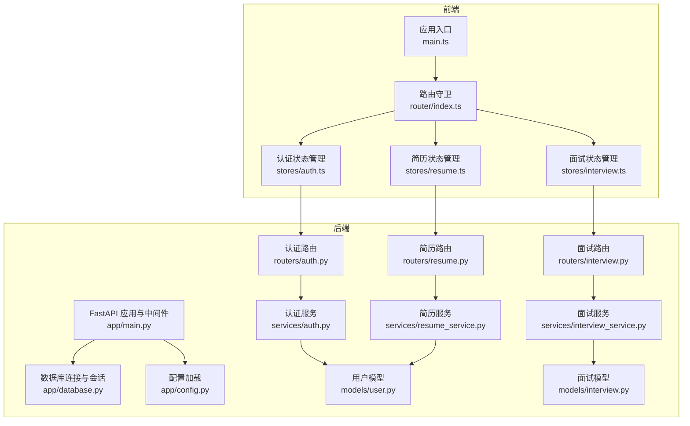
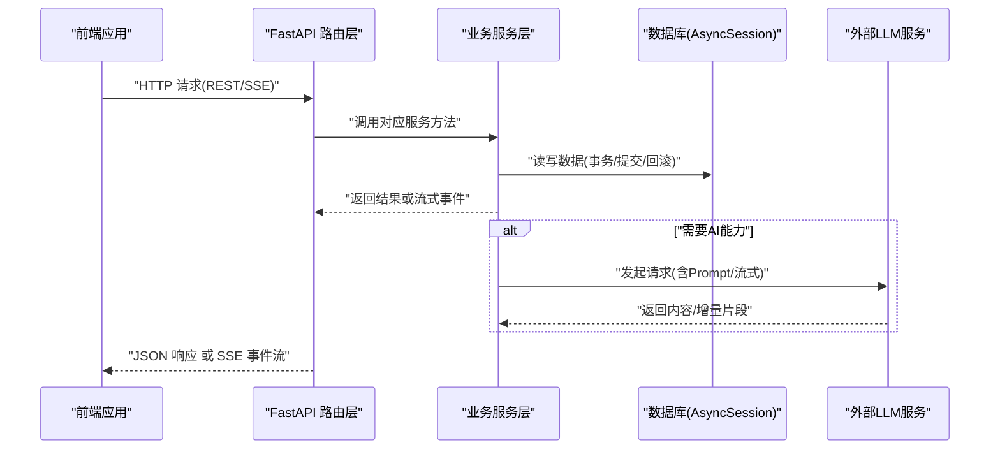
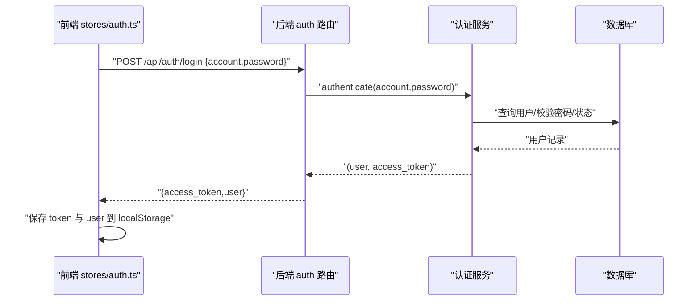
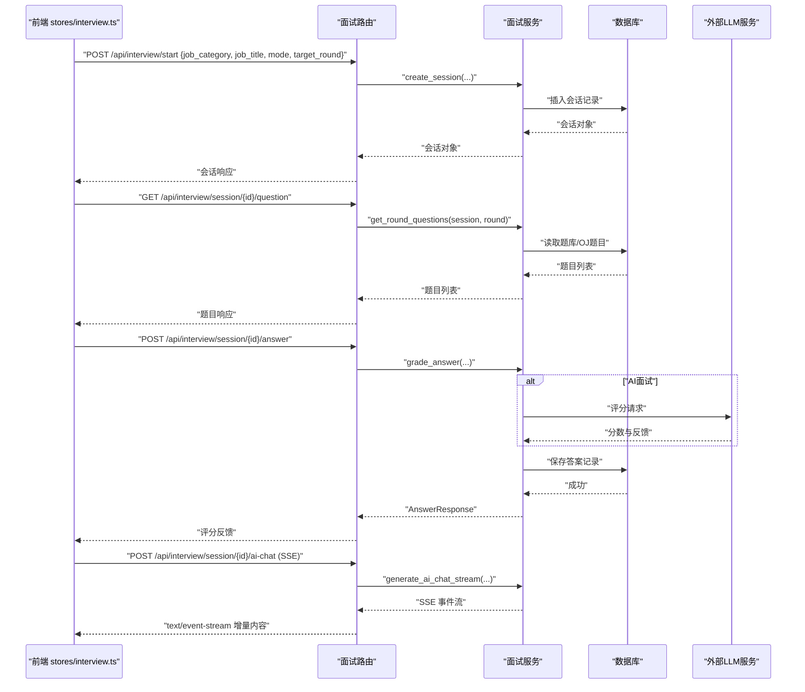
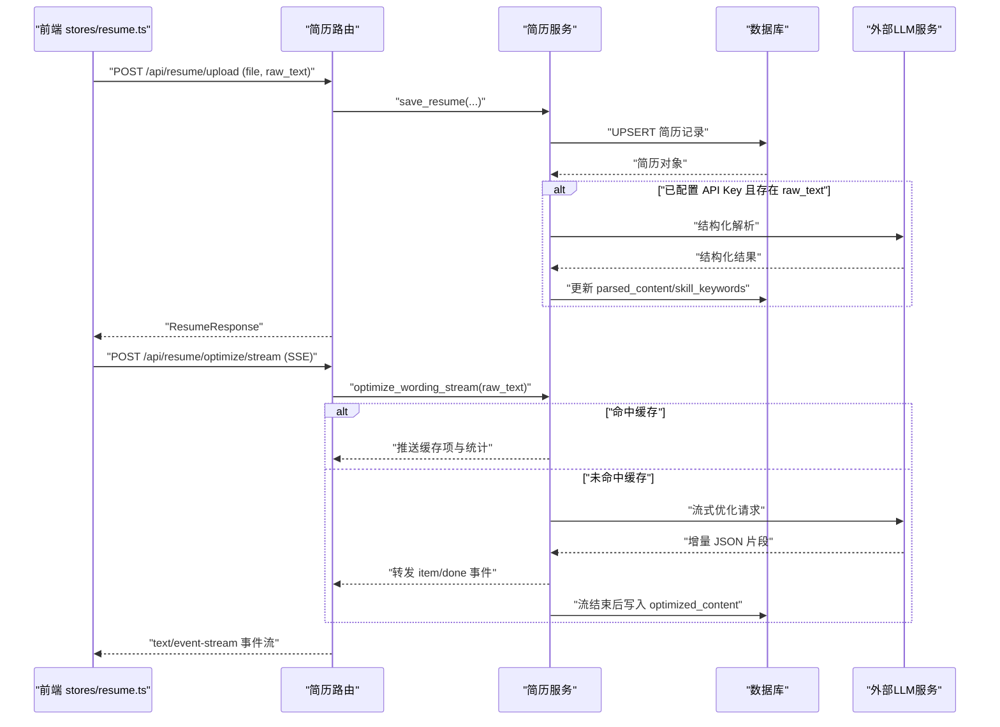
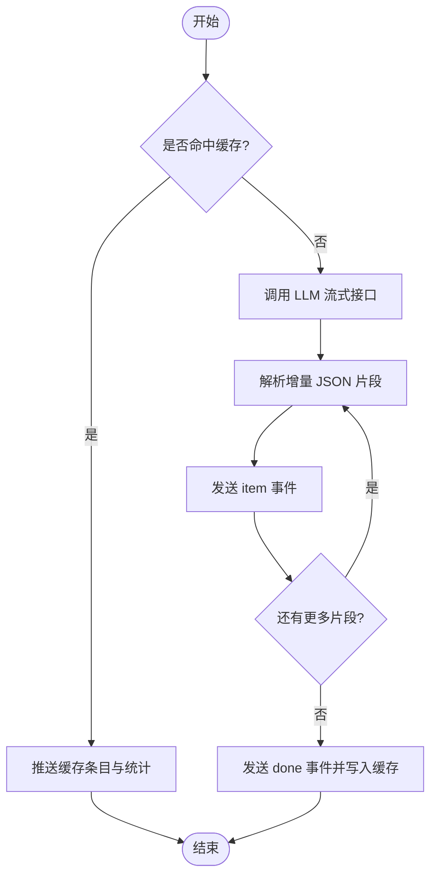
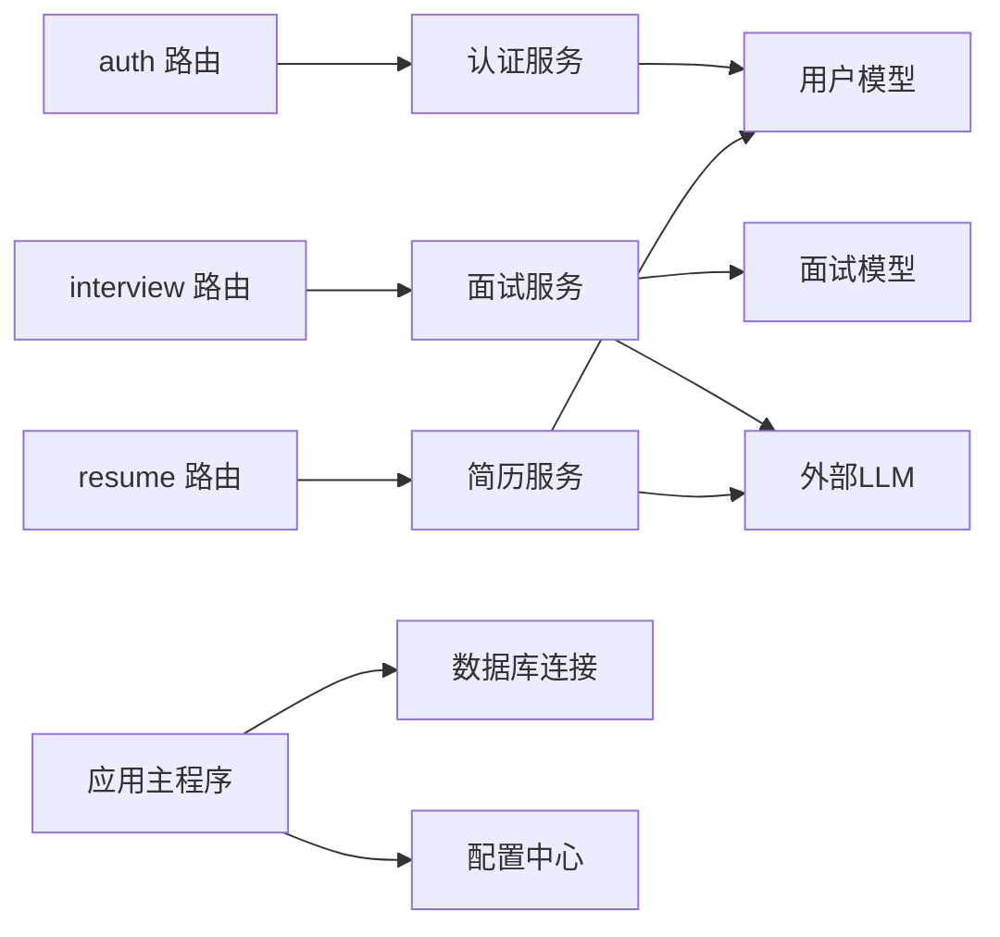

# 数据流设计

<cite>
**本文引用的文件**   
- [backEnd/app/main.py](file://backEnd/app/main.py)
- [backEnd/app/database.py](file://backEnd/app/database.py)
- [backEnd/app/config.py](file://backEnd/app/config.py)
- [backEnd/app/routers/auth.py](file://backEnd/app/routers/auth.py)
- [backEnd/app/routers/interview.py](file://backEnd/app/routers/interview.py)
- [backEnd/app/routers/resume.py](file://backEnd/app/routers/resume.py)
- [backEnd/app/services/auth.py](file://backEnd/app/services/auth.py)
- [backEnd/app/services/interview_service.py](file://backEnd/app/services/interview_service.py)
- [backEnd/app/services/resume_service.py](file://backEnd/app/services/resume_service.py)
- [backEnd/app/models/user.py](file://backEnd/app/models/user.py)
- [backEnd/app/models/interview.py](file://backEnd/app/models/interview.py)
- [frontEnd/src/main.ts](file://frontEnd/src/main.ts)
- [frontEnd/src/router/index.ts](file://frontEnd/src/router/index.ts)
- [frontEnd/src/stores/auth.ts](file://frontEnd/src/stores/auth.ts)
- [frontEnd/src/stores/interview.ts](file://frontEnd/src/stores/interview.ts)
- [frontEnd/src/stores/resume.ts](file://frontEnd/src/stores/resume.ts)
</cite>

## 目录
1. [引言](#引言)
2. [项目结构](#项目结构)
3. [核心组件](#核心组件)
4. [架构总览](#架构总览)
5. [详细组件分析](#详细组件分析)
6. [依赖关系分析](#依赖关系分析)
7. [性能考虑](#性能考虑)
8. [故障排查指南](#故障排查指南)
9. [结论](#结论)
10. [附录](#附录)

## 引言
本文件面向HR XF系统的数据流设计与实现，聚焦以下目标：
- 描述从前端到后端的完整请求处理链路
- 梳理业务逻辑层的数据转换与持久化流程
- 详解关键业务流程的数据流：用户认证、面试模拟、简历优化
- 说明实时数据更新机制（SSE流式响应）
- 文档化数据验证、转换、缓存策略以及错误处理与重试建议

## 项目结构
后端采用 FastAPI + SQLAlchemy 异步 ORM，按路由/服务/模型分层；前端基于 Vue3 + Pinia，使用 fetch 进行 API 调用，通过 SSE 实现流式交互。

图表来源
- [backEnd/app/main.py:1-90](file://backEnd/app/main.py#L1-L90)
- [backEnd/app/database.py:1-58](file://backEnd/app/database.py#L1-L58)
- [backEnd/app/config.py:1-71](file://backEnd/app/config.py#L1-L71)
- [backEnd/app/routers/auth.py:1-217](file://backEnd/app/routers/auth.py#L1-L217)
- [backEnd/app/routers/interview.py:1-317](file://backEnd/app/routers/interview.py#L1-L317)
- [backEnd/app/routers/resume.py:1-215](file://backEnd/app/routers/resume.py#L1-L215)
- [backEnd/app/services/auth.py:1-174](file://backEnd/app/services/auth.py#L1-L174)
- [backEnd/app/services/interview_service.py:1-800](file://backEnd/app/services/interview_service.py#L1-L800)
- [backEnd/app/services/resume_service.py:1-285](file://backEnd/app/services/resume_service.py#L1-L285)
- [backEnd/app/models/user.py:1-45](file://backEnd/app/models/user.py#L1-L45)
- [backEnd/app/models/interview.py:1-114](file://backEnd/app/models/interview.py#L1-L114)
- [frontEnd/src/main.ts:1-19](file://frontEnd/src/main.ts#L1-L19)
- [frontEnd/src/router/index.ts:1-167](file://frontEnd/src/router/index.ts#L1-L167)
- [frontEnd/src/stores/auth.ts:1-314](file://frontEnd/src/stores/auth.ts#L1-L314)
- [frontEnd/src/stores/interview.ts:1-313](file://frontEnd/src/stores/interview.ts#L1-L313)
- [frontEnd/src/stores/resume.ts:1-244](file://frontEnd/src/stores/resume.ts#L1-L244)

章节来源
- [backEnd/app/main.py:1-90](file://backEnd/app/main.py#L1-L90)
- [backEnd/app/database.py:1-58](file://backEnd/app/database.py#L1-L58)
- [backEnd/app/config.py:1-71](file://backEnd/app/config.py#L1-L71)
- [frontEnd/src/main.ts:1-19](file://frontEnd/src/main.ts#L1-L19)
- [frontEnd/src/router/index.ts:1-167](file://frontEnd/src/router/index.ts#L1-L167)

## 核心组件
- 应用启动与生命周期
  - 启动时创建数据库表并初始化种子数据；注册 CORS、挂载静态资源、统一异常处理与健康检查。
- 配置与数据库
  - 集中读取 .env 配置，构建异步引擎与会话工厂；提供 get_db 依赖注入会话并在提交失败时回滚。
- 认证模块
  - 支持邮箱/用户名注册与登录，JWT 无状态鉴权；头像上传与资料更新。
- 面试模块
  - 岗位分类、会话创建与推进、题目获取、答案评分、AI 对话（SSE）、作弊上报、报告生成与历史查询。
- 简历模块
  - 上传/覆盖简历、PDF 文本提取、结构化解析、措辞优化（同步与 SSE 流式），结果缓存至数据库。

章节来源
- [backEnd/app/main.py:27-90](file://backEnd/app/main.py#L27-L90)
- [backEnd/app/database.py:27-58](file://backEnd/app/database.py#L27-L58)
- [backEnd/app/routers/auth.py:25-217](file://backEnd/app/routers/auth.py#L25-L217)
- [backEnd/app/routers/interview.py:26-317](file://backEnd/app/routers/interview.py#L26-L317)
- [backEnd/app/routers/resume.py:19-215](file://backEnd/app/routers/resume.py#L19-L215)

## 架构总览
整体为前后端分离架构：前端通过 REST/SSE 与后端交互，后端以 FastAPI 暴露接口，服务层封装业务逻辑，ORM 访问 MySQL。

图表来源
- [backEnd/app/main.py:44-90](file://backEnd/app/main.py#L44-L90)
- [backEnd/app/routers/auth.py:69-86](file://backEnd/app/routers/auth.py#L69-L86)
- [backEnd/app/routers/interview.py:161-189](file://backEnd/app/routers/interview.py#L161-L189)
- [backEnd/app/routers/resume.py:140-192](file://backEnd/app/routers/resume.py#L140-L192)
- [backEnd/app/services/interview_service.py:797-800](file://backEnd/app/services/interview_service.py#L797-L800)
- [backEnd/app/services/resume_service.py:186-285](file://backEnd/app/services/resume_service.py#L186-L285)

## 详细组件分析

### 用户认证数据流
- 前端在应用启动时尝试恢复本地 token 并校验用户信息；登录成功后将 token 与用户信息写入本地存储。
- 后端对注册/登录请求进行参数校验、密码哈希比对、账号状态检查，签发 JWT 并返回用户信息。
- 后续受保护接口通过依赖注入获取当前用户，确保权限控制。

图表来源
- [frontEnd/src/stores/auth.ts:119-134](file://frontEnd/src/stores/auth.ts#L119-L134)
- [backEnd/app/routers/auth.py:69-86](file://backEnd/app/routers/auth.py#L69-L86)
- [backEnd/app/services/auth.py:85-96](file://backEnd/app/services/auth.py#L85-L96)

章节来源
- [frontEnd/src/main.ts:14-18](file://frontEnd/src/main.ts#L14-L18)
- [frontEnd/src/stores/auth.ts:71-83](file://frontEnd/src/stores/auth.ts#L71-L83)
- [backEnd/app/routers/auth.py:41-86](file://backEnd/app/routers/auth.py#L41-L86)
- [backEnd/app/services/auth.py:38-96](file://backEnd/app/services/auth.py#L38-L96)

### 面试模拟数据流
- 会话生命周期：选择岗位→创建会话→获取轮次题目→答题评分→进入下一轮→完成时生成报告。
- AI 多轮对话采用 SSE 流式响应，前端逐块拼接显示。
- 技术面复用 OJ 判题服务；综合素质/业务面匹配题库标准答案；AI 面由 LLM 评分。

图表来源
- [backEnd/app/routers/interview.py:36-189](file://backEnd/app/routers/interview.py#L36-L189)
- [backEnd/app/services/interview_service.py:489-741](file://backEnd/app/services/interview_service.py#L489-L741)
- [backEnd/app/services/interview_service.py:797-800](file://backEnd/app/services/interview_service.py#L797-L800)
- [frontEnd/src/stores/interview.ts:149-253](file://frontEnd/src/stores/interview.ts#L149-L253)

章节来源
- [backEnd/app/routers/interview.py:36-189](file://backEnd/app/routers/interview.py#L36-L189)
- [backEnd/app/services/interview_service.py:489-741](file://backEnd/app/services/interview_service.py#L489-L741)
- [backEnd/app/services/interview_service.py:797-800](file://backEnd/app/services/interview_service.py#L797-L800)
- [frontEnd/src/stores/interview.ts:149-253](file://frontEnd/src/stores/interview.ts#L149-L253)

### 简历优化数据流（含 SSE 流式）
- 上传简历：保存原始文件与文本，若已配置 API Key 则自动触发结构化解析。
- 结构化解析：调用 LLM 提取技能、经历、教育等结构化信息。
- 措辞优化：优先返回缓存；否则调用 LLM 同步或 SSE 流式生成，并将结果缓存至数据库。

图表来源
- [backEnd/app/routers/resume.py:47-192](file://backEnd/app/routers/resume.py#L47-L192)
- [backEnd/app/services/resume_service.py:40-184](file://backEnd/app/services/resume_service.py#L40-L184)
- [backEnd/app/services/resume_service.py:186-285](file://backEnd/app/services/resume_service.py#L186-L285)
- [frontEnd/src/stores/resume.ts:114-207](file://frontEnd/src/stores/resume.ts#L114-L207)

章节来源
- [backEnd/app/routers/resume.py:47-192](file://backEnd/app/routers/resume.py#L47-L192)
- [backEnd/app/services/resume_service.py:40-184](file://backEnd/app/services/resume_service.py#L40-L184)
- [backEnd/app/services/resume_service.py:186-285](file://backEnd/app/services/resume_service.py#L186-L285)
- [frontEnd/src/stores/resume.ts:114-207](file://frontEnd/src/stores/resume.ts#L114-L207)

### 实时数据更新机制（SSE）
- 面试 AI 对话：后端以 text/event-stream 返回增量内容，前端通过 ReadableStream 解码并按行解析 data: 前缀的事件，拼接展示。
- 简历优化：后端定义 start/item/done 三类事件，前端解析并回调渲染，完成后持久化缓存。

图表来源
- [backEnd/app/routers/interview.py:161-189](file://backEnd/app/routers/interview.py#L161-L189)
- [backEnd/app/routers/resume.py:140-192](file://backEnd/app/routers/resume.py#L140-L192)
- [backEnd/app/services/resume_service.py:186-285](file://backEnd/app/services/resume_service.py#L186-L285)
- [frontEnd/src/stores/interview.ts:209-253](file://frontEnd/src/stores/interview.ts#L209-L253)
- [frontEnd/src/stores/resume.ts:161-207](file://frontEnd/src/stores/resume.ts#L161-L207)

## 依赖关系分析
- 路由层依赖服务层，服务层依赖模型与外部 API（LLM）。
- 数据库连接与会话由应用启动阶段统一初始化，并通过依赖注入在各路由中使用。
- 前端各 store 独立维护领域状态，通过统一的 apiRequest 封装携带 Authorization 头。

图表来源
- [backEnd/app/routers/auth.py:1-217](file://backEnd/app/routers/auth.py#L1-L217)
- [backEnd/app/routers/interview.py:1-317](file://backEnd/app/routers/interview.py#L1-L317)
- [backEnd/app/routers/resume.py:1-215](file://backEnd/app/routers/resume.py#L1-L215)
- [backEnd/app/services/auth.py:1-174](file://backEnd/app/services/auth.py#L1-L174)
- [backEnd/app/services/interview_service.py:1-800](file://backEnd/app/services/interview_service.py#L1-L800)
- [backEnd/app/services/resume_service.py:1-285](file://backEnd/app/services/resume_service.py#L1-L285)
- [backEnd/app/models/user.py:1-45](file://backEnd/app/models/user.py#L1-L45)
- [backEnd/app/models/interview.py:1-114](file://backEnd/app/models/interview.py#L1-L114)
- [backEnd/app/main.py:44-90](file://backEnd/app/main.py#L44-L90)
- [backEnd/app/database.py:27-58](file://backEnd/app/database.py#L27-L58)
- [backEnd/app/config.py:1-71](file://backEnd/app/config.py#L1-L71)

章节来源
- [backEnd/app/main.py:44-90](file://backEnd/app/main.py#L44-L90)
- [backEnd/app/database.py:27-58](file://backEnd/app/database.py#L27-L58)
- [backEnd/app/config.py:1-71](file://backEnd/app/config.py#L1-L71)

## 性能考虑
- 数据库连接池：异步引擎设置 pool_size 与 max_overflow，配合 pool_pre_ping 提升稳定性。
- 流式输出：SSE 避免长轮询开销，降低首字节延迟，提升用户体验。
- 缓存策略：简历优化结果持久化缓存，减少重复 LLM 调用成本。
- 外部 API 超时：LLM 调用设置合理超时，防止阻塞请求。
- 建议：
  - 引入 Redis 缓存热点数据（如岗位分类、热门题目）
  - 对 LLM 调用增加指数退避重试与熔断降级
  - 对大文件上传进行分片与断点续传

[本节为通用指导，不直接分析具体文件]

## 故障排查指南
- 认证失败
  - 检查前端是否正确附加 Authorization 头与 token 有效期
  - 确认后端密码哈希与账号状态校验逻辑
- SSE 中断
  - 检查后端 StreamingResponse 的 headers 与 media_type
  - 前端需正确处理 data: 行与 [DONE] 终止条件
- 数据库异常
  - 观察 get_db 的提交/回滚行为，定位事务边界
  - 核对连接池参数与 ping 兼容性补丁
- LLM 调用失败
  - 校验 API Key、URL、Model 配置
  - 关注超时与网络异常，必要时增加重试与降级

章节来源
- [backEnd/app/database.py:50-58](file://backEnd/app/database.py#L50-L58)
- [backEnd/app/routers/interview.py:161-189](file://backEnd/app/routers/interview.py#L161-L189)
- [backEnd/app/routers/resume.py:140-192](file://backEnd/app/routers/resume.py#L140-L192)
- [backEnd/app/services/resume_service.py:141-172](file://backEnd/app/services/resume_service.py#L141-L172)

## 结论
本数据流设计围绕“清晰分层、流式交互、可观测与可恢复”展开：
- 路由-服务-模型三层解耦，便于扩展与维护
- SSE 用于高体验的实时交互，结合缓存降低外部依赖压力
- 完善的异常处理与事务保障提升系统健壮性
- 未来可通过缓存与重试增强性能与可用性

[本节为总结，不直接分析具体文件]

## 附录
- 前端路由守卫：根据 requiresAuth/requiresAdmin 控制访问
- 应用健康检查：/api/health 用于存活探针

章节来源
- [frontEnd/src/router/index.ts:136-164](file://frontEnd/src/router/index.ts#L136-L164)
- [backEnd/app/main.py:87-90](file://backEnd/app/main.py#L87-L90)