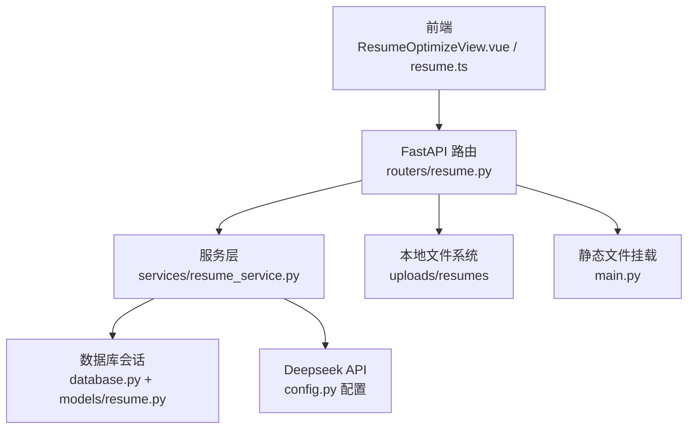
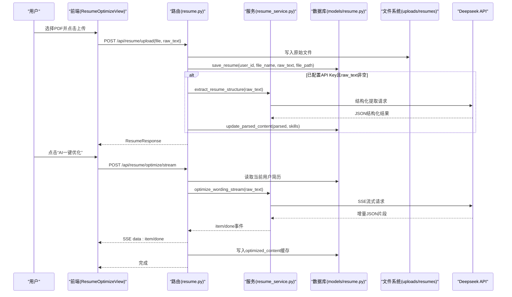
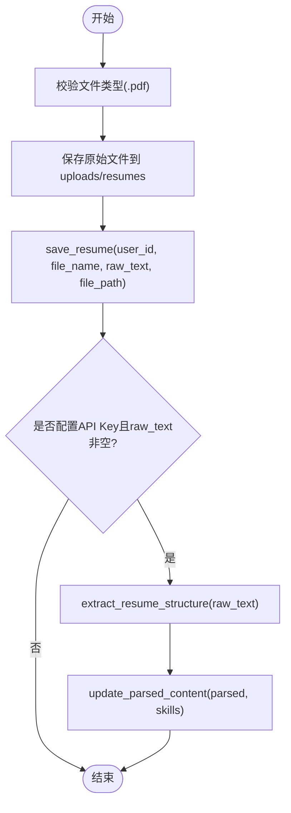
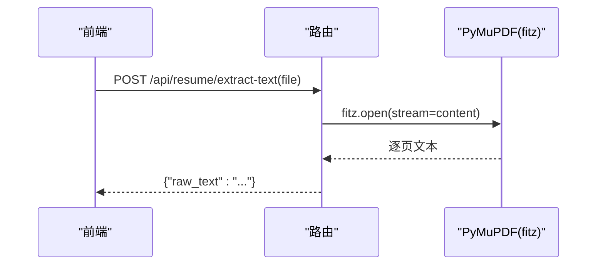
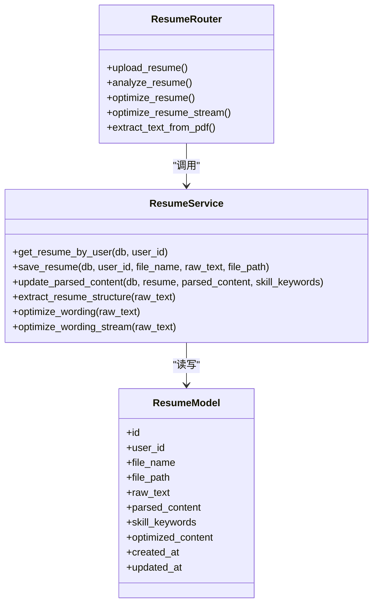
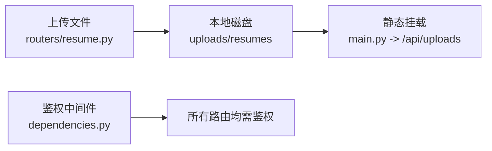
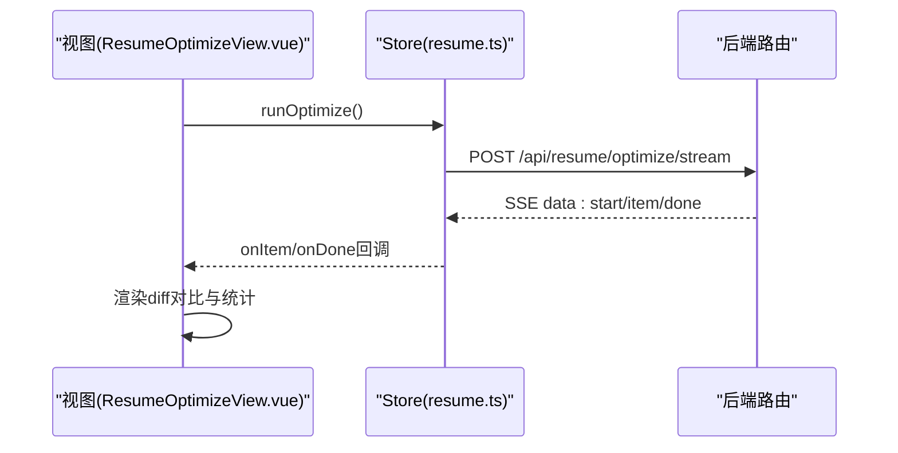
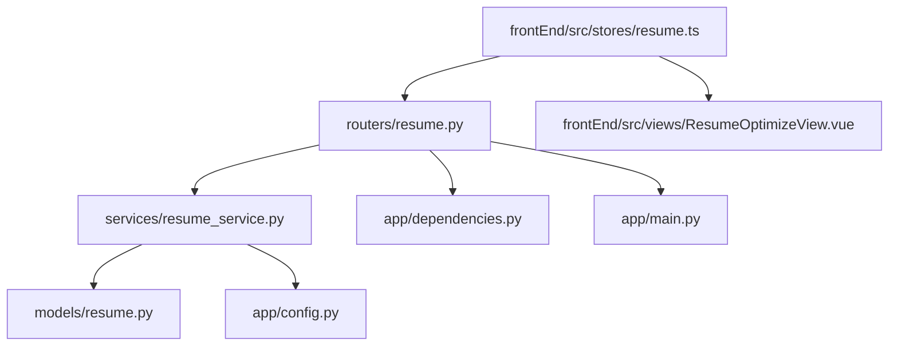

# 文件处理数据流

<cite>
**本文引用的文件**   
- [backEnd/app/routers/resume.py](file://backEnd/app/routers/resume.py)
- [backEnd/app/services/resume_service.py](file://backEnd/app/services/resume_service.py)
- [backEnd/app/models/resume.py](file://backEnd/app/models/resume.py)
- [backEnd/app/schemas/resume.py](file://backEnd/app/schemas/resume.py)
- [backEnd/app/config.py](file://backEnd/app/config.py)
- [backEnd/app/database.py](file://backEnd/app/database.py)
- [backEnd/app/main.py](file://backEnd/app/main.py)
- [backEnd/app/dependencies.py](file://backEnd/app/dependencies.py)
- [frontEnd/src/views/ResumeOptimizeView.vue](file://frontEnd/src/views/ResumeOptimizeView.vue)
- [frontEnd/src/stores/resume.ts](file://frontEnd/src/stores/resume.ts)
- [hr_interview.sql](file://hr_interview.sql)
</cite>

## 目录
1. [引言](#引言)
2. [项目结构](#项目结构)
3. [核心组件](#核心组件)
4. [架构总览](#架构总览)
5. [详细组件分析](#详细组件分析)
6. [依赖关系分析](#依赖关系分析)
7. [性能与可扩展性](#性能与可扩展性)
8. [故障排查指南](#故障排查指南)
9. [结论](#结论)
10. [附录：数据模型与接口契约](#附录数据模型与接口契约)

## 引言
本文件面向HR XF系统的“简历上传—解析—优化”全链路，聚焦后端文件服务的数据流与处理逻辑。文档覆盖以下关键主题：
- 文件接收、格式校验、内容提取（PDF文本抽取）
- 结构化解析（AI驱动的结构化信息提取）
- 智能内容优化（措辞优化与SSE流式输出）
- 文件存储管理、版本控制与访问权限的数据流转
- 前端交互与状态管理在数据流中的角色

目标读者包括后端与前端开发者、系统运维人员以及需要理解该模块数据流转的技术负责人。

## 项目结构
围绕简历功能的核心代码分布如下：
- 路由层：定义REST API，负责鉴权、参数校验、调用服务层
- 服务层：封装业务逻辑，包括数据库CRUD、外部AI服务调用、流式处理
- 模型与Schema：ORM映射与请求/响应数据结构
- 配置与数据库：环境变量、连接池、会话生命周期
- 前端：页面视图与Pinia Store，负责发起请求、展示结果与错误提示

图表来源
- [backEnd/app/routers/resume.py:1-215](file://backEnd/app/routers/resume.py#L1-L215)
- [backEnd/app/services/resume_service.py:1-285](file://backEnd/app/services/resume_service.py#L1-L285)
- [backEnd/app/models/resume.py:1-67](file://backEnd/app/models/resume.py#L1-L67)
- [backEnd/app/config.py:1-71](file://backEnd/app/config.py#L1-L71)
- [backEnd/app/database.py:1-58](file://backEnd/app/database.py#L1-L58)
- [backEnd/app/main.py:60-74](file://backEnd/app/main.py#L60-L74)
- [frontEnd/src/views/ResumeOptimizeView.vue:1-277](file://frontEnd/src/views/ResumeOptimizeView.vue#L1-L277)
- [frontEnd/src/stores/resume.ts:1-244](file://frontEnd/src/stores/resume.ts#L1-L244)

章节来源
- [backEnd/app/routers/resume.py:1-215](file://backEnd/app/routers/resume.py#L1-L215)
- [backEnd/app/services/resume_service.py:1-285](file://backEnd/app/services/resume_service.py#L1-L285)
- [backEnd/app/models/resume.py:1-67](file://backEnd/app/models/resume.py#L1-L67)
- [backEnd/app/schemas/resume.py:1-35](file://backEnd/app/schemas/resume.py#L1-L35)
- [backEnd/app/config.py:1-71](file://backEnd/app/config.py#L1-L71)
- [backEnd/app/database.py:1-58](file://backEnd/app/database.py#L1-L58)
- [backEnd/app/main.py:60-74](file://backEnd/app/main.py#L60-L74)
- [frontEnd/src/views/ResumeOptimizeView.vue:1-277](file://frontEnd/src/views/ResumeOptimizeView.vue#L1-L277)
- [frontEnd/src/stores/resume.ts:1-244](file://frontEnd/src/stores/resume.ts#L1-L244)

## 核心组件
- 路由层（/api/resume/*）
  - 获取配置、获取简历、上传简历、手动触发AI分析、AI优化（同步/流式）、服务端PDF文本提取
- 服务层（resume_service）
  - CRUD操作（保存/更新/查询），Deepseek API调用（结构化提取、措辞优化、流式优化）
- 数据模型（Resume）
  - 用户唯一简历记录，包含原始文本、结构化结果、技能关键词、优化缓存等
- 配置与数据库
  - Deepseek API Key/URL/Model、MySQL异步引擎与会话工厂
- 前端
  - 视图负责UI与交互；Store负责HTTP请求、SSE解析、状态管理

章节来源
- [backEnd/app/routers/resume.py:1-215](file://backEnd/app/routers/resume.py#L1-L215)
- [backEnd/app/services/resume_service.py:1-285](file://backEnd/app/services/resume_service.py#L1-L285)
- [backEnd/app/models/resume.py:1-67](file://backEnd/app/models/resume.py#L1-L67)
- [backEnd/app/schemas/resume.py:1-35](file://backEnd/app/schemas/resume.py#L1-L35)
- [backEnd/app/config.py:1-71](file://backEnd/app/config.py#L1-L71)
- [backEnd/app/database.py:1-58](file://backEnd/app/database.py#L1-L58)
- [frontEnd/src/views/ResumeOptimizeView.vue:1-277](file://frontEnd/src/views/ResumeOptimizeView.vue#L1-L277)
- [frontEnd/src/stores/resume.ts:1-244](file://frontEnd/src/stores/resume.ts#L1-L244)

## 架构总览
整体数据流从前端发起，经FastAPI路由进入服务层，服务层完成文件落盘、数据库持久化、AI调用与结果回写，最终通过REST或SSE返回给前端。

图表来源
- [backEnd/app/routers/resume.py:47-192](file://backEnd/app/routers/resume.py#L47-L192)
- [backEnd/app/services/resume_service.py:174-285](file://backEnd/app/services/resume_service.py#L174-L285)
- [backEnd/app/models/resume.py:11-67](file://backEnd/app/models/resume.py#L11-L67)
- [backEnd/app/main.py:70-74](file://backEnd/app/main.py#L70-L74)

## 详细组件分析

### 组件A：简历上传与结构化解析流程
- 入口：POST /api/resume/upload
- 步骤：
  - 生成唯一文件名并保存到本地磁盘
  - 持久化到数据库（含原始文本与文件路径）
  - 若已配置API Key且有原始文本，则调用AI进行结构化提取
  - 将结构化结果与技能关键词回写到数据库
- 关键点：
  - 每用户仅一条简历记录（user_id唯一约束）
  - 上传后清空结构化与优化缓存，保证一致性

图表来源
- [backEnd/app/routers/resume.py:47-77](file://backEnd/app/routers/resume.py#L47-L77)
- [backEnd/app/services/resume_service.py:40-83](file://backEnd/app/services/resume_service.py#L40-L83)
- [backEnd/app/services/resume_service.py:174-178](file://backEnd/app/services/resume_service.py#L174-L178)

章节来源
- [backEnd/app/routers/resume.py:47-77](file://backEnd/app/routers/resume.py#L47-L77)
- [backEnd/app/services/resume_service.py:40-83](file://backEnd/app/services/resume_service.py#L40-L83)
- [backEnd/app/models/resume.py:11-67](file://backEnd/app/models/resume.py#L11-L67)

### 组件B：PDF文本提取（服务端）
- 入口：POST /api/resume/extract-text
- 使用PyMuPDF在服务端提取PDF文本，避免前端解析差异
- 返回统一JSON字段raw_text供前端继续上传或展示

图表来源
- [backEnd/app/routers/resume.py:195-215](file://backEnd/app/routers/resume.py#L195-L215)

章节来源
- [backEnd/app/routers/resume.py:195-215](file://backEnd/app/routers/resume.py#L195-L215)

### 组件C：AI结构化提取与优化（含SSE流式）
- 结构化提取：
  - 入口：POST /api/resume/analyze 或上传时自动触发
  - 服务层构造Prompt，调用Deepseek API，解析返回的JSON
- 措辞优化：
  - 同步：POST /api/resume/optimize，命中缓存直接返回
  - 流式：POST /api/resume/optimize/stream，SSE推送item/done事件
- 数据落地：
  - optimized_content缓存至数据库，后续请求优先读缓存

图表来源
- [backEnd/app/services/resume_service.py:1-285](file://backEnd/app/services/resume_service.py#L1-285)
- [backEnd/app/routers/resume.py:1-215](file://backEnd/app/routers/resume.py#L1-L215)
- [backEnd/app/models/resume.py:1-67](file://backEnd/app/models/resume.py#L1-L67)

章节来源
- [backEnd/app/services/resume_service.py:141-285](file://backEnd/app/services/resume_service.py#L141-L285)
- [backEnd/app/routers/resume.py:80-192](file://backEnd/app/routers/resume.py#L80-L192)
- [backEnd/app/models/resume.py:11-67](file://backEnd/app/models/resume.py#L11-L67)

### 组件D：文件存储管理与访问权限
- 存储位置：应用根目录下的uploads/resumes
- 访问方式：通过StaticFiles挂载/api/uploads，按相对路径访问
- 权限控制：所有接口均要求Bearer Token鉴权，未认证或无效Token将被拒绝
- 版本控制：
  - 当前实现为“覆盖式”保存（同一用户仅一条记录）
  - 每次上传会重置结构化与优化缓存，确保数据一致性

图表来源
- [backEnd/app/routers/resume.py:21-22](file://backEnd/app/routers/resume.py#L21-L22)
- [backEnd/app/main.py:70-74](file://backEnd/app/main.py#L70-L74)
- [backEnd/app/dependencies.py:13-41](file://backEnd/app/dependencies.py#L13-L41)

章节来源
- [backEnd/app/routers/resume.py:21-22](file://backEnd/app/routers/resume.py#L21-L22)
- [backEnd/app/main.py:70-74](file://backEnd/app/main.py#L70-L74)
- [backEnd/app/dependencies.py:13-41](file://backEnd/app/dependencies.py#L13-L41)

### 组件E：前端数据流与状态管理
- 上传流程：
  - 前端构建FormData，携带file与raw_text，调用/upload
  - 成功后刷新本地简历状态
- 优化流程：
  - 先尝试同步优化，若存在缓存直接返回
  - 流式优化通过SSE边收边渲染，完成后持久化统计信息
- 错误处理：
  - 统一捕获HTTP错误并提示用户

图表来源
- [frontEnd/src/views/ResumeOptimizeView.vue:215-260](file://frontEnd/src/views/ResumeOptimizeView.vue#L215-L260)
- [frontEnd/src/stores/resume.ts:161-207](file://frontEnd/src/stores/resume.ts#L161-L207)
- [backEnd/app/routers/resume.py:140-192](file://backEnd/app/routers/resume.py#L140-L192)

章节来源
- [frontEnd/src/views/ResumeOptimizeView.vue:1-277](file://frontEnd/src/views/ResumeOptimizeView.vue#L1-L277)
- [frontEnd/src/stores/resume.ts:1-244](file://frontEnd/src/stores/resume.ts#L1-L244)

## 依赖关系分析
- 路由层依赖：
  - 依赖服务层进行业务处理
  - 依赖数据库会话进行持久化
  - 依赖配置获取Deepseek API参数
- 服务层依赖：
  - 依赖数据库会话执行CRUD
  - 依赖httpx调用Deepseek API
  - 依赖配置对象获取API Key/URL/Model
- 前端依赖：
  - 依赖后端REST/SSE接口
  - 依赖本地localStorage存储认证令牌

图表来源
- [backEnd/app/routers/resume.py:1-215](file://backEnd/app/routers/resume.py#L1-L215)
- [backEnd/app/services/resume_service.py:1-285](file://backEnd/app/services/resume_service.py#L1-L285)
- [backEnd/app/models/resume.py:1-67](file://backEnd/app/models/resume.py#L1-L67)
- [backEnd/app/config.py:1-71](file://backEnd/app/config.py#L1-L71)
- [backEnd/app/dependencies.py:1-41](file://backEnd/app/dependencies.py#L1-L41)
- [backEnd/app/main.py:60-74](file://backEnd/app/main.py#L60-L74)
- [frontEnd/src/stores/resume.ts:1-244](file://frontEnd/src/stores/resume.ts#L1-L244)
- [frontEnd/src/views/ResumeOptimizeView.vue:1-277](file://frontEnd/src/views/ResumeOptimizeView.vue#L1-L277)

章节来源
- [backEnd/app/routers/resume.py:1-215](file://backEnd/app/routers/resume.py#L1-L215)
- [backEnd/app/services/resume_service.py:1-285](file://backEnd/app/services/resume_service.py#L1-L285)
- [backEnd/app/models/resume.py:1-67](file://backEnd/app/models/resume.py#L1-L67)
- [backEnd/app/config.py:1-71](file://backEnd/app/config.py#L1-L71)
- [backEnd/app/dependencies.py:1-41](file://backEnd/app/dependencies.py#L1-L41)
- [backEnd/app/main.py:60-74](file://backEnd/app/main.py#L60-L74)
- [frontEnd/src/stores/resume.ts:1-244](file://frontEnd/src/stores/resume.ts#L1-L244)
- [frontEnd/src/views/ResumeOptimizeView.vue:1-277](file://frontEnd/src/views/ResumeOptimizeView.vue#L1-L277)

## 性能与可扩展性
- 流式优化：
  - 采用SSE逐步推送item与done事件，降低首屏等待时间
  - 后端对JSON片段进行边界识别，提高解析稳定性
- 缓存策略：
  - 优化结果持久化到数据库，后续请求直接命中缓存
  - 上传新简历时主动失效优化缓存，保证一致性
- 并发与连接池：
  - 使用异步数据库会话与连接池，提升吞吐
  - httpx异步客户端用于外部API调用，避免阻塞
- 扩展建议：
  - 引入消息队列异步处理结构化提取与优化任务
  - 增加分布式缓存（如Redis）以跨实例共享优化结果
  - 文件存储迁移至对象存储（MinIO/S3），支持分片与CDN加速

[本节为通用指导，不直接分析具体文件]

## 故障排查指南
- 未配置API Key：
  - 现象：优化与分析接口返回未配置错误
  - 处理：在.env中设置DEEPSEEK_API_KEY并重启服务
- PDF提取失败：
  - 现象：服务端返回PDF文本提取失败
  - 处理：检查文件是否为有效PDF，确认PyMuPDF可用
- 鉴权失败：
  - 现象：401未授权
  - 处理：确认Authorization头携带有效Bearer Token
- 数据库异常：
  - 现象：提交失败或事务回滚
  - 处理：检查数据库连接与表结构，关注alembic迁移版本

章节来源
- [backEnd/app/routers/resume.py:89-97](file://backEnd/app/routers/resume.py#L89-L97)
- [backEnd/app/routers/resume.py:195-215](file://backEnd/app/routers/resume.py#L195-L215)
- [backEnd/app/dependencies.py:13-41](file://backEnd/app/dependencies.py#L13-L41)
- [backEnd/app/database.py:50-58](file://backEnd/app/database.py#L50-L58)

## 结论
本系统实现了从前端上传到后端解析、结构化提取与智能优化的完整数据流。通过SSE流式输出与数据库缓存机制，显著提升了用户体验与系统效率。未来可通过异步化、缓存与对象存储进一步扩展与优化。

[本节为总结，不直接分析具体文件]

## 附录：数据模型与接口契约

### 数据模型（resumes表）
- 主键：id（UUID）
- 唯一外键：user_id（关联users.id）
- 字段：
  - file_name：原始文件名
  - file_path：服务器存储路径
  - raw_text：PDF提取的原始文本
  - parsed_content：结构化解析结果（JSON）
  - skill_keywords：技能关键词列表（JSON）
  - optimized_content：AI措辞优化结果（JSON）
  - created_at/updated_at：时间戳

章节来源
- [backEnd/app/models/resume.py:11-67](file://backEnd/app/models/resume.py#L11-L67)
- [hr_interview.sql:441-456](file://hr_interview.sql#L441-L456)

### 接口契约（摘要）
- GET /api/resume/config
  - 返回：has_api_key（布尔）
- GET /api/resume/
  - 返回：ResumeResponse（包含parsed_content、skill_keywords等）
- POST /api/resume/upload
  - 入参：file（PDF）、raw_text（可选）
  - 返回：ResumeResponse
- POST /api/resume/analyze
  - 返回：ResumeResponse（更新parsed_content与skill_keywords）
- POST /api/resume/optimize
  - 返回：ResumeOptimizeResponse（original、optimized、stats）
- POST /api/resume/optimize/stream
  - 协议：SSE（data: start/item/done）
- POST /api/resume/extract-text
  - 入参：file（PDF）
  - 返回：{raw_text: string}

章节来源
- [backEnd/app/routers/resume.py:25-215](file://backEnd/app/routers/resume.py#L25-L215)
- [backEnd/app/schemas/resume.py:11-35](file://backEnd/app/schemas/resume.py#L11-L35)