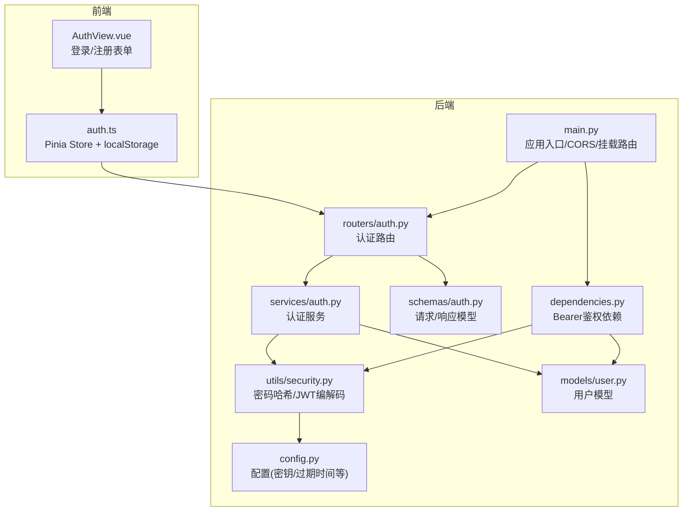
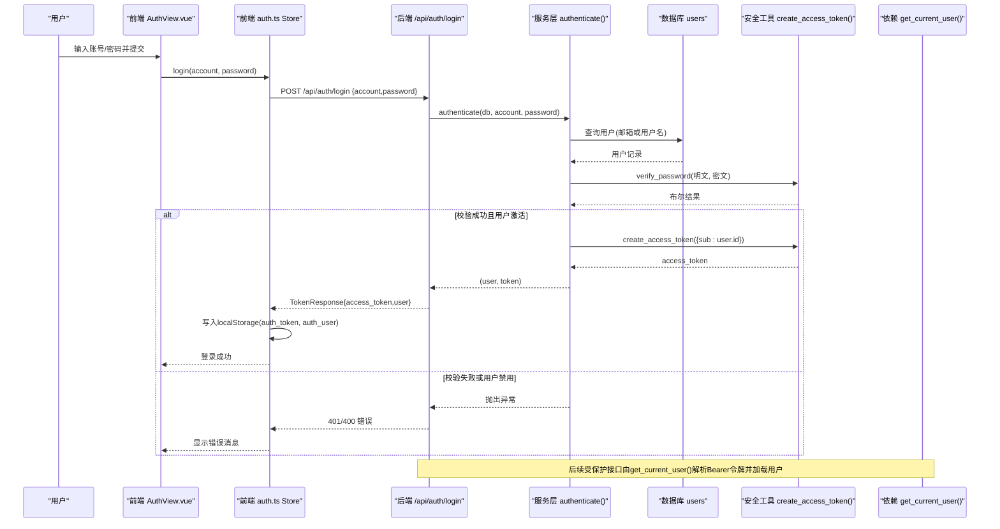
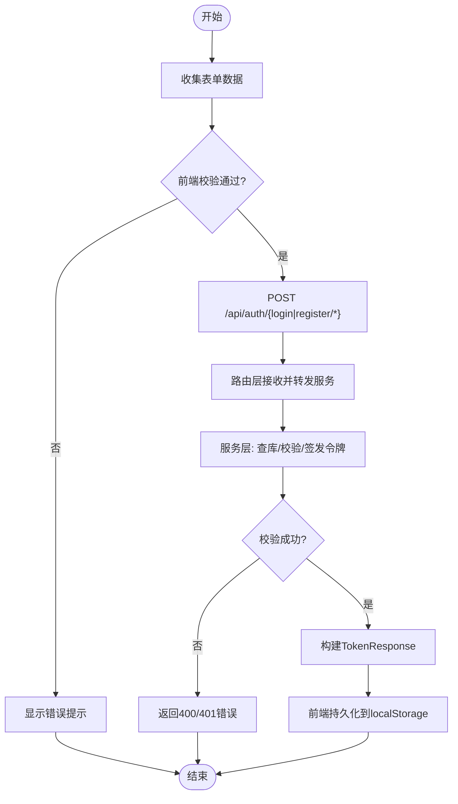
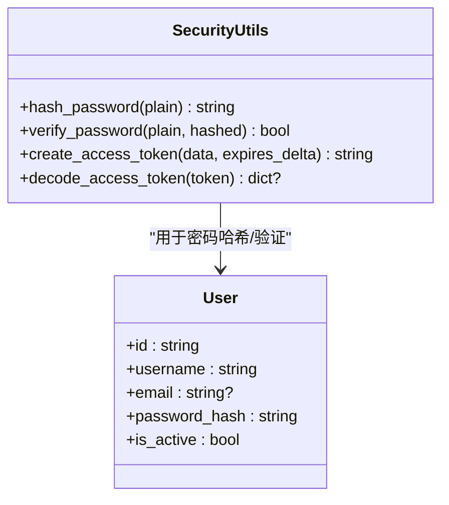
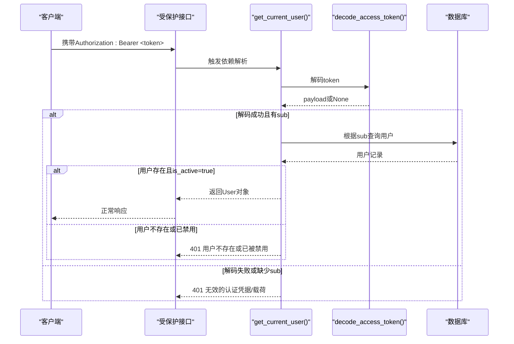
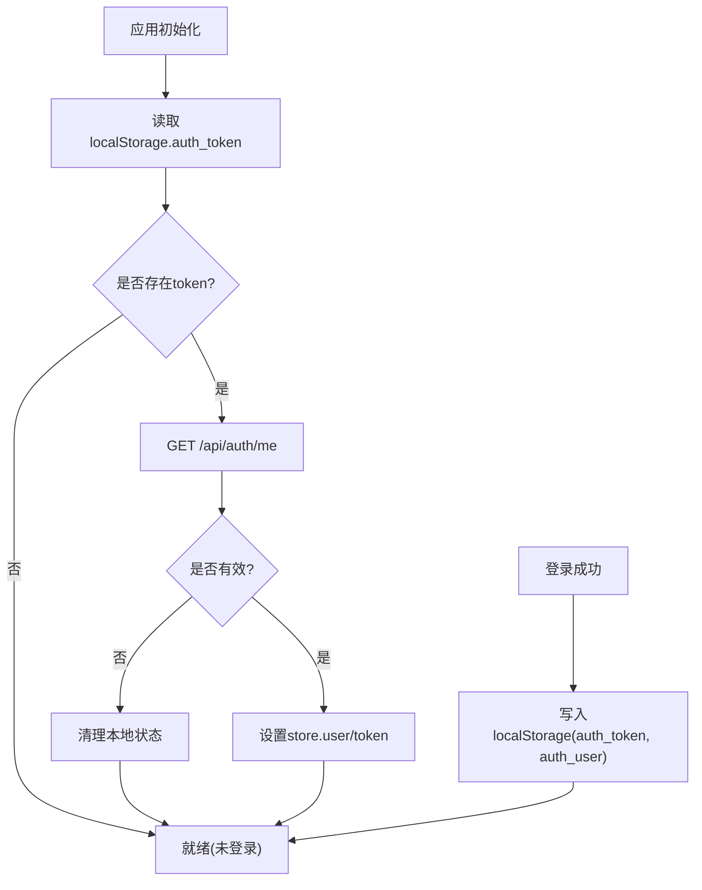
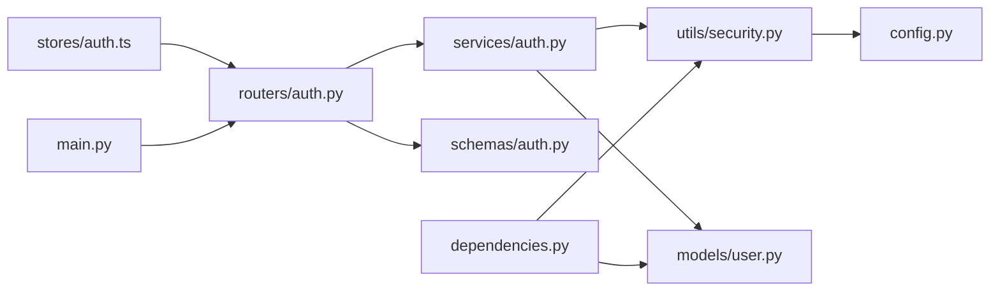

# 认证数据流

<cite>
**本文引用的文件**   
- [backEnd/app/main.py](file://backEnd/app/main.py)
- [backEnd/app/routers/auth.py](file://backEnd/app/routers/auth.py)
- [backEnd/app/services/auth.py](file://backEnd/app/services/auth.py)
- [backEnd/app/schemas/auth.py](file://backEnd/app/schemas/auth.py)
- [backEnd/app/utils/security.py](file://backEnd/app/utils/security.py)
- [backEnd/app/dependencies.py](file://backEnd/app/dependencies.py)
- [backEnd/app/models/user.py](file://backEnd/app/models/user.py)
- [backEnd/app/config.py](file://backEnd/app/config.py)
- [frontEnd/src/stores/auth.ts](file://frontEnd/src/stores/auth.ts)
- [frontEnd/src/views/AuthView.vue](file://frontEnd/src/views/AuthView.vue)
</cite>

## 目录
1. [简介](#简介)
2. [项目结构](#项目结构)
3. [核心组件](#核心组件)
4. [架构总览](#架构总览)
5. [详细组件分析](#详细组件分析)
6. [依赖关系分析](#依赖关系分析)
7. [性能与安全考量](#性能与安全考量)
8. [故障排查指南](#故障排查指南)
9. [结论](#结论)
10. [附录：接口与错误码](#附录接口与错误码)

## 简介
本文件面向HR XF系统的认证子系统，系统化梳理从前端表单提交到后端签发JWT令牌的完整数据流转链路。文档覆盖以下关键点：
- 登录、注册流程的数据交互与校验
- 密码加密存储与比对机制
- JWT令牌签发与鉴权中间件（依赖注入）的工作方式
- 前端状态管理中的认证信息持久化与自动恢复
- 会话管理与无状态鉴权的边界
- 关键时序图与错误处理路径

说明：当前实现为无状态JWT方案，未提供独立的“刷新令牌”端点；当访问令牌过期时，需重新登录获取新令牌。

## 项目结构
认证相关代码在后端采用分层组织：路由层负责HTTP协议与参数校验，服务层封装业务逻辑，安全工具提供密码哈希与JWT编解码，依赖注入完成鉴权解析；前端通过Pinia Store集中管理认证状态并持久化至localStorage。

图表来源
- [backEnd/app/main.py:44-68](file://backEnd/app/main.py#L44-L68)
- [backEnd/app/routers/auth.py:25-86](file://backEnd/app/routers/auth.py#L25-L86)
- [backEnd/app/services/auth.py:85-96](file://backEnd/app/services/auth.py#L85-L96)
- [backEnd/app/utils/security.py:26-47](file://backEnd/app/utils/security.py#L26-L47)
- [backEnd/app/dependencies.py:13-40](file://backEnd/app/dependencies.py#L13-L40)
- [backEnd/app/models/user.py:10-45](file://backEnd/app/models/user.py#L10-L45)
- [backEnd/app/config.py:20-24](file://backEnd/app/config.py#L20-L24)
- [frontEnd/src/stores/auth.ts:35-61](file://frontEnd/src/stores/auth.ts#L35-L61)
- [frontEnd/src/views/AuthView.vue:384-416](file://frontEnd/src/views/AuthView.vue#L384-L416)

章节来源
- [backEnd/app/main.py:44-68](file://backEnd/app/main.py#L44-L68)
- [frontEnd/src/stores/auth.ts:35-61](file://frontEnd/src/stores/auth.ts#L35-L61)

## 核心组件
- 路由层（认证API）
  - 登录、注册、登出、个人资料、头像上传、账号设置等端点
  - 统一返回TokenResponse或UserResponse
- 服务层（认证业务）
  - 按邮箱/用户名注册、通用账户登录、资料更新、密码修改、账号注销
  - 调用安全工具进行密码哈希与JWT签发
- 安全工具
  - bcrypt密码哈希与验证
  - JWT access_token的创建与解码
- 依赖注入（鉴权中间件）
  - 基于HTTP Bearer的依赖，解析token并加载活跃用户
- 前端Store
  - 封装API请求、自动附加Authorization头、本地持久化与初始化恢复
- 配置
  - JWT密钥、算法、过期时间等

章节来源
- [backEnd/app/routers/auth.py:69-86](file://backEnd/app/routers/auth.py#L69-L86)
- [backEnd/app/services/auth.py:38-96](file://backEnd/app/services/auth.py#L38-L96)
- [backEnd/app/utils/security.py:18-47](file://backEnd/app/utils/security.py#L18-L47)
- [backEnd/app/dependencies.py:13-40](file://backEnd/app/dependencies.py#L13-L40)
- [frontEnd/src/stores/auth.ts:65-83](file://frontEnd/src/stores/auth.ts#L65-L83)
- [backEnd/app/config.py:20-24](file://backEnd/app/config.py#L20-L24)

## 架构总览
下图展示一次典型登录请求的端到端数据流：前端表单提交 → 路由接收 → 服务层校验与签发 → 返回令牌 → 前端持久化并恢复会话。

图表来源
- [frontEnd/src/views/AuthView.vue:384-416](file://frontEnd/src/views/AuthView.vue#L384-L416)
- [frontEnd/src/stores/auth.ts:119-134](file://frontEnd/src/stores/auth.ts#L119-134)
- [backEnd/app/routers/auth.py:69-80](file://backEnd/app/routers/auth.py#L69-L80)
- [backEnd/app/services/auth.py:85-96](file://backEnd/app/services/auth.py#L85-L96)
- [backEnd/app/utils/security.py:22-36](file://backEnd/app/utils/security.py#L22-L36)
- [backEnd/app/dependencies.py:13-40](file://backEnd/app/dependencies.py#L13-L40)

## 详细组件分析

### 登录与注册数据流
- 登录
  - 前端：AuthView收集账号与密码，调用Store.login
  - Store：POST /api/auth/login，成功后将access_token与user写入localStorage
  - 路由：调用authenticate服务，校验凭据并签发access_token
  - 服务：根据account查找用户，校验密码与激活状态，生成JWT
  - 安全：bcrypt验证密码，JWT使用HS256与配置的secret_key和过期时间
- 注册
  - 支持邮箱注册与用户名注册两种模式
  - 邮箱注册时自动生成username（冲突则追加随机后缀）
  - 注册成功后同样返回access_token与用户信息

图表来源
- [frontEnd/src/views/AuthView.vue:384-416](file://frontEnd/src/views/AuthView.vue#L384-L416)
- [frontEnd/src/stores/auth.ts:85-134](file://frontEnd/src/stores/auth.ts#L85-L134)
- [backEnd/app/routers/auth.py:41-80](file://backEnd/app/routers/auth.py#L41-L80)
- [backEnd/app/services/auth.py:38-96](file://backEnd/app/services/auth.py#L38-L96)

章节来源
- [backEnd/app/routers/auth.py:41-80](file://backEnd/app/routers/auth.py#L41-L80)
- [backEnd/app/services/auth.py:38-96](file://backEnd/app/services/auth.py#L38-L96)
- [frontEnd/src/stores/auth.ts:85-134](file://frontEnd/src/stores/auth.ts#L85-L134)
- [frontEnd/src/views/AuthView.vue:384-416](file://frontEnd/src/views/AuthView.vue#L384-L416)

### 密码加密与比对
- 存储：使用bcrypt对用户密码进行哈希后存入users.password_hash
- 比对：登录与改密时使用相同策略对明文进行截断与哈希后再比对
- 注意：bcrypt最大支持72字节，超长密码会被安全截断

图表来源
- [backEnd/app/utils/security.py:18-24](file://backEnd/app/utils/security.py#L18-L24)
- [backEnd/app/models/user.py:24-25](file://backEnd/app/models/user.py#L24-L25)

章节来源
- [backEnd/app/utils/security.py:13-24](file://backEnd/app/utils/security.py#L13-L24)
- [backEnd/app/models/user.py:24-25](file://backEnd/app/models/user.py#L24-L25)

### JWT令牌签发与鉴权中间件
- 签发
  - 载荷包含用户标识sub与exp过期时间
  - 使用配置的secret_key与algorithm（默认HS256），过期时间来自配置
- 鉴权
  - 依赖get_current_user从请求头提取Bearer令牌
  - 解码payload，校验sub存在，再查库确认用户存在且未被禁用
  - 失败返回401并附带WWW-Authenticate头

图表来源
- [backEnd/app/dependencies.py:13-40](file://backEnd/app/dependencies.py#L13-L40)
- [backEnd/app/utils/security.py:39-47](file://backEnd/app/utils/security.py#L39-L47)
- [backEnd/app/models/user.py:25](file://backEnd/app/models/user.py#L25)

章节来源
- [backEnd/app/dependencies.py:13-40](file://backEnd/app/dependencies.py#L13-L40)
- [backEnd/app/utils/security.py:26-47](file://backEnd/app/utils/security.py#L26-L47)
- [backEnd/app/config.py:20-24](file://backEnd/app/config.py#L20-L24)

### 前端状态管理与令牌持久化
- 初始化
  - 应用启动时读取localStorage中的auth_token，若存在则调用/api/auth/me验证有效性，无效则清理本地状态
- 登录/注册
  - 成功后将access_token与user写入localStorage，并在内存中维护user与token
- 后续请求
  - 所有受保护请求自动在请求头添加Authorization: Bearer <token>
- 登出
  - 清除内存与localStorage中的认证信息

图表来源
- [frontEnd/src/stores/auth.ts:71-83](file://frontEnd/src/stores/auth.ts#L71-L83)
- [frontEnd/src/stores/auth.ts:288-293](file://frontEnd/src/stores/auth.ts#L288-L293)
- [frontEnd/src/stores/auth.ts:137-142](file://frontEnd/src/stores/auth.ts#L137-L142)

章节来源
- [frontEnd/src/stores/auth.ts:71-83](file://frontEnd/src/stores/auth.ts#L71-L83)
- [frontEnd/src/stores/auth.ts:288-293](file://frontEnd/src/stores/auth.ts#L288-L293)
- [frontEnd/src/stores/auth.ts:137-142](file://frontEnd/src/stores/auth.ts#L137-L142)

### 权限校验与会话管理
- 权限校验
  - 当前实现仅做身份校验（是否登录且用户活跃），未实现细粒度角色/资源级权限控制
- 会话管理
  - 无状态JWT方案：服务端不保存会话，客户端负责令牌生命周期
  - 登出即丢弃令牌，无需服务端失效列表

章节来源
- [backEnd/app/dependencies.py:13-40](file://backEnd/app/dependencies.py#L13-L40)
- [backEnd/app/routers/auth.py:83-86](file://backEnd/app/routers/auth.py#L83-86)

## 依赖关系分析
- 模块耦合
  - 路由层依赖服务层与Schema模型
  - 服务层依赖安全工具与数据库模型
  - 依赖注入依赖安全工具与数据库模型
  - 前端Store依赖后端认证路由
- 外部依赖
  - JWT编解码（jose）、密码哈希（passlib/bcrypt）、异步ORM（SQLAlchemy async）

图表来源
- [backEnd/app/routers/auth.py:1-24](file://backEnd/app/routers/auth.py#L1-24)
- [backEnd/app/services/auth.py:1-11](file://backEnd/app/services/auth.py#L1-11)
- [backEnd/app/dependencies.py:1-9](file://backEnd/app/dependencies.py#L1-9)
- [frontEnd/src/stores/auth.ts:35-61](file://frontEnd/src/stores/auth.ts#L35-L61)
- [backEnd/app/main.py:60-68](file://backEnd/app/main.py#L60-L68)
- [backEnd/app/utils/security.py:1-8](file://backEnd/app/utils/security.py#L1-8)

章节来源
- [backEnd/app/routers/auth.py:1-24](file://backEnd/app/routers/auth.py#L1-24)
- [backEnd/app/services/auth.py:1-11](file://backEnd/app/services/auth.py#L1-11)
- [backEnd/app/dependencies.py:1-9](file://backEnd/app/dependencies.py#L1-9)
- [frontEnd/src/stores/auth.ts:35-61](file://frontEnd/src/stores/auth.ts#L35-L61)
- [backEnd/app/main.py:60-68](file://backEnd/app/main.py#L60-L68)
- [backEnd/app/utils/security.py:1-8](file://backEnd/app/utils/security.py#L1-8)

## 性能与安全考量
- 性能
  - bcrypt哈希计算开销较大，建议仅在注册/改密时执行；登录频繁场景可考虑缓存热点用户（谨慎权衡一致性）
  - 数据库查询使用唯一索引字段（username/email/id），检索效率良好
- 安全
  - 使用HTTPS传输，避免明文泄露
  - secret_key应严格保密，生产环境必须替换默认值
  - 建议增加登录失败次数限制与验证码防护
  - 未来可引入双令牌（access/refresh）与黑名单/灰度失效机制以增强安全性

[本节为通用指导，不直接分析具体文件]

## 故障排查指南
- 常见错误
  - 401 无效的认证凭据/载荷：token缺失、格式错误或签名不匹配
  - 401 用户不存在或已被禁用：用户被注销或禁用
  - 400 账号或密码错误/该邮箱已被注册/该用户名已被占用：业务校验失败
- 定位步骤
  - 检查浏览器Network面板的请求头是否包含Authorization: Bearer
  - 查看前端localStorage中auth_token与auth_user是否正确写入
  - 核对后端日志与服务端返回的detail字段
  - 确认数据库用户记录与is_active状态
- 调试建议
  - 临时开启更详细的日志输出
  - 使用健康检查接口确认服务可用
  - 复现最小用例，逐步缩小问题范围

章节来源
- [backEnd/app/routers/auth.py:74-80](file://backEnd/app/routers/auth.py#L74-L80)
- [backEnd/app/dependencies.py:18-38](file://backEnd/app/dependencies.py#L18-L38)
- [backEnd/app/main.py:87-89](file://backEnd/app/main.py#L87-L89)

## 结论
本系统采用无状态JWT鉴权，前后端职责清晰：后端负责凭据校验与令牌签发，前端负责令牌持久化与自动恢复。当前未实现独立刷新令牌机制，建议在后续迭代中引入双令牌与刷新策略以提升用户体验与安全性。

[本节为总结性内容，不直接分析具体文件]

## 附录：接口与错误码
- 认证相关接口
  - POST /api/auth/register/email
  - POST /api/auth/register/username
  - POST /api/auth/login
  - POST /api/auth/logout
  - GET /api/auth/me
  - GET /api/auth/profile
  - PUT /api/auth/profile
  - PUT /api/auth/username
  - PUT /api/auth/email
  - PUT /api/auth/password
  - DELETE /api/auth/account
  - POST /api/auth/avatar
- 主要错误码
  - 201 注册成功
  - 200 登录/其他操作成功
  - 400 参数或业务校验失败
  - 401 认证失败或用户不可用
  - 422 请求体校验失败（FastAPI内置）

章节来源
- [backEnd/app/routers/auth.py:41-216](file://backEnd/app/routers/auth.py#L41-L216)
- [backEnd/app/schemas/auth.py:9-36](file://backEnd/app/schemas/auth.py#L9-36)
- [backEnd/app/schemas/auth.py:56-68](file://backEnd/app/schemas/auth.py#L56-68)