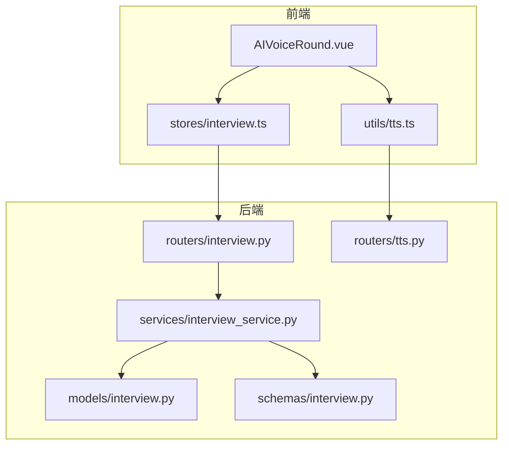
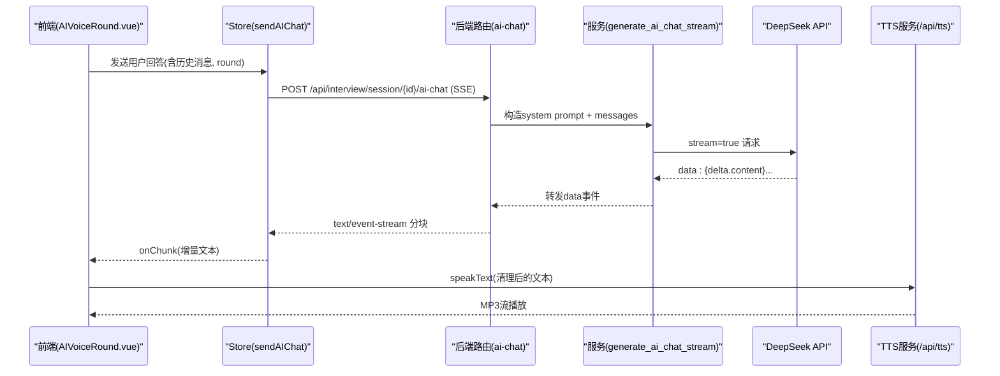
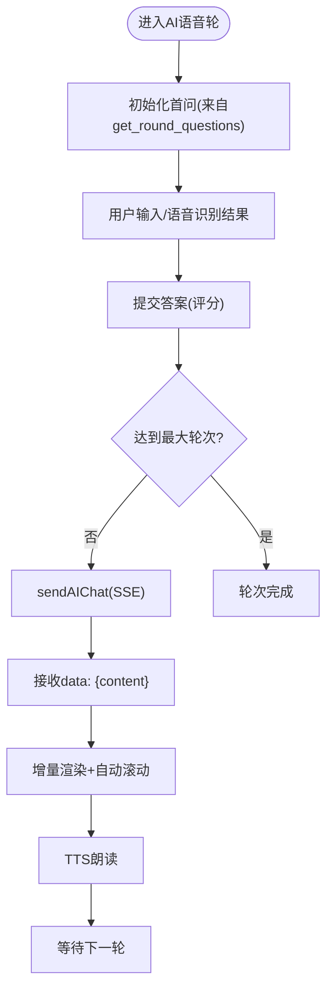
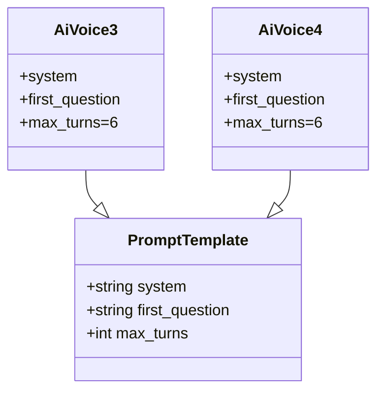
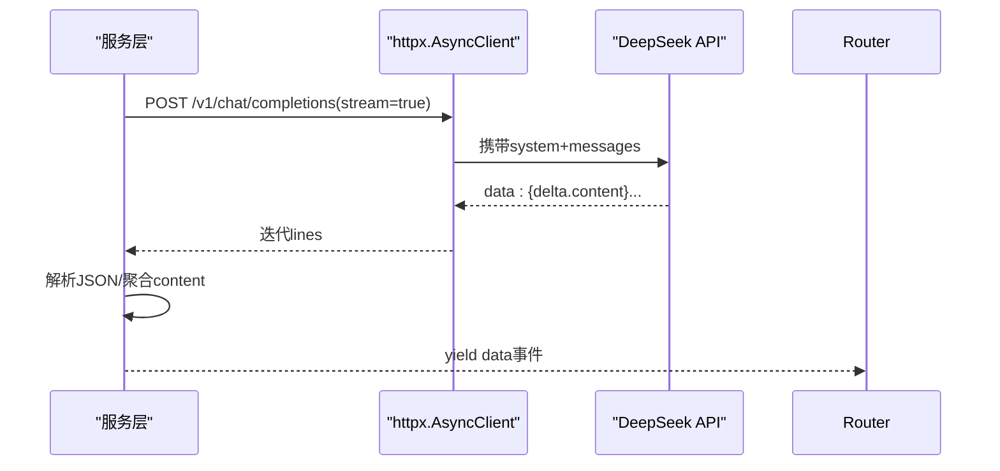
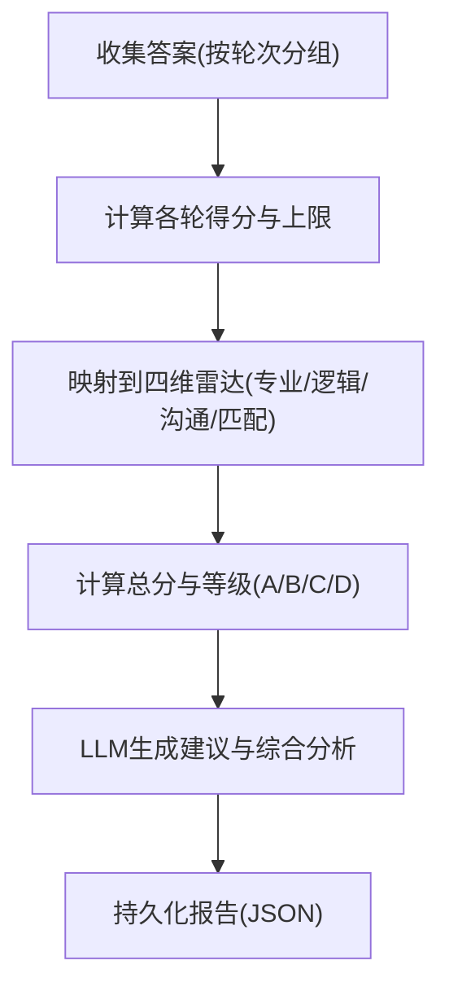
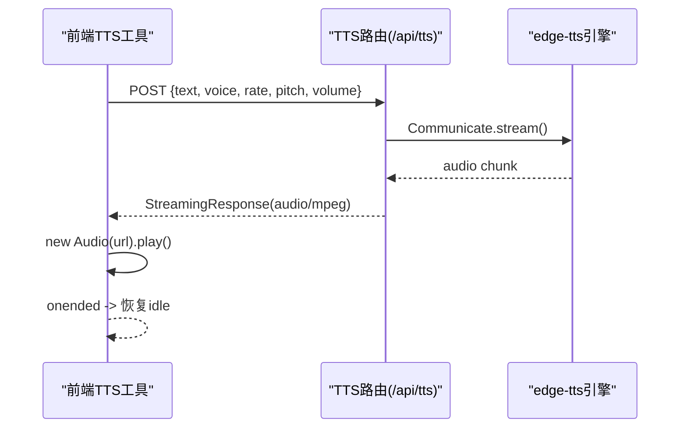
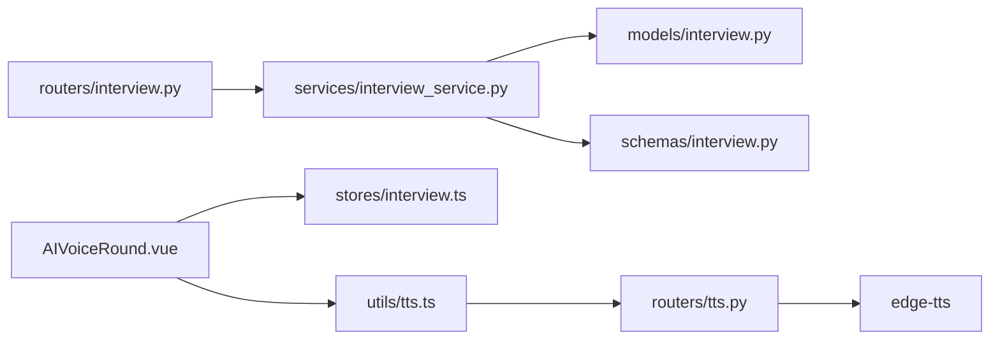
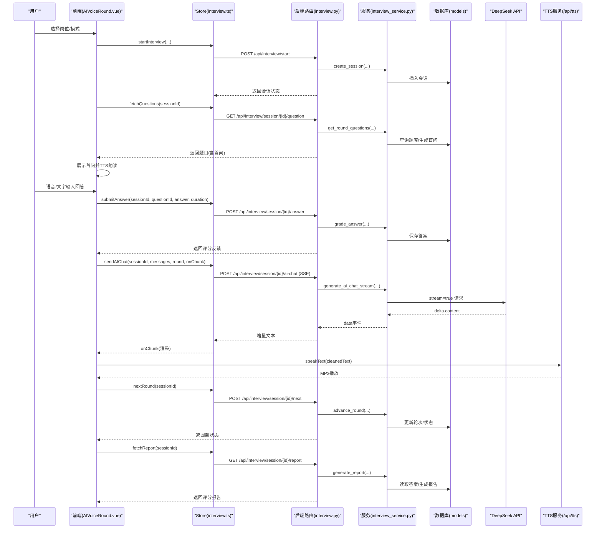

# AI语音面试数据流

<cite>
**本文引用的文件**   
- [backEnd/app/routers/interview.py](file://backEnd/app/routers/interview.py)
- [backEnd/app/services/interview_service.py](file://backEnd/app/services/interview_service.py)
- [backEnd/app/models/interview.py](file://backEnd/app/models/interview.py)
- [backEnd/app/schemas/interview.py](file://backEnd/app/schemas/interview.py)
- [backEnd/app/routers/tts.py](file://backEnd/app/routers/tts.py)
- [frontEnd/src/components/interview/AIVoiceRound.vue](file://frontEnd/src/components/interview/AIVoiceRound.vue)
- [frontEnd/src/stores/interview.ts](file://frontEnd/src/stores/interview.ts)
- [frontEnd/src/utils/tts.ts](file://frontEnd/src/utils/tts.ts)
</cite>

## 目录
1. [简介](#简介)
2. [项目结构](#项目结构)
3. [核心组件](#核心组件)
4. [架构总览](#架构总览)
5. [详细组件分析](#详细组件分析)
6. [依赖关系分析](#依赖关系分析)
7. [性能与稳定性](#性能与稳定性)
8. [故障排查指南](#故障排查指南)
9. [结论](#结论)
10. [附录：关键时序图](#附录关键时序图)

## 简介
本文件面向HR XF系统的AI语音面试模块，系统化梳理从前端到后端的SSE流式对话、TTS语音合成、LLM集成、评分算法与报告生成等全链路数据流。重点覆盖：
- SSE实时对话建立、消息推送与音频播放控制
- AI_INTERVIEW_PROMPTS模板系统（不同轮次策略、追问逻辑、压力测试）
- LLM对话集成流程（Prompt构建、API调用、流式响应处理、JSON解析）
- AI面试评分算法（回答质量、语言表达、职业素养判断）
- TTS服务集成（文本转音频、播放控制、格式处理）
- 完整前后端协同时序图

## 项目结构
后端采用FastAPI路由+服务分层，数据库模型与Pydantic Schema分离；前端基于Vue3+Pinia，封装SSE客户端与TTS工具。

图表来源
- [backEnd/app/routers/interview.py:1-317](file://backEnd/app/routers/interview.py#L1-L317)
- [backEnd/app/services/interview_service.py:1-1202](file://backEnd/app/services/interview_service.py#L1-L1202)
- [backEnd/app/models/interview.py:1-114](file://backEnd/app/models/interview.py#L1-L114)
- [backEnd/app/schemas/interview.py:1-152](file://backEnd/app/schemas/interview.py#L1-L152)
- [backEnd/app/routers/tts.py:1-63](file://backEnd/app/routers/tts.py#L1-L63)
- [frontEnd/src/components/interview/AIVoiceRound.vue:1-385](file://frontEnd/src/components/interview/AIVoiceRound.vue#L1-L385)
- [frontEnd/src/stores/interview.ts:1-313](file://frontEnd/src/stores/interview.ts#L1-L313)
- [frontEnd/src/utils/tts.ts:1-175](file://frontEnd/src/utils/tts.ts#L1-L175)

章节来源
- [backEnd/app/routers/interview.py:1-317](file://backEnd/app/routers/interview.py#L1-L317)
- [backEnd/app/services/interview_service.py:1-1202](file://backEnd/app/services/interview_service.py#L1-L1202)
- [backEnd/app/models/interview.py:1-114](file://backEnd/app/models/interview.py#L1-L114)
- [backEnd/app/schemas/interview.py:1-152](file://backEnd/app/schemas/interview.py#L1-L152)
- [backEnd/app/routers/tts.py:1-63](file://backEnd/app/routers/tts.py#L1-L63)
- [frontEnd/src/components/interview/AIVoiceRound.vue:1-385](file://frontEnd/src/components/interview/AIVoiceRound.vue#L1-L385)
- [frontEnd/src/stores/interview.ts:1-313](file://frontEnd/src/stores/interview.ts#L1-L313)
- [frontEnd/src/utils/tts.ts:1-175](file://frontEnd/src/utils/tts.ts#L1-L175)

## 核心组件
- 面试会话与会题/答案模型：定义会话生命周期、题目类型、答案记录与评分字段。
- 面试服务层：题库种子、轮次推进、AI对话流、评分与报告生成。
- 路由层：暴露REST接口，包括SSE流式AI聊天、TTS转换、切屏上报、报告获取等。
- 前端组件：AI语音面试交互界面、SSE客户端、TTS工具（Edge TTS优先，Web Speech API降级）。

章节来源
- [backEnd/app/models/interview.py:1-114](file://backEnd/app/models/interview.py#L1-L114)
- [backEnd/app/services/interview_service.py:1-1202](file://backEnd/app/services/interview_service.py#L1-L1202)
- [backEnd/app/routers/interview.py:1-317](file://backEnd/app/routers/interview.py#L1-L317)
- [backEnd/app/routers/tts.py:1-63](file://backEnd/app/routers/tts.py#L1-L63)
- [frontEnd/src/components/interview/AIVoiceRound.vue:1-385](file://frontEnd/src/components/interview/AIVoiceRound.vue#L1-L385)
- [frontEnd/src/stores/interview.ts:1-313](file://frontEnd/src/stores/interview.ts#L1-L313)
- [frontEnd/src/utils/tts.ts:1-175](file://frontEnd/src/utils/tts.ts#L1-L175)

## 架构总览
AI语音面试的整体数据流如下：
- 前端发起“开始面试”、“获取题目”、“提交答案”、“进入下一轮”等常规REST请求。
- AI语音面试阶段通过SSE建立长连接，后端代理LLM的流式响应，逐块推送到前端。
- 前端收到流式内容后，更新UI并触发TTS朗读；同时支持ASR语音输入。
- 每轮结束后，后端对AI开放题进行LLM评分，最终汇总生成多维评分报告。

图表来源
- [backEnd/app/routers/interview.py:161-189](file://backEnd/app/routers/interview.py#L161-L189)
- [backEnd/app/services/interview_service.py:797-845](file://backEnd/app/services/interview_service.py#L797-L845)
- [frontEnd/src/stores/interview.ts:209-253](file://frontEnd/src/stores/interview.ts#L209-L253)
- [frontEnd/src/components/interview/AIVoiceRound.vue:312-358](file://frontEnd/src/components/interview/AIVoiceRound.vue#L312-L358)
- [backEnd/app/routers/tts.py:27-50](file://backEnd/app/routers/tts.py#L27-L50)
- [frontEnd/src/utils/tts.ts:151-167](file://frontEnd/src/utils/tts.ts#L151-L167)

## 详细组件分析

### 1) SSE流式对话机制
- 前端在AIVoiceRound中维护对话消息数组、打字状态、最大轮次与完成标志。
- Store.sendAIChat使用fetch读取response.body.getReader()，按行解析SSE事件，累积fullText并通过回调onChunk实时更新UI。
- 后端路由ai-chat返回StreamingResponse，媒体类型为text/event-stream，并设置必要的缓存与连接头。
- 服务层generate_ai_chat_stream将系统提示与历史消息组装为LLM请求，开启stream=true，逐块解析choices[0].delta.content并yield回前端。

图表来源
- [backEnd/app/services/interview_service.py:536-621](file://backEnd/app/services/interview_service.py#L536-L621)
- [backEnd/app/routers/interview.py:161-189](file://backEnd/app/routers/interview.py#L161-L189)
- [backEnd/app/services/interview_service.py:797-845](file://backEnd/app/services/interview_service.py#L797-L845)
- [frontEnd/src/stores/interview.ts:209-253](file://frontEnd/src/stores/interview.ts#L209-L253)
- [frontEnd/src/components/interview/AIVoiceRound.vue:312-358](file://frontEnd/src/components/interview/AIVoiceRound.vue#L312-L358)

章节来源
- [backEnd/app/routers/interview.py:161-189](file://backEnd/app/routers/interview.py#L161-L189)
- [backEnd/app/services/interview_service.py:797-845](file://backEnd/app/services/interview_service.py#L797-L845)
- [frontEnd/src/stores/interview.ts:209-253](file://frontEnd/src/stores/interview.ts#L209-L253)
- [frontEnd/src/components/interview/AIVoiceRound.vue:312-358](file://frontEnd/src/components/interview/AIVoiceRound.vue#L312-L358)

### 2) AI_INTERVIEW_PROMPTS模板系统
- 模板包含system、first_question、max_turns等键，针对三面(ai_voice_3)与四面(ai_voice_4)分别定义面试官人设、重点方向与规则。
- system提示强调只输出纯对话内容，禁止括号描述动作或表情，确保TTS可读性。
- first_question根据岗位信息动态插值，作为该轮首个问题由前端直接展示并朗读。
- max_turns限制对话轮数，避免无限循环。

图表来源
- [backEnd/app/services/interview_service.py:415-456](file://backEnd/app/services/interview_service.py#L415-L456)

章节来源
- [backEnd/app/services/interview_service.py:415-456](file://backEnd/app/services/interview_service.py#L415-L456)

### 3) LLM对话集成流程
- Prompt构建：根据round_key选择对应模板，注入job_title与job_category；将历史消息映射为messages列表。
- API调用：使用httpx异步客户端，设置Authorization、Content-Type，temperature与max_tokens参数，开启stream=true。
- 流式响应处理：逐行读取data:前缀，跳过非data行，解析JSON提取delta.content，聚合为完整文本。
- JSON格式解析：在评分与建议生成环节，使用正则匹配JSON片段并json.loads解析，异常时提供兜底内容。

图表来源
- [backEnd/app/services/interview_service.py:809-845](file://backEnd/app/services/interview_service.py#L809-L845)
- [backEnd/app/services/interview_service.py:761-791](file://backEnd/app/services/interview_service.py#L761-L791)
- [backEnd/app/services/interview_service.py:1069-1105](file://backEnd/app/services/interview_service.py#L1069-L1105)
- [backEnd/app/services/interview_service.py:1139-1167](file://backEnd/app/services/interview_service.py#L1139-L1167)

章节来源
- [backEnd/app/services/interview_service.py:809-845](file://backEnd/app/services/interview_service.py#L809-L845)
- [backEnd/app/services/interview_service.py:761-791](file://backEnd/app/services/interview_service.py#L761-L791)
- [backEnd/app/services/interview_service.py:1069-1105](file://backEnd/app/services/interview_service.py#L1069-L1105)
- [backEnd/app/services/interview_service.py:1139-1167](file://backEnd/app/services/interview_service.py#L1139-L1167)

### 4) AI面试评分算法
- 选择题/判断题：与标准答案比对，正确得满分，错误得0分，附带解释反馈。
- 技术面：复用OJ判题服务，根据提交状态判定是否通过，给出相应分数与错误详情。
- AI开放题：构造评分Prompt，要求返回JSON{score, feedback}，调用LLM评分；失败时给予默认评分与提示。
- 报告生成：按轮次汇总得分，计算雷达维度（专业、逻辑、沟通、匹配），等级划分A/B/C/D，并生成改进建议与综合分析。

图表来源
- [backEnd/app/services/interview_service.py:628-741](file://backEnd/app/services/interview_service.py#L628-L741)
- [backEnd/app/services/interview_service.py:893-1019](file://backEnd/app/services/interview_service.py#L893-L1019)
- [backEnd/app/services/interview_service.py:1022-1031](file://backEnd/app/services/interview_service.py#L1022-L1031)

章节来源
- [backEnd/app/services/interview_service.py:628-741](file://backEnd/app/services/interview_service.py#L628-L741)
- [backEnd/app/services/interview_service.py:893-1019](file://backEnd/app/services/interview_service.py#L893-L1019)
- [backEnd/app/services/interview_service.py:1022-1031](file://backEnd/app/services/interview_service.py#L1022-L1031)

### 5) TTS语音合成服务集成
- 后端TTS路由使用edge-tts将文本转换为MP3流，默认使用高质量中文女声，支持速率、音高、音量配置。
- 前端TTS工具优先调用后端/api/tts，若失败则降级到浏览器Web Speech API，自动选择最佳中文声线。
- 播放控制：停止当前音频、重置时间、释放URL对象；监听play/onended/onerror事件以驱动UI状态。

图表来源
- [backEnd/app/routers/tts.py:27-50](file://backEnd/app/routers/tts.py#L27-L50)
- [frontEnd/src/utils/tts.ts:13-56](file://frontEnd/src/utils/tts.ts#L13-56)
- [frontEnd/src/utils/tts.ts:124-147](file://frontEnd/src/utils/tts.ts#L124-L147)
- [frontEnd/src/utils/tts.ts:151-167](file://frontEnd/src/utils/tts.ts#L151-L167)

章节来源
- [backEnd/app/routers/tts.py:27-50](file://backEnd/app/routers/tts.py#L27-L50)
- [frontEnd/src/utils/tts.ts:13-56](file://frontEnd/src/utils/tts.ts#L13-56)
- [frontEnd/src/utils/tts.ts:124-147](file://frontEnd/src/utils/tts.ts#L124-L147)
- [frontEnd/src/utils/tts.ts:151-167](file://frontEnd/src/utils/tts.ts#L151-L167)

### 6) 前端交互与状态管理
- AIVoiceRound负责：
  - 显示数字人面试官与对话区域
  - 控制ASR录音与文字输入
  - 管理轮次计数与完成状态
  - 调用Store.sendAIChat接收SSE增量文本
  - 调用TTS朗读，并在完成后切换数字人状态
- Store.interview封装所有API调用，包括start、question、answer、next、ai-chat、cheat、abort、report、history等。

章节来源
- [frontEnd/src/components/interview/AIVoiceRound.vue:1-385](file://frontEnd/src/components/interview/AIVoiceRound.vue#L1-L385)
- [frontEnd/src/stores/interview.ts:1-313](file://frontEnd/src/stores/interview.ts#L1-L313)

## 依赖关系分析
- 路由层依赖服务层进行业务编排，服务层依赖模型与Schema进行数据校验与持久化。
- 前端组件依赖Store进行网络请求与状态同步，TTS工具独立于业务组件，便于复用。
- 外部依赖：DeepSeek API用于对话与评分、edge-tts用于高质量语音合成、浏览器Web Speech API作为降级方案。

图表来源
- [backEnd/app/routers/interview.py:1-317](file://backEnd/app/routers/interview.py#L1-L317)
- [backEnd/app/services/interview_service.py:1-1202](file://backEnd/app/services/interview_service.py#L1-L1202)
- [backEnd/app/models/interview.py:1-114](file://backEnd/app/models/interview.py#L1-L114)
- [backEnd/app/schemas/interview.py:1-152](file://backEnd/app/schemas/interview.py#L1-L152)
- [backEnd/app/routers/tts.py:1-63](file://backEnd/app/routers/tts.py#L1-L63)
- [frontEnd/src/components/interview/AIVoiceRound.vue:1-385](file://frontEnd/src/components/interview/AIVoiceRound.vue#L1-L385)
- [frontEnd/src/stores/interview.ts:1-313](file://frontEnd/src/stores/interview.ts#L1-L313)
- [frontEnd/src/utils/tts.ts:1-175](file://frontEnd/src/utils/tts.ts#L1-L175)

章节来源
- [backEnd/app/routers/interview.py:1-317](file://backEnd/app/routers/interview.py#L1-L317)
- [backEnd/app/services/interview_service.py:1-1202](file://backEnd/app/services/interview_service.py#L1-L1202)
- [backEnd/app/models/interview.py:1-114](file://backEnd/app/models/interview.py#L1-L114)
- [backEnd/app/schemas/interview.py:1-152](file://backEnd/app/schemas/interview.py#L1-L152)
- [backEnd/app/routers/tts.py:1-63](file://backEnd/app/routers/tts.py#L1-L63)
- [frontEnd/src/components/interview/AIVoiceRound.vue:1-385](file://frontEnd/src/components/interview/AIVoiceRound.vue#L1-L385)
- [frontEnd/src/stores/interview.ts:1-313](file://frontEnd/src/stores/interview.ts#L1-L313)
- [frontEnd/src/utils/tts.ts:1-175](file://frontEnd/src/utils/tts.ts#L1-L175)

## 性能与稳定性
- SSE流式传输：后端使用httpx异步流式读取LLM响应，减少首字延迟；前端按行解析并增量渲染，提升用户体验。
- TTS降级策略：优先高质量Edge TTS，失败自动降级至浏览器内置语音，保障可用性。
- 评分与报告：LLM评分与报告生成存在超时风险，代码已提供异常捕获与兜底逻辑，避免阻塞主流程。
- 并发与资源：音频对象创建与释放需及时，避免内存泄漏；SSE连接需保持keep-alive并禁用缓冲。

[本节为通用指导，不直接分析具体文件]

## 故障排查指南
- SSE连接中断：检查后端headers是否正确设置no-cache与keep-alive；确认前端reader循环未提前退出。
- TTS无法播放：验证后端/api/tts可达性与返回的audio/mpeg；浏览器是否允许自动播放；降级路径是否生效。
- LLM评分异常：检查Authorization与model参数；确认JSON解析正则能匹配到有效片段；查看兜底建议是否返回。
- ASR不可用：浏览器不支持SpeechRecognition时，应提示用户改用文字输入。

章节来源
- [backEnd/app/routers/interview.py:181-189](file://backEnd/app/routers/interview.py#L181-L189)
- [frontEnd/src/utils/tts.ts:151-167](file://frontEnd/src/utils/tts.ts#L151-L167)
- [backEnd/app/services/interview_service.py:761-791](file://backEnd/app/services/interview_service.py#L761-L791)
- [frontEnd/src/components/interview/AIVoiceRound.vue:231-271](file://frontEnd/src/components/interview/AIVoiceRound.vue#L231-L271)

## 结论
本系统通过SSE实现低延迟的AI语音面试对话，结合高质量TTS与智能评分，形成完整的端到端体验。模板化的Prompt体系确保了不同轮次的差异化策略与可控的追问深度；评分与报告生成兼顾准确性与鲁棒性。整体架构清晰、职责分明，具备良好的扩展性与可维护性。

[本节为总结，不直接分析具体文件]

## 附录：关键时序图

### 全流程时序图（从开始到报告）

图表来源
- [backEnd/app/routers/interview.py:36-158](file://backEnd/app/routers/interview.py#L36-L158)
- [backEnd/app/services/interview_service.py:489-511](file://backEnd/app/services/interview_service.py#L489-L511)
- [backEnd/app/services/interview_service.py:536-621](file://backEnd/app/services/interview_service.py#L536-L621)
- [backEnd/app/services/interview_service.py:628-741](file://backEnd/app/services/interview_service.py#L628-L741)
- [backEnd/app/services/interview_service.py:797-845](file://backEnd/app/services/interview_service.py#L797-L845)
- [backEnd/app/services/interview_service.py:851-872](file://backEnd/app/services/interview_service.py#L851-L872)
- [backEnd/app/services/interview_service.py:893-1019](file://backEnd/app/services/interview_service.py#L893-L1019)
- [frontEnd/src/stores/interview.ts:149-207](file://frontEnd/src/stores/interview.ts#L149-L207)
- [frontEnd/src/stores/interview.ts:209-253](file://frontEnd/src/stores/interview.ts#L209-L253)
- [frontEnd/src/components/interview/AIVoiceRound.vue:362-378](file://frontEnd/src/components/interview/AIVoiceRound.vue#L362-L378)
- [backEnd/app/routers/tts.py:27-50](file://backEnd/app/routers/tts.py#L27-L50)
- [frontEnd/src/utils/tts.ts:151-167](file://frontEnd/src/utils/tts.ts#L151-L167)