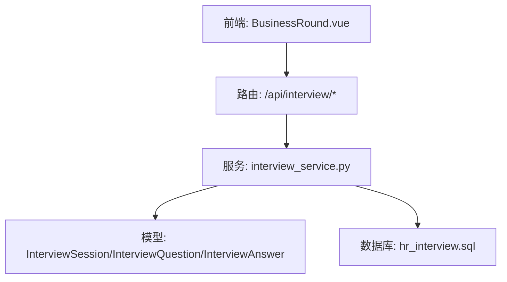
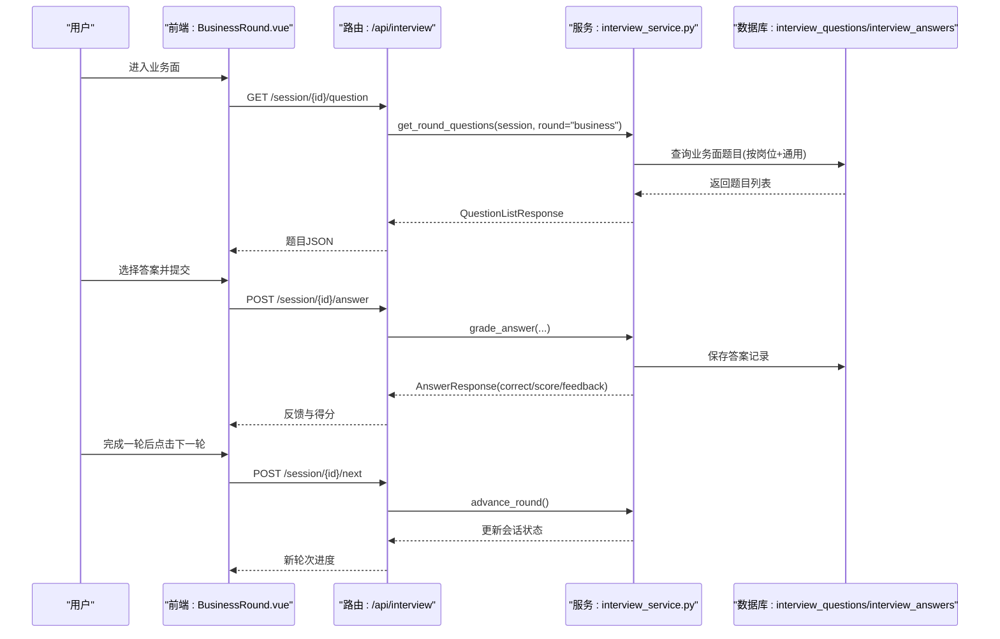
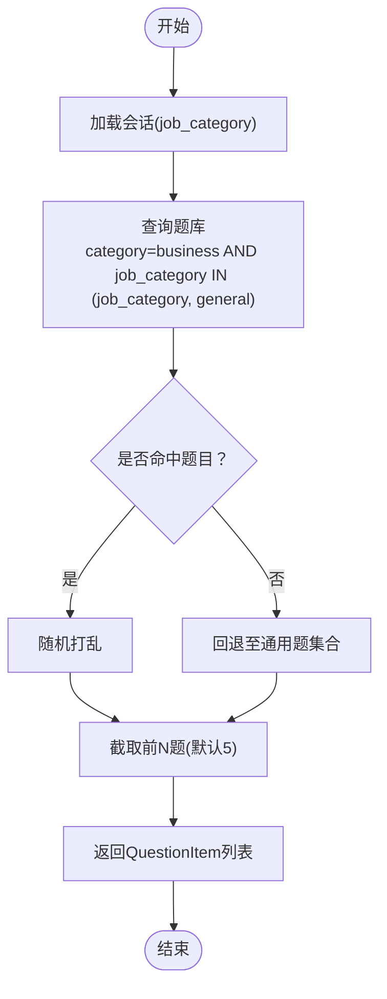
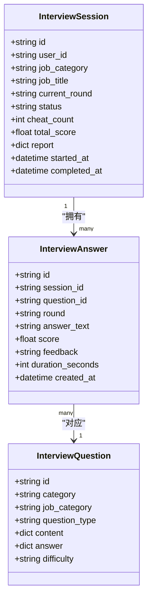
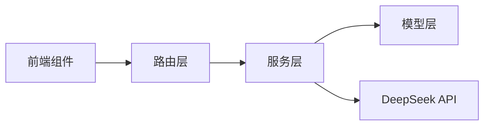

# 业务面试数据流

<cite>
**本文引用的文件列表**
- [interview.py（模型）](file://backEnd/app/models/interview.py)
- [interview.py（路由）](file://backEnd/app/routers/interview.py)
- [interview_service.py（服务）](file://backEnd/app/services/interview_service.py)
- [interview.py（Schema）](file://backEnd/app/schemas/interview.py)
- [BusinessRound.vue（前端组件）](file://frontEnd/src/components/interview/BusinessRound.vue)
- [hr_interview.sql（数据库结构）](file://hr_interview.sql)
</cite>

## 目录
1. [简介](#简介)
2. [项目结构与角色定位](#项目结构与角色定位)
3. [核心组件与职责](#核心组件与职责)
4. [架构总览](#架构总览)
5. [详细流程分析：业务面数据流](#详细流程分析：业务面数据流)
6. [题库结构设计：BUSINESS_SEED](#题库结构设计business_seed)
7. [题目筛选算法与岗位匹配逻辑](#题目筛选算法与岗位匹配逻辑)
8. [评分标准与报告生成](#评分标准与报告生成)
9. [依赖关系与耦合分析](#依赖关系与耦合分析)
10. [性能与可扩展性建议](#性能与可扩展性建议)
11. [故障排查指南](#故障排查指南)
12. [结论](#结论)

## 简介
本文件聚焦HR XF系统的“业务面”环节，系统化梳理从用户选择岗位到题目推荐、答题提交、评分反馈、报告生成的完整数据流。重点说明：
- 按岗位类别智能选题的机制（优先岗位相关题，补充通用题）
- 判断题与选择题混合题型处理
- BUSINESS_SEED题库的结构设计与行业分类
- 业务面评分标准与多维度报告生成
- 数据流向图与关键实现细节

## 项目结构与角色定位
后端采用FastAPI分层架构：路由层负责HTTP接口，服务层封装业务逻辑（含题库种子、题目获取、评分、报告），模型层定义ORM实体，Schema层定义请求/响应结构；前端通过Vue组件驱动交互。

图表来源
- [interview.py（路由）:1-317](file://backEnd/app/routers/interview.py#L1-L317)
- [interview_service.py（服务）:1-1202](file://backEnd/app/services/interview_service.py#L1-L1202)
- [interview.py（模型）:1-114](file://backEnd/app/models/interview.py#L1-L114)
- [hr_interview.sql（数据库结构）:176-190](file://hr_interview.sql#L176-L190)

章节来源
- [interview.py（路由）:1-317](file://backEnd/app/routers/interview.py#L1-L317)
- [interview_service.py（服务）:1-1202](file://backEnd/app/services/interview_service.py#L1-L1202)
- [interview.py（模型）:1-114](file://backEnd/app/models/interview.py#L1-L114)
- [hr_interview.sql（数据库结构）:176-190](file://hr_interview.sql#L176-L190)

## 核心组件与职责
- 路由层
  - 提供会话创建、轮次推进、题目获取、答案提交、AI对话、切屏上报、报告查询等接口
- 服务层
  - 管理面试轮次、岗位分类、题库种子初始化、题目抽取策略、答案评分、报告生成、AI评分与建议
- 模型层
  - 定义面试会话、题目、答案的持久化结构
- Schema层
  - 定义前后端交互的数据契约（岗位、题目、答案、报告等）
- 前端组件
  - 业务面渲染、计时、选项选择、提交与结果展示

章节来源
- [interview.py（路由）:1-317](file://backEnd/app/routers/interview.py#L1-L317)
- [interview_service.py（服务）:1-1202](file://backEnd/app/services/interview_service.py#L1-L1202)
- [interview.py（模型）:1-114](file://backEnd/app/models/interview.py#L1-L114)
- [interview.py（Schema）:1-152](file://backEnd/app/schemas/interview.py#L1-L152)
- [BusinessRound.vue（前端组件）:1-258](file://frontEnd/src/components/interview/BusinessRound.vue#L1-L258)

## 架构总览
下图展示了业务面在整体系统中的位置及主要交互路径。

图表来源
- [interview.py（路由）:85-158](file://backEnd/app/routers/interview.py#L85-L158)
- [interview_service.py（服务）:536-741](file://backEnd/app/services/interview_service.py#L536-L741)
- [hr_interview.sql（数据库结构）:176-190](file://hr_interview.sql#L176-L190)

## 详细流程分析：业务面数据流
本节围绕“业务面”的关键步骤进行端到端解析。

### 1) 开始面试与轮次推进
- 创建会话：根据用户选择的岗位类别与岗位名称创建会话，支持全流程或单轮模式
- 轮次推进：按顺序推进assessment→tech→business→ai_voice_3→ai_voice_4，或在单轮模式下直接结束

章节来源
- [interview_service.py（服务）:489-511](file://backEnd/app/services/interview_service.py#L489-L511)
- [interview_service.py（服务）:851-872](file://backEnd/app/services/interview_service.py#L851-L872)

### 2) 获取业务面题目
- 调用接口：GET /api/interview/session/{id}/question
- 服务逻辑：当round_key为business时，优先从题库中选取与当前会话job_category匹配的题目，若不足则补充job_category为general的通用题，随机打乱并截取固定数量（默认5题），每题限时60秒

章节来源
- [interview.py（路由）:85-99](file://backEnd/app/routers/interview.py#L85-L99)
- [interview_service.py（服务）:586-604](file://backEnd/app/services/interview_service.py#L586-L604)

### 3) 提交答案与即时反馈
- 调用接口：POST /api/interview/session/{id}/answer
- 服务逻辑：对选择题/判断题，匹配标准答案字段correct，正确得10分，错误0分；同时保存答案记录（包含耗时、反馈文本）
- 前端行为：显示对错、正确答案与解释，自动进入下一题

章节来源
- [interview.py（路由）:102-119](file://backEnd/app/routers/interview.py#L102-L119)
- [interview_service.py（服务）:628-670](file://backEnd/app/services/interview_service.py#L628-L670)
- [BusinessRound.vue（前端组件）:182-227](file://frontEnd/src/components/interview/BusinessRound.vue#L182-L227)

### 4) 进入下一轮与报告生成
- 调用接口：POST /api/interview/session/{id}/next
- 服务逻辑：推进轮次；若会话状态为completed且答题数≥3，触发报告生成
- 报告内容：总分、等级、雷达维度（专业、逻辑、沟通、匹配）、各轮详情、改进建议与AI综合分析

章节来源
- [interview.py（路由）:122-158](file://backEnd/app/routers/interview.py#L122-L158)
- [interview_service.py（服务）:893-1019](file://backEnd/app/services/interview_service.py#L893-L1019)

## 题库结构设计：BUSINESS_SEED
BUSINESS_SEED用于初始化业务面题库，覆盖多行业领域，题型以判断题与选择题为主，难度分级为easy/medium/hard。

- 数据结构要点
  - category: 固定为business
  - job_category: 行业分类（如互联网、教育、公务员），以及general表示通用题
  - question_type: choice/judgment
  - difficulty: easy/medium/hard
  - content: JSON，包含text与options（选择题）
  - answer: JSON，包含correct与explanation

- 行业分类与示例
  - 互联网：微服务架构、高并发保护、CAP理论、代码审查等
  - 教育：布鲁姆目标分类、项目式学习、形成性评价、最近发展区等
  - 公务员：数字政府建设、行政管理体制改革、公务员法、公共政策评估等

- 初始化流程
  - 启动时清空旧题库，将ASSESSMENT_SEED与BUSINESS_SEED合并插入数据库

章节来源
- [interview_service.py（服务）:236-408](file://backEnd/app/services/interview_service.py#L236-L408)
- [interview_service.py（服务）:463-483](file://backEnd/app/services/interview_service.py#L463-L483)
- [hr_interview.sql（数据库结构）:176-190](file://hr_interview.sql#L176-L190)

## 题目筛选算法与岗位匹配逻辑
业务面题目的筛选遵循“优先岗位相关，补充通用”的策略，确保覆盖面与针对性兼顾。

图表来源
- [interview_service.py（服务）:586-604](file://backEnd/app/services/interview_service.py#L586-L604)

章节来源
- [interview_service.py（服务）:586-604](file://backEnd/app/services/interview_service.py#L586-L604)

## 评分标准与报告生成
业务面评分基于标准答案匹配，结合多维度报告生成，体现专业能力、逻辑思维、沟通表达与岗位匹配度。

- 单项评分
  - 选择题/判断题：正确=10分，错误=0分；附带explanation作为反馈
- 轮次满分
  - business轮次满分=50分（5题×10分）
- 雷达维度映射
  - tech与business映射到“专业能力”
  - assessment映射到“逻辑思维”
  - ai_voice_3/ai_voice_4映射到“沟通表达”
  - 整体百分比映射到“岗位匹配度”
- 等级划分
  - A≥85%，B≥70%，C≥55%，D<55%
- AI建议与分析
  - 使用LLM生成改进建议与综合分析报告（失败时回退到预设模板）

图表来源
- [interview.py（模型）:19-114](file://backEnd/app/models/interview.py#L19-L114)

章节来源
- [interview_service.py（服务）:628-741](file://backEnd/app/services/interview_service.py#L628-L741)
- [interview_service.py（服务）:893-1019](file://backEnd/app/services/interview_service.py#L893-L1019)
- [interview.py（模型）:19-114](file://backEnd/app/models/interview.py#L19-L114)

## 依赖关系与耦合分析
- 路由与服务解耦清晰：路由仅做参数校验与响应组装，核心逻辑集中在服务层
- 服务与模型强关联：服务通过SQLAlchemy操作模型实体
- 外部依赖：AI评分与建议依赖DeepSeek API（httpx异步客户端）
- 前端与后端契约：通过Schema定义严格的数据结构，降低前后端联调成本

图表来源
- [interview.py（路由）:1-317](file://backEnd/app/routers/interview.py#L1-L317)
- [interview_service.py（服务）:743-791](file://backEnd/app/services/interview_service.py#L743-L791)
- [interview.py（模型）:1-114](file://backEnd/app/models/interview.py#L1-L114)

章节来源
- [interview.py（路由）:1-317](file://backEnd/app/routers/interview.py#L1-L317)
- [interview_service.py（服务）:743-791](file://backEnd/app/services/interview_service.py#L743-L791)
- [interview.py（模型）:1-114](file://backEnd/app/models/interview.py#L1-L114)

## 性能与可扩展性建议
- 题库索引优化：已对job_category与category建立索引，可进一步提升按岗位筛选的性能
- 题目缓存：热点岗位的题目集可在Redis中缓存，减少重复查询
- 批量插入优化：初始化题库时使用批量写入，避免逐条插入带来的开销
- 异步I/O：AI评分与建议已使用httpx异步客户端，保持整体异步链路一致
- 扩展行业分类：新增行业只需扩展JOB_CATEGORIES与BUSINESS_SEED，无需改动核心逻辑

[本节为通用建议，不直接分析具体文件]

## 故障排查指南
- 题目不存在
  - 现象：提交答案返回“题目不存在”
  - 排查：确认题库初始化是否执行，检查question_id是否存在于数据库
- 题库为空
  - 现象：业务面无法获取题目
  - 排查：检查init_seed_questions是否被调用，确认数据库连接与权限
- AI评分异常
  - 现象：AI评分返回默认分数与异常信息
  - 排查：检查DeepSeek API配置（URL、Key、Model），网络连通性与超时设置
- 报告未生成
  - 现象：报告接口返回“答题数量不足3题”
  - 排查：确认答题记录数量，检查会话状态是否为completed

章节来源
- [interview_service.py（服务）:628-670](file://backEnd/app/services/interview_service.py#L628-L670)
- [interview_service.py（服务）:743-791](file://backEnd/app/services/interview_service.py#L743-L791)
- [interview.py（路由）:259-303](file://backEnd/app/routers/interview.py#L259-L303)

## 结论
HR XF的业务面数据流实现了按岗位智能选题、混合题型处理与标准化评分，并通过多维度报告为用户提供能力画像与改进建议。系统具备良好的扩展性与清晰的职责边界，后续可通过缓存与索引进一步优化性能，并持续扩充题库与行业覆盖范围。