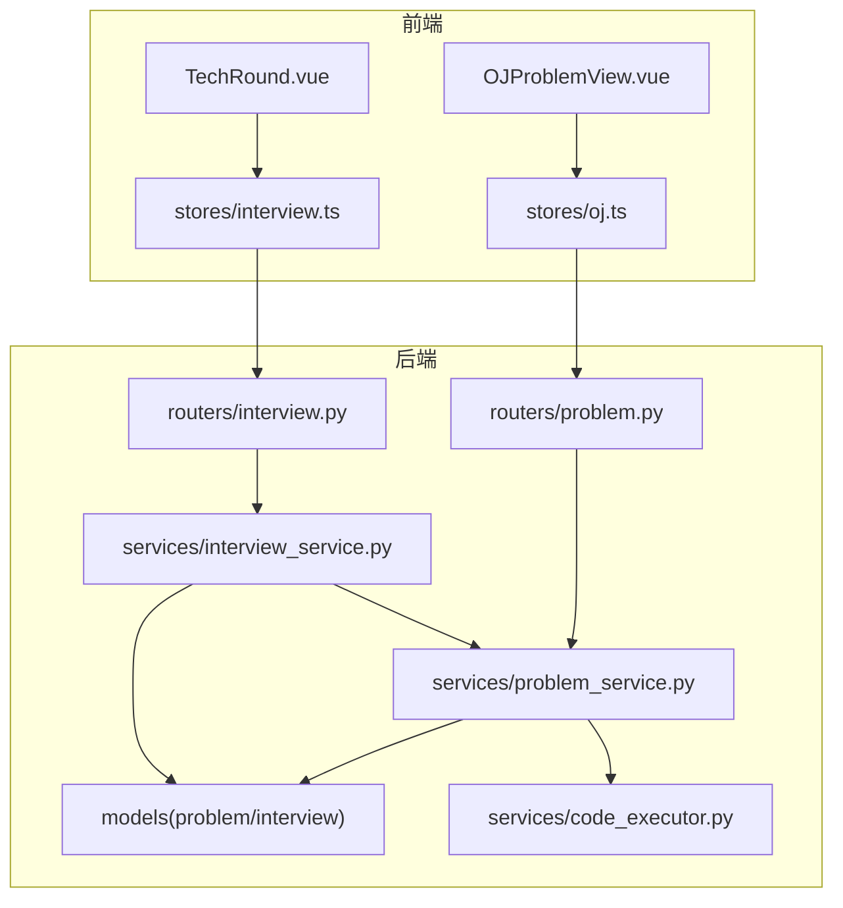
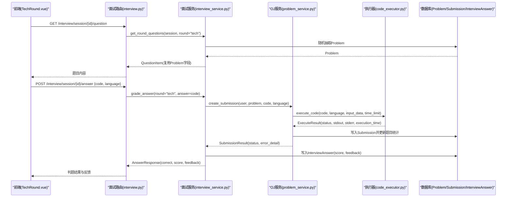
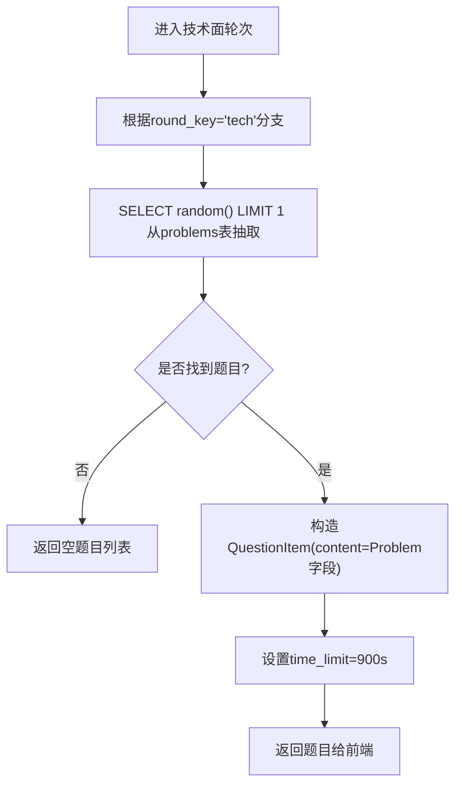
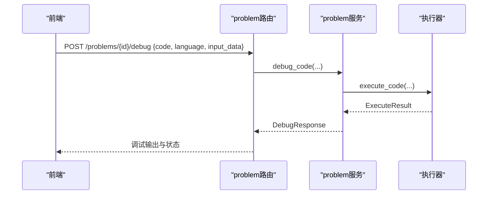
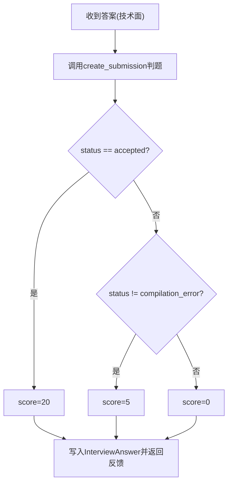
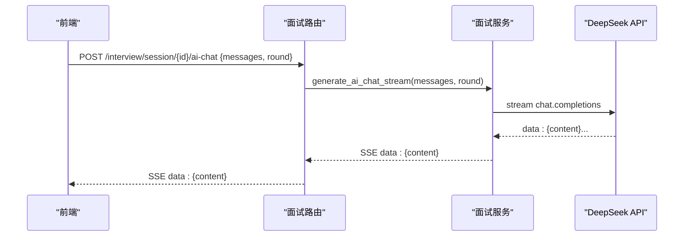
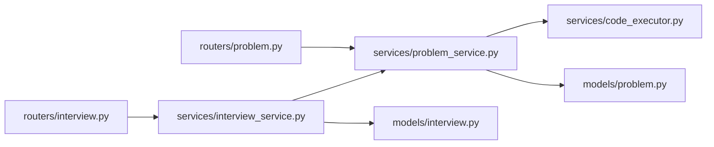

# 技术面试数据流

<cite>
**本文引用的文件列表**
- [backEnd/app/models/problem.py](file://backEnd/app/models/problem.py)
- [backEnd/app/models/interview.py](file://backEnd/app/models/interview.py)
- [backEnd/app/services/code_executor.py](file://backEnd/app/services/code_executor.py)
- [backEnd/app/services/problem_service.py](file://backEnd/app/services/problem_service.py)
- [backEnd/app/services/interview_service.py](file://backEnd/app/services/interview_service.py)
- [backEnd/app/routers/interview.py](file://backEnd/app/routers/interview.py)
- [backEnd/app/routers/problem.py](file://backEnd/app/routers/problem.py)
- [backEnd/app/schemas/interview.py](file://backEnd/app/schemas/interview.py)
- [backEnd/app/schemas/problem.py](file://backEnd/app/schemas/problem.py)
- [frontEnd/src/components/interview/TechRound.vue](file://frontEnd/src/components/interview/TechRound.vue)
- [frontEnd/src/views/OJProblemView.vue](file://frontEnd/src/views/OJProblemView.vue)
- [frontEnd/src/stores/interview.ts](file://frontEnd/src/stores/interview.ts)
- [frontEnd/src/stores/oj.ts](file://frontEnd/src/stores/oj.ts)
</cite>

## 目录
1. [简介](#简介)
2. [项目结构](#项目结构)
3. [核心组件](#核心组件)
4. [架构总览](#架构总览)
5. [详细组件分析](#详细组件分析)
6. [依赖关系分析](#依赖关系分析)
7. [性能与安全考量](#性能与安全考量)
8. [故障排查指南](#故障排查指南)
9. [结论](#结论)
10. [附录：API与数据模型](#附录api与数据模型)

## 简介
本文件面向HR XF系统的“技术面”环节，系统性梳理从OJ题库随机抽取编程题、代码编辑器集成、多语言执行与实时判题反馈的完整数据流。重点说明：
- 技术面与在线编程平台（OJ）的深度集成机制：Problem模型复用、Submission创建流程、判题结果映射到面试评分。
- 代码提交的数据格式、执行环境隔离策略与性能指标收集。
- 技术面评分算法：编译错误、运行错误、答案正确性与执行效率的综合评估。
- 前后端在编辑、调试、提交过程中的通信模式与数据同步机制。

## 项目结构
后端采用FastAPI路由+服务层+ORM模型的分层设计；前端使用Vue组件+Pinia Store组织状态与网络请求。技术面数据流贯穿以下关键路径：
- 前端技术面组件发起题目获取与答题提交
- 后端面试路由调度服务层，按轮次选择题目来源（技术面复用OJ题库）
- OJ服务层调用代码执行器进行安全校验、编译/运行、输出比对
- 结果回写至Submission并映射为面试答案评分



图表来源
- [frontEnd/src/components/interview/TechRound.vue:1-427](file://frontEnd/src/components/interview/TechRound.vue#L1-L427)
- [frontEnd/src/views/OJProblemView.vue:1-500](file://frontEnd/src/views/OJProblemView.vue#L1-L500)
- [frontEnd/src/stores/interview.ts:1-313](file://frontEnd/src/stores/interview.ts#L1-L313)
- [frontEnd/src/stores/oj.ts:1-268](file://frontEnd/src/stores/oj.ts#L1-L268)
- [backEnd/app/routers/interview.py:1-317](file://backEnd/app/routers/interview.py#L1-L317)
- [backEnd/app/routers/problem.py:1-175](file://backEnd/app/routers/problem.py#L1-L175)
- [backEnd/app/services/interview_service.py:1-1202](file://backEnd/app/services/interview_service.py#L1-L1202)
- [backEnd/app/services/problem_service.py:1-914](file://backEnd/app/services/problem_service.py#L1-L914)
- [backEnd/app/services/code_executor.py:1-444](file://backEnd/app/services/code_executor.py#L1-L444)
- [backEnd/app/models/problem.py:1-88](file://backEnd/app/models/problem.py#L1-L88)
- [backEnd/app/models/interview.py:1-114](file://backEnd/app/models/interview.py#L1-L114)

章节来源
- [backEnd/app/routers/interview.py:1-317](file://backEnd/app/routers/interview.py#L1-L317)
- [backEnd/app/routers/problem.py:1-175](file://backEnd/app/routers/problem.py#L1-L175)
- [backEnd/app/services/interview_service.py:1-1202](file://backEnd/app/services/interview_service.py#L1-L1202)
- [backEnd/app/services/problem_service.py:1-914](file://backEnd/app/services/problem_service.py#L1-L914)
- [backEnd/app/services/code_executor.py:1-444](file://backEnd/app/services/code_executor.py#L1-L444)
- [backEnd/app/models/problem.py:1-88](file://backEnd/app/models/problem.py#L1-L88)
- [backEnd/app/models/interview.py:1-114](file://backEnd/app/models/interview.py#L1-L114)
- [frontEnd/src/components/interview/TechRound.vue:1-427](file://frontEnd/src/components/interview/TechRound.vue#L1-L427)
- [frontEnd/src/views/OJProblemView.vue:1-500](file://frontEnd/src/views/OJProblemView.vue#L1-L500)
- [frontEnd/src/stores/interview.ts:1-313](file://frontEnd/src/stores/interview.ts#L1-L313)
- [frontEnd/src/stores/oj.ts:1-268](file://frontEnd/src/stores/oj.ts#L1-L268)

## 核心组件
- 题目与提交模型
  - Problem：定义题目元信息、样例输入输出、时间/内存限制等
  - Submission：记录用户提交、语言、状态、耗时、内存等
- 面试会话与答案
  - InterviewSession：面试会话上下文（轮次、状态、作弊计数、报告）
  - InterviewAnswer：每轮答题记录（含分数与反馈）
- 代码执行器
  - 支持多语言（Python3/C/C++/Java/JavaScript），子进程隔离执行，关键词黑名单安全检查
- 服务层
  - interview_service：轮次管理、题目抽取（技术面复用OJ）、评分与报告生成
  - problem_service：OJ题目查询、提交判题、调试执行、进度统计
- 路由层
  - interview.py：面试会话、题目、答案、AI对话、报告等接口
  - problem.py：OJ题目列表/详情、提交、调试、进度等接口
- 前端
  - TechRound.vue：技术面UI（题目展示、代码编辑、调试、提交）
  - OJProblemView.vue：独立刷题页面（复用同一套OJ能力）
  - stores：封装HTTP请求与状态管理

章节来源
- [backEnd/app/models/problem.py:17-88](file://backEnd/app/models/problem.py#L17-L88)
- [backEnd/app/models/interview.py:19-114](file://backEnd/app/models/interview.py#L19-L114)
- [backEnd/app/services/code_executor.py:210-444](file://backEnd/app/services/code_executor.py#L210-L444)
- [backEnd/app/services/interview_service.py:536-741](file://backEnd/app/services/interview_service.py#L536-L741)
- [backEnd/app/services/problem_service.py:95-202](file://backEnd/app/services/problem_service.py#L95-L202)
- [backEnd/app/routers/interview.py:85-119](file://backEnd/app/routers/interview.py#L85-L119)
- [backEnd/app/routers/problem.py:121-175](file://backEnd/app/routers/problem.py#L121-L175)
- [frontEnd/src/components/interview/TechRound.vue:232-427](file://frontEnd/src/components/interview/TechRound.vue#L232-L427)
- [frontEnd/src/views/OJProblemView.vue:289-500](file://frontEnd/src/views/OJProblemView.vue#L289-L500)
- [frontEnd/src/stores/interview.ts:177-207](file://frontEnd/src/stores/interview.ts#L177-L207)
- [frontEnd/src/stores/oj.ts:181-218](file://frontEnd/src/stores/oj.ts#L181-L218)

## 架构总览
技术面数据流的关键交互如下：
- 前端技术面组件向面试接口拉取当前轮次题目（技术面时从OJ题库随机抽取一道）
- 用户在编辑器编写代码，可先通过调试接口验证样例
- 提交后，面试服务复用OJ判题逻辑，创建Submission并返回评分与反馈
- 最终汇总各轮得分生成综合报告



图表来源
- [backEnd/app/routers/interview.py:85-119](file://backEnd/app/routers/interview.py#L85-L119)
- [backEnd/app/services/interview_service.py:536-741](file://backEnd/app/services/interview_service.py#L536-L741)
- [backEnd/app/services/problem_service.py:95-202](file://backEnd/app/services/problem_service.py#L95-L202)
- [backEnd/app/services/code_executor.py:270-444](file://backEnd/app/services/code_executor.py#L270-L444)
- [backEnd/app/models/problem.py:57-88](file://backEnd/app/models/problem.py#L57-L88)
- [backEnd/app/models/interview.py:84-114](file://backEnd/app/models/interview.py#L84-L114)

## 详细组件分析

### 技术面题目抽取与复用OJ模型
- 技术面轮次从OJ题库随机抽取一道题，将Problem字段映射为QuestionItem.content，统一时间限制与难度标签展示给前端。
- 该机制确保技术面与OJ共享题目资产，避免重复维护。



图表来源
- [backEnd/app/services/interview_service.py:559-584](file://backEnd/app/services/interview_service.py#L559-L584)
- [backEnd/app/models/problem.py:17-54](file://backEnd/app/models/problem.py#L17-L54)

章节来源
- [backEnd/app/services/interview_service.py:536-622](file://backEnd/app/services/interview_service.py#L536-L622)
- [backEnd/app/models/problem.py:17-54](file://backEnd/app/models/problem.py#L17-L54)

### 代码提交与判题流程
- 前端提交包含code与language，后端创建Submission，逐组样例执行代码并比对输出。
- 执行器对危险关键词进行正则拦截，随后以子进程方式运行对应语言的编译器/解释器，严格超时控制。

```mermaid
sequenceDiagram
participant FE as "前端(OJ/TechRound)"
participant RP as "problem路由"
participant PSV as "problem服务"
participant EXE as "执行器"
participant DB as "数据库"
FE->>RP : POST /problems/{id}/submit {code, language}
RP->>PSV : create_submission(user, problem, code, language)
PSV->>PSV : 解析sample_input/output
loop 每组样例
PSV->>EXE : execute_code(code, language, input_data, time_limit)
EXE-->>PSV : ExecuteResult(status, stdout, stderr, execution_time)
alt 编译错误/超时/运行时错误
PSV->>DB : 标记status并记录error_detail
break
else 输出匹配
PSV->>PSV : 继续下一组样例
end
end
PSV->>DB : 持久化Submission并更新题目统计
PSV-->>RP : SubmissionResult
RP-->>FE : 判题结果
```

图表来源
- [backEnd/app/routers/problem.py:121-151](file://backEnd/app/routers/problem.py#L121-L151)
- [backEnd/app/services/problem_service.py:95-179](file://backEnd/app/services/problem_service.py#L95-L179)
- [backEnd/app/services/code_executor.py:270-444](file://backEnd/app/services/code_executor.py#L270-L444)
- [backEnd/app/models/problem.py:57-88](file://backEnd/app/models/problem.py#L57-L88)

章节来源
- [backEnd/app/routers/problem.py:121-175](file://backEnd/app/routers/problem.py#L121-L175)
- [backEnd/app/services/problem_service.py:95-202](file://backEnd/app/services/problem_service.py#L95-L202)
- [backEnd/app/services/code_executor.py:210-444](file://backEnd/app/services/code_executor.py#L210-L444)

### 调试运行与实时反馈
- 前端可在技术面或OJ页面点击“运行”，调用调试接口，仅执行不持久化提交，便于快速定位问题。
- 调试接口直接调用执行器，返回stdout/stderr、退出码、执行时间与状态。



图表来源
- [backEnd/app/routers/problem.py:154-175](file://backEnd/app/routers/problem.py#L154-L175)
- [backEnd/app/services/problem_service.py:182-202](file://backEnd/app/services/problem_service.py#L182-L202)
- [backEnd/app/services/code_executor.py:270-444](file://backEnd/app/services/code_executor.py#L270-L444)

章节来源
- [backEnd/app/routers/problem.py:154-175](file://backEnd/app/routers/problem.py#L154-L175)
- [backEnd/app/services/problem_service.py:182-202](file://backEnd/app/services/problem_service.py#L182-L202)

### 技术面评分算法
- 选择题/判断题：与标准答案对比，正确得10分，错误0分，附带解释反馈。
- 技术面（代码题）：复用OJ判题结果，accepted得20分，非编译错误但未通过得5分，编译错误0分；同时保存feedback与错误详情。
- AI面试轮次：调用LLM评分，返回0-15分及反馈。
- 报告生成：按轮次汇总得分，计算雷达图维度（专业、逻辑、沟通、岗位匹配度），并给出等级与建议。



图表来源
- [backEnd/app/services/interview_service.py:671-714](file://backEnd/app/services/interview_service.py#L671-L714)
- [backEnd/app/services/problem_service.py:95-179](file://backEnd/app/services/problem_service.py#L95-L179)

章节来源
- [backEnd/app/services/interview_service.py:628-741](file://backEnd/app/services/interview_service.py#L628-L741)
- [backEnd/app/services/problem_service.py:95-179](file://backEnd/app/services/problem_service.py#L95-L179)

### 前后端实时通信模式
- 常规提交/调试：基于REST API，JSON请求/响应。
- AI对话：SSE流式传输，前端逐块拼接文本，实现打字机效果。
- 技术面计时：前端本地定时器，超时自动触发提交。



图表来源
- [backEnd/app/routers/interview.py:161-189](file://backEnd/app/routers/interview.py#L161-L189)
- [backEnd/app/services/interview_service.py:797-845](file://backEnd/app/services/interview_service.py#L797-L845)
- [frontEnd/src/stores/interview.ts:209-253](file://frontEnd/src/stores/interview.ts#L209-L253)

章节来源
- [backEnd/app/routers/interview.py:161-189](file://backEnd/app/routers/interview.py#L161-L189)
- [backEnd/app/services/interview_service.py:797-845](file://backEnd/app/services/interview_service.py#L797-L845)
- [frontEnd/src/stores/interview.ts:209-253](file://frontEnd/src/stores/interview.ts#L209-L253)

## 依赖关系分析
- 模块耦合
  - interview_service依赖problem_service以复用判题能力，形成“面试→OJ”的单向依赖。
  - problem_service依赖code_executor，执行器作为底层基础设施，无业务耦合。
- 外部依赖
  - DeepSeek API用于AI面试与报告建议生成。
  - 系统编译器/解释器（gcc/g++/javac/node/python）由配置与环境PATH决定。
- 潜在循环依赖
  - 当前未发现循环导入；面试服务仅在技术面分支调用OJ服务。



图表来源
- [backEnd/app/routers/interview.py:1-317](file://backEnd/app/routers/interview.py#L1-L317)
- [backEnd/app/routers/problem.py:1-175](file://backEnd/app/routers/problem.py#L1-L175)
- [backEnd/app/services/interview_service.py:1-1202](file://backEnd/app/services/interview_service.py#L1-L1202)
- [backEnd/app/services/problem_service.py:1-914](file://backEnd/app/services/problem_service.py#L1-L914)
- [backEnd/app/services/code_executor.py:1-444](file://backEnd/app/services/code_executor.py#L1-L444)
- [backEnd/app/models/interview.py:1-114](file://backEnd/app/models/interview.py#L1-L114)
- [backEnd/app/models/problem.py:1-88](file://backEnd/app/models/problem.py#L1-L88)

章节来源
- [backEnd/app/services/interview_service.py:1-1202](file://backEnd/app/services/interview_service.py#L1-L1202)
- [backEnd/app/services/problem_service.py:1-914](file://backEnd/app/services/problem_service.py#L1-L914)
- [backEnd/app/services/code_executor.py:1-444](file://backEnd/app/services/code_executor.py#L1-L444)

## 性能与安全考量
- 执行隔离
  - 每个提交在临时目录中运行，子进程超时保护，避免长时间占用。
  - 线程池并发执行子进程，提升吞吐。
- 安全策略
  - 多语言危险关键词正则黑名单，拦截系统调用、文件系统破坏、动态执行等高危操作。
  - Java编译指定UTF-8编码，避免Windows默认GBK导致的误报。
- 性能指标
  - 记录execution_time（毫秒）与execution_memory（近似KB），用于评测与优化参考。
- 资源清理
  - 执行完成后删除临时目录，防止磁盘泄漏。

章节来源
- [backEnd/app/services/code_executor.py:154-167](file://backEnd/app/services/code_executor.py#L154-L167)
- [backEnd/app/services/code_executor.py:220-267](file://backEnd/app/services/code_executor.py#L220-L267)
- [backEnd/app/services/code_executor.py:270-444](file://backEnd/app/services/code_executor.py#L270-L444)
- [backEnd/app/services/problem_service.py:161-179](file://backEnd/app/services/problem_service.py#L161-L179)

## 故障排查指南
- 常见错误类型
  - 编译错误：检查语法、头文件、类名与入口函数命名是否符合语言规范。
  - 运行时错误：数组越界、空指针、除零异常等。
  - 超时：算法复杂度过高或死循环，需优化时间复杂度。
  - 答案错误：输出格式不一致（换行符、空格），注意统一处理。
- 调试建议
  - 优先使用调试接口，用第一组样例验证输入输出。
  - 关注stderr中的错误信息，结合错误详情定位问题。
- 面试相关
  - 若出现“题目不存在/用户不存在”，检查session与question_id是否正确传递。
  - 切屏次数过多会中止面试，注意保持专注。

章节来源
- [backEnd/app/services/problem_service.py:130-159](file://backEnd/app/services/problem_service.py#L130-L159)
- [backEnd/app/services/interview_service.py:671-714](file://backEnd/app/services/interview_service.py#L671-L714)
- [backEnd/app/routers/interview.py:192-216](file://backEnd/app/routers/interview.py#L192-L216)

## 结论
本方案通过复用OJ题库与判题引擎，实现了技术面与在线编程平台的深度集成。其优势包括：
- 数据一致性：Problem与Submission模型在技术面与OJ间共享，避免重复建设。
- 可扩展性：新增语言只需在执行器中扩展模板与规则。
- 可观测性：完整的执行指标与错误详情，便于分析与优化。
- 用户体验：调试与提交分离，即时反馈，降低试错成本。

[本节不直接分析具体文件]

## 附录：API与数据模型

### 关键API定义
- 面试
  - GET /api/interview/jobs：获取岗位分类
  - POST /api/interview/start：开始面试，创建会话
  - GET /api/interview/session/{id}/question：获取当前轮次题目
  - POST /api/interview/session/{id}/answer：提交答案（技术面时为code+language）
  - POST /api/interview/session/{id}/next：进入下一轮
  - POST /api/interview/session/{id}/ai-chat：AI对话（SSE）
  - POST /api/interview/session/{id}/cheat：上报切屏
  - POST /api/interview/session/{id}/abort：中止面试
  - GET /api/interview/session/{id}/report：获取评分报告
  - GET /api/interview/history：面试历史
- OJ
  - GET /api/problems：题目列表（筛选/分页）
  - GET /api/problems/{id}：题目详情
  - POST /api/problems/{id}/submit：提交代码（实际判题）
  - POST /api/problems/{id}/debug：调试运行
  - GET /api/problems/progress：用户进度统计
  - GET /api/problems/tags/options：标签选项

章节来源
- [backEnd/app/routers/interview.py:29-317](file://backEnd/app/routers/interview.py#L29-L317)
- [backEnd/app/routers/problem.py:47-175](file://backEnd/app/routers/problem.py#L47-L175)

### 数据模型要点
- Problem
  - 关键字段：display_id、title、description、input_format、output_format、constraints、sample_input、sample_output、hint、time_limit、memory_limit、difficulty、tags、total_submissions、accepted_submissions
- Submission
  - 关键字段：user_id、problem_id、code、language、status、execution_time、execution_memory、created_at
- InterviewSession
  - 关键字段：user_id、job_category、job_title、current_round、status、cheat_count、interview_mode、target_round、total_score、report、started_at、completed_at
- InterviewAnswer
  - 关键字段：session_id、question_id、round、answer_text、score、feedback、duration_seconds、created_at

章节来源
- [backEnd/app/models/problem.py:17-88](file://backEnd/app/models/problem.py#L17-L88)
- [backEnd/app/models/interview.py:19-114](file://backEnd/app/models/interview.py#L19-L114)