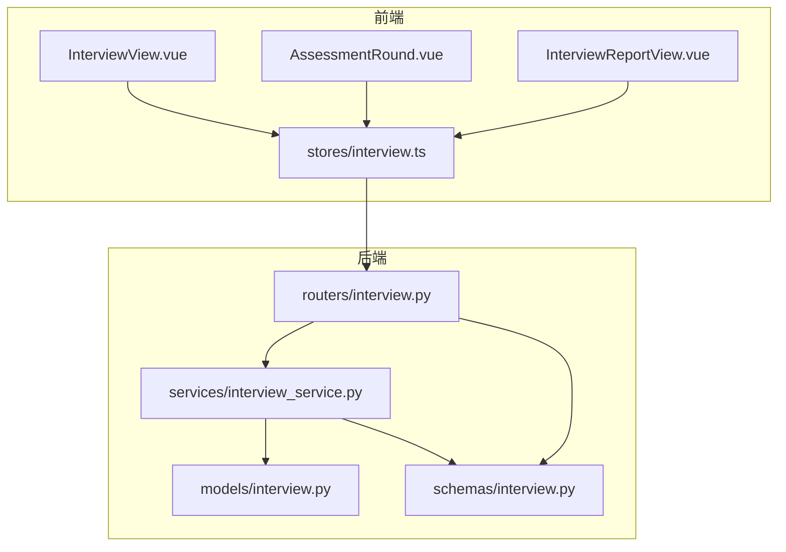
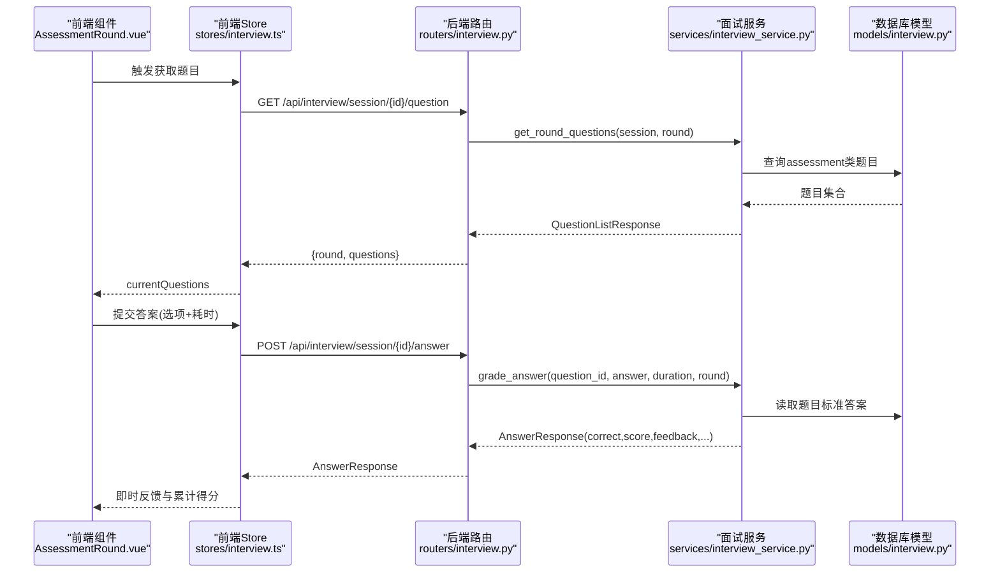
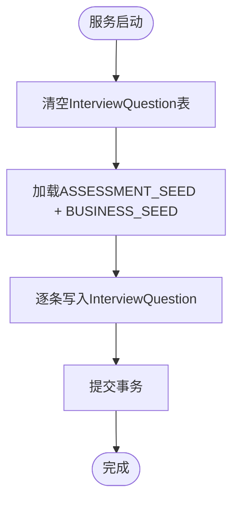
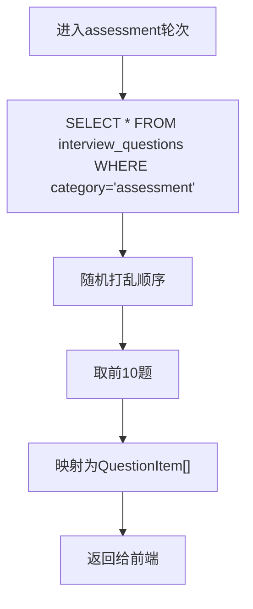
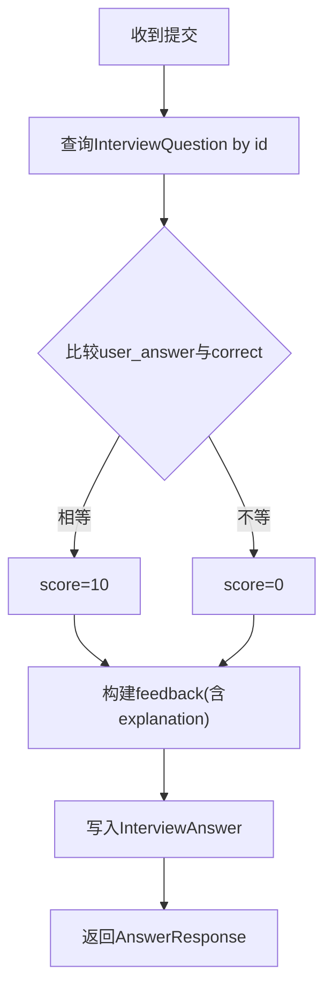
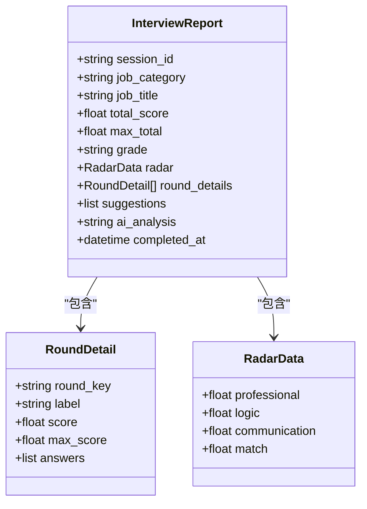
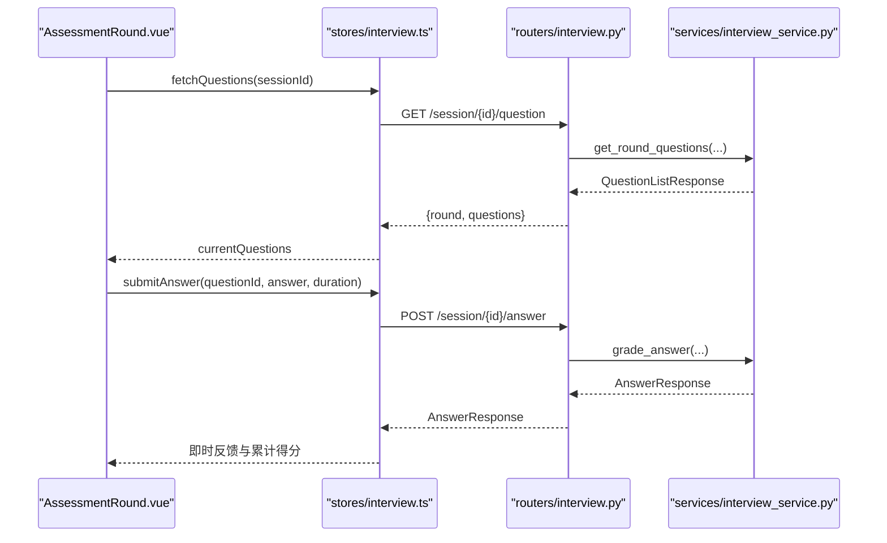
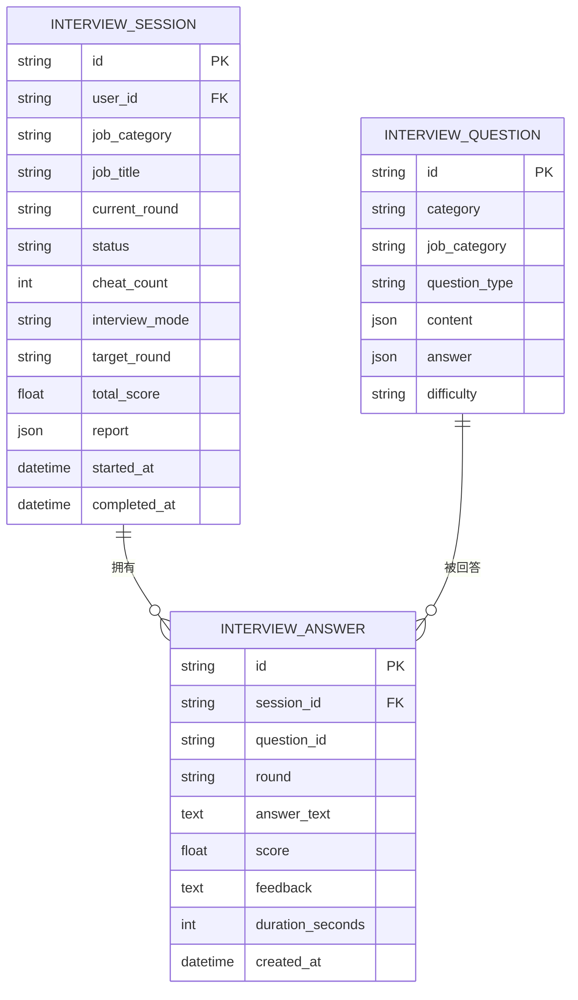
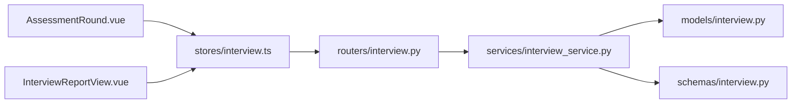

# 综合素质测评数据流

<cite>
**本文引用的文件列表**
- [interview.py（后端模型）](file://backEnd/app/models/interview.py)
- [interview.py（后端路由）](file://backEnd/app/routers/interview.py)
- [interview_service.py（面试服务与题库种子）](file://backEnd/app/services/interview_service.py)
- [interview.py（后端Schema）](file://backEnd/app/schemas/interview.py)
- [interview.ts（前端状态管理）](file://frontEnd/src/stores/interview.ts)
- [AssessmentRound.vue（测评轮次组件）](file://frontEnd/src/components/interview/AssessmentRound.vue)
- [InterviewView.vue（面试入口视图）](file://frontEnd/src/views/InterviewView.vue)
- [InterviewReportView.vue（报告展示视图）](file://frontEnd/src/views/InterviewReportView.vue)
</cite>

## 目录
1. [简介](#简介)
2. [项目结构](#项目结构)
3. [核心组件](#核心组件)
4. [架构总览](#架构总览)
5. [详细组件分析](#详细组件分析)
6. [依赖关系分析](#依赖关系分析)
7. [性能考量](#性能考量)
8. [故障排查指南](#故障排查指南)
9. [结论](#结论)
10. [附录](#附录)

## 简介
本文件面向HR XF系统的“综合素质测评”模块，系统化梳理从题目抽取、题目展示、答案提交到即时评分的完整数据链路。重点覆盖：
- 10道标准化选择题的随机抽取与展示流程
- 答案匹配算法、正确性判断标准与反馈生成
- ASSESSMENT_SEED种子数据结构设计与题库管理逻辑
- 测评结果的数据聚合方式：得分计算、正确率统计、维度分析与雷达图映射
- 前端状态管理与后端API交互的时序与数据转换

## 项目结构
围绕测评相关的前后端关键文件如下：
- 后端模型定义：会话、题目、答案
- 后端路由：创建会话、获取题目、提交答案、推进轮次、生成报告等
- 面试服务：题库种子、题目抽取、评分、报告生成、AI对话
- 前端Store：统一封装API调用与状态管理
- 前端组件：测评轮次答题界面、报告展示界面、面试入口

图表来源
- [InterviewView.vue:1-171](file://frontEnd/src/views/InterviewView.vue#L1-L171)
- [AssessmentRound.vue:1-227](file://frontEnd/src/components/interview/AssessmentRound.vue#L1-L227)
- [InterviewReportView.vue:51-251](file://frontEnd/src/views/InterviewReportView.vue#L51-L251)
- [interview.ts:1-313](file://frontEnd/src/stores/interview.ts#L1-L313)
- [interview.py（路由）:1-317](file://backEnd/app/routers/interview.py#L1-L317)
- [interview_service.py:1-1202](file://backEnd/app/services/interview_service.py#L1-L1202)
- [interview.py（模型）:1-114](file://backEnd/app/models/interview.py#L1-L114)
- [interview.py（Schema）:1-152](file://backEnd/app/schemas/interview.py#L1-L152)

章节来源
- [InterviewView.vue:1-171](file://frontEnd/src/views/InterviewView.vue#L1-L171)
- [interview.ts:1-313](file://frontEnd/src/stores/interview.ts#L1-L313)
- [interview.py（路由）:1-317](file://backEnd/app/routers/interview.py#L1-L317)
- [interview_service.py:1-1202](file://backEnd/app/services/interview_service.py#L1-L1202)
- [interview.py（模型）:1-114](file://backEnd/app/models/interview.py#L1-L114)
- [interview.py（Schema）:1-152](file://backEnd/app/schemas/interview.py#L1-L152)

## 核心组件
- 后端模型层
  - InterviewSession：记录一次面试会话的状态、轮次、模式、作弊次数、总分与报告JSON
  - InterviewQuestion：存储题目内容、类型、难度、标准答案与解析
  - InterviewAnswer：记录每次作答的答案文本、得分、反馈、耗时等
- 后端路由层
  - 提供岗位列表、开始面试、获取题目、提交答案、下一轮、AI对话、切屏上报、中止面试、获取报告、历史记录等接口
- 面试服务层
  - 包含ASSESSMENT_SEED与BUSINESS_SEED题库种子
  - 实现题目抽取、答案评分、AI对话、轮次推进、报告生成等核心业务
- 前端状态管理
  - 统一封装API请求、认证头、错误处理
  - 维护当前会话、题目、AI消息、报告、历史等状态
- 前端组件
  - AssessmentRound：负责10题测评的计时、选择、提交、即时反馈与汇总
  - InterviewReportView：渲染总分、等级、雷达图、维度得分、建议与分析

章节来源
- [interview.py（模型）:1-114](file://backEnd/app/models/interview.py#L1-L114)
- [interview.py（路由）:1-317](file://backEnd/app/routers/interview.py#L1-L317)
- [interview_service.py:1-1202](file://backEnd/app/services/interview_service.py#L1-L1202)
- [interview.ts:1-313](file://frontEnd/src/stores/interview.ts#L1-L313)
- [AssessmentRound.vue:1-227](file://frontEnd/src/components/interview/AssessmentRound.vue#L1-L227)
- [InterviewReportView.vue:51-251](file://frontEnd/src/views/InterviewReportView.vue#L51-L251)

## 架构总览
下图展示了“综合素质测评”端到端的数据流：前端发起请求，路由校验并委派服务，服务读取数据库模型，返回结构化响应；前端更新状态并驱动UI。

图表来源
- [AssessmentRound.vue:1-227](file://frontEnd/src/components/interview/AssessmentRound.vue#L1-L227)
- [interview.ts:1-313](file://frontEnd/src/stores/interview.ts#L1-L313)
- [interview.py（路由）:85-119](file://backEnd/app/routers/interview.py#L85-L119)
- [interview_service.py:536-741](file://backEnd/app/services/interview_service.py#L536-L741)
- [interview.py（模型）:59-114](file://backEnd/app/models/interview.py#L59-L114)

## 详细组件分析

### 测评题库种子与数据结构
- ASSESSMENT_SEED为10道标准化选择题，字段包括：
  - category：固定为assessment
  - job_category：通用general
  - question_type：choice
  - difficulty：easy/medium
  - content：包含text与options数组
  - answer：包含correct（大写字母）与explanation
- 初始化流程会清空旧题库后批量插入，确保每次启动一致化数据

图表来源
- [interview_service.py:463-483](file://backEnd/app/services/interview_service.py#L463-L483)
- [interview_service.py:103-229](file://backEnd/app/services/interview_service.py#L103-L229)

章节来源
- [interview_service.py:103-229](file://backEnd/app/services/interview_service.py#L103-L229)
- [interview_service.py:463-483](file://backEnd/app/services/interview_service.py#L463-L483)

### 题目抽取与展示
- 当轮次为assessment时，服务从数据库中筛选category=assessment的题目，随机打乱并截取前10题
- 返回QuestionItem列表，包含id、question_type、content、time_limit（30秒）
- 前端AssessmentRound根据questions渲染题目与选项，并启动倒计时

图表来源
- [interview_service.py:536-557](file://backEnd/app/services/interview_service.py#L536-L557)
- [AssessmentRound.vue:1-227](file://frontEnd/src/components/interview/AssessmentRound.vue#L1-L227)

章节来源
- [interview_service.py:536-557](file://backEnd/app/services/interview_service.py#L536-L557)
- [AssessmentRound.vue:1-227](file://frontEnd/src/components/interview/AssessmentRound.vue#L1-L227)

### 答案提交与即时评分
- 前端在用户选择或超时后，调用submitAnswer接口，携带question_id、answer（选项字母）、duration_seconds
- 后端grade_answer按轮次分支：
  - assessment/business：读取题目标准答案，比较user_answer与correct（大小写不敏感），score=10或0，feedback拼接正确提示与解析
  - tech：复用OJ判题
  - ai_voice_3/ai_voice_4：调用LLM评分
- 保存InterviewAnswer记录，返回AnswerResponse供前端即时反馈

图表来源
- [interview_service.py:628-741](file://backEnd/app/services/interview_service.py#L628-L741)
- [interview.py（模型）:84-114](file://backEnd/app/models/interview.py#L84-L114)

章节来源
- [interview_service.py:628-741](file://backEnd/app/services/interview_service.py#L628-L741)
- [interview.py（模型）:84-114](file://backEnd/app/models/interview.py#L84-L114)

### 测评结果聚合与维度分析
- generate_report按轮次分组答案，计算每轮得分与满分上限
  - assessment满分100（10×10分）
  - business满分50（5×10分）
  - tech满分20
  - AI语音轮按回答数×15分（最多6轮）
- 各轮得分设置下限为满分的75%，避免过低影响整体评估
- 维度映射：
  - tech/business → 专业能力
  - assessment → 逻辑思维
  - ai_voice_3/ai_voice_4 → 沟通表达
  - 岗位匹配度 = 总分/总分上限百分比
- 雷达图四维分数均设置下限75%
- 等级划分：A≥85%，B≥70%，C≥55%，D<55%
- 使用LLM生成改进建议与综合分析段落

图表来源
- [interview_service.py:893-1019](file://backEnd/app/services/interview_service.py#L893-L1019)
- [interview.py（Schema）:98-128](file://backEnd/app/schemas/interview.py#L98-L128)

章节来源
- [interview_service.py:893-1019](file://backEnd/app/services/interview_service.py#L893-L1019)
- [interview.py（Schema）:98-128](file://backEnd/app/schemas/interview.py#L98-L128)

### 前端状态管理与API交互
- stores/interview.ts集中管理：
  - 岗位列表、当前会话、题目、AI消息、报告、历史
  - 统一的apiRequest封装，自动附加Authorization头与错误处理
  - 方法：startInterview、fetchSession、fetchQuestions、submitAnswer、nextRound、sendAIChat、reportCheat、abortInterview、fetchReport、fetchHistory
- AssessmentRound.vue：
  - 维护currentIndex、selectedOption、answered、timer、totalScore、answerHistory
  - 计时器30秒，超时自动提交空答案
  - 提交后累积得分并记录每题反馈，完成后显示汇总与“进入下一轮”按钮

图表来源
- [interview.ts:177-199](file://frontEnd/src/stores/interview.ts#L177-L199)
- [interview.py（路由）:85-119](file://backEnd/app/routers/interview.py#L85-L119)
- [interview_service.py:536-741](file://backEnd/app/services/interview_service.py#L536-L741)
- [AssessmentRound.vue:159-196](file://frontEnd/src/components/interview/AssessmentRound.vue#L159-L196)

章节来源
- [interview.ts:1-313](file://frontEnd/src/stores/interview.ts#L1-L313)
- [AssessmentRound.vue:1-227](file://frontEnd/src/components/interview/AssessmentRound.vue#L1-L227)
- [interview.py（路由）:85-119](file://backEnd/app/routers/interview.py#L85-L119)
- [interview_service.py:536-741](file://backEnd/app/services/interview_service.py#L536-L741)

### 数据结构转换图
- 后端模型到Schema再到前端类型的转换路径：
  - InterviewQuestion → QuestionItem
  - InterviewAnswer → AnswerResponse
  - InterviewSession → InterviewSessionResponse
  - 报告聚合 → InterviewReport（含RoundDetail、RadarData）

图表来源
- [interview.py（模型）:19-114](file://backEnd/app/models/interview.py#L19-L114)

章节来源
- [interview.py（模型）:19-114](file://backEnd/app/models/interview.py#L19-L114)

## 依赖关系分析
- 路由对服务的强依赖：所有面试相关接口均通过interview_service执行业务逻辑
- 服务对模型的读写：题目抽取、答案保存、报告生成均基于SQLAlchemy异步会话
- 前端Store对路由的统一封装：减少重复请求逻辑，提升可维护性
- 外部依赖：DeepSeek API用于AI对话与评分、建议与分析生成

图表来源
- [interview.py（路由）:1-317](file://backEnd/app/routers/interview.py#L1-L317)
- [interview_service.py:1-1202](file://backEnd/app/services/interview_service.py#L1-L1202)
- [interview.py（模型）:1-114](file://backEnd/app/models/interview.py#L1-L114)
- [interview.py（Schema）:1-152](file://backEnd/app/schemas/interview.py#L1-L152)
- [interview.ts:1-313](file://frontEnd/src/stores/interview.ts#L1-L313)
- [AssessmentRound.vue:1-227](file://frontEnd/src/components/interview/AssessmentRound.vue#L1-L227)
- [InterviewReportView.vue:51-251](file://frontEnd/src/views/InterviewReportView.vue#L51-L251)

章节来源
- [interview.py（路由）:1-317](file://backEnd/app/routers/interview.py#L1-L317)
- [interview_service.py:1-1202](file://backEnd/app/services/interview_service.py#L1-L1202)
- [interview.py（模型）:1-114](file://backEnd/app/models/interview.py#L1-L114)
- [interview.py（Schema）:1-152](file://backEnd/app/schemas/interview.py#L1-L152)
- [interview.ts:1-313](file://frontEnd/src/stores/interview.ts#L1-L313)
- [AssessmentRound.vue:1-227](file://frontEnd/src/components/interview/AssessmentRound.vue#L1-L227)
- [InterviewReportView.vue:51-251](file://frontEnd/src/views/InterviewReportView.vue#L51-L251)

## 性能考量
- 题目抽取采用数据库随机排序与切片，注意在大规模题库下可使用索引优化category与job_category字段
- 即时评分逻辑简单高效，主要开销在于数据库查询与写入
- 报告生成涉及多轮答案聚合与LLM调用，建议在并发场景下考虑缓存或异步任务队列
- SSE流式AI对话已启用keep-alive与no-cache，需关注网络稳定性与超时配置

[本节为通用指导，无需具体文件引用]

## 故障排查指南
- 题目不存在：提交答案时若question_id无效，将返回“题目不存在”的反馈
- 面试已结束：会话状态非in_progress时，获取题目或提交答案会返回错误
- 切屏过多：cheat_count≥5时会话将被中止
- 报告生成条件：答题数量不足3题无法生成报告
- LLM异常降级：AI评分与建议生成失败时回退默认值，保证系统可用性

章节来源
- [interview_service.py:628-741](file://backEnd/app/services/interview_service.py#L628-L741)
- [interview.py（路由）:122-158](file://backEnd/app/routers/interview.py#L122-L158)
- [interview.py（路由）:192-216](file://backEnd/app/routers/interview.py#L192-L216)
- [interview.py（路由）:259-303](file://backEnd/app/routers/interview.py#L259-L303)
- [interview_service.py:743-791](file://backEnd/app/services/interview_service.py#L743-L791)
- [interview_service.py:1034-1105](file://backEnd/app/services/interview_service.py#L1034-L1105)
- [interview_service.py:1108-1167](file://backEnd/app/services/interview_service.py#L1108-L1167)

## 结论
本系统实现了完整的综合素质测评数据流：从题库种子初始化、随机抽题、即时评分到多维度报告生成，前后端职责清晰、数据链路明确。评测维度与雷达图直观呈现候选人能力画像，AI辅助的建议与分析提升了用户体验与价值。后续可在题库规模扩展、报告生成异步化与性能监控方面进一步优化。

[本节为总结性内容，无需具体文件引用]

## 附录
- 关键API路径参考
  - 获取岗位列表：GET /api/interview/jobs
  - 开始面试：POST /api/interview/start
  - 获取题目：GET /api/interview/session/{id}/question
  - 提交答案：POST /api/interview/session/{id}/answer
  - 下一轮：POST /api/interview/session/{id}/next
  - AI对话（SSE）：POST /api/interview/session/{id}/ai-chat
  - 切屏上报：POST /api/interview/session/{id}/cheat
  - 中止面试：POST /api/interview/session/{id}/abort
  - 获取报告：GET /api/interview/session/{id}/report
  - 历史记录：GET /api/interview/history

章节来源
- [interview.py（路由）:29-317](file://backEnd/app/routers/interview.py#L29-L317)
- [interview.ts:140-280](file://frontEnd/src/stores/interview.ts#L140-L280)