# 面试模拟数据流

<cite>
**本文引用的文件列表**
- [interview.py（路由）](file://backEnd/app/routers/interview.py)
- [interview_service.py（服务）](file://backEnd/app/services/interview_service.py)
- [interview.py（模型）](file://backEnd/app/models/interview.py)
- [interview.py（Schema）](file://backEnd/app/schemas/interview.py)
- [interview.ts（前端状态与API封装）](file://frontEnd/src/stores/interview.ts)
- [InterviewSessionView.vue（主会话视图）](file://frontEnd/src/views/InterviewSessionView.vue)
- [AIVoiceRound.vue（AI语音轮次组件）](file://frontEnd/src/components/interview/AIVoiceRound.vue)
- [AssessmentRound.vue（综合素质测评轮次组件）](file://frontEnd/src/components/interview/AssessmentRound.vue)
- [TechRound.vue（技术面轮次组件）](file://frontEnd/src/components/interview/TechRound.vue)
- [InterviewReportView.vue（报告展示页）](file://frontEnd/src/views/InterviewReportView.vue)
</cite>

## 目录
1. [简介](#简介)
2. [项目结构](#项目结构)
3. [核心组件](#核心组件)
4. [架构总览](#架构总览)
5. [详细组件分析](#详细组件分析)
6. [依赖关系分析](#依赖关系分析)
7. [性能考量](#性能考量)
8. [故障排查指南](#故障排查指南)
9. [结论](#结论)
10. [附录](#附录)

## 简介
本文件面向HR XF系统的“面试模拟”模块，系统化梳理多轮次面试的数据流转链路：从面试会话创建、题目获取、答案提交、实时评分到综合报告生成。重点覆盖五类轮次（综合素质测评、技术面、业务面、AI语音三面、AI语音四面），并详细说明AI对话的SSE流式传输、实时状态同步与进度跟踪机制。文档包含时序图与复杂场景数据流向图，帮助读者快速理解端到端数据处理过程。

## 项目结构
后端采用FastAPI + SQLAlchemy异步模式，提供REST接口与SSE流式接口；前端基于Vue3 + Pinia，封装统一API客户端，管理面试会话、题目、答题、AI对话与报告等状态。

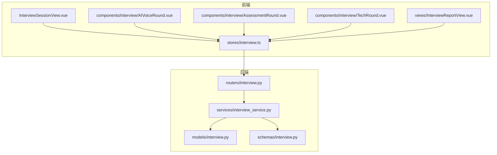

图表来源
- [InterviewSessionView.vue:1-729](file://frontEnd/src/views/InterviewSessionView.vue#L1-L729)
- [interview.ts:1-313](file://frontEnd/src/stores/interview.ts#L1-L313)
- [interview.py（路由）:1-317](file://backEnd/app/routers/interview.py#L1-L317)
- [interview_service.py:1-1202](file://backEnd/app/services/interview_service.py#L1-L1202)
- [interview.py（模型）:1-114](file://backEnd/app/models/interview.py#L1-L114)
- [interview.py（Schema）:1-152](file://backEnd/app/schemas/interview.py#L1-L152)

章节来源
- [InterviewSessionView.vue:1-729](file://frontEnd/src/views/InterviewSessionView.vue#L1-L729)
- [interview.ts:1-313](file://frontEnd/src/stores/interview.ts#L1-L313)
- [interview.py（路由）:1-317](file://backEnd/app/routers/interview.py#L1-L317)
- [interview_service.py:1-1202](file://backEnd/app/services/interview_service.py#L1-L1202)
- [interview.py（模型）:1-114](file://backEnd/app/models/interview.py#L1-L114)
- [interview.py（Schema）:1-152](file://backEnd/app/schemas/interview.py#L1-L152)

## 核心组件
- 会话与会题模型
  - InterviewSession：记录用户、岗位、当前轮次、状态、作弊次数、模式（全流程/单轮）、总分与报告JSON等。
  - InterviewQuestion：题库项，含分类、岗位类别、题型、内容JSON、标准答案JSON、难度。
  - InterviewAnswer：每道题的答案记录，含轮次、文本/代码答案、分数、反馈、用时等。
- 路由层
  - 提供开始面试、获取会话、获取题目、提交答案、进入下一轮、AI聊天(SSE)、上报切屏、中止面试、获取报告、历史记录等接口。
- 服务层
  - 负责题库种子初始化、会话CRUD、按轮次选题、评分逻辑（选择题/判断题/技术OJ/AI回答）、SSE流式AI对话、轮次推进、作弊上报、报告生成与维度聚合、建议与分析生成等。
- 前端状态与UI
  - stores/interview.ts：统一API封装、SSE解析、状态管理。
  - 各轮次组件：测评、技术面、AI语音轮次分别处理交互、计时、提交与结果展示。
  - 报告页：雷达图、维度得分、改进建议与AI综合分析展示。

章节来源
- [interview.py（模型）:1-114](file://backEnd/app/models/interview.py#L1-L114)
- [interview.py（路由）:1-317](file://backEnd/app/routers/interview.py#L1-L317)
- [interview_service.py:1-1202](file://backEnd/app/services/interview_service.py#L1-L1202)
- [interview.ts:1-313](file://frontEnd/src/stores/interview.ts#L1-L313)
- [InterviewSessionView.vue:1-729](file://frontEnd/src/views/InterviewSessionView.vue#L1-L729)
- [AIVoiceRound.vue:1-385](file://frontEnd/src/components/interview/AIVoiceRound.vue#L1-L385)
- [AssessmentRound.vue:1-227](file://frontEnd/src/components/interview/AssessmentRound.vue#L1-L227)
- [TechRound.vue:1-427](file://frontEnd/src/components/interview/TechRound.vue#L1-L427)
- [InterviewReportView.vue:1-252](file://frontEnd/src/views/InterviewReportView.vue#L1-L252)

## 架构总览
整体流程：前端发起请求 → FastAPI路由校验与参数绑定 → 调用服务层执行业务逻辑 → 读写数据库模型 → 返回响应或SSE流。

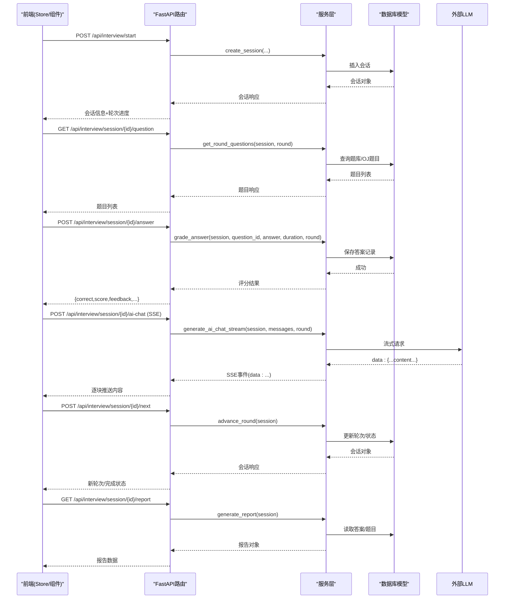

图表来源
- [interview.py（路由）:36-317](file://backEnd/app/routers/interview.py#L36-L317)
- [interview_service.py:489-1202](file://backEnd/app/services/interview_service.py#L489-L1202)
- [interview.py（模型）:19-114](file://backEnd/app/models/interview.py#L19-L114)

## 详细组件分析

### 数据结构与关系
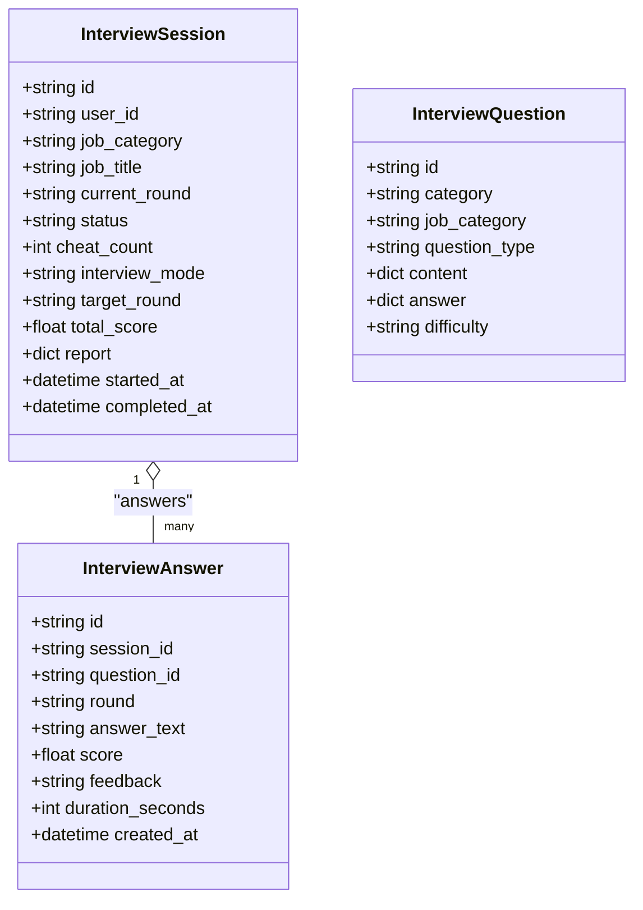

图表来源
- [interview.py（模型）:19-114](file://backEnd/app/models/interview.py#L19-L114)

章节来源
- [interview.py（模型）:19-114](file://backEnd/app/models/interview.py#L19-L114)

### 面试会话创建与轮次进度
- 前端通过startInterview选择岗位与模式（full/single），后端create_session根据模式决定起始轮次（single时从target_round开始）。
- 返回的rounds_progress由_build_rounds_progress计算，支持单轮只显示目标轮次，全流程显示全部轮次及active/completed/pending状态。

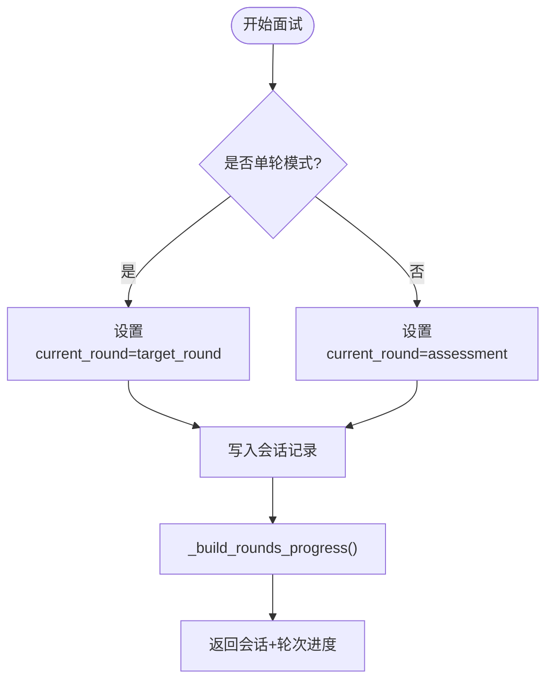

图表来源
- [interview_service.py:489-511](file://backEnd/app/services/interview_service.py#L489-L511)
- [interview_service.py:46-66](file://backEnd/app/services/interview_service.py#L46-L66)
- [interview.py（路由）:36-58](file://backEnd/app/routers/interview.py#L36-L58)

章节来源
- [interview_service.py:46-66](file://backEnd/app/services/interview_service.py#L46-L66)
- [interview_service.py:489-511](file://backEnd/app/services/interview_service.py#L489-L511)
- [interview.py（路由）:36-58](file://backEnd/app/routers/interview.py#L36-L58)

### 题目获取与轮次差异
- 综合素质测评：随机抽取10道选择题，每题限时30秒。
- 技术面：从OJ题库随机抽一道编程题，携带输入输出格式、样例、限制等，限时900秒。
- 业务面：优先匹配岗位类别的题目，不足则补充通用题，共5题，每题限时60秒。
- AI语音三面/四面：返回首问提示，后续通过SSE流式对话推进。

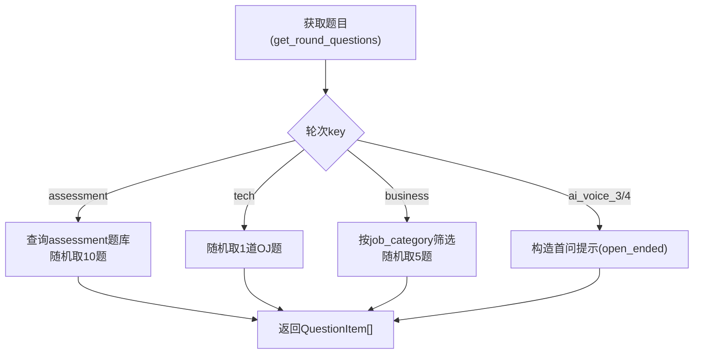

图表来源
- [interview_service.py:536-621](file://backEnd/app/services/interview_service.py#L536-L621)

章节来源
- [interview_service.py:536-621](file://backEnd/app/services/interview_service.py#L536-L621)

### 答案提交与评分链路
- 选择题/判断题：比对标准答案，正确得10分，错误0分，附带解释反馈。
- 技术面：复用OJ判题服务，接受/编译错误/运行错误等状态映射为分数与反馈。
- AI语音：调用LLM进行评分（0-15分），返回结构化JSON评分与建议。

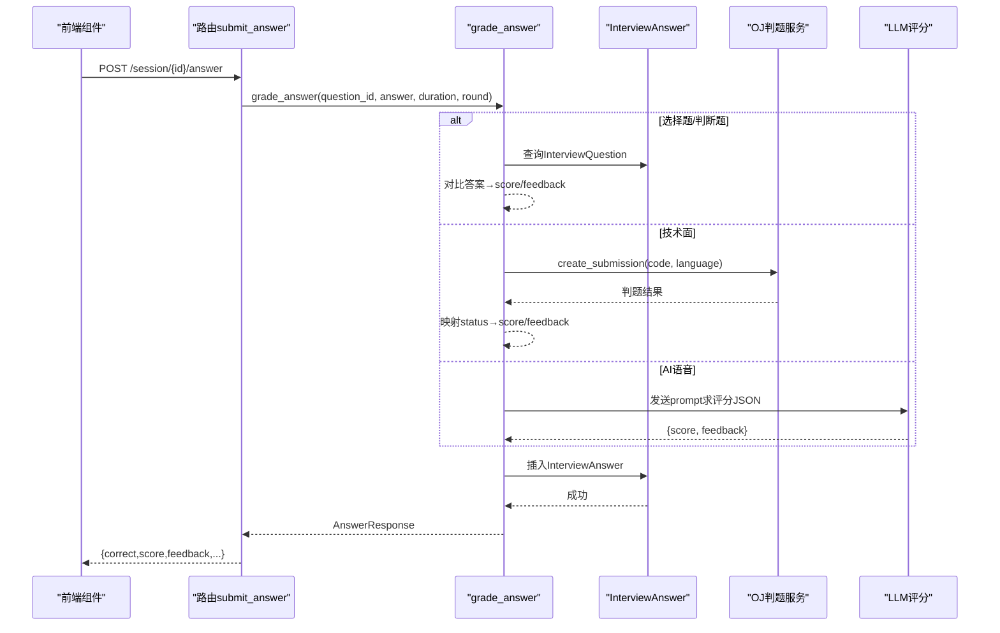

图表来源
- [interview.py（路由）:102-119](file://backEnd/app/routers/interview.py#L102-L119)
- [interview_service.py:628-740](file://backEnd/app/services/interview_service.py#L628-L740)

章节来源
- [interview.py（路由）:102-119](file://backEnd/app/routers/interview.py#L102-L119)
- [interview_service.py:628-740](file://backEnd/app/services/interview_service.py#L628-L740)

### AI对话SSE流式数据传输
- 前端sendAIChat建立fetch连接，读取body流，解析data: JSON片段，拼接完整文本并回调onChunk实现打字机效果。
- 后端generate_ai_chat_stream以httpx.stream方式调用LLM，逐行解析SSE事件，转发data: {content}给前端。

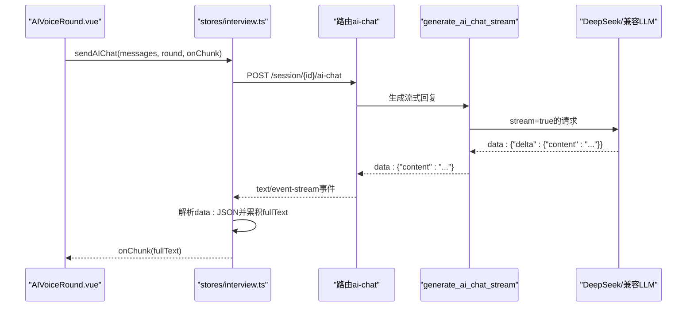

图表来源
- [interview.ts:209-253](file://frontEnd/src/stores/interview.ts#L209-L253)
- [interview.py（路由）:161-189](file://backEnd/app/routers/interview.py#L161-L189)
- [interview_service.py:797-845](file://backEnd/app/services/interview_service.py#L797-L845)

章节来源
- [interview.ts:209-253](file://frontEnd/src/stores/interview.ts#L209-L253)
- [interview.py（路由）:161-189](file://backEnd/app/routers/interview.py#L161-L189)
- [interview_service.py:797-845](file://backEnd/app/services/interview_service.py#L797-L845)

### 轮次推进与结束条件
- nextRound调用advance_round推进current_round；当所有轮次完成后，若答题数≥3，自动生成报告。
- 单轮模式下，完成即结束并标记completed。

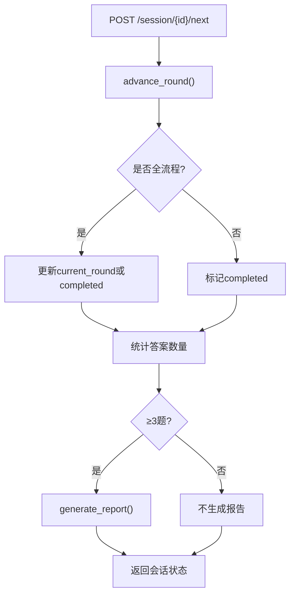

图表来源
- [interview.py（路由）:122-158](file://backEnd/app/routers/interview.py#L122-L158)
- [interview_service.py:851-872](file://backEnd/app/services/interview_service.py#L851-L872)
- [interview_service.py:893-1019](file://backEnd/app/services/interview_service.py#L893-L1019)

章节来源
- [interview.py（路由）:122-158](file://backEnd/app/routers/interview.py#L122-L158)
- [interview_service.py:851-872](file://backEnd/app/services/interview_service.py#L851-L872)
- [interview_service.py:893-1019](file://backEnd/app/services/interview_service.py#L893-L1019)

### 报告生成与雷达图数据聚合
- 按轮次分组答案，计算每轮得分与满分上限（assessment 100、tech 20、business 50、AI语音按轮次×15）。
- 将轮次映射至四维雷达：专业（tech/business）、逻辑（assessment）、沟通（AI语音）、岗位匹配（总体百分比）。
- 对每个维度设置下限75%，最终计算等级A/B/C/D，并通过LLM生成建议与分析。

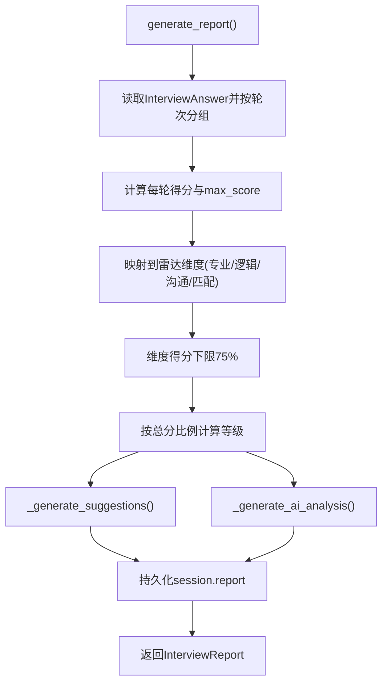

图表来源
- [interview_service.py:893-1019](file://backEnd/app/services/interview_service.py#L893-L1019)
- [interview_service.py:1022-1031](file://backEnd/app/services/interview_service.py#L1022-L1031)
- [interview_service.py:1034-1167](file://backEnd/app/services/interview_service.py#L1034-L1167)

章节来源
- [interview_service.py:893-1019](file://backEnd/app/services/interview_service.py#L893-L1019)
- [interview_service.py:1022-1031](file://backEnd/app/services/interview_service.py#L1022-L1031)
- [interview_service.py:1034-1167](file://backEnd/app/services/interview_service.py#L1034-L1167)

### 前端状态管理与实时同步
- stores/interview.ts统一管理会话、题目、AI消息、报告与历史，提供统一的API封装与SSE解析。
- InterviewSessionView.vue负责入场须知、防作弊（全屏/切屏检测）、摄像头录制、轮次切换与报告可用性检查。
- AIVoiceRound.vue实现ASR语音识别、TTS朗读、数字人表情与状态联动、SSE流式接收与自动滚动。

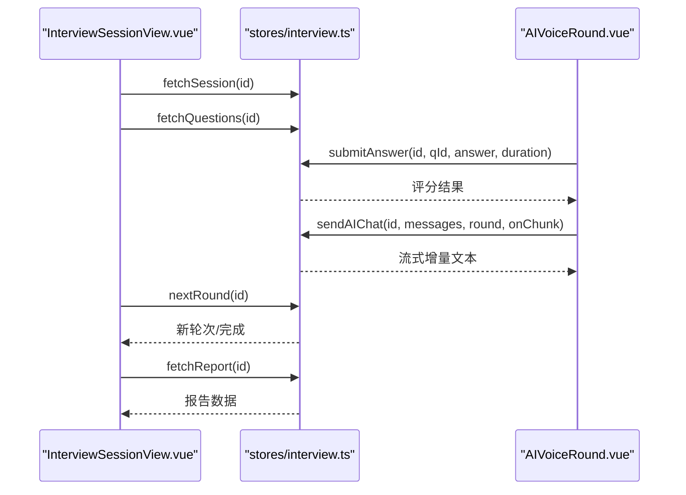

图表来源
- [InterviewSessionView.vue:1-729](file://frontEnd/src/views/InterviewSessionView.vue#L1-L729)
- [interview.ts:128-313](file://frontEnd/src/stores/interview.ts#L128-L313)
- [AIVoiceRound.vue:1-385](file://frontEnd/src/components/interview/AIVoiceRound.vue#L1-L385)

章节来源
- [InterviewSessionView.vue:1-729](file://frontEnd/src/views/InterviewSessionView.vue#L1-L729)
- [interview.ts:128-313](file://frontEnd/src/stores/interview.ts#L128-L313)
- [AIVoiceRound.vue:1-385](file://frontEnd/src/components/interview/AIVoiceRound.vue#L1-L385)

### 复杂业务场景数据流向图
- 全流程面试：assessment → tech → business → ai_voice_3 → ai_voice_4，每轮结束后推进，完成后触发报告生成。
- 单轮练习：仅执行指定target_round，完成后直接结束并生成该轮单独报告。

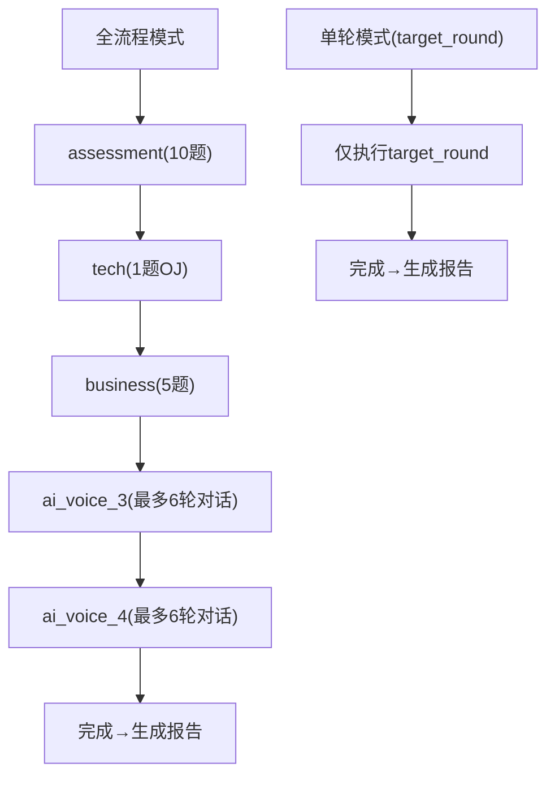

图表来源
- [interview_service.py:35-43](file://backEnd/app/services/interview_service.py#L35-L43)
- [interview_service.py:489-511](file://backEnd/app/services/interview_service.py#L489-L511)
- [interview_service.py:851-872](file://backEnd/app/services/interview_service.py#L851-L872)

章节来源
- [interview_service.py:35-43](file://backEnd/app/services/interview_service.py#L35-L43)
- [interview_service.py:489-511](file://backEnd/app/services/interview_service.py#L489-L511)
- [interview_service.py:851-872](file://backEnd/app/services/interview_service.py#L851-L872)

## 依赖关系分析
- 路由依赖服务层，服务层依赖模型与外部LLM/OJ服务。
- 前端依赖Pinia store，store封装HTTP/SSE通信，组件消费store状态。

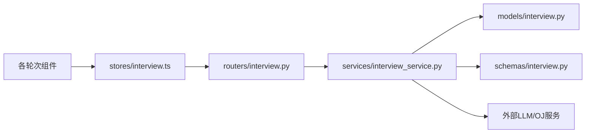

图表来源
- [interview.py（路由）:1-317](file://backEnd/app/routers/interview.py#L1-L317)
- [interview_service.py:1-1202](file://backEnd/app/services/interview_service.py#L1-L1202)
- [interview.py（模型）:1-114](file://backEnd/app/models/interview.py#L1-L114)
- [interview.py（Schema）:1-152](file://backEnd/app/schemas/interview.py#L1-L152)
- [interview.ts:1-313](file://frontEnd/src/stores/interview.ts#L1-L313)

章节来源
- [interview.py（路由）:1-317](file://backEnd/app/routers/interview.py#L1-L317)
- [interview_service.py:1-1202](file://backEnd/app/services/interview_service.py#L1-L1202)
- [interview.py（模型）:1-114](file://backEnd/app/models/interview.py#L1-L114)
- [interview.py（Schema）:1-152](file://backEnd/app/schemas/interview.py#L1-L152)
- [interview.ts:1-313](file://frontEnd/src/stores/interview.ts#L1-L313)

## 性能考量
- SSE流式传输降低首字延迟，提升AI对话体验；后端使用httpx.stream避免全量缓冲。
- 报告生成涉及多次LLM调用（建议与分析），可考虑缓存或异步任务队列以降低阻塞。
- 题库与OJ题目查询应加索引与分页策略，避免大数据量下性能退化。
- 前端SSE解析需健壮处理异常与乱序，确保用户体验稳定。

[本节为通用指导，无需具体文件引用]

## 故障排查指南
- 会话不存在或已结束：路由层会返回404/400错误，检查session_id与user_id权限。
- 答题数量不足无法生成报告：后端在获取报告前检查答案计数，至少3题才允许生成。
- AI对话失败：检查网络与LLM配置，前端onChunk需容错跳过无效数据。
- 切屏自动中止：前端检测到visibilitychange且cheat_count≥5时自动中止，后端同步更新状态。

章节来源
- [interview.py（路由）:61-82](file://backEnd/app/routers/interview.py#L61-L82)
- [interview.py（路由）:259-303](file://backEnd/app/routers/interview.py#L259-L303)
- [interview_service.py:879-886](file://backEnd/app/services/interview_service.py#L879-L886)
- [InterviewSessionView.vue:380-424](file://frontEnd/src/views/InterviewSessionView.vue#L380-L424)

## 结论
本系统围绕“面试会话—题目—答案—评分—报告”的主链路构建，结合SSE流式AI对话与多维度评分聚合，实现了全流程与单轮两种模式的灵活演练。通过清晰的轮次定义、严格的评分规则与完善的报告可视化，为用户提供接近真实面试的体验与可操作的改进建议。

[本节为总结性内容，无需具体文件引用]

## 附录
- 关键API路径参考
  - 开始面试：POST /api/interview/start
  - 获取会话：GET /api/interview/session/{id}
  - 获取题目：GET /api/interview/session/{id}/question
  - 提交答案：POST /api/interview/session/{id}/answer
  - 进入下一轮：POST /api/interview/session/{id}/next
  - AI对话(SSE)：POST /api/interview/session/{id}/ai-chat
  - 上报切屏：POST /api/interview/session/{id}/cheat
  - 中止面试：POST /api/interview/session/{id}/abort
  - 获取报告：GET /api/interview/session/{id}/report
  - 历史记录：GET /api/interview/history

章节来源
- [interview.py（路由）:29-317](file://backEnd/app/routers/interview.py#L29-L317)