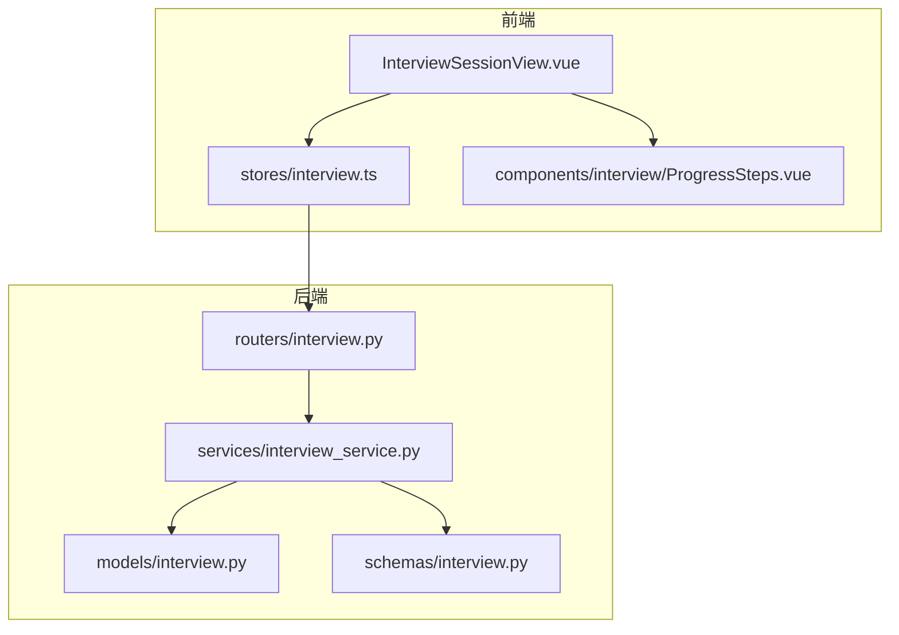
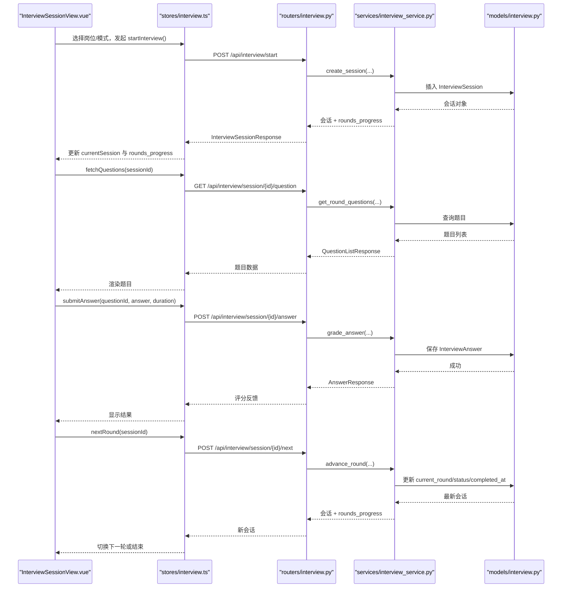
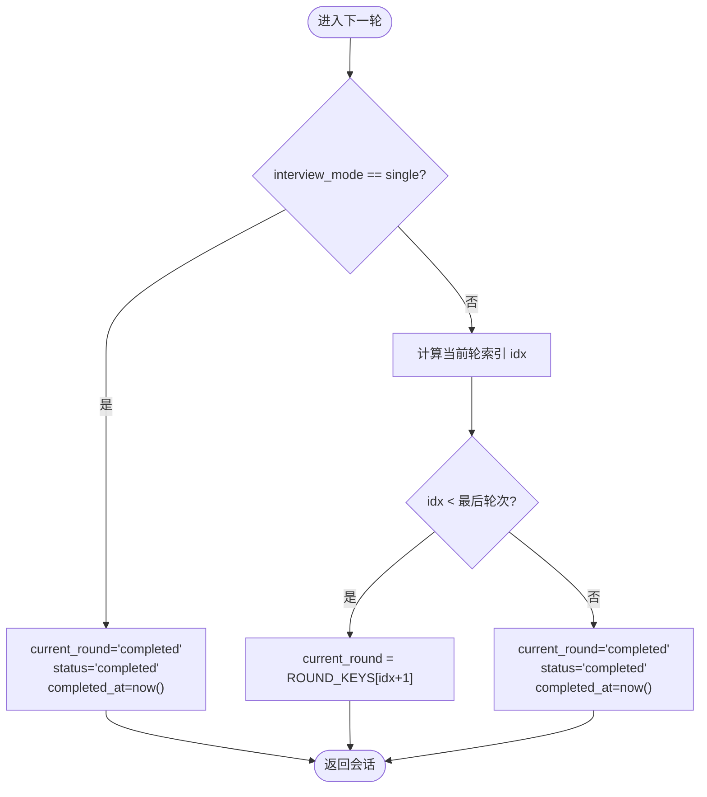
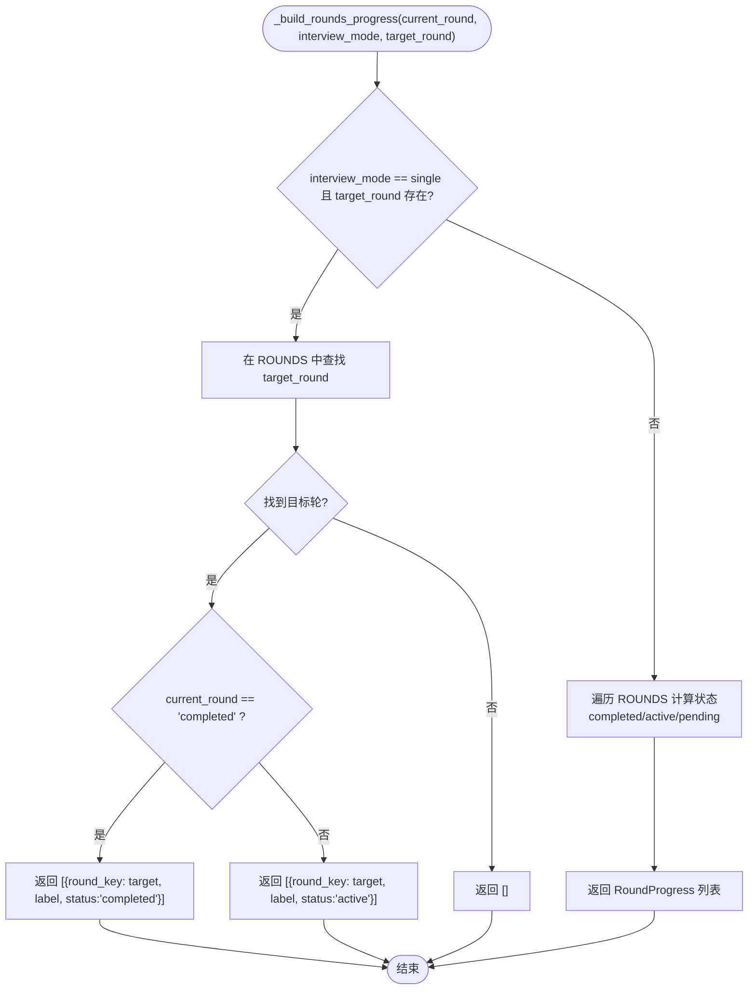
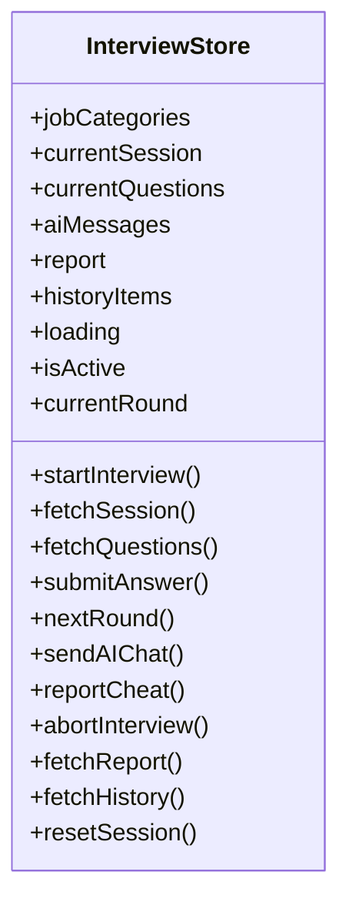
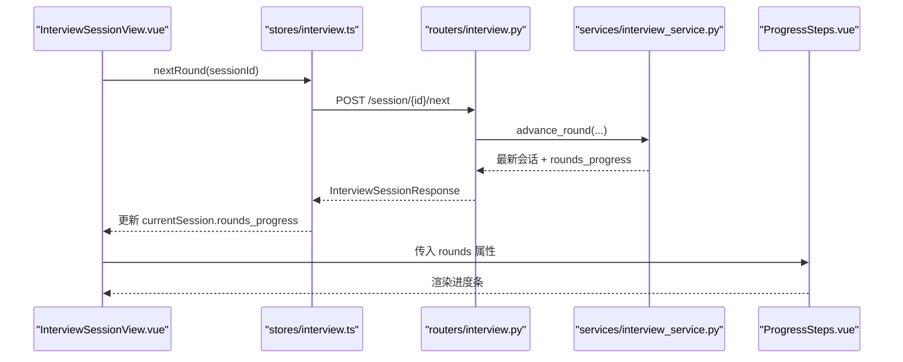
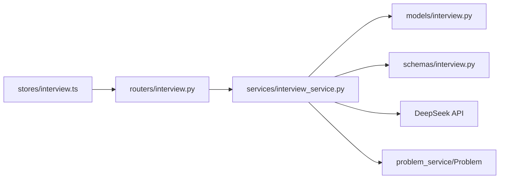

# 面试进度跟踪数据流

<cite>
**本文引用的文件**   
- [interview.py](file://backEnd/app/models/interview.py)
- [interview_service.py](file://backEnd/app/services/interview_service.py)
- [interview.py](file://backEnd/app/routers/interview.py)
- [interview.py](file://backEnd/app/schemas/interview.py)
- [interview.ts](file://frontEnd/src/stores/interview.ts)
- [InterviewSessionView.vue](file://frontEnd/src/views/InterviewSessionView.vue)
- [ProgressSteps.vue](file://frontEnd/src/components/interview/ProgressSteps.vue)
</cite>

## 目录
1. [引言](#引言)
2. [项目结构](#项目结构)
3. [核心组件](#核心组件)
4. [架构总览](#架构总览)
5. [详细组件分析](#详细组件分析)
6. [依赖关系分析](#依赖关系分析)
7. [性能考量](#性能考量)
8. [故障排查指南](#故障排查指南)
9. [结论](#结论)
10. [附录](#附录)

## 引言
本文件面向HR XF系统的“面试进度跟踪”能力，聚焦以下目标：
- 全面描述面试会话的状态管理机制，包括单轮模式与全流程模式的差异处理。
- 详细说明后端 _build_rounds_progress（对应文档中的_rounds_progress_）函数的实现逻辑，包括轮次状态计算、进度条数据生成和UI状态同步。
- 解释 InterviewSession 模型的关键字段设计及其数据流转，如 current_round、status、interview_mode 等。
- 文档化面试进度的持久化存储机制，包括状态更新、断点续练与进度恢复。
- 说明前端状态管理实现，包括 Pinia store 的面试状态维护、实时更新和用户交互响应。
- 提供面试进度跟踪的数据流图，展示状态变更的传播机制与前后端数据同步策略。

## 项目结构
围绕“面试进度跟踪”，关键代码分布在如下位置：
- 后端模型层：定义面试会话、题目、答案等实体及字段。
- 后端服务层：封装业务逻辑，包括轮次推进、评分、报告生成、进度计算等。
- 后端路由层：暴露REST接口，串联服务并返回统一响应格式。
- 前端Store：集中管理面试会话、题目、AI对话、报告等状态，并提供API调用方法。
- 前端视图与组件：承载用户交互、防作弊、摄像头录制、进度条渲染等。

图表来源
- [InterviewSessionView.vue:1-729](file://frontEnd/src/views/InterviewSessionView.vue#L1-L729)
- [interview.ts:1-313](file://frontEnd/src/stores/interview.ts#L1-L313)
- [ProgressSteps.vue:1-44](file://frontEnd/src/components/interview/ProgressSteps.vue#L1-L44)
- [interview.py:1-317](file://backEnd/app/routers/interview.py#L1-L317)
- [interview_service.py:1-1202](file://backEnd/app/services/interview_service.py#L1-L1202)
- [interview.py:1-114](file://backEnd/app/models/interview.py#L1-L114)
- [interview.py:1-152](file://backEnd/app/schemas/interview.py#L1-L152)

章节来源
- [InterviewSessionView.vue:1-729](file://frontEnd/src/views/InterviewSessionView.vue#L1-L729)
- [interview.ts:1-313](file://frontEnd/src/stores/interview.ts#L1-L313)
- [ProgressSteps.vue:1-44](file://frontEnd/src/components/interview/ProgressSteps.vue#L1-L44)
- [interview.py:1-317](file://backEnd/app/routers/interview.py#L1-L317)
- [interview_service.py:1-1202](file://backEnd/app/services/interview_service.py#L1-L1202)
- [interview.py:1-114](file://backEnd/app/models/interview.py#L1-L114)
- [interview.py:1-152](file://backEnd/app/schemas/interview.py#L1-L152)

## 核心组件
- 面试会话模型 InterviewSession：包含会话标识、岗位信息、当前轮次、状态、作弊次数、面试模式、目标轮次、总分、报告JSON、开始/完成时间等关键字段。
- 面试服务 interview_service：提供创建会话、获取题目、提交答案、推进轮次、上报切屏、生成报告、构建进度列表等能力。
- 面试路由 routers/interview：对外暴露 REST API，负责鉴权、参数校验、调用服务、组装响应。
- 前端 Store stores/interview.ts：维护会话、题目、AI消息、报告、历史等状态，封装请求方法与SSE流式处理。
- 视图与组件：InterviewSessionView.vue 负责主流程控制、防作弊、摄像头录制、轮次切换；ProgressSteps.vue 渲染进度条。

章节来源
- [interview.py:19-56](file://backEnd/app/models/interview.py#L19-L56)
- [interview_service.py:489-511](file://backEnd/app/services/interview_service.py#L489-L511)
- [interview.py:36-82](file://backEnd/app/routers/interview.py#L36-L82)
- [interview.ts:128-313](file://frontEnd/src/stores/interview.ts#L128-L313)
- [InterviewSessionView.vue:292-729](file://frontEnd/src/views/InterviewSessionView.vue#L292-L729)
- [ProgressSteps.vue:1-44](file://frontEnd/src/components/interview/ProgressSteps.vue#L1-L44)

## 架构总览
面试进度跟踪的整体数据流遵循“前端交互 → Store 调用 → 路由 → 服务 → 模型持久化 → 响应回写前端”的闭环。

图表来源
- [interview.py:36-158](file://backEnd/app/routers/interview.py#L36-L158)
- [interview_service.py:489-511](file://backEnd/app/services/interview_service.py#L489-L511)
- [interview_service.py:536-621](file://backEnd/app/services/interview_service.py#L536-L621)
- [interview_service.py:628-740](file://backEnd/app/services/interview_service.py#L628-L740)
- [interview_service.py:851-872](file://backEnd/app/services/interview_service.py#L851-L872)
- [interview.ts:149-207](file://frontEnd/src/stores/interview.ts#L149-L207)
- [InterviewSessionView.vue:503-530](file://frontEnd/src/views/InterviewSessionView.vue#L503-L530)

## 详细组件分析

### 1) InterviewSession 模型与状态字段设计
- 关键字段
  - current_round：当前轮次键值（assessment/tech/business/ai_voice_3/ai_voice_4/completed）。
  - status：会话状态（in_progress/completed/aborted）。
  - interview_mode：面试模式（full/single）。
  - target_round：单轮模式下练习的目标轮次键值。
  - cheat_count：切屏计数，达到阈值自动中止。
  - total_score/report：总分与多维度评分报告（JSON）。
  - started_at/completed_at：开始与完成时间戳。
- 数据流转
  - 创建会话时根据 interview_mode 与 target_round 决定初始 current_round。
  - 答题后保存 InterviewAnswer 记录，累积分数与反馈。
  - 推进轮次时更新 current_round 与 status，必要时设置 completed_at。
  - 中止时设置 status=aborted 与 completed_at。
  - 报告生成时将多维评分写入 report JSON 与 total_score。

章节来源
- [interview.py:19-56](file://backEnd/app/models/interview.py#L19-L56)
- [interview_service.py:489-511](file://backEnd/app/services/interview_service.py#L489-L511)
- [interview_service.py:851-872](file://backEnd/app/services/interview_service.py#L851-L872)
- [interview_service.py:879-886](file://backEnd/app/services/interview_service.py#L879-L886)
- [interview_service.py:893-1019](file://backEnd/app/services/interview_service.py#L893-L1019)

### 2) 轮次推进与模式差异（单轮 vs 全流程）
- 单轮模式（single）
  - 创建会话时 current_round 直接指向 target_round。
  - 当该轮完成后，advance_round 将 current_round 置为 completed，status 置为 completed，并记录 completed_at。
- 全流程模式（full）
  - 按 ROUNDS 顺序推进：assessment → tech → business → ai_voice_3 → ai_voice_4。
  - 到达末尾时，current_round 置为 completed，status 置为 completed，并记录 completed_at。

图表来源
- [interview_service.py:851-872](file://backEnd/app/services/interview_service.py#L851-L872)

章节来源
- [interview_service.py:851-872](file://backEnd/app/services/interview_service.py#L851-L872)

### 3) _build_rounds_progress 函数（进度条数据生成与UI同步）
- 输入：current_round、interview_mode、target_round。
- 输出：RoundProgress 列表，用于前端渲染进度条。
- 单轮模式
  - 仅返回目标轮次的条目，若 current_round 为 completed，则状态为 completed，否则为 active。
- 全流程模式
  - 遍历所有轮次，已完成的标记 completed，当前轮标记 active，未到达的标记 pending。

图表来源
- [interview_service.py:46-66](file://backEnd/app/services/interview_service.py#L46-L66)

章节来源
- [interview_service.py:46-66](file://backEnd/app/services/interview_service.py#L46-L66)

### 4) 前端状态管理与实时交互
- Pinia store 职责
  - 维护 currentSession、currentQuestions、aiMessages、report、historyItems 等状态。
  - 提供 startInterview、fetchSession、fetchQuestions、submitAnswer、nextRound、sendAIChat、reportCheat、abortInterview、fetchReport、fetchHistory 等方法。
  - 通过 computed 派生 isActive、currentRound 等派生状态，驱动视图条件渲染。
- 实时更新
  - AI 对话使用 SSE 流式读取，逐块拼接内容并通过回调 onChunk 更新界面。
  - 轮次切换时监听 currentRound 变化，自动加载下一轮题目。
- 用户交互响应
  - 防作弊：visibilitychange 检测切屏，累计 cheat_count 并上报；≥5 次自动中止。
  - 全屏保护（可选）：拦截 ESC、F12 等快捷键，尝试强制全屏。
  - 摄像头录制：启动 MediaRecorder 本地录制，页面卸载时停止。

图表来源
- [interview.ts:128-313](file://frontEnd/src/stores/interview.ts#L128-L313)

章节来源
- [interview.ts:128-313](file://frontEnd/src/stores/interview.ts#L128-L313)
- [InterviewSessionView.vue:372-491](file://frontEnd/src/views/InterviewSessionView.vue#L372-L491)
- [InterviewSessionView.vue:679-683](file://frontEnd/src/views/InterviewSessionView.vue#L679-L683)

### 5) 进度条渲染与UI状态同步
- ProgressSteps 组件接收 rounds 列表，根据每个 step.status 渲染不同样式：
  - active：高亮动画表示当前轮次。
  - completed：绿色表示已完成。
  - pending：灰色表示待进行。
- 数据来源
  - 来自后端 _build_rounds_progress 生成的 RoundProgress 列表，随会话响应一并返回。
  - 前端通过 currentSession.rounds_progress 绑定到组件。

图表来源
- [interview_service.py:851-872](file://backEnd/app/services/interview_service.py#L851-L872)
- [interview.py:122-158](file://backEnd/app/routers/interview.py#L122-L158)
- [interview.ts:201-207](file://frontEnd/src/stores/interview.ts#L201-L207)
- [ProgressSteps.vue:1-44](file://frontEnd/src/components/interview/ProgressSteps.vue#L1-L44)

章节来源
- [ProgressSteps.vue:1-44](file://frontEnd/src/components/interview/ProgressSteps.vue#L1-L44)
- [interview.ts:201-207](file://frontEnd/src/stores/interview.ts#L201-L207)
- [interview.py:122-158](file://backEnd/app/routers/interview.py#L122-L158)
- [interview_service.py:851-872](file://backEnd/app/services/interview_service.py#L851-L872)

### 6) 持久化存储机制（状态更新、断点续练、进度恢复）
- 状态更新
  - 创建会话：写入 InterviewSession 初始状态与模式。
  - 提交答案：写入 InterviewAnswer 记录，包含轮次、答案文本、得分、反馈、用时。
  - 推进轮次：更新 current_round、status、completed_at。
  - 中止会话：设置 status=aborted、completed_at。
  - 生成报告：计算多维评分，写入 session.total_score 与 session.report（JSON）。
- 断点续练与进度恢复
  - 前端通过 fetchSession(sessionId) 拉取最新会话状态，包括 current_round、status、rounds_progress 等，从而恢复界面与流程。
  - 路由层在多个接口返回 rounds_progress，确保前端始终基于服务端计算的进度渲染。

章节来源
- [interview_service.py:489-511](file://backEnd/app/services/interview_service.py#L489-L511)
- [interview_service.py:628-740](file://backEnd/app/services/interview_service.py#L628-L740)
- [interview_service.py:851-872](file://backEnd/app/services/interview_service.py#L851-L872)
- [interview_service.py:879-886](file://backEnd/app/services/interview_service.py#L879-L886)
- [interview_service.py:893-1019](file://backEnd/app/services/interview_service.py#L893-L1019)
- [interview.ts:173-175](file://frontEnd/src/stores/interview.ts#L173-L175)
- [interview.py:61-82](file://backEnd/app/routers/interview.py#L61-L82)

### 7) 评分与报告生成（影响进度与UI）
- 评分
  - assessment/business：匹配标准答案，正确得满分，错误得0分，附带反馈。
  - tech：复用OJ判题系统，根据提交结果打分。
  - ai_voice_3/ai_voice_4：调用LLM评分，返回分数与建议。
- 报告
  - 按轮次聚合答案，计算每轮得分与满分上限，映射至雷达维度（专业、逻辑、沟通、匹配）。
  - 等级划分依据总分百分比，A/B/C/D。
  - 支持单轮模式只统计目标轮次，全流程模式统计全部轮次。
  - 报告持久化到 session.report JSON，便于后续查看与分享。

章节来源
- [interview_service.py:628-740](file://backEnd/app/services/interview_service.py#L628-L740)
- [interview_service.py:893-1019](file://backEnd/app/services/interview_service.py#L893-L1019)
- [interview.py:259-303](file://backEnd/app/routers/interview.py#L259-L303)

## 依赖关系分析
- 模块耦合
  - 路由层依赖服务层，服务层依赖模型与Schema，前端Store依赖路由API。
  - 进度计算集中在服务层，避免前后端重复逻辑，保证一致性。
- 外部依赖
  - LLM评分与建议生成依赖 DeepSeek API（httpx异步客户端）。
  - OJ判题依赖 problem_service 与 Problem 模型。
- 潜在循环依赖
  - 当前未发现明显循环依赖；各层职责清晰。

图表来源
- [interview.ts:128-313](file://frontEnd/src/stores/interview.ts#L128-L313)
- [interview.py:1-317](file://backEnd/app/routers/interview.py#L1-L317)
- [interview_service.py:1-1202](file://backEnd/app/services/interview_service.py#L1-L1202)
- [interview.py:1-114](file://backEnd/app/models/interview.py#L1-L114)
- [interview.py:1-152](file://backEnd/app/schemas/interview.py#L1-L152)

章节来源
- [interview.ts:128-313](file://frontEnd/src/stores/interview.ts#L128-L313)
- [interview.py:1-317](file://backEnd/app/routers/interview.py#L1-L317)
- [interview_service.py:1-1202](file://backEnd/app/services/interview_service.py#L1-L1202)
- [interview.py:1-114](file://backEnd/app/models/interview.py#L1-L114)
- [interview.py:1-152](file://backEnd/app/schemas/interview.py#L1-L152)

## 性能考量
- 题目获取
  - assessment 随机抽取10题，business 随机抽取5题，注意数据库查询与shuffle开销。
  - tech 从OJ题库随机抽取1题，需关注问题库规模与排序随机性。
- AI 对话与评分
  - SSE 流式传输减少首字节延迟，但需注意网络抖动与重试策略。
  - LLM评分建议增加超时与降级策略，避免阻塞主流程。
- 报告生成
  - 聚合答案与维度映射可能涉及多次查询，可考虑缓存或批量查询优化。
- 前端渲染
  - 进度条与轮次切换应尽量避免重排重绘，使用computed与响应式更新。

[本节为通用指导，不直接分析具体文件]

## 故障排查指南
- 常见问题
  - 会话不存在：检查路由鉴权与会话ID是否正确，确认用户权限。
  - 面试已结束：状态非 in_progress 时禁止继续答题或推进轮次。
  - 切屏过多：cheat_count ≥ 5 自动中止，检查前端 visibilitychange 事件是否触发。
  - 报告不可用：答题数不足3题无法生成报告，提示用户继续答题。
- 定位步骤
  - 查看后端日志与服务异常（LLM调用失败、OJ判题异常）。
  - 检查前端网络请求与SSE流是否正常接收。
  - 核对数据库记录（InterviewSession、InterviewAnswer）是否一致。

章节来源
- [interview.py:85-119](file://backEnd/app/routers/interview.py#L85-L119)
- [interview_service.py:879-886](file://backEnd/app/services/interview_service.py#L879-L886)
- [interview.py:259-303](file://backEnd/app/routers/interview.py#L259-L303)
- [InterviewSessionView.vue:372-491](file://frontEnd/src/views/InterviewSessionView.vue#L372-L491)

## 结论
本系统通过清晰的分层架构与明确的状态机设计，实现了面试进度的可靠跟踪与可视化呈现。_build_rounds_progress 作为进度计算的核心，保证了前后端进度一致；InterviewSession 模型的关键字段贯穿整个生命周期，支撑了单轮与全流程两种模式的差异化处理。前端Pinia store与SSE流式通信提升了用户体验，配合防作弊与摄像头录制增强了面试的严肃性与真实性。整体方案具备良好的扩展性与可维护性。

[本节为总结，不直接分析具体文件]

## 附录
- 术语
  - 单轮模式：仅针对某一轮次进行练习，完成后即结束。
  - 全流程模式：依次完成所有轮次，最终生成综合报告。
  - 进度条：由 RoundProgress 列表驱动的UI组件，直观展示轮次状态。
- 相关接口路径
  - 开始面试：POST /api/interview/start
  - 获取会话：GET /api/interview/session/{id}
  - 获取题目：GET /api/interview/session/{id}/question
  - 提交答案：POST /api/interview/session/{id}/answer
  - 进入下一轮：POST /api/interview/session/{id}/next
  - AI对话：POST /api/interview/session/{id}/ai-chat
  - 上报切屏：POST /api/interview/session/{id}/cheat
  - 中止面试：POST /api/interview/session/{id}/abort
  - 获取报告：GET /api/interview/session/{id}/report
  - 历史记录：GET /api/interview/history

章节来源
- [interview.py:29-317](file://backEnd/app/routers/interview.py#L29-L317)
- [interview.ts:103-124](file://frontEnd/src/stores/interview.ts#L103-L124)