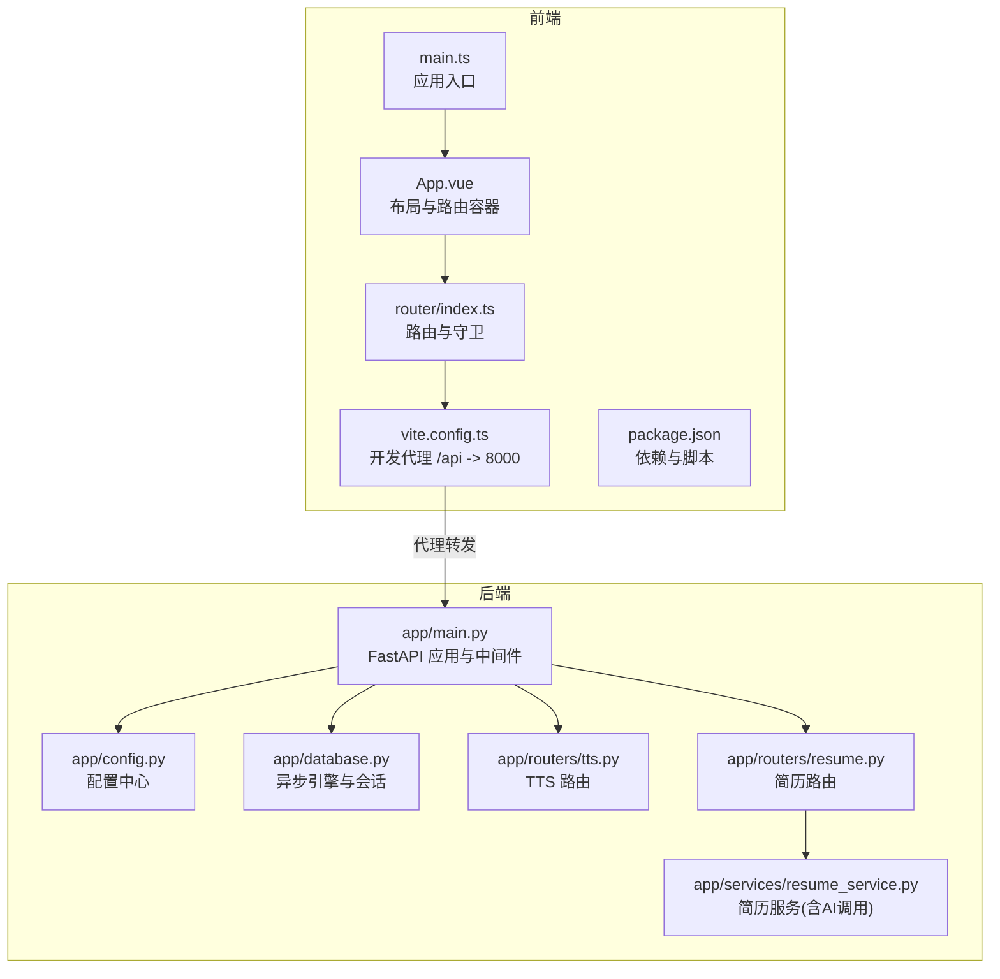
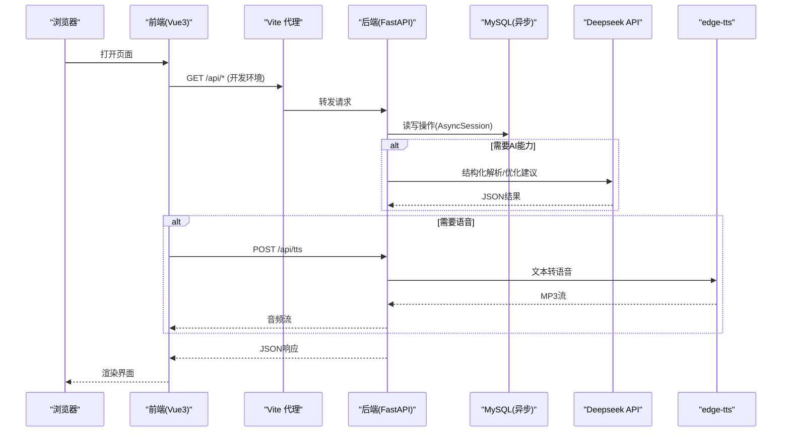
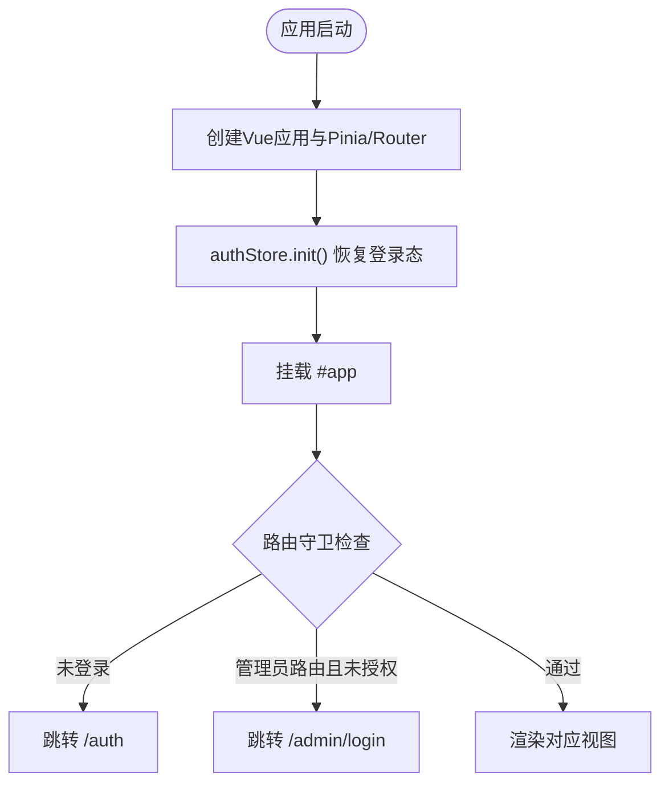
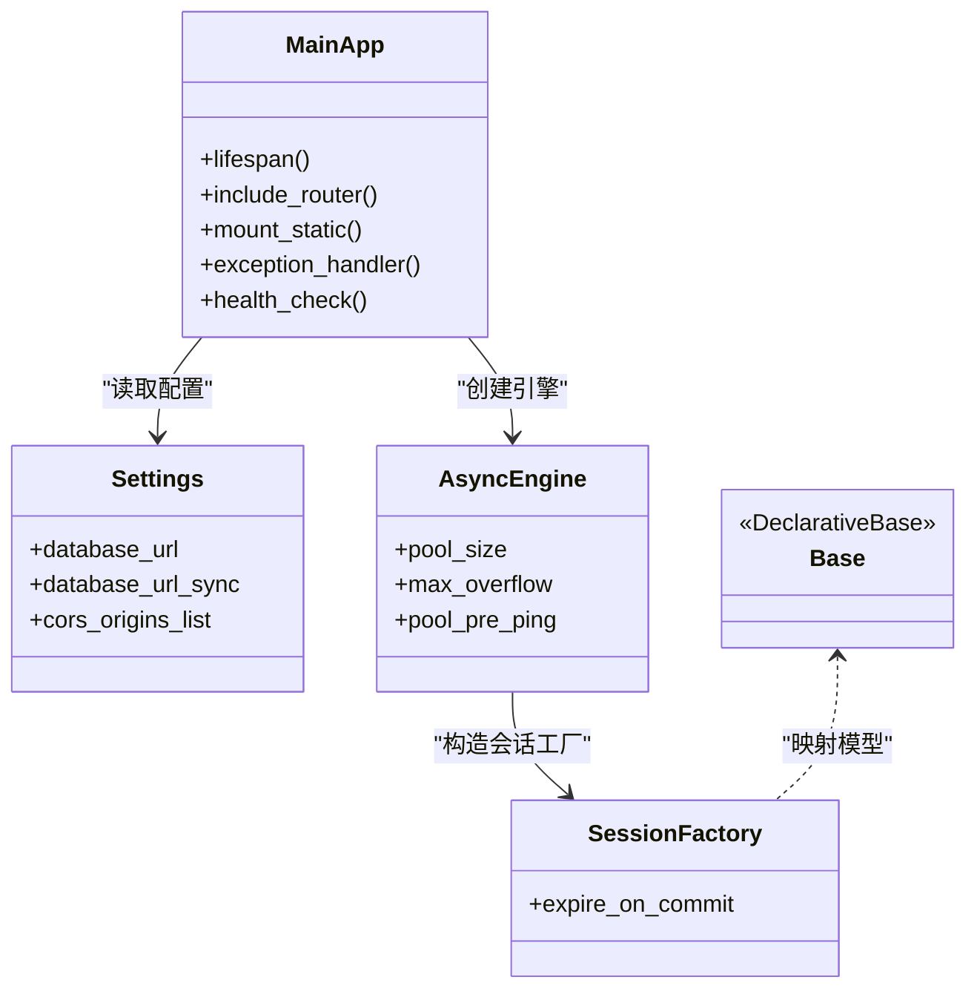
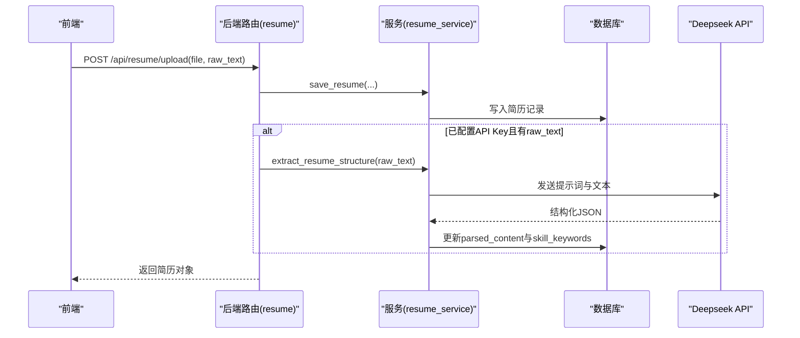
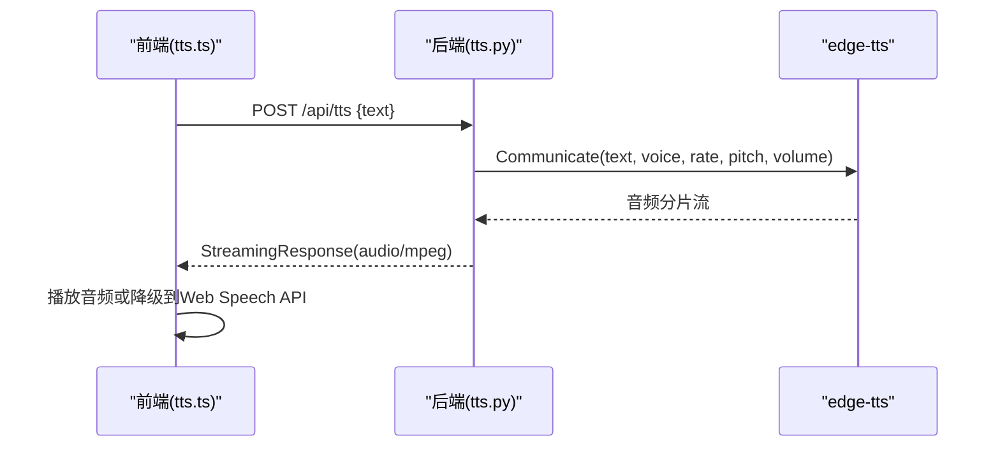
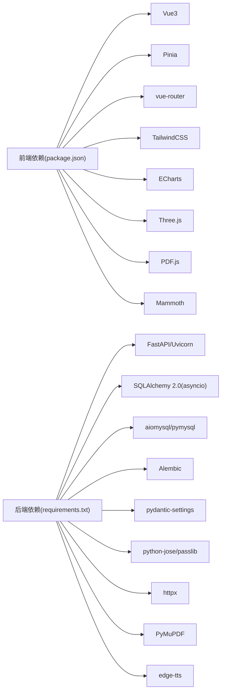

# 整体架构概览

<cite>
**本文引用的文件列表**
- [backEnd/app/main.py](file://backEnd/app/main.py)
- [backEnd/app/config.py](file://backEnd/app/config.py)
- [backEnd/app/database.py](file://backEnd/app/database.py)
- [backEnd/requirements.txt](file://backEnd/requirements.txt)
- [frontEnd/src/main.ts](file://frontEnd/src/main.ts)
- [frontEnd/src/App.vue](file://frontEnd/src/App.vue)
- [frontEnd/src/router/index.ts](file://frontEnd/src/router/index.ts)
- [frontEnd/vite.config.ts](file://frontEnd/vite.config.ts)
- [frontEnd/package.json](file://frontEnd/package.json)
- [start.cmd](file://start.cmd)
- [backEnd/app/routers/tts.py](file://backEnd/app/routers/tts.py)
- [frontEnd/src/utils/tts.ts](file://frontEnd/src/utils/tts.ts)
- [backEnd/app/routers/resume.py](file://backEnd/app/routers/resume.py)
- [backEnd/app/services/resume_service.py](file://backEnd/app/services/resume_service.py)
</cite>

## 目录
1. [引言](#引言)
2. [项目结构](#项目结构)
3. [核心组件](#核心组件)
4. [架构总览](#架构总览)
5. [详细组件分析](#详细组件分析)
6. [依赖关系分析](#依赖关系分析)
7. [性能与可扩展性](#性能与可扩展性)
8. [故障排查指南](#故障排查指南)
9. [结论](#结论)

## 引言
本文件为 HR XF 系统的整体架构概览，面向架构师与高级开发者，系统阐述前后端分离、微服务思想的应用与实践。HR XF 采用 Vue3 + TypeScript + Vite 的前端工程与 FastAPI + SQLAlchemy 异步后端组合，提供简历解析、AI 面试、职业测评、代码评测、TTS 语音合成等能力。文档将给出系统上下文图与组件分解图，解释技术选型权衡（如 Vue3 + FastAPI、异步模型优势），并讨论模块化组织与扩展策略。

## 项目结构
仓库采用前后端分离的目录组织：
- backEnd：FastAPI 应用，包含路由、服务层、数据模型、配置与数据库初始化；通过 Alembic 管理迁移；静态资源上传目录挂载于 /api/uploads。
- frontEnd：Vue3 + TypeScript + Vite 前端工程，使用 Pinia 做状态管理，vue-router 做路由与权限守卫，TailwindCSS 构建 UI。
- start.cmd：一键启动脚本，同时拉起后端 Uvicorn 与前端开发服务器，并提供本地代理转发。

图表来源
- [frontEnd/src/main.ts:1-19](file://frontEnd/src/main.ts#L1-L19)
- [frontEnd/src/App.vue:1-21](file://frontEnd/src/App.vue#L1-L21)
- [frontEnd/src/router/index.ts:1-167](file://frontEnd/src/router/index.ts#L1-L167)
- [frontEnd/vite.config.ts:1-21](file://frontEnd/vite.config.ts#L1-L21)
- [backEnd/app/main.py:1-90](file://backEnd/app/main.py#L1-L90)
- [backEnd/app/config.py:1-71](file://backEnd/app/config.py#L1-L71)
- [backEnd/app/database.py:1-58](file://backEnd/app/database.py#L1-L58)
- [backEnd/app/routers/tts.py:1-63](file://backEnd/app/routers/tts.py#L1-L63)
- [backEnd/app/routers/resume.py:42-102](file://backEnd/app/routers/resume.py#L42-L102)
- [backEnd/app/services/resume_service.py:49-91](file://backEnd/app/services/resume_service.py#L49-L91)

章节来源
- [start.cmd:1-35](file://start.cmd#L1-L35)
- [frontEnd/package.json:1-35](file://frontEnd/package.json#L1-L35)

## 核心组件
- 前端应用（Vue3）
  - 入口与生命周期：main.ts 创建应用、注册 Pinia 与 Router，并在挂载前恢复登录态。
  - 路由与权限：router/index.ts 定义页面路由与元信息，实现普通用户与管理员的访问控制。
  - 开发代理：vite.config.ts 将 /api 请求代理至后端 8000 端口，简化跨域与联调。
  - 依赖生态：package.json 声明 Vue3、Pinia、vue-router、ECharts、Three.js、TailwindCSS 等。

- 后端服务（FastAPI）
  - 应用装配：app/main.py 注册 CORS、挂载静态上传目录、统一异常处理与健康检查。
  - 配置中心：app/config.py 集中管理数据库、JWT、CORS、Deepseek API、编译器路径等。
  - 数据访问：app/database.py 基于 SQLAlchemy 2.0 异步引擎与会话工厂，提供 get_db 依赖注入。
  - 业务路由与服务：按领域划分 routers 与 services，例如 TTS、简历、面试、问题、帖子、管理员等。

- AI 与外部集成
  - Deepseek API：用于简历结构化提取与优化建议生成，由 resume_service 封装调用。
  - TTS 语音合成：tts.py 使用 edge-tts 生成高质量中文语音流，前端 tts.ts 优先走后端，失败降级到浏览器 Web Speech API。

- 启动与部署
  - start.cmd 同时启动后端 Uvicorn 与前端 dev server，便于本地联调。

章节来源
- [frontEnd/src/main.ts:1-19](file://frontEnd/src/main.ts#L1-L19)
- [frontEnd/src/App.vue:1-21](file://frontEnd/src/App.vue#L1-L21)
- [frontEnd/src/router/index.ts:1-167](file://frontEnd/src/router/index.ts#L1-L167)
- [frontEnd/vite.config.ts:1-21](file://frontEnd/vite.config.ts#L1-L21)
- [frontEnd/package.json:1-35](file://frontEnd/package.json#L1-L35)
- [backEnd/app/main.py:1-90](file://backEnd/app/main.py#L1-L90)
- [backEnd/app/config.py:1-71](file://backEnd/app/config.py#L1-L71)
- [backEnd/app/database.py:1-58](file://backEnd/app/database.py#L1-L58)
- [backEnd/app/routers/tts.py:1-63](file://backEnd/app/routers/tts.py#L1-L63)
- [backEnd/app/services/resume_service.py:49-91](file://backEnd/app/services/resume_service.py#L49-L91)
- [start.cmd:1-35](file://start.cmd#L1-L35)

## 架构总览
下图展示系统上下文与主要交互：浏览器前端通过 Vite 开发代理或直接访问后端 REST API；后端在启动时创建表结构与种子数据，并通过异步数据库连接持久化业务数据；AI 能力以 HTTP 客户端方式调用外部 LLM；TTS 在后端生成音频流返回给前端播放。

图表来源
- [frontEnd/vite.config.ts:13-21](file://frontEnd/vite.config.ts#L13-L21)
- [backEnd/app/main.py:27-49](file://backEnd/app/main.py#L27-L49)
- [backEnd/app/database.py:31-43](file://backEnd/app/database.py#L31-L43)
- [backEnd/app/routers/tts.py:27-50](file://backEnd/app/routers/tts.py#L27-L50)
- [backEnd/app/services/resume_service.py:86-91](file://backEnd/app/services/resume_service.py#L86-L91)

## 详细组件分析

### 前端应用（Vue3 + TypeScript + Vite）
- 应用入口与状态恢复
  - main.ts 创建应用实例、注册 Pinia 与 Router，并在挂载前执行 authStore.init() 恢复登录态，确保路由守卫正确工作。
- 路由与权限
  - router/index.ts 定义多类路由（首页、认证、简历、面试、OJ、职业测评、个人中心、管理后台），通过 meta.requiresAuth 与 requiresAdmin 实现细粒度访问控制。
- 开发体验
  - vite.config.ts 配置 @ 别名与 /api 代理，使前端可直接调用后端接口，避免跨域问题。
- 依赖与生态
  - package.json 引入 ECharts、Three.js、TailwindCSS、PDF.js、Mammoth 等，支撑数据可视化、3D 角色、文档解析与样式体系。

图表来源
- [frontEnd/src/main.ts:14-18](file://frontEnd/src/main.ts#L14-L18)
- [frontEnd/src/App.vue:1-21](file://frontEnd/src/App.vue#L1-L21)
- [frontEnd/src/router/index.ts:136-164](file://frontEnd/src/router/index.ts#L136-L164)

章节来源
- [frontEnd/src/main.ts:1-19](file://frontEnd/src/main.ts#L1-L19)
- [frontEnd/src/App.vue:1-21](file://frontEnd/src/App.vue#L1-L21)
- [frontEnd/src/router/index.ts:1-167](file://frontEnd/src/router/index.ts#L1-L167)
- [frontEnd/vite.config.ts:1-21](file://frontEnd/vite.config.ts#L1-L21)
- [frontEnd/package.json:1-35](file://frontEnd/package.json#L1-L35)

### 后端服务（FastAPI + SQLAlchemy 异步）
- 应用生命周期与中间件
  - app/main.py 使用 lifespan 钩子在启动时创建表结构与种子数据，关闭时释放引擎；注册 CORS、挂载静态上传目录、统一验证错误处理与健康检查。
- 配置与环境
  - app/config.py 通过 pydantic-settings 加载 .env，提供数据库 URL、JWT 参数、CORS 白名单、Deepseek API Key/URL/Model、编译器路径等。
- 数据库层
  - app/database.py 基于 SQLAlchemy 2.0 异步引擎与 async_sessionmaker，提供 get_db 依赖注入，支持 pool_pre_ping 与连接池大小配置。
- 路由与服务分层
  - 路由层负责协议与校验，服务层封装业务逻辑与外部调用，模型层定义 ORM 实体，schemas 定义 Pydantic 请求/响应模型。

图表来源
- [backEnd/app/config.py:47-65](file://backEnd/app/config.py#L47-L65)
- [backEnd/app/database.py:31-43](file://backEnd/app/database.py#L31-L43)
- [backEnd/app/main.py:27-49](file://backEnd/app/main.py#L27-L49)

章节来源
- [backEnd/app/main.py:1-90](file://backEnd/app/main.py#L1-L90)
- [backEnd/app/config.py:1-71](file://backEnd/app/config.py#L1-L71)
- [backEnd/app/database.py:1-58](file://backEnd/app/database.py#L1-L58)

### AI 服务集成（简历结构化与优化）
- 触发点
  - 上传简历时若已配置 API Key，自动进行结构化提取；也可手动触发分析。
- 流程
  - 路由接收文件与原始文本，保存文件与记录，调用服务层解析；服务层根据提示词调用 Deepseek API，返回结构化 JSON，更新技能关键词与解析内容。
- 容错
  - AI 调用失败不影响基础保存，保证用户体验。

图表来源
- [backEnd/app/routers/resume.py:47-77](file://backEnd/app/routers/resume.py#L47-L77)
- [backEnd/app/services/resume_service.py:49-83](file://backEnd/app/services/resume_service.py#L49-L83)
- [backEnd/app/services/resume_service.py:86-91](file://backEnd/app/services/resume_service.py#L86-L91)

章节来源
- [backEnd/app/routers/resume.py:42-102](file://backEnd/app/routers/resume.py#L42-L102)
- [backEnd/app/services/resume_service.py:49-91](file://backEnd/app/services/resume_service.py#L49-L91)

### TTS 语音合成（边缘 TTS 与浏览器降级）
- 后端
  - tts.py 暴露 /api/tts 与 /api/tts/voices，使用 edge-tts 生成 MP3 流，默认使用温柔知性女声与略慢语速。
- 前端
  - tts.ts 优先调用后端 Edge TTS，失败则降级到浏览器 Web Speech API，并预热声线以提升体验。

图表来源
- [backEnd/app/routers/tts.py:27-50](file://backEnd/app/routers/tts.py#L27-L50)
- [frontEnd/src/utils/tts.ts:151-167](file://frontEnd/src/utils/tts.ts#L151-L167)

章节来源
- [backEnd/app/routers/tts.py:1-63](file://backEnd/app/routers/tts.py#L1-L63)
- [frontEnd/src/utils/tts.ts:1-175](file://frontEnd/src/utils/tts.ts#L1-L175)

## 依赖关系分析
- 前端依赖
  - Vue3、Pinia、vue-router、TailwindCSS、ECharts、Three.js、PDF.js、Mammoth 等，满足复杂交互、可视化与文档处理能力。
- 后端依赖
  - FastAPI、Uvicorn、SQLAlchemy 2.0 异步、aiomysql/pymysql、Alembic、Pydantic Settings、python-jose、passlib、httpx、PyMuPDF、edge-tts 等。
- 关键耦合点
  - 前端通过 /api 与后端通信，开发期由 Vite 代理转发；后端通过 httpx 调用 Deepseek API；TTS 通过 edge-tts 生成音频流。

图表来源
- [frontEnd/package.json:11-33](file://frontEnd/package.json#L11-L33)
- [backEnd/requirements.txt:1-27](file://backEnd/requirements.txt#L1-L27)

章节来源
- [frontEnd/package.json:1-35](file://frontEnd/package.json#L1-L35)
- [backEnd/requirements.txt:1-27](file://backEnd/requirements.txt#L1-L27)

## 性能与可扩展性
- 异步编程模型
  - 后端使用 FastAPI + SQLAlchemy 异步引擎，提升 I/O 密集型场景并发能力；数据库连接池与 ping 机制增强稳定性。
- 前端代理与缓存
  - 开发期通过 Vite 代理减少跨域开销；生产环境可通过反向代理（Nginx/Caddy）统一入口与缓存策略。
- 模块化与可插拔
  - 路由与服务按领域拆分，新增功能只需添加新路由与服务模块；AI 能力通过配置开关与提示词模板扩展。
- 存储与静态资源
  - 上传文件通过 StaticFiles 挂载，便于快速迭代；生产环境可替换为对象存储（配置中预留 MinIO）。
- 扩展建议
  - 引入消息队列处理耗时任务（如批量简历解析、报告生成）；对 AI 调用增加重试与熔断；对 TTS 输出考虑 CDN 缓存热点音频。

[本节为通用指导，不直接分析具体文件]

## 故障排查指南
- 启动与端口
  - 使用 start.cmd 同时启动前后端，确认 8000 与 5173 端口未被占用；查看控制台日志定位启动失败原因。
- 跨域与代理
  - 开发期确保 vite.config.ts 的 /api 代理目标指向后端地址；生产环境需配置 CORS 白名单与反向代理。
- 数据库连接
  - 检查 .env 中的数据库参数；关注 database.py 的连接池与 ping 补丁是否生效。
- AI 调用失败
  - 确认 .env 中 DEEPSEEK_API_KEY 与 URL 配置；resume_service 的异常会被捕获，不影响基础保存，但需记录日志排查。
- TTS 不可用
  - 若后端 edge-tts 不可用，前端会自动降级到 Web Speech API；检查网络与浏览器兼容性。

章节来源
- [start.cmd:1-35](file://start.cmd#L1-L35)
- [frontEnd/vite.config.ts:13-21](file://frontEnd/vite.config.ts#L13-L21)
- [backEnd/app/config.py:31-37](file://backEnd/app/config.py#L31-L37)
- [backEnd/app/database.py:10-24](file://backEnd/app/database.py#L10-L24)
- [backEnd/app/routers/resume.py:69-76](file://backEnd/app/routers/resume.py#L69-L76)
- [backEnd/app/routers/tts.py:27-50](file://backEnd/app/routers/tts.py#L27-L50)
- [frontEnd/src/utils/tts.ts:159-166](file://frontEnd/src/utils/tts.ts#L159-L166)

## 结论
HR XF 采用前后端分离与领域驱动的服务分层，结合 Vue3 与 FastAPI 的异步特性，实现了高内聚、低耦合的系统架构。通过配置中心与模块化路由/服务组织，系统在可扩展性与可维护性方面具备良好基础。AI 与 TTS 的外部集成以 HTTP 流式与降级策略保障用户体验。建议在后续演进中引入消息队列、对象存储与更完善的监控告警，进一步提升系统韧性与可观测性。