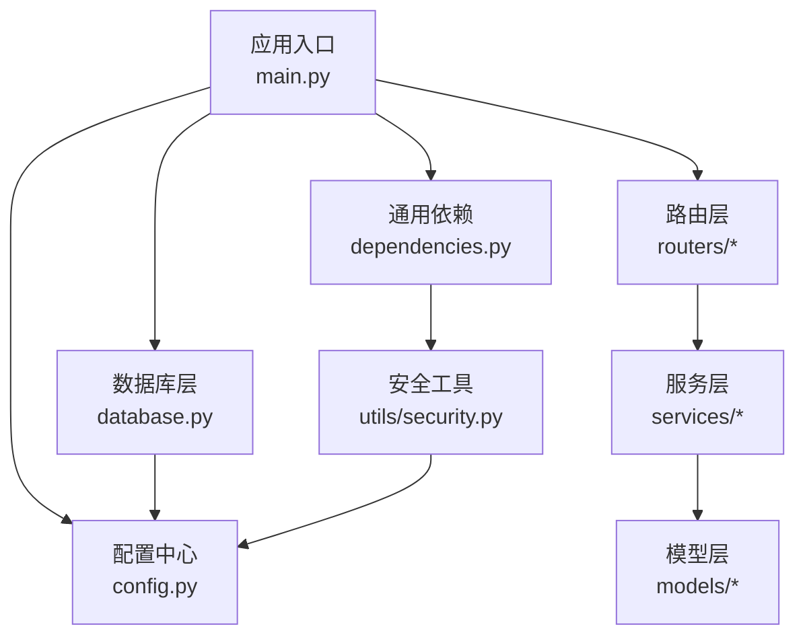
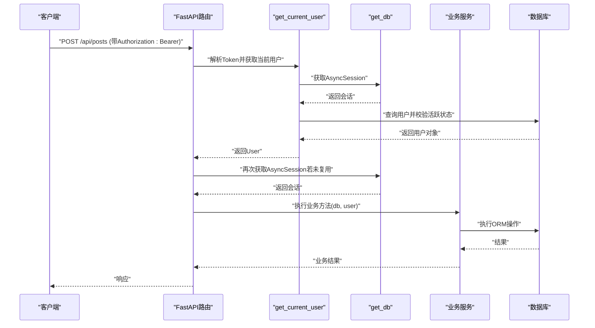
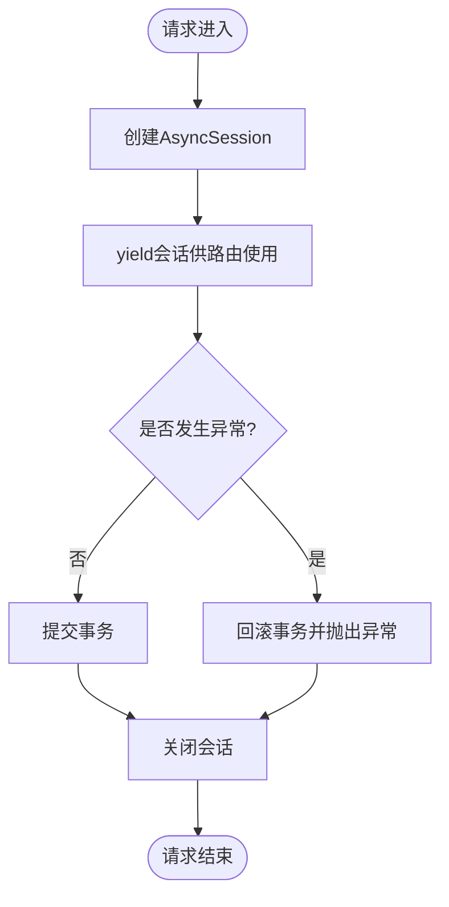
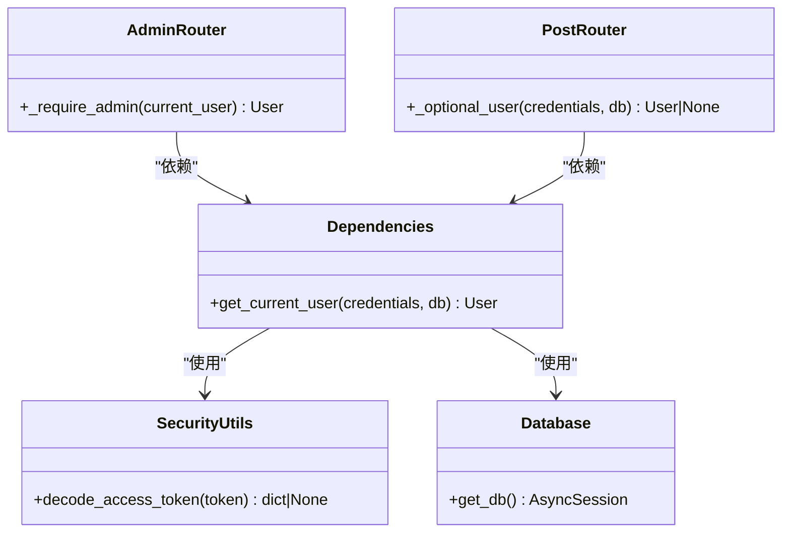
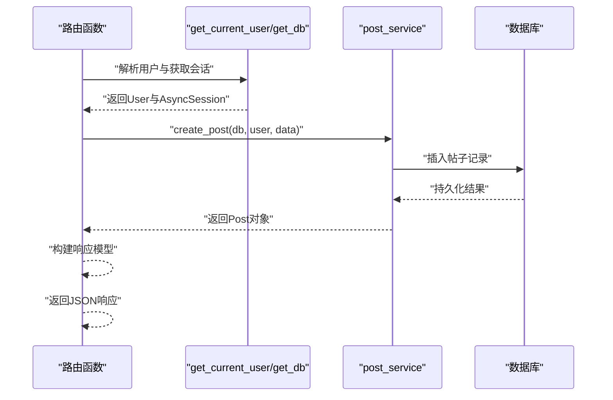
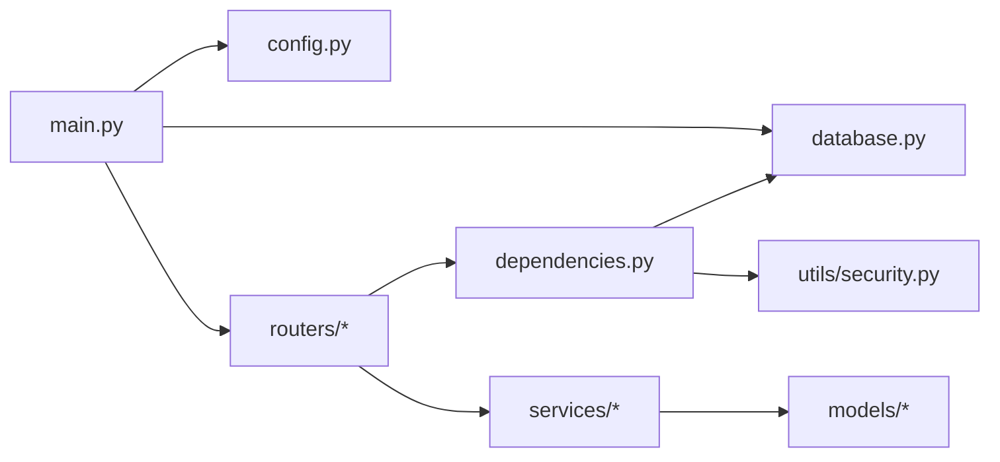

# 依赖注入系统

<cite>
**本文引用的文件**   
- [backEnd/app/main.py](file://backEnd/app/main.py)
- [backEnd/app/config.py](file://backEnd/app/config.py)
- [backEnd/app/database.py](file://backEnd/app/database.py)
- [backEnd/app/dependencies.py](file://backEnd/app/dependencies.py)
- [backEnd/app/utils/security.py](file://backEnd/app/utils/security.py)
- [backEnd/app/routers/auth.py](file://backEnd/app/routers/auth.py)
- [backEnd/app/routers/admin.py](file://backEnd/app/routers/admin.py)
- [backEnd/app/routers/post.py](file://backEnd/app/routers/post.py)
- [backEnd/app/services/auth.py](file://backEnd/app/services/auth.py)
- [backEnd/app/models/user.py](file://backEnd/app/models/user.py)
</cite>

## 目录
1. [简介](#简介)
2. [项目结构](#项目结构)
3. [核心组件](#核心组件)
4. [架构总览](#架构总览)
5. [详细组件分析](#详细组件分析)
6. [依赖关系分析](#依赖关系分析)
7. [性能考量](#性能考量)
8. [故障排查指南](#故障排查指南)
9. [结论](#结论)
10. [附录：最佳实践与扩展示例](#附录最佳实践与扩展示例)

## 简介
本文件面向HR XF系统的后端，系统性梳理并文档化其基于FastAPI的依赖注入（DI）体系。重点覆盖以下方面：
- 数据库会话管理：异步引擎、连接池、事务边界、错误回滚
- 配置管理：基于Pydantic Settings的类型安全环境变量加载与缓存
- 认证与权限：JWT解析、当前用户获取、管理员校验等自定义依赖项
- 服务层依赖：路由到服务的解耦模式
- 使用示例与最佳实践：如何创建和组合自定义依赖项，以及常见陷阱与优化建议

## 项目结构
后端采用分层组织：
- 应用入口与生命周期：main.py
- 配置中心：config.py（Settings + lru_cache）
- 数据访问：database.py（异步引擎、会话工厂、get_db依赖）
- 通用依赖：dependencies.py（当前用户、可选用户等）
- 路由层：routers/*（按领域划分）
- 服务层：services/*（业务逻辑）
- 工具与安全：utils/*（密码哈希、JWT编解码）
- 模型层：models/*（SQLAlchemy ORM定义）

图表来源
- [backEnd/app/main.py:1-90](file://backEnd/app/main.py#L1-L90)
- [backEnd/app/config.py:1-71](file://backEnd/app/config.py#L1-L71)
- [backEnd/app/database.py:1-58](file://backEnd/app/database.py#L1-L58)
- [backEnd/app/dependencies.py:1-41](file://backEnd/app/dependencies.py#L1-L41)
- [backEnd/app/utils/security.py:1-48](file://backEnd/app/utils/security.py#L1-L48)

章节来源
- [backEnd/app/main.py:1-90](file://backEnd/app/main.py#L1-L90)

## 核心组件
- 配置管理（Settings）
  - 通过Pydantic Settings从.env加载配置，提供类型安全的字段与派生属性（如数据库URL拼接、CORS列表解析）。
  - 使用lru_cache缓存实例，避免重复初始化开销。
- 数据库会话（AsyncSession）
  - 使用SQLAlchemy异步引擎与async_sessionmaker创建会话工厂。
  - get_db()作为FastAPI依赖，以异步生成器形式提供请求级会话，自动提交或回滚。
- 认证与授权依赖
  - get_current_user：从Bearer Token解析载荷，查询用户并校验活跃状态。
  - _require_admin：在get_current_user基础上进行管理员角色判定。
  - _optional_user：可选认证，无Token时返回None，用于公开接口增强上下文。
- 安全工具
  - JWT编解码、密码哈希与验证，统一读取配置中的密钥与算法。

章节来源
- [backEnd/app/config.py:1-71](file://backEnd/app/config.py#L1-L71)
- [backEnd/app/database.py:1-58](file://backEnd/app/database.py#L1-L58)
- [backEnd/app/dependencies.py:1-41](file://backEnd/app/dependencies.py#L1-L41)
- [backEnd/app/utils/security.py:1-48](file://backEnd/app/utils/security.py#L1-L48)

## 架构总览
下图展示了典型受保护接口的调用链与依赖注入过程：客户端携带Bearer Token发起请求，FastAPI通过HTTPBearer提取凭据，交由get_current_user依赖完成令牌解码、用户查找与活跃性校验；随后路由函数再依赖get_db获取会话，调用服务层执行业务逻辑。

图表来源
- [backEnd/app/routers/post.py:52-60](file://backEnd/app/routers/post.py#L52-L60)
- [backEnd/app/dependencies.py:13-41](file://backEnd/app/dependencies.py#L13-L41)
- [backEnd/app/database.py:50-58](file://backEnd/app/database.py#L50-L58)
- [backEnd/app/utils/security.py:39-48](file://backEnd/app/utils/security.py#L39-L48)

## 详细组件分析

### 配置管理系统（Pydantic Settings）
- 设计要点
  - 集中式配置类，包含数据库、JWT、MinIO预留、CORS、第三方API等字段。
  - 提供派生属性：异步/同步数据库URL拼接、CORS源列表解析。
  - 通过lru_cache包装的get_settings()实现单例缓存，减少重复构造成本。
- 使用方式
  - 在模块中直接调用get_settings()获取配置实例，无需手动传递。
  - 在安全工具与数据库层均通过该方式获取配置。
- 注意事项
  - .env路径相对于配置文件所在目录定位，确保部署环境正确放置。
  - 生产环境务必替换敏感字段（secret_key、数据库凭证等）。

章节来源
- [backEnd/app/config.py:1-71](file://backEnd/app/config.py#L1-L71)
- [backEnd/app/utils/security.py:6-8](file://backEnd/app/utils/security.py#L6-L8)
- [backEnd/app/database.py:27-37](file://backEnd/app/database.py#L27-L37)

### 数据库会话管理（get_db）
- 生命周期与事务
  - get_db()为异步生成器依赖，每次请求进入时创建AsyncSession，退出时自动关闭。
  - 成功路径：yield会话后commit；异常路径：rollback并抛出异常。
- 连接池配置
  - 使用create_async_engine创建异步引擎，启用pool_pre_ping进行连接健康检查。
  - pool_size与max_overflow控制连接池大小与溢出能力。
- 兼容性处理
  - 针对aiomysql 0.3.x的ping签名变更，对MySQLDialect_pymysql.do_ping进行补丁，避免pool_pre_ping报错。
- 启动与关闭
  - main.py的lifespan在启动时创建表（开发便利），并在关闭时dispose引擎释放资源。

图表来源
- [backEnd/app/database.py:50-58](file://backEnd/app/database.py#L50-L58)
- [backEnd/app/database.py:31-43](file://backEnd/app/database.py#L31-L43)
- [backEnd/app/database.py:14-24](file://backEnd/app/database.py#L14-L24)
- [backEnd/app/main.py:27-41](file://backEnd/app/main.py#L27-L41)

章节来源
- [backEnd/app/database.py:1-58](file://backEnd/app/database.py#L1-L58)
- [backEnd/app/main.py:27-41](file://backEnd/app/main.py#L27-L41)

### 认证与授权依赖
- get_current_user
  - 从HTTPAuthorizationCredentials中提取Bearer Token，调用decode_access_token解析载荷。
  - 根据载荷中的sub字段查询用户，并校验is_active状态。
  - 失败时返回401未授权。
- _require_admin（管理员守卫）
  - 在get_current_user基础上，判断邮箱或用户名是否包含“admin”关键字，不满足则返回403禁止访问。
- _optional_user（可选认证）
  - 当请求未携带Token时返回None，否则尝试解析并返回有效用户，便于公开接口附加用户上下文。

图表来源
- [backEnd/app/dependencies.py:13-41](file://backEnd/app/dependencies.py#L13-L41)
- [backEnd/app/routers/admin.py:25-34](file://backEnd/app/routers/admin.py#L25-L34)
- [backEnd/app/routers/post.py:26-46](file://backEnd/app/routers/post.py#L26-L46)
- [backEnd/app/utils/security.py:39-48](file://backEnd/app/utils/security.py#L39-L48)
- [backEnd/app/database.py:50-58](file://backEnd/app/database.py#L50-L58)

章节来源
- [backEnd/app/dependencies.py:1-41](file://backEnd/app/dependencies.py#L1-L41)
- [backEnd/app/routers/admin.py:25-34](file://backEnd/app/routers/admin.py#L25-L34)
- [backEnd/app/routers/post.py:26-46](file://backEnd/app/routers/post.py#L26-L46)
- [backEnd/app/utils/security.py:39-48](file://backEnd/app/utils/security.py#L39-L48)

### 路由与服务层协作
- 路由职责
  - 参数校验（由Pydantic Schema完成）、依赖注入（db、current_user）、异常映射为HTTP响应。
- 服务层职责
  - 封装业务逻辑，接收db与会话内实体，返回业务结果或抛出领域异常（ValueError等）。
- 示例流程（发帖）
  - 路由依赖get_current_user与get_db，调用post_service.create_post，最终写入数据库并提交。

图表来源
- [backEnd/app/routers/post.py:52-60](file://backEnd/app/routers/post.py#L52-L60)
- [backEnd/app/dependencies.py:13-41](file://backEnd/app/dependencies.py#L13-L41)
- [backEnd/app/database.py:50-58](file://backEnd/app/database.py#L50-L58)

章节来源
- [backEnd/app/routers/post.py:52-60](file://backEnd/app/routers/post.py#L52-L60)

## 依赖关系分析
- 耦合与内聚
  - 路由层仅负责编排依赖与响应转换，业务逻辑下沉至服务层，提升内聚性与可测试性。
  - 依赖项集中在dependencies.py与database.py，便于复用与扩展。
- 外部依赖
  - SQLAlchemy异步驱动、Pydantic Settings、JWT库、密码哈希库。
- 潜在循环依赖
  - 当前未发现明显循环导入；安全工具与配置相互独立，数据库层仅依赖配置。

图表来源
- [backEnd/app/main.py:1-90](file://backEnd/app/main.py#L1-L90)
- [backEnd/app/config.py:1-71](file://backEnd/app/config.py#L1-L71)
- [backEnd/app/database.py:1-58](file://backEnd/app/database.py#L1-L58)
- [backEnd/app/dependencies.py:1-41](file://backEnd/app/dependencies.py#L1-L41)
- [backEnd/app/utils/security.py:1-48](file://backEnd/app/utils/security.py#L1-L48)

章节来源
- [backEnd/app/main.py:1-90](file://backEnd/app/main.py#L1-L90)

## 性能考量
- 连接池
  - pool_size与max_overflow需根据并发量与数据库承载能力调优；pool_pre_ping开启有助于快速发现失效连接。
- 会话粒度
  - 每个请求一个会话，避免长事务占用连接；大事务应拆分或采用批量操作。
- 配置缓存
  - get_settings使用lru_cache，避免频繁读取.env与构造Settings实例。
- 流式响应
  - 对于AI推荐等耗时场景，使用SSE流式输出，降低首字节延迟。

[本节为通用指导，不直接分析具体文件]

## 故障排查指南
- 401未授权
  - 检查Authorization头是否正确携带Bearer Token；确认decode_access_token能正常解析且载荷包含sub。
- 403禁止访问
  - 管理员守卫要求邮箱或用户名包含“admin”，请确认用户标识符合规则。
- 数据库连接问题
  - 检查.env中的数据库凭证与网络连通性；关注pool_pre_ping抛出的TypeError是否被兼容补丁覆盖。
- 会话未提交或回滚
  - 若业务代码显式调用flush但未commit，可能依赖外层get_db的提交逻辑；出现异常将触发回滚。

章节来源
- [backEnd/app/dependencies.py:13-41](file://backEnd/app/dependencies.py#L13-L41)
- [backEnd/app/routers/admin.py:25-34](file://backEnd/app/routers/admin.py#L25-L34)
- [backEnd/app/database.py:50-58](file://backEnd/app/database.py#L50-L58)
- [backEnd/app/database.py:14-24](file://backEnd/app/database.py#L14-L24)

## 结论
本项目的依赖注入体系围绕FastAPI的Depends机制展开，结合Pydantic Settings与SQLAlchemy异步会话，实现了类型安全、可维护且可扩展的后端架构。通过统一的认证与权限依赖、清晰的会话生命周期管理以及路由与服务层的解耦，开发者可以高效地扩展新功能并保持代码质量。

[本节为总结，不直接分析具体文件]

## 附录：最佳实践与扩展示例

- 自定义依赖项创建模式
  - 日志记录依赖：创建一个log_dep依赖，内部初始化logger并注入到路由或服务；注意避免在依赖中持有全局可变状态。
  - 第三方服务依赖：例如Redis客户端、消息队列生产者，建议在模块级初始化并通过依赖返回实例；如需请求级隔离，可在依赖中创建短生命周期实例。
  - 权限细化依赖：在_get_current_user基础上增加角色/范围校验，返回更丰富的上下文对象。
- 组合依赖
  - 路由可同时依赖多个依赖项，FastAPI会按声明顺序解析；例如同时需要db与current_user。
- 可选依赖
  - 参考_optional_user的实现，使用auto_error=False的HTTPBearer，使公开接口也能获得可选的用户上下文。
- 事务边界
  - 尽量让get_db承担事务提交/回滚职责；服务层专注业务逻辑，避免在多处重复commit/rollback。
- 配置管理
  - 所有敏感信息通过.env管理，生产环境使用环境变量注入；派生属性用于组装复杂字符串（如数据库URL）。
- 错误处理
  - 在服务层抛出领域异常（如ValueError），在路由层转换为HTTP异常，保持错误语义清晰。
- 性能优化
  - 合理设置连接池参数；对热点查询使用索引与分页；对耗时任务考虑异步与流式响应。

章节来源
- [backEnd/app/routers/post.py:26-46](file://backEnd/app/routers/post.py#L26-L46)
- [backEnd/app/dependencies.py:13-41](file://backEnd/app/dependencies.py#L13-L41)
- [backEnd/app/database.py:50-58](file://backEnd/app/database.py#L50-L58)
- [backEnd/app/config.py:1-71](file://backEnd/app/config.py#L1-L71)