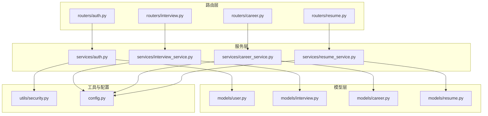
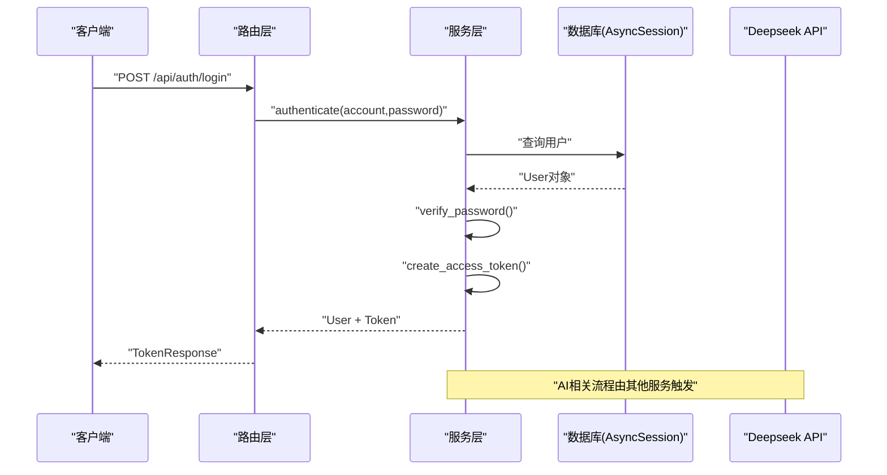
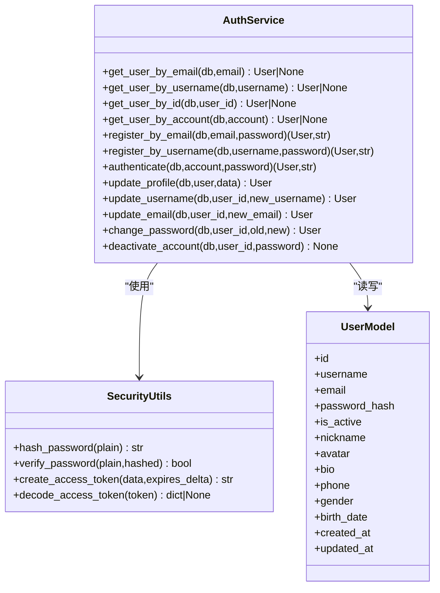
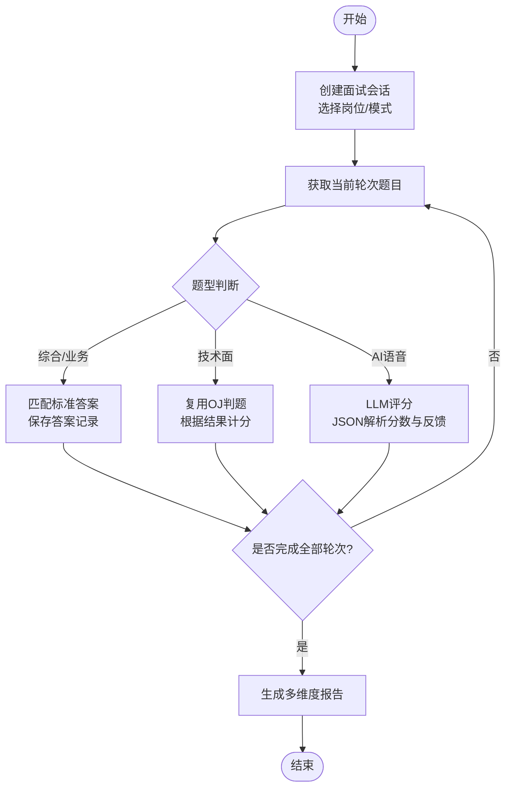
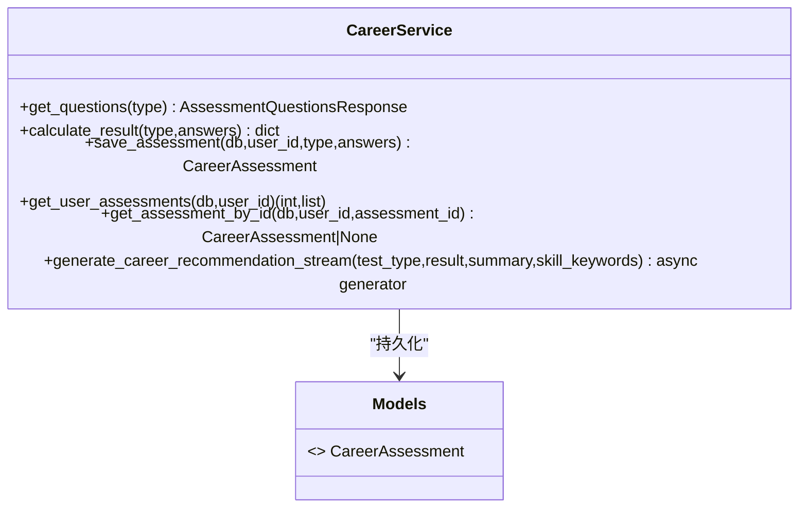
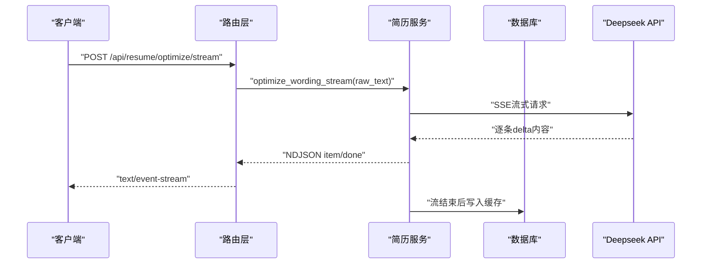
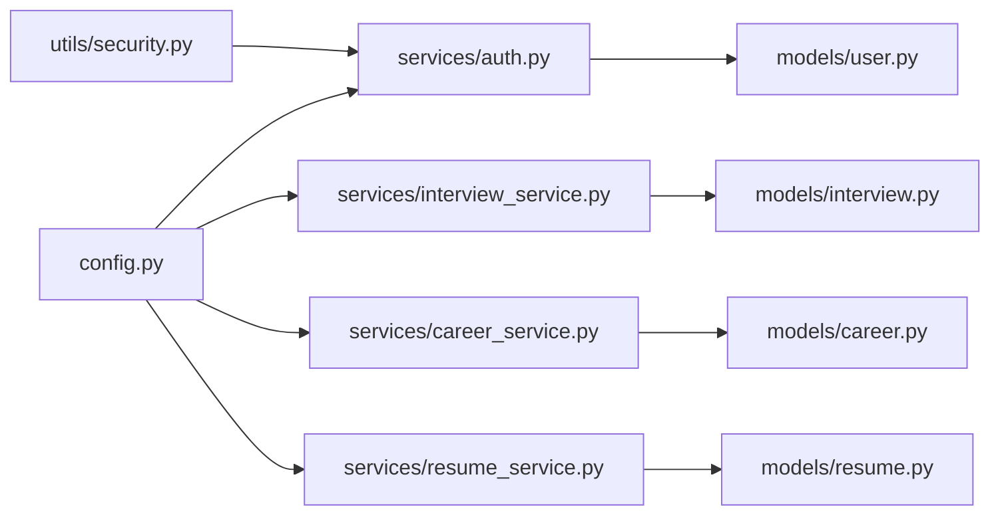

# 服务层设计

<cite>
**本文引用的文件**   
- [backEnd/app/services/auth.py](file://backEnd/app/services/auth.py)
- [backEnd/app/services/interview_service.py](file://backEnd/app/services/interview_service.py)
- [backEnd/app/services/career_service.py](file://backEnd/app/services/career_service.py)
- [backEnd/app/services/resume_service.py](file://backEnd/app/services/resume_service.py)
- [backEnd/app/utils/security.py](file://backEnd/app/utils/security.py)
- [backEnd/app/config.py](file://backEnd/app/config.py)
- [backEnd/app/models/user.py](file://backEnd/app/models/user.py)
- [backEnd/app/models/interview.py](file://backEnd/app/models/interview.py)
- [backEnd/app/models/career.py](file://backEnd/app/models/career.py)
- [backEnd/app/models/resume.py](file://backEnd/app/models/resume.py)
- [backEnd/app/routers/auth.py](file://backEnd/app/routers/auth.py)
- [backEnd/app/routers/interview.py](file://backEnd/app/routers/interview.py)
- [backEnd/app/routers/career.py](file://backEnd/app/routers/career.py)
- [backEnd/app/routers/resume.py](file://backEnd/app/routers/resume.py)
</cite>

## 目录
1. [引言](#引言)
2. [项目结构](#项目结构)
3. [核心组件](#核心组件)
4. [架构总览](#架构总览)
5. [详细组件分析](#详细组件分析)
6. [依赖关系分析](#依赖关系分析)
7. [性能与可扩展性](#性能与可扩展性)
8. [错误处理与日志规范](#错误处理与日志规范)
9. [结论](#结论)
10. [附录：API 与服务映射](#附录api-与服务映射)

## 引言
本文件面向HR XF系统后端服务层，系统性阐述业务逻辑封装、数据访问抽象、外部服务集成等关键设计原则。重点覆盖以下服务：
- 认证服务（auth service）：用户注册登录、密码加密、JWT令牌生成与校验
- 面试服务（interview_service）：多轮面试流程编排、AI面试官对话、评分算法与报告生成
- 职业测评服务（career_service）：Holland/MBTI/价值观量表题库、评分算法、AI岗位推荐流式输出
- 简历服务（resume_service）：简历上传解析、结构化提取、措辞优化与缓存策略

同时明确服务层与路由层、模型层的职责边界，给出错误处理策略与日志记录规范建议，帮助开发者理解并扩展服务层能力。

## 项目结构
后端采用分层架构：
- 路由层（routers）：HTTP接口定义、参数校验、鉴权依赖注入、异常到HTTP状态码的转换
- 服务层（services）：业务编排、领域规则、外部服务调用、结果聚合
- 模型层（models）：ORM实体定义、字段约束、关联关系
- 工具与配置（utils, config）：安全工具、配置加载、数据库连接等

图表来源
- [backEnd/app/routers/auth.py:1-217](file://backEnd/app/routers/auth.py#L1-L217)
- [backEnd/app/routers/interview.py:1-200](file://backEnd/app/routers/interview.py#L1-L200)
- [backEnd/app/routers/career.py:1-158](file://backEnd/app/routers/career.py#L1-L158)
- [backEnd/app/routers/resume.py:1-200](file://backEnd/app/routers/resume.py#L1-L200)
- [backEnd/app/services/auth.py:1-174](file://backEnd/app/services/auth.py#L1-L174)
- [backEnd/app/services/interview_service.py:1-800](file://backEnd/app/services/interview_service.py#L1-L800)
- [backEnd/app/services/career_service.py:1-669](file://backEnd/app/services/career_service.py#L1-L669)
- [backEnd/app/services/resume_service.py:1-285](file://backEnd/app/services/resume_service.py#L1-L285)
- [backEnd/app/utils/security.py:1-48](file://backEnd/app/utils/security.py#L1-L48)
- [backEnd/app/config.py:1-71](file://backEnd/app/config.py#L1-L71)
- [backEnd/app/models/user.py:1-45](file://backEnd/app/models/user.py#L1-L45)
- [backEnd/app/models/interview.py:1-114](file://backEnd/app/models/interview.py#L1-L114)
- [backEnd/app/models/career.py:1-56](file://backEnd/app/models/career.py#L1-L56)
- [backEnd/app/models/resume.py:1-67](file://backEnd/app/models/resume.py#L1-L67)

章节来源
- [backEnd/app/routers/auth.py:1-217](file://backEnd/app/routers/auth.py#L1-L217)
- [backEnd/app/routers/interview.py:1-200](file://backEnd/app/routers/interview.py#L1-L200)
- [backEnd/app/routers/career.py:1-158](file://backEnd/app/routers/career.py#L1-L158)
- [backEnd/app/routers/resume.py:1-200](file://backEnd/app/routers/resume.py#L1-L200)
- [backEnd/app/services/auth.py:1-174](file://backEnd/app/services/auth.py#L1-L174)
- [backEnd/app/services/interview_service.py:1-800](file://backEnd/app/services/interview_service.py#L1-L800)
- [backEnd/app/services/career_service.py:1-669](file://backEnd/app/services/career_service.py#L1-L669)
- [backEnd/app/services/resume_service.py:1-285](file://backEnd/app/services/resume_service.py#L1-L285)
- [backEnd/app/utils/security.py:1-48](file://backEnd/app/utils/security.py#L1-L48)
- [backEnd/app/config.py:1-71](file://backEnd/app/config.py#L1-L71)
- [backEnd/app/models/user.py:1-45](file://backEnd/app/models/user.py#L1-L45)
- [backEnd/app/models/interview.py:1-114](file://backEnd/app/models/interview.py#L1-L114)
- [backEnd/app/models/career.py:1-56](file://backEnd/app/models/career.py#L1-L56)
- [backEnd/app/models/resume.py:1-67](file://backEnd/app/models/resume.py#L1-L67)

## 核心组件
- 认证服务：提供邮箱/用户名注册、统一账号登录、资料更新、密码修改、账号注销；使用bcrypt哈希与JWT签发/解码。
- 面试服务：管理面试会话、题目抽取（综合素质/技术面/业务面/AI语音）、答案评分（含OJ判题与LLM评分）、AI对话SSE流、报告生成。
- 职业测评服务：内置Holland/MBTI/价值观量表题库与评分算法；支持AI岗位推荐SSE流式输出与缓存。
- 简历服务：简历上传/覆盖、PDF文本提取、Deepseek结构化解析与措辞优化（同步与SSE），结果缓存。

章节来源
- [backEnd/app/services/auth.py:1-174](file://backEnd/app/services/auth.py#L1-L174)
- [backEnd/app/services/interview_service.py:1-800](file://backEnd/app/services/interview_service.py#L1-L800)
- [backEnd/app/services/career_service.py:1-669](file://backEnd/app/services/career_service.py#L1-L669)
- [backEnd/app/services/resume_service.py:1-285](file://backEnd/app/services/resume_service.py#L1-L285)

## 架构总览
服务层遵循“薄路由、厚服务”的分层原则：
- 路由层仅负责请求解析、鉴权、参数校验、异常转HTTP状态码
- 服务层封装业务规则、跨域调用（如Deepseek API）、数据持久化（通过AsyncSession）
- 模型层专注ORM映射与约束
- 工具与配置集中管理敏感信息与运行时参数

图表来源
- [backEnd/app/routers/auth.py:69-80](file://backEnd/app/routers/auth.py#L69-L80)
- [backEnd/app/services/auth.py:85-96](file://backEnd/app/services/auth.py#L85-L96)
- [backEnd/app/utils/security.py:18-36](file://backEnd/app/utils/security.py#L18-L36)

## 详细组件分析

### 认证服务（Auth Service）
职责边界
- 用户查找：按邮箱、用户名、ID、账号（邮箱或用户名）
- 注册：邮箱注册（自动派生用户名，冲突时加随机后缀）、用户名注册
- 登录：统一账号校验、激活状态检查、签发JWT
- 账户设置：更新资料、用户名、邮箱、密码、软删除账号

安全要点
- 密码哈希：bcrypt，最大72字节截断保护
- JWT：HS256，可配置过期时间，载荷包含sub(user_id)

图表来源
- [backEnd/app/services/auth.py:13-174](file://backEnd/app/services/auth.py#L13-L174)
- [backEnd/app/utils/security.py:1-48](file://backEnd/app/utils/security.py#L1-L48)
- [backEnd/app/models/user.py:10-45](file://backEnd/app/models/user.py#L10-L45)

章节来源
- [backEnd/app/services/auth.py:13-174](file://backEnd/app/services/auth.py#L13-L174)
- [backEnd/app/utils/security.py:1-48](file://backEnd/app/utils/security.py#L1-L48)
- [backEnd/app/models/user.py:10-45](file://backEnd/app/models/user.py#L10-L45)

### 面试服务（Interview Service）
职责边界
- 岗位分类与题库种子初始化
- 会话CRUD：创建、查询、分页
- 题目获取：综合测评、技术面（OJ）、业务面、AI语音面
- 答题评分：选择题/判断题匹配标准答案；技术面复用OJ提交；AI语音面使用LLM评分
- AI对话：SSE流式返回
- 报告生成：基于回答统计的多维度评分汇总

图表来源
- [backEnd/app/services/interview_service.py:489-530](file://backEnd/app/services/interview_service.py#L489-L530)
- [backEnd/app/services/interview_service.py:536-621](file://backEnd/app/services/interview_service.py#L536-L621)
- [backEnd/app/services/interview_service.py:628-740](file://backEnd/app/services/interview_service.py#L628-L740)
- [backEnd/app/services/interview_service.py:743-791](file://backEnd/app/services/interview_service.py#L743-L791)

章节来源
- [backEnd/app/services/interview_service.py:1-800](file://backEnd/app/services/interview_service.py#L1-L800)
- [backEnd/app/models/interview.py:19-114](file://backEnd/app/models/interview.py#L19-L114)

### 职业测评服务（Career Service）
职责边界
- 题库定义：Holland RIASEC、MBTI、职业价值观量表（含选项与维度说明）
- 评分算法：各维度得分计算、类型判定、TopN排序与摘要生成
- 结果持久化：保存原始答案与结构化结果
- AI岗位推荐：构建提示词，调用Deepseek SSE流式输出，解析jobs与prep_tips，写入缓存

图表来源
- [backEnd/app/services/career_service.py:429-501](file://backEnd/app/services/career_service.py#L429-L501)
- [backEnd/app/services/career_service.py:568-669](file://backEnd/app/services/career_service.py#L568-L669)
- [backEnd/app/models/career.py:11-56](file://backEnd/app/models/career.py#L11-L56)

章节来源
- [backEnd/app/services/career_service.py:1-669](file://backEnd/app/services/career_service.py#L1-L669)
- [backEnd/app/models/career.py:11-56](file://backEnd/app/models/career.py#L11-L56)

### 简历服务（Resume Service）
职责边界
- CRUD：每用户一条简历，UPSERT语义，清空缓存字段
- Deepseek结构化提取：skills、experiences、education、summary、score、suggestions、skill_categories
- 措辞优化：同步与SSE流式两种模式，边生成边推送item与stats
- 缓存策略：优化结果持久化，命中则直接返回

图表来源
- [backEnd/app/routers/resume.py:140-192](file://backEnd/app/routers/resume.py#L140-L192)
- [backEnd/app/services/resume_service.py:186-285](file://backEnd/app/services/resume_service.py#L186-L285)

章节来源
- [backEnd/app/services/resume_service.py:1-285](file://backEnd/app/services/resume_service.py#L1-L285)
- [backEnd/app/models/resume.py:11-67](file://backEnd/app/models/resume.py#L11-L67)

## 依赖关系分析
- 配置中心：所有服务通过统一的Settings读取环境变量与默认值（包括Deepseek API Key、URL、Model、JWT密钥与过期时间等）
- 外部服务：面试与职业测评、简历模块均依赖Deepseek API进行评分与推荐/优化
- 数据库：所有服务通过AsyncSession执行SQLAlchemy查询与持久化
- 安全工具：认证服务依赖security模块进行密码哈希与JWT编解码

图表来源
- [backEnd/app/config.py:1-71](file://backEnd/app/config.py#L1-L71)
- [backEnd/app/utils/security.py:1-48](file://backEnd/app/utils/security.py#L1-L48)
- [backEnd/app/services/auth.py:1-174](file://backEnd/app/services/auth.py#L1-L174)
- [backEnd/app/services/interview_service.py:1-800](file://backEnd/app/services/interview_service.py#L1-L800)
- [backEnd/app/services/career_service.py:1-669](file://backEnd/app/services/career_service.py#L1-L669)
- [backEnd/app/services/resume_service.py:1-285](file://backEnd/app/services/resume_service.py#L1-L285)
- [backEnd/app/models/user.py:1-45](file://backEnd/app/models/user.py#L1-L45)
- [backEnd/app/models/interview.py:1-114](file://backEnd/app/models/interview.py#L1-L114)
- [backEnd/app/models/career.py:1-56](file://backEnd/app/models/career.py#L1-L56)
- [backEnd/app/models/resume.py:1-67](file://backEnd/app/models/resume.py#L1-L67)

章节来源
- [backEnd/app/config.py:1-71](file://backEnd/app/config.py#L1-L71)
- [backEnd/app/utils/security.py:1-48](file://backEnd/app/utils/security.py#L1-L48)
- [backEnd/app/services/auth.py:1-174](file://backEnd/app/services/auth.py#L1-L174)
- [backEnd/app/services/interview_service.py:1-800](file://backEnd/app/services/interview_service.py#L1-L800)
- [backEnd/app/services/career_service.py:1-669](file://backEnd/app/services/career_service.py#L1-L669)
- [backEnd/app/services/resume_service.py:1-285](file://backEnd/app/services/resume_service.py#L1-L285)
- [backEnd/app/models/user.py:1-45](file://backEnd/app/models/user.py#L1-L45)
- [backEnd/app/models/interview.py:1-114](file://backEnd/app/models/interview.py#L1-L114)
- [backEnd/app/models/career.py:1-56](file://backEnd/app/models/career.py#L1-L56)
- [backEnd/app/models/resume.py:1-67](file://backEnd/app/models/resume.py#L1-L67)

## 性能与可扩展性
- 异步IO：服务层广泛使用asyncio与httpx异步客户端，降低外部API阻塞影响
- SSE流式：面试AI对话、简历优化、职业推荐均采用SSE，提升用户体验与吞吐
- 缓存策略：
  - 简历优化结果缓存，避免重复AI调用
  - 职业推荐结果缓存，命中后直接推送
- 评分降级：AI评分失败时给予默认分并附带提示信息，保证流程不中断
- 并发与限流：建议在网关或中间件层增加速率限制与超时控制，保护下游AI服务

[本节为通用指导，无需具体文件引用]

## 错误处理与日志规范
- 路由层异常处理：
  - 将服务层抛出的业务异常转换为HTTP状态码（如400/401/404/500）
  - 对缺失资源、权限不足、参数非法等情况返回明确的detail信息
- 服务层异常策略：
  - 对外部API调用增加try/except，捕获网络与解析异常，返回降级结果或友好提示
  - 对数据库操作失败应向上抛出，交由路由层统一处理
- 日志记录建议：
  - 在关键路径（注册、登录、提交答案、AI调用、报告生成）记录结构化日志（用户ID、会话ID、耗时、状态码）
  - 敏感信息脱敏（如密码、token、API Key）
  - 使用Python logging或第三方库（如structlog）统一格式

章节来源
- [backEnd/app/routers/auth.py:41-80](file://backEnd/app/routers/auth.py#L41-L80)
- [backEnd/app/routers/interview.py:102-158](file://backEnd/app/routers/interview.py#L102-L158)
- [backEnd/app/routers/career.py:96-158](file://backEnd/app/routers/career.py#L96-L158)
- [backEnd/app/routers/resume.py:100-192](file://backEnd/app/routers/resume.py#L100-L192)

## 结论
本服务层设计以清晰的职责划分与良好的扩展性为核心：
- 认证服务确保安全的身份管理与令牌机制
- 面试服务整合多轮流程、AI评分与报告生成，具备高可用降级策略
- 职业测评服务提供成熟的量表与AI推荐，结合缓存与SSE提升体验
- 简历服务实现结构化解析与措辞优化，兼顾同步与流式场景

建议后续引入更完善的日志体系、监控指标与外部服务熔断重试机制，进一步提升稳定性与可观测性。

[本节为总结，无需具体文件引用]

## 附录：API 与服务映射
- 认证
  - POST /api/auth/register/email → services.auth.register_by_email
  - POST /api/auth/register/username → services.auth.register_by_username
  - POST /api/auth/login → services.auth.authenticate
  - PUT /api/auth/profile → services.auth.update_profile
  - PUT /api/auth/password → services.auth.change_password
  - DELETE /api/auth/account → services.auth.deactivate_account
- 面试
  - GET /api/interview/jobs → services.interview_service.get_job_categories
  - POST /api/interview/start → services.interview_service.create_session
  - GET /api/interview/session/{id}/question → services.interview_service.get_round_questions
  - POST /api/interview/session/{id}/answer → services.interview_service.grade_answer
  - POST /api/interview/session/{id}/next → services.interview_service.advance_round + generate_report
  - POST /api/interview/session/{id}/ai-chat → services.interview_service.generate_ai_chat_stream
- 职业测评
  - GET /api/career/questions/{type} → services.career_service.get_questions
  - POST /api/career/submit → services.career_service.save_assessment
  - GET /api/career/history → services.career_service.get_user_assessments
  - GET /api/career/result/{id} → services.career_service.get_assessment_by_id
  - POST /api/career/recommend/stream → services.career_service.generate_career_recommendation_stream
- 简历
  - GET /api/resume/ → services.resume_service.get_resume_by_user
  - POST /api/resume/upload → services.resume_service.save_resume + extract_resume_structure
  - POST /api/resume/analyze → services.resume_service.extract_resume_structure
  - POST /api/resume/optimize → services.resume_service.optimize_wording
  - POST /api/resume/optimize/stream → services.resume_service.optimize_wording_stream

章节来源
- [backEnd/app/routers/auth.py:41-176](file://backEnd/app/routers/auth.py#L41-L176)
- [backEnd/app/routers/interview.py:29-200](file://backEnd/app/routers/interview.py#L29-L200)
- [backEnd/app/routers/career.py:20-158](file://backEnd/app/routers/career.py#L20-L158)
- [backEnd/app/routers/resume.py:25-200](file://backEnd/app/routers/resume.py#L25-L200)