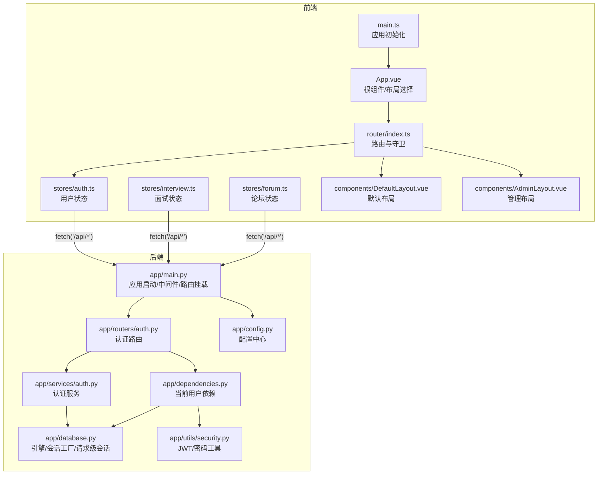
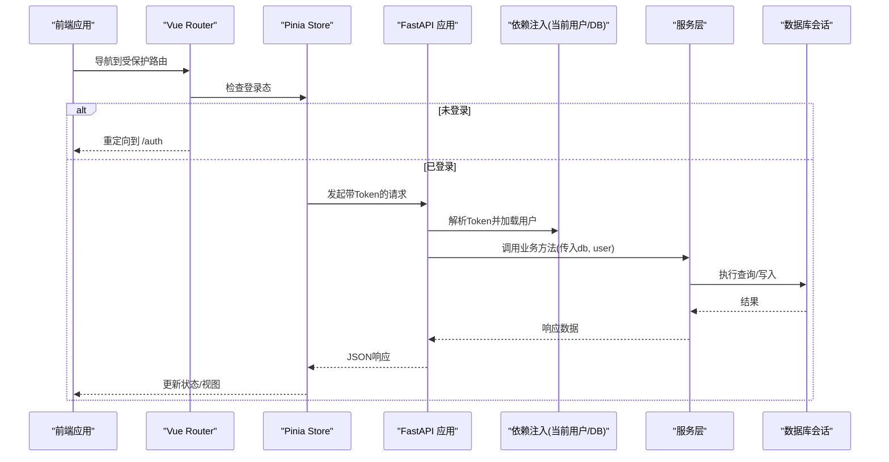
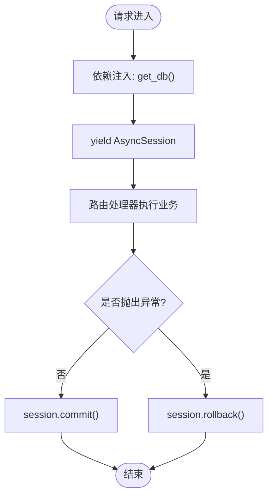
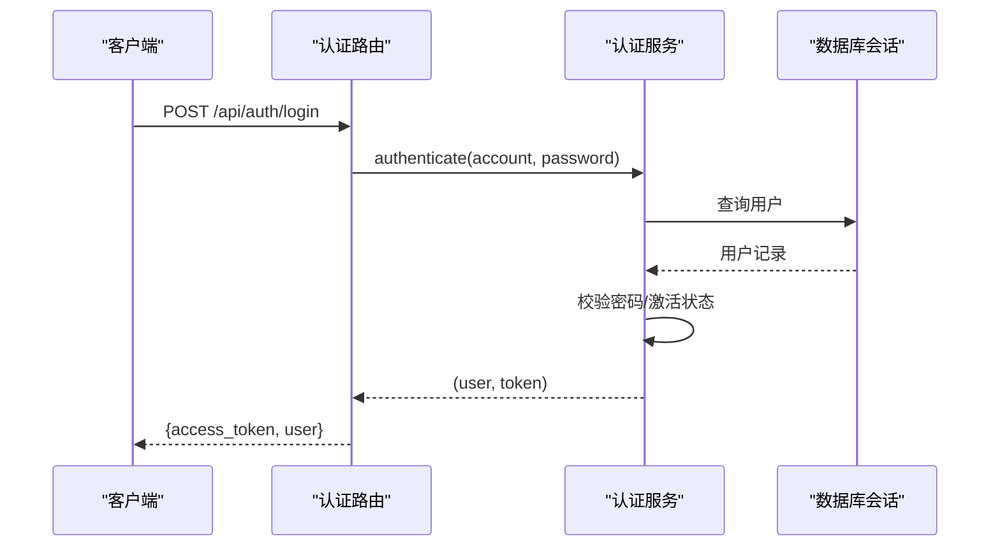
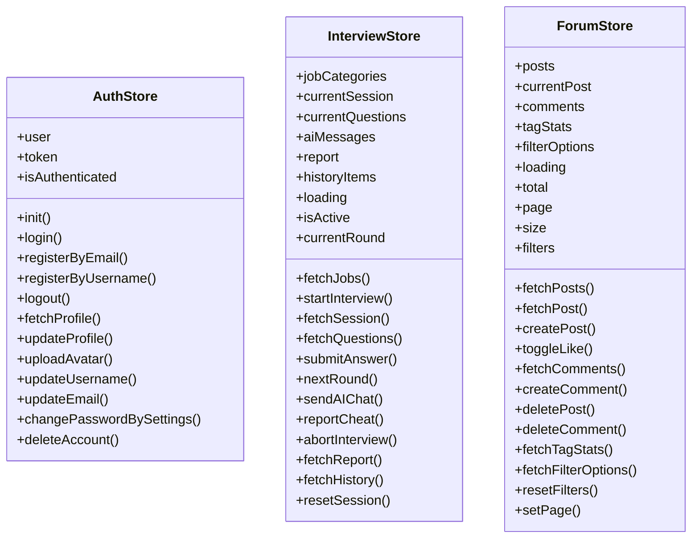
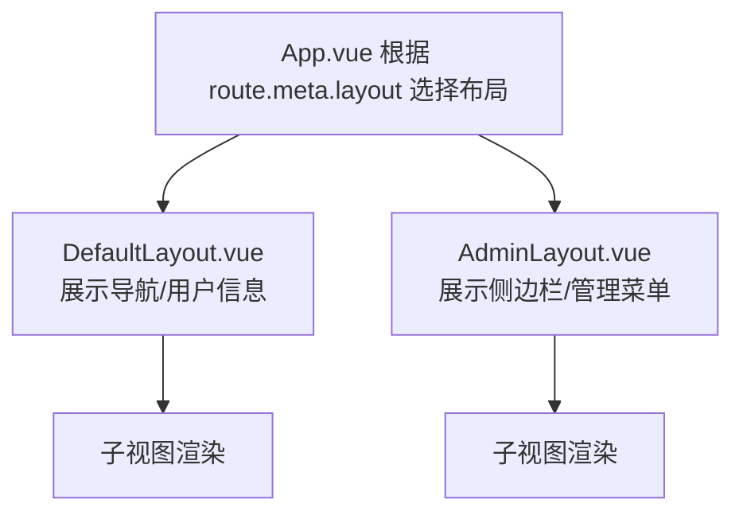
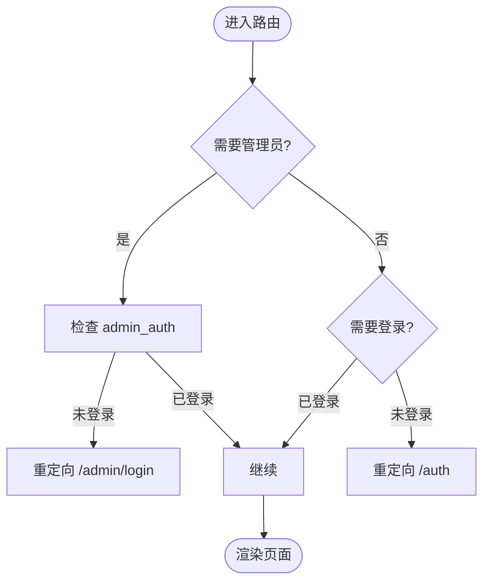
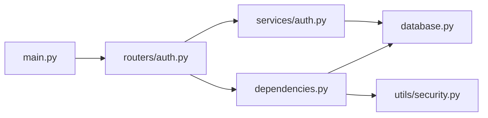

# 核心组件架构

<cite>
**本文引用的文件**   
- [backEnd/app/main.py](file://backEnd/app/main.py)
- [backEnd/app/database.py](file://backEnd/app/database.py)
- [backEnd/app/config.py](file://backEnd/app/config.py)
- [backEnd/app/dependencies.py](file://backEnd/app/dependencies.py)
- [backEnd/app/utils/security.py](file://backEnd/app/utils/security.py)
- [backEnd/app/routers/auth.py](file://backEnd/app/routers/auth.py)
- [backEnd/app/services/auth.py](file://backEnd/app/services/auth.py)
- [frontEnd/src/main.ts](file://frontEnd/src/main.ts)
- [frontEnd/src/App.vue](file://frontEnd/src/App.vue)
- [frontEnd/src/router/index.ts](file://frontEnd/src/router/index.ts)
- [frontEnd/src/stores/auth.ts](file://frontEnd/src/stores/auth.ts)
- [frontEnd/src/stores/interview.ts](file://frontEnd/src/stores/interview.ts)
- [frontEnd/src/stores/forum.ts](file://frontEnd/src/stores/forum.ts)
- [frontEnd/src/components/DefaultLayout.vue](file://frontEnd/src/components/DefaultLayout.vue)
- [frontEnd/src/components/AdminLayout.vue](file://frontEnd/src/components/AdminLayout.vue)
</cite>

## 目录
1. [简介](#简介)
2. [项目结构](#项目结构)
3. [核心组件](#核心组件)
4. [架构总览](#架构总览)
5. [详细组件分析](#详细组件分析)
6. [依赖关系分析](#依赖关系分析)
7. [性能考虑](#性能考虑)
8. [故障排查指南](#故障排查指南)
9. [结论](#结论)
10. [附录](#附录)

## 简介
本文件面向HR XF系统的后端与前端核心组件，系统性阐述以下主题：
- FastAPI 依赖注入机制：数据库会话管理、服务层依赖、权限验证依赖
- 前端 Pinia 状态管理模式：用户状态、面试状态、论坛状态的组织方式
- 布局组件架构：默认布局与管理后台布局的职责划分
- 组件间依赖关系、生命周期管理与资源清理机制
- 关键流程的时序图与流程图，帮助开发者理解并扩展核心功能

## 项目结构
系统采用前后端分离架构：
- 后端（FastAPI + SQLAlchemy Async）：提供REST API、认证鉴权、数据库访问、静态资源挂载
- 前端（Vue 3 + Vue Router + Pinia）：页面路由、全局布局、业务状态管理、HTTP客户端封装

图表来源
- [backEnd/app/main.py:1-90](file://backEnd/app/main.py#L1-L90)
- [backEnd/app/dependencies.py:1-41](file://backEnd/app/dependencies.py#L1-L41)
- [backEnd/app/database.py:1-58](file://backEnd/app/database.py#L1-L58)
- [backEnd/app/config.py:1-71](file://backEnd/app/config.py#L1-L71)
- [backEnd/app/utils/security.py:1-48](file://backEnd/app/utils/security.py#L1-L48)
- [backEnd/app/routers/auth.py:1-217](file://backEnd/app/routers/auth.py#L1-L217)
- [backEnd/app/services/auth.py:1-174](file://backEnd/app/services/auth.py#L1-L174)
- [frontEnd/src/main.ts:1-19](file://frontEnd/src/main.ts#L1-L19)
- [frontEnd/src/App.vue:1-21](file://frontEnd/src/App.vue#L1-L21)
- [frontEnd/src/router/index.ts:1-167](file://frontEnd/src/router/index.ts#L1-L167)
- [frontEnd/src/stores/auth.ts:1-314](file://frontEnd/src/stores/auth.ts#L1-L314)
- [frontEnd/src/stores/interview.ts:1-313](file://frontEnd/src/stores/interview.ts#L1-L313)
- [frontEnd/src/stores/forum.ts:1-315](file://frontEnd/src/stores/forum.ts#L1-L315)
- [frontEnd/src/components/DefaultLayout.vue:1-139](file://frontEnd/src/components/DefaultLayout.vue#L1-L139)
- [frontEnd/src/components/AdminLayout.vue:1-110](file://frontEnd/src/components/AdminLayout.vue#L1-L110)

章节来源
- [backEnd/app/main.py:1-90](file://backEnd/app/main.py#L1-L90)
- [frontEnd/src/main.ts:1-19](file://frontEnd/src/main.ts#L1-L19)

## 核心组件
本节聚焦后端依赖注入与前端状态管理的核心设计。

- 后端依赖注入
  - 数据库会话：通过异步引擎与会话工厂在请求级别创建/提交/回滚会话
  - 当前用户：从请求头解析Bearer Token，校验载荷并加载活跃用户对象
  - 安全工具：密码哈希/校验、JWT签发/解码
- 前端状态管理
  - 用户状态：登录态恢复、令牌持久化、资料更新、头像上传
  - 面试状态：会话生命周期、题目流式交互、报告与历史
  - 论坛状态：帖子列表/详情、评论、点赞、筛选与分页

章节来源
- [backEnd/app/database.py:1-58](file://backEnd/app/database.py#L1-L58)
- [backEnd/app/dependencies.py:1-41](file://backEnd/app/dependencies.py#L1-L41)
- [backEnd/app/utils/security.py:1-48](file://backEnd/app/utils/security.py#L1-L48)
- [frontEnd/src/stores/auth.ts:1-314](file://frontEnd/src/stores/auth.ts#L1-L314)
- [frontEnd/src/stores/interview.ts:1-313](file://frontEnd/src/stores/interview.ts#L1-L313)
- [frontEnd/src/stores/forum.ts:1-315](file://frontEnd/src/stores/forum.ts#L1-L315)

## 架构总览
整体数据与控制流如下：
- 前端应用启动时初始化Pinia与路由，并尝试恢复本地登录态
- 受保护路由触发路由守卫，未登录跳转至登录页
- 业务Store发起HTTP请求，自动携带Authorization头
- 后端路由使用FastAPI依赖注入获取数据库会话与当前用户
- 服务层执行业务逻辑，返回响应模型

图表来源
- [frontEnd/src/main.ts:1-19](file://frontEnd/src/main.ts#L1-L19)
- [frontEnd/src/router/index.ts:136-164](file://frontEnd/src/router/index.ts#L136-L164)
- [frontEnd/src/stores/auth.ts:37-61](file://frontEnd/src/stores/auth.ts#L37-L61)
- [backEnd/app/main.py:44-68](file://backEnd/app/main.py#L44-L68)
- [backEnd/app/dependencies.py:13-40](file://backEnd/app/dependencies.py#L13-L40)
- [backEnd/app/database.py:50-58](file://backEnd/app/database.py#L50-L58)

## 详细组件分析

### 后端：FastAPI 依赖注入与数据库会话管理
- 应用生命周期
  - 启动阶段：确保表结构存在并初始化种子数据；关闭阶段：释放引擎连接池
  - 中间件：CORS、静态文件挂载、统一异常处理
- 数据库会话
  - 异步引擎与会话工厂集中配置，支持连接池参数与预检
  - 请求级会话：进入请求时yield session，成功提交，异常回滚
- 当前用户依赖
  - 从请求头提取Bearer Token，解码载荷并校验用户有效性
  - 失败则返回401并附带WWW-Authenticate头
- 安全工具
  - 密码哈希/校验（bcrypt），JWT签发/解码（HS256）

图表来源
- [backEnd/app/database.py:50-58](file://backEnd/app/database.py#L50-L58)
- [backEnd/app/main.py:27-41](file://backEnd/app/main.py#L27-L41)
- [backEnd/app/main.py:51-73](file://backEnd/app/main.py#L51-L73)
- [backEnd/app/dependencies.py:13-40](file://backEnd/app/dependencies.py#L13-L40)
- [backEnd/app/utils/security.py:26-47](file://backEnd/app/utils/security.py#L26-L47)

章节来源
- [backEnd/app/main.py:27-41](file://backEnd/app/main.py#L27-L41)
- [backEnd/app/main.py:51-73](file://backEnd/app/main.py#L51-L73)
- [backEnd/app/database.py:31-58](file://backEnd/app/database.py#L31-L58)
- [backEnd/app/dependencies.py:13-40](file://backEnd/app/dependencies.py#L13-L40)
- [backEnd/app/utils/security.py:18-47](file://backEnd/app/utils/security.py#L18-L47)

### 后端：认证流程（注册/登录/资料管理）
- 注册/登录
  - 邮箱或用户名注册，冲突检测与自动生成用户名
  - 登录校验账号与密码，生成JWT并返回用户信息
- 资料管理
  - 读取/更新个人资料、修改用户名/邮箱/密码、注销账号
- 头像上传
  - 限制类型与大小，旧头像清理，路径持久化

图表来源
- [backEnd/app/routers/auth.py:69-80](file://backEnd/app/routers/auth.py#L69-L80)
- [backEnd/app/services/auth.py:85-96](file://backEnd/app/services/auth.py#L85-L96)
- [backEnd/app/database.py:50-58](file://backEnd/app/database.py#L50-L58)

章节来源
- [backEnd/app/routers/auth.py:41-80](file://backEnd/app/routers/auth.py#L41-L80)
- [backEnd/app/services/auth.py:38-96](file://backEnd/app/services/auth.py#L38-L96)
- [backEnd/app/routers/auth.py:97-176](file://backEnd/app/routers/auth.py#L97-L176)
- [backEnd/app/services/auth.py:99-174](file://backEnd/app/services/auth.py#L99-L174)
- [backEnd/app/routers/auth.py:182-216](file://backEnd/app/routers/auth.py#L182-L216)

### 前端：Pinia 状态管理（用户/面试/论坛）
- 用户状态（auth）
  - 应用启动时恢复本地token并校验有效性
  - 登录/注册成功后持久化token与用户信息
  - 资料更新、头像上传、账户设置等动作
- 面试状态（interview）
  - 维护会话、题目、AI对话消息、报告与历史记录
  - 支持流式AI聊天（SSE-like分块读取）
- 论坛状态（forum）
  - 帖子列表/详情、评论、点赞、标签统计、筛选与分页

图表来源
- [frontEnd/src/stores/auth.ts:65-313](file://frontEnd/src/stores/auth.ts#L65-L313)
- [frontEnd/src/stores/interview.ts:128-312](file://frontEnd/src/stores/interview.ts#L128-L312)
- [frontEnd/src/stores/forum.ts:115-314](file://frontEnd/src/stores/forum.ts#L115-L314)

章节来源
- [frontEnd/src/stores/auth.ts:72-83](file://frontEnd/src/stores/auth.ts#L72-L83)
- [frontEnd/src/stores/auth.ts:86-134](file://frontEnd/src/stores/auth.ts#L86-L134)
- [frontEnd/src/stores/auth.ts:144-218](file://frontEnd/src/stores/auth.ts#L144-L218)
- [frontEnd/src/stores/auth.ts:222-284](file://frontEnd/src/stores/auth.ts#L222-L284)
- [frontEnd/src/stores/interview.ts:140-287](file://frontEnd/src/stores/interview.ts#L140-L287)
- [frontEnd/src/stores/forum.ts:130-286](file://frontEnd/src/stores/forum.ts#L130-L286)

### 前端：布局组件架构
- 默认布局（DefaultLayout）
  - 顶部导航、移动端菜单、滚动高亮、用户信息与仪表盘入口
  - 监听滚动事件并在卸载时移除监听器，避免内存泄漏
- 管理布局（AdminLayout）
  - 侧边栏菜单、当前路由高亮、返回首页与退出登录
  - 基于localStorage的管理员标识进行简单权限控制

图表来源
- [frontEnd/src/App.vue:1-21](file://frontEnd/src/App.vue#L1-L21)
- [frontEnd/src/components/DefaultLayout.vue:101-138](file://frontEnd/src/components/DefaultLayout.vue#L101-L138)
- [frontEnd/src/components/AdminLayout.vue:69-109](file://frontEnd/src/components/AdminLayout.vue#L69-L109)

章节来源
- [frontEnd/src/App.vue:1-21](file://frontEnd/src/App.vue#L1-L21)
- [frontEnd/src/components/DefaultLayout.vue:101-138](file://frontEnd/src/components/DefaultLayout.vue#L101-L138)
- [frontEnd/src/components/AdminLayout.vue:69-109](file://frontEnd/src/components/AdminLayout.vue#L69-L109)

### 前端：路由与守卫
- 路由定义：为各页面指定布局与权限标记（requiresAuth、requiresAdmin）
- 全局守卫：
  - 管理员路由：未登录跳转 /admin/login
  - 普通用户路由：未登录跳转 /auth，已登录访问 /auth 跳转 /dashboard

图表来源
- [frontEnd/src/router/index.ts:136-164](file://frontEnd/src/router/index.ts#L136-L164)

章节来源
- [frontEnd/src/router/index.ts:5-120](file://frontEnd/src/router/index.ts#L5-L120)
- [frontEnd/src/router/index.ts:136-164](file://frontEnd/src/router/index.ts#L136-L164)

## 依赖关系分析
- 后端模块耦合
  - main.py 聚合路由与中间件，低内聚地引入各功能域路由
  - dependencies.py 解耦认证逻辑，供任意路由复用
  - database.py 提供统一的异步会话工厂与请求级会话
  - utils/security.py 被依赖注入与服务层共同使用
- 前端模块耦合
  - App.vue 根据路由元信息选择布局
  - router/index.ts 集中管理路由与守卫
  - stores 各自封装领域状态与API调用，保持职责单一

图表来源
- [backEnd/app/main.py:60-68](file://backEnd/app/main.py#L60-L68)
- [backEnd/app/routers/auth.py:1-24](file://backEnd/app/routers/auth.py#L1-L24)
- [backEnd/app/dependencies.py:1-10](file://backEnd/app/dependencies.py#L1-L10)
- [backEnd/app/database.py:1-10](file://backEnd/app/database.py#L1-L10)
- [backEnd/app/utils/security.py:1-10](file://backEnd/app/utils/security.py#L1-L10)
- [backEnd/app/services/auth.py:1-10](file://backEnd/app/services/auth.py#L1-L10)

章节来源
- [backEnd/app/main.py:60-68](file://backEnd/app/main.py#L60-L68)
- [backEnd/app/routers/auth.py:1-24](file://backEnd/app/routers/auth.py#L1-L24)
- [backEnd/app/dependencies.py:1-10](file://backEnd/app/dependencies.py#L1-L10)
- [backEnd/app/database.py:1-10](file://backEnd/app/database.py#L1-L10)
- [backEnd/app/utils/security.py:1-10](file://backEnd/app/utils/security.py#L1-L10)
- [backEnd/app/services/auth.py:1-10](file://backEnd/app/services/auth.py#L1-L10)

## 性能考虑
- 数据库连接池
  - 合理设置pool_size与max_overflow，结合pool_pre_ping提升健壮性
- 异步I/O
  - 全链路异步（FastAPI + SQLAlchemy Async）减少阻塞
- 前端请求优化
  - Store中统一封装请求，避免重复错误处理
  - 流式响应（如AI对话）使用分块读取，降低首屏延迟
- 资源清理
  - 后端：lifespan中释放引擎；请求级会话保证commit/rollback
  - 前端：组件卸载时移除事件监听，避免内存泄漏

[本节为通用指导，不直接分析具体文件]

## 故障排查指南
- 认证相关
  - 401未授权：检查请求头是否包含正确的Bearer Token；确认Token未过期且载荷有效
  - 无效载荷：确认JWT签名算法与密钥一致
- 数据库相关
  - 连接异常：检查数据库URL、凭据与网络连通性；关注pool_pre_ping行为
  - 事务问题：确认请求级会话是否正确提交或回滚
- 前端相关
  - 跨域错误：核对CORS配置中的允许源
  - 路由守卫循环：检查requiresAuth与requiresAdmin条件与重定向目标

章节来源
- [backEnd/app/dependencies.py:13-40](file://backEnd/app/dependencies.py#L13-L40)
- [backEnd/app/utils/security.py:26-47](file://backEnd/app/utils/security.py#L26-L47)
- [backEnd/app/database.py:31-58](file://backEnd/app/database.py#L31-L58)
- [backEnd/app/main.py:51-58](file://backEnd/app/main.py#L51-L58)
- [frontEnd/src/router/index.ts:136-164](file://frontEnd/src/router/index.ts#L136-L164)

## 结论
本架构以“清晰的依赖注入 + 领域化状态管理”为核心：
- 后端通过FastAPI依赖注入将数据库与会话、认证逻辑解耦，便于测试与扩展
- 前端以Pinia按领域拆分store，配合路由守卫与布局组件，形成可维护的前端分层
- 生命周期与资源清理贯穿前后端，保障稳定性与性能

[本节为总结性内容，不直接分析具体文件]

## 附录
- 最佳实践建议
  - 新增路由：在对应routers下实现，并在main中注册；如需鉴权，使用get_current_user依赖
  - 新增状态：在stores下新建领域store，封装API调用与状态更新
  - 新增布局：在components下实现布局组件，并通过路由meta选择
  - 配置项：在config.py中集中管理，通过get_settings缓存实例

[本节为通用指导，不直接分析具体文件]