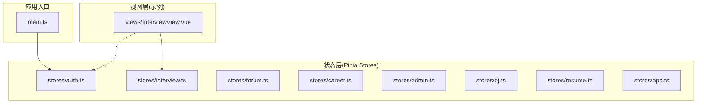
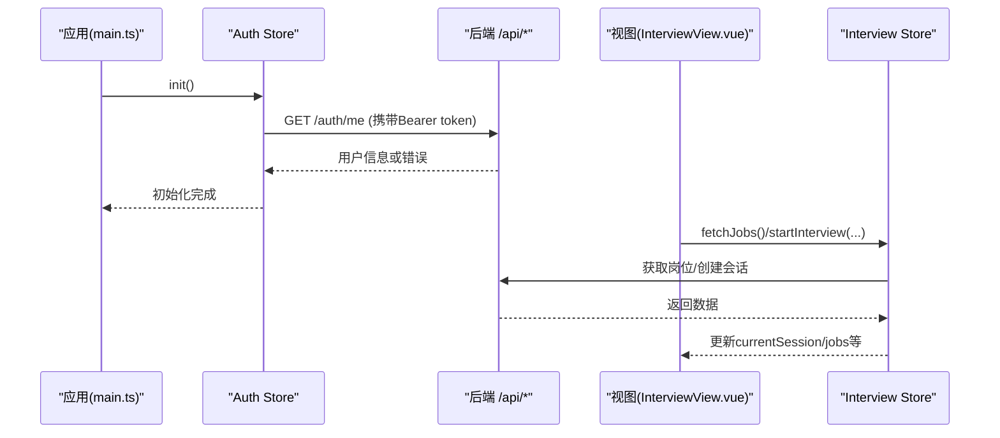
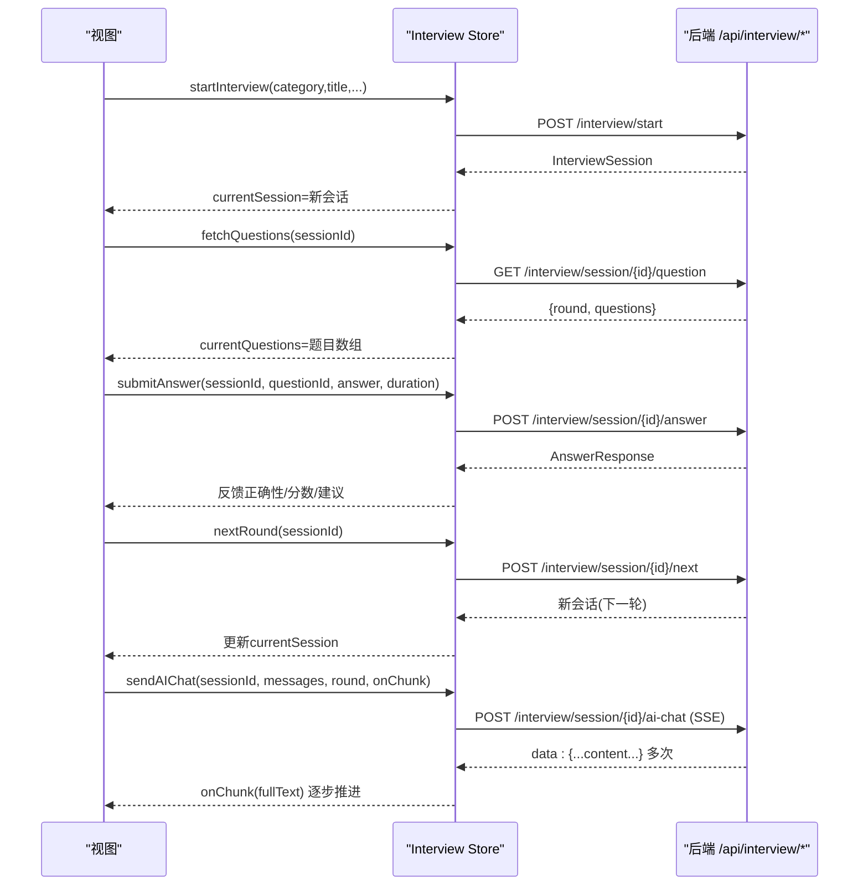
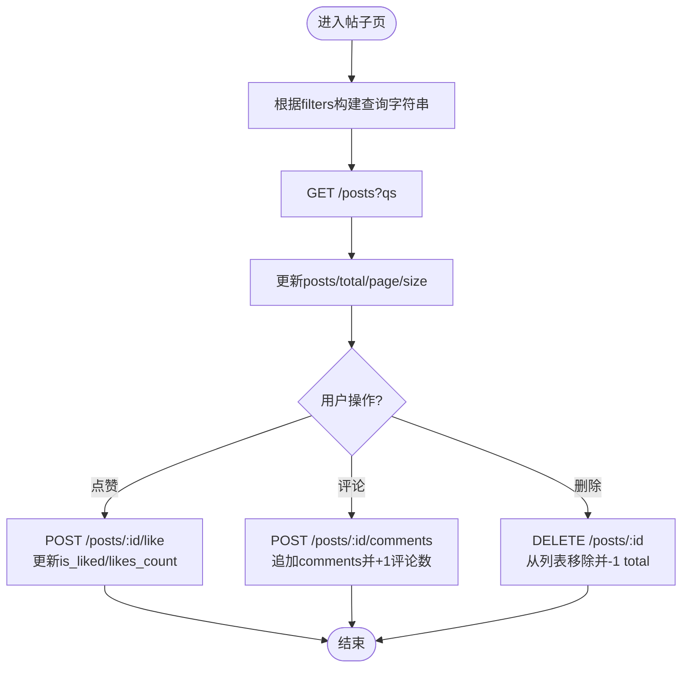
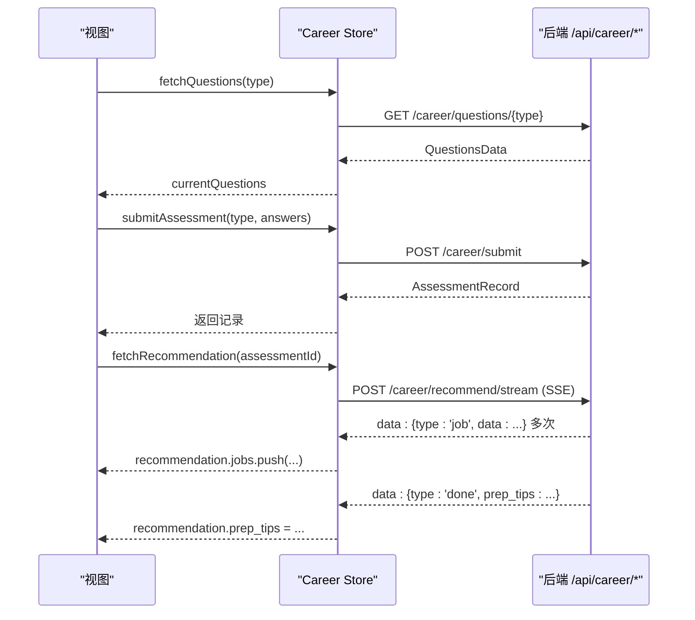
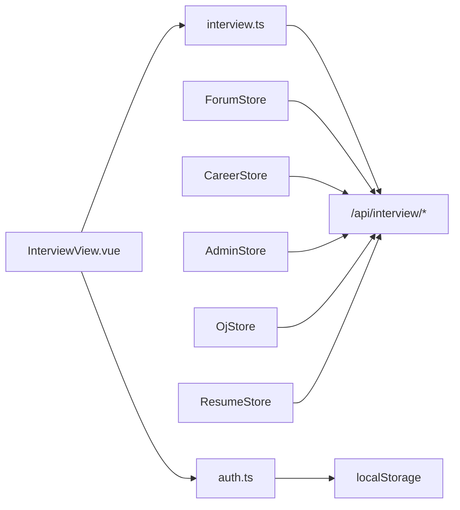

# 状态管理模式

<cite>
**本文引用的文件**
- [frontEnd/src/stores/auth.ts](file://frontEnd/src/stores/auth.ts)
- [frontEnd/src/stores/interview.ts](file://frontEnd/src/stores/interview.ts)
- [frontEnd/src/stores/forum.ts](file://frontEnd/src/stores/forum.ts)
- [frontEnd/src/stores/career.ts](file://frontEnd/src/stores/career.ts)
- [frontEnd/src/stores/admin.ts](file://frontEnd/src/stores/admin.ts)
- [frontEnd/src/stores/oj.ts](file://frontEnd/src/stores/oj.ts)
- [frontEnd/src/stores/resume.ts](file://frontEnd/src/stores/resume.ts)
- [frontEnd/src/stores/app.ts](file://frontEnd/src/stores/app.ts)
- [frontEnd/src/main.ts](file://frontEnd/src/main.ts)
- [frontEnd/src/views/InterviewView.vue](file://frontEnd/src/views/InterviewView.vue)
</cite>

## 目录
1. [引言](#引言)
2. [项目结构](#项目结构)
3. [核心组件](#核心组件)
4. [架构总览](#架构总览)
5. [详细组件分析](#详细组件分析)
6. [依赖关系分析](#依赖关系分析)
7. [性能考虑](#性能考虑)
8. [故障排查指南](#故障排查指南)
9. [结论](#结论)
10. [附录](#附录)

## 引言
本文件面向HR XF系统的前端状态管理，聚焦于基于Pinia的状态管理模式与实现。文档深入剖析以下store的架构设计与数据流：
- 用户认证状态（auth store）：JWT令牌管理、用户信息缓存、登录态恢复与同步
- 面试流程状态（interview store）：多轮次面试状态流转、进度跟踪、结果存储与AI对话流式处理
- 论坛状态（forum store）：帖子、评论、标签统计与筛选分页
- 职业发展状态（career store）：测评题目、提交记录、历史与推荐结果的SSE流式更新
- 其他辅助store：admin、oj、resume、app

目标是为开发者提供可维护、可扩展、高性能的状态管理实践参考。

## 项目结构
前端采用Vue 3 + Pinia组织状态，按业务域拆分store，每个store内封装类型定义、API客户端与actions，视图通过组合式API调用store方法完成交互。



图表来源
- [frontEnd/src/main.ts:1-19](file://frontEnd/src/main.ts#L1-L19)
- [frontEnd/src/stores/auth.ts:1-314](file://frontEnd/src/stores/auth.ts#L1-L314)
- [frontEnd/src/stores/interview.ts:1-313](file://frontEnd/src/stores/interview.ts#L1-L313)
- [frontEnd/src/views/InterviewView.vue:126-171](file://frontEnd/src/views/InterviewView.vue#L126-L171)

章节来源
- [frontEnd/src/main.ts:1-19](file://frontEnd/src/main.ts#L1-L19)

## 核心组件
- 统一API请求封装：各store内部定义轻量apiRequest或authHeaders，自动注入Authorization头并统一错误抛出
- 响应式状态：使用ref/reactive声明状态，computed派生布尔或计算值
- Actions：封装异步操作，负责网络请求、本地持久化、状态更新与错误处理
- 持久化策略：auth store将token与user写入localStorage；其他store多为内存态，必要时可在action中扩展持久化

章节来源
- [frontEnd/src/stores/auth.ts:33-61](file://frontEnd/src/stores/auth.ts#L33-L61)
- [frontEnd/src/stores/interview.ts:101-124](file://frontEnd/src/stores/interview.ts#L101-L124)
- [frontEnd/src/stores/forum.ts:77-100](file://frontEnd/src/stores/forum.ts#L77-L100)
- [frontEnd/src/stores/career.ts:4-20](file://frontEnd/src/stores/career.ts#L4-L20)
- [frontEnd/src/stores/admin.ts:48-65](file://frontEnd/src/stores/admin.ts#L48-L65)
- [frontEnd/src/stores/oj.ts:90-113](file://frontEnd/src/stores/oj.ts#L90-L113)
- [frontEnd/src/stores/resume.ts:59-78](file://frontEnd/src/stores/resume.ts#L59-L78)

## 架构总览
整体遵循“视图调用store actions → store发起HTTP请求 → 更新响应式状态”的数据流模式。认证相关状态在应用启动时进行恢复验证，确保页面刷新后保持登录态。



图表来源
- [frontEnd/src/main.ts:14-18](file://frontEnd/src/main.ts#L14-L18)
- [frontEnd/src/stores/auth.ts:71-83](file://frontEnd/src/stores/auth.ts#L71-L83)
- [frontEnd/src/stores/interview.ts:140-171](file://frontEnd/src/stores/interview.ts#L140-L171)
- [frontEnd/src/views/InterviewView.vue:156-169](file://frontEnd/src/views/InterviewView.vue#L156-L169)

## 详细组件分析

### 用户认证状态管理（auth store）
职责与能力
- JWT令牌管理：登录后保存access_token到localStorage，并在后续请求中自动附加Authorization头
- 用户信息缓存：将用户对象序列化保存到localStorage，避免重复拉取
- 登录态恢复：应用启动时读取本地token并校验有效性，失败则清理会话
- 账户设置：支持修改用户名、邮箱、密码、头像上传、注销账号等

关键设计点
- 统一的apiRequest封装，自动注入token并解析错误体
- _setSession集中处理token与user的持久化与内存状态更新
- isAuthenticated为派生状态，用于路由守卫或UI展示

```mermaid
classDiagram
class AuthStore {
+user : User | null
+token : string | null
+isAuthenticated : boolean
+init() Promise<void>
+login(account, password) Promise<{success,message}>
+registerByEmail(email,password) Promise<{success,message}>
+registerByUsername(username,password) Promise<{success,message}>
+logout() void
+fetchProfile() Promise<User|null>
+updateProfile(data) Promise<{success,message}>
+changePassword(old,new) Promise<{success,message}>
+uploadAvatar(file) Promise<{success,message}>
+updateUsername(username) Promise<{success,message}>
+updateEmail(email) Promise<{success,message}>
+changePasswordBySettings(old,new) Promise<{success,message}>
+deleteAccount(password) Promise<{success,message}>
}
```

图表来源
- [frontEnd/src/stores/auth.ts:65-313](file://frontEnd/src/stores/auth.ts#L65-L313)

章节来源
- [frontEnd/src/stores/auth.ts:33-61](file://frontEnd/src/stores/auth.ts#L33-L61)
- [frontEnd/src/stores/auth.ts:71-83](file://frontEnd/src/stores/auth.ts#L71-L83)
- [frontEnd/src/stores/auth.ts:119-142](file://frontEnd/src/stores/auth.ts#L119-L142)
- [frontEnd/src/stores/auth.ts:144-171](file://frontEnd/src/stores/auth.ts#L144-L171)
- [frontEnd/src/stores/auth.ts:189-218](file://frontEnd/src/stores/auth.ts#L189-L218)
- [frontEnd/src/stores/auth.ts:222-284](file://frontEnd/src/stores/auth.ts#L222-L284)
- [frontEnd/src/stores/auth.ts:288-293](file://frontEnd/src/stores/auth.ts#L288-L293)

### 面试流程状态管理（interview store）
职责与能力
- 岗位与分类：加载岗位分类与职位列表
- 面试会话：创建会话、拉取当前会话、切换下一轮、中止面试
- 答题与评分：拉取题目、提交答案、上报作弊次数
- AI对话：SSE流式接收AI回答，实时拼接文本并回调
- 报告与历史：拉取评估报告与历史记录

复杂业务逻辑要点
- 多轮次状态：currentSession.current_round与rounds_progress驱动界面步骤
- 进度跟踪：isActive/currentRound派生状态简化条件判断
- 流式输出：sendAIChat使用ReadableStream分块解码，逐段触发onChunk回调



图表来源
- [frontEnd/src/stores/interview.ts:140-171](file://frontEnd/src/stores/interview.ts#L140-L171)
- [frontEnd/src/stores/interview.ts:177-199](file://frontEnd/src/stores/interview.ts#L177-L199)
- [frontEnd/src/stores/interview.ts:201-207](file://frontEnd/src/stores/interview.ts#L201-L207)
- [frontEnd/src/stores/interview.ts:209-253](file://frontEnd/src/stores/interview.ts#L209-L253)

章节来源
- [frontEnd/src/stores/interview.ts:128-139](file://frontEnd/src/stores/interview.ts#L128-L139)
- [frontEnd/src/stores/interview.ts:140-171](file://frontEnd/src/stores/interview.ts#L140-L171)
- [frontEnd/src/stores/interview.ts:173-199](file://frontEnd/src/stores/interview.ts#L173-L199)
- [frontEnd/src/stores/interview.ts:201-207](file://frontEnd/src/stores/interview.ts#L201-L207)
- [frontEnd/src/stores/interview.ts:209-253](file://frontEnd/src/stores/interview.ts#L209-L253)
- [frontEnd/src/stores/interview.ts:270-287](file://frontEnd/src/stores/interview.ts#L270-L287)

### 论坛状态管理（forum store）
职责与能力
- 帖子列表与详情：分页加载、构建查询参数、更新total/page/size
- 互动操作：点赞、评论、删除帖子/评论，即时更新本地计数与标记
- 筛选与排序：reactive filters统一管理筛选条件，resetFilters重置
- 标签统计与筛选选项：聚合统计与下拉选项



图表来源
- [frontEnd/src/stores/forum.ts:130-143](file://frontEnd/src/stores/forum.ts#L130-L143)
- [frontEnd/src/stores/forum.ts:145-161](file://frontEnd/src/stores/forum.ts#L145-L161)
- [frontEnd/src/stores/forum.ts:188-208](file://frontEnd/src/stores/forum.ts#L188-L208)
- [frontEnd/src/stores/forum.ts:221-240](file://frontEnd/src/stores/forum.ts#L221-L240)
- [frontEnd/src/stores/forum.ts:242-251](file://frontEnd/src/stores/forum.ts#L242-L251)

章节来源
- [frontEnd/src/stores/forum.ts:115-127](file://frontEnd/src/stores/forum.ts#L115-L127)
- [frontEnd/src/stores/forum.ts:130-143](file://frontEnd/src/stores/forum.ts#L130-L143)
- [frontEnd/src/stores/forum.ts:145-161](file://frontEnd/src/stores/forum.ts#L145-L161)
- [frontEnd/src/stores/forum.ts:188-208](file://frontEnd/src/stores/forum.ts#L188-L208)
- [frontEnd/src/stores/forum.ts:221-240](file://frontEnd/src/stores/forum.ts#L221-L240)
- [frontEnd/src/stores/forum.ts:242-251](file://frontEnd/src/stores/forum.ts#L242-L251)
- [frontEnd/src/stores/forum.ts:279-286](file://frontEnd/src/stores/forum.ts#L279-L286)

### 职业发展状态管理（career store）
职责与能力
- 测评题目：按类型拉取题目集
- 提交与历史：提交答案并记录，拉取历史列表与单条结果
- 个性化推荐：SSE流式推送岗位匹配与建议，实时更新jobs与prep_tips



图表来源
- [frontEnd/src/stores/career.ts:94-104](file://frontEnd/src/stores/career.ts#L94-L104)
- [frontEnd/src/stores/career.ts:106-121](file://frontEnd/src/stores/career.ts#L106-L121)
- [frontEnd/src/stores/career.ts:148-207](file://frontEnd/src/stores/career.ts#L148-L207)

章节来源
- [frontEnd/src/stores/career.ts:82-92](file://frontEnd/src/stores/career.ts#L82-L92)
- [frontEnd/src/stores/career.ts:94-104](file://frontEnd/src/stores/career.ts#L94-L104)
- [frontEnd/src/stores/career.ts:106-121](file://frontEnd/src/stores/career.ts#L106-L121)
- [frontEnd/src/stores/career.ts:123-146](file://frontEnd/src/stores/career.ts#L123-L146)
- [frontEnd/src/stores/career.ts:148-207](file://frontEnd/src/stores/career.ts#L148-L207)

### 其他store概览
- admin store：后台管理面板的统计数据、用户/题目/帖子列表与CRUD操作，统一filters与分页
- oj store：题库浏览、题目详情、代码提交与调试、用户进度与标签统计
- resume store：简历上传、解析、AI分析与措辞优化（含SSE流式优化），PDF文本提取
- app store：全局主题开关，控制根节点dark类名

章节来源
- [frontEnd/src/stores/admin.ts:69-249](file://frontEnd/src/stores/admin.ts#L69-L249)
- [frontEnd/src/stores/oj.ts:123-267](file://frontEnd/src/stores/oj.ts#L123-L267)
- [frontEnd/src/stores/resume.ts:82-243](file://frontEnd/src/stores/resume.ts#L82-L243)
- [frontEnd/src/stores/app.ts:4-17](file://frontEnd/src/stores/app.ts#L4-L17)

## 依赖关系分析
- 视图对store的依赖：例如InterviewView直接依赖useInterviewStore，并通过其actions驱动会话生命周期
- store对localStorage的依赖：auth store强依赖本地存储以维持会话；其他store可按需扩展
- 对外部API的依赖：所有store均通过相对路径/api前缀访问后端接口，统一错误处理



图表来源
- [frontEnd/src/views/InterviewView.vue:126-171](file://frontEnd/src/views/InterviewView.vue#L126-L171)
- [frontEnd/src/stores/auth.ts:33-61](file://frontEnd/src/stores/auth.ts#L33-L61)
- [frontEnd/src/stores/interview.ts:101-124](file://frontEnd/src/stores/interview.ts#L101-L124)

章节来源
- [frontEnd/src/views/InterviewView.vue:126-171](file://frontEnd/src/views/InterviewView.vue#L126-L171)
- [frontEnd/src/stores/auth.ts:33-61](file://frontEnd/src/stores/auth.ts#L33-L61)
- [frontEnd/src/stores/interview.ts:101-124](file://frontEnd/src/stores/interview.ts#L101-L124)

## 性能考虑
- 减少不必要的重渲染：使用computed派生状态（如isAuthenticated、isActive、currentRound）降低模板复杂度
- 局部更新：在点赞/评论等操作中仅更新受影响字段，避免整表重建
- 流式输出：面试AI对话与职业推荐使用SSE分块处理，提升首屏感知与用户体验
- 分页与过滤：forum与oj store通过URLSearchParams动态构建查询，避免全量加载
- 错误快速失败：统一错误抛出，便于上层捕获与提示，避免长时间挂起

[本节为通用指导，不直接分析具体文件]

## 故障排查指南
常见问题与定位思路
- 未登录或token失效：检查auth store的init流程是否正确执行，确认localStorage中存在有效token且后端返回成功
- 请求失败提示不明确：查看apiRequest的错误分支，确认后端detail字段是否返回，必要时增加日志
- SSE流中断：检查浏览器兼容性、服务端data行格式、reader读取循环是否完整退出
- 状态不同步：确认action是否在成功后更新本地状态，避免遗漏赋值

定位依据
- 认证初始化与失败清理：见auth store的init与logout
- 统一错误处理：各store的apiRequest均抛出Error(detail或status)
- SSE处理：interview与career store中的流式读取与解析逻辑

章节来源
- [frontEnd/src/stores/auth.ts:71-83](file://frontEnd/src/stores/auth.ts#L71-L83)
- [frontEnd/src/stores/auth.ts:136-142](file://frontEnd/src/stores/auth.ts#L136-L142)
- [frontEnd/src/stores/interview.ts:113-124](file://frontEnd/src/stores/interview.ts#L113-L124)
- [frontEnd/src/stores/interview.ts:209-253](file://frontEnd/src/stores/interview.ts#L209-L253)
- [frontEnd/src/stores/career.ts:148-207](file://frontEnd/src/stores/career.ts#L148-L207)

## 结论
HR XF前端状态管理采用Pinia按业务域划分store，配合统一的API封装与错误处理，形成清晰的数据流与易维护的代码结构。认证store实现了完整的JWT生命周期管理；面试store支撑了复杂的多轮次流程与AI对话流；论坛与职业发展store分别体现了列表/筛选与SSE流式更新的典型模式。建议在后续迭代中继续强化：
- 跨store通信与副作用隔离
- 更完善的错误边界与重试机制
- 可选的持久化中间件（如pinia-plugin-persistedstate）以统一持久化策略

[本节为总结，不直接分析具体文件]

## 附录
- 最佳实践清单
  - 在store内定义清晰的类型接口，保证前后端契约一致
  - 将网络请求与状态更新解耦，actions只关注业务语义
  - 对敏感数据（token/user）进行最小化持久化与及时清理
  - 对长耗时操作提供loading/error状态，提升用户体验
  - 对SSE流式接口做好断流与异常处理

[本节为通用指导，不直接分析具体文件]