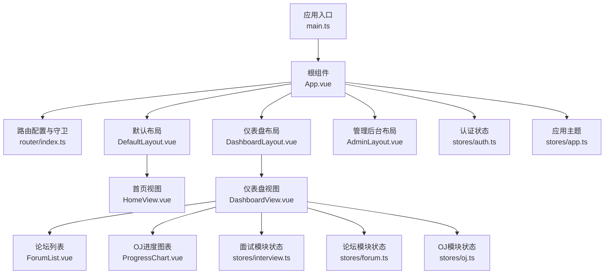
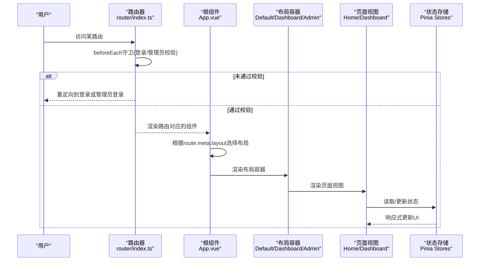
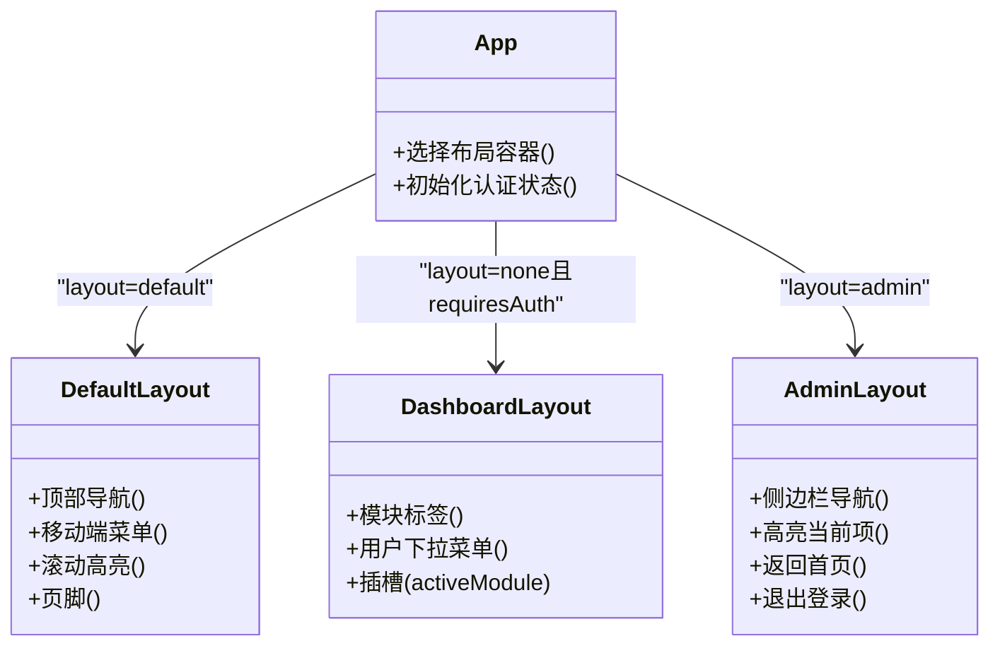
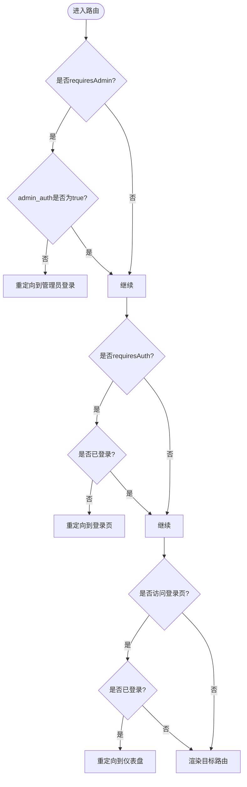
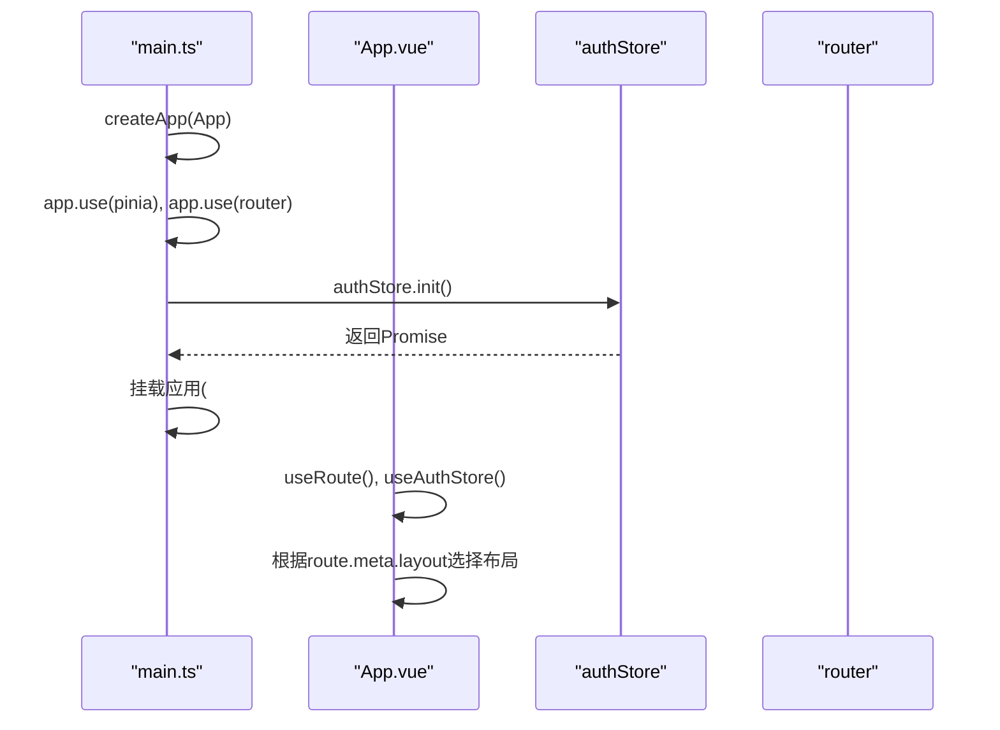
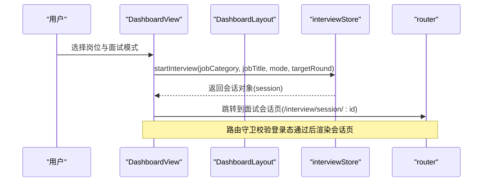
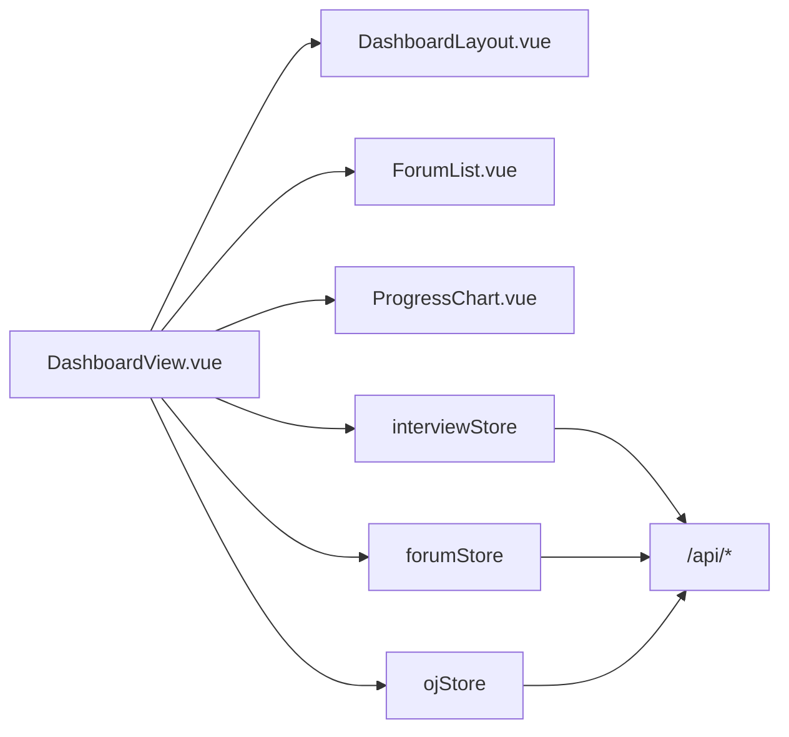

# 组件架构设计

<cite>
**本文引用的文件**   
- [App.vue](file://frontEnd/src/App.vue)
- [main.ts](file://frontEnd/src/main.ts)
- [index.ts](file://frontEnd/src/router/index.ts)
- [DashboardLayout.vue](file://frontEnd/src/components/DashboardLayout.vue)
- [DefaultLayout.vue](file://frontEnd/src/components/DefaultLayout.vue)
- [AdminLayout.vue](file://frontEnd/src/components/AdminLayout.vue)
- [DashboardView.vue](file://frontEnd/src/views/DashboardView.vue)
- [HomeView.vue](file://frontEnd/src/views/HomeView.vue)
- [auth.ts](file://frontEnd/src/stores/auth.ts)
- [app.ts](file://frontEnd/src/stores/app.ts)
- [interview.ts](file://frontEnd/src/stores/interview.ts)
- [forum.ts](file://frontEnd/src/stores/forum.ts)
- [oj.ts](file://frontEnd/src/stores/oj.ts)
- [ForumList.vue](file://frontEnd/src/components/forum/ForumList.vue)
- [ProgressChart.vue](file://frontEnd/src/components/oj/ProgressChart.vue)
</cite>

## 目录
1. [引言](#引言)
2. [项目结构](#项目结构)
3. [核心组件](#核心组件)
4. [架构总览](#架构总览)
5. [详细组件分析](#详细组件分析)
6. [依赖关系分析](#依赖关系分析)
7. [性能与可维护性建议](#性能与可维护性建议)
8. [故障排查指南](#故障排查指南)
9. [结论](#结论)
10. [附录：最佳实践与设计规范](#附录最佳实践与设计规范)

## 引言
本文件面向HR XF系统的前端Vue3工程，聚焦组件架构设计与实现细节。文档围绕以下目标展开：
- 解析布局组件的分层架构与职责分离（DashboardLayout、DefaultLayout、AdminLayout）
- 说明路由守卫机制（权限验证、登录检查、页面加载状态管理）
- 梳理组件间通信模式（Props/Emits、Pinia Store、事件总线替代方案）
- 解释App.vue根组件的初始化流程与全局配置管理
- 提供设计规范与最佳实践，帮助构建可维护和可扩展的前端组件架构

## 项目结构
前端采用“按功能域组织”的结构：components存放通用与业务组件，views为页面级视图，stores使用Pinia进行状态管理，router集中定义路由与守卫。布局组件位于components顶层，便于在应用入口根据路由元信息动态挂载。

图示来源
- [main.ts:1-19](file://frontEnd/src/main.ts#L1-L19)
- [App.vue:1-21](file://frontEnd/src/App.vue#L1-L21)
- [index.ts:1-167](file://frontEnd/src/router/index.ts#L1-L167)
- [DefaultLayout.vue:1-139](file://frontEnd/src/components/DefaultLayout.vue#L1-L139)
- [DashboardLayout.vue:1-167](file://frontEnd/src/components/DashboardLayout.vue#L1-L167)
- [AdminLayout.vue:1-110](file://frontEnd/src/components/AdminLayout.vue#L1-L110)
- [HomeView.vue:1-353](file://frontEnd/src/views/HomeView.vue#L1-L353)
- [DashboardView.vue:1-640](file://frontEnd/src/views/DashboardView.vue#L1-L640)
- [auth.ts:1-314](file://frontEnd/src/stores/auth.ts#L1-L314)
- [app.ts:1-18](file://frontEnd/src/stores/app.ts#L1-L18)
- [interview.ts:1-313](file://frontEnd/src/stores/interview.ts#L1-L313)
- [forum.ts:1-315](file://frontEnd/src/stores/forum.ts#L1-L315)
- [oj.ts:1-268](file://frontEnd/src/stores/oj.ts#L1-L268)
- [ForumList.vue:1-259](file://frontEnd/src/components/forum/ForumList.vue#L1-L259)
- [ProgressChart.vue:1-154](file://frontEnd/src/components/oj/ProgressChart.vue#L1-L154)

章节来源
- [main.ts:1-19](file://frontEnd/src/main.ts#L1-L19)
- [App.vue:1-21](file://frontEnd/src/App.vue#L1-L21)
- [index.ts:1-167](file://frontEnd/src/router/index.ts#L1-L167)

## 核心组件
- App.vue：根组件负责根据路由meta.layout选择不同布局容器，并在启动时调用认证Store的init以恢复登录态。
- DefaultLayout：面向公开页面的通用布局，包含顶部导航、移动端菜单、页脚等，展示用户登录态与快捷入口。
- DashboardLayout：面向已登录用户的仪表盘布局，提供模块切换标签、用户下拉菜单（个人资料、简历分析、账号设置、管理后台、退出登录），并通过具名插槽向子视图传递activeModule。
- AdminLayout：管理后台布局，左侧侧边栏导航，右侧主内容区，支持返回首页与退出登录。

章节来源
- [App.vue:1-21](file://frontEnd/src/App.vue#L1-L21)
- [DefaultLayout.vue:1-139](file://frontEnd/src/components/DefaultLayout.vue#L1-L139)
- [DashboardLayout.vue:1-167](file://frontEnd/src/components/DashboardLayout.vue#L1-L167)
- [AdminLayout.vue:1-110](file://frontEnd/src/components/AdminLayout.vue#L1-L110)

## 架构总览
整体架构遵循“布局分层 + 路由驱动 + 状态集中”的模式：
- 布局层：通过App.vue依据路由meta.layout渲染对应布局容器，实现公共UI复用与职责分离。
- 路由层：集中式路由配置配合beforeEach守卫，统一处理登录校验、管理员权限校验与跳转策略。
- 状态层：各业务域通过Pinia Store管理数据与副作用，组件仅消费状态并触发actions。
- 视图层：页面级视图组合布局与业务组件，完成具体业务交互与数据展示。

图示来源
- [index.ts:136-164](file://frontEnd/src/router/index.ts#L136-L164)
- [App.vue:1-21](file://frontEnd/src/App.vue#L1-L21)
- [DashboardView.vue:1-640](file://frontEnd/src/views/DashboardView.vue#L1-L640)
- [auth.ts:1-314](file://frontEnd/src/stores/auth.ts#L1-L314)

## 详细组件分析

### 布局组件分层与职责
- DefaultLayout
  - 职责：提供站点级导航、移动端折叠菜单、滚动高亮当前区块、页脚信息；根据登录态显示“登录/注册”或“仪表盘入口”。
  - 关键特性：监听窗口滚动计算activeSection，提升用户体验；使用computed派生用户名与头像首字母。
- DashboardLayout
  - 职责：提供模块标签（模拟面试、职业测评、简历分析、面经论坛、OJ刷题）、用户下拉菜单（个人资料、简历分析、账号设置、管理后台、退出登录）；通过插槽将activeModule传递给子视图。
  - 关键特性：模块切换状态持久化至sessionStorage；用户菜单内判断管理员身份并展示管理入口。
- AdminLayout
  - 职责：管理后台侧边栏导航、高亮当前项、底部操作（返回首页、退出登录）。
  - 关键特性：基于route.path前缀匹配高亮；退出登录清理本地管理员标记。

图示来源
- [App.vue:1-21](file://frontEnd/src/App.vue#L1-L21)
- [DefaultLayout.vue:1-139](file://frontEnd/src/components/DefaultLayout.vue#L1-L139)
- [DashboardLayout.vue:1-167](file://frontEnd/src/components/DashboardLayout.vue#L1-L167)
- [AdminLayout.vue:1-110](file://frontEnd/src/components/AdminLayout.vue#L1-L110)

章节来源
- [DefaultLayout.vue:1-139](file://frontEnd/src/components/DefaultLayout.vue#L1-L139)
- [DashboardLayout.vue:1-167](file://frontEnd/src/components/DashboardLayout.vue#L1-L167)
- [AdminLayout.vue:1-110](file://frontEnd/src/components/AdminLayout.vue#L1-L110)

### 路由守卫机制
- 普通用户守卫
  - requiresAuth：未登录访问受保护路由时重定向至登录页；已登录访问登录页则重定向至仪表盘。
- 管理员守卫
  - requiresAdmin：未登录管理员访问管理路由时重定向至管理员登录页；已登录管理员访问管理员登录页则重定向至管理后台。
- 滚动行为
  - 若目标路由存在hash，平滑滚动到对应锚点；否则恢复到上次位置或顶部。

图示来源
- [index.ts:136-164](file://frontEnd/src/router/index.ts#L136-L164)

章节来源
- [index.ts:1-167](file://frontEnd/src/router/index.ts#L1-L167)

### 应用初始化与全局配置
- main.ts
  - 创建Vue应用实例，安装Pinia与Router，等待认证状态初始化完成后挂载应用，确保首次渲染即具备正确的登录态。
- App.vue
  - 根据route.meta.layout动态选择布局容器；在setup中调用authStore.init以恢复本地token并验证有效性。
- stores/app.ts
  - 提供暗黑模式开关，通过document.documentElement.classList控制主题类名。

图示来源
- [main.ts:1-19](file://frontEnd/src/main.ts#L1-L19)
- [App.vue:1-21](file://frontEnd/src/App.vue#L1-L21)
- [auth.ts:72-83](file://frontEnd/src/stores/auth.ts#L72-L83)
- [app.ts:1-18](file://frontEnd/src/stores/app.ts#L1-L18)

章节来源
- [main.ts:1-19](file://frontEnd/src/main.ts#L1-L19)
- [App.vue:1-21](file://frontEnd/src/App.vue#L1-L21)
- [app.ts:1-18](file://frontEnd/src/stores/app.ts#L1-L18)

### 组件间通信模式
- Props与Emits
  - 父组件通过props向下传递数据，子组件通过emits向上抛出事件，如DashboardView向DashboardLayout传递activeModule，ForumList向父组件发出create/detail事件。
- Pinia Store
  - 各业务域独立store（auth、interview、forum、oj），组件通过useXxxStore获取响应式状态与actions，避免跨层级prop drilling。
- 事件总线模式
  - 当前代码未引入全局事件总线，推荐优先使用Pinia或组件级事件（emit）；如需跨树通信，可使用mitt或自定义事件中心，但需谨慎管理生命周期与内存泄漏。

章节来源
- [DashboardView.vue:1-640](file://frontEnd/src/views/DashboardView.vue#L1-L640)
- [ForumList.vue:1-259](file://frontEnd/src/components/forum/ForumList.vue#L1-L259)
- [auth.ts:1-314](file://frontEnd/src/stores/auth.ts#L1-L314)
- [interview.ts:1-313](file://frontEnd/src/stores/interview.ts#L1-L313)
- [forum.ts:1-315](file://frontEnd/src/stores/forum.ts#L1-L315)
- [oj.ts:1-268](file://frontEnd/src/stores/oj.ts#L1-L268)

### 插槽使用模式
- 具名插槽与作用域插槽
  - DashboardLayout通过具名插槽包裹子视图，并使用作用域插槽暴露activeModule供子视图决定渲染逻辑，提高布局与内容的解耦度。
- 默认插槽
  - DefaultLayout与AdminLayout使用默认插槽承载页面内容，保持布局容器的简洁与一致性。

章节来源
- [DashboardLayout.vue:1-167](file://frontEnd/src/components/DashboardLayout.vue#L1-L167)
- [DefaultLayout.vue:1-139](file://frontEnd/src/components/DefaultLayout.vue#L1-L139)
- [AdminLayout.vue:1-110](file://frontEnd/src/components/AdminLayout.vue#L1-L110)

### 典型业务流程时序（仪表盘面试流程）

图示来源
- [DashboardView.vue:505-520](file://frontEnd/src/views/DashboardView.vue#L505-L520)
- [interview.ts:149-171](file://frontEnd/src/stores/interview.ts#L149-L171)
- [index.ts:136-164](file://frontEnd/src/router/index.ts#L136-L164)

章节来源
- [DashboardView.vue:1-640](file://frontEnd/src/views/DashboardView.vue#L1-L640)
- [interview.ts:1-313](file://frontEnd/src/stores/interview.ts#L1-L313)
- [index.ts:1-167](file://frontEnd/src/router/index.ts#L1-L167)

## 依赖关系分析
- 组件依赖
  - DashboardView依赖DashboardLayout以及多个业务组件（ForumList、ProgressChart等），并通过Pinia Store与后端API交互。
- 状态依赖
  - 各Store内部封装了统一的apiRequest方法，自动注入Authorization头，保证鉴权请求的一致性。
- 路由依赖
  - 路由守卫依赖authStore与localStorage中的管理员标记，形成前后端一致的权限模型。

图示来源
- [DashboardView.vue:1-640](file://frontEnd/src/views/DashboardView.vue#L1-L640)
- [ForumList.vue:1-259](file://frontEnd/src/components/forum/ForumList.vue#L1-L259)
- [ProgressChart.vue:1-154](file://frontEnd/src/components/oj/ProgressChart.vue#L1-L154)
- [interview.ts:103-124](file://frontEnd/src/stores/interview.ts#L103-L124)
- [forum.ts:79-100](file://frontEnd/src/stores/forum.ts#L79-L100)
- [oj.ts:92-113](file://frontEnd/src/stores/oj.ts#L92-L113)

章节来源
- [DashboardView.vue:1-640](file://frontEnd/src/views/DashboardView.vue#L1-L640)
- [interview.ts:1-313](file://frontEnd/src/stores/interview.ts#L1-L313)
- [forum.ts:1-315](file://frontEnd/src/stores/forum.ts#L1-L315)
- [oj.ts:1-268](file://frontEnd/src/stores/oj.ts#L1-L268)

## 性能与可维护性建议
- 路由懒加载
  - 当前路由已使用动态import，有助于减少首屏体积；建议在新增路由时继续保持该模式。
- 状态粒度与缓存
  - 对频繁访问的数据（如题库、职位分类）可在Store中增加本地缓存与失效策略，减少重复请求。
- 组件拆分与复用
  - 将复杂页面进一步拆分为小组件，明确单一职责；通过插槽与Props组合提升复用率。
- 动画与过渡
  - 合理使用Transition与Teleport，避免不必要的重排与重绘；对长列表使用虚拟滚动优化性能。
- 错误边界与重试
  - 在Store的apiRequest中统一捕获错误并提示用户；对网络不稳定场景增加重试与退避策略。

[本节为通用指导，不直接分析具体文件]

## 故障排查指南
- 登录后仍被重定向到登录页
  - 检查authStore.init是否正确恢复token与用户信息；确认路由守卫的requiresAuth条件与isAuthenticated计算值。
- 管理员无法进入管理后台
  - 确认localStorage中admin_auth标记是否存在且为true；检查requiresAdmin守卫逻辑。
- 页面滚动定位异常
  - 检查路由scrollBehavior配置与目标元素id是否存在；确保hash参数正确。
- 组件状态不同步
  - 确认是否通过Pinia Store共享状态；避免在多处维护相同数据的副本。

章节来源
- [index.ts:136-164](file://frontEnd/src/router/index.ts#L136-L164)
- [auth.ts:72-83](file://frontEnd/src/stores/auth.ts#L72-L83)
- [index.ts:125-134](file://frontEnd/src/router/index.ts#L125-L134)

## 结论
本架构通过布局分层、路由守卫与Pinia状态管理实现了清晰的职责分离与良好的扩展性。DashboardLayout与DefaultLayout分别覆盖已登录与公开场景，AdminLayout满足管理后台需求；路由守卫统一处理权限与跳转；组件间通信以Props/Emits与Store为主，兼顾可维护性与性能。后续可在状态缓存、错误处理与组件拆分方面持续优化。

[本节为总结性内容，不直接分析具体文件]

## 附录：最佳实践与设计规范
- 命名约定
  - 组件文件使用PascalCase，Store使用小写命名空间（如auth、interview），路由name使用驼峰。
- 布局组件规范
  - 仅提供布局壳与通用交互，业务逻辑下沉至视图与Store；通过插槽暴露必要上下文（如activeModule）。
- 路由元信息
  - 使用meta字段声明布局与权限要求（layout、requiresAuth、requiresAdmin），保持守卫逻辑集中。
- 状态管理规范
  - Store只暴露必要的state与actions，避免在组件中直接修改；对副作用（网络请求）集中在Store中处理。
- 事件与通信
  - 父子通信优先使用Props/Emits；跨层级或跨树通信使用Pinia；谨慎使用全局事件总线，避免隐式耦合。
- 可访问性与国际化
  - 为按钮与链接添加语义化标签与aria属性；预留i18n键值，逐步替换硬编码文本。
- 测试与文档
  - 对关键Store方法与路由守卫编写单元测试；为复杂组件补充使用示例与接口说明。

[本节为通用指导，不直接分析具体文件]