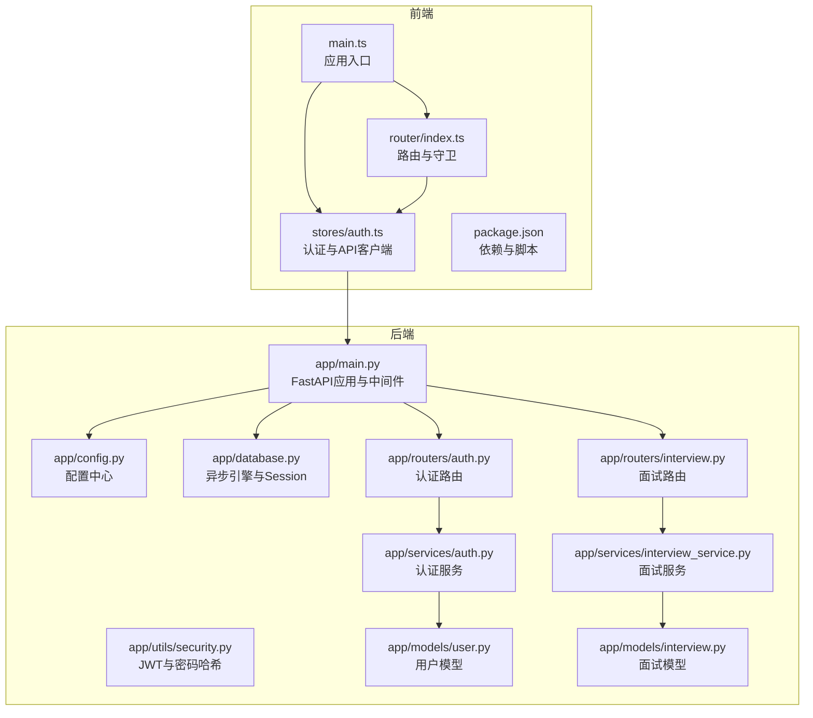
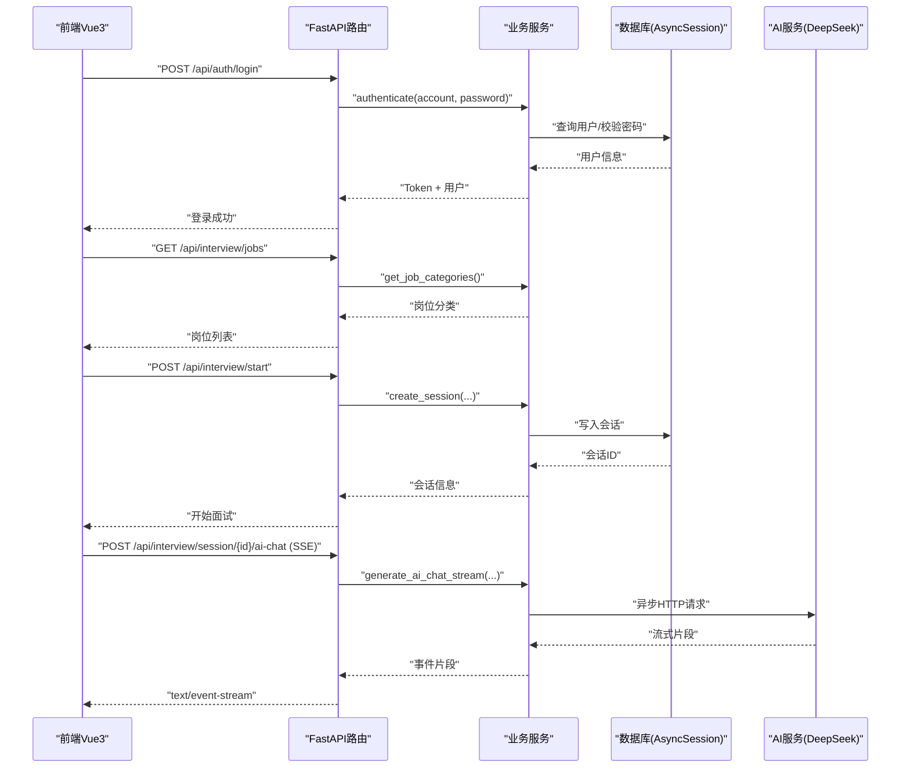
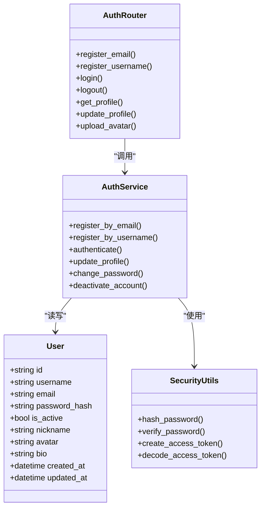
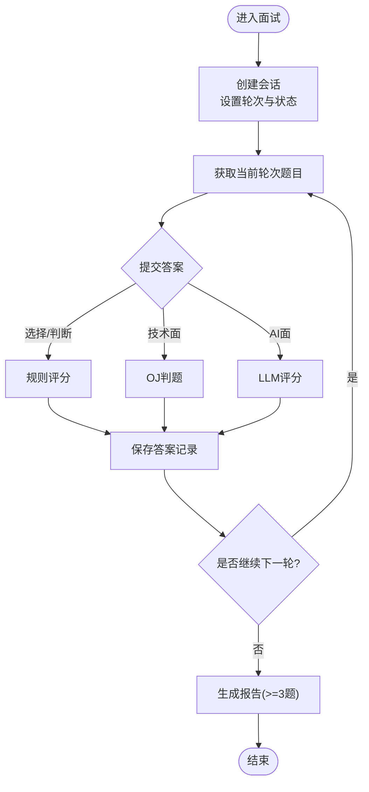
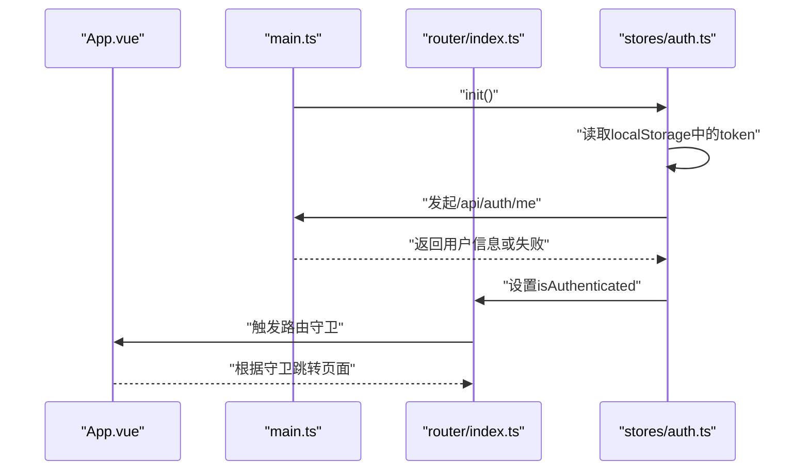
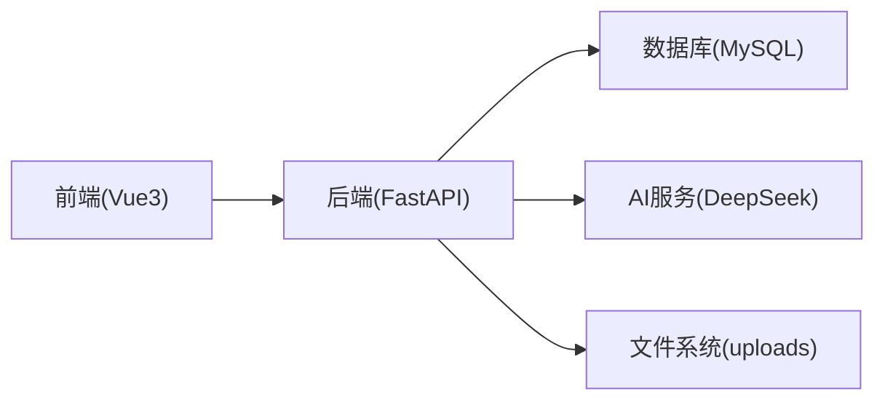

# 系统架构设计

<cite>
**本文引用的文件**   
- [backEnd/app/main.py](file://backEnd/app/main.py)
- [backEnd/app/config.py](file://backEnd/app/config.py)
- [backEnd/app/database.py](file://backEnd/app/database.py)
- [backEnd/app/utils/security.py](file://backEnd/app/utils/security.py)
- [backEnd/app/routers/auth.py](file://backEnd/app/routers/auth.py)
- [backEnd/app/services/auth.py](file://backEnd/app/services/auth.py)
- [backEnd/app/models/user.py](file://backEnd/app/models/user.py)
- [backEnd/app/routers/interview.py](file://backEnd/app/routers/interview.py)
- [backEnd/app/services/interview_service.py](file://backEnd/app/services/interview_service.py)
- [backEnd/app/models/interview.py](file://backEnd/app/models/interview.py)
- [frontEnd/src/main.ts](file://frontEnd/src/main.ts)
- [frontEnd/src/router/index.ts](file://frontEnd/src/router/index.ts)
- [frontEnd/src/stores/auth.ts](file://frontEnd/src/stores/auth.ts)
- [frontEnd/package.json](file://frontEnd/package.json)
</cite>

## 目录
1. [引言](#引言)
2. [项目结构](#项目结构)
3. [核心组件](#核心组件)
4. [架构总览](#架构总览)
5. [详细组件分析](#详细组件分析)
6. [依赖关系分析](#依赖关系分析)
7. [性能与可扩展性](#性能与可扩展性)
8. [安全策略](#安全策略)
9. [监控、日志与可观测性](#监控日志与可观测性)
10. [故障排查指南](#故障排查指南)
11. [结论](#结论)

## 引言
本文件为 HR XF 系统的全面架构设计文档，面向架构师与高级开发者。系统采用前后端分离的架构模式：前端基于 Vue3 + TypeScript + Vite，后端基于 FastAPI（异步）+ SQLAlchemy Async + MySQL，数据持久化通过异步 ORM 完成；同时集成 AI 服务（DeepSeek）用于面试对话与评分，支持 SSE 流式响应。整体遵循分层架构（表现层/业务逻辑层/数据访问层），并通过路由与服务解耦实现高内聚低耦合。

## 项目结构
仓库采用前后端双工程组织：
- 前端 frontEnd：Vue3 应用，使用 Pinia 做状态管理，Vue Router 做路由守卫，TailwindCSS 构建 UI，Vite 作为开发/构建工具。
- 后端 backEnd：FastAPI 应用，按功能域划分 routers、services、models、schemas、utils 等模块，使用 Alembic 进行数据库迁移，配置集中管理于 config.py。

图表来源
- [backEnd/app/main.py:1-90](file://backEnd/app/main.py#L1-L90)
- [backEnd/app/config.py:1-71](file://backEnd/app/config.py#L1-L71)
- [backEnd/app/database.py:1-58](file://backEnd/app/database.py#L1-L58)
- [backEnd/app/utils/security.py:1-48](file://backEnd/app/utils/security.py#L1-L48)
- [backEnd/app/routers/auth.py:1-217](file://backEnd/app/routers/auth.py#L1-L217)
- [backEnd/app/services/auth.py:1-174](file://backEnd/app/services/auth.py#L1-L174)
- [backEnd/app/models/user.py:1-45](file://backEnd/app/models/user.py#L1-L45)
- [backEnd/app/routers/interview.py:1-317](file://backEnd/app/routers/interview.py#L1-L317)
- [backEnd/app/services/interview_service.py:1-800](file://backEnd/app/services/interview_service.py#L1-L800)
- [backEnd/app/models/interview.py:1-114](file://backEnd/app/models/interview.py#L1-L114)
- [frontEnd/src/main.ts:1-19](file://frontEnd/src/main.ts#L1-L19)
- [frontEnd/src/router/index.ts:1-167](file://frontEnd/src/router/index.ts#L1-L167)
- [frontEnd/src/stores/auth.ts:1-314](file://frontEnd/src/stores/auth.ts#L1-L314)
- [frontEnd/package.json:1-35](file://frontEnd/package.json#L1-L35)

章节来源
- [backEnd/app/main.py:1-90](file://backEnd/app/main.py#L1-L90)
- [frontEnd/src/main.ts:1-19](file://frontEnd/src/main.ts#L1-L19)
- [frontEnd/package.json:1-35](file://frontEnd/package.json#L1-L35)

## 核心组件
- 应用启动与生命周期
  - FastAPI 应用通过 lifespan 钩子在启动时创建表并初始化种子数据，在关闭时释放连接池。
  - 挂载静态资源目录用于上传文件访问。
- 配置中心
  - 集中管理数据库、CORS、AI 服务、编译器路径等配置，提供同步/异步数据库 URL 生成与 CORS 列表解析。
- 数据库层
  - 使用 SQLAlchemy AsyncEngine 与 async_sessionmaker，提供 get_db 依赖注入器，自动提交或回滚事务。
- 安全与鉴权
  - 使用 bcrypt 对密码进行哈希，JWT 签发与校验封装在 utils/security.py。
- 认证路由与服务
  - 提供注册、登录、个人信息、头像上传、账号设置等接口，调用 auth 服务完成业务逻辑。
- 面试路由与服务
  - 提供岗位列表、会话管理、题目获取、答案提交、AI 对话（SSE）、作弊上报、中止、报告生成与历史查询等接口。
  - 服务层包含题库种子、轮次控制、评分逻辑、AI 对话与评分、报告聚合等。
- 数据模型
  - 用户与会话、题目、答案等实体定义，使用 JSON 字段承载复杂内容。
- 前端应用
  - 应用入口恢复本地 token 并验证有效性；路由守卫控制普通用户与管理端访问；Pinia store 封装 API 请求与状态管理。

章节来源
- [backEnd/app/main.py:27-49](file://backEnd/app/main.py#L27-L49)
- [backEnd/app/config.py:47-66](file://backEnd/app/config.py#L47-L66)
- [backEnd/app/database.py:31-58](file://backEnd/app/database.py#L31-L58)
- [backEnd/app/utils/security.py:18-48](file://backEnd/app/utils/security.py#L18-L48)
- [backEnd/app/routers/auth.py:25-217](file://backEnd/app/routers/auth.py#L25-L217)
- [backEnd/app/services/auth.py:38-174](file://backEnd/app/services/auth.py#L38-L174)
- [backEnd/app/models/user.py:10-45](file://backEnd/app/models/user.py#L10-L45)
- [backEnd/app/routers/interview.py:26-317](file://backEnd/app/routers/interview.py#L26-L317)
- [backEnd/app/services/interview_service.py:35-800](file://backEnd/app/services/interview_service.py#L35-L800)
- [backEnd/app/models/interview.py:19-114](file://backEnd/app/models/interview.py#L19-L114)
- [frontEnd/src/main.ts:14-18](file://frontEnd/src/main.ts#L14-L18)
- [frontEnd/src/router/index.ts:136-164](file://frontEnd/src/router/index.ts#L136-L164)
- [frontEnd/src/stores/auth.ts:35-61](file://frontEnd/src/stores/auth.ts#L35-L61)

## 架构总览
系统采用“前后端分离 + 分层架构”的模式：
- 表现层（前端）：Vue3 单页应用，负责页面渲染、交互与状态管理，通过 REST API 与后端通信。
- 网关/路由层（后端）：FastAPI 路由接收请求，进行参数校验、权限校验后委派给服务层。
- 业务逻辑层（服务）：封装领域逻辑（如面试流程、评分、AI 对话、报告生成）。
- 数据访问层（ORM）：SQLAlchemy 异步 ORM 与数据库交互，统一事务管理。
- 外部集成：AI 服务（DeepSeek）通过 httpx 异步 HTTP 客户端调用，返回流式事件或结构化结果。

图表来源
- [backEnd/app/routers/auth.py:69-80](file://backEnd/app/routers/auth.py#L69-L80)
- [backEnd/app/services/auth.py:85-96](file://backEnd/app/services/auth.py#L85-L96)
- [backEnd/app/routers/interview.py:29-33](file://backEnd/app/routers/interview.py#L29-L33)
- [backEnd/app/routers/interview.py:36-58](file://backEnd/app/routers/interview.py#L36-L58)
- [backEnd/app/routers/interview.py:161-189](file://backEnd/app/routers/interview.py#L161-L189)
- [backEnd/app/services/interview_service.py:797-800](file://backEnd/app/services/interview_service.py#L797-L800)

## 详细组件分析

### 认证子系统
- 职责边界
  - 路由层：暴露注册、登录、个人信息、头像上传、账号设置等接口，处理上传校验与错误映射。
  - 服务层：实现用户查找、注册冲突检测、密码校验、令牌签发、资料更新、注销等。
  - 数据层：User 模型定义用户基本信息与个人资料字段。
- 关键流程
  - 登录：路由接收凭据 -> 服务层根据邮箱或用户名查找用户 -> 校验密码与激活状态 -> 签发 JWT -> 返回 Token 与用户信息。
  - 头像上传：路由校验类型与大小 -> 保存至 uploads/avatars -> 更新用户记录 -> 返回最新资料。
- 安全要点
  - 密码使用 bcrypt 哈希，JWT 使用 HS256 算法，过期时间由配置控制。
  - 所有写操作需携带 Bearer Token，路由依赖 get_current_user 进行鉴权。

图表来源
- [backEnd/app/models/user.py:10-45](file://backEnd/app/models/user.py#L10-L45)
- [backEnd/app/routers/auth.py:25-217](file://backEnd/app/routers/auth.py#L25-L217)
- [backEnd/app/services/auth.py:38-174](file://backEnd/app/services/auth.py#L38-L174)
- [backEnd/app/utils/security.py:18-48](file://backEnd/app/utils/security.py#L18-L48)

章节来源
- [backEnd/app/routers/auth.py:25-217](file://backEnd/app/routers/auth.py#L25-L217)
- [backEnd/app/services/auth.py:38-174](file://backEnd/app/services/auth.py#L38-L174)
- [backEnd/app/models/user.py:10-45](file://backEnd/app/models/user.py#L10-L45)
- [backEnd/app/utils/security.py:18-48](file://backEnd/app/utils/security.py#L18-L48)

### 面试子系统
- 职责边界
  - 路由层：会话管理、题目获取、答案提交、AI 对话（SSE）、作弊上报、中止、报告与历史查询。
  - 服务层：岗位分类、轮次进度计算、题目抽取、评分（含 OJ 判题与 LLM 评分）、AI 对话流、报告生成。
  - 数据层：InterviewSession、InterviewQuestion、InterviewAnswer 模型。
- 关键流程
  - 开始面试：创建会话，设置当前轮次与状态。
  - 获取题目：按轮次从题库或 OJ 题库随机抽取。
  - 提交答案：选择题/判断题直接比对标准答案；技术面复用 OJ 判题；AI 面调用 LLM 评分。
  - AI 对话：SSE 流式返回，前端实时显示面试官提问与追问。
  - 报告生成：答题数≥3时聚合多维度评分与雷达图数据。

图表来源
- [backEnd/app/routers/interview.py:36-58](file://backEnd/app/routers/interview.py#L36-L58)
- [backEnd/app/services/interview_service.py:489-511](file://backEnd/app/services/interview_service.py#L489-L511)
- [backEnd/app/services/interview_service.py:536-621](file://backEnd/app/services/interview_service.py#L536-L621)
- [backEnd/app/services/interview_service.py:628-740](file://backEnd/app/services/interview_service.py#L628-L740)
- [backEnd/app/services/interview_service.py:797-800](file://backEnd/app/services/interview_service.py#L797-L800)

章节来源
- [backEnd/app/routers/interview.py:26-317](file://backEnd/app/routers/interview.py#L26-L317)
- [backEnd/app/services/interview_service.py:35-800](file://backEnd/app/services/interview_service.py#L35-L800)
- [backEnd/app/models/interview.py:19-114](file://backEnd/app/models/interview.py#L19-L114)

### 前端应用与状态管理
- 应用入口
  - 初始化 Pinia 与 Router，启动时恢复本地 token 并校验有效性，再挂载根组件。
- 路由守卫
  - 普通用户：未登录跳转登录页，已登录访问登录页跳转仪表盘。
  - 管理端：需要管理员标识，未登录跳转管理登录页。
- 认证 Store
  - 封装统一的 apiRequest 方法，自动附加 Authorization 头，处理错误消息。
  - 提供注册、登录、登出、资料更新、头像上传等方法，维护 user 与 token 状态。

图表来源
- [frontEnd/src/main.ts:14-18](file://frontEnd/src/main.ts#L14-L18)
- [frontEnd/src/router/index.ts:136-164](file://frontEnd/src/router/index.ts#L136-L164)
- [frontEnd/src/stores/auth.ts:72-83](file://frontEnd/src/stores/auth.ts#L72-L83)

章节来源
- [frontEnd/src/main.ts:1-19](file://frontEnd/src/main.ts#L1-19)
- [frontEnd/src/router/index.ts:1-167](file://frontEnd/src/router/index.ts#L1-L167)
- [frontEnd/src/stores/auth.ts:35-61](file://frontEnd/src/stores/auth.ts#L35-L61)

## 依赖关系分析
- 组件耦合与内聚
  - 路由层仅负责协议与参数校验，业务逻辑下沉到服务层，提升内聚性与可测试性。
  - 数据模型与 ORM 层解耦，便于替换存储或扩展字段。
- 外部依赖
  - 数据库：MySQL（异步驱动 aiomysql/pymysql），连接池与 ping 兼容性补丁确保稳定性。
  - AI 服务：httpx 异步客户端调用 DeepSeek API，支持流式事件。
  - 前端依赖：Vue3、Pinia、Vue Router、TailwindCSS、ECharts、Three.js/VRM 等。

图表来源
- [backEnd/app/config.py:47-66](file://backEnd/app/config.py#L47-L66)
- [backEnd/app/database.py:31-58](file://backEnd/app/database.py#L31-L58)
- [backEnd/app/services/interview_service.py:761-790](file://backEnd/app/services/interview_service.py#L761-L790)
- [frontEnd/package.json:11-33](file://frontEnd/package.json#L11-L33)

章节来源
- [backEnd/app/config.py:1-71](file://backEnd/app/config.py#L1-L71)
- [backEnd/app/database.py:1-58](file://backEnd/app/database.py#L1-L58)
- [backEnd/app/services/interview_service.py:761-790](file://backEnd/app/services/interview_service.py#L761-L790)
- [frontEnd/package.json:1-35](file://frontEnd/package.json#L1-L35)

## 性能与可扩展性
- 异步编程模型优势
  - FastAPI 基于 ASGI，天然支持高并发 I/O 密集场景；SQLAlchemy Async 避免阻塞事件循环，提高吞吐。
  - SSE 流式响应降低首字节延迟，提升用户体验。
- 数据库连接池
  - 配置 pool_size 与 max_overflow，结合 pool_pre_ping 保障连接健康；针对 aiomysql 版本差异做了兼容补丁。
- 可扩展性考虑
  - 微服务思想：将面试、评测、代码执行、TTS 等功能拆分为独立路由与服务，未来可按域拆分进程或服务。
  - 外部服务解耦：AI 服务通过配置化 URL 与密钥接入，便于切换供应商或增加缓存/重试机制。
  - 前端模块化：按功能域组织 views、components、stores，便于团队并行开发与重构。

[本节为通用指导，不直接分析具体文件]

## 安全策略
- 身份认证
  - 使用 JWT 无状态鉴权，Bearer Token 随请求头传递；路由依赖 get_current_user 校验。
- 密码安全
  - bcrypt 哈希，限制输入长度以避免溢出；校验失败返回统一错误。
- 跨域与安全头
  - CORS 白名单由配置控制；自定义验证错误处理器避免二进制内容导致解码异常。
- 文件上传安全
  - 限制类型与大小，旧头像覆盖删除，路径规范化防止越权访问。

章节来源
- [backEnd/app/utils/security.py:18-48](file://backEnd/app/utils/security.py#L18-L48)
- [backEnd/app/routers/auth.py:182-217](file://backEnd/app/routers/auth.py#L182-L217)
- [backEnd/app/main.py:52-58](file://backEnd/app/main.py#L52-L58)
- [backEnd/app/main.py:76-84](file://backEnd/app/main.py#L76-L84)

## 监控、日志与可观测性
- 健康检查
  - 提供 /api/health 端点用于存活探针与负载均衡健康检查。
- 建议增强
  - 引入结构化日志（如 structlog）与链路追踪（OpenTelemetry），记录关键业务指标（登录成功率、AI 调用耗时、评分延迟）。
  - 前端埋点收集用户行为与错误上报，配合后端错误码与详情定位问题。

章节来源
- [backEnd/app/main.py:87-89](file://backEnd/app/main.py#L87-L89)

## 故障排查指南
- 常见问题
  - 数据库连接异常：检查配置与网络连通性，确认 aiomysql 版本与 ping 兼容性补丁生效。
  - 登录失败：确认凭据正确、账号未被禁用；检查 JWT 密钥与过期时间配置。
  - 上传失败：检查文件类型与大小限制；确认 uploads 目录存在且可写。
  - AI 对话超时：检查 DeepSeek API Key 与网络连通性；必要时增加重试与降级策略。
- 调试建议
  - 启用数据库 SQL 日志（echo=True）辅助定位慢查询。
  - 在前端统一错误处理中打印后端 detail 信息，快速定位业务错误。

章节来源
- [backEnd/app/database.py:10-25](file://backEnd/app/database.py#L10-L25)
- [backEnd/app/routers/auth.py:182-217](file://backEnd/app/routers/auth.py#L182-L217)
- [backEnd/app/services/interview_service.py:761-790](file://backEnd/app/services/interview_service.py#L761-L790)

## 结论
HR XF 系统采用清晰的分层架构与前后端分离模式，借助 FastAPI 的异步能力与 SQLAlchemy Async 的高并发特性，结合 SSE 流式响应与 AI 服务集成，实现了高效的面试模拟与评估体验。通过模块化设计与配置化管理，系统在可扩展性、安全性与可维护性方面具备良好基础。后续可在可观测性、缓存与限流、多租户与权限细化等方面持续演进。