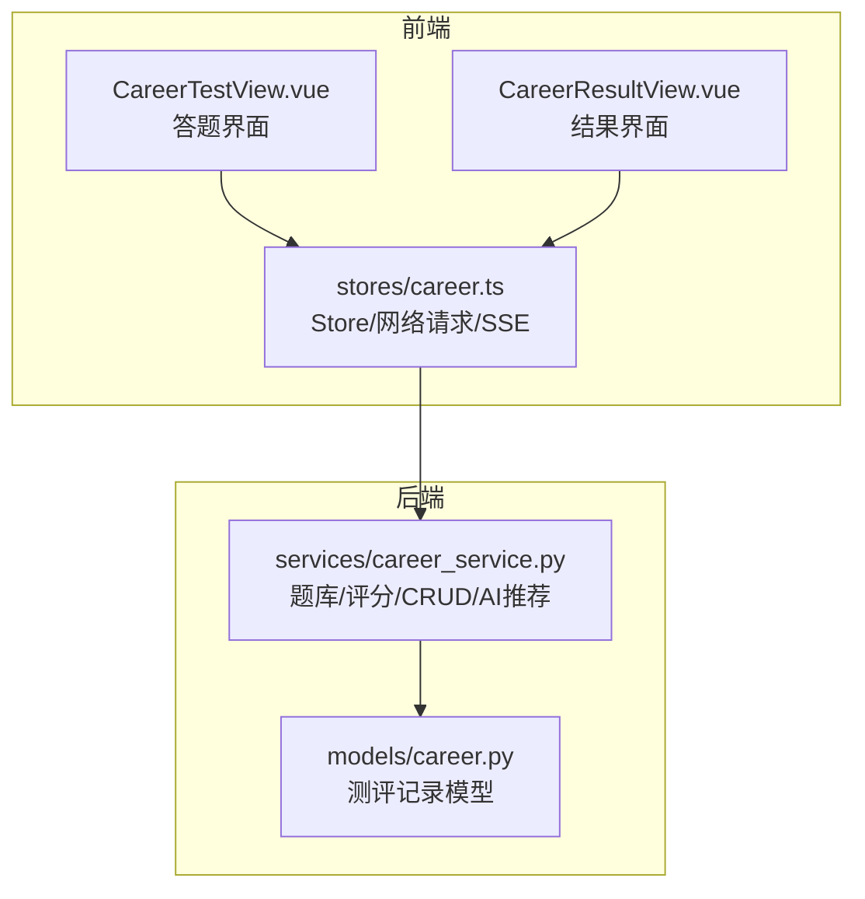
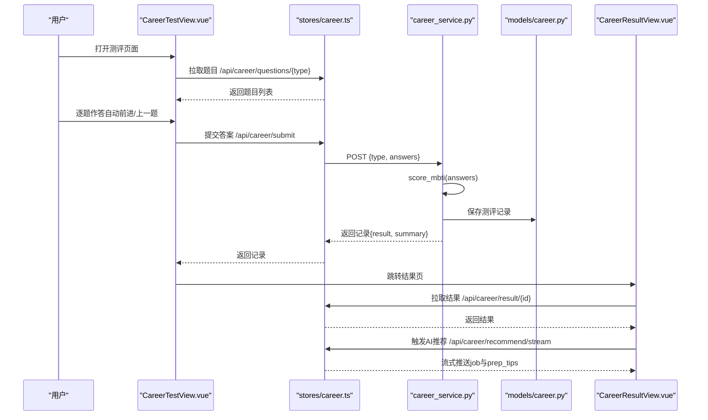
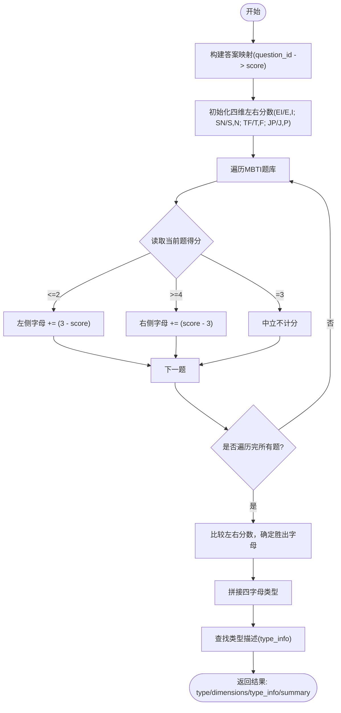
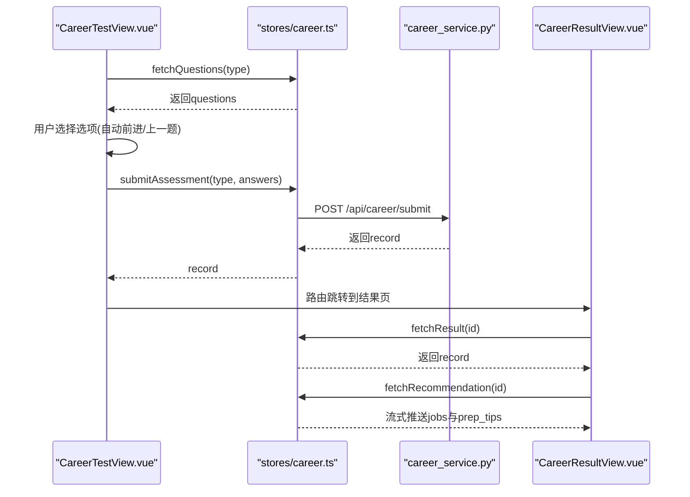
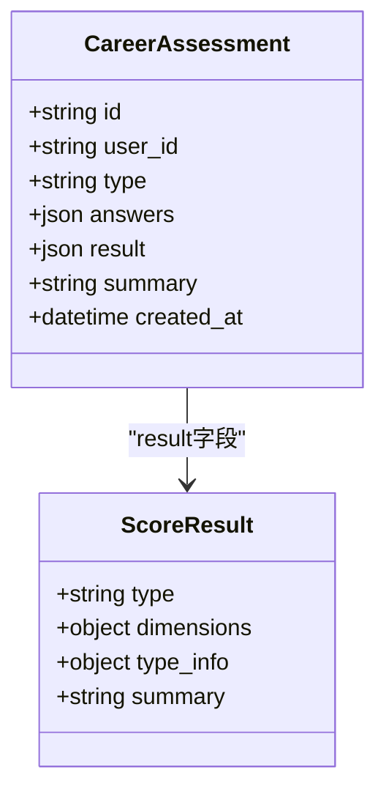
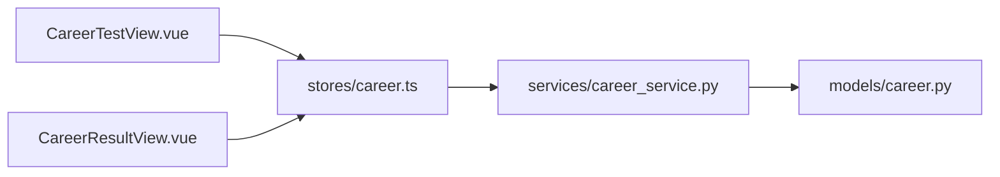

# MBTI性格测试

<cite>
**本文引用的文件**   
- [career_service.py](file://backEnd/app/services/career_service.py)
- [career.ts](file://frontEnd/src/stores/career.ts)
- [CareerTestView.vue](file://frontEnd/src/views/CareerTestView.vue)
- [CareerResultView.vue](file://frontEnd/src/views/CareerResultView.vue)
- [career.py](file://backEnd/app/models/career.py)
</cite>

## 目录
1. [简介](#简介)
2. [项目结构](#项目结构)
3. [核心组件](#核心组件)
4. [架构总览](#架构总览)
5. [详细组件分析](#详细组件分析)
6. [依赖关系分析](#依赖关系分析)
7. [性能与可扩展性](#性能与可扩展性)
8. [故障排查指南](#故障排查指南)
9. [结论](#结论)
10. [附录](#附录)

## 简介
本文件面向开发者与产品/运营人员，系统化说明 MBTI 性格测试模块的算法实现、题目设计与评分机制、前后端交互流程、结果数据结构与存储格式、类型含义与特征描述、自定义题目配置方法、用户体验优化与移动端适配要点，以及维护升级指导。MBTI 测评基于四个维度：外向/内向（E/I）、实感/直觉（S/N）、思考/情感（T/F）、判断/感知（J/P），采用 5 级李克特量表进行作答，后端按维度累加权重并判定倾向字母，最终生成四字母类型及对应描述与职业建议。

## 项目结构
- 后端服务
  - 题库定义与评分算法集中在服务层，提供统一接口返回题目与计算结果。
  - 数据库模型用于持久化测评记录与结果摘要。
- 前端应用
  - 答题页负责题目展示、选项选择、自动跳转与提交。
  - 结果页负责渲染 MBTI 双向条形图、类型卡片、优势与职业标签，并触发 AI 岗位推荐流式加载。
  - Store 封装 API 调用、状态管理与 SSE 流式解析。

图表来源
- [CareerTestView.vue:1-226](file://frontEnd/src/views/CareerTestView.vue#L1-L226)
- [CareerResultView.vue:1-561](file://frontEnd/src/views/CareerResultView.vue#L1-L561)
- [career.ts:1-223](file://frontEnd/src/stores/career.ts#L1-L223)
- [career_service.py:1-669](file://backEnd/app/services/career_service.py#L1-L669)
- [career.py:1-200](file://backEnd/app/models/career.py#L1-L200)

章节来源
- [career_service.py:1-669](file://backEnd/app/services/career_service.py#L1-L669)
- [career.ts:1-223](file://frontEnd/src/stores/career.ts#L1-L223)
- [CareerTestView.vue:1-226](file://frontEnd/src/views/CareerTestView.vue#L1-L226)
- [CareerResultView.vue:1-561](file://frontEnd/src/views/CareerResultView.vue#L1-L561)
- [career.py:1-200](file://backEnd/app/models/career.py#L1-L200)

## 核心组件
- 题库与元信息
  - MBTI 题库包含 24 题，每维度 6 题，覆盖正向与反向表述，使用“非常不同意”到“非常同意”的 5 级量表。
  - 每个问题携带 id、dimension、text、options 字段，便于前端动态渲染。
- 评分算法
  - 对每个维度分别累计左右两侧字母得分；1/2 分计入左侧字母，4/5 分计入右侧字母，3 分为中立不计分。
  - 各维度比较左右总分，取较大者为该维度的倾向字母，拼接得到四字母类型。
- 结果数据
  - 返回 type、dimensions、type_info、summary 等字段，其中 dimensions 包含每维度的左右分数与胜出字母。
- 存储与查询
  - 将 answers 与 result 序列化后存入数据库，支持按用户查询历史与按 ID 获取详情。
- 前端交互
  - 答题页逐题展示，支持上一题与自动前进；全部答完后提交至后端，跳转结果页。
  - 结果页渲染双向条形图、类型卡片、优势与职业标签，并自动发起 AI 岗位推荐流式请求。

章节来源
- [career_service.py:94-142](file://backEnd/app/services/career_service.py#L94-L142)
- [career_service.py:346-393](file://backEnd/app/services/career_service.py#L346-L393)
- [career_service.py:429-450](file://backEnd/app/services/career_service.py#L429-L450)
- [career_service.py:457-500](file://backEnd/app/services/career_service.py#L457-L500)
- [CareerTestView.vue:125-208](file://frontEnd/src/views/CareerTestView.vue#L125-L208)
- [CareerResultView.vue:261-458](file://frontEnd/src/views/CareerResultView.vue#L261-L458)
- [career.ts:94-146](file://frontEnd/src/stores/career.ts#L94-L146)

## 架构总览
MBTI 测评端到端流程如下：前端从后端拉取题目，用户作答并提交，后端根据题库与评分规则计算结果，持久化记录并返回；前端渲染结果并进行可视化展示，同时可触发 AI 岗位推荐流式输出。

图表来源
- [CareerTestView.vue:125-208](file://frontEnd/src/views/CareerTestView.vue#L125-L208)
- [career.ts:94-146](file://frontEnd/src/stores/career.ts#L94-L146)
- [career_service.py:429-450](file://backEnd/app/services/career_service.py#L429-L450)
- [career_service.py:457-500](file://backEnd/app/services/career_service.py#L457-L500)
- [CareerResultView.vue:261-458](file://frontEnd/src/views/CareerResultView.vue#L261-L458)
- [career.ts:148-207](file://frontEnd/src/stores/career.ts#L148-L207)

## 详细组件分析

### MBTI 评分算法与维度逻辑
- 维度映射
  - EI：左 E 右 I
  - SN：左 S 右 N
  - TF：左 T 右 F
  - JP：左 J 右 P
- 计分规则
  - 1/2 分计入左侧字母，分值贡献为 (3 - score)
  - 4/5 分计入右侧字母，分值贡献为 (score - 3)
  - 3 分为中立不计分
- 类型判定
  - 各维度比较左右总分，较大者胜出；若相等则按代码中比较逻辑决定（>= 时取左侧）
  - 将四个维度胜出字母拼接得到四字母类型
- 结果组装
  - 返回 type、dimensions（含 left/right/winner）、type_info（名称、描述、优势、职业建议等）、summary

图表来源
- [career_service.py:346-393](file://backEnd/app/services/career_service.py#L346-L393)

章节来源
- [career_service.py:346-393](file://backEnd/app/services/career_service.py#L346-L393)

### 题目设计与权重计算
- 题目设计原则
  - 每维度 6 题，包含正向与反向表述，避免应答偏差
  - 使用统一的 5 级李克特量表，保证可比性与稳定性
- 权重计算
  - 非等权加权：偏离中立越远，权重越大（1/2 计 1~2 分，4/5 计 1~2 分）
  - 中立项不参与维度胜负判定，降低噪声影响
- 题型覆盖
  - EI：社交能量、独处偏好、表达模式
  - SN：具体vs抽象、经验vs直觉、实用vs理论
  - TF：逻辑vs共情、公正vs人情、客观vs主观
  - JP：计划vs灵活、结构vs开放、确定vs探索

章节来源
- [career_service.py:94-142](file://backEnd/app/services/career_service.py#L94-L142)

### 前端交互流程（答题到结果）
- 答题页
  - 拉取题目、显示进度条、逐题展示
  - 点击选项即选中并高亮，延迟自动前进到下一题
  - 支持“上一题”回退，全部答完后显示提交按钮
  - 提交后将答案列表转换为后端期望格式并发送
- 结果页
  - 拉取结果，渲染类型卡片、双向条形图、优势与职业标签
  - 自动触发 AI 岗位推荐，流式接收 job 与 prep_tips

图表来源
- [CareerTestView.vue:125-208](file://frontEnd/src/views/CareerTestView.vue#L125-L208)
- [career.ts:94-146](file://frontEnd/src/stores/career.ts#L94-L146)
- [CareerResultView.vue:261-458](file://frontEnd/src/views/CareerResultView.vue#L261-L458)
- [career.ts:148-207](file://frontEnd/src/stores/career.ts#L148-L207)

章节来源
- [CareerTestView.vue:125-208](file://frontEnd/src/views/CareerTestView.vue#L125-L208)
- [CareerResultView.vue:261-458](file://frontEnd/src/views/CareerResultView.vue#L261-L458)
- [career.ts:94-146](file://frontEnd/src/stores/career.ts#L94-L146)
- [career.ts:148-207](file://frontEnd/src/stores/career.ts#L148-L207)

### 测试结果数据结构与存储格式
- 结果结构（后端返回）
  - type：四字母类型字符串
  - dimensions：每维度左右分数与胜出字母
  - type_info：类型名称、描述、优势、职业建议、认知功能等
  - summary：人类可读的总结语句
- 存储格式（数据库）
  - 记录包含 user_id、type、answers（JSON）、result（JSON）、summary、created_at 等字段
  - 支持按用户查询历史记录与按 ID 获取单条记录

图表来源
- [career_service.py:457-500](file://backEnd/app/services/career_service.py#L457-L500)
- [career_service.py:346-393](file://backEnd/app/services/career_service.py#L346-L393)
- [career.py:1-200](file://backEnd/app/models/career.py#L1-L200)

章节来源
- [career_service.py:457-500](file://backEnd/app/services/career_service.py#L457-L500)
- [career_service.py:346-393](file://backEnd/app/services/career_service.py#L346-L393)
- [career.py:1-200](file://backEnd/app/models/career.py#L1-L200)

### 四种字母类型的含义与特征描述
- 类型信息来源于后端常量字典，包含名称、描述、优势、职业建议与认知功能栈
- 前端在结果页根据 type 匹配本地 SVG 插图资源，增强可视化体验
- 示例路径参考：
  - 类型描述字典定义与服务层引用
  - 前端类型卡片与插图映射

章节来源
- [career_service.py:254-271](file://backEnd/app/services/career_service.py#L254-L271)
- [CareerResultView.vue:344-362](file://frontEnd/src/views/CareerResultView.vue#L344-L362)

### 自定义题目配置与扩展指南
- 新增维度或题目
  - 在题库常量中添加 QuestionItem，指定 dimension、text、options
  - 确保每维度题目数量均衡，包含正向与反向表述
- 调整评分规则
  - 修改 score_mbti 中的计分映射与权重计算逻辑
  - 如需引入更复杂的权重（如因子载荷、信度系数），可在服务层扩展
- 扩展类型描述
  - 在类型描述字典中补充新类型的 name、desc、strengths、careers、cognitive_functions
- 前端适配
  - 若维度或选项变化，需同步更新前端渲染逻辑与图表配置
  - 对于新的类型图标资源，需在结果页映射表中添加

章节来源
- [career_service.py:94-142](file://backEnd/app/services/career_service.py#L94-L142)
- [career_service.py:346-393](file://backEnd/app/services/career_service.py#L346-L393)
- [career_service.py:254-271](file://backEnd/app/services/career_service.py#L254-L271)
- [CareerResultView.vue:344-362](file://frontEnd/src/views/CareerResultView.vue#L344-L362)

### 用户体验优化与移动端适配
- 交互体验
  - 自动前进减少操作步骤，提升流畅度
  - 上一题按钮允许回退修正，降低误选成本
  - 进度条与已答题数提示增强掌控感
- 视觉与动效
  - 选中态高亮与微动效反馈明确
  - 结果页双向条形图直观展示维度倾向
- 移动端适配
  - 响应式布局与触摸友好的大按钮
  - 图表自适应容器尺寸，避免溢出
  - 字体与间距在窄屏下保持可读性

章节来源
- [CareerTestView.vue:125-208](file://frontEnd/src/views/CareerTestView.vue#L125-L208)
- [CareerResultView.vue:261-458](file://frontEnd/src/views/CareerResultView.vue#L261-L458)

## 依赖关系分析
- 前端依赖
  - CareerTestView.vue 依赖 stores/career.ts 进行数据获取与提交
  - CareerResultView.vue 依赖 stores/career.ts 拉取结果与流式推荐
- 后端依赖
  - career_service.py 依赖 models/career.py 进行数据持久化
  - 评分函数依赖题库常量与类型描述常量

图表来源
- [CareerTestView.vue:125-208](file://frontEnd/src/views/CareerTestView.vue#L125-L208)
- [CareerResultView.vue:261-458](file://frontEnd/src/views/CareerResultView.vue#L261-L458)
- [career.ts:94-146](file://frontEnd/src/stores/career.ts#L94-L146)
- [career_service.py:429-450](file://backEnd/app/services/career_service.py#L429-L450)
- [career.py:1-200](file://backEnd/app/models/career.py#L1-L200)

章节来源
- [CareerTestView.vue:125-208](file://frontEnd/src/views/CareerTestView.vue#L125-L208)
- [CareerResultView.vue:261-458](file://frontEnd/src/views/CareerResultView.vue#L261-L458)
- [career.ts:94-146](file://frontEnd/src/stores/career.ts#L94-L146)
- [career_service.py:429-450](file://backEnd/app/services/career_service.py#L429-L450)
- [career.py:1-200](file://backEnd/app/models/career.py#L1-L200)

## 性能与可扩展性
- 性能特性
  - 评分算法为线性扫描题库，时间复杂度 O(n)，n 为题目数量（24），开销极低
  - 结果渲染以轻量 SVG/Canvas 为主，移动端友好
- 可扩展性
  - 题库与类型描述以常量形式组织，易于增删改
  - 评分函数可按需扩展为更复杂的统计模型或机器学习打分
  - 前端 Store 抽象了网络请求与错误处理，便于接入更多测评类型

[本节为通用指导，不直接分析具体文件]

## 故障排查指南
- 常见问题
  - 题目未加载：检查前端是否正确调用 questions 接口与后端路由是否注册
  - 提交失败：确认 answers 格式是否符合后端期望（question_id、score）
  - 结果页空白：核对 result 字段结构与前端解析逻辑
  - 流式推荐失败：检查 SSE 流解析与错误重试逻辑
- 定位建议
  - 查看浏览器控制台与网络面板的错误信息
  - 在后端日志中检索相关请求与异常堆栈
  - 使用最小数据集复现问题，逐步缩小范围

章节来源
- [career.ts:148-207](file://frontEnd/src/stores/career.ts#L148-L207)
- [career_service.py:429-450](file://backEnd/app/services/career_service.py#L429-L450)

## 结论
MBTI 测评模块通过清晰的题库组织、稳健的评分算法与良好的前后端协作，实现了完整的测评体验。其数据结构与存储格式规范，便于后续扩展与维护。建议在持续迭代中关注题目质量评估（信度/效度）、用户行为分析与个性化推荐能力，以提升整体效果与用户满意度。

[本节为总结性内容，不直接分析具体文件]

## 附录
- 关键实现路径参考
  - 题库定义与评分函数：[career_service.py:94-142](file://backEnd/app/services/career_service.py#L94-L142)、[career_service.py:346-393](file://backEnd/app/services/career_service.py#L346-L393)
  - 结果持久化与查询：[career_service.py:457-500](file://backEnd/app/services/career_service.py#L457-L500)
  - 前端答题与提交：[CareerTestView.vue:125-208](file://frontEnd/src/views/CareerTestView.vue#L125-L208)
  - 前端结果渲染与流式推荐：[CareerResultView.vue:261-458](file://frontEnd/src/views/CareerResultView.vue#L261-L458)、[career.ts:148-207](file://frontEnd/src/stores/career.ts#L148-L207)
  - 类型描述与前端映射：[career_service.py:254-271](file://backEnd/app/services/career_service.py#L254-L271)、[CareerResultView.vue:344-362](file://frontEnd/src/views/CareerResultView.vue#L344-L362)