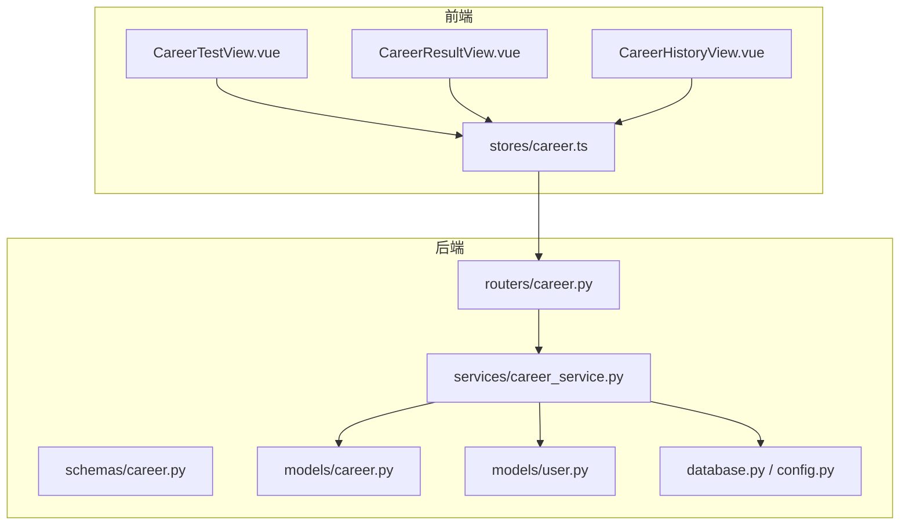
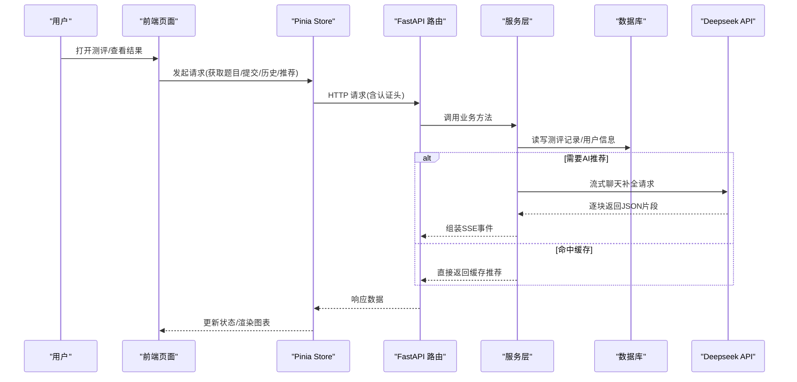
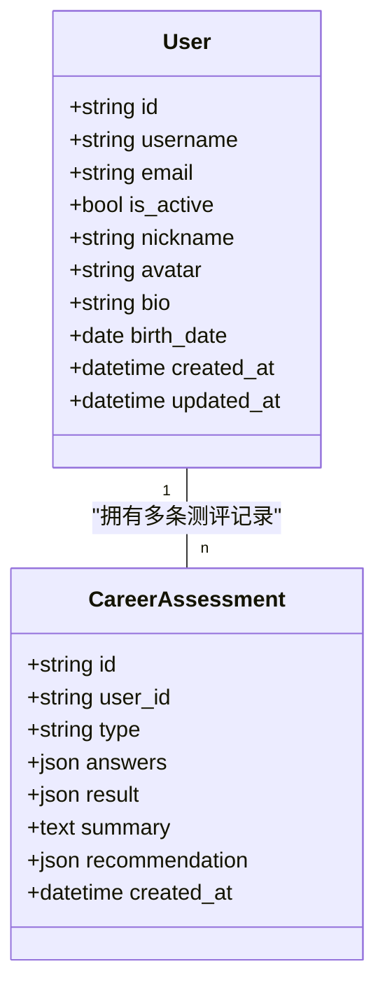
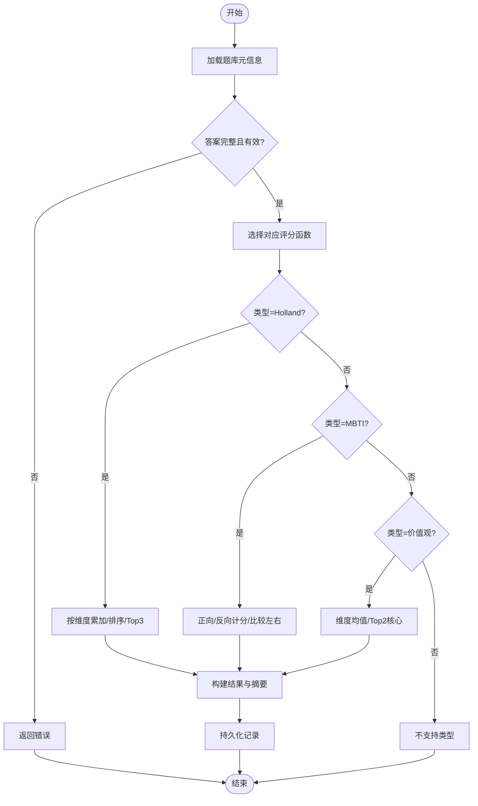
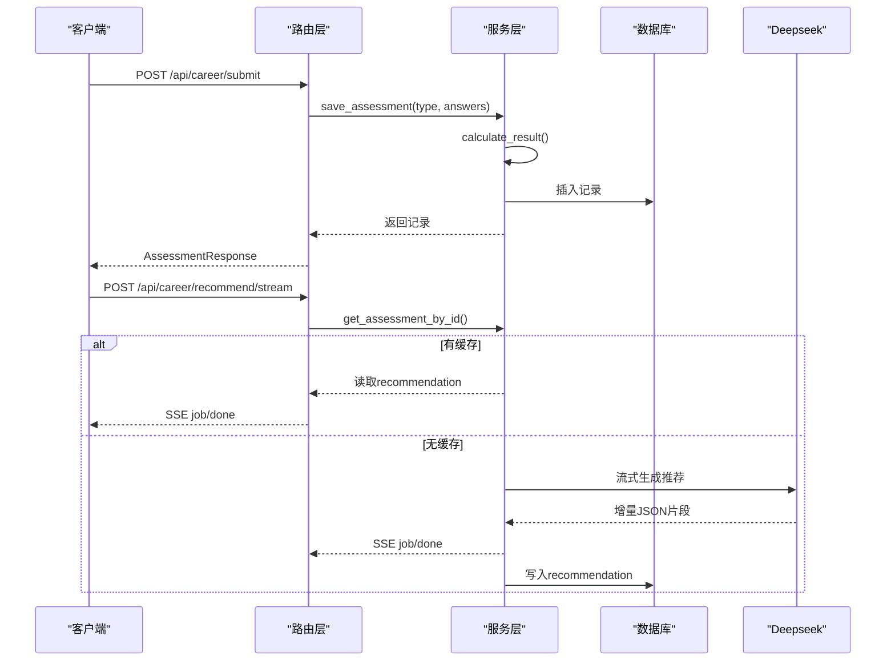
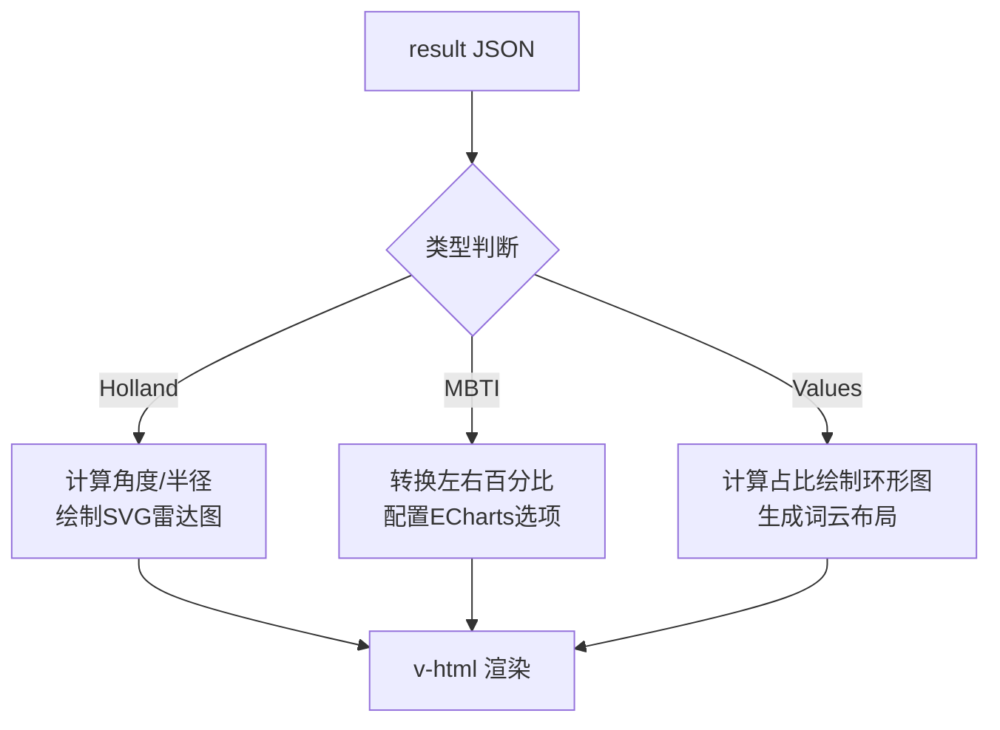
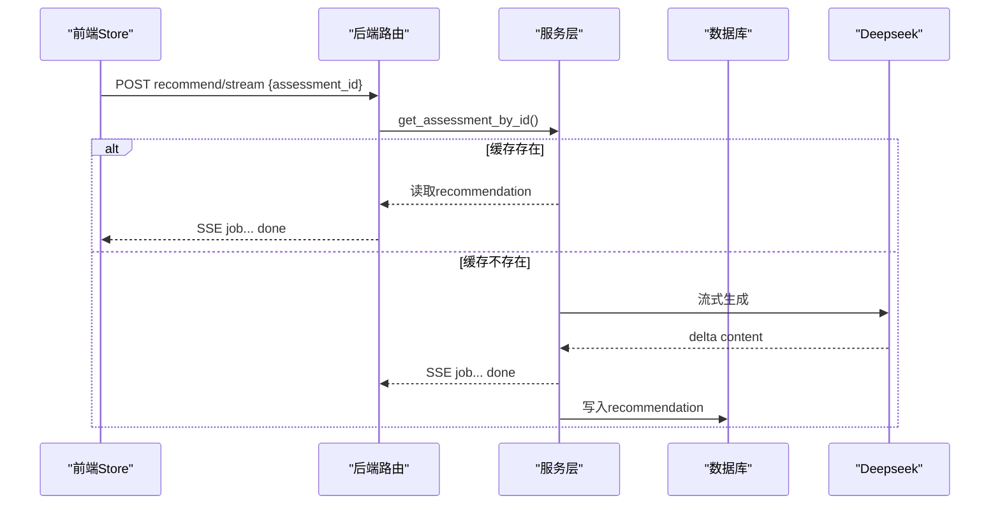
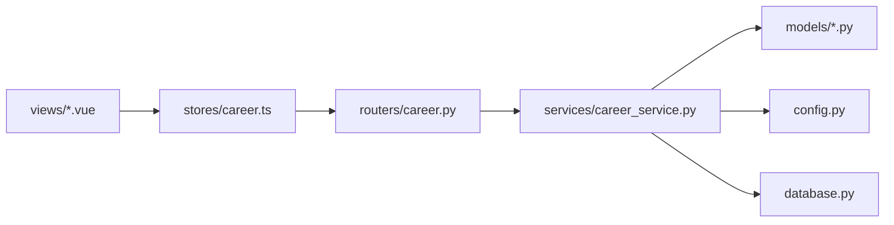

# 技能评估系统

<cite>
**本文引用的文件**   
- [career.py](file://backEnd/app/models/career.py)
- [user.py](file://backEnd/app/models/user.py)
- [career.py](file://backEnd/app/routers/career.py)
- [career_service.py](file://backEnd/app/services/career_service.py)
- [career.py](file://backEnd/app/schemas/career.py)
- [config.py](file://backEnd/app/config.py)
- [database.py](file://backEnd/app/database.py)
- [career.ts](file://frontEnd/src/stores/career.ts)
- [CareerTestView.vue](file://frontEnd/src/views/CareerTestView.vue)
- [CareerResultView.vue](file://frontEnd/src/views/CareerResultView.vue)
- [CareerHistoryView.vue](file://frontEnd/src/views/CareerHistoryView.vue)
</cite>

## 目录
1. [简介](#简介)
2. [项目结构](#项目结构)
3. [核心组件](#核心组件)
4. [架构总览](#架构总览)
5. [详细组件分析](#详细组件分析)
6. [依赖关系分析](#依赖关系分析)
7. [性能与可扩展性](#性能与可扩展性)
8. [故障排查指南](#故障排查指南)
9. [结论](#结论)
10. [附录：维护与升级指南](#附录维护与升级指南)

## 简介
本系统提供多维度职业测评与个性化岗位推荐能力，涵盖 Holland RIASEC、MBTI、职业价值观三大测评模型。后端基于 FastAPI + SQLAlchemy 异步 ORM，前端采用 Vue 3 + Pinia + ECharts/SVG 可视化。系统支持：
- 题库定义与评分算法（Holland/MBTI/价值观）
- 测评提交、结果持久化与历史查询
- AI 岗位匹配推荐（SSE 流式），并缓存至数据库
- 前端答题交互、结果可视化（雷达图、双向条形图、环形图/词云）
- 测评历史查看与趋势对比基础能力

## 项目结构
- 后端
  - 路由层：REST API 暴露题目获取、提交、历史、详情、AI 推荐等接口
  - 服务层：题库元数据、评分算法、CRUD、AI 推荐流式生成
  - 模型层：测评记录、用户信息
  - 配置与数据库：连接池、会话工厂、环境变量
- 前端
  - Store：统一状态管理与网络请求封装
  - 视图：测评答题页、结果展示页、历史记录页
  - 可视化：SVG/ECharts 渲染多维结果

图表来源
- [career.py:1-158](file://backEnd/app/routers/career.py#L1-L158)
- [career_service.py:1-669](file://backEnd/app/services/career_service.py#L1-L669)
- [career.py:1-59](file://backEnd/app/schemas/career.py#L1-L59)
- [career.py:1-56](file://backEnd/app/models/career.py#L1-L56)
- [user.py:1-45](file://backEnd/app/models/user.py#L1-L45)
- [database.py:1-58](file://backEnd/app/database.py#L1-L58)
- [config.py:1-71](file://backEnd/app/config.py#L1-L71)
- [CareerTestView.vue:1-226](file://frontEnd/src/views/CareerTestView.vue#L1-L226)
- [CareerResultView.vue:1-561](file://frontEnd/src/views/CareerResultView.vue#L1-L561)
- [CareerHistoryView.vue:1-152](file://frontEnd/src/views/CareerHistoryView.vue#L1-L152)
- [career.ts:1-223](file://frontEnd/src/stores/career.ts#L1-L223)

章节来源
- [career.py:1-158](file://backEnd/app/routers/career.py#L1-L158)
- [career_service.py:1-669](file://backEnd/app/services/career_service.py#L1-L669)
- [career.py:1-59](file://backEnd/app/schemas/career.py#L1-L59)
- [career.py:1-56](file://backEnd/app/models/career.py#L1-L56)
- [user.py:1-45](file://backEnd/app/models/user.py#L1-L45)
- [database.py:1-58](file://backEnd/app/database.py#L1-L58)
- [config.py:1-71](file://backEnd/app/config.py#L1-L71)
- [CareerTestView.vue:1-226](file://frontEnd/src/views/CareerTestView.vue#L1-L226)
- [CareerResultView.vue:1-561](file://frontEnd/src/views/CareerResultView.vue#L1-L561)
- [CareerHistoryView.vue:1-152](file://frontEnd/src/views/CareerHistoryView.vue#L1-L152)
- [career.ts:1-223](file://frontEnd/src/stores/career.ts#L1-L223)

## 核心组件
- 题库与评分引擎
  - Holland RIASEC：六维度兴趣偏好，按题项累加得分，取 Top3 组合为代码，附带类型描述与职业建议
  - MBTI：四维度（EI/SN/TF/JP），正向/反向计分，左右侧分数比较得出类型与倾向百分比
  - 职业价值观：六大维度重要性均值排序，Top2 为核心价值观
- 数据模型与存储
  - 测评记录表包含用户 ID、类型、原始答案 JSON、结构化结果 JSON、摘要文本、AI 推荐缓存 JSON、创建时间
  - 用户表包含基础信息与个人资料字段
- 接口与服务
  - 获取题目、提交答案计算结果、查询历史、查询单条结果、AI 岗位推荐（SSE 流式）
  - 推荐结果可缓存，命中则直接推送，未命中则调用 Deepseek 流式生成并落库
- 前端交互与可视化
  - 答题页：进度条、自动跳转、返回上一题、提交校验
  - 结果页：Holland 雷达图（SVG）、MBTI 双向条形图（ECharts）、价值观环形图/词云（SVG）
  - 历史页：列表展示、快捷入口、结果摘要

章节来源
- [career_service.py:25-450](file://backEnd/app/services/career_service.py#L25-L450)
- [career.py:11-56](file://backEnd/app/models/career.py#L11-L56)
- [career.py:19-158](file://backEnd/app/routers/career.py#L19-L158)
- [CareerTestView.vue:125-208](file://frontEnd/src/views/CareerTestView.vue#L125-L208)
- [CareerResultView.vue:261-561](file://frontEnd/src/views/CareerResultView.vue#L261-L561)
- [CareerHistoryView.vue:100-152](file://frontEnd/src/views/CareerHistoryView.vue#L100-L152)
- [career.ts:82-223](file://frontEnd/src/stores/career.ts#L82-L223)

## 架构总览
系统采用前后端分离架构，前端通过 REST 与 SSE 与后端通信；后端以 FastAPI 路由分发到服务层，服务层负责业务逻辑、评分算法与外部 AI 调用，并通过 SQLAlchemy 异步会话访问数据库。

图表来源
- [career.py:96-158](file://backEnd/app/routers/career.py#L96-L158)
- [career_service.py:568-669](file://backEnd/app/services/career_service.py#L568-L669)
- [career.ts:148-207](file://frontEnd/src/stores/career.ts#L148-L207)

## 详细组件分析

### 数据模型与存储设计
- 测评记录 CareerAssessment
  - 主键 UUID，用户外键，类型枚举，原始答案 JSON，结构化结果 JSON，摘要文本，AI 推荐缓存 JSON，创建时间
  - 索引：user_id、type 便于快速检索与分页
- 用户 User
  - 基础认证字段与个人资料扩展字段，用于头像、昵称、性别、生日等

图表来源
- [user.py:10-45](file://backEnd/app/models/user.py#L10-L45)
- [career.py:11-56](file://backEnd/app/models/career.py#L11-L56)

章节来源
- [career.py:11-56](file://backEnd/app/models/career.py#L11-L56)
- [user.py:10-45](file://backEnd/app/models/user.py#L10-L45)

### 题库与评分算法
- Holland RIASEC
  - 量表：5级喜好（非常不喜欢→非常喜欢）
  - 计分：按维度累加，排序取 Top3 作为 Holland 代码，输出各维度得分、Top3 详情与摘要
- MBTI
  - 量表：5级同意度（非常不同意→非常同意）
  - 计分：正向题低分偏左字母、高分偏右字母；反向题同理；中立不计分；比较左右得分决定倾向与百分比
- 职业价值观
  - 量表：5级重要性（非常不重要→非常重要）
  - 计分：按维度求均值，排序取 Top2 为核心价值观，输出维度均分与详情

图表来源
- [career_service.py:319-450](file://backEnd/app/services/career_service.py#L319-L450)

章节来源
- [career_service.py:54-207](file://backEnd/app/services/career_service.py#L54-L207)
- [career_service.py:319-450](file://backEnd/app/services/career_service.py#L319-L450)

### 接口设计与流程
- GET /api/career/questions/{assessment_type}
  - 返回指定类型题目的标题、描述与题目列表
- POST /api/career/submit
  - 接收类型与答案列表，计算结果并保存，返回结构化结果与摘要
- GET /api/career/history
  - 返回当前用户的测评历史（按创建时间倒序）
- GET /api/career/result/{assessment_id}
  - 返回单条测评详情
- POST /api/career/recommend/stream
  - SSE 流式返回 AI 岗位匹配推荐，优先使用缓存；无缓存则调用 Deepseek 并落库

图表来源
- [career.py:29-158](file://backEnd/app/routers/career.py#L29-L158)
- [career_service.py:457-669](file://backEnd/app/services/career_service.py#L457-L669)

章节来源
- [career.py:19-158](file://backEnd/app/routers/career.py#L19-L158)
- [career_service.py:429-669](file://backEnd/app/services/career_service.py#L429-L669)

### 前端可视化实现
- Holland 雷达图（SVG）
  - 根据 scores 动态计算角度与半径，绘制网格、轴线、数据多边形与标签
- MBTI 双向条形图（ECharts）
  - 将 EI/SN/TF/JP 四个维度的左右得分转换为百分比，分别绘制左右柱状图，带 Tooltip 与颜色映射
- 价值观环形图/词云（SVG）
  - 环形图按维度均分占比绘制扇形，中心标注“核心价值观”；词云按分值大小自适应字号与行布局

图表来源
- [CareerResultView.vue:293-542](file://frontEnd/src/views/CareerResultView.vue#L293-L542)

章节来源
- [CareerResultView.vue:261-561](file://frontEnd/src/views/CareerResultView.vue#L261-L561)

### 个性化岗位推荐机制
- 输入
  - 测评类型、结果摘要、详细数据（由服务层格式化）
  - 可选简历技能关键词（从用户简历中获取）
- 处理
  - 构造提示词，调用 Deepseek 流式补全
  - 解析增量 JSON，提取 jobs 数组与 prep_tips
  - 首次完成后写入 recommendation 缓存
- 输出
  - SSE 事件：job 类型逐步推送，done 类型携带 prep_tips 与总数
  - 后续请求命中缓存直接推送

图表来源
- [career.py:96-158](file://backEnd/app/routers/career.py#L96-L158)
- [career_service.py:568-669](file://backEnd/app/services/career_service.py#L568-L669)
- [career.ts:148-207](file://frontEnd/src/stores/career.ts#L148-L207)

章节来源
- [career.py:96-158](file://backEnd/app/routers/career.py#L96-L158)
- [career_service.py:507-669](file://backEnd/app/services/career_service.py#L507-L669)
- [career.ts:148-207](file://frontEnd/src/stores/career.ts#L148-L207)

### 自定义技能模板与扩展指南
- 新增测评类型
  - 在题库元信息中添加新类型条目（标题、描述、题目列表）
  - 实现对应评分函数，返回结构化结果与摘要
  - 在路由层注册新的题目获取与提交处理分支
  - 前端增加对应题型的数据绑定与可视化渲染
- 扩展维度与等级
  - 在量表选项中扩展等级或标签
  - 在评分函数中调整维度聚合与排名逻辑
- 扩展推荐策略
  - 修改提示词模板，增强岗位匹配规则
  - 增加更多外部数据源（如行业薪资、岗位要求）

章节来源
- [career_service.py:191-207](file://backEnd/app/services/career_service.py#L191-L207)
- [career_service.py:429-450](file://backEnd/app/services/career_service.py#L429-L450)
- [career.py:20-52](file://backEnd/app/routers/career.py#L20-L52)
- [CareerResultView.vue:261-561](file://frontEnd/src/views/CareerResultView.vue#L261-L561)

### 趋势分析与对比功能
- 现状
  - 历史接口返回按时间倒序的测评记录，包含结果与摘要
  - 前端历史页展示类型、时间与简要结果
- 扩展建议
  - 在后端增加趋势聚合接口（如按周/月汇总 Holland 维度均值、MBTI 维度变化）
  - 在前端增加折线图/堆叠图对比多次测评结果差异
  - 引入目标岗位画像，进行差距分析并生成发展建议

章节来源
- [career.py:55-72](file://backEnd/app/routers/career.py#L55-L72)
- [CareerHistoryView.vue:100-152](file://frontEnd/src/views/CareerHistoryView.vue#L100-L152)

## 依赖关系分析
- 模块耦合
  - 路由层仅依赖服务层与 Pydantic 模式，职责清晰
  - 服务层集中实现题库、评分、CRUD 与 AI 推荐，内聚度高
  - 前端 Store 封装通用请求与 SSE 解析，视图层专注渲染
- 外部依赖
  - httpx 用于 Deepseek 流式请求
  - ECharts 用于 MBTI 双向条形图
  - SVG 原生绘制 Holland 雷达图与价值观环形图/词云

图表来源
- [career.py:1-158](file://backEnd/app/routers/career.py#L1-L158)
- [career_service.py:1-669](file://backEnd/app/services/career_service.py#L1-L669)
- [career.ts:1-223](file://frontEnd/src/stores/career.ts#L1-L223)
- [CareerTestView.vue:1-226](file://frontEnd/src/views/CareerTestView.vue#L1-L226)
- [CareerResultView.vue:1-561](file://frontEnd/src/views/CareerResultView.vue#L1-L561)
- [CareerHistoryView.vue:1-152](file://frontEnd/src/views/CareerHistoryView.vue#L1-L152)

章节来源
- [career.py:1-158](file://backEnd/app/routers/career.py#L1-L158)
- [career_service.py:1-669](file://backEnd/app/services/career_service.py#L1-L669)
- [career.ts:1-223](file://frontEnd/src/stores/career.ts#L1-L223)

## 性能与可扩展性
- 数据库
  - 使用异步引擎与会话工厂，连接池参数可调（pool_size、max_overflow）
  - 对 user_id 与 type 建立索引，提升查询效率
- 推荐缓存
  - 命中缓存直接推送，避免重复 AI 调用
  - 首次生成后落库，保证一致性
- 流式传输
  - SSE 增量推送，降低首屏延迟，提升用户体验
- 前端渲染
  - SVG 轻量高效，适合静态图表；ECharts 按需引入组件减少体积

[本节为通用指导，不直接分析具体文件]

## 故障排查指南
- 常见错误
  - 未配置 Deepseek API Key：推荐接口返回 400，需在 .env 设置 DEEPSEEK_API_KEY
  - 测评记录不存在：返回 404，检查 assessment_id 与用户权限
  - 答案无效：返回 400，检查 question_id 与 score 范围
- 定位步骤
  - 检查路由日志与异常抛出位置
  - 确认数据库连接与索引是否正常
  - 验证 SSE 流是否被浏览器正确解析
  - 核对前端 Store 的错误处理与重试逻辑

章节来源
- [career.py:96-158](file://backEnd/app/routers/career.py#L96-L158)
- [career_service.py:429-450](file://backEnd/app/services/career_service.py#L429-L450)
- [career.ts:13-20](file://frontEnd/src/stores/career.ts#L13-L20)

## 结论
该系统实现了多维度职业测评与个性化岗位推荐的闭环，具备清晰的模块化架构、高效的流式推荐与丰富的可视化呈现。通过合理的评分算法与缓存策略，系统在准确性与性能之间取得平衡。未来可在趋势分析、目标岗位差距评估与更多可视化维度上持续演进。

[本节为总结性内容，不直接分析具体文件]

## 附录：维护与升级指南
- 环境配置
  - 数据库连接、JWT、CORS、Deepseek API 均在配置文件中管理，生产环境需替换敏感值
- 版本迁移
  - 使用 Alembic 管理数据库变更，新增字段或表时生成迁移脚本
- 扩展开发
  - 新增测评类型遵循“题库元信息 + 评分函数 + 路由分支 + 前端渲染”的流程
  - 推荐策略可通过提示词模板与外部数据源灵活调整
- 监控与日志
  - 建议在路由与服务层增加关键路径日志，便于追踪问题与性能瓶颈

章节来源
- [config.py:1-71](file://backEnd/app/config.py#L1-L71)
- [database.py:1-58](file://backEnd/app/database.py#L1-L58)
- [career_service.py:429-669](file://backEnd/app/services/career_service.py#L429-L669)
- [career.py:1-158](file://backEnd/app/routers/career.py#L1-L158)