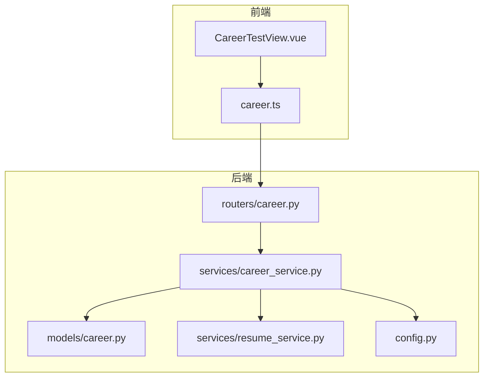
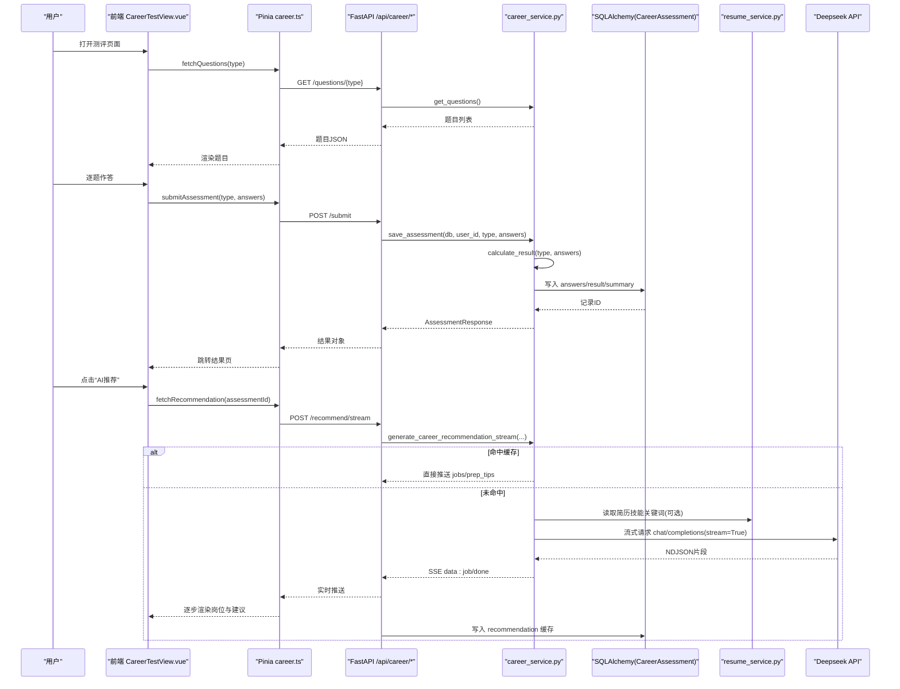
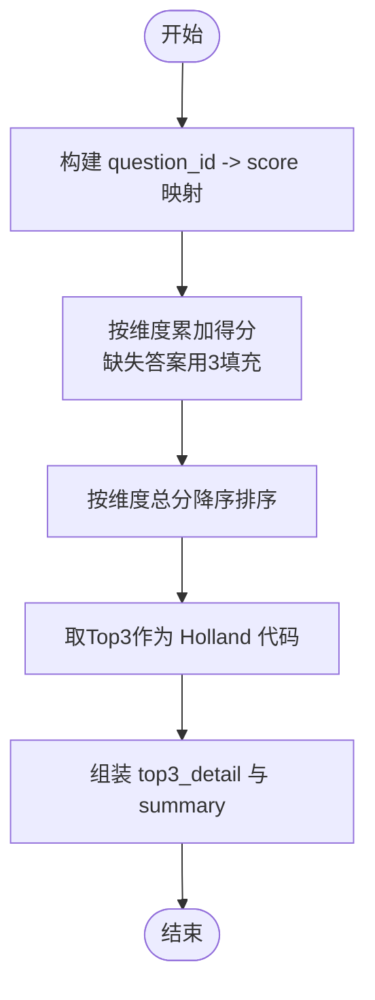
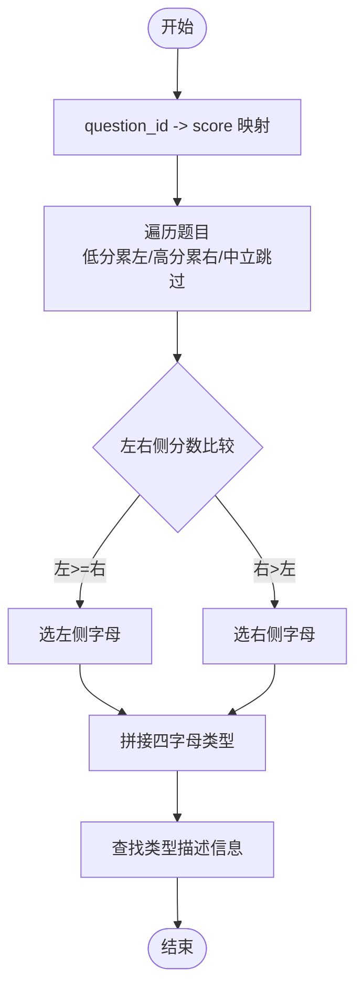
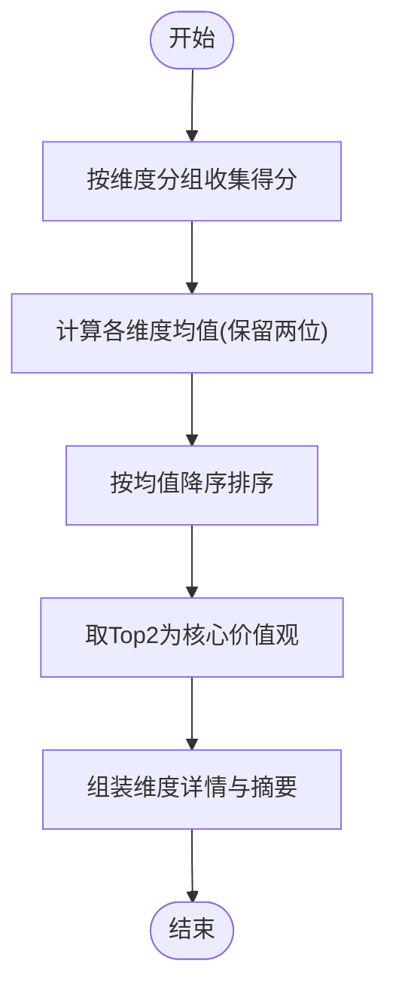
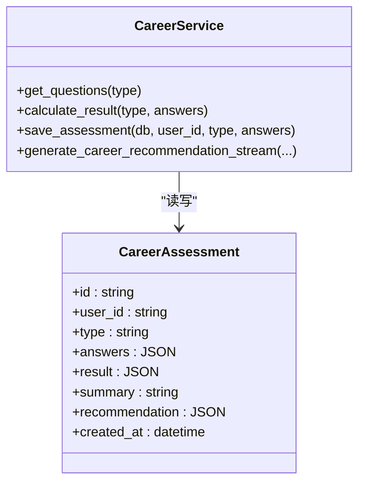
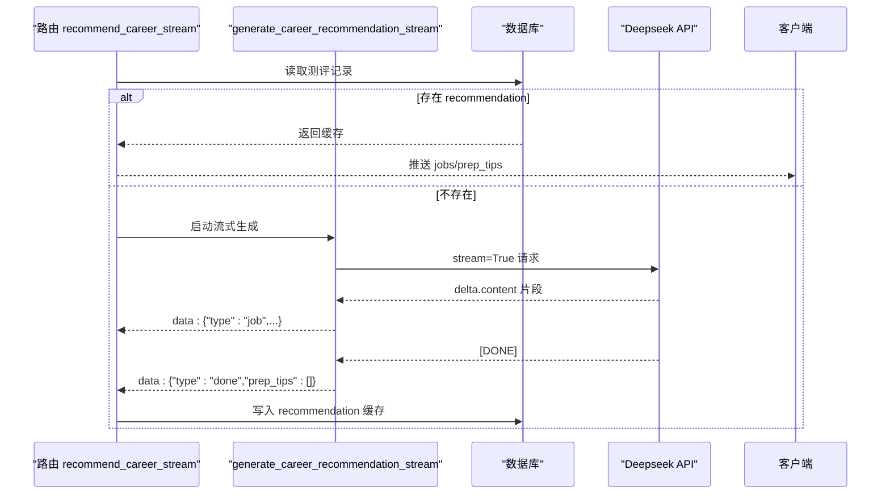
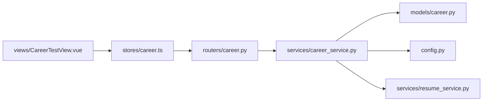

# 测评算法实现

<cite>
**本文引用的文件**
- [career_service.py](file://backEnd/app/services/career_service.py)
- [career.py](file://backEnd/app/models/career.py)
- [career.py](file://backEnd/app/routers/career.py)
- [career.py](file://backEnd/app/schemas/career.py)
- [resume_service.py](file://backEnd/app/services/resume_service.py)
- [resume.py](file://backEnd/app/models/resume.py)
- [config.py](file://backEnd/app/config.py)
- [interview_service.py](file://backEnd/app/services/interview_service.py)
- [CareerTestView.vue](file://frontEnd/src/views/CareerTestView.vue)
- [career.ts](file://frontEnd/src/stores/career.ts)
</cite>

## 目录
1. [引言](#引言)
2. [项目结构](#项目结构)
3. [核心组件](#核心组件)
4. [架构总览](#架构总览)
5. [详细组件分析](#详细组件分析)
6. [依赖关系分析](#依赖关系分析)
7. [性能与优化](#性能与优化)
8. [故障排查指南](#故障排查指南)
9. [结论](#结论)
10. [附录](#附录)

## 引言
本文件系统化梳理“测评算法”的实现，覆盖加权评分、维度聚合、AI岗位匹配推荐等核心逻辑；说明从原始答案到结构化结果的转换流程；解释数据标准化与异常值处理策略；给出性能优化（缓存、流式、异步）、验证测试方法、版本管理与回滚建议，以及面向开发者的维护升级指导。

## 项目结构
后端采用 FastAPI + SQLAlchemy 异步模型，前端使用 Vue + Pinia。测评相关的关键路径：
- 路由层：/api/career/* 暴露题目获取、提交、历史、结果详情、AI推荐流式接口
- 服务层：career_service.py 承载题库定义、评分算法、数据库CRUD、AI推荐流式生成
- 模型层：career.py 存储测评记录（含原始答案、计算结果、摘要、AI推荐缓存）
- 配置层：config.py 提供 Deepseek API 配置
- 简历服务：resume_service.py 提供技能关键词提取，辅助个性化推荐
- 前端：CareerTestView.vue 答题交互，career.ts 状态管理与SSE消费

图表来源
- [career.py:1-158](file://backEnd/app/routers/career.py#L1-L158)
- [career_service.py:1-669](file://backEnd/app/services/career_service.py#L1-L669)
- [career.py:1-56](file://backEnd/app/models/career.py#L1-L56)
- [resume_service.py:1-285](file://backEnd/app/services/resume_service.py#L1-L285)
- [config.py:1-71](file://backEnd/app/config.py#L1-L71)
- [CareerTestView.vue:1-226](file://frontEnd/src/views/CareerTestView.vue#L1-L226)
- [career.ts:1-223](file://frontEnd/src/stores/career.ts#L1-L223)

章节来源
- [career.py:1-158](file://backEnd/app/routers/career.py#L1-L158)
- [career_service.py:1-669](file://backEnd/app/services/career_service.py#L1-L669)
- [career.py:1-56](file://backEnd/app/models/career.py#L1-L56)
- [resume_service.py:1-285](file://backEnd/app/services/resume_service.py#L1-L285)
- [config.py:1-71](file://backEnd/app/config.py#L1-L71)
- [CareerTestView.vue:1-226](file://frontEnd/src/views/CareerTestView.vue#L1-L226)
- [career.ts:1-223](file://frontEnd/src/stores/career.ts#L1-L223)

## 核心组件
- 题库与量表定义：Holland RIASEC、MBTI、职业价值观三套量表，统一为 QuestionItem 结构，选项为 Likert 5级
- 评分引擎：按维度累加得分、排序取TopN、生成类型码与摘要
- 结果持久化：answers/result/summary/recommendation 字段分别保存原始答案、结构化结果、摘要、AI推荐缓存
- AI推荐：基于测评结果+可选简历技能关键词，调用Deepseek流式返回岗位匹配与准备建议，并落库缓存
- 前端交互：逐题选择、自动跳转、提交后展示结果与AI推荐流

章节来源
- [career_service.py:54-207](file://backEnd/app/services/career_service.py#L54-L207)
- [career.py:11-56](file://backEnd/app/models/career.py#L11-L56)
- [career.py:96-158](file://backEnd/app/routers/career.py#L96-L158)
- [career.ts:148-207](file://frontEnd/src/stores/career.ts#L148-L207)

## 架构总览
整体数据流：前端加载题目 → 用户作答 → 提交至后端 → 服务层计算结果 → 写入数据库 → 前端展示结果 → 触发AI推荐（SSE流式）→ 解析jobs与prep_tips → 缓存结果以便下次快速返回。

图表来源
- [career.py:20-158](file://backEnd/app/routers/career.py#L20-L158)
- [career_service.py:429-669](file://backEnd/app/services/career_service.py#L429-L669)
- [resume_service.py:1-285](file://backEnd/app/services/resume_service.py#L1-L285)
- [career.ts:148-207](file://frontEnd/src/stores/career.ts#L148-L207)
- [CareerTestView.vue:190-208](file://frontEnd/src/views/CareerTestView.vue#L190-L208)

## 详细组件分析

### 1) Holland RIASEC 评分算法
- 维度：R/I/A/S/E/C，每维度4题，共24题
- 计分：对每个维度内题目得分求和，默认缺失答案为3（中立）
- 排序：按维度总分降序，取Top3构成 Holland 代码
- 输出：scores/holland_code/top3_detail/summary

图表来源
- [career_service.py:318-344](file://backEnd/app/services/career_service.py#L318-L344)

章节来源
- [career_service.py:54-92](file://backEnd/app/services/career_service.py#L54-L92)
- [career_service.py:318-344](file://backEnd/app/services/career_service.py#L318-L344)

### 2) MBTI 评分算法
- 维度：EI/SN/TF/JP，每维度6题（正向3+反向3）
- 计分规则：1/2偏向左侧字母，4/5偏向右侧字母，3不计分；差值累加
- 判定：左右侧分数比较决定维度字母，组合得到四字母类型
- 输出：type/dimensions/type_info/summary

图表来源
- [career_service.py:345-394](file://backEnd/app/services/career_service.py#L345-L394)

章节来源
- [career_service.py:100-142](file://backEnd/app/services/career_service.py#L100-L142)
- [career_service.py:345-394](file://backEnd/app/services/career_service.py#L345-L394)

### 3) 职业价值观评分算法
- 维度：achievement/compensation/independence/altruism/relationships/lifestyle，每维度4题
- 计分：各维度内均值，保留两位小数
- 排序：按均分降序，取Top2为核心价值观
- 输出：scores/dimensions/core_values/summary

图表来源
- [career_service.py:395-423](file://backEnd/app/services/career_service.py#L395-L423)

章节来源
- [career_service.py:154-185](file://backEnd/app/services/career_service.py#L154-L185)
- [career_service.py:395-423](file://backEnd/app/services/career_service.py#L395-L423)

### 4) 结果计算与持久化
- 入口：calculate_result 根据类型分发到对应评分函数
- 持久化：save_assessment 将 answers/result/summary 写入数据库
- 查询：get_user_assessments/get_assessment_by_id 支持历史与详情

图表来源
- [career.py:11-56](file://backEnd/app/models/career.py#L11-L56)
- [career_service.py:429-501](file://backEnd/app/services/career_service.py#L429-L501)

章节来源
- [career_service.py:429-501](file://backEnd/app/services/career_service.py#L429-L501)
- [career.py:11-56](file://backEnd/app/models/career.py#L11-L56)

### 5) AI 岗位匹配推荐（流式）
- 输入：测评类型、结果、摘要、可选简历技能关键词
- 提示词：RECOMMEND_PROMPT 要求返回 jobs 数组与 prep_tips 数组的 JSON
- 流式解析：服务端以 NDJSON 形式逐条 yield job 对象，完成后发送 done 携带 prep_tips
- 缓存：首次无缓存时调用AI，结束后将 jobs/prep_tips 写入 recommendation 字段；后续命中缓存直接推送

图表来源
- [career.py:96-158](file://backEnd/app/routers/career.py#L96-L158)
- [career_service.py:568-669](file://backEnd/app/services/career_service.py#L568-L669)

章节来源
- [career_service.py:507-669](file://backEnd/app/services/career_service.py#L507-L669)
- [career.py:96-158](file://backEnd/app/routers/career.py#L96-L158)

### 6) 前端交互与SSE消费
- 答题：逐题选择，自动前进，全部答完方可提交
- 提交：POST /api/career/submit，成功后跳转到结果页
- 推荐：POST /api/career/recommend/stream，使用 ReadableStream 解析 SSE data: 行，逐步渲染 jobs 与 prep_tips

章节来源
- [CareerTestView.vue:159-208](file://frontEnd/src/views/CareerTestView.vue#L159-L208)
- [career.ts:148-207](file://frontEnd/src/stores/career.ts#L148-L207)

## 依赖关系分析
- 路由依赖服务层：/api/career/* 通过 FastAPI 路由调用 career_service
- 服务层依赖模型与配置：写入 CareerAssessment，读取 Deepseek 配置
- 推荐功能可选依赖简历服务：读取 skill_keywords 增强个性化
- 前端依赖后端API与SSE：career.ts 负责网络与流式解析

图表来源
- [career.py:1-158](file://backEnd/app/routers/career.py#L1-L158)
- [career_service.py:1-669](file://backEnd/app/services/career_service.py#L1-L669)
- [career.py:1-56](file://backEnd/app/models/career.py#L1-L56)
- [resume_service.py:1-285](file://backEnd/app/services/resume_service.py#L1-L285)
- [config.py:1-71](file://backEnd/app/config.py#L1-L71)
- [career.ts:1-223](file://frontEnd/src/stores/career.ts#L1-L223)
- [CareerTestView.vue:1-226](file://frontEnd/src/views/CareerTestView.vue#L1-L226)

章节来源
- [career.py:1-158](file://backEnd/app/routers/career.py#L1-L158)
- [career_service.py:1-669](file://backEnd/app/services/career_service.py#L1-L669)
- [career.py:1-56](file://backEnd/app/models/career.py#L1-L56)
- [resume_service.py:1-285](file://backEnd/app/services/resume_service.py#L1-L285)
- [config.py:1-71](file://backEnd/app/config.py#L1-L71)
- [career.ts:1-223](file://frontEnd/src/stores/career.ts#L1-L223)
- [CareerTestView.vue:1-226](file://frontEnd/src/views/CareerTestView.vue#L1-L226)

## 性能与优化
- 缓存机制
  - 推荐结果缓存：recommendation 字段在首次生成后落库，后续请求直接推送，避免重复AI调用
  - 题目元信息：题库常量驻内存，无需每次查询
- 流式传输
  - 后端以NDJSON逐条yield job，前端SSE逐步渲染，降低首屏等待时间
- 异步IO
  - 数据库访问使用 AsyncSession，HTTP调用使用 httpx.AsyncClient，提升并发能力
- 批量处理
  - 当前实现为单条测评提交；如需批量，可在服务层增加批量校验与事务封装
- 资源限制
  - 超时设置：Deepseek调用设置合理timeout，防止长尾阻塞
  - 流缓冲：服务端仅累积必要buffer用于正则抽取，避免过大内存占用

[本节为通用性能建议，不直接分析具体文件]

## 故障排查指南
- 未配置 Deepseek API Key
  - 现象：推荐接口返回400，提示未配置DEEPSEEK_API_KEY
  - 定位：路由层检查 has_api_key() 并抛出异常
  - 解决：在 .env 中设置 DEEPSEEK_API_KEY 及 URL/Model
- 流式解析失败
  - 现象：前端无法解析 data: 行或JSON错误
  - 定位：检查后端是否按格式 yield NDJSON，前端是否正确分割行并忽略空payload
  - 解决：确保后端 chunk 包含 type/job/done 字段，前端容错忽略畸形chunk
- 推荐结果不一致
  - 现象：多次请求返回不同 prep_tips
  - 原因：temperature=0.4 非确定性；若需稳定，可降低温度或启用缓存
  - 解决：首次生成后写入 recommendation 缓存，后续命中缓存
- 测评记录不存在
  - 现象：GET /result/{id} 返回404
  - 定位：权限校验与记录存在性检查
  - 解决：确认 assessment_id 属于当前用户且已提交

章节来源
- [career.py:96-112](file://backEnd/app/routers/career.py#L96-L112)
- [career.py:75-93](file://backEnd/app/routers/career.py#L75-L93)
- [career.ts:160-207](file://frontEnd/src/stores/career.ts#L160-L207)

## 结论
本系统实现了三类经典测评的量表与评分算法，并通过AI流式推荐将测评结果转化为可执行的岗位匹配与面试准备建议。通过结果缓存、异步IO与流式传输，系统在用户体验与性能之间取得平衡。建议在后续迭代中引入更完善的异常值检测、离线评估指标与版本管理，以提升算法稳定性与可追溯性。

[本节为总结性内容，不直接分析具体文件]

## 附录

### A. 数据标准化与异常值检测
- 标准化
  - 所有量表均为Likert 5级，取值范围一致，无需额外归一化
  - 缺失答案默认填充为3（中立），保证维度得分完整性
- 异常值检测
  - 当前未实现统计型异常值检测（如IQR/Z-score）
  - 建议：在评分前对维度内得分进行分布检查，剔除极端一致或随机作答模式（例如方差过低/过高）

[本节为通用方法论，不直接分析具体文件]

### B. 聚类分析与回归预测
- 现状
  - 当前未实现聚类（如KMeans）或回归预测（如线性回归/树模型）
- 扩展建议
  - 聚类：对用户多维特征（Holland/MBTI/价值观/技能）进行聚类，形成人群画像与差异化推荐
  - 回归：基于历史测评与就业结果训练回归模型，预测岗位适配度或薪资区间

[本节为概念性扩展，不直接分析具体文件]

### C. 算法验证与测试
- 单元测试
  - 针对 score_holland/score_mbti/score_career_values 构造边界用例（全1/全5/缺失答案）
- 准确率评估
  - 与权威量表或专家标注对比，计算一致性（如Kappa系数）
- 偏差检测
  - 按性别/年龄/地区分层评估结果分布差异，识别潜在偏见
- 集成测试
  - 端到端：前端提交 → 后端计算 → 数据库持久化 → 前端展示
  - 流式：验证SSE消息顺序与完整性

[本节为通用测试方法，不直接分析具体文件]

### D. 版本管理与回滚机制
- 版本管理
  - 使用 Alembic 迁移脚本管理数据库变更（参考 alembic/versions）
  - 对量表与评分参数进行版本化（如 ASSESSMENT_META 中增加 version 字段）
- 回滚机制
  - 当新版本评分规则导致结果显著变化时，可通过迁移脚本回滚数据结构
  - 推荐缓存可按测评版本隔离，避免旧结果与新规则冲突

章节来源
- [alembic 迁移目录](file://backEnd/alembic/versions)

### E. 开发者维护与升级指导
- 新增测评类型
  - 在 ASSESSMENT_META 注册新题型与题目集
  - 新增评分函数并在 calculate_result 中分支处理
  - 更新路由响应模型与前端类型定义
- 调整评分权重
  - 修改维度累加或排序逻辑，注意保持向后兼容（可引入权重参数）
- 优化AI推荐
  - 调整 RECOMMEND_PROMPT 与 temperature/max_tokens
  - 增加更多上下文（如行业、经验年限）提升匹配精度
- 监控与日志
  - 记录AI调用耗时、成功率、缓存命中率
  - 对异常JSON解析进行告警

[本节为通用维护建议，不直接分析具体文件]