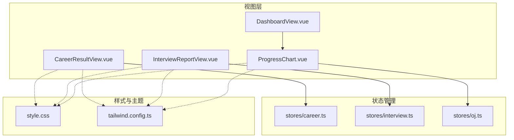
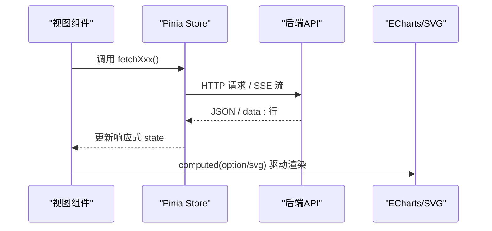
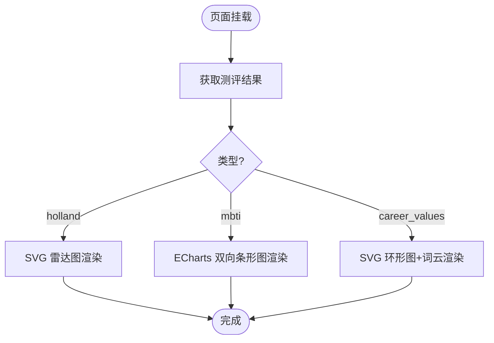
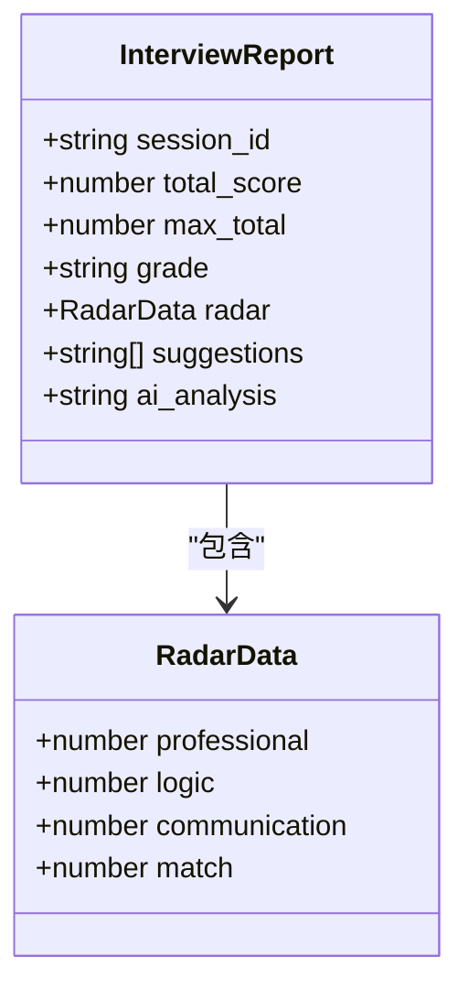
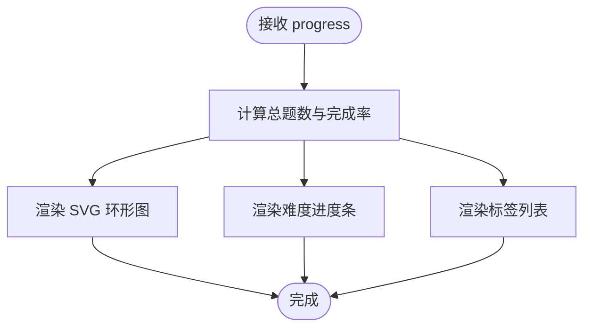
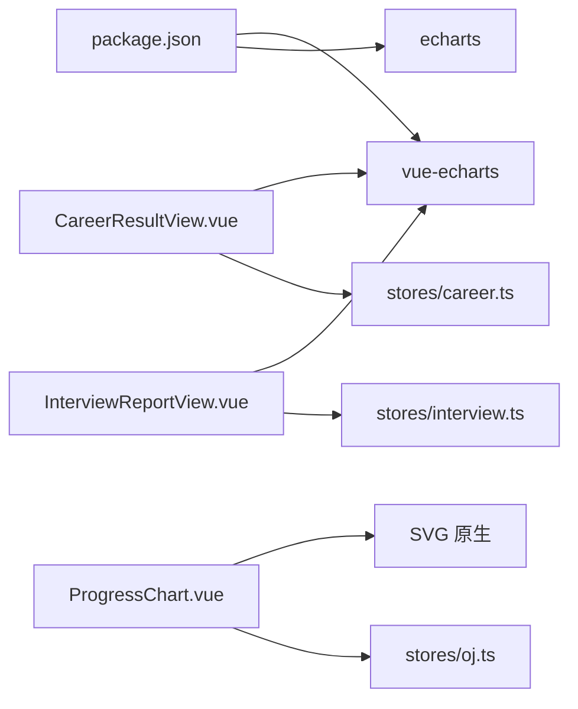
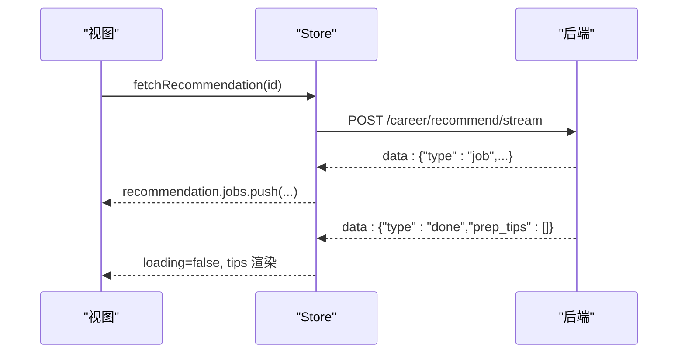

# 结果可视化

<cite>
**本文引用的文件**   
- [CareerResultView.vue](file://frontEnd/src/views/CareerResultView.vue)
- [InterviewReportView.vue](file://frontEnd/src/views/InterviewReportView.vue)
- [ProgressChart.vue](file://frontEnd/src/components/oj/ProgressChart.vue)
- [DashboardView.vue](file://frontEnd/src/views/DashboardView.vue)
- [career.ts](file://frontEnd/src/stores/career.ts)
- [interview.ts](file://frontEnd/src/stores/interview.ts)
- [oj.ts](file://frontEnd/src/stores/oj.ts)
- [style.css](file://frontEnd/src/style.css)
- [tailwind.config.ts](file://frontEnd/tailwind.config.ts)
- [package.json](file://frontEnd/package.json)
</cite>

## 目录
1. [简介](#简介)
2. [项目结构](#项目结构)
3. [核心组件](#核心组件)
4. [架构总览](#架构总览)
5. [详细组件分析](#详细组件分析)
6. [依赖关系分析](#依赖关系分析)
7. [性能与优化](#性能与优化)
8. [主题与样式定制](#主题与样式定制)
9. [移动端适配与响应式](#移动端适配与响应式)
10. [交互式功能指南](#交互式功能指南)
11. [数据绑定与实时同步](#数据绑定与实时同步)
12. [自定义图表开发指南](#自定义图表开发指南)
13. [故障排查](#故障排查)
14. [结论](#结论)

## 简介
本文件聚焦“测评结果可视化”模块，系统性梳理并文档化以下能力：
- ECharts 图表的定制实现（雷达图、柱状图、环形图、词云等）
- 数据绑定与响应式更新机制，确保前端图表与后端状态实时同步
- 交互式功能（缩放、筛选、导出等）的实现思路与最佳实践
- 主题定制与品牌化方案
- 移动端适配与响应式设计
- 自定义图表组件的开发规范与扩展建议
- 大数据量渲染与懒加载等性能优化策略

## 项目结构
可视化相关的前端代码主要分布在视图层与状态管理层：
- 视图层
  - 职业测评结果页：CareerResultView.vue（MBTI双向条形图、Holland SVG 雷达图、价值观环形图与词云）
  - 面试报告页：InterviewReportView.vue（ECharts 雷达图）
  - OJ 进度组件：ProgressChart.vue（SVG 环形图 + 进度条）
  - 仪表盘集成：DashboardView.vue（引入 ProgressChart）
- 状态管理
  - career.ts：测评历史、结果、AI推荐流式推送
  - interview.ts：面试会话、题目、评分报告
  - oj.ts：题目列表、提交、用户进度统计
- 样式与主题
  - style.css：全局 Memphis 风格变量与滚动条定制
  - tailwind.config.ts：Tailwind 颜色与字体扩展
  - package.json：echarts、vue-echarts 等依赖版本

图示来源
- [CareerResultView.vue:1-561](file://frontEnd/src/views/CareerResultView.vue#L1-L561)
- [InterviewReportView.vue:1-252](file://frontEnd/src/views/InterviewReportView.vue#L1-L252)
- [ProgressChart.vue:1-154](file://frontEnd/src/components/oj/ProgressChart.vue#L1-L154)
- [DashboardView.vue:370-569](file://frontEnd/src/views/DashboardView.vue#L370-L569)
- [career.ts:1-223](file://frontEnd/src/stores/career.ts#L1-L223)
- [interview.ts:1-313](file://frontEnd/src/stores/interview.ts#L1-L313)
- [oj.ts:1-268](file://frontEnd/src/stores/oj.ts#L1-L268)
- [style.css:1-147](file://frontEnd/src/style.css#L1-L147)
- [tailwind.config.ts:1-31](file://frontEnd/tailwind.config.ts#L1-L31)

章节来源
- [CareerResultView.vue:1-561](file://frontEnd/src/views/CareerResultView.vue#L1-L561)
- [InterviewReportView.vue:1-252](file://frontEnd/src/views/InterviewReportView.vue#L1-L252)
- [ProgressChart.vue:1-154](file://frontEnd/src/components/oj/ProgressChart.vue#L1-L154)
- [DashboardView.vue:370-569](file://frontEnd/src/views/DashboardView.vue#L370-L569)
- [career.ts:1-223](file://frontEnd/src/stores/career.ts#L1-L223)
- [interview.ts:1-313](file://frontEnd/src/stores/interview.ts#L1-L313)
- [oj.ts:1-268](file://frontEnd/src/stores/oj.ts#L1-L268)
- [style.css:1-147](file://frontEnd/src/style.css#L1-L147)
- [tailwind.config.ts:1-31](file://frontEnd/tailwind.config.ts#L1-L31)

## 核心组件
- 职业测评结果页（CareerResultView.vue）
  - Holland 六维度：使用内联 SVG 绘制雷达图，展示各维度得分与标签
  - MBTI 四维度：基于 vue-echarts 的双向条形图，左右对比倾向百分比
  - 职业价值观：SVG 环形图 + 词云，展示权重分布与核心因子
  - AI 岗位匹配推荐：SSE 流式返回岗位与建议，逐步渲染卡片
- 面试评估报告（InterviewReportView.vue）
  - ECharts 雷达图：专业能力、逻辑思维、沟通表达、岗位匹配度
  - 分数等级与改进建议、AI综合分析文本
- OJ 刷题进度（ProgressChart.vue）
  - SVG 环形图：总完成度
  - 难度分布与标签进度：水平进度条与列表

章节来源
- [CareerResultView.vue:1-561](file://frontEnd/src/views/CareerResultView.vue#L1-L561)
- [InterviewReportView.vue:1-252](file://frontEnd/src/views/InterviewReportView.vue#L1-L252)
- [ProgressChart.vue:1-154](file://frontEnd/src/components/oj/ProgressChart.vue#L1-L154)

## 架构总览
可视化模块遵循“视图-状态-服务”分层：
- 视图层通过 computed 将 store 中的响应式数据映射为图表 option 或 SVG 内容
- 状态层封装 API 请求、错误处理与 SSE 流解析，提供统一的数据源
- 样式层通过 Tailwind 与 CSS 变量统一视觉风格

图示来源
- [career.ts:148-207](file://frontEnd/src/stores/career.ts#L148-L207)
- [interview.ts:270-273](file://frontEnd/src/stores/interview.ts#L270-L273)
- [oj.ts:220-226](file://frontEnd/src/stores/oj.ts#L220-L226)
- [CareerResultView.vue:262-289](file://frontEnd/src/views/CareerResultView.vue#L262-L289)
- [InterviewReportView.vue:151-159](file://frontEnd/src/views/InterviewReportView.vue#L151-L159)

## 详细组件分析

### 职业测评结果页（CareerResultView.vue）
- Holland 雷达图（SVG）
  - 计算逻辑：根据维度名称与得分归一化到半径，生成多边形与标注
  - 交互：当前为静态展示，可后续接入 tooltip/点击高亮
- MBTI 双向条形图（ECharts）
  - 数据准备：按维度计算左右占比，映射颜色与标签
  - 配置要点：双 Y 轴、堆叠条形、tooltip 格式化
- 价值观环形图与词云（SVG）
  - 环形图：按平均分占比计算扇形角度，绘制路径与引线
  - 词云：按分值估算字号，行布局居中排列
- AI 推荐（SSE）
  - 流式解析：读取 data: 行，增量追加 job 与 prep_tips
  - 渲染：卡片网格与进度提示

图示来源
- [CareerResultView.vue:293-339](file://frontEnd/src/views/CareerResultView.vue#L293-L339)
- [CareerResultView.vue:366-458](file://frontEnd/src/views/CareerResultView.vue#L366-L458)
- [CareerResultView.vue:467-542](file://frontEnd/src/views/CareerResultView.vue#L467-L542)
- [career.ts:148-207](file://frontEnd/src/stores/career.ts#L148-L207)

章节来源
- [CareerResultView.vue:1-561](file://frontEnd/src/views/CareerResultView.vue#L1-L561)
- [career.ts:1-223](file://frontEnd/src/stores/career.ts#L1-L223)

### 面试评估报告（InterviewReportView.vue）
- 雷达图（ECharts）
  - indicator 定义四个维度，max=100
  - series 数据来自 report.radar，支持 tooltip
- 分数与等级
  - 总分/满分、等级色块、百分比进度条
- 建议与分析
  - AI 生成的改进建议与综合分析文本

图示来源
- [interview.ts:71-85](file://frontEnd/src/stores/interview.ts#L71-L85)
- [InterviewReportView.vue:210-239](file://frontEnd/src/views/InterviewReportView.vue#L210-L239)

章节来源
- [InterviewReportView.vue:1-252](file://frontEnd/src/views/InterviewReportView.vue#L1-L252)
- [interview.ts:1-313](file://frontEnd/src/stores/interview.ts#L1-L313)

### OJ 刷题进度（ProgressChart.vue）
- 环形图（SVG）
  - 使用 stroke-dasharray 控制完成比例
- 难度分布
  - 简单/中等/困难三档，进度条长度 = solved/total*100%
- 标签进度
  - 列表展示 tag 维度的 solved/total

图示来源
- [ProgressChart.vue:1-154](file://frontEnd/src/components/oj/ProgressChart.vue#L1-L154)
- [oj.ts:74-82](file://frontEnd/src/stores/oj.ts#L74-L82)

章节来源
- [ProgressChart.vue:1-154](file://frontEnd/src/components/oj/ProgressChart.vue#L1-L154)
- [oj.ts:1-268](file://frontEnd/src/stores/oj.ts#L1-L268)

## 依赖关系分析
- 运行时依赖
  - echarts、vue-echarts：用于 ECharts 图表渲染
  - html-to-image：可用于截图导出（可选）
- 组件耦合
  - 视图组件仅依赖对应 store 的响应式数据
  - 图表 option 由 computed 派生，避免重复计算
- 外部接口
  - /api/* 统一前缀，认证通过 Authorization 头传递

图示来源
- [package.json:11-24](file://frontEnd/package.json#L11-L24)
- [CareerResultView.vue:262-289](file://frontEnd/src/views/CareerResultView.vue#L262-L289)
- [InterviewReportView.vue:151-159](file://frontEnd/src/views/InterviewReportView.vue#L151-L159)

章节来源
- [package.json:1-35](file://frontEnd/package.json#L1-L35)
- [CareerResultView.vue:262-289](file://frontEnd/src/views/CareerResultView.vue#L262-L289)
- [InterviewReportView.vue:151-159](file://frontEnd/src/views/InterviewReportView.vue#L151-L159)

## 性能与优化
- 大数据量渲染
  - 对 ECharts 启用按需注册（BarChart/RadarChart 等），减少包体
  - 大量点/线时开启 animation=false 或使用简化几何
- 懒加载与分页
  - 题目列表与标签采用分页与过滤，避免一次性渲染过多 DOM
- 计算缓存
  - 使用 computed 缓存 option/svg 字符串，避免频繁重算
- 流式渲染
  - SSE 流式推送建议与岗位，分片增量渲染，提升首屏体验
- 资源体积
  - 本地 SVG 插图按需加载，避免不必要的网络开销

[本节为通用指导，不直接分析具体文件]

## 主题与样式定制
- 设计系统
  - Tailwind 扩展 memphis 色系与字体族，统一按钮、卡片、输入框风格
  - CSS 变量集中定义主色、背景、字体，便于品牌化替换
- 图表配色
  - 在 ECharts option 中复用 memphis 色系，保持整体一致
  - SVG 图形直接使用 CSS 变量或 Tailwind 类名，保证主题联动
- 深色模式
  - app store 提供 isDark 开关，可在需要时为图表注入暗色主题

章节来源
- [tailwind.config.ts:1-31](file://frontEnd/tailwind.config.ts#L1-L31)
- [style.css:1-147](file://frontEnd/src/style.css#L1-L147)
- [app.ts:1-17](file://frontEnd/src/stores/app.ts#L1-L17)

## 移动端适配与响应式
- 栅格与间距
  - 使用 Tailwind 的 grid-cols-* 与 p/m 系列实现自适应布局
- 图表尺寸
  - ECharts 容器设置 width:100% 与固定高度，autoresize 自动适配
  - SVG 使用 viewBox 实现等比缩放
- 交互友好
  - 增大触控区域，合理行高与字号，避免拥挤

章节来源
- [CareerResultView.vue:86-89](file://frontEnd/src/views/CareerResultView.vue#L86-L89)
- [InterviewReportView.vue:62-65](file://frontEnd/src/views/InterviewReportView.vue#L62-L65)
- [ProgressChart.vue:8-51](file://frontEnd/src/components/oj/ProgressChart.vue#L8-L51)

## 交互式功能指南
- 缩放与平移
  - ECharts 内置 toolbox 支持缩放与平移，可在 option 中启用
- 筛选与搜索
  - 题目列表支持难度、标签、关键词筛选；建议结合防抖减少请求频率
- 导出与分享
  - 可使用 html-to-image 将图表区域导出为图片，便于分享或存档
- 实时反馈
  - SSE 流式推送建议与岗位，边收边渲染，提升感知速度

章节来源
- [career.ts:148-207](file://frontEnd/src/stores/career.ts#L148-L207)
- [oj.ts:137-166](file://frontEnd/src/stores/oj.ts#L137-L166)
- [package.json:15](file://frontEnd/package.json#L15-L15)

## 数据绑定与实时同步
- 数据流向
  - Store 发起请求 -> 更新响应式 state -> 视图 computed 派生 option/svg -> 图表渲染
- 错误处理
  - 统一捕获异常并记录 message，视图层显示错误与重试入口
- 流式更新
  - SSE 解析 data: 行，增量追加 jobs 与 prep_tips，避免整段刷新

图示来源
- [career.ts:148-207](file://frontEnd/src/stores/career.ts#L148-L207)
- [CareerResultView.vue:548-559](file://frontEnd/src/views/CareerResultView.vue#L548-L559)

章节来源
- [career.ts:1-223](file://frontEnd/src/stores/career.ts#L1-L223)
- [interview.ts:270-273](file://frontEnd/src/stores/interview.ts#L270-L273)
- [oj.ts:220-226](file://frontEnd/src/stores/oj.ts#L220-L226)

## 自定义图表开发指南
- 选择渲染方式
  - 复杂交互与丰富生态：优先 ECharts
  - 轻量与强定制：优先 SVG 内联
- 数据准备
  - 在 computed 中做数据清洗与归一化，输出稳定结构
- 配置组织
  - 将 option 拆分为基础配置与业务配置，便于复用
- 主题联动
  - 从 CSS 变量/Tailwind 读取颜色，避免硬编码
- 事件与交互
  - ECharts 使用 on('click'/'mouseover') 等事件；SVG 使用原生事件
- 测试与回归
  - 针对边界数据（空值、极值、负值）编写用例，确保健壮性

[本节为通用指导，不直接分析具体文件]

## 故障排查
- 常见问题
  - 图表未渲染：检查容器宽高与 autoresize；确认 ECharts 组件已正确注册
  - 数据为空：查看 store 的错误信息，必要时触发重试
  - 流式中断：检查网络与 SSE 协议，增加断线重连与兜底文案
- 定位方法
  - 控制台打印关键 state 与 option
  - 使用浏览器开发者工具观察网络请求与响应体

章节来源
- [career.ts:148-207](file://frontEnd/src/stores/career.ts#L148-L207)
- [interview.ts:270-273](file://frontEnd/src/stores/interview.ts#L270-L273)
- [oj.ts:220-226](file://frontEnd/src/stores/oj.ts#L220-L226)

## 结论
本可视化模块以 Vue 3 + Pinia + ECharts/SVG 为核心，围绕测评与面试结果构建多维图表体系。通过 computed 驱动、SSE 流式更新与统一的 Memphis 主题，实现了良好的用户体验与可扩展性。建议在后续迭代中补充更多交互能力（缩放、筛选、导出）、完善错误恢复与监控指标，并持续优化大数据量场景下的渲染性能。