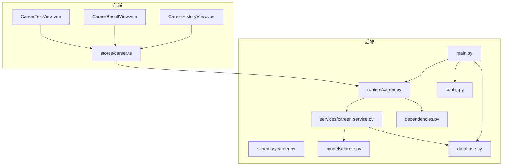
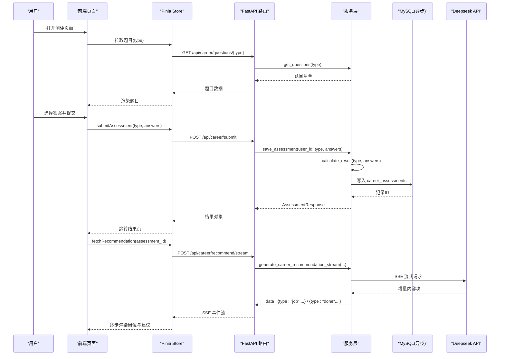
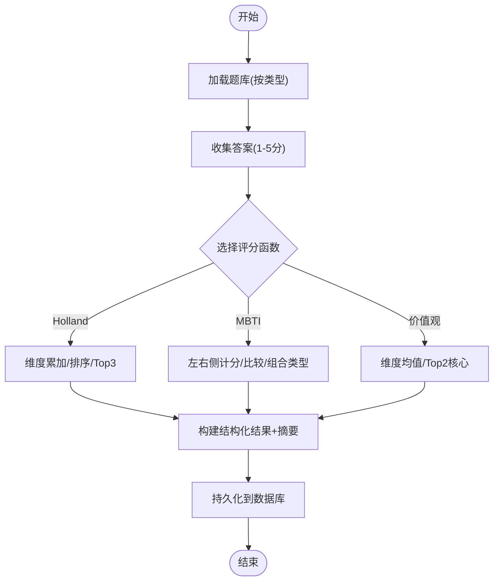
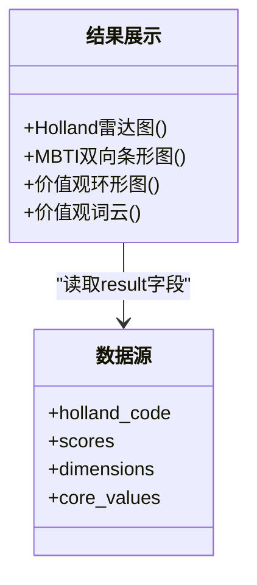
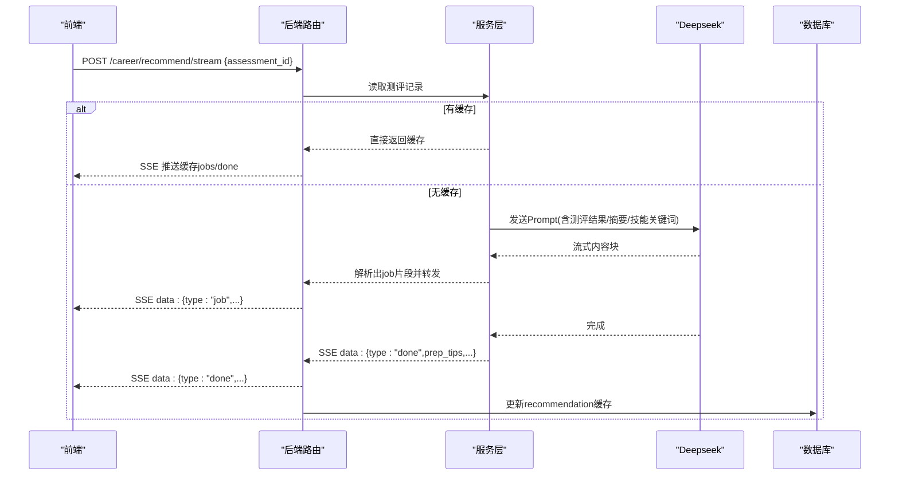
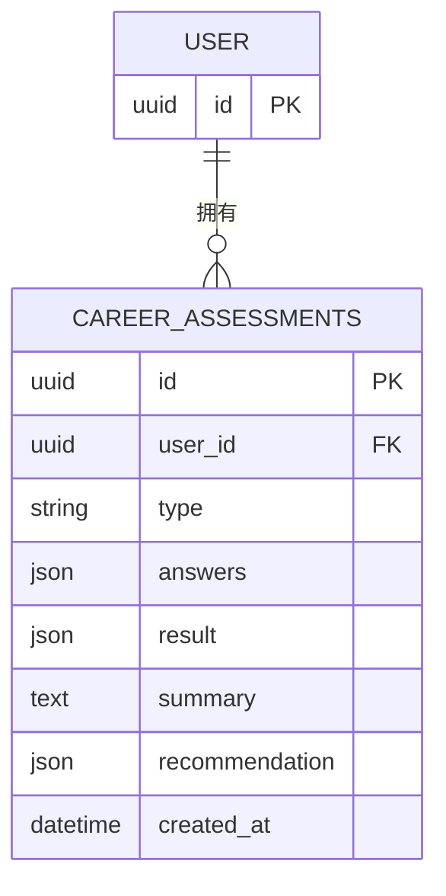
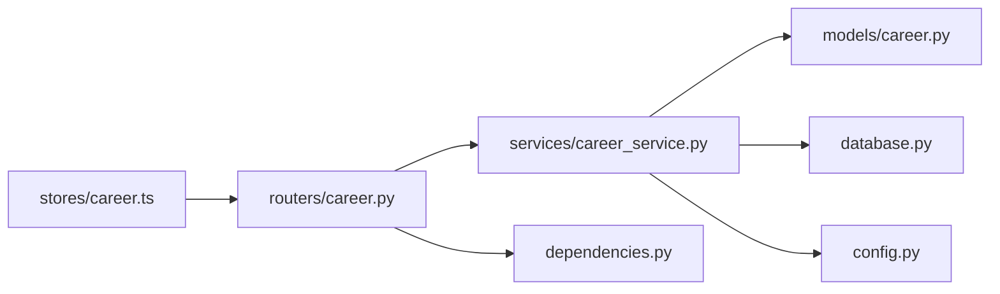

# 职业发展测评系统

<cite>
**本文引用的文件**   
- [backEnd/app/main.py](file://backEnd/app/main.py)
- [backEnd/app/config.py](file://backEnd/app/config.py)
- [backEnd/app/database.py](file://backEnd/app/database.py)
- [backEnd/app/dependencies.py](file://backEnd/app/dependencies.py)
- [backEnd/app/models/career.py](file://backEnd/app/models/career.py)
- [backEnd/app/schemas/career.py](file://backEnd/app/schemas/career.py)
- [backEnd/app/routers/career.py](file://backEnd/app/routers/career.py)
- [backEnd/app/services/career_service.py](file://backEnd/app/services/career_service.py)
- [hr_interview.sql](file://hr_interview.sql)
- [frontEnd/src/stores/career.ts](file://frontEnd/src/stores/career.ts)
- [frontEnd/src/views/CareerTestView.vue](file://frontEnd/src/views/CareerTestView.vue)
- [frontEnd/src/views/CareerResultView.vue](file://frontEnd/src/views/CareerResultView.vue)
- [frontEnd/src/views/CareerHistoryView.vue](file://frontEnd/src/views/CareerHistoryView.vue)
- [frontEnd/tailwind.config.ts](file://frontEnd/tailwind.config.ts)
</cite>

## 目录
1. [引言](#引言)
2. [项目结构](#项目结构)
3. [核心组件](#核心组件)
4. [架构总览](#架构总览)
5. [详细组件分析](#详细组件分析)
6. [依赖关系分析](#依赖关系分析)
7. [性能与可扩展性](#性能与可扩展性)
8. [故障排查指南](#故障排查指南)
9. [结论](#结论)
10. [附录](#附录)

## 引言
本文件面向开发者与产品人员，系统化阐述 HR XF 职业发展测评系统的实现原理与扩展方法。系统提供三类测评：Holland RIASEC 职业兴趣、MBTI 性格类型、职业价值观；并基于测评结果通过 AI 岗位匹配推荐（SSE 流式）生成个性化建议。文档覆盖题目生成、答案收集、评分算法、结果可视化（雷达图、双向条形图、环形图、词云）、数据存储与查询优化、自定义测评配置、用户体验与移动端适配、以及维护升级指导。

## 项目结构
后端采用 FastAPI + SQLAlchemy 异步 ORM，前端使用 Vue 3 + Pinia + ECharts/Tailwind。关键模块划分如下：
- 路由层：REST API 定义与鉴权依赖注入
- 服务层：题库与评分算法、数据库 CRUD、AI 推荐流式处理
- 模型与模式：ORM 模型与 Pydantic 请求/响应模式
- 前端视图：答题页、结果页、历史页；状态管理统一封装 API 调用
- 配置与数据库：环境变量、连接池、迁移与索引

图表来源
- [backEnd/app/main.py:44-68](file://backEnd/app/main.py#L44-L68)
- [backEnd/app/routers/career.py:17-158](file://backEnd/app/routers/career.py#L17-L158)
- [backEnd/app/services/career_service.py:429-451](file://backEnd/app/services/career_service.py#L429-L451)
- [backEnd/app/models/career.py:11-56](file://backEnd/app/models/career.py#L11-L56)
- [backEnd/app/database.py:31-58](file://backEnd/app/database.py#L31-L58)
- [backEnd/app/config.py:7-71](file://backEnd/app/config.py#L7-L71)
- [backEnd/app/dependencies.py:13-41](file://backEnd/app/dependencies.py#L13-L41)
- [frontEnd/src/stores/career.ts:82-223](file://frontEnd/src/stores/career.ts#L82-L223)
- [frontEnd/src/views/CareerTestView.vue:125-208](file://frontEnd/src/views/CareerTestView.vue#L125-L208)
- [frontEnd/src/views/CareerResultView.vue:261-561](file://frontEnd/src/views/CareerResultView.vue#L261-L561)
- [frontEnd/src/views/CareerHistoryView.vue:100-152](file://frontEnd/src/views/CareerHistoryView.vue#L100-L152)

章节来源
- [backEnd/app/main.py:44-68](file://backEnd/app/main.py#L44-L68)
- [backEnd/app/routers/career.py:17-158](file://backEnd/app/routers/career.py#L17-L158)
- [backEnd/app/services/career_service.py:429-451](file://backEnd/app/services/career_service.py#L429-L451)
- [backEnd/app/models/career.py:11-56](file://backEnd/app/models/career.py#L11-L56)
- [backEnd/app/database.py:31-58](file://backEnd/app/database.py#L31-L58)
- [backEnd/app/config.py:7-71](file://backEnd/app/config.py#L7-L71)
- [backEnd/app/dependencies.py:13-41](file://backEnd/app/dependencies.py#L13-L41)
- [frontEnd/src/stores/career.ts:82-223](file://frontEnd/src/stores/career.ts#L82-L223)
- [frontEnd/src/views/CareerTestView.vue:125-208](file://frontEnd/src/views/CareerTestView.vue#L125-L208)
- [frontEnd/src/views/CareerResultView.vue:261-561](file://frontEnd/src/views/CareerResultView.vue#L261-L561)
- [frontEnd/src/views/CareerHistoryView.vue:100-152](file://frontEnd/src/views/CareerHistoryView.vue#L100-L152)

## 核心组件
- 路由与鉴权
  - 路由前缀 /api/career，包含获取题目、提交答案、历史记录、结果详情、AI 推荐流等接口
  - 使用 Bearer Token 鉴权，校验用户存在且激活
- 服务层
  - 题库元数据与评分算法：Holland、MBTI、职业价值观
  - 数据库 CRUD：保存测评记录、按用户分页查询、按 ID 读取
  - AI 岗位推荐：Deepseek SSE 流式返回，解析 JSON 片段并缓存
- 数据模型与模式
  - ORM 模型 career_assessments 表，JSON 存储 answers/result/recommendation
  - Pydantic 模式约束输入输出，确保字段合法
- 前端
  - 答题流程：拉取题目、自动跳转、提交答案、跳转结果页
  - 结果展示：Holland 雷达图、MBTI 双向条形图、价值观环形图+词云
  - 推荐加载：SSE 流式接收 job 列表与 prep_tips，支持重试与错误提示

章节来源
- [backEnd/app/routers/career.py:17-158](file://backEnd/app/routers/career.py#L17-L158)
- [backEnd/app/dependencies.py:13-41](file://backEnd/app/dependencies.py#L13-L41)
- [backEnd/app/services/career_service.py:319-451](file://backEnd/app/services/career_service.py#L319-L451)
- [backEnd/app/models/career.py:11-56](file://backEnd/app/models/career.py#L11-L56)
- [backEnd/app/schemas/career.py:11-59](file://backEnd/app/schemas/career.py#L11-L59)
- [frontEnd/src/views/CareerTestView.vue:125-208](file://frontEnd/src/views/CareerTestView.vue#L125-L208)
- [frontEnd/src/views/CareerResultView.vue:261-561](file://frontEnd/src/views/CareerResultView.vue#L261-L561)
- [frontEnd/src/stores/career.ts:82-223](file://frontEnd/src/stores/career.ts#L82-L223)

## 架构总览
系统前后端分离，前端通过 REST/SSE 与后端交互；后端以 FastAPI 暴露接口，服务层承载业务逻辑与外部 AI 调用，数据库为 MySQL，ORM 使用 SQLAlchemy 异步引擎。

图表来源
- [backEnd/app/routers/career.py:20-158](file://backEnd/app/routers/career.py#L20-L158)
- [backEnd/app/services/career_service.py:457-669](file://backEnd/app/services/career_service.py#L457-L669)
- [backEnd/app/models/career.py:11-56](file://backEnd/app/models/career.py#L11-L56)
- [frontEnd/src/stores/career.ts:148-207](file://frontEnd/src/stores/career.ts#L148-L207)
- [frontEnd/src/views/CareerResultView.vue:548-561](file://frontEnd/src/views/CareerResultView.vue#L548-L561)

## 详细组件分析

### 测评题型与评分算法
- Holland RIASEC
  - 维度：R/I/A/S/E/C，各维度4题，共24题
  - 量表：5级喜好（非常不喜欢→非常喜欢）
  - 评分：累加维度得分，排序取 Top3 作为 Holland 代码，附带类型描述与职业建议
- MBTI
  - 维度：EI/SN/TF/JP，每维度6题（含正向/反向）
  - 量表：5级同意度（非常不同意→非常同意）
  - 评分：左右侧分数对比决定倾向字母，汇总为四字母类型，附带优势与职业建议
- 职业价值观
  - 维度：成就感/经济报酬/自主性/社会贡献/人际关系/工作环境，每维度4题
  - 量表：5级重要性（非常不重要→非常重要）
  - 评分：计算维度均分，Top2 为核心价值观，附带解释与建议

图表来源
- [backEnd/app/services/career_service.py:319-451](file://backEnd/app/services/career_service.py#L319-L451)
- [backEnd/app/services/career_service.py:457-476](file://backEnd/app/services/career_service.py#L457-L476)

章节来源
- [backEnd/app/services/career_service.py:61-207](file://backEnd/app/services/career_service.py#L61-L207)
- [backEnd/app/services/career_service.py:319-451](file://backEnd/app/services/career_service.py#L319-L451)
- [backEnd/app/services/career_service.py:457-476](file://backEnd/app/services/career_service.py#L457-L476)

### 测评结果可视化
- Holland 雷达图
  - 六轴对应 R/I/A/S/E/C，数据点归一化绘制多边形，标注名称与分数
- MBTI 双向条形图
  - 每个维度左右两侧百分比对比，颜色区分维度，Tooltip 显示倾向
- 职业价值观环形图+词云
  - 环形图按维度均分占比绘制，中心标注“核心价值观”；词云按分值大小布局中文字体

图表来源
- [frontEnd/src/views/CareerResultView.vue:300-542](file://frontEnd/src/views/CareerResultView.vue#L300-L542)

章节来源
- [frontEnd/src/views/CareerResultView.vue:300-542](file://frontEnd/src/views/CareerResultView.vue#L300-L542)

### AI 岗位匹配推荐（SSE 流式）
- 触发条件：结果页自动发起，或手动重试
- 流程：
  - 检查 Deepseek API Key 是否配置
  - 读取测评记录与可选简历技能关键词
  - 构造 Prompt，调用 Deepseek SSE 接口
  - 服务端逐条解析 JSON 片段，推送 job 条目与 done 消息
  - 完成后将 jobs 与 prep_tips 缓存至 recommendation 字段
- 前端：
  - 使用 ReadableStream 解析 SSE data: 行，逐步渲染岗位卡片与准备建议

图表来源
- [backEnd/app/routers/career.py:96-158](file://backEnd/app/routers/career.py#L96-L158)
- [backEnd/app/services/career_service.py:568-669](file://backEnd/app/services/career_service.py#L568-L669)
- [frontEnd/src/stores/career.ts:148-207](file://frontEnd/src/stores/career.ts#L148-L207)

章节来源
- [backEnd/app/routers/career.py:96-158](file://backEnd/app/routers/career.py#L96-L158)
- [backEnd/app/services/career_service.py:568-669](file://backEnd/app/services/career_service.py#L568-L669)
- [frontEnd/src/stores/career.ts:148-207](file://frontEnd/src/stores/career.ts#L148-L207)

### 数据存储结构与查询优化
- 表结构
  - career_assessments：id、user_id、type、answers(JSON)、result(JSON)、summary(TEXT)、recommendation(JSON)、created_at
  - 索引：type、user_id；外键关联 users.id 级联删除
- 查询优化
  - 按 user_id 过滤并按 created_at 倒序，适合历史列表
  - 按 id + user_id 精确读取单条结果，避免越权访问
  - recommendation 缓存减少重复 AI 调用

图表来源
- [backEnd/app/models/career.py:11-56](file://backEnd/app/models/career.py#L11-L56)
- [hr_interview.sql:39-51](file://hr_interview.sql#L39-L51)

章节来源
- [backEnd/app/models/career.py:11-56](file://backEnd/app/models/career.py#L11-L56)
- [hr_interview.sql:39-51](file://hr_interview.sql#L39-L51)

### 自定义测评题目的配置方法与扩展指南
- 新增测评类型步骤
  1. 在 ASSESSMENT_META 中添加新类型元信息（title、description、questions）
  2. 定义 QuestionItem 列表（id、dimension、text、options），复用通用 Likert 选项
  3. 实现评分函数 score_xxx，返回结构化 result 与 summary
  4. 在 calculate_result 分支中注册新类型
  5. 如需持久化额外字段，扩展 CareerAssessment 模型与数据库迁移
  6. 前端增加对应视图与可视化组件
- 注意事项
  - 题目 ID 唯一且稳定，便于答案映射
  - 维度与选项语义清晰，保证评分可解释
  - 若引入外部数据（如薪资调研），可在服务层聚合后写入 result 或 recommendation

章节来源
- [backEnd/app/services/career_service.py:191-207](file://backEnd/app/services/career_service.py#L191-L207)
- [backEnd/app/services/career_service.py:429-451](file://backEnd/app/services/career_service.py#L429-L451)
- [backEnd/app/models/career.py:11-56](file://backEnd/app/models/career.py#L11-L56)

### 用户体验优化与移动端适配
- 答题体验
  - 进度条与题号标签，上一题导航，自动跳转下一题（延迟防抖）
  - 选中反馈高亮，提交按钮仅在全部答完时可用
- 结果页
  - 大字号与强对比配色，SVG 矢量图自适应缩放
  - 推荐结果分块渐进渲染，错误重试机制
- 移动端适配
  - Tailwind 响应式类名与网格布局，小屏堆叠显示
  - 字体与间距调整，触控友好的按钮尺寸

章节来源
- [frontEnd/src/views/CareerTestView.vue:31-121](file://frontEnd/src/views/CareerTestView.vue#L31-L121)
- [frontEnd/src/views/CareerResultView.vue:27-258](file://frontEnd/src/views/CareerResultView.vue#L27-L258)
- [frontEnd/tailwind.config.ts:8-28](file://frontEnd/tailwind.config.ts#L8-L28)

## 依赖关系分析
- 组件耦合
  - 路由层仅负责参数校验与调用服务，低耦合
  - 服务层集中业务逻辑，依赖配置与数据库会话
  - 前端 Store 统一封装 API，视图只关注渲染与交互
- 外部依赖
  - Deepseek API：SSE 流式对话，需配置 API Key/URL/Model
  - MySQL：异步连接池，预检 ping 兼容补丁
- 潜在循环依赖
  - 当前未发现循环导入；模型与服务通过路径引用解耦

图表来源
- [backEnd/app/routers/career.py:17-158](file://backEnd/app/routers/career.py#L17-L158)
- [backEnd/app/services/career_service.py:429-451](file://backEnd/app/services/career_service.py#L429-L451)
- [backEnd/app/models/career.py:11-56](file://backEnd/app/models/career.py#L11-L56)
- [backEnd/app/database.py:31-58](file://backEnd/app/database.py#L31-L58)
- [backEnd/app/config.py:7-71](file://backEnd/app/config.py#L7-L71)
- [backEnd/app/dependencies.py:13-41](file://backEnd/app/dependencies.py#L13-L41)
- [frontEnd/src/stores/career.ts:82-223](file://frontEnd/src/stores/career.ts#L82-L223)

章节来源
- [backEnd/app/routers/career.py:17-158](file://backEnd/app/routers/career.py#L17-L158)
- [backEnd/app/services/career_service.py:429-451](file://backEnd/app/services/career_service.py#L429-L451)
- [backEnd/app/models/career.py:11-56](file://backEnd/app/models/career.py#L11-L56)
- [backEnd/app/database.py:31-58](file://backEnd/app/database.py#L31-L58)
- [backEnd/app/config.py:7-71](file://backEnd/app/config.py#L7-L71)
- [backEnd/app/dependencies.py:13-41](file://backEnd/app/dependencies.py#L13-L41)
- [frontEnd/src/stores/career.ts:82-223](file://frontEnd/src/stores/career.ts#L82-L223)

## 性能与可扩展性
- 数据库
  - 连接池大小与溢出限制合理，启用 pool_pre_ping 提升稳定性
  - 针对 user_id 与 type 建立索引，加速历史列表与筛选
- 网络与 I/O
  - SSE 流式传输降低首字节延迟，前端增量渲染提升感知性能
  - 推荐结果缓存避免重复 AI 调用
- 可扩展性
  - 服务层模块化设计，新增测评类型只需扩展题库与评分函数
  - 前端 Store 抽象 API 调用，便于替换后端实现或增加缓存策略

[本节为通用指导，不直接分析具体文件]

## 故障排查指南
- 认证失败
  - 现象：401 未授权
  - 排查：确认 Authorization Bearer Token 有效，用户存在且激活
- 验证错误
  - 现象：422 请求体校验失败
  - 排查：检查 answers 中 question_id 是否存在于题库，score 是否在 1-5
- 推荐失败
  - 现象：400 未配置 Deepseek API Key
  - 排查：在 .env 设置 DEEPSEEK_API_KEY，并确认 URL/Model 正确
- 数据库连接异常
  - 现象：ping 报错或连接池异常
  - 排查：检查 aiomysql 版本与 do_ping 兼容补丁，确认数据库凭据

章节来源
- [backEnd/app/dependencies.py:13-41](file://backEnd/app/dependencies.py#L13-L41)
- [backEnd/app/schemas/career.py:11-18](file://backEnd/app/schemas/career.py#L11-L18)
- [backEnd/app/routers/career.py:96-105](file://backEnd/app/routers/career.py#L96-L105)
- [backEnd/app/database.py:10-24](file://backEnd/app/database.py#L10-L24)

## 结论
本系统以清晰的层次化架构实现了三类主流测评与 AI 岗位推荐，具备可扩展的题库与评分框架、直观的可视化结果与良好的用户体验。通过合理的数据库索引与 SSE 流式传输，系统在性能与可维护性方面表现良好。后续可按扩展指南持续丰富测评维度与可视化能力。

[本节为总结，不直接分析具体文件]

## 附录
- 关键 API 概览
  - GET /api/career/questions/{type}：获取题目
  - POST /api/career/submit：提交答案并计算结果
  - GET /api/career/history：获取用户测评历史
  - GET /api/career/result/{id}：获取单个测评详情
  - POST /api/career/recommend/stream：AI 岗位匹配推荐（SSE）
- 配置项
  - 数据库连接、JWT、CORS、Deepseek API Key/URL/Model
- 前端样式主题
  - Tailwind 自定义色板与字体族

章节来源
- [backEnd/app/routers/career.py:20-158](file://backEnd/app/routers/career.py#L20-L158)
- [backEnd/app/config.py:7-71](file://backEnd/app/config.py#L7-L71)
- [frontEnd/tailwind.config.ts:8-28](file://frontEnd/tailwind.config.ts#L8-L28)