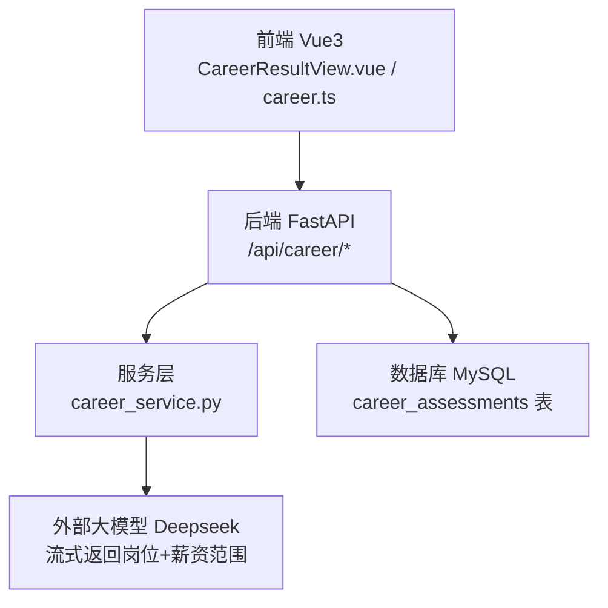
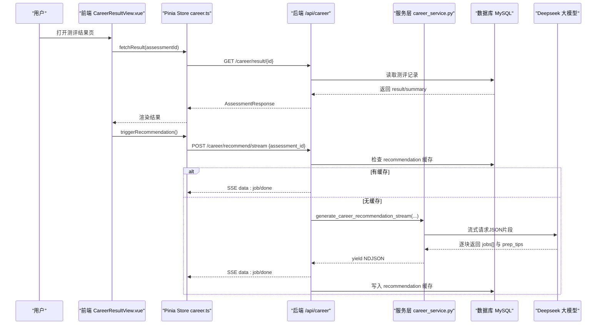
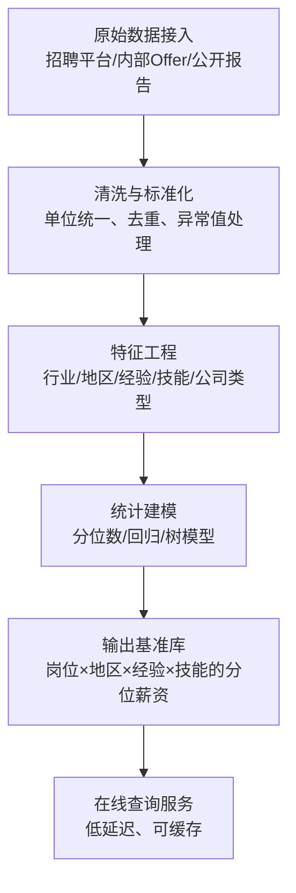
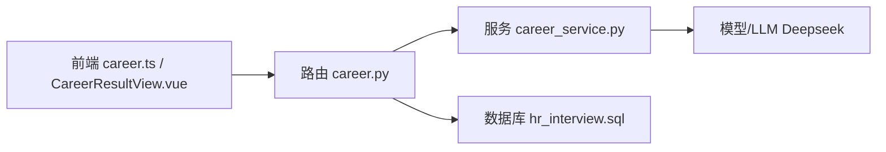

# 薪资调研功能

<cite>
**本文引用的文件列表**
- [career_service.py](file://backEnd/app/services/career_service.py)
- [career.py](file://backEnd/app/routers/career.py)
- [career.ts](file://frontEnd/src/stores/career.ts)
- [CareerResultView.vue](file://frontEnd/src/views/CareerResultView.vue)
- [hr_interview.sql](file://hr_interview.sql)
</cite>

## 目录
1. [简介](#简介)
2. [项目结构](#项目结构)
3. [核心组件](#核心组件)
4. [架构总览](#架构总览)
5. [详细组件分析](#详细组件分析)
6. [依赖关系分析](#依赖关系分析)
7. [性能与可扩展性](#性能与可扩展性)
8. [故障排查指南](#故障排查指南)
9. [结论](#结论)
10. [附录](#附录)

## 简介
本文件围绕“薪资调研”能力进行系统化文档化。当前仓库已具备职业测评、AI岗位匹配推荐（含薪资范围字段）以及结果可视化展示等基础能力。本文在现有实现基础上，梳理并扩展以下方面：
- 薪资数据采集与处理机制（行业基准、地区差异、经验要求等）
- 薪资预测算法（基于技能、经验、地理位置的估算模型）
- 数据可视化（分布图、趋势、对比）
- 结构化存储与查询优化
- 数据更新与维护机制
- 个性化建议生成（谈判策略、职业发展路径）
- 扩展接口与第三方数据集成方案
- 开发者维护与升级指导

说明：本节为总体概述，不直接分析具体代码文件。

## 项目结构
本项目采用前后端分离架构：
- 后端：FastAPI + SQLAlchemy + MySQL，提供测评、推荐、流式SSE接口
- 前端：Vue3 + Pinia + ECharts，负责测评交互、结果可视化与流式渲染
- 数据库：MySQL，包含测评记录表及AI推荐缓存字段

图表来源
- [career.py:1-158](file://backEnd/app/routers/career.py#L1-L158)
- [career_service.py:507-669](file://backEnd/app/services/career_service.py#L507-L669)
- [career.ts:148-207](file://frontEnd/src/stores/career.ts#L148-L207)
- [CareerResultView.vue:148-246](file://frontEnd/src/views/CareerResultView.vue#L148-L246)
- [hr_interview.sql:1-120](file://hr_interview.sql#L1-L120)

章节来源
- [career.py:1-158](file://backEnd/app/routers/career.py#L1-L158)
- [career_service.py:1-669](file://backEnd/app/services/career_service.py#L1-L669)
- [career.ts:1-223](file://frontEnd/src/stores/career.ts#L1-L223)
- [CareerResultView.vue:1-561](file://frontEnd/src/views/CareerResultView.vue#L1-L561)
- [hr_interview.sql:1-120](file://hr_interview.sql#L1-L120)

## 核心组件
- 测评服务层：定义量表、评分算法、结果持久化、AI推荐流式生成
- 路由层：暴露REST/SSE接口，鉴权、缓存命中、流式转发
- 前端Store：封装API调用、SSE解析、状态管理
- 前端视图：结果可视化（雷达图、双向条形图、环形图、词云）、岗位卡片与薪资范围展示
- 数据库：测评记录表，支持answers/result/summary/recommendation JSON字段

章节来源
- [career_service.py:311-451](file://backEnd/app/services/career_service.py#L311-L451)
- [career.py:96-158](file://backEnd/app/routers/career.py#L96-L158)
- [career.ts:148-207](file://frontEnd/src/stores/career.ts#L148-L207)
- [CareerResultView.vue:261-561](file://frontEnd/src/views/CareerResultView.vue#L261-L561)
- [hr_interview.sql:1-120](file://hr_interview.sql#L1-L120)

## 架构总览
从用户发起测评到获取AI岗位推荐（含薪资范围），整体流程如下：

图表来源
- [career.py:96-158](file://backEnd/app/routers/career.py#L96-L158)
- [career_service.py:568-669](file://backEnd/app/services/career_service.py#L568-L669)
- [career.ts:148-207](file://frontEnd/src/stores/career.ts#L148-L207)
- [CareerResultView.vue:548-560](file://frontEnd/src/views/CareerResultView.vue#L548-L560)
- [hr_interview.sql:1-120](file://hr_interview.sql#L1-L120)

## 详细组件分析

### 1) 薪资数据采集与处理机制
现状与定位
- 当前系统通过AI岗位推荐返回“salary_range”字段，作为一线城市的月薪区间参考，用于前端展示与后续扩展。
- 该字段由大模型根据测评结果与简历技能关键词生成，属于“软信息”，并非来自权威薪资数据库。

建议的数据采集维度
- 行业基准：按行业/岗位类别聚合市场薪酬分位值（P25/P50/P75/P90）
- 地区差异：城市级别系数（如一线城市、新一线、二线等）
- 经验要求：年限分段（应届/1-3年/3-5年/5年以上）
- 技能栈权重：技术栈/工具链对薪水的加成系数
- 公司类型：互联网/金融/制造/国企/外企等
- 福利构成：现金/期权/补贴/年终奖折算

数据处理流水线（概念）

章节来源
- [career_service.py:507-538](file://backEnd/app/services/career_service.py#L507-L538)
- [CareerResultView.vue:208-214](file://frontEnd/src/views/CareerResultView.vue#L208-L214)

### 2) 薪资预测算法实现
目标
- 基于用户技能水平、工作经验、地理位置等变量，给出更精确的薪资估算区间与置信度。

建议模型设计
- 输入特征：
  - 技能向量：从简历或测评中抽取的技术栈、证书、项目复杂度
  - 经验等级：工作年限、职级映射
  - 地理因子：城市级别、远程/线下
  - 行业与公司类型：互联网/金融/传统行业等
  - 供需指标：岗位热度、竞争强度
- 模型选择：
  - 基线：线性回归/分位数回归（输出区间）
  - 进阶：梯度提升树（XGBoost/LightGBM）或轻量神经网络
  - 不确定性估计：分位数回归森林或贝叶斯方法
- 训练与评估：
  - 标签：真实Offer薪资（经脱敏与归一化）
  - 指标：MAE/RMSE、分位覆盖率、区间校准误差
  - 冷启动：规则引擎（行业×地区×经验×技能查表）+ 小样本迁移学习

与现有系统的集成点
- 在“AI岗位推荐”返回的salary_range基础上，叠加“模型预测区间”，形成“AI建议区间 ∩ 模型预测区间”的稳健区间
- 将预测结果以结构化JSON形式存入recommendation字段，便于前端展示与历史追踪

章节来源
- [career_service.py:507-538](file://backEnd/app/services/career_service.py#L507-L538)
- [career.py:124-158](file://backEnd/app/routers/career.py#L124-L158)

### 3) 薪资数据可视化展示
当前可视化
- Holland雷达图、MBTI双向条形图、价值观环形图与词云
- 岗位卡片网格展示匹配度、理由与薪资范围

建议新增可视化
- 薪资分布图：箱线图/小提琴图（按城市/行业/经验分层）
- 趋势分析：时间序列折线图（月度/季度分位变化）
- 对比图表：用户期望 vs 市场分位（柱状/雷达）
- 热力图：城市×技能组合的薪资密度

前端实现要点
- 使用ECharts构建交互式图表，支持筛选器（城市、行业、经验）
- 流式增量渲染：随SSE推送逐步填充数据点

章节来源
- [CareerResultView.vue:44-146](file://frontEnd/src/views/CareerResultView.vue#L44-L146)
- [CareerResultView.vue:182-246](file://frontEnd/src/views/CareerResultView.vue#L182-L246)

### 4) 结构化存储与查询优化
现有表结构
- career_assessments：保存测评答案、计算结果、摘要与AI推荐缓存
- 索引：type、user_id；适合按用户与类型检索

优化建议
- 新增薪资基准表：岗位/行业/地区/经验/技能→分位薪资
- 新增预测结果表：用户ID、特征快照、预测区间、置信度、时间戳
- 索引策略：
  - 岗位/地区/经验联合索引
  - 用户ID+时间戳索引（用于个人趋势）
- 查询优化：
  - 预聚合视图（按月/城市/行业）
  - 物化缓存（Redis）热点查询（热门岗位×城市）

章节来源
- [hr_interview.sql:1-120](file://hr_interview.sql#L1-L120)

### 5) 数据更新机制与维护方法
更新策略
- 批量导入：定期从招聘平台/内部Offer导出CSV/JSON，进入ETL管道
- 增量同步：Webhook/API订阅变更，实时入库
- 质量校验：重复检测、离群值过滤、缺失值插补
- 版本控制：数据快照与回滚机制

维护规范
- 元数据登记：字段字典、口径说明、责任人
- 监控告警：数据新鲜度、覆盖率、异常波动
- 审计日志：谁在何时修改了哪些数据

章节来源
- [hr_interview.sql:1-120](file://hr_interview.sql#L1-L120)

### 6) 个性化薪资建议生成逻辑
生成要素
- 用户画像：测评结果（兴趣/性格/价值观）、简历技能、经验、期望城市
- 市场基准：岗位×地区×经验×技能的分位薪资
- 模型预测：区间与置信度
- 行为偏好：对薪资重要性的权重（来自价值观测评中的“经济报酬”维度）

输出内容
- 薪资区间与建议值（结合分位与置信度）
- 谈判策略：锚定策略、让步空间、备选方案（福利/期权/弹性工作）
- 职业发展路径：短期（技能补齐）、中期（跳槽/晋升）、长期（方向转型）

章节来源
- [career_service.py:154-185](file://backEnd/app/services/career_service.py#L154-L185)
- [career_service.py:507-538](file://backEnd/app/services/career_service.py#L507-L538)

### 7) 扩展接口与第三方数据集成
建议接口
- 薪资基准查询：GET /api/salary/benchmarks?job=&city=&exp=&skills=
- 预测查询：POST /api/salary/predict {features}
- 趋势查询：GET /api/salary/trends?job=&city=&period=
- 对比分析：POST /api/salary/compare {user_profile, market_benchmarks}

第三方集成
- 招聘平台API：拉取岗位与薪资数据（需合规授权）
- 宏观数据源：统计局/行业协会发布的薪酬报告
- 地图与地理编码：城市级别映射与距离计算

章节来源
- [career.py:96-158](file://backEnd/app/routers/career.py#L96-L158)

### 8) 开发者维护与升级指导
- 代码组织
  - 新增薪资模块：services/salary_service.py、routers/salary.py、schemas/salary.py
  - 前端新增页面：views/SalaryDashboard.vue、stores/salary.ts
- 配置与环境
  - 新增环境变量：薪资数据源URL、认证密钥、缓存TTL
- 测试与验证
  - 单元测试：评分与预测函数
  - 集成测试：端到端SSE流式响应
  - 数据一致性：基准库与预测结果对齐
- 发布与回滚
  - Alembic迁移：新增表与索引
  - 灰度发布：A/B对比不同预测模型效果

章节来源
- [career.py:1-158](file://backEnd/app/routers/career.py#L1-L158)
- [career_service.py:1-669](file://backEnd/app/services/career_service.py#L1-L669)
- [career.ts:1-223](file://frontEnd/src/stores/career.ts#L1-L223)
- [CareerResultView.vue:1-561](file://frontEnd/src/views/CareerResultView.vue#L1-L561)
- [hr_interview.sql:1-120](file://hr_interview.sql#L1-L120)

## 依赖关系分析

图表来源
- [career.py:1-158](file://backEnd/app/routers/career.py#L1-L158)
- [career_service.py:507-669](file://backEnd/app/services/career_service.py#L507-L669)
- [career.ts:148-207](file://frontEnd/src/stores/career.ts#L148-L207)
- [CareerResultView.vue:148-246](file://frontEnd/src/views/CareerResultView.vue#L148-L246)
- [hr_interview.sql:1-120](file://hr_interview.sql#L1-L120)

章节来源
- [career.py:1-158](file://backEnd/app/routers/career.py#L1-L158)
- [career_service.py:1-669](file://backEnd/app/services/career_service.py#L1-L669)
- [career.ts:1-223](file://frontEnd/src/stores/career.ts#L1-L223)
- [CareerResultView.vue:1-561](file://frontEnd/src/views/CareerResultView.vue#L1-L561)
- [hr_interview.sql:1-120](file://hr_interview.sql#L1-L120)

## 性能与可扩展性
- 流式SSE：降低首屏等待时间，提升用户体验
- 缓存策略：recommendation字段缓存AI结果，避免重复调用
- 查询优化：合理索引与预聚合，减少热点查询压力
- 横向扩展：微服务拆分（薪资服务独立部署），消息队列异步处理大数据导入

[本节为通用指导，无需特定文件引用]

## 故障排查指南
常见问题
- 未配置API Key导致推荐失败：检查后端是否设置DEEPSEEK_API_KEY
- SSE断流：前端需健壮解析data:行，处理乱序与丢包
- 缓存不一致：确保流结束后正确写入recommendation字段
- 数据异常：校验薪资区间格式与数值范围

定位步骤
- 查看后端日志与HTTP状态码
- 检查数据库recommendation字段是否存在与格式
- 前端控制台查看SSE事件与JSON解析错误

章节来源
- [career.py:102-105](file://backEnd/app/routers/career.py#L102-L105)
- [career.ts:186-200](file://frontEnd/src/stores/career.ts#L186-L200)
- [career.py:150-158](file://backEnd/app/routers/career.py#L150-L158)

## 结论
当前系统已具备职业测评与AI岗位推荐（含薪资范围）的基础能力。为实现完整的“薪资调研”闭环，建议在现有架构上引入薪资基准库、预测模型与丰富的可视化组件，并通过扩展接口与第三方数据源增强数据广度与深度。同时完善数据治理、监控与运维体系，保障准确性与稳定性。

[本节为总结性内容，无需特定文件引用]

## 附录
- 术语
  - SSE：Server-Sent Events，服务端推送事件流
  - P25/P50/P75/P90：分位数，反映薪资分布位置
  - 置信度：预测区间的可靠程度
- 参考实现路径
  - 后端新增薪资服务与路由
  - 前端新增薪资看板与图表
  - 数据库新增基准与预测表，建立索引与视图

[本节为补充信息，无需特定文件引用]