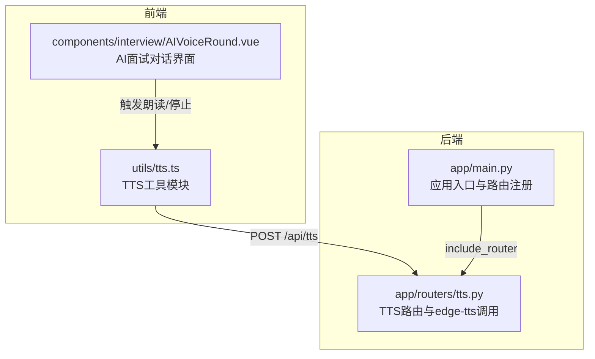
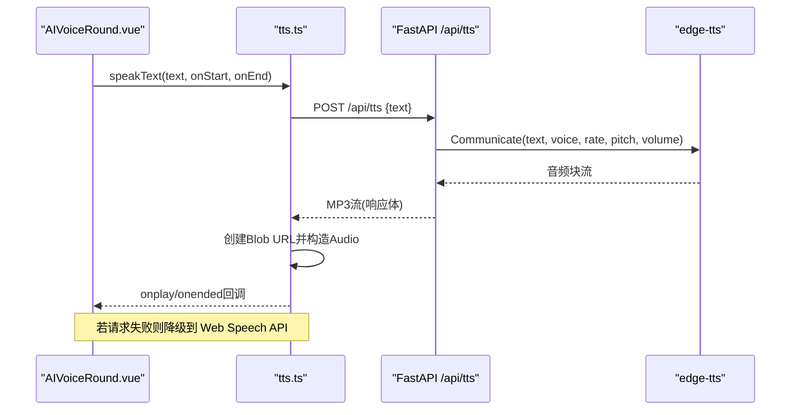
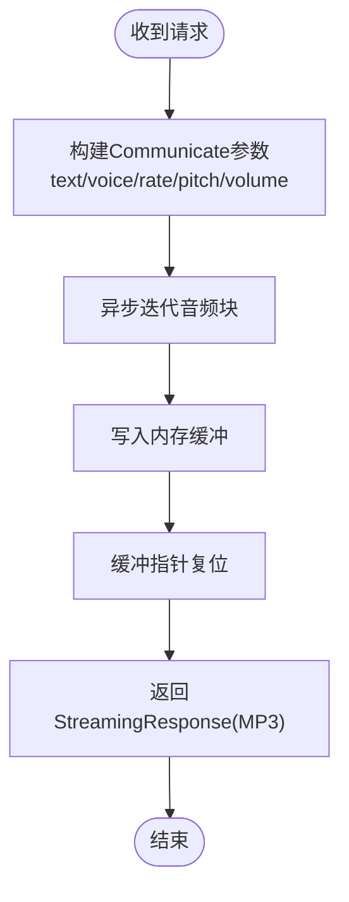
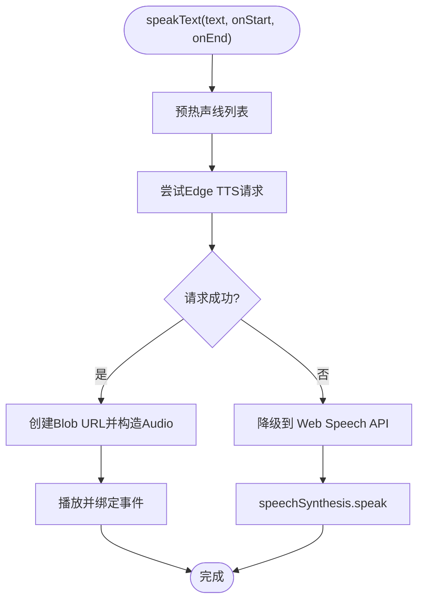
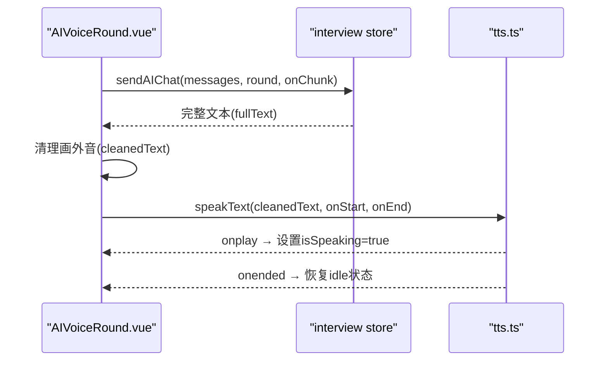
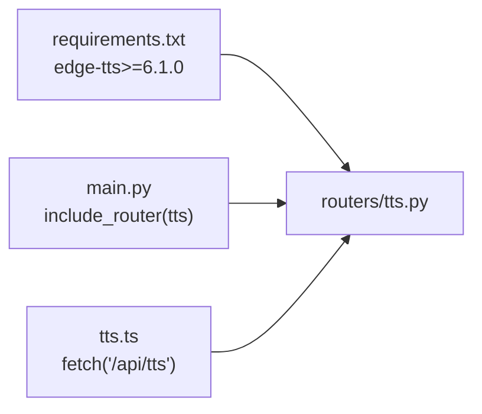

# 语音合成服务

<cite>
**本文引用的文件**   
- [backEnd/app/routers/tts.py](file://backEnd/app/routers/tts.py)
- [backEnd/app/main.py](file://backEnd/app/main.py)
- [frontEnd/src/utils/tts.ts](file://frontEnd/src/utils/tts.ts)
- [frontEnd/src/components/interview/AIVoiceRound.vue](file://frontEnd/src/components/interview/AIVoiceRound.vue)
- [backEnd/requirements.txt](file://backEnd/requirements.txt)
</cite>

## 目录
1. [简介](#简介)
2. [项目结构](#项目结构)
3. [核心组件](#核心组件)
4. [架构总览](#架构总览)
5. [详细组件分析](#详细组件分析)
6. [依赖关系分析](#依赖关系分析)
7. [性能与并发优化](#性能与并发优化)
8. [错误处理与重试机制](#错误处理与重试机制)
9. [音频存储与缓存策略](#音频存储与缓存策略)
10. [扩展与自定义指南](#扩展与自定义指南)
11. [故障排查](#故障排查)
12. [结论](#结论)

## 简介
本技术文档面向HR XF项目的语音合成（TTS）能力，聚焦以下目标：
- 解释Edge TTS在后端的集成方案与配置项
- 说明前端播放控制、格式处理、状态管理与音量控制
- 描述实时语音交互链路（录制→识别→传输→反馈）
- 给出语音质量优化策略（语速、音调、情感表达等）
- 明确音频文件的存储与缓存策略
- 完善错误处理与重试机制
- 提供性能优化与并发处理建议
- 指导开发者扩展与自定义语音配置

## 项目结构
本项目采用前后端分离架构。后端基于FastAPI提供TTS接口；前端通过工具模块统一封装TTS调用与降级策略，并在面试对话界面中集成语音朗读与录音功能。

图示来源
- [backEnd/app/main.py:60-68](file://backEnd/app/main.py#L60-L68)
- [backEnd/app/routers/tts.py:10-10](file://backEnd/app/routers/tts.py#L10-L10)
- [frontEnd/src/utils/tts.ts:22-26](file://frontEnd/src/utils/tts.ts#L22-L26)
- [frontEnd/src/components/interview/AIVoiceRound.vue:146-147](file://frontEnd/src/components/interview/AIVoiceRound.vue#L146-L147)

章节来源
- [backEnd/app/main.py:60-68](file://backEnd/app/main.py#L60-L68)
- [backEnd/app/routers/tts.py:10-10](file://backEnd/app/routers/tts.py#L10-L10)
- [frontEnd/src/utils/tts.ts:22-26](file://frontEnd/src/utils/tts.ts#L22-L26)
- [frontEnd/src/components/interview/AIVoiceRound.vue:146-147](file://frontEnd/src/components/interview/AIVoiceRound.vue#L146-L147)

## 核心组件
- 后端TTS路由：提供文本转语音的HTTP接口，使用edge-tts生成高质量中文语音，返回MP3流；同时支持列出可用中文声线。
- 前端TTS工具：封装Edge TTS调用与Web Speech API降级逻辑，管理播放状态、资源释放与停止。
- 面试对话界面：在AI问答流程中自动触发TTS朗读，并提供“重新朗读”按钮与录音输入。

章节来源
- [backEnd/app/routers/tts.py:19-50](file://backEnd/app/routers/tts.py#L19-L50)
- [frontEnd/src/utils/tts.ts:151-167](file://frontEnd/src/utils/tts.ts#L151-L167)
- [frontEnd/src/components/interview/AIVoiceRound.vue:204-219](file://frontEnd/src/components/interview/AIVoiceRound.vue#L204-L219)

## 架构总览
整体数据流：前端发起TTS请求→后端聚合音频块并返回MP3流→前端创建Blob URL并交由浏览器Audio播放；失败时自动降级到浏览器内置语音合成。

图示来源
- [frontEnd/src/utils/tts.ts:22-56](file://frontEnd/src/utils/tts.ts#L22-L56)
- [backEnd/app/routers/tts.py:27-50](file://backEnd/app/routers/tts.py#L27-L50)
- [backEnd/app/main.py:67-68](file://backEnd/app/main.py#L67-L68)

## 详细组件分析

### 后端TTS路由（Edge TTS）
- 路由前缀：/api/tts
- 主要接口
  - POST /api/tts：接收文本与可选参数（voice、rate、pitch、volume），返回MP3流
  - GET /api/tts/voices：列出可用的中文语音列表
- 默认配置
  - 默认语音：zh-CN-XiaoxiaoNeural
  - 默认语速：略慢
  - 默认音调：略高
  - 默认音量：不调整
- 实现要点
  - 使用edge-tts.Communicate进行流式合成
  - 将音频块写入内存缓冲后以StreamingResponse返回
  - 设置Content-Type为audio/mpeg，并附带内联下载头

图示来源
- [backEnd/app/routers/tts.py:27-50](file://backEnd/app/routers/tts.py#L27-L50)

章节来源
- [backEnd/app/routers/tts.py:12-25](file://backEnd/app/routers/tts.py#L12-L25)
- [backEnd/app/routers/tts.py:27-50](file://backEnd/app/routers/tts.py#L27-L50)
- [backEnd/app/routers/tts.py:53-62](file://backEnd/app/routers/tts.py#L53-L62)

### 前端TTS工具（Edge TTS + 降级）
- 优先级策略
  - 优先调用后端Edge TTS接口
  - 失败时自动降级到浏览器Web Speech API
- 播放控制
  - 停止当前音频并重置时间轴
  - 通过onplay/onended/onerror事件驱动状态回调
  - 使用URL.createObjectURL与revokeObjectURL管理资源
- 降级策略
  - 预热声线列表，避免首次延迟
  - 智能选择中文声线（优先Xiaoxiao等）
  - 设置合适的rate/pitch/volume以获得自然听感

图示来源
- [frontEnd/src/utils/tts.ts:72-92](file://frontEnd/src/utils/tts.ts#L72-L92)
- [frontEnd/src/utils/tts.ts:124-147](file://frontEnd/src/utils/tts.ts#L124-L147)
- [frontEnd/src/utils/tts.ts:151-167](file://frontEnd/src/utils/tts.ts#L151-L167)

章节来源
- [frontEnd/src/utils/tts.ts:11-64](file://frontEnd/src/utils/tts.ts#L11-L64)
- [frontEnd/src/utils/tts.ts:94-122](file://frontEnd/src/utils/tts.ts#L94-L122)
- [frontEnd/src/utils/tts.ts:151-174](file://frontEnd/src/utils/tts.ts#L151-L174)

### 面试对话中的语音交互
- 自动朗读：AI回复完成后，清理画外音描述并触发TTS朗读
- 手动重读：提供“重新朗读”按钮
- 录音输入：使用浏览器SpeechRecognition进行实时识别，结果回填至输入框
- 状态联动：朗读期间更新数字人状态与表情

图示来源
- [frontEnd/src/components/interview/AIVoiceRound.vue:312-358](file://frontEnd/src/components/interview/AIVoiceRound.vue#L312-L358)
- [frontEnd/src/components/interview/AIVoiceRound.vue:204-219](file://frontEnd/src/components/interview/AIVoiceRound.vue#L204-L219)
- [frontEnd/src/utils/tts.ts:151-167](file://frontEnd/src/utils/tts.ts#L151-L167)

章节来源
- [frontEnd/src/components/interview/AIVoiceRound.vue:146-147](file://frontEnd/src/components/interview/AIVoiceRound.vue#L146-L147)
- [frontEnd/src/components/interview/AIVoiceRound.vue:222-271](file://frontEnd/src/components/interview/AIVoiceRound.vue#L222-L271)
- [frontEnd/src/components/interview/AIVoiceRound.vue:344-358](file://frontEnd/src/components/interview/AIVoiceRound.vue#L344-L358)

## 依赖关系分析
- 后端依赖
  - FastAPI框架与路由注册
  - edge-tts库用于高质量中文语音合成
- 前端依赖
  - 浏览器原生Web Audio与SpeechSynthesis/SpeechRecognition
- 应用入口
  - main.py中注册TTS路由，使/api/tts对外可用

图示来源
- [backEnd/requirements.txt:25-26](file://backEnd/requirements.txt#L25-L26)
- [backEnd/app/main.py:67-68](file://backEnd/app/main.py#L67-L68)
- [frontEnd/src/utils/tts.ts:22-26](file://frontEnd/src/utils/tts.ts#L22-L26)

章节来源
- [backEnd/requirements.txt:25-26](file://backEnd/requirements.txt#L25-L26)
- [backEnd/app/main.py:67-68](file://backEnd/app/main.py#L67-L68)
- [frontEnd/src/utils/tts.ts:22-26](file://frontEnd/src/utils/tts.ts#L22-L26)

## 性能与并发优化
- 后端
  - 流式合成：边合成边收集，减少首字节延迟
  - 内存缓冲：适用于短文本；对长文本可考虑分片或流式直出
  - 并发模型：FastAPI基于uvicorn，天然支持异步并发；注意edge-tts网络IO开销
- 前端
  - Blob URL生命周期管理：及时revoke避免内存泄漏
  - 声线预热：降低首次降级路径的冷启动延迟
  - 播放队列：避免重复播放导致叠加，确保stopAudio先执行

[本节为通用性能建议，无需代码引用]

## 错误处理与重试机制
- 后端
  - 请求校验：Pydantic模型校验，非法参数快速失败
  - 异常处理器：全局拦截验证错误，避免二进制内容导致的解码异常
- 前端
  - Edge TTS失败：自动降级到Web Speech API
  - 播放异常：捕获onerror与play拒绝，清理资源并回调onEnd
  - 录音异常：捕获ASR错误并提示用户切换文字输入

章节来源
- [backEnd/app/main.py:76-84](file://backEnd/app/main.py#L76-L84)
- [frontEnd/src/utils/tts.ts:42-56](file://frontEnd/src/utils/tts.ts#L42-L56)
- [frontEnd/src/components/interview/AIVoiceRound.vue:252-264](file://frontEnd/src/components/interview/AIVoiceRound.vue#L252-L264)

## 音频存储与缓存策略
- 当前实现
  - 后端未持久化音频文件，直接返回流
  - 前端使用Blob URL临时播放，结束后释放
- 建议策略
  - 服务端缓存：按text+voice+rate+pitch+volume哈希作为键，短时缓存MP3，提升重复请求命中率
  - 客户端缓存：IndexedDB或Cache Storage缓存常用句子的音频片段
  - 过期策略：LRU或TTL结合，限制磁盘占用
  - 压缩与格式：保持MP3平衡音质与体积；必要时提供低码率选项

[本节为通用策略建议，无需代码引用]

## 扩展与自定义指南
- 新增语音角色与音色
  - 在路由层增加新的默认配置常量，或在请求体中传入voice参数
  - 通过GET /api/tts/voices获取可用中文声线，供前端展示与选择
- 调节语速、音调与音量
  - 后端：rate（百分比）、pitch（Hz）、volume（百分比）
  - 前端降级：SpeechSynthesisUtterance的rate/pitch/volume
- 情感表达增强
  - 通过SSML标签（如prosody、emphasis）在文本中注入情感细节（需edge-tts支持）
  - 根据上下文动态调整默认参数，营造不同面试官风格
- 多语言与方言
  - 扩展locale过滤逻辑，支持更多地区语音
- 安全与限流
  - 增加鉴权与速率限制，防止滥用
  - 文本长度上限与敏感词过滤

章节来源
- [backEnd/app/routers/tts.py:12-25](file://backEnd/app/routers/tts.py#L12-L25)
- [backEnd/app/routers/tts.py:53-62](file://backEnd/app/routers/tts.py#L53-L62)
- [frontEnd/src/utils/tts.ts:124-147](file://frontEnd/src/utils/tts.ts#L124-L147)

## 故障排查
- 无法访问TTS接口
  - 检查后端是否已包含TTS路由（main.py中include_router）
  - 确认CORS允许前端域名
- 播放无声或报错
  - 检查浏览器是否允许自动播放策略
  - 确认Blob URL是否正确创建与释放
- 降级不可用
  - 检查浏览器是否支持SpeechSynthesis与SpeechRecognition
  - 查看声线预热是否超时或无可用中文声线
- 录音无效
  - 确认HTTPS环境（部分浏览器要求）
  - 检查麦克风权限与设备可用性

章节来源
- [backEnd/app/main.py:67-68](file://backEnd/app/main.py#L67-L68)
- [frontEnd/src/utils/tts.ts:72-92](file://frontEnd/src/utils/tts.ts#L72-L92)
- [frontEnd/src/components/interview/AIVoiceRound.vue:232-264](file://frontEnd/src/components/interview/AIVoiceRound.vue#L232-L264)

## 结论
本方案以后端Edge TTS为核心，结合前端降级策略，实现了稳定、高质量的中文语音合成与播放体验。通过清晰的职责划分与完善的错误处理，系统在面试对话场景中提供了流畅的语音交互。后续可在缓存、限流、SSML情感表达等方面进一步演进，以满足更大规模与更丰富的业务需求。