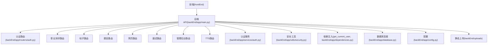
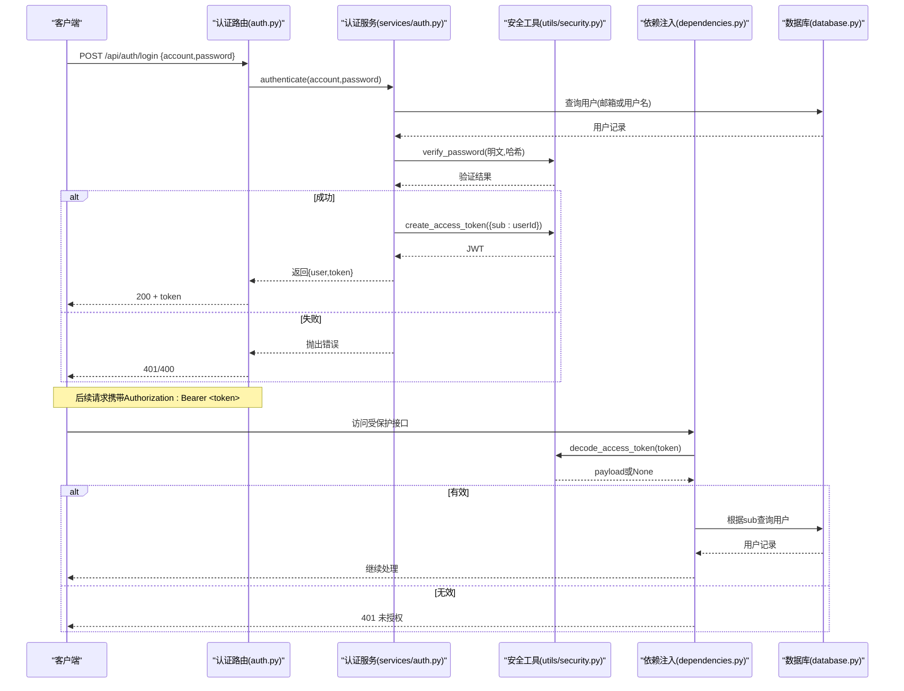
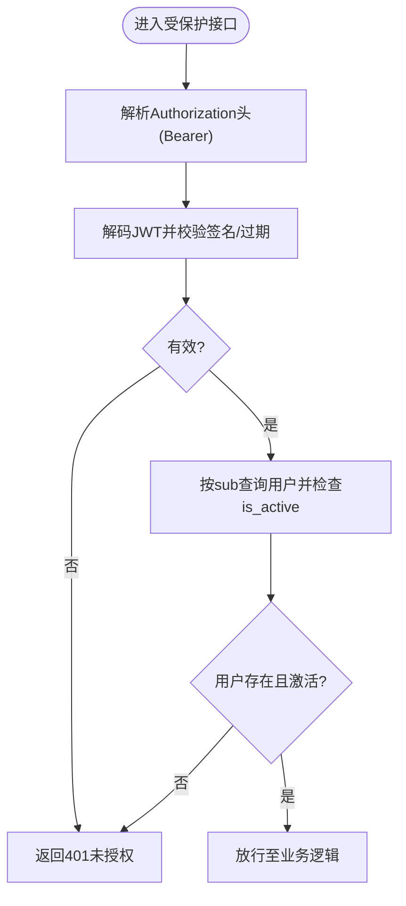
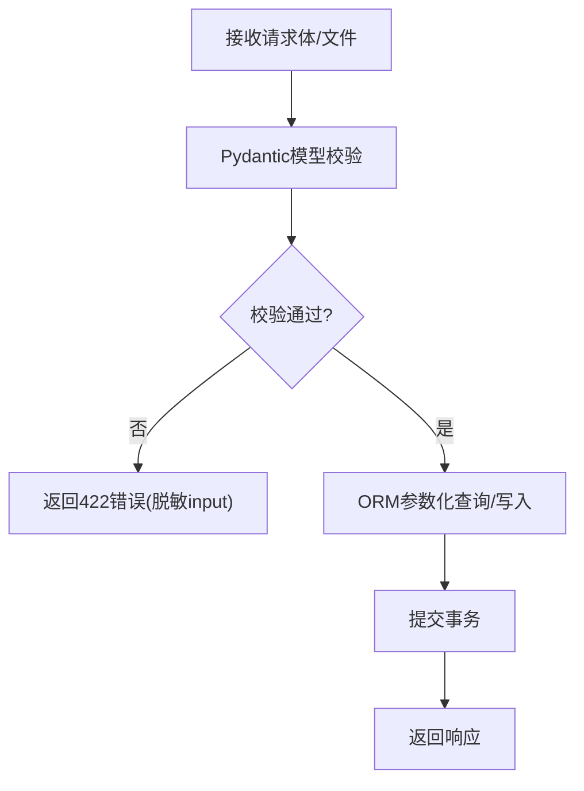
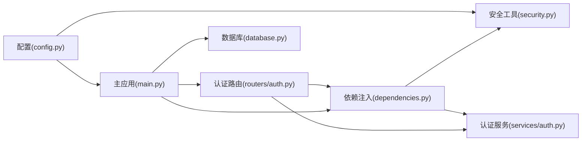

# 安全加固

<cite>
**本文引用的文件**   
- [backEnd/app/config.py](file://backEnd/app/config.py)
- [backEnd/app/utils/security.py](file://backEnd/app/utils/security.py)
- [backEnd/app/dependencies.py](file://backEnd/app/dependencies.py)
- [backEnd/app/routers/auth.py](file://backEnd/app/routers/auth.py)
- [backEnd/app/services/auth.py](file://backEnd/app/services/auth.py)
- [backEnd/app/main.py](file://backEnd/app/main.py)
- [backEnd/app/database.py](file://backEnd/app/database.py)
- [backEnd/app/models/user.py](file://backEnd/app/models/user.py)
- [backEnd/app/services/code_executor.py](file://backEnd/app/services/code_executor.py)
- [backEnd/alembic.ini](file://backEnd/alembic.ini)
- [frontEnd/src/utils/tts.ts](file://frontEnd/src/utils/tts.ts)
</cite>

## 目录
1. [简介](#简介)
2. [项目结构](#项目结构)
3. [核心组件](#核心组件)
4. [架构总览](#架构总览)
5. [详细组件分析](#详细组件分析)
6. [依赖关系分析](#依赖关系分析)
7. [性能与安全权衡](#性能与安全权衡)
8. [故障排查指南](#故障排查指南)
9. [结论](#结论)
10. [附录：生产环境加固清单](#附录生产环境加固清单)

## 简介
本文件面向HR XF系统的后端与前端，提供一套可落地的安全加固配置文档。内容覆盖身份认证与授权（JWT、密码哈希、会话）、HTTPS/SSL/TLS传输安全、输入校验与SQL注入防护、CORS/CSRF/XSS等Web安全机制、敏感信息保护（配置加密、密钥管理、日志脱敏），以及安全审计与漏洞扫描的落地建议。文档基于仓库现有实现进行梳理，并给出增强建议与实施路径。

## 项目结构
后端采用FastAPI分层架构：路由层负责HTTP接口，服务层封装业务逻辑，工具层提供安全能力（JWT、密码哈希），配置集中管理；数据库使用异步SQLAlchemy连接池；静态资源通过挂载目录暴露。前端为Vue工程，TTS模块直接调用后端API。

图示来源
- [backEnd/app/main.py:44-73](file://backEnd/app/main.py#L44-L73)
- [backEnd/app/routers/auth.py:25-31](file://backEnd/app/routers/auth.py#L25-L31)
- [backEnd/app/services/auth.py:1-10](file://backEnd/app/services/auth.py#L1-L10)
- [backEnd/app/utils/security.py:1-10](file://backEnd/app/utils/security.py#L1-L10)
- [backEnd/app/dependencies.py:1-10](file://backEnd/app/dependencies.py#L1-L10)
- [backEnd/app/database.py:27-43](file://backEnd/app/database.py#L27-L43)
- [backEnd/app/config.py:7-33](file://backEnd/app/config.py#L7-L33)

章节来源
- [backEnd/app/main.py:44-73](file://backEnd/app/main.py#L44-L73)
- [backEnd/app/config.py:7-33](file://backEnd/app/config.py#L7-L33)

## 核心组件
- 配置中心：集中管理数据库、JWT、CORS、外部API等参数，支持从.env加载。
- 安全工具：bcrypt密码哈希、JWT令牌签发与校验。
- 依赖注入：统一Bearer鉴权，解析Token并获取当前用户。
- 认证路由与服务：注册、登录、个人信息更新、密码修改、注销、头像上传等。
- 数据库：异步引擎与会话工厂，连接池与自动建表。
- 代码执行器：针对在线编程场景的安全策略（关键词黑名单）。

章节来源
- [backEnd/app/config.py:7-33](file://backEnd/app/config.py#L7-L33)
- [backEnd/app/utils/security.py:10-47](file://backEnd/app/utils/security.py#L10-L47)
- [backEnd/app/dependencies.py:10-40](file://backEnd/app/dependencies.py#L10-L40)
- [backEnd/app/routers/auth.py:41-86](file://backEnd/app/routers/auth.py#L41-L86)
- [backEnd/app/services/auth.py:38-96](file://backEnd/app/services/auth.py#L38-L96)
- [backEnd/app/database.py:27-58](file://backEnd/app/database.py#L27-L58)
- [backEnd/app/services/code_executor.py:154-167](file://backEnd/app/services/code_executor.py#L154-L167)

## 架构总览
下图展示认证与鉴权的端到端流程，包括JWT生成、传递与校验，以及管理员权限判定。

图示来源
- [backEnd/app/routers/auth.py:69-86](file://backEnd/app/routers/auth.py#L69-L86)
- [backEnd/app/services/auth.py:85-96](file://backEnd/app/services/auth.py#L85-L96)
- [backEnd/app/utils/security.py:26-47](file://backEnd/app/utils/security.py#L26-L47)
- [backEnd/app/dependencies.py:13-40](file://backEnd/app/dependencies.py#L13-L40)
- [backEnd/app/database.py:50-58](file://backEnd/app/database.py#L50-L58)

## 详细组件分析

### 身份认证与授权
- 密码存储：使用bcrypt对密码进行哈希，内部对超长密码做安全截断，避免算法限制导致异常。
- 令牌策略：HS256对称签名，载荷仅包含用户标识与过期时间；默认有效期较长，需在生产环境缩短。
- 鉴权中间件：统一通过HTTPBearer解析令牌，校验失败返回401并附带WWW-Authenticate头；同时检查用户是否激活。
- 管理员权限：当前实现基于用户名/邮箱包含“admin”的简单规则，建议升级为基于角色/权限模型。

图示来源
- [backEnd/app/dependencies.py:13-40](file://backEnd/app/dependencies.py#L13-L40)
- [backEnd/app/utils/security.py:39-47](file://backEnd/app/utils/security.py#L39-L47)
- [backEnd/app/models/user.py:24-25](file://backEnd/app/models/user.py#L24-L25)

章节来源
- [backEnd/app/utils/security.py:10-47](file://backEnd/app/utils/security.py#L10-L47)
- [backEnd/app/dependencies.py:10-40](file://backEnd/app/dependencies.py#L10-L40)
- [backEnd/app/routers/admin.py:26-34](file://backEnd/app/routers/admin.py#L26-L34)

### 密码加密算法
- 算法选择：bcrypt具备抗暴力破解特性，适合本地存储密码。
- 长度限制：超过72字节的密码会被截断，建议在应用层增加最小长度与复杂度校验，降低弱口令风险。
- 变更流程：修改密码前需校验旧密码，成功后立即刷新新令牌（如需要）。

章节来源
- [backEnd/app/utils/security.py:13-23](file://backEnd/app/utils/security.py#L13-L23)
- [backEnd/app/services/auth.py:148-160](file://backEnd/app/services/auth.py#L148-L160)

### JWT令牌安全策略
- 算法与密钥：HS256+对称密钥，密钥来自配置；生产环境必须更换强随机密钥，并定期轮换。
- 过期时间：默认较长，建议缩短至分钟级并结合刷新令牌机制。
- 载荷最小化：仅包含必要字段（如用户ID），避免在令牌中存放敏感信息。
- 校验严格性：解码时指定允许算法列表，拒绝空算法攻击。

章节来源
- [backEnd/app/config.py:20-23](file://backEnd/app/config.py#L20-L23)
- [backEnd/app/utils/security.py:26-47](file://backEnd/app/utils/security.py#L26-L47)

### 会话管理
- 无状态设计：服务端不保存会话，所有鉴权基于JWT；客户端需在登出后主动丢弃令牌。
- 登出语义：提供登出接口用于对称性，但实际由客户端清理本地令牌。

章节来源
- [backEnd/app/routers/auth.py:83-86](file://backEnd/app/routers/auth.py#L83-L86)

### HTTPS证书管理与SSL/TLS
- 现状：后端未内置HTTPS；前端开发环境直连http://localhost:8000。
- 建议：
  - 在反向代理（Nginx/Caddy）终止TLS，配置强套件与HSTS。
  - 使用可信CA签发的证书，避免自签证书进入生产。
  - 强制HTTPS，禁用HTTP重定向到HTTPS以外的行为。
  - 前端将API_BASE切换为https域名，并确保CORS允许该源。

章节来源
- [backEnd/app/main.py:51-58](file://backEnd/app/main.py#L51-58)
- [frontEnd/src/utils/tts.ts:7](file://frontEnd/src/utils/tts.ts#L7)

### 输入验证与SQL注入防护
- 输入验证：使用Pydantic模型进行请求体验证；自定义异常处理器过滤二进制输入以避免Unicode错误。
- SQL注入防护：全部使用SQLAlchemy ORM与参数化查询，避免拼接SQL字符串。
- 上传安全：头像上传限制MIME类型与大小，文件名使用UUID命名，避免路径穿越。

图示来源
- [backEnd/app/main.py:76-84](file://backEnd/app/main.py#L76-L84)
- [backEnd/app/services/auth.py:13-35](file://backEnd/app/services/auth.py#L13-L35)
- [backEnd/app/routers/auth.py:182-216](file://backEnd/app/routers/auth.py#L182-L216)

章节来源
- [backEnd/app/main.py:76-84](file://backEnd/app/main.py#L76-L84)
- [backEnd/app/services/auth.py:13-35](file://backEnd/app/services/auth.py#L13-L35)
- [backEnd/app/routers/auth.py:182-216](file://backEnd/app/routers/auth.py#L182-L216)

### CORS跨域策略
- 现状：允许配置的多个来源，启用凭据，方法与头部通配。
- 建议：
  - 精确白名单，禁止“*”在allow_origins与allow_headers同时出现。
  - 生产环境仅允许已发布的前端域名。
  - 谨慎使用allow_credentials，确保与具体来源匹配。

章节来源
- [backEnd/app/config.py:31-32](file://backEnd/app/config.py#L31-L32)
- [backEnd/app/main.py:52-58](file://backEnd/app/main.py#L52-58)

### CSRF与XSS防护
- CSRF：由于采用无状态JWT且通常为前后端分离，传统Cookie CSRF不适用；若未来引入Cookie会话，应启用CSRF Token或SameSite Cookie策略。
- XSS：
  - 后端输出JSON，避免渲染HTML模板。
  - 前端应避免v-html等危险用法，对用户输入进行转义后再展示。
  - 设置合适的Content-Type与CSP（由反向代理或框架中间件配置）。

章节来源
- [backEnd/app/main.py:76-84](file://backEnd/app/main.py#L76-L84)

### 敏感信息保护
- 配置文件：敏感项（数据库密码、JWT密钥、第三方API Key）应从环境变量或密钥管理服务注入，避免硬编码。
- 密钥管理：建议使用系统密钥库或云KMS，运行时动态读取。
- 日志脱敏：确保日志不包含密码、令牌、身份证号等敏感数据；对异常堆栈中的输入字段进行脱敏。

章节来源
- [backEnd/app/config.py:13-37](file://backEnd/app/config.py#L13-37)
- [backEnd/app/main.py:76-84](file://backEnd/app/main.py#L76-L84)

### 安全审计与漏洞扫描
- 审计日志：记录关键操作（登录、权限变更、资料修改、删除账号）的时间、主体与结果。
- 漏洞扫描：集成SCA/SAST/DAST流水线，定期扫描依赖与代码缺陷。
- 渗透测试：上线前与重大变更后开展渗透测试，形成修复闭环。

[本节为通用实践建议，无需源码引用]

## 依赖关系分析

图示来源
- [backEnd/app/config.py:7-33](file://backEnd/app/config.py#L7-L33)
- [backEnd/app/utils/security.py:1-10](file://backEnd/app/utils/security.py#L1-L10)
- [backEnd/app/dependencies.py:1-10](file://backEnd/app/dependencies.py#L1-L10)
- [backEnd/app/services/auth.py:1-10](file://backEnd/app/services/auth.py#L1-L10)
- [backEnd/app/routers/auth.py:1-24](file://backEnd/app/routers/auth.py#L1-L24)
- [backEnd/app/main.py:44-73](file://backEnd/app/main.py#L44-L73)
- [backEnd/app/database.py:27-43](file://backEnd/app/database.py#L27-L43)

章节来源
- [backEnd/app/config.py:7-33](file://backEnd/app/config.py#L7-L33)
- [backEnd/app/dependencies.py:1-10](file://backEnd/app/dependencies.py#L1-L10)
- [backEnd/app/main.py:44-73](file://backEnd/app/main.py#L44-L73)

## 性能与安全权衡
- bcrypt强度：提高轮数可增强安全性但增加CPU开销，需结合QPS评估。
- JWT过期：短过期提升安全性但会增加刷新频率，建议配合刷新令牌。
- 上传限制：限制大小与类型可减少资源滥用风险，但可能影响用户体验，需提供友好提示与重试策略。
- 代码执行器：黑名单策略能拦截常见危险模式，但无法完全替代沙箱隔离；建议结合容器化与资源限制。

[本节为通用指导，无需源码引用]

## 故障排查指南
- 401未授权：检查Authorization头格式、令牌是否过期、用户是否被禁用。
- 422校验错误：确认请求体结构与类型；注意二进制输入已被脱敏。
- 数据库连接：检查连接串、凭据与网络连通性；关注连接池参数。
- 上传失败：核对MIME类型与文件大小限制；确认目标目录写权限。

章节来源
- [backEnd/app/dependencies.py:13-40](file://backEnd/app/dependencies.py#L13-L40)
- [backEnd/app/main.py:76-84](file://backEnd/app/main.py#L76-L84)
- [backEnd/app/database.py:31-43](file://backEnd/app/database.py#L31-L43)
- [backEnd/app/routers/auth.py:182-216](file://backEnd/app/routers/auth.py#L182-L216)

## 结论
当前系统在认证与鉴权方面实现了基础的JWT与bcrypt方案，具备无状态会话与基础输入校验能力。生产环境需重点强化：密钥与配置管理、HTTPS强制与HSTS、精细化CORS、更严格的令牌策略、完善的日志审计与漏洞扫描体系，并对管理员权限模型进行升级。

[本节为总结，无需源码引用]

## 附录：生产环境加固清单
- 配置与密钥
  - 使用环境变量或KMS注入敏感配置，移除默认弱密钥。
  - 将JWT算法与密钥、过期时间纳入配置中心，支持热更新与轮换。
- 传输安全
  - 反向代理终止TLS，启用HSTS、强套件与OCSP Stapling。
  - 前端API地址改为HTTPS域名，关闭HTTP直连。
- 认证与授权
  - 缩短JWT过期时间，引入刷新令牌与令牌撤销机制。
  - 升级管理员权限为RBAC，避免基于名称的弱判断。
- 输入与存储
  - 全面使用ORM参数化查询，禁止拼接SQL。
  - 上传文件进行类型、大小、内容检测与病毒扫描。
- Web安全
  - 精细化CORS白名单，避免通配。
  - 前端避免危险DOM API，必要时配置CSP。
- 审计与合规
  - 记录关键操作审计日志，集中收集与分析。
  - 建立SCA/SAST/DAST流水线，定期渗透测试与整改跟踪。

[本节为通用清单，无需源码引用]