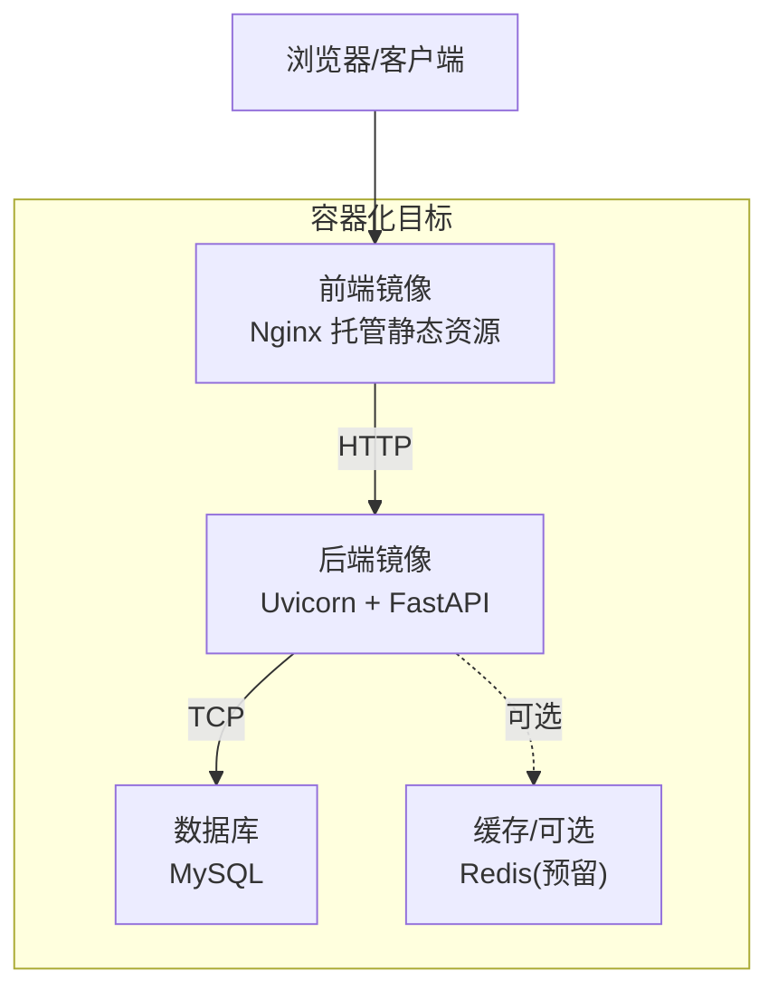
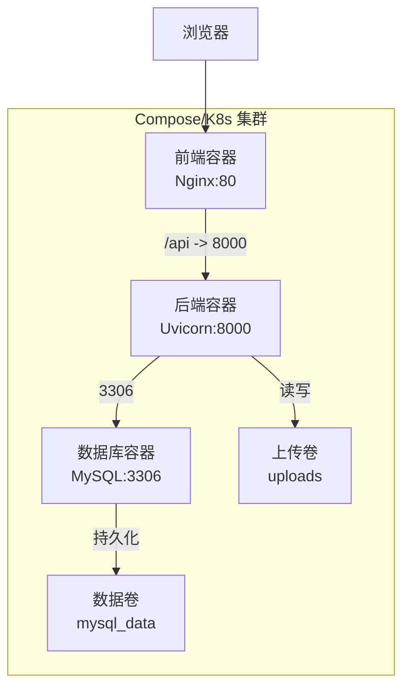
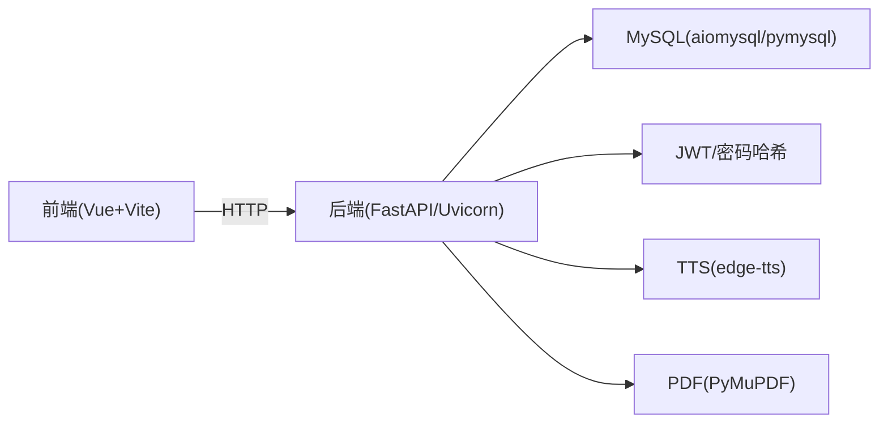

# 容器化部署

<cite>
**本文引用的文件列表**
- [backEnd/requirements.txt](file://backEnd/requirements.txt)
- [frontEnd/package.json](file://frontEnd/package.json)
- [backEnd/app/config.py](file://backEnd/app/config.py)
- [backEnd/app/main.py](file://backEnd/app/main.py)
- [backEnd/app/database.py](file://backEnd/app/database.py)
- [frontEnd/vite.config.ts](file://frontEnd/vite.config.ts)
</cite>

## 目录
1. [简介](#简介)
2. [项目结构](#项目结构)
3. [核心组件](#核心组件)
4. [架构总览](#架构总览)
5. [详细组件分析](#详细组件分析)
6. [依赖分析](#依赖分析)
7. [性能考虑](#性能考虑)
8. [故障排查指南](#故障排查指南)
9. [结论](#结论)
10. [附录](#附录)

## 简介
本文件面向 HR XF 系统的容器化与编排，提供从镜像构建到服务编排、网络隔离、数据持久化、水平扩展与高可用、以及监控日志收集的一体化方案。文档基于仓库现有后端（FastAPI + SQLAlchemy 异步）与前端（Vue 3 + Vite）代码进行设计，确保所有建议与配置均与实际实现一致。

## 项目结构
HR XF 采用前后端分离：
- 后端：Python FastAPI，使用 SQLAlchemy 异步连接 MySQL，Alembic 管理迁移，静态资源 uploads 通过 /api/uploads 暴露。
- 前端：Vue 3 + Vite，开发环境通过代理转发 /api 请求至后端；生产环境应构建为静态资源并由反向代理或后端统一分发。

[此图为概念性架构图，不直接映射具体源码文件]

## 核心组件
- 后端运行入口与生命周期：应用启动时创建表并初始化种子数据，关闭时释放引擎。
- 配置中心：集中读取环境变量与 .env，生成数据库 URL、CORS 白名单等。
- 数据库连接：异步引擎与会话工厂，包含对驱动 ping 兼容性的补丁。
- 前端构建产物：Vite 构建输出静态资源，生产环境由 Nginx 托管。

章节来源
- [backEnd/app/main.py:27-49](file://backEnd/app/main.py#L27-L49)
- [backEnd/app/main.py:51-73](file://backEnd/app/main.py#L51-L73)
- [backEnd/app/config.py:7-66](file://backEnd/app/config.py#L7-L66)
- [backEnd/app/database.py:27-43](file://backEnd/app/database.py#L27-L43)
- [frontEnd/vite.config.ts:13-21](file://frontEnd/vite.config.ts#L13-L21)

## 架构总览
下图展示容器间通信、端口映射与数据卷挂载关系，适用于 Docker Compose 与 Kubernetes 的通用拓扑。

图表来源
- [backEnd/app/main.py:70-73](file://backEnd/app/main.py#L70-L73)
- [backEnd/app/config.py:13-32](file://backEnd/app/config.py#L13-L32)
- [backEnd/app/database.py:31-37](file://backEnd/app/database.py#L31-L37)

## 详细组件分析

### 后端镜像构建（多阶段优化）
- 构建阶段（builder）：安装系统依赖与 Python 依赖，仅保留编译产物与缓存层，减小最终镜像体积。
- 运行阶段（runtime）：基于精简基础镜像，复制构建产物，设置工作目录与环境变量，以非 root 用户运行。
- 关键要点
  - 依赖分层：先拷贝 requirements.txt 与 lock 文件，预安装依赖，再拷贝业务代码，提升缓存命中率。
  - 安全加固：最小权限运行、禁用调试模式、限制进程能力。
  - 健康检查：复用 /api/health 端点作为探针。
  - 静态资源：uploads 目录通过数据卷挂载，避免写入镜像层。

章节来源
- [backEnd/requirements.txt:1-27](file://backEnd/requirements.txt#L1-L27)
- [backEnd/app/main.py:87-89](file://backEnd/app/main.py#L87-L89)
- [backEnd/app/main.py:70-73](file://backEnd/app/main.py#L70-L73)

### 前端镜像构建（多阶段优化）
- 构建阶段：Node 镜像中执行类型检查与构建，输出 dist 静态资源。
- 运行阶段：Nginx 镜像托管 dist，并通过反向代理将 /api 转发至后端服务。
- 关键要点
  - 构建缓存：优先安装依赖与锁定包版本，减少重复构建时间。
  - 环境变量：构建期注入 API 基础路径或域名，便于不同环境切换。
  - 静态资源：无需 Node 运行时，显著缩小镜像体积。

章节来源
- [frontEnd/package.json:6-10](file://frontEnd/package.json#L6-L10)
- [frontEnd/vite.config.ts:13-21](file://frontEnd/vite.config.ts#L13-L21)

### Docker Compose 编排（一键部署）
- 服务定义
  - backend：构建后端镜像，暴露 8000 端口，挂载 uploads 数据卷，注入数据库与 CORS 等环境变量。
  - frontend：构建前端镜像，暴露 80 端口，反向代理 /api 到后端。
  - db：MySQL 服务，数据持久化到 mysql_data 卷，通过环境变量配置账号与库名。
- 网络与隔离
  - 默认 bridge 网络，服务间通过服务名解析访问。
  - 可自定义网络并限制外部暴露端口，仅开放前端 80 端口。
- 数据卷
  - mysql_data：数据库持久化。
  - uploads：后端上传文件持久化。
- 健康检查
  - 后端：GET /api/health。
  - 数据库：内置健康检查或脚本探测。
- 启动顺序
  - 使用 depends_on 与 healthcheck 控制启动顺序，确保依赖就绪。

章节来源
- [backEnd/app/main.py:87-89](file://backEnd/app/main.py#L87-L89)
- [backEnd/app/config.py:13-32](file://backEnd/app/config.py#L13-L32)
- [backEnd/app/main.py:70-73](file://backEnd/app/main.py#L70-L73)

### 容器间通信配置
- 服务发现：Compose 下通过服务名访问（如 backend:8000）。
- 反向代理：前端 Nginx 将 /api 转发至后端服务，避免跨域问题。
- 环境变量：后端通过 pydantic-settings 读取配置，支持覆盖默认值。

章节来源
- [frontEnd/vite.config.ts:13-21](file://frontEnd/vite.config.ts#L13-L21)
- [backEnd/app/config.py:7-11](file://backEnd/app/config.py#L7-L11)

### 数据卷挂载与持久化
- 数据库数据：挂载 mysql_data 卷，避免容器重建丢失数据。
- 用户上传：挂载 uploads 卷，供后端静态文件服务读取。
- 备份策略：定期快照或导出 SQL，结合对象存储归档。

章节来源
- [backEnd/app/main.py:70-73](file://backEnd/app/main.py#L70-L73)

### 网络隔离与最佳实践
- 最小暴露：仅对外暴露前端 80 端口，后端与数据库仅在内部网络可达。
- 命名规范：统一前缀与标签，便于识别与治理。
- 资源限制：为各容器设置 CPU/内存上限，防止资源争用。

[本节为通用实践说明，不直接分析具体文件]

### Kubernetes 部署清单编写指南
- Deployment
  - 副本数：根据负载设定初始副本，开启 HPA 自动扩缩容。
  - 探针：liveness/readiness 使用 /api/health。
  - 资源：requests/limits 合理分配。
- Service
  - ClusterIP 暴露后端服务，Ingress/Nginx Ingress 暴露前端。
- ConfigMap/Secret
  - 将数据库连接串、JWT 密钥、CORS 白名单等放入 Secret。
- PersistentVolumeClaim
  - 为数据库与 uploads 提供持久存储。
- HorizontalPodAutoscaler
  - 基于 CPU/内存或自定义指标扩缩容。
- PodDisruptionBudget
  - 保障滚动更新时的可用性。

[本节为概念性指导，不直接分析具体文件]

### 容器监控与日志收集
- 指标采集
  - 后端：启用 Uvicorn 指标或通过中间件暴露 Prometheus 指标。
  - 数据库：使用 mysqld_exporter 采集 MySQL 指标。
  - 节点与容器：Prometheus + node_exporter/cadvisor。
- 可视化
  - Grafana 仪表盘展示 QPS、延迟、错误率、资源使用等。
- 日志收集
  - 容器 stdout/stderr 输出结构化 JSON 日志。
  - Filebeat/Fluent Bit 采集并转发至 ELK/Loki。
- 告警
  - Alertmanager 针对关键指标阈值告警。

[本节为通用方案说明，不直接分析具体文件]

## 依赖分析
- 后端依赖
  - Web 框架：FastAPI + Uvicorn
  - 数据库：SQLAlchemy 异步 + aiomysql/pymysql + Alembic
  - 认证：python-jose、passlib
  - HTTP 客户端：httpx
  - PDF/TTS：PyMuPDF、edge-tts
- 前端依赖
  - Vue 3、Pinia、Vue Router、ECharts、TailwindCSS、Vite 构建工具链

图表来源
- [backEnd/requirements.txt:1-27](file://backEnd/requirements.txt#L1-L27)
- [frontEnd/package.json:11-33](file://frontEnd/package.json#L11-L33)

章节来源
- [backEnd/requirements.txt:1-27](file://backEnd/requirements.txt#L1-L27)
- [frontEnd/package.json:11-33](file://frontEnd/package.json#L11-L33)

## 性能考虑
- 镜像分层与缓存
  - 依赖层前置，代码变更不影响依赖缓存。
  - 使用多阶段构建，运行镜像仅含必要二进制与依赖。
- 连接池与并发
  - 调整 pool_size/max_overflow 以适应并发量。
  - 合理设置 Uvicorn workers 与线程数。
- 静态资源与缓存
  - 前端静态资源开启 CDN 与强缓存。
  - 后端静态文件（uploads）配合反向代理缓存策略。
- 数据库
  - 索引优化、慢查询分析、连接池调优。
  - 读写分离与连接复用。

[本节为通用性能建议，不直接分析具体文件]

## 故障排查指南
- 启动失败
  - 检查环境变量是否完整（数据库、JWT、CORS）。
  - 查看容器日志定位异常堆栈。
- 数据库连接失败
  - 确认网络连通性与端口可达。
  - 校验用户名、密码、库名与字符集。
- 上传文件无法访问
  - 确认 uploads 卷已正确挂载且权限正确。
- 跨域问题
  - 核对 CORS 白名单是否包含前端域名。
- 健康检查失败
  - 验证 /api/health 响应状态码与内容。

章节来源
- [backEnd/app/config.py:13-32](file://backEnd/app/config.py#L13-L32)
- [backEnd/app/main.py:70-73](file://backEnd/app/main.py#L70-L73)
- [backEnd/app/main.py:87-89](file://backEnd/app/main.py#L87-L89)

## 结论
通过多阶段构建、合理的镜像分层与依赖管理，结合 Docker Compose 与 Kubernetes 的编排能力，可实现 HR XF 系统的高可用与弹性伸缩。统一的网络与数据卷策略、完善的监控与日志体系，有助于在生产环境中稳定运行与快速排障。

[本节为总结性内容，不直接分析具体文件]

## 附录

### 环境变量参考（示例字段）
- 数据库：db_host、db_port、db_user、db_password、db_name
- JWT：secret_key、algorithm、access_token_expire_minutes
- CORS：cors_origins
- MinIO（预留）：minio_endpoint、minio_access_key、minio_secret_key、minio_bucket
- Deepseek API：deepseek_api_key、deepseek_api_url、deepseek_model
- 编译器路径（可选）：python_bin、gcc_bin、gpp_bin、java_bin、javac_bin、node_bin

章节来源
- [backEnd/app/config.py:13-46](file://backEnd/app/config.py#L13-L46)

### 健康检查端点
- GET /api/health → 返回服务状态

章节来源
- [backEnd/app/main.py:87-89](file://backEnd/app/main.py#L87-L89)

### 静态资源与上传
- 上传目录挂载至 /api/uploads 静态服务路径

章节来源
- [backEnd/app/main.py:70-73](file://backEnd/app/main.py#L70-L73)