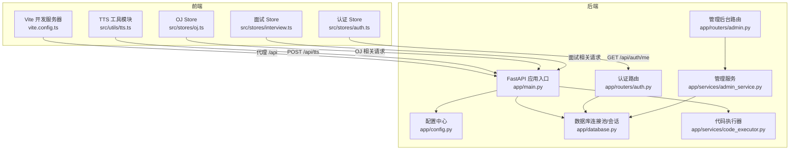
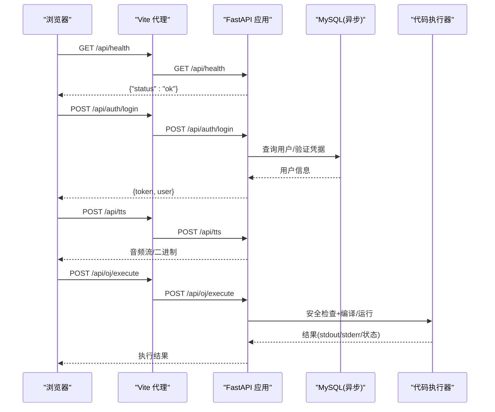
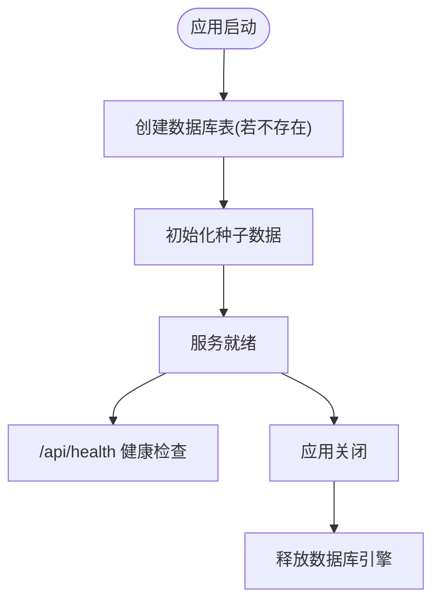
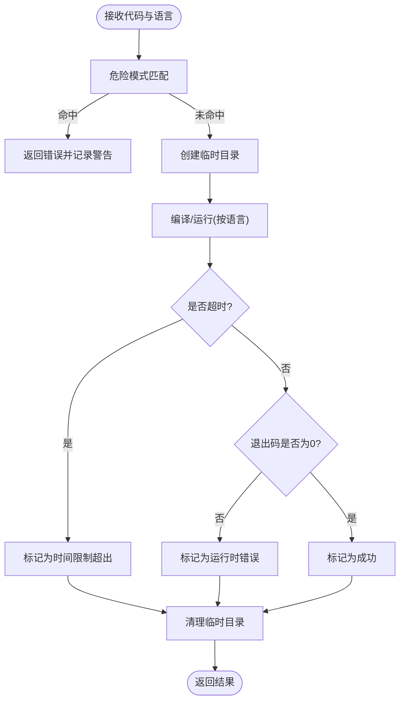
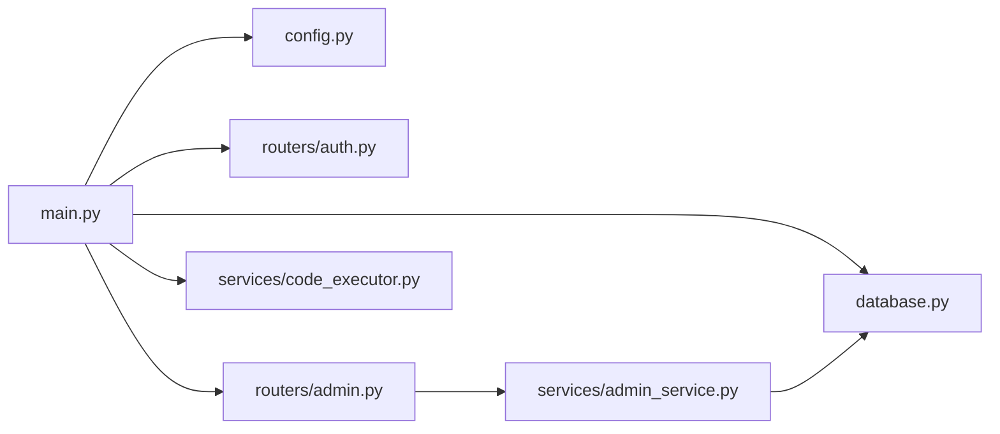

# 故障排查指南

<cite>
**本文引用的文件**   
- [backEnd/app/main.py](file://backEnd/app/main.py)
- [backEnd/app/config.py](file://backEnd/app/config.py)
- [backEnd/app/database.py](file://backEnd/app/database.py)
- [backEnd/alembic.ini](file://backEnd/alembic.ini)
- [backEnd/app/routers/auth.py](file://backEnd/app/routers/auth.py)
- [backEnd/app/routers/admin.py](file://backEnd/app/routers/admin.py)
- [backEnd/app/services/admin_service.py](file://backEnd/app/services/admin_service.py)
- [backEnd/app/services/code_executor.py](file://backEnd/app/services/code_executor.py)
- [frontEnd/vite.config.ts](file://frontEnd/vite.config.ts)
- [frontEnd/src/utils/tts.ts](file://frontEnd/src/utils/tts.ts)
- [frontEnd/src/stores/auth.ts](file://frontEnd/src/stores/auth.ts)
- [frontEnd/src/stores/oj.ts](file://frontEnd/src/stores/oj.ts)
- [frontEnd/src/stores/interview.ts](file://frontEnd/src/stores/interview.ts)
</cite>

## 目录
1. [简介](#简介)
2. [项目结构](#项目结构)
3. [核心组件](#核心组件)
4. [架构总览](#架构总览)
5. [详细组件分析](#详细组件分析)
6. [依赖关系分析](#依赖关系分析)
7. [性能考虑](#性能考虑)
8. [故障排查指南](#故障排查指南)
9. [结论](#结论)
10. [附录](#附录)

## 简介
本指南面向HR XF系统的运维与开发人员，提供系统级故障排查方法、日志分析技巧、性能问题定位流程以及健康检查与自动化巡检建议。内容覆盖数据库连接失败、API接口超时、前端资源加载错误等典型问题，并给出标准化的问题分类、优先级处理机制与升级流程。

## 项目结构
后端采用FastAPI + SQLAlchemy异步引擎，配置通过pydantic-settings从.env读取；前端使用Vite+Vue，开发环境通过代理转发/api到后端8000端口。

图表来源
- [frontEnd/vite.config.ts:13-20](file://frontEnd/vite.config.ts#L13-L20)
- [backEnd/app/main.py:44-73](file://backEnd/app/main.py#L44-L73)
- [backEnd/app/config.py:47-65](file://backEnd/app/config.py#L47-L65)
- [backEnd/app/database.py:31-43](file://backEnd/app/database.py#L31-L43)
- [backEnd/app/routers/auth.py:69-91](file://backEnd/app/routers/auth.py#L69-L91)
- [backEnd/app/routers/admin.py:39-45](file://backEnd/app/routers/admin.py#L39-L45)
- [backEnd/app/services/admin_service.py:14-42](file://backEnd/app/services/admin_service.py#L14-L42)
- [backEnd/app/services/code_executor.py:270-321](file://backEnd/app/services/code_executor.py#L270-L321)

章节来源
- [frontEnd/vite.config.ts:13-20](file://frontEnd/vite.config.ts#L13-L20)
- [backEnd/app/main.py:44-73](file://backEnd/app/main.py#L44-L73)
- [backEnd/app/config.py:47-65](file://backEnd/app/config.py#L47-L65)
- [backEnd/app/database.py:31-43](file://backEnd/app/database.py#L31-L43)

## 核心组件
- FastAPI 应用生命周期：启动时创建表与初始化种子数据，关闭时释放引擎。
- 配置中心：集中管理数据库、JWT、CORS、编译器路径等环境变量。
- 数据库层：异步引擎与连接池参数、会话工厂、异常回滚策略。
- 路由与服务：认证、管理后台、业务服务（如仪表盘统计）。
- 代码执行器：多语言安全沙箱执行，包含危险模式匹配与子进程隔离。
- 前端代理与请求封装：开发期代理、统一错误处理、流式响应解析。

章节来源
- [backEnd/app/main.py:27-49](file://backEnd/app/main.py#L27-L49)
- [backEnd/app/config.py:7-38](file://backEnd/app/config.py#L7-38)
- [backEnd/app/database.py:31-57](file://backEnd/app/database.py#L31-L57)
- [backEnd/app/routers/admin.py:39-45](file://backEnd/app/routers/admin.py#L39-L45)
- [backEnd/app/services/admin_service.py:14-42](file://backEnd/app/services/admin_service.py#L14-L42)
- [backEnd/app/services/code_executor.py:270-321](file://backEnd/app/services/code_executor.py#L270-L321)
- [frontEnd/src/stores/auth.ts:50-61](file://frontEnd/src/stores/auth.ts#L50-L61)
- [frontEnd/src/stores/oj.ts:104-113](file://frontEnd/src/stores/oj.ts#L104-L113)
- [frontEnd/src/stores/interview.ts:223-253](file://frontEnd/src/stores/interview.ts#L223-L253)

## 架构总览
下图展示关键请求链路与健康检查点，便于快速定位前后端交互与外部依赖。

图表来源
- [backEnd/app/main.py:87-89](file://backEnd/app/main.py#L87-L89)
- [backEnd/app/routers/auth.py:69-80](file://backEnd/app/routers/auth.py#L69-L80)
- [frontEnd/src/utils/tts.ts:22-28](file://frontEnd/src/utils/tts.ts#L22-L28)
- [backEnd/app/services/code_executor.py:270-321](file://backEnd/app/services/code_executor.py#L270-L321)

## 详细组件分析

### 健康检查与生命周期
- 健康检查接口：返回固定状态，用于负载均衡探针与自动化巡检。
- 生命周期钩子：启动阶段创建表与初始化种子数据，关闭阶段释放引擎。

图表来源
- [backEnd/app/main.py:27-49](file://backEnd/app/main.py#L27-L49)
- [backEnd/app/main.py:87-89](file://backEnd/app/main.py#L87-L89)

章节来源
- [backEnd/app/main.py:27-49](file://backEnd/app/main.py#L27-L49)
- [backEnd/app/main.py:87-89](file://backEnd/app/main.py#L87-L89)

### 配置与环境变量
- 数据库URL构造：根据主机、端口、用户名、密码、库名生成异步/同步URL。
- CORS白名单：逗号分隔字符串转换为列表。
- 编译器路径：优先使用.env配置，否则自动检测PATH。

章节来源
- [backEnd/app/config.py:47-65](file://backEnd/app/config.py#L47-L65)
- [backEnd/app/config.py:39-46](file://backEnd/app/config.py#L39-46)

### 数据库连接与会话
- 连接池参数：pool_pre_ping启用连接存活探测，pool_size与max_overflow控制并发。
- 会话工厂：expire_on_commit=False避免提交后失效。
- 依赖注入：get_db在异常时执行回滚并抛出异常。

章节来源
- [backEnd/app/database.py:31-43](file://backEnd/app/database.py#L31-L43)
- [backEnd/app/database.py:50-57](file://backEnd/app/database.py#L50-L57)

### 认证路由与错误处理
- 登录/注册：调用服务层进行凭据校验，异常转为HTTP状态码。
- 统一验证错误：自定义RequestValidationError处理器，避免二进制字段导致解码异常。

章节来源
- [backEnd/app/routers/auth.py:69-80](file://backEnd/app/routers/auth.py#L69-L80)
- [backEnd/app/main.py:76-84](file://backEnd/app/main.py#L76-L84)

### 管理后台与仪表盘
- 管理员权限校验：基于用户名或邮箱关键字的简易鉴权。
- 仪表盘统计：聚合用户、题目、帖子、面试会话数量及活跃指标。

章节来源
- [backEnd/app/routers/admin.py:26-34](file://backEnd/app/routers/admin.py#L26-34)
- [backEnd/app/services/admin_service.py:14-42](file://backEnd/app/services/admin_service.py#L14-L42)

### 代码执行器与安全策略
- 安全拦截：按语言定义危险模式集合，匹配即拒绝并记录警告日志。
- 子进程执行：线程池异步包装，超时判定为“时间限制超出”。
- 清理策略：临时目录在finally中删除，防止磁盘泄漏。

图表来源
- [backEnd/app/services/code_executor.py:154-167](file://backEnd/app/services/code_executor.py#L154-L167)
- [backEnd/app/services/code_executor.py:270-321](file://backEnd/app/services/code_executor.py#L270-L321)
- [backEnd/app/services/code_executor.py:220-267](file://backEnd/app/services/code_executor.py#L220-L267)

章节来源
- [backEnd/app/services/code_executor.py:154-167](file://backEnd/app/services/code_executor.py#L154-L167)
- [backEnd/app/services/code_executor.py:270-321](file://backEnd/app/services/code_executor.py#L270-L321)
- [backEnd/app/services/code_executor.py:220-267](file://backEnd/app/services/code_executor.py#L220-L267)

### 前端代理与请求封装
- 开发代理：/api转发至http://localhost:8000，解决跨域问题。
- 统一错误处理：非2xx响应抛出带detail的错误信息。
- 流式响应：面试对话SSE流式解析，逐块拼接文本。

章节来源
- [frontEnd/vite.config.ts:13-20](file://frontEnd/vite.config.ts#L13-L20)
- [frontEnd/src/stores/auth.ts:50-61](file://frontEnd/src/stores/auth.ts#L50-L61)
- [frontEnd/src/stores/oj.ts:104-113](file://frontEnd/src/stores/oj.ts#L104-L113)
- [frontEnd/src/stores/interview.ts:223-253](file://frontEnd/src/stores/interview.ts#L223-L253)

## 依赖关系分析
- 后端内部依赖：main导入各router与models；database依赖config；admin路由依赖admin_service与数据库会话。
- 外部依赖：MySQL数据库、可选MinIO（预留）、Deepseek API（预留）、编译器（python/gcc/g++/java/node）。

图表来源
- [backEnd/app/main.py:11-22](file://backEnd/app/main.py#L11-L22)
- [backEnd/app/routers/admin.py:1-19](file://backEnd/app/routers/admin.py#L1-19)
- [backEnd/app/services/admin_service.py:1-10](file://backEnd/app/services/admin_service.py#L1-10)
- [backEnd/app/services/code_executor.py:17-19](file://backEnd/app/services/code_executor.py#L17-19)

章节来源
- [backEnd/app/main.py:11-22](file://backEnd/app/main.py#L11-L22)
- [backEnd/app/routers/admin.py:1-19](file://backEnd/app/routers/admin.py#L1-19)
- [backEnd/app/services/admin_service.py:1-10](file://backEnd/app/services/admin_service.py#L1-10)
- [backEnd/app/services/code_executor.py:17-19](file://backEnd/app/services/code_executor.py#L17-19)

## 性能考虑
- 数据库连接池：合理设置pool_size与max_overflow，结合pool_pre_ping降低死连接影响。
- 慢查询定位：开启SQLAlchemy echo或调整alembic日志级别以捕获SQL语句。
- 代码执行器：线程池大小与子进程超时需与负载匹配，避免阻塞事件循环。
- 前端代理：开发期代理增加额外开销，生产环境应使用反向代理（如Nginx）直接暴露后端。

[本节为通用指导，不直接分析具体文件]

## 故障排查指南

### 常见问题与解决方案
- 数据库连接失败
  - 现象：启动时报错或请求返回500，控制台出现连接错误。
  - 排查要点：
    - 检查.env中的db_host/db_port/db_user/db_password/db_name是否正确。
    - 确认MySQL服务可达且账号权限正确。
    - 查看连接池参数与pool_pre_ping是否启用。
  - 参考位置：
    - [数据库URL构造:47-61](file://backEnd/app/config.py#L47-L61)
    - [连接池与会话工厂:31-43](file://backEnd/app/database.py#L31-L43)
    - [会话异常回滚:50-57](file://backEnd/app/database.py#L50-L57)

- API接口超时
  - 现象：前端请求长时间无响应或触发超时错误。
  - 排查要点：
    - 检查后端日志是否有长时间运行的任务（如代码执行器）。
    - 确认子进程超时阈值与线程池大小。
    - 前端代理是否引入额外延迟（开发期代理）。
  - 参考位置：
    - [子进程执行与超时处理:220-267](file://backEnd/app/services/code_executor.py#L220-L267)
    - [Vite代理配置:13-20](file://frontEnd/vite.config.ts#L13-L20)

- 前端资源加载错误
  - 现象：页面空白、静态资源404、跨域报错。
  - 排查要点：
    - 确认Vite代理目标地址与后端端口一致。
    - 检查CORS配置是否允许当前Origin。
    - 浏览器控制台查看Network与Console错误详情。
  - 参考位置：
    - [Vite代理配置:13-20](file://frontEnd/vite.config.ts#L13-L20)
    - [CORS配置:31-33](file://backEnd/app/config.py#L31-L33)

- 认证失败或Token无效
  - 现象：登录后立即被登出，访问受保护接口返回401/403。
  - 排查要点：
    - 检查登录接口返回的token是否保存至本地存储。
    - 验证/auth/me是否能正常返回用户信息。
    - 确认后端验证逻辑与JWT密钥配置。
  - 参考位置：
    - [登录接口:69-80](file://backEnd/app/routers/auth.py#L69-L80)
    - [获取当前用户:89-91](file://backEnd/app/routers/auth.py#L89-L91)
    - [前端认证Store初始化](file://frontEnd/src/stores/auth.ts:72-83)

- 管理后台功能异常
  - 现象：无法访问/stats或/users等管理接口。
  - 排查要点：
    - 确认当前用户是否满足管理员条件（用户名或邮箱包含“admin”）。
    - 检查数据库统计查询是否因数据量过大而缓慢。
  - 参考位置：
    - [管理员权限校验:26-34](file://backEnd/app/routers/admin.py#L26-34)
    - [仪表盘统计:14-42](file://backEnd/app/services/admin_service.py#L14-L42)

- 代码执行器拒绝或执行失败
  - 现象：提交代码后立即返回“安全策略拦截”或编译/运行错误。
  - 排查要点：
    - 检查危险模式匹配规则是否过于严格。
    - 确认编译器路径配置或PATH是否包含对应可执行文件。
    - 查看警告日志定位匹配到的片段。
  - 参考位置：
    - [安全拦截与日志:154-167](file://backEnd/app/services/code_executor.py#L154-167)
    - [编译器路径解析:173-197](file://backEnd/app/services/code_executor.py#L173-197)

章节来源
- [backEnd/app/config.py:47-61](file://backEnd/app/config.py#L47-L61)
- [backEnd/app/database.py:31-57](file://backEnd/app/database.py#L31-L57)
- [frontEnd/vite.config.ts:13-20](file://frontEnd/vite.config.ts#L13-L20)
- [backEnd/app/routers/auth.py:69-91](file://backEnd/app/routers/auth.py#L69-L91)
- [frontEnd/src/stores/auth.ts:72-83](file://frontEnd/src/stores/auth.ts#L72-L83)
- [backEnd/app/routers/admin.py:26-34](file://backEnd/app/routers/admin.py#L26-34)
- [backEnd/app/services/admin_service.py:14-42](file://backEnd/app/services/admin_service.py#L14-L42)
- [backEnd/app/services/code_executor.py:154-167](file://backEnd/app/services/code_executor.py#L154-L167)
- [backEnd/app/services/code_executor.py:173-197](file://backEnd/app/services/code_executor.py#L173-L197)

### 日志分析方法
- 后端Python日志
  - 代码执行器使用logging记录警告与调试信息，可通过标准输出或日志收集系统采集。
  - Alembic日志级别可在配置文件调整，便于追踪迁移过程。
  - 参考位置：
    - [代码执行器日志:164-180](file://backEnd/app/services/code_executor.py#L164-L180)
    - [Alembic日志配置:17-39](file://backEnd/alembic.ini#L17-L39)

- 前端浏览器控制台日志
  - 统一错误处理会抛出包含detail的错误信息，便于在Console中定位。
  - Network面板可查看请求状态码与响应体。
  - 参考位置：
    - [认证Store错误处理:50-61](file://frontEnd/src/stores/auth.ts#L50-61)
    - [OJ Store错误处理:104-113](file://frontEnd/src/stores/oj.ts#L104-113)

- Nginx访问日志（生产环境）
  - 建议启用access_log与error_log，结合请求URI与状态码进行统计分析。
  - 针对/api/*路径进行单独日志格式配置，便于关联前后端问题。

章节来源
- [backEnd/app/services/code_executor.py:164-180](file://backEnd/app/services/code_executor.py#L164-L180)
- [backEnd/alembic.ini:17-39](file://backEnd/alembic.ini#L17-L39)
- [frontEnd/src/stores/auth.ts:50-61](file://frontEnd/src/stores/auth.ts#L50-61)
- [frontEnd/src/stores/oj.ts:104-113](file://frontEnd/src/stores/oj.ts#L104-L113)

### 性能问题排查流程
- 慢查询分析
  - 开启SQLAlchemy echo或在数据库侧启用慢查询日志。
  - 对管理后台统计接口进行EXPLAIN分析，必要时添加索引。
  - 参考位置：
    - [仪表盘统计查询:14-42](file://backEnd/app/services/admin_service.py#L14-L42)

- 内存泄漏检测
  - 关注代码执行器的临时目录清理是否在finally中执行。
  - 监控Python进程内存增长，结合垃圾回收与对象引用情况。
  - 参考位置：
    - [临时目录清理:314-321](file://backEnd/app/services/code_executor.py#L314-L321)

- CPU使用率优化
  - 评估线程池大小与子进程并发度，避免CPU饱和。
  - 将耗时操作（如编译/运行）与主事件循环解耦。
  - 参考位置：
    - [线程池与异步包装:169-267](file://backEnd/app/services/code_executor.py#L169-L267)

章节来源
- [backEnd/app/services/admin_service.py:14-42](file://backEnd/app/services/admin_service.py#L14-L42)
- [backEnd/app/services/code_executor.py:314-321](file://backEnd/app/services/code_executor.py#L314-L321)
- [backEnd/app/services/code_executor.py:169-267](file://backEnd/app/services/code_executor.py#L169-L267)

### 问题分类与优先级处理机制
- 分类维度
  - 组件：前端、后端、数据库、第三方服务（如编译器、AI API）。
  - 类型：可用性（宕机/不可用）、性能（慢/超时）、安全性（越权/注入）、数据一致性（脏读/丢失）。
- 优先级定义
  - P0：全站不可用或核心功能完全阻断（如认证、健康检查失败）。
  - P1：主要功能严重降级（如登录可用但大部分接口超时）。
  - P2：次要功能异常（如管理后台部分查询缓慢）。
  - P3：体验类问题（UI显示异常、提示文案错误）。
- 处理流程
  - 发现与上报：通过健康检查告警或用户反馈。
  - 初步诊断：依据日志与监控定位范围。
  - 修复与验证：发布补丁并在预发环境验证。
  - 复盘与改进：更新文档与监控项。

[本节为通用流程，不直接分析具体文件]

### 标准化故障报告模板
- 基本信息：系统名称、版本、发生时间、影响范围。
- 现象描述：错误截图、日志片段、复现步骤。
- 根因分析：涉及的组件与变更历史。
- 处理措施：临时规避与长期修复方案。
- 后续改进：监控增强、测试补充、文档更新。

[本节为通用模板，不直接分析具体文件]

### 升级流程
- 变更评审：影响面评估与回滚策略。
- 灰度发布：小流量验证后再全量。
- 监控观察：健康检查、错误率、延迟分布。
- 回滚预案：一键回滚脚本与数据备份。

[本节为通用流程，不直接分析具体文件]

### 系统健康检查接口使用说明
- 接口：GET /api/health
- 预期响应：{"status": "ok"}
- 用途：负载均衡探针、自动化巡检、容器编排健康判断。
- 参考位置：
  - [健康检查实现:87-89](file://backEnd/app/main.py#L87-L89)

章节来源
- [backEnd/app/main.py:87-89](file://backEnd/app/main.py#L87-L89)

### 自动化巡检脚本建议
- 健康检查轮询：定时调用/api/health并记录状态与延迟。
- 关键接口抽样：随机选择若干业务接口进行可用性探测。
- 资源监控：收集CPU、内存、磁盘、连接池使用情况。
- 告警策略：连续失败阈值与恢复通知。

[本节为通用建议，不直接分析具体文件]

## 结论
本指南围绕HR XF系统的核心组件与常见故障场景，提供了从日志分析到性能优化的系统化排查方法。通过健康检查与自动化巡检，可有效提升系统稳定性与可观测性。建议在生产环境完善日志采集、监控告警与回滚预案，确保问题快速定位与恢复。

## 附录
- 常用命令与路径
  - 后端启动：参考项目根目录启动脚本。
  - 数据库迁移：使用Alembic配置文件进行迁移与回滚。
  - 前端开发：Vite代理已配置，无需额外跨域设置。

[本节为通用说明，不直接分析具体文件]